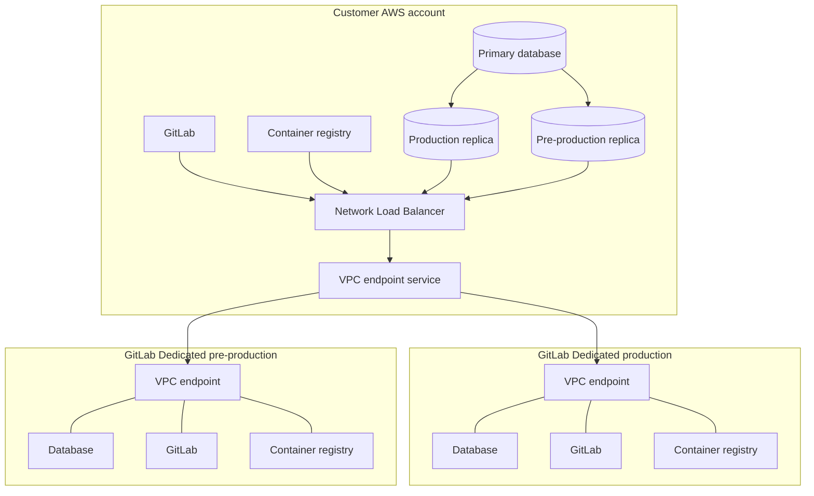



- Édition : GitLab Ultimate
- Offre : GitLab Dedicated



La migration commence lorsque votre instance GitLab Dedicated est créée. À partir de là, elle passe par une période de préparation, une période de réplication et deux bascules : pré-production, puis production. La bascule de pré-production répète le processus et vous donne un environnement pour tester les intégrations avant que la bascule de production ne complète la migration.

## Architecture de migration {#migration-architecture}

Durant la migration, deux tenants GitLab Dedicated, un tenant de pré-production et un tenant de production, se connectent à votre instance source unique. Vous fournissez les deux réplicas en lecture de base de données et la connectivité AWS de votre côté, et les deux tenants utilisent ce même chemin.

> [!note]
> Deux tenants GitLab Dedicated apparaissent dans le schéma, mais vous ne fournissez que votre unique instance de production. GitLab provisionne et maintient les deux tenants. Pour plus d'informations, consultez [les phases de migration](_index.md#migration-phases).

Le schéma montre des réplicas en lecture AWS RDS, ce qui est le cas lorsque votre source s'exécute dans AWS. Si votre source s'exécute sur un autre cloud ou sur site, vous créez les réplicas en lecture dans votre propre environnement et fournissez la connectivité via Internet ou un VPN IPsec site à site.

## Découverte, planification et création d'instance {#discovery-planning-and-instance-creation}

Avant de finaliser votre achat de GitLab Dedicated, votre architecte de solutions ou votre chargé de compte vous aide à collecter des informations sur votre environnement actuel avec le [GitLab Discovery Toolkit](https://gitlab.com/gitlab-com/gl-infra/gitlab-dedicated/customer-tools/gitlab-discovery-toolkit), [GitLab Evaluate](https://gitlab.com/gitlab-org/professional-services-automation/tools/utilities/evaluate) et un bundle de journaux tel que [GitLabSOS](https://gitlab.com/gitlab-com/support/toolbox/gitlabsos). GitLab évalue la faisabilité de la migration, le dimensionnement et le calendrier à partir de ces résultats, et identifie les exigences que vous devez satisfaire.

Une fois votre achat finalisé, vous créez vous-même votre instance GitLab Dedicated, ou GitLab Professional Services la crée avec vous si vous préférez. Les décisions que vous prenez lors de la création, telles que vos régions AWS et votre méthode d'accès, ont une incidence sur la migration. Réglez-les avec votre équipe de migration au préalable. Pour plus d'informations, consultez [créer votre instance GitLab Dedicated](../create_instance/_index.md) et [les exigences de migration Geo](requirements.md#instance-decisions).

## Préparation {#preparation}

La préparation est la phase durant laquelle vous construisez tout ce dont dépend la réplication. Vous pouvez effectuer ce travail vous-même ou avec GitLab Professional Services. Pour plus d'informations, consultez [les exigences de migration Geo](requirements.md).

La réplication ne peut pas démarrer tant que vous n'avez pas complété les éléments suivants :

1. Configurez votre instance GitLab Self-Managed en tant que site principal Geo, afin que la vérification puisse commencer à générer des checksums pour vos données existantes.
1. Déplacez tous les types de données utilisés vers le stockage objet.
1. Alignez vos noms de stockage Gitaly avec les noms pris en charge par GitLab Dedicated.
1. Créez les deux réplicas en lecture de base de données et fournissez la connectivité depuis GitLab Dedicated vers ceux-ci et vers votre instance GitLab. Si votre source est dans AWS, un seul module Terraform fait les deux.

Vous pouvez effectuer les éléments suivants en parallèle et les finaliser avant la bascule de pré-production plutôt qu'avant la réplication :

- Connectivité sortante pour les intégrations qui atteignent des cibles privées, y compris le proxy sortant si vous avez besoin de plus de 10 endpoints.
- Remplacement des fonctionnalités non prises en charge par GitLab Dedicated. Commencez la migration depuis LDAP tôt si cela vous concerne.

Cette phase prend généralement le plus de temps, et sa durée dépend bien plus de votre environnement que de votre volume de données.

## Réplication Geo {#geo-replication}

Une fois la connectivité en place et votre instance configurée en tant que site principal Geo, la réplication vers le site secondaire GitLab Dedicated commence.

Votre instance source continue de servir les utilisateurs tout au long du processus. Aucune interruption de service ne se produit durant la réplication. Vous surveillez la progression depuis votre instance GitLab Self-Managed dans la section Sites Geo de la zone d'administration. Pour plus d'informations, consultez [Geo](../../geo/_index.md).

La réplication démarre avec des limites de concurrence conservatrices. Dans l'entrée du site secondaire de votre zone d'administration, utilisez les paramètres de réglage pour les augmenter au fur et à mesure que vous surveillez la charge sur votre site principal et confirmez la stabilité. Pour plus d'informations, consultez [la modification des valeurs de concurrence de synchronisation et de vérification](../../geo/replication/tuning.md#changing-the-syncverification-concurrency-values).

La durée est principalement déterminée par le volume de données dans le stockage objet. Pour la planification initiale, supposez un taux approximatif d'environ 10 To de données de stockage objet par semaine, puis utilisez le taux observé une fois la réplication en cours. La bande passante réseau, le nombre d'objets et les limites de débit configurées affectent également la durée. Votre équipe de migration confirmera une estimation pour vos données.

La plupart des erreurs de synchronisation transitoires se résolvent au fur et à mesure que la réplication se poursuit.

La réplication est prête pour la bascule de pré-production lorsque chaque type de données affiche au moins 99,9 % de synchronisation et de vérification dans la section Sites Geo de la zone d'administration. Vous et GitLab Professional Services examinez et résolvez ensemble les éléments restants avant la bascule de production, qui vise une synchronisation complète. Pour plus d'informations, consultez [le dépannage de la synchronisation et de la vérification](../../geo/replication/troubleshooting/synchronization_verification.md).

## Alignement des versions {#version-alignment}

Au moment où la réplication démarre, votre instance source et les deux tenants GitLab Dedicated exécutent la même version de GitLab.

Durant la réplication, votre équipe de migration coordonne les mises à niveau avec vous, afin que votre instance source et les tenants GitLab Dedicated évoluent ensemble et restent alignés. En général, une mise à niveau coordonnée se produit durant cette période.

De la bascule de pré-production jusqu'à la bascule de production, les mises à niveau sont gelées des deux côtés, afin que rien ne change sous vos tests.

Après la bascule de production, les mises à niveau restantes portent votre instance à la version qu'exécute le reste de la flotte GitLab Dedicated. Pour plus d'informations, consultez [la mise à niveau différée](post_cutover.md#version-catch-up). GitLab Dedicated exécute la version mineure précédente par rapport à la release GitLab actuelle. Pour plus d'informations, consultez le [modèle de versionnage](../releases.md#versioning-model). Pour les dates de mise à niveau prévues, consultez le [portail d'informations GitLab Dedicated](https://gitlab-com.gitlab.io/cs-tools/gitlab-cs-tools/dedicated-info-portal/).

## Bascule de pré-production {#pre-production-cutover}

La bascule de pré-production est une répétition complète de la bascule de production, effectuée contre le tenant de pré-production GitLab Dedicated.

La répétition remplit deux objectifs. Elle valide le processus de bout en bout et mesure la durée de la véritable bascule, afin que la bascule de production ne réserve aucune surprise. Elle vous fournit également une instance opérationnelle sur laquelle tester vos intégrations avant la bascule de production.

La répétition suit la même séquence que la bascule de production, contre le tenant de pré-production, de sorte que votre instance source continue de servir les utilisateurs et que votre DNS de production reste intact. Votre équipe de migration vous confirme le nom d'hôte à utiliser pour accéder au tenant de pré-production, ainsi que toute configuration du fournisseur d'identité requise.

La bascule de pré-production vise une complétude des données à 99,9 %, plutôt que les 100 % visés pour la bascule de production. Les échecs de synchronisation mineurs peuvent donc être mis de côté durant la répétition et sont traités avant la bascule de production.

Le gel des mises à niveau commence à ce stade et se poursuit jusqu'à la bascule de production.

## Période de test {#testing-period}

Après la bascule de pré-production, vous validez l'instance migrée. Cette période dure généralement plusieurs semaines.

Validez les éléments suivants :

- Connexion via votre fournisseur d'identité
- Navigation et création de projets
- Clonage et push via HTTPS et SSH
- Exécution de pipelines CI/CD
- Accès au registre de conteneurs avec `docker login`, pull et push
- Livraison de webhooks vers vos cibles internes
- Livraison d'e-mails
- Toute intégration atteignant des cibles privées
- Connectivité depuis différents emplacements sur site ou VPN

Convenez avec votre équipe de migration des critères d'acceptation ou de refus pour la bascule de production avant la date de bascule.

Maintenez la période de gel aussi courte que possible, car votre instance ne reçoit pas de mises à niveau durant celle-ci.

## Bascule de production {#production-cutover}

La bascule de production est planifiée avec vous et nécessite une fenêtre d'interruption de service, car aucune donnée ne peut être écrite durant cette période.

La bascule se déroule dans la séquence suivante :

1. Vous placez votre instance source en mode maintenance, ce qui empêche l'écriture de nouvelles données.
1. La réplication termine les éléments restants.
1. GitLab copie votre base de données source vers la base de données GitLab Dedicated. La durée dépend du volume de la base de données et est mesurée lors de la répétition de pré-production.
1. GitLab reconfigure le tenant et le promeut en tant que site principal.
1. Si vous utilisez un [domaine personnalisé](../configure_instance/network_security.md#custom-domains), vous mettez à jour vos enregistrements DNS pour pointer vers GitLab Dedicated.
1. GitLab reconfigure le site afin que l'émission des certificats soit finalisée pour vos domaines personnalisés.
1. Vous vous connectez au site et vous authentifiez via votre fournisseur d'identité. L'instance est toujours en mode maintenance, vous pouvez donc vérifier l'accès et consulter vos projets et dépôts avant que des données puissent être écrites.
1. Vous désactivez le mode maintenance.
1. Vous effectuez vos vérifications d'écriture, telles que le push vers un dépôt, l'exécution d'un pipeline et le push vers le registre de conteneurs.

> [!warning]
> Une fois le mode maintenance levé, l'instance est activée en écriture. Revenir à votre instance source implique la perte de toutes les données écrites après ce point. Pour cette raison, la décision d'acceptation ou de refus est prise avant la bascule.

## Administration après la migration {#administration-after-migration}

Après la migration, vous conservez l'administration de l'application :

- Accès administrateur via l'interface utilisateur GitLab
- Gestion des utilisateurs et des groupes
- Administration des projets et des dépôts
- Configuration CI/CD

GitLab prend en charge l'administration de l'infrastructure :

- Gestion de l'infrastructure sous-jacente. Vous n'avez pas accès au shell des serveurs.
- Mises à niveau. Votre instance est mise à niveau durant sa fenêtre de maintenance assignée et vous ne pouvez pas choisir les dates de mise à niveau. Pour plus d'informations, consultez [la maintenance](../maintenance.md) et les [releases](../releases.md).
- Certains paramètres sont gérés dans Switchboard plutôt que dans la zone d'administration. Pour plus d'informations, consultez la [présentation du tenant](../tenant_overview.md).

## Sujets connexes {#related-topics}

- [Migration Geo vers GitLab Dedicated](_index.md)
- [Exigences de migration Geo](requirements.md)
- [Collecter les secrets de migration Geo](secrets.md)
- [Activités post-migration](post_cutover.md)
