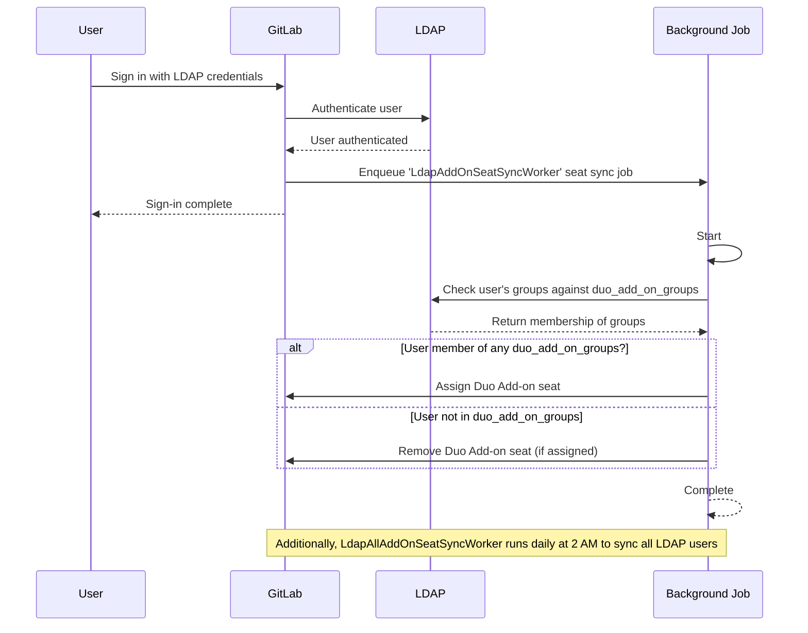



- Édition : GitLab Premium, GitLab Ultimate
- Offre : GitLab Self-Managed





- [Introduit](https://gitlab.com/gitlab-org/gitlab/-/merge_requests/175101) dans GitLab 17.8.



Les administrateurs GitLab peuvent configurer l'attribution automatique des sièges du module complémentaire GitLab Duo en fonction de l'appartenance aux groupes LDAP. Lorsqu'elle est activée, GitLab attribue ou supprime automatiquement les sièges du module complémentaire pour les utilisateurs lorsqu'ils se connectent, en fonction de leur appartenance aux groupes LDAP.

## Workflow de gestion des sièges {#seat-management-workflow}

1. **Configuration** : Les administrateurs spécifient les groupes LDAP dans les `duo_add_on_groups` [paramètres de configuration](#configure-gitlab-duo-add-on-seat-management).
1. **Seat synchronization** : GitLab vérifie les appartenances aux groupes LDAP de deux manières :
   - **On user sign-in** : Lorsqu'un utilisateur se connecte via LDAP, GitLab vérifie immédiatement ses appartenances aux groupes.
   - **Scheduled sync** : GitLab synchronise automatiquement tous les utilisateurs LDAP quotidiennement à 02h00 pour s'assurer que les attributions de sièges sont à jour, même sans connexion des utilisateurs.
1. **Seat assignment** :
   - Si l'utilisateur appartient à un groupe répertorié dans `duo_add_on_groups`, un siège du module complémentaire lui est attribué (s'il n'en a pas déjà un).
   - Si l'utilisateur n'appartient à aucun groupe répertorié, son siège du module complémentaire est supprimé (s'il en avait un précédemment).
1. **Async processing** : L'attribution et la suppression des sièges sont traitées de manière asynchrone afin de ne pas interrompre le flow principal de connexion.

Le diagramme suivant illustre le workflow :



## Configurer la gestion des sièges du module complémentaire GitLab Duo {#configure-gitlab-duo-add-on-seat-management}

Pour activer la gestion des sièges du module complémentaire avec LDAP :

1. Ouvrez le fichier de configuration GitLab que vous avez modifié pour l'[installation](auth/ldap/ldap_synchronization.md#gitlab-duo-add-on-for-groups).
1. Ajoutez le paramètre `duo_add_on_groups` à la configuration de votre serveur LDAP.
1. Spécifiez un tableau de noms de groupes LDAP devant disposer de sièges du module complémentaire GitLab Duo.

L'exemple suivant est une configuration `gitlab.rb` pour les installations de packages Linux :

```ruby
gitlab_rails['ldap_servers'] = {
  'main' => {
    # Additional LDAP settings removed for readability
    'duo_add_on_groups' => ['duo_users', 'admins'],
  }
}
```
