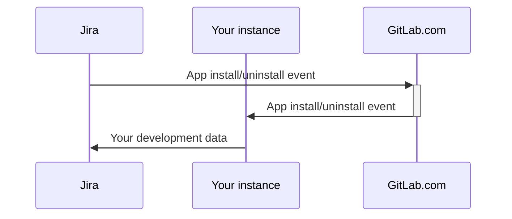



- Niveau :  Free, Premium, Ultimate
- Offre :  GitLab Self-Managed



> [!note]
> Cette page contient la documentation administrateur de l'application GitLab pour Jira Cloud. Pour la documentation utilisateur, voir [Application GitLab pour Jira Cloud](../../integration/jira/connect-app.md).

Avec l'application [GitLab pour Jira Cloud](https://marketplace.atlassian.com/apps/1221011/gitlab-com-for-jira-cloud?tab=overview&hosting=cloud), vous pouvez connecter GitLab et Jira Cloud pour synchroniser les informations de développement en temps réel. Vous pouvez consulter ces informations dans le [panneau de développement Jira](../../integration/jira/development_panel.md).

Pour configurer l'application GitLab pour Jira Cloud sur votre instance GitLab Self-Managed, effectuez l'une des opérations suivantes :

- [Installez l'application GitLab pour Jira Cloud depuis l'Atlassian Marketplace](#install-the-gitlab-for-jira-cloud-app-from-the-atlassian-marketplace) (GitLab 15.7 et versions ultérieures).
- [Installez l'application GitLab pour Jira Cloud manuellement](#install-the-gitlab-for-jira-cloud-app-manually).

<i class="fa-youtube-play" aria-hidden="true"></i> Pour une vue d'ensemble, voir :

- [Installation de l'application GitLab pour Jira Cloud depuis l'Atlassian Marketplace pour une instance GitLab Self-Managed](https://youtu.be/RnDw4PzmdW8?list=PL05JrBw4t0Koazgli_PmMQCER2pVH7vUT)
  <!-- Video published on 2024-10-30 -->
- [Installation manuelle de l'application GitLab pour Jira Cloud pour une instance GitLab Self-Managed](https://youtu.be/fs02xS8BElA?list=PL05JrBw4t0Koazgli_PmMQCER2pVH7vUT)
  <!-- Video published on 2024-10-30 -->

Les vidéos ci-dessus présentent l'ancienne [interface Universal Plugin Manager](https://community.atlassian.com/forums/Community-Announcements-articles/Cloud-admins-we-re-making-app-management-easier/ba-p/2806285), qui peut ne pas être disponible sur les instances Jira Cloud plus récentes. Les instructions suivantes couvrent les interfaces de gestion des applications anciennes et nouvelles.

Si vous [installez l'application GitLab pour Jira Cloud depuis l'Atlassian Marketplace](#install-the-gitlab-for-jira-cloud-app-from-the-atlassian-marketplace), vous pouvez utiliser la [chaîne d'outils de projet](https://support.atlassian.com/jira-software-cloud/docs/what-is-the-connections-feature/) développée et maintenue par Atlassian pour [lier des dépôts GitLab à des projets Jira](https://support.atlassian.com/jira-software-cloud/docs/link-repositories-to-a-project/#Link-repositories-using-the-toolchain-feature). La chaîne d'outils de projet n'affecte pas la façon dont les informations de développement sont synchronisées entre GitLab et Jira Cloud.

Pour Jira Data Center ou Jira Server, utilisez le [connecteur Jira DVCS](../../integration/jira/dvcs/_index.md) développé et maintenu par Atlassian.

## Configurer l'authentification OAuth {#set-up-oauth-authentication}

Que vous souhaitiez installer l'application GitLab pour Jira Cloud [depuis l'Atlassian Marketplace](#install-the-gitlab-for-jira-cloud-app-from-the-atlassian-marketplace) ou [manuellement](#install-the-gitlab-for-jira-cloud-app-manually), vous devez créer une application OAuth.

Prérequis :

- Accès administrateur.

Pour créer une application OAuth sur votre instance GitLab Self-Managed :

1. Dans le coin supérieur droit, sélectionnez **Admin**.
1. Dans la barre latérale gauche, sélectionnez **Applications**.
1. Sélectionnez **New application**.
1. Dans **Redirect URI** :
   - Si vous installez l'application depuis l'Atlassian Marketplace, saisissez `https://gitlab.com/-/jira_connect/oauth_callbacks`.
   - Si vous installez l'application manuellement, saisissez `<instance_url>/-/jira_connect/oauth_callbacks` et remplacez `<instance_url>` par l'URL de votre instance.
1. Décochez les cases **Fiables** et **Confidentiel**.

   > [!note]
   > Vous devez décocher ces cases pour éviter les [erreurs de connexion](jira_cloud_app_troubleshooting.md#error-failed-to-sign-in-to-gitlab).

1. Dans **Périmètre d'accès**, cochez uniquement la case `api`.
1. Sélectionnez **Enregistrer l'application**.
1. Copiez la valeur de **Identifiant de l'application**.
1. Dans la barre latérale gauche, sélectionnez **Paramètres** > **Général**.
1. Développez **Application GitLab pour Jira**.
1. Collez la valeur de **Identifiant de l'application** dans **ID de l'application Jira Connect**.
1. Sélectionnez **Sauvegarder les modifications**.

## Exigences relatives aux utilisateurs Jira {#jira-user-requirements}



- Prise en charge du groupe `org-admins` [introduite](https://gitlab.com/gitlab-org/gitlab/-/issues/420687) dans GitLab 16.6.



Dans votre [organisation Atlassian](https://admin.atlassian.com), vous devez vous assurer que l'utilisateur Jira utilisé pour configurer l'application GitLab pour Jira Cloud est membre de l'un ou l'autre des groupes suivants :

- Le groupe Organization Administrators (`org-admins`). Les nouvelles organisations Atlassian utilisent la [gestion centralisée des utilisateurs](https://support.atlassian.com/user-management/docs/give-users-admin-permissions/#Centralized-user-management-content), qui contient le groupe `org-admins`. Les organisations Atlassian existantes sont en cours de migration vers la gestion centralisée des utilisateurs. Si disponible, vous devriez utiliser le groupe `org-admins` pour indiquer quels utilisateurs Jira peuvent gérer l'application GitLab pour Jira Cloud. Vous pouvez également utiliser le groupe `site-admins`.
- Le groupe Site Administrators (`site-admins`). Le groupe `site-admins` était utilisé avec la [gestion des utilisateurs d'origine](https://support.atlassian.com/user-management/docs/give-users-admin-permissions/#Original-user-management-content).

Si nécessaire :

1. [Créez votre groupe préféré](https://support.atlassian.com/user-management/docs/create-groups/).
1. [Modifiez le groupe](https://support.atlassian.com/user-management/docs/edit-a-group/) pour ajouter votre utilisateur Jira en tant que membre.
1. Si vous avez personnalisé vos permissions globales dans Jira, vous devrez peut-être également accorder la [permission `Browse users and groups`](https://confluence.atlassian.com/jirakb/unable-to-browse-for-users-and-groups-120521888.html) à l'utilisateur Jira.

## Installer l'application GitLab pour Jira Cloud depuis l'Atlassian Marketplace {#install-the-gitlab-for-jira-cloud-app-from-the-atlassian-marketplace}



- Introduit dans GitLab 15.7.



Vous pouvez utiliser l'application officielle GitLab pour Jira Cloud de l'Atlassian Marketplace avec votre instance GitLab Self-Managed.

Avec cette méthode :

- GitLab.com [gère les événements du cycle de vie d'installation et de désinstallation](#gitlabcom-handling-of-app-lifecycle-events) envoyés depuis Jira Cloud et les transfère à votre instance GitLab. Toutes les données de votre instance GitLab Self-Managed sont toujours envoyées directement à Jira Cloud.
- GitLab.com [gère les liens de création de branches](#gitlabcom-handling-of-branch-creation) en les redirigeant vers votre instance.
- Avec toute version de GitLab antérieure à 17.2, il n'est pas possible de créer des branches depuis Jira Cloud sur des instances GitLab Self-Managed. Pour plus d'informations, voir le [ticket 391432](https://gitlab.com/gitlab-org/gitlab/-/issues/391432).

Vous pouvez également [installer l'application GitLab pour Jira Cloud manuellement](#install-the-gitlab-for-jira-cloud-app-manually) si :

- Votre instance ne remplit pas les [prérequis](#prerequisites).
- Vous ne souhaitez pas utiliser l'annonce officielle de l'Atlassian Marketplace.
- Vous ne souhaitez pas que GitLab.com [gère les événements du cycle de vie de l'application](#gitlabcom-handling-of-app-lifecycle-events) ni qu'il sache que votre instance a installé l'application.
- Vous ne souhaitez pas que GitLab.com [redirige les liens de création de branches](#gitlabcom-handling-of-branch-creation) vers votre instance.

### Prérequis {#prerequisites}

- L'instance doit être accessible publiquement.
- L'instance doit être sur GitLab version 15.7 ou ultérieure.
- Vous devez configurer l'[authentification OAuth](#set-up-oauth-authentication).
- Votre instance GitLab doit utiliser HTTPS et votre certificat GitLab doit être approuvé publiquement ou contenir le certificat de chaîne complète.
- Votre configuration réseau doit autoriser :
  - Les connexions sortantes de votre instance GitLab Self-Managed vers Jira Cloud ([adresses IP Atlassian](https://support.atlassian.com/organization-administration/docs/ip-addresses-and-domains-for-atlassian-cloud-products/#Outgoing-Connections))
  - Les connexions entrantes et sortantes entre votre instance GitLab Self-Managed et GitLab.com ([adresses IP GitLab.com](../../user/gitlab_com/_index.md#ip-range))
  - Pour les instances derrière un pare-feu :
    1. Configurez un [proxy inverse](#using-a-reverse-proxy) accessible depuis Internet devant votre instance GitLab Self-Managed.
    1. Configurez le proxy inverse pour autoriser les connexions entrantes depuis GitLab.com ([adresses IP GitLab.com](../../user/gitlab_com/_index.md#ip-range))
    1. Assurez-vous que votre instance GitLab Self-Managed peut toujours effectuer les connexions sortantes décrites précédemment.
- L'utilisateur Jira qui installe et configure l'application doit satisfaire certaines [exigences](#jira-user-requirements).

### Configurer votre instance pour l'installation depuis l'Atlassian Marketplace {#set-up-your-instance-for-atlassian-marketplace-installation}

[Prérequis](#prerequisites)

Pour configurer votre instance GitLab Self-Managed pour l'installation depuis l'Atlassian Marketplace dans GitLab 15.7 et versions ultérieures :

1. Dans le coin supérieur droit, sélectionnez **Admin**.
1. Dans la barre latérale gauche, sélectionnez **Paramètres** > **Général**.
1. Développez **Application GitLab pour Jira**.
1. Dans **URL du proxy Jira Connect**, saisissez `https://gitlab.com` pour installer l'application depuis l'Atlassian Marketplace.
1. Sélectionnez **Sauvegarder les modifications**.

### Lier votre instance {#link-your-instance}

[Prérequis](#prerequisites)

Pour lier votre instance GitLab Self-Managed à l'application GitLab pour Jira Cloud :

1. Installez l'[application GitLab pour Jira Cloud](https://marketplace.atlassian.com/apps/1221011/gitlab-com-for-jira-cloud?tab=overview&hosting=cloud).
1. [Configurez l'application GitLab pour Jira Cloud](../../integration/jira/connect-app.md#configure-the-gitlab-for-jira-cloud-app).
1. Facultatif. [Vérifiez si Jira Cloud est maintenant lié](#check-if-jira-cloud-is-linked).

#### Vérifier si Jira Cloud est lié {#check-if-jira-cloud-is-linked}

Vous pouvez utiliser la [console Rails](../operations/rails_console.md#starting-a-rails-console-session) pour vérifier si Jira Cloud est lié à :

- Un groupe spécifique :

  ```ruby
  JiraConnectSubscription.where(namespace: Namespace.by_path('group/subgroup'))
  ```

- Un projet spécifique :

  ```ruby
  Project.find_by_full_path('path/to/project').jira_subscription_exists?
  ```

- N'importe quel groupe :

  ```ruby
  installation = JiraConnectInstallation.find_by_base_url("https://customer_name.atlassian.net")
  installation.subscriptions
  ```

## Installer l'application GitLab pour Jira Cloud manuellement {#install-the-gitlab-for-jira-cloud-app-manually}



- La méthode d'installation manuelle basée sur Connect a été [supprimée](https://gitlab.com/gitlab-org/gitlab-jira-forge/-/work_items/9) dans GitLab 19.0.



> [!warning]
> La précédente méthode d'installation manuelle reposait sur le mode de développement Atlassian Connect. Atlassian a [désactivé les installations privées basées sur Connect le 31/03/2026](https://www.atlassian.com/blog/developer/announcing-connect-end-of-support-timeline-and-next-steps). Si vous avez précédemment installé l'application manuellement avec le workflow **App descriptor URL**, migrez vers l'installation basée sur Forge décrite dans cette section.

Installez l'application GitLab pour Jira Cloud manuellement si vous ne pouvez pas [utiliser l'annonce officielle de l'Atlassian Marketplace](#install-the-gitlab-for-jira-cloud-app-from-the-atlassian-marketplace). Par exemple, si :

- Votre instance ne remplit pas les [prérequis du Marketplace](#prerequisites).
- Vous ne souhaitez pas que GitLab.com [gère les événements du cycle de vie de l'application](#gitlabcom-handling-of-app-lifecycle-events) ni qu'il sache que votre instance a installé l'application.
- Vous ne souhaitez pas que GitLab.com [redirige les liens de création de branches](#gitlabcom-handling-of-branch-creation) vers votre instance.

La méthode d'installation manuelle est désormais basée sur [Atlassian Forge](https://developer.atlassian.com/platform/forge/). Vous publiez une copie privée de l'[application GitLab pour Jira Cloud Forge](https://gitlab.com/gitlab-org/gitlab-jira-forge) sous votre propre compte développeur Atlassian, pointant vers votre instance GitLab Self-Managed ou GitLab Dedicated.

### Prérequis {#prerequisites-1}

- L'instance doit être accessible publiquement via HTTPS, avec un certificat approuvé publiquement.
- Vous devez configurer l'[authentification OAuth](#set-up-oauth-authentication).
- Votre configuration réseau doit autoriser :
  - Les connexions HTTPS entrantes depuis Jira Cloud vers `<instance_url>/-/jira_connect` ([adresses IP Atlassian](https://support.atlassian.com/organization-administration/docs/ip-addresses-and-domains-for-atlassian-cloud-products/#Outgoing-Connections)).
  - Les connexions HTTPS sortantes de votre instance GitLab vers `*.atlassian.net` pour envoyer les données de développement à Jira.
  - Pour les instances derrière un pare-feu :
    1. Configurez un [proxy inverse](#using-a-reverse-proxy) accessible depuis Internet devant votre instance GitLab Self-Managed.
    1. Configurez le proxy inverse pour autoriser les connexions entrantes depuis Jira Cloud.
    1. Assurez-vous que votre instance GitLab Self-Managed peut toujours effectuer les connexions sortantes décrites précédemment.
- Les instances entièrement isolées du réseau ne peuvent pas utiliser l'intégration. Le chemin sortant vers `*.atlassian.net` est requis pour le panneau de développement et les autres surfaces côté Jira.
- L'utilisateur Jira qui installe et configure l'application doit satisfaire certaines [exigences](#jira-user-requirements).
- Un compte développeur Atlassian et un [jeton API Atlassian](https://id.atlassian.com/manage-profile/security/api-tokens) pour le Forge CLI.
- Une machine avec [Node.js 22 LTS](https://nodejs.org/) , le [Forge CLI](https://developer.atlassian.com/platform/forge/getting-started/), `envsubst`, `git` et `curl`.

### Configurer votre instance pour l'installation manuelle {#set-up-your-instance-for-manual-installation}

[Prérequis](#prerequisites-1)

Pour configurer votre instance GitLab Self-Managed pour l'installation manuelle :

1. Dans le coin supérieur droit, sélectionnez **Admin**.
1. Dans la barre latérale gauche, sélectionnez **Paramètres** > **Général**.
1. Développez **Application GitLab pour Jira**.
1. Laissez le champ **URL du proxy Jira Connect** vide pour installer l'application manuellement.
1. Sélectionnez **Sauvegarder les modifications**.

### Publier une application Forge privée {#publish-a-private-forge-app}

Pour publier une copie privée de l'application GitLab pour Jira Cloud Forge et l'installer sur votre site Jira :

1. Clonez le dépôt [`gitlab-jira-forge`](https://gitlab.com/gitlab-org/gitlab-jira-forge) :

   ```shell
   git clone --depth 1 https://gitlab.com/gitlab-org/gitlab-jira-forge.git
   cd gitlab-jira-forge
   ```

1. Exportez les variables d'environnement requises. Remplacez les valeurs d'exemple par l'URL de votre instance GitLab, le site Jira et vos identifiants Atlassian :

   ```shell
   export GITLAB_URL=https://gitlab.example.com
   export JIRA_SITE=acme.atlassian.net
   export FORGE_EMAIL=admin@example.com
   export FORGE_API_TOKEN=<your-atlassian-api-token>
   ```

1. Exécutez le script wrapper pour enregistrer, déployer et installer l'application :

   ```shell
   ./scripts/install-self-managed.sh
   ```

   Le wrapper :
   - Vérifie les outils et variables requis.
   - Exécute `forge register` lors de la première utilisation pour créer une application Forge sous votre compte Atlassian.
   - Génère `manifest.yml` à partir du modèle, associé à votre `GITLAB_URL`.
   - Exécute `forge deploy -e production`.
   - Exécute `forge install --site $JIRA_SITE --product jira`.

   Le script met en cache l'`APP_ID` enregistré dans `.env.self-managed`. Sauvegardez ce fichier : si vous le perdez, vous devrez réenregistrer l'application, ce qui force tous les sites Jira installés à réinstaller.

Pour des instructions pas à pas, les commandes `forge` manuelles, le dépannage et le workflow de mise à niveau, consultez le [guide d'installation Self-Managed](https://gitlab.com/gitlab-org/gitlab-jira-forge/-/blob/main/docs/self-managed-install.md) dans le dépôt `gitlab-jira-forge`.

Une fois l'application installée, [configurez l'application GitLab pour Jira Cloud](../../integration/jira/connect-app.md#configure-the-gitlab-for-jira-cloud-app) dans Jira pour lier vos espaces de nommage GitLab.

### Mettre à jour l'application installée manuellement {#update-the-manually-installed-app}

Pour intégrer les modifications de manifeste en amont dans votre application Forge privée, réexécutez le wrapper avec `--update` :

```shell
./scripts/install-self-managed.sh --update
```

Le script avance rapidement le clone local, régénère le manifeste et redéploie l'application. Pour plus d'informations sur les mises à niveau de versions mineures et majeures, voir [Mise à niveau](https://gitlab.com/gitlab-org/gitlab-jira-forge/-/blob/main/docs/self-managed-install.md#upgrading) dans le guide d'installation Self-Managed.

## Connecter plusieurs instances GitLab {#connect-multiple-gitlab-instances}

Utilisez l'application GitLab pour Jira pour connecter plusieurs instances GitLab à une seule instance Jira Cloud. Les méthodes d'installation dépendent des instances que vous souhaitez connecter.

Prérequis :

- Chaque instance nécessite une authentification OAuth distincte.
- Vous devez satisfaire les prérequis de chaque méthode d'installation.

Pour GitLab.com + GitLab Self-Managed :

- Sur GitLab.com :  Utilisez l'installation depuis l'Atlassian Marketplace.
- Sur les instances GitLab Self-Managed :  Installez l'application manuellement.

Pour plusieurs instances GitLab Self-Managed :

- Sur la première instance, soit :  Utilisez l'installation depuis l'Atlassian Marketplace ou installez l'application manuellement.
- Sur les autres instances :  Installez l'application manuellement.

Jira Cloud affiche une application GitLab pour Jira Cloud pour chaque installation.

Une seule instance GitLab par organisation peut utiliser l'annonce officielle de l'Atlassian Marketplace.

## Configurer votre instance GitLab pour servir de proxy {#configure-your-gitlab-instance-to-serve-as-a-proxy}

> [!note]
> Pour la plupart des utilisateurs, cette configuration n'est pas nécessaire. Pour connecter Jira Cloud à plusieurs instances, vous pouvez connecter chaque instance avec l'application GitLab pour Jira Cloud.

Une instance GitLab peut servir de proxy pour d'autres instances GitLab via l'application GitLab pour Jira Cloud. Vous pouvez vouloir utiliser un proxy si vous gérez plusieurs instances GitLab mais souhaitez [installer manuellement](#install-the-gitlab-for-jira-cloud-app-manually) l'application une seule fois.

Pour configurer votre instance GitLab pour servir de proxy :

1. Dans le coin supérieur droit, sélectionnez **Admin**.
1. Dans la barre latérale gauche, sélectionnez **Paramètres** > **Général**.
1. Développez **Application GitLab pour Jira**.
1. Sélectionnez **Activer le stockage des clés publiques**.
1. Sélectionnez **Sauvegarder les modifications**.
1. [Installez l'application GitLab pour Jira Cloud manuellement](#install-the-gitlab-for-jira-cloud-app-manually).

Les autres instances GitLab qui utilisent le proxy doivent configurer les paramètres suivants pour pointer vers l'instance proxy :

- [**URL du proxy Jira Connect**](#set-up-your-instance-for-atlassian-marketplace-installation)
- [**Redirect URI**](#set-up-oauth-authentication)

## Considérations de sécurité {#security-considerations}

Les considérations de sécurité suivantes sont spécifiques à l'administration de l'application. Pour les considérations relatives à l'utilisation de l'application, voir [considérations de sécurité](../../integration/jira/connect-app.md#security-considerations).

### Gestion des événements du cycle de vie de l'application par GitLab.com {#gitlabcom-handling-of-app-lifecycle-events}

Lorsque vous [installez l'application GitLab pour Jira Cloud depuis l'Atlassian Marketplace](#install-the-gitlab-for-jira-cloud-app-from-the-atlassian-marketplace) , GitLab.com reçoit des [événements du cycle de vie](https://developer.atlassian.com/cloud/jira/platform/connect-app-descriptor/#lifecycle) de Jira. Ces événements se limitent à l'installation ou à la désinstallation de l'application dans votre projet Jira.

Lors de l'événement d'installation, GitLab.com reçoit un **secret token** de Jira. GitLab.com stocke ce jeton chiffré avec `AES256-GCM` pour vérifier ultérieurement les événements du cycle de vie entrants provenant de Jira.

GitLab.com transfère ensuite le jeton à votre instance GitLab Self-Managed afin que votre instance puisse authentifier ses [requêtes vers Jira](../../integration/jira/connect-app.md#data-sent-from-gitlab-to-jira) avec le même jeton. Votre instance GitLab Self-Managed est également notifiée de l'installation ou de la désinstallation de l'application GitLab pour Jira Cloud.

Lorsque des [données sont envoyées](../../integration/jira/connect-app.md#data-sent-from-gitlab-to-jira) depuis votre instance GitLab Self-Managed vers le panneau de développement Jira, elles sont envoyées directement de votre instance GitLab Self-Managed vers Jira et non vers GitLab.com. GitLab.com n'utilise pas le jeton pour accéder aux données de votre projet Jira. Votre instance GitLab Self-Managed utilise le jeton pour [accéder aux données](../../integration/jira/connect-app.md#gitlab-access-to-jira).

Pour plus d'informations sur les événements du cycle de vie et les charges utiles que GitLab.com reçoit, consultez la [documentation Atlassian](https://developer.atlassian.com/cloud/jira/platform/connect-app-descriptor/#lifecycle).



### Gestion de la création de branches par GitLab.com {#gitlabcom-handling-of-branch-creation}

Lorsque vous avez [installé l'application GitLab pour Jira Cloud depuis l'Atlassian Marketplace](#install-the-gitlab-for-jira-cloud-app-from-the-atlassian-marketplace), les liens pour créer une branche depuis le panneau de développement dirigent initialement l'utilisateur vers GitLab.com.

Jira envoie un jeton JWT à GitLab.com. GitLab.com traite la requête en vérifiant le jeton, puis redirige la requête vers votre instance GitLab.

### Accès à GitLab via OAuth {#access-to-gitlab-through-oauth}

GitLab ne partage pas de jeton d'accès avec Jira. Cependant, les utilisateurs doivent s'authentifier via OAuth pour configurer l'application.

Un jeton d'accès est récupéré via un flux OAuth [PKCE](https://www.rfc-editor.org/rfc/rfc7636) et stocké uniquement côté client. Le frontend de l'application qui initialise le flux OAuth est une application JavaScript chargée depuis GitLab via un iframe sur Jira.

L'application OAuth doit avoir la portée `api`, qui accorde un accès complet en lecture et en écriture à l'API. Cet accès inclut tous les groupes et projets, le registre de conteneurs et le registre de paquets. Cependant, l'application GitLab pour Jira Cloud n'utilise cet accès que pour :

- Afficher les groupes à lier.
- Lier des groupes.

L'accès via OAuth n'est nécessaire que pendant la durée où un utilisateur configure l'application GitLab pour Jira Cloud. Pour plus d'informations, voir [Expiration du jeton d'accès](../../integration/oauth_provider.md#access-token-expiration).

## Utilisation d'un proxy inverse {#using-a-reverse-proxy}

Vous devriez éviter d'utiliser un proxy inverse devant votre instance GitLab Self-Managed si possible. Envisagez plutôt d'utiliser une adresse IP publique et de sécuriser le domaine avec un pare-feu.

Si vous devez utiliser un proxy inverse pour l'application GitLab pour Jira Cloud sur une instance GitLab Self-Managed qui n'est pas accessible directement depuis Internet, gardez à l'esprit les points suivants :

- Lorsque vous [installez l'application GitLab pour Jira Cloud depuis l'Atlassian Marketplace](#install-the-gitlab-for-jira-cloud-app-from-the-atlassian-marketplace), utilisez un client ayant accès à la fois au FQDN GitLab interne et au FQDN du proxy inverse.
- Lorsque vous [installez l'application GitLab pour Jira Cloud manuellement](#install-the-gitlab-for-jira-cloud-app-manually), utilisez le FQDN du proxy inverse pour **Redirect URI** afin de [configurer l'authentification OAuth](#set-up-oauth-authentication).
- Le proxy inverse doit satisfaire les prérequis de votre méthode d'installation :
  - [Prérequis pour la connexion de l'application GitLab pour Jira Cloud](#prerequisites).
  - [Prérequis pour l'installation manuelle de l'application GitLab pour Jira Cloud](#prerequisites-1).
- Le [panneau de développement Jira](../../integration/jira/development_panel.md) peut renvoyer vers le FQDN GitLab interne ou GitLab.com plutôt que vers le FQDN du proxy inverse. Pour plus d'informations, voir [le ticket 434085](https://gitlab.com/gitlab-org/gitlab/-/issues/434085).
- Pour sécuriser le proxy inverse sur l'Internet public, autorisez uniquement le trafic entrant provenant des [adresses IP Atlassian](https://support.atlassian.com/organization-administration/docs/ip-addresses-and-domains-for-atlassian-cloud-products/#Outgoing-Connections).
- Si vous utilisez une réécriture ou un sous-filtre avec votre proxy, assurez-vous que le proxy ne réécrit pas ou ne remplace pas la clé d'application `gitlab-jira-connect-${host}`. Sinon, vous pourriez obtenir une erreur [`Failed to link group`](jira_cloud_app_troubleshooting.md#error-failed-to-link-group).
- Lorsque vous sélectionnez [**Créer une branche**](https://support.atlassian.com/jira-software-cloud/docs/view-development-information-for-an-issue/#Create-feature-branches) dans le panneau de développement Jira, vous êtes redirigé vers le FQDN du proxy inverse plutôt que vers le FQDN GitLab interne.

### NGINX externe {#external-nginx}

Ce bloc de serveur est un exemple de la façon de configurer un proxy inverse pour GitLab qui fonctionne avec Jira Cloud :

```nginx
server {
  listen *:80;
  server_name gitlab.mycompany.com;
  server_tokens off;
  location /.well-known/acme-challenge/ {
    root /var/www/;
  }
  location / {
    return 301 https://gitlab.mycompany.com:443$request_uri;
  }
}
server {
  listen *:443 ssl;
  server_tokens off;
  server_name gitlab.mycompany.com;
  ssl_certificate /etc/letsencrypt/live/gitlab.mycompany.com/fullchain.pem;
  ssl_certificate_key /etc/letsencrypt/live/gitlab.mycompany.com/privkey.pem;
  ssl_ciphers 'ECDHE-ECDSA-AES128-GCM-SHA256:ECDHE-RSA-AES128-GCM-SHA256:ECDHE-ECDSA-AES256-GCM-SHA384:ECDHE-RSA-AES256-GCM-SHA384:ECDHE-ECDSA-CHACHA20-POLY1305:ECDHE-RSA-CHACHA20-POLY1305:DHE-RSA-AES128-GCM-SHA256:DHE-RSA-AES256-GCM-SHA384';
  ssl_protocols  TLSv1.2 TLSv1.3;
  ssl_prefer_server_ciphers off;
  ssl_session_cache  shared:SSL:10m;
  ssl_session_tickets off;
  ssl_session_timeout  1d;
  access_log "/var/log/nginx/proxy_access.log";
  error_log "/var/log/nginx/proxy_error.log";
  location / {
    proxy_pass https://gitlab.internal;
    proxy_hide_header upgrade;
    proxy_set_header Host             gitlab.mycompany.com:443;
    proxy_set_header X-Real-IP        $remote_addr;
    proxy_set_header X-Forwarded-For  $proxy_add_x_forwarded_for;
  }
}
```

Dans cet exemple :

- Remplacez `gitlab.mycompany.com` par le FQDN du proxy inverse et `gitlab.internal` par le FQDN GitLab interne.
- Définissez `ssl_certificate` et `ssl_certificate_key` sur un certificat valide (l'exemple utilise [Certbot](https://certbot.eff.org/)).
- Définissez l'en-tête proxy `Host` sur le FQDN du proxy inverse pour s'assurer que GitLab et Jira Cloud peuvent se connecter correctement.

Vous devez utiliser le FQDN du proxy inverse uniquement pour connecter Jira Cloud à GitLab. Vous devez continuer à accéder à GitLab depuis le FQDN GitLab interne. Si vous accédez à GitLab depuis le FQDN du proxy inverse, GitLab peut ne pas fonctionner comme prévu. Pour plus d'informations, voir [le ticket 21319](https://gitlab.com/gitlab-org/gitlab/-/issues/21319).

### Définir une audience JWT supplémentaire {#set-an-additional-jwt-audience}



- [Introduit](https://gitlab.com/gitlab-org/gitlab/-/issues/498587) dans GitLab 17.7.



Lorsque GitLab reçoit un jeton JWT de Jira, GitLab vérifie le jeton en contrôlant l'audience JWT. Par défaut, l'audience est dérivée de votre FQDN GitLab interne.

Dans certaines configurations de proxy inverse, vous devrez peut-être définir le FQDN du proxy inverse comme audience JWT supplémentaire. Pour définir une audience JWT supplémentaire :

1. Dans le coin supérieur droit, sélectionnez **Admin**.
1. Dans la barre latérale gauche, sélectionnez **Paramètres** > **Général**.
1. Développez **Application GitLab pour Jira**.
1. Dans **URL de l'audience supplémentaire Jira Connect**, saisissez l'audience supplémentaire (par exemple, `https://gitlab.mycompany.com`).
1. Sélectionnez **Sauvegarder les modifications**.
