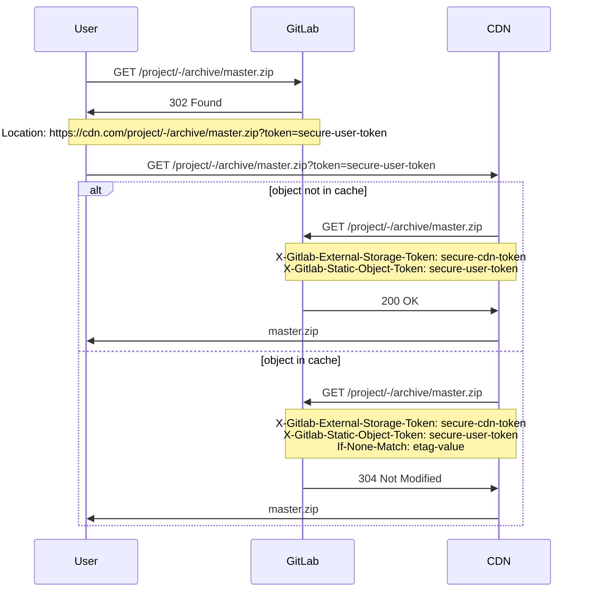



- Édition : Gratuite, GitLab Premium, GitLab Ultimate
- Offre : GitLab Self-Managed



Configurez GitLab pour servir les objets statiques du dépôt (tels que des archives ou des blobs bruts) depuis un stockage externe tel qu'un réseau de diffusion de contenu (CDN).

## Configurer le stockage externe {#configure-external-storage}

Prérequis :

- Accès administrateur.

Pour configurer le stockage externe pour les objets statiques :

1. Dans le coin supérieur droit, sélectionnez **Admin**.
1. Dans la barre latérale gauche, sélectionnez **Paramètres** > **Dépôt**.
1. Développez **Stockage externe pour les objets statiques du dépôt**.
1. Saisissez l'URL de base et un jeton arbitraire. Lorsque vous [configurez le stockage externe](#set-up-external-storage), utilisez un script qui définit ces valeurs en tant que `ORIGIN_HOSTNAME` et `STORAGE_TOKEN`.
1. Sélectionnez **Sauvegarder les modifications**.

Le jeton est nécessaire pour distinguer les requêtes provenant du stockage externe, afin que les utilisateurs ne contournent pas le stockage externe et n'accèdent pas directement à l'application. GitLab s'attend à ce que ce jeton soit défini dans l'en-tête `X-Gitlab-External-Storage-Token` des requêtes provenant du stockage externe.

## Servir des objets statiques privés {#serving-private-static-objects}

GitLab ajoute un jeton spécifique à l'utilisateur pour les URL d'objets statiques appartenant à des projets privés, afin que le stockage externe puisse être authentifié au nom de l'utilisateur.

Lors du traitement des requêtes provenant du stockage externe, GitLab vérifie les éléments suivants pour confirmer que l'utilisateur peut accéder à l'objet demandé :

- Le paramètre de requête `token`.
- L'en-tête `X-Gitlab-Static-Object-Token`.

## Exemple de flux de requêtes {#requests-flow-example}

L'exemple suivant illustre une séquence de requêtes et de réponses entre :

- L'utilisateur.
- GitLab.
- Le réseau de diffusion de contenu.



## Configurer le stockage externe {#set-up-external-storage}

Bien que cette procédure utilise [Cloudflare Workers](https://workers.cloudflare.com) pour le stockage externe, d'autres CDN ou systèmes de type Function as a Service (FaaS) devraient fonctionner selon les mêmes principes.

1. Choisissez un domaine Cloudflare Worker si vous ne l'avez pas encore fait.
1. Dans le script suivant, définissez les valeurs suivantes pour les deux premières constantes :

   - `ORIGIN_HOSTNAME` : le nom d'hôte de votre installation GitLab.
   - `STORAGE_TOKEN` : tout jeton sécurisé arbitraire. Vous pouvez obtenir un jeton en exécutant `pwgen -cn1 64` sur une machine UNIX. Sauvegardez ce jeton pour la zone **Admin**, comme décrit dans la section [de configuration](#configure-external-storage).

     ```javascript
     const ORIGIN_HOSTNAME = 'gitlab.installation.com' // FIXME: SET CORRECT VALUE
     const STORAGE_TOKEN = 'very-secure-token' // FIXME: SET CORRECT VALUE
     const CACHE_PRIVATE_OBJECTS = false

     const CORS_HEADERS = {
       'Access-Control-Allow-Origin': '*',
       'Access-Control-Allow-Methods': 'GET, HEAD, OPTIONS',
       'Access-Control-Allow-Headers': 'X-Csrf-Token, X-Requested-With',
     }

     self.addEventListener('fetch', event => event.respondWith(handle(event)))

     async function handle(event) {
       try {
         let response = await verifyAndHandle(event);

         // responses returned from cache are immutable, so we recreate them
         // to set CORS headers
         response = new Response(response.body, response)
         response.headers.set('Access-Control-Allow-Origin', '*')

         return response
       } catch (e) {
         return new Response('An error occurred!', {status: e.statusCode || 500})
       }
     }

     async function verifyAndHandle(event) {
       if (!validRequest(event.request)) {
         return new Response(null, {status: 400})
       }

       if (event.request.method === 'OPTIONS') {
         return handleOptions(event.request)
       }

       return handleRequest(event)
     }

     function handleOptions(request) {
       // Make sure the necessary headers are present
       // for this to be a valid pre-flight request
       if (
         request.headers.get('Origin') !== null &&
         request.headers.get('Access-Control-Request-Method') !== null &&
         request.headers.get('Access-Control-Request-Headers') !== null
       ) {
         // Handle CORS pre-flight request
         return new Response(null, {
           headers: CORS_HEADERS,
         })
       } else {
         // Handle standard OPTIONS request
         return new Response(null, {
           headers: {
             Allow: 'GET, HEAD, OPTIONS',
           },
         })
       }
     }

     async function handleRequest(event) {
       let cache = caches.default
       let url = new URL(event.request.url)
       let static_object_token = url.searchParams.get('token')
       let headers = new Headers(event.request.headers)

       url.host = ORIGIN_HOSTNAME
       url = normalizeQuery(url)

       headers.set('X-Gitlab-External-Storage-Token', STORAGE_TOKEN)
       if (static_object_token !== null) {
         headers.set('X-Gitlab-Static-Object-Token', static_object_token)
       }

       let request = new Request(url, { headers: headers })
       let cached_response = await cache.match(request)
       let is_conditional_header_set = headers.has('If-None-Match')

       if (cached_response) {
         return cached_response
       }

       // We don't want to override If-None-Match that is set on the original request
       if (cached_response && !is_conditional_header_set) {
         headers.set('If-None-Match', cached_response.headers.get('ETag'))
       }

       let response = await fetch(request, {
         headers: headers,
         redirect: 'manual'
       })

       if (response.status == 304) {
         if (is_conditional_header_set) {
           return response
         } else {
           return cached_response
         }
       } else if (response.ok) {
         response = new Response(response.body, response)

         // cache.put will never cache any response with a Set-Cookie header
         response.headers.delete('Set-Cookie')

         if (CACHE_PRIVATE_OBJECTS) {
           response.headers.delete('Cache-Control')
         }

         event.waitUntil(cache.put(request, response.clone()))
       }

       return response
     }

     function normalizeQuery(url) {
       let searchParams = url.searchParams
       url = new URL(url.toString().split('?')[0])

       if (url.pathname.includes('/raw/')) {
         let inline = searchParams.get('inline')

         if (inline == 'false' || inline == 'true') {
           url.searchParams.set('inline', inline)
         }
       } else if (url.pathname.includes('/-/archive/')) {
         let append_sha = searchParams.get('append_sha')
         let path = searchParams.get('path')

         if (append_sha == 'false' || append_sha == 'true') {
           url.searchParams.set('append_sha', append_sha)
         }
         if (path) {
           url.searchParams.set('path', path)
         }
       }

       return url
     }

     function validRequest(request) {
       let url = new URL(request.url)
       let path = url.pathname

       if (/^(.+)(\/raw\/|\/-\/archive\/)/.test(path)) {
         return true
       }

       return false
     }
     ```

1. Créez un nouveau worker avec ce script.
1. Copiez vos valeurs pour `ORIGIN_HOSTNAME` et `STORAGE_TOKEN`. Utilisez ces valeurs [pour configurer le stockage externe pour les objets statiques](#configure-external-storage).
