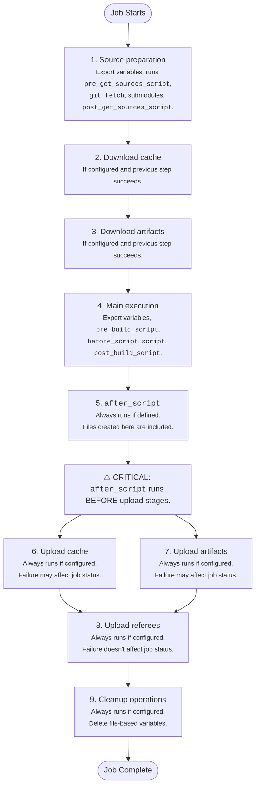



- Édition : Gratuite, GitLab Premium, GitLab Ultimate
- Offre : GitLab.com, GitLab Self-Managed, GitLab Dedicated



Le flux d'exécution des jobs décrit comment GitLab Runner traite les jobs CI/CD du début à la fin.

GitLab Runner exécute les jobs CI/CD après avoir reçu un job, récupéré les secrets depuis un coffre-fort (si configuré) et préparé l'exécuteur. Chaque job CI/CD s'exécute sous la forme d'une série d'étapes séquentielles, chaque étape s'exécutant dans un contexte shell distinct. Le runner :

1. Prépare le code source pour le job :

   - Exporte les variables vers le contexte shell
   - Exécute `pre_get_sources_script` si ce script est défini dans la configuration
   - Exécute `git fetch` et d'autres commandes de gestion des sources, sauf si la stratégie `none` est configurée
   - Exécute les commandes pour mettre à jour les sous-modules s'ils existent
   - Exécute `post_get_sources_script` si ce script est défini dans la configuration

1. Télécharge les fichiers mis en cache si [cache](../yaml/_index.md#cache) est configuré et si l'étape précédente a réussi :

   - Exporte les variables vers le contexte shell
   - Exécute les commandes pour télécharger les fichiers mis en cache lors des exécutions de jobs précédentes

1. Télécharge les [artefacts](../yaml/_index.md#artifacts) des jobs précédents si le téléchargement des artefacts est configuré et si l'étape précédente a réussi :

   - Exporte les variables vers le contexte shell
   - Exécute les commandes pour télécharger les fichiers d'artefacts des jobs précédents

1. Exécute les scripts principaux du job si l'étape précédente a réussi :

   - Exporte les variables vers le contexte shell
   - Exécute `pre_build_script` si ce script est défini dans la configuration
   - Exécute les commandes `before_script` si elles sont définies
   - Exécute les commandes `script` principales
   - Exécute `post_build_script` si ce script est défini dans la configuration

1. Exécute les commandes `after_script` si elles sont définies, que les étapes précédentes aient échoué ou non :

   - Exporte les variables vers un nouveau contexte shell
   - Exécute les commandes `after_script`
   - L'échec de ces commandes n'a pas d'incidence sur le statut global du job

1. Charge les fichiers dans le cache si le chargement du cache est configuré, que les étapes précédentes aient échoué ou non :

   - Exporte les variables vers le contexte shell
   - Exécute les commandes pour charger les fichiers spécifiés vers le stockage du cache
   - L'échec de cette étape peut avoir une incidence sur le statut global du job

1. Charge les artefacts si le chargement des artefacts est configuré, que les étapes précédentes aient échoué ou non :

   - Exporte les variables vers le contexte shell
   - Exécute les commandes pour charger les fichiers spécifiés en tant qu'artefacts de job
   - L'échec de cette étape peut avoir une incidence sur le statut global du job

1. Charge les données de référence si le chargement des données de référence est configuré, que les étapes précédentes aient échoué ou non :

   - Exporte les variables vers le contexte shell
   - Exécute les commandes pour charger les informations de référence
   - L'échec de ces commandes n'a pas d'incidence sur le statut global du job

1. Effectue les opérations de nettoyage si elles sont configurées, que les étapes précédentes aient échoué ou non :

   - Exporte les variables vers le contexte shell
   - Exécute les commandes pour supprimer les variables basées sur des fichiers du répertoire de travail
   - L'échec de ces commandes n'a pas d'incidence sur le job global

## Isolation du contexte shell {#shell-context-isolation}

Chaque contexte shell est isolé par conception. Le seul lien entre les contextes est le système de fichiers du répertoire de travail partagé.

- Les exports de variables manuels (comme `export my_variable=$(date)`) dans un contexte ne sont pas disponibles dans les autres contextes
- Chaque script s'exécute avec `set -eo pipefail` (pour les shells Unix) afin d'échouer rapidement dès la première erreur
- Le résultat de chaque étape détermine si les étapes suivantes s'exécutent et a une incidence sur le statut global du job
