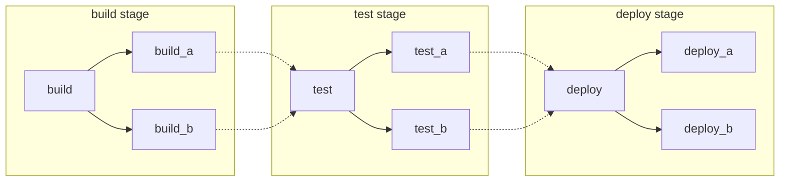
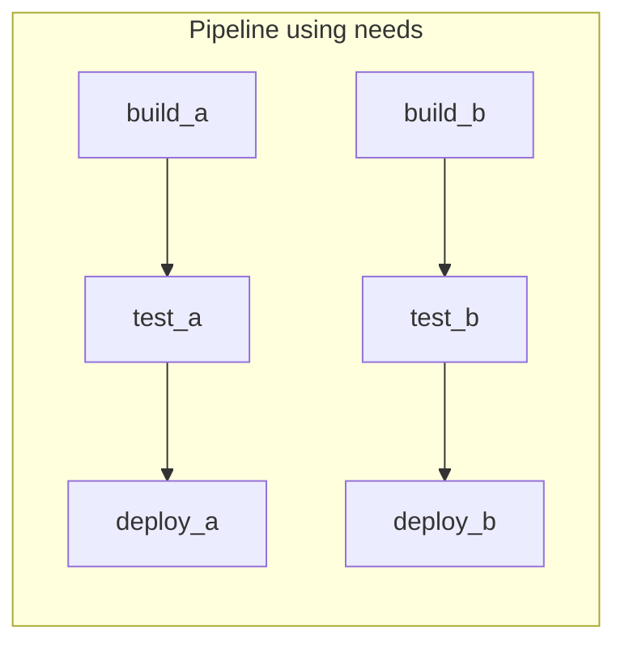
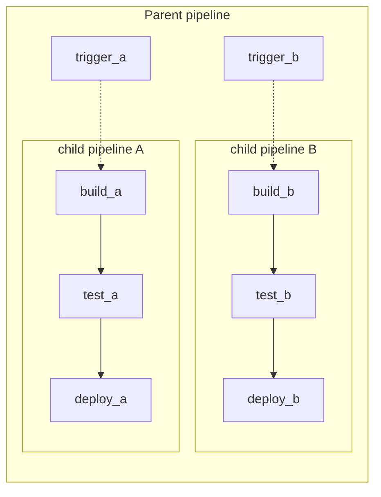



- Édition : Gratuite, GitLab Premium, GitLab Ultimate
- Offre : GitLab.com, GitLab Self-Managed, GitLab Dedicated



Les pipelines constituent les éléments de base fondamentaux pour la CI/CD dans GitLab. Cette page documente certains des concepts importants qui y sont liés.

Vous pouvez structurer vos pipelines avec différentes méthodes, chacune ayant ses propres avantages. Ces méthodes peuvent être combinées si nécessaire :

- [Basic](#basic-pipelines) : Adapté aux projets simples où toute la configuration se trouve au même endroit.
- [Pipelines avec le mot-clé `needs`](#pipelines-with-the-needs-keyword) : Adapté aux projets volumineux et complexes nécessitant une exécution efficace.
- [Pipelines parent-enfant](#parent-child-pipelines) : Adapté aux monodépôts et aux projets comportant de nombreux composants définis indépendamment.

  <i class="fa-youtube-play" aria-hidden="true"></i> Pour une présentation générale, consultez la [démonstration de la fonctionnalité de pipelines parent-enfant](https://youtu.be/n8KpBSqZNbk).

- [Pipelines multi-projets](downstream_pipelines.md#multi-project-pipelines) : Adapté aux produits plus importants nécessitant des interdépendances entre projets, comme ceux dotés d'une [architecture microservices](https://about.gitlab.com/blog/trends-in-version-control-land-microservices/).

  Par exemple, vous pouvez déployer votre application web depuis trois projets GitLab différents. Avec les pipelines multi-projets, vous pouvez déclencher un pipeline dans chaque projet, où chacun possède son propre processus de build, de test et de déploiement. Vous pouvez visualiser les pipelines connectés en un seul endroit, y compris toutes les interdépendances entre projets.

  <i class="fa-youtube-play" aria-hidden="true"></i> Pour une présentation générale, consultez la [démonstration des pipelines multi-projets](https://www.youtube.com/watch?v=g_PIwBM1J84).

## Pipelines basic {#basic-pipelines}

Les pipelines basic sont les pipelines les plus simples dans GitLab. Tout ce qui se trouve dans l'étape de build est exécuté simultanément et, une fois toutes les étapes terminées, tout ce qui se trouve dans l'étape de test et les étapes suivantes est exécuté de la même manière. Ce n'est pas la méthode la plus efficace et, si vous avez de nombreuses étapes, la configuration peut devenir assez complexe, mais elle est plus facile à maintenir :



Exemple de configuration de pipeline basic `/.gitlab-ci.yml` correspondant au diagramme :

```yaml
stages:
  - build
  - test
  - deploy

default:
  image: alpine

build_a:
  stage: build
  script:
    - echo "This job builds something."

build_b:
  stage: build
  script:
    - echo "This job builds something else."

test_a:
  stage: test
  script:
    - echo "This job tests something. It will only run when all jobs in the"
    - echo "build stage are complete."

test_b:
  stage: test
  script:
    - echo "This job tests something else. It will only run when all jobs in the"
    - echo "build stage are complete too. It will start at about the same time as test_a."

deploy_a:
  stage: deploy
  script:
    - echo "This job deploys something. It will only run when all jobs in the"
    - echo "test stage complete."
  environment: production

deploy_b:
  stage: deploy
  script:
    - echo "This job deploys something else. It will only run when all jobs in the"
    - echo "test stage complete. It will start at about the same time as deploy_a."
  environment: production
```

## Pipelines avec le mot-clé `needs` {#pipelines-with-the-needs-keyword}

Si l'efficacité est importante et que vous souhaitez que tout s'exécute aussi rapidement que possible, vous pouvez utiliser le [mot-clé `needs`](../yaml/needs.md) pour définir des dépendances entre vos jobs. Lorsque GitLab connaît les dépendances entre vos jobs, ceux-ci peuvent s'exécuter aussi rapidement que possible, en démarrant même plus tôt que les autres jobs de la même étape.

Dans l'exemple suivant, si `build_a` et `test_a` sont beaucoup plus rapides que `build_b` et `test_b`, GitLab démarre `deploy_a` même si `build_b` est encore en cours d'exécution.



Exemple de configuration `/.gitlab-ci.yml` correspondant au diagramme :

```yaml
stages:
  - build
  - test
  - deploy

default:
  image: alpine

build_a:
  stage: build
  script:
    - echo "This job builds something quickly."

build_b:
  stage: build
  script:
    - echo "This job builds something else slowly."

test_a:
  stage: test
  needs: [build_a]
  script:
    - echo "This test job will start as soon as build_a finishes."
    - echo "It will not wait for build_b, or other jobs in the build stage, to finish."

test_b:
  stage: test
  needs: [build_b]
  script:
    - echo "This test job will start as soon as build_b finishes."
    - echo "It will not wait for other jobs in the build stage to finish."

deploy_a:
  stage: deploy
  needs: [test_a]
  script:
    - echo "Since build_a and test_a run quickly, this deploy job can run much earlier."
    - echo "It does not need to wait for build_b or test_b."
  environment: production

deploy_b:
  stage: deploy
  needs: [test_b]
  script:
    - echo "Since build_b and test_b run slowly, this deploy job will run much later."
  environment: production
```

## Pipelines parent-enfant {#parent-child-pipelines}

À mesure que les pipelines deviennent plus complexes, quelques problèmes connexes commencent à émerger :

- La structure en étapes, où toutes les étapes d'une étape doivent être terminées avant que le premier job de l'étape suivante ne commence, entraîne des temps d'attente qui ralentissent le processus.
- La configuration du pipeline global unique devient difficile à gérer.
- Les imports avec [`include`](../yaml/_index.md#include) augmentent la complexité de la configuration et peuvent provoquer des collisions d'espaces de nommage où des jobs sont dupliqués involontairement.
- L'interface du pipeline comporte trop de jobs et d'étapes avec lesquels travailler.

De plus, le comportement d'un pipeline doit parfois être plus dynamique. La possibilité de choisir de démarrer des sous-pipelines (ou non) est une fonctionnalité puissante, surtout si le YAML est généré dynamiquement.

Dans les exemples précédents de [pipeline basic](#basic-pipelines) et de [pipeline `needs`](#pipelines-with-the-needs-keyword), il existe deux packages qui pourraient être buildés indépendamment. Ces cas sont idéaux pour l'utilisation des [pipelines parent-enfant](downstream_pipelines.md#parent-child-pipelines). Elle sépare la configuration en plusieurs fichiers, ce qui simplifie les choses. Vous pouvez combiner les pipelines parent-enfant avec :

- Le [mot-clé `rules`](../yaml/_index.md#rules) : Par exemple, déclenchez les pipelines enfant uniquement lorsque des modifications sont apportées à cette zone.
- Le [mot-clé `include`](../yaml/_index.md#include) : Intégrez des comportements communs en vous assurant de ne pas vous répéter.
- Le [mot-clé `needs`](#pipelines-with-the-needs-keyword) à l'intérieur des pipelines enfant, pour bénéficier des avantages des deux.



Exemple de configuration `/.gitlab-ci.yml` pour le pipeline parent correspondant au diagramme :

```yaml
stages:
  - triggers

trigger_a:
  stage: triggers
  trigger:
    include: a/.gitlab-ci.yml
  rules:
    - changes:
        - a/*

trigger_b:
  stage: triggers
  trigger:
    include: b/.gitlab-ci.yml
  rules:
    - changes:
        - b/*
```

Exemple de configuration du pipeline enfant `a`, situé dans `/a/.gitlab-ci.yml`, utilisant le mot-clé `needs` :

```yaml
stages:
  - build
  - test
  - deploy

default:
  image: alpine

build_a:
  stage: build
  script:
    - echo "This job builds something."

test_a:
  stage: test
  needs: [build_a]
  script:
    - echo "This job tests something."

deploy_a:
  stage: deploy
  needs: [test_a]
  script:
    - echo "This job deploys something."
  environment: production
```

Exemple de configuration du pipeline enfant `b`, situé dans `/b/.gitlab-ci.yml`, utilisant le mot-clé `needs` :

```yaml
stages:
  - build
  - test
  - deploy

default:
  image: alpine

build_b:
  stage: build
  script:
    - echo "This job builds something else."

test_b:
  stage: test
  needs: [build_b]
  script:
    - echo "This job tests something else."

deploy_b:
  stage: deploy
  needs: [test_b]
  script:
    - echo "This job deploys something else."
  environment: production
```

Il est possible de configurer des jobs pour qu'ils s'exécutent avant ou après le déclenchement des pipelines enfant dans GitLab, ce qui permet d'effectuer des étapes de configuration communes ou un déploiement unifié.
