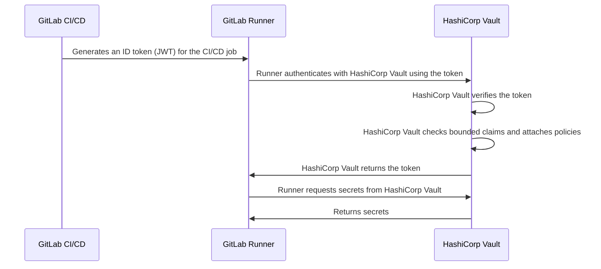



- Édition : Gratuite, GitLab Premium, GitLab Ultimate
- Offre : GitLab.com, GitLab Self-Managed, GitLab Dedicated





- [Introduit](https://gitlab.com/gitlab-org/gitlab/-/issues/356986) dans GitLab 15.7.



Les jetons d'ID sont des [jetons web JSON (JWT)](https://www.rfc-editor.org/rfc/rfc7519) générés par GitLab CI/CD. Les jobs CI/CD peuvent utiliser des jetons d'ID pour l'authentification OIDC auprès de services tiers, notamment :

- [Fournisseurs de secrets](_index.md)
- [Services cloud](../cloud_services/_index.md)

Par exemple, le flux d'utilisation des jetons d'ID pour s'authentifier auprès de HashiCorp Vault est résumé par ce diagramme :



Les jetons d'ID sont également utilisés par le mot-clé [`secrets`](../yaml/_index.md#secrets).

## Configurer des jetons d'ID dans un job CI/CD {#configure-id-tokens-in-a-cicd-job}

Pour utiliser des jetons d'ID, configurez un job CI/CD avec le mot-clé [`id_tokens`](../yaml/_index.md#id_tokens). Vous pouvez ensuite utiliser le jeton dans une section `script`, `before_script` ou `after_script`.

Par exemple :

```yaml
job_with_id_tokens:
  id_tokens:
    FIRST_ID_TOKEN:
      aud: https://first.service.com
    SECOND_ID_TOKEN:
      aud: https://second.service.com
  script:
    - first-service-authentication-script.sh $FIRST_ID_TOKEN
    - second-service-authentication-script.sh $SECOND_ID_TOKEN
```

Dans cet exemple, les deux jetons ont des revendications `aud` différentes. Les services tiers peuvent être configurés pour rejeter les jetons qui ne possèdent pas de revendication `aud` correspondant à leur audience liée. Utilisez cette fonctionnalité pour réduire le nombre de services auprès desquels un jeton peut s'authentifier. Cela réduit la gravité d'une compromission de jeton.

## Contenu du jeton {#token-payload}

Les revendications standard suivantes sont incluses dans chaque jeton d'ID :

| Champ                                                              | Description |
|--------------------------------------------------------------------|-------------|
| [`iss`](https://www.rfc-editor.org/rfc/rfc7519.html#section-4.1.1) | Émetteur du jeton, qui est le domaine de l'instance GitLab (revendication « issuer »). |
| [`sub`](https://www.rfc-editor.org/rfc/rfc7519.html#section-4.1.2) | Sujet du jeton (revendication « subject »). Par défaut : `project_path:{group}/{project}:ref_type:{type}:ref:{branch_name}`. Peut être configuré pour le projet via l'[API projects](../../api/projects.md#update-a-project). La revendication `sub` peut inclure des champs supplémentaires tels que `ref_protected`, ainsi que des champs liés à l'environnement tels que `environment_protected` et `deployment_tier` lorsque les jobs spécifient un environnement. Introduit dans GitLab 18.7. |
| [`aud`](https://www.rfc-editor.org/rfc/rfc7519.html#section-4.1.3) | Audience prévue pour le jeton (revendication « audience »). Spécifiée dans la configuration des [jetons d'ID](#configure-id-tokens-in-a-cicd-job). Par défaut, le domaine de l'instance GitLab. |
| [`exp`](https://www.rfc-editor.org/rfc/rfc7519.html#section-4.1.4) | La date d'expiration (revendication « expiration time »). |
| [`nbf`](https://www.rfc-editor.org/rfc/rfc7519.html#section-4.1.5) | L'heure à partir de laquelle le jeton devient valide (revendication « not before »). |
| [`iat`](https://www.rfc-editor.org/rfc/rfc7519.html#section-4.1.6) | L'heure à laquelle le JWT a été émis (revendication « issued at »). |
| [`jti`](https://www.rfc-editor.org/rfc/rfc7519.html#section-4.1.7) | Identifiant unique du jeton (revendication « JWT ID »). |

Le jeton inclut également des revendications personnalisées fournies par GitLab :

| Champ                   | Quand                                       | Description |
|-------------------------|--------------------------------------------|-------------|
| `project_id`            | Toujours                                     | ID du projet exécutant le job. Dans un pipeline de merge request, il s'agit de l'ID du projet source. |
| `project_path`          | Toujours                                     | Chemin du projet exécutant le job. Dans un pipeline de merge request, il s'agit du chemin du projet source. |
| `namespace_id`          | Toujours                                     | ID d'espace de nommage du projet exécutant le job. Dans un pipeline de merge request, il s'agit de l'ID d'espace de nommage du projet source. |
| `namespace_path`        | Toujours                                     | Chemin d'espace de nommage du projet exécutant le job. Dans un pipeline de merge request, il s'agit du chemin d'espace de nommage du projet source. |
| `user_id`               | Toujours                                     | ID de l'utilisateur exécutant le job. |
| `user_login`            | Toujours                                     | Nom d'utilisateur de l'utilisateur exécutant le job. |
| `user_email`            | Toujours                                     | E-mail de l'utilisateur exécutant le job. |
| `user_access_level`     | Toujours                                     | Niveau d'accès de l'utilisateur exécutant le job. [Introduite](https://gitlab.com/gitlab-org/gitlab/-/issues/432052) dans GitLab 16.9. |
| `job_project_id`        | Toujours                                     | ID du projet exécutant le job. Utilisez ceci pour limiter la portée au projet par ID. [Introduit](https://gitlab.com/gitlab-org/gitlab/-/issues/563038) dans GitLab 18.4. |
| `job_project_path`      | Toujours                                     | Chemin du projet exécutant le job. Utilisez ceci pour limiter la portée au projet par chemin. [Introduit](https://gitlab.com/gitlab-org/gitlab/-/issues/563038) dans GitLab 18.4. |
| `job_namespace_id`      | Toujours                                     | ID d'espace de nommage du projet exécutant le job. Utilisez ceci pour limiter la portée au espace de nommage de groupe ou d'utilisateur par ID. [Introduit](https://gitlab.com/gitlab-org/gitlab/-/issues/563038) dans GitLab 18.4. |
| `job_namespace_path`    | Toujours                                     | Chemin d'espace de nommage du projet exécutant le job. Utilisez ceci pour limiter la portée au espace de nommage de groupe ou d'utilisateur par chemin. [Introduit](https://gitlab.com/gitlab-org/gitlab/-/issues/563038) dans GitLab 18.4. |
| `user_identities`       | Paramètre de préférences utilisateur                    | Liste des identités externes de l'utilisateur ([introduit](https://gitlab.com/gitlab-org/gitlab/-/issues/387537) dans GitLab 16.0). |
| `pipeline_id`           | Toujours                                     | ID du pipeline. |
| `pipeline_source`       | Toujours                                     | [Source du pipeline](../jobs/job_rules.md#common-if-clauses-with-predefined-variables). |
| `job_id`                | Toujours                                     | ID du job. |
| `ref`                   | Toujours                                     | Référence Git pour le job. Dans un pipeline de merge request, il s'agit de la référence de la branche source. |
| `ref_type`              | Toujours                                     | Type de référence Git : `branch` ou `tag`. |
| `ref_path`              | Toujours                                     | Référence complète du job. Par exemple, `refs/heads/main`. Dans un pipeline de merge request, il s'agit du chemin de référence de la branche source. [Introduit](https://gitlab.com/gitlab-org/gitlab/-/merge_requests/119075) dans GitLab 16.0. |
| `ref_protected`         | Toujours                                     | `true` si la référence Git est protégée, `false` sinon. |
| `groups_direct`         | L'utilisateur est membre direct de 0 à 200 groupes | Les chemins des groupes dont l'utilisateur est membre direct. Omis si l'utilisateur est membre direct de plus de 200 groupes. ([Introduit](https://gitlab.com/gitlab-org/gitlab/-/issues/435848) dans GitLab 16.11 et placé derrière le `ci_jwt_groups_direct` [feature flag](../../administration/feature_flags/_index.md) dans GitLab 17.3. |
| `environment`           | Le job spécifie un environnement               | Environnement vers lequel ce job effectue un déploiement. |
| `environment_protected` | Le job spécifie un environnement               | `true` si l'environnement déployé est protégé, `false` sinon. |
| `deployment_tier`       | Le job spécifie un environnement               | [Niveau de déploiement](../environments/_index.md#deployment-tier-of-environments) de l'environnement spécifié par le job. [Introduit](https://gitlab.com/gitlab-org/gitlab/-/issues/363590) dans GitLab 15.2. |
| `environment_action`    | Le job spécifie un environnement               | [Action d'environnement (`environment:action`)](../environments/_index.md) spécifiée dans le job. ([Introduit](https://gitlab.com/gitlab-org/gitlab/-/) dans GitLab 16.5) |
| `runner_id`             | Toujours                                     | ID du runner exécutant le job. [Introduit](https://gitlab.com/gitlab-org/gitlab/-/issues/404722) dans GitLab 16.0. |
| `runner_environment`    | Toujours                                     | Le type de runner utilisé par le job. Peut être `gitlab-hosted` ou `self-hosted`. [Introduit](https://gitlab.com/gitlab-org/gitlab/-/issues/404722) dans GitLab 16.0. |
| `sha`                   | Toujours                                     | Le SHA du commit pour le job. [Introduit](https://gitlab.com/gitlab-org/gitlab/-/issues/404722) dans GitLab 16.0. |
| `ci_config_ref_uri`     | Toujours                                     | Le chemin de référence vers la définition du pipeline de niveau supérieur, par exemple `gitlab.example.com/my-group/my-project//.gitlab-ci.yml@refs/heads/main`. [Introduit](https://gitlab.com/gitlab-org/gitlab/-/issues/404722) dans GitLab 16.2. Cette revendication est `null` sauf si la définition du pipeline se trouve dans le même projet. |
| `ci_config_sha`         | Toujours                                     | SHA du commit Git pour `ci_config_ref_uri`. [Introduit](https://gitlab.com/gitlab-org/gitlab/-/issues/404722) dans GitLab 16.2. Cette revendication est `null` sauf si la définition du pipeline se trouve dans le même projet. |
| `project_visibility`    | Toujours                                     | La [visibilité](../../user/public_access.md) du projet dans lequel le pipeline s'exécute. Peut être `internal`, `private` ou `public`. [Introduite](https://gitlab.com/gitlab-org/gitlab/-/issues/418810) dans GitLab 16.3. |
| `job_source`            | Toujours                                     | [Source du job](../jobs/_index.md#available-job-sources). [Introduit](https://gitlab.com/gitlab-org/gitlab/-/work_items/459001) dans GitLab 18.9. |
| `job_config`              | Le job déclenché par une politique                  | Métadonnées sur l'origine du job. Pour les jobs de politique, inclut `sha` et `url` pour la configuration de la politique. [Introduit](https://gitlab.com/gitlab-org/gitlab/-/work_items/459001) dans GitLab 18.9. |

```json
{
  "namespace_id": "72",
  "namespace_path": "my-group",
  "project_id": "20",
  "project_path": "my-group/my-project",
  "user_id": "1",
  "user_login": "sample-user",
  "user_email": "sample-user@example.com",
  "user_identities": [
      {"provider": "github", "extern_uid": "2435223452345"},
      {"provider": "bitbucket", "extern_uid": "john.smith"}
  ],
  "pipeline_id": "574",
  "pipeline_source": "push",
  "job_id": "302",
  "ref": "feature-branch-1",
  "ref_type": "branch",
  "ref_path": "refs/heads/feature-branch-1",
  "ref_protected": "false",
  "groups_direct": ["mygroup/mysubgroup", "myothergroup/myothersubgroup"],
  "environment": "test-environment2",
  "environment_protected": "false",
  "deployment_tier": "testing",
  "environment_action": "start",
  "job_source": "push",
  "job_config": {
    "url": "https://gitlab.example.com/my-group/my-policy-project/-/blob/ab035e64eca9a7a85bd62e485d3593f52a2804ac/.gitlab/security-policies/policy.yml",
    "sha": "ab035e64eca9a7a85bd62e485d3593f52a2804ac"
  },
  "runner_id": 1,
  "runner_environment": "self-hosted",
  "sha": "714a629c0b401fdce83e847fc9589983fc6f46bc",
  "project_visibility": "public",
  "ci_config_ref_uri": "gitlab.example.com/my-group/my-project//.gitlab-ci.yml@refs/heads/main",
  "ci_config_sha": "714a629c0b401fdce83e847fc9589983fc6f46bc",
  "jti": "235b3a54-b797-45c7-ae9a-f72d7bc6ef5b",
  "iss": "https://gitlab.example.com",
  "iat": 1681395193,
  "nbf": 1681395188,
  "exp": 1681398793,
  "sub": "project_path:my-group/my-project:ref_type:branch:ref:feature-branch-1",
  "aud": "https://vault.example.com"
}
```

Le jeton d'ID est encodé avec RS256 et signé avec une clé privée dédiée. La durée d'expiration du jeton correspond au délai d'expiration du job si celui-ci est spécifié, ou à 5 minutes si aucun délai d'expiration n'est défini.

### Utiliser les revendications de jeton d'ID dans les politiques de confiance cloud {#use-id-token-claims-in-cloud-trust-policies}

Les fournisseurs cloud qui fédèrent avec GitLab en tant que fournisseur d'identité OIDC peuvent valider les revendications ci-dessus en tant que clés de condition dans les politiques de confiance.

Lorsque vous rédigez une politique de confiance, incluez des identifiants stables et uniques tels que `namespace_id` et `project_id` aux côtés des revendications basées sur les chemins comme `sub`, lorsque cela est pris en charge par le fournisseur cloud et l'offre GitLab. `project_id` est globalement unique et reste identique pour toute la durée de vie du projet. `namespace_id` est stable tant que le projet reste dans son espace de nommage actuel. Ces deux identifiants étant indépendants des chemins, les politiques de confiance qui les incluent ne sont pas affectées par des modifications de chemins, telles que le renommage de groupes ou de projets.

Pour AWS sur GitLab.com, les revendications GitLab suivantes sont disponibles en tant que clés de condition pour le fournisseur d'identité OIDC `gitlab.com` :

- `namespace_id`
- `project_id`
- `user_id`
- `user_login`
- `user_email`
- `user_access_level`
- `ref_protected`
- `pipeline_source`

Ces clés de condition sont disponibles uniquement pour le fournisseur d'identité OIDC `gitlab.com`. Elles ne sont actuellement pas disponibles pour GitLab Self-Managed ou GitLab Dedicated, où seule la revendication `sub` est prise en charge comme clé de condition AWS.

Ne vous basez pas uniquement sur `user_login` ou `user_email` comme condition, car un utilisateur peut les modifier. Vérifiez l'ensemble exact des revendications prises en charge par rapport aux clés de condition publiées par AWS pour le fournisseur d'identité GitLab.

Pour un exemple complet de politique de confiance AWS utilisant `sub`, `namespace_id` et `project_id`, consultez [Configurer OpenID Connect dans AWS](../cloud_services/aws/_index.md#configure-a-role-and-trust). Pour HashiCorp Vault, consultez [les revendications liées (bound claims)](hashicorp_vault_tutorial.md).

## Dépannage {#troubleshooting}

### Code de statut `400: missing token` {#400-missing-token-status-code}

Cette erreur indique qu'un ou plusieurs composants de base nécessaires aux jetons d'ID sont manquants ou non configurés comme prévu.

Pour identifier le problème, un administrateur peut rechercher des informations supplémentaires dans le fichier `exceptions_json.log` de l'instance, pour la méthode spécifique qui a échoué.

### `GitLab::Ci::Jwt::NoSigningKeyError` {#gitlabcijwtnosigningkeyerror}

Cette erreur dans le fichier `exceptions_json.log` est probablement due à l'absence de la clé de signature dans la base de données, ce qui a empêché la génération du jeton. Pour vérifier que c'est bien la cause du problème, exécutez la requête suivante dans le terminal PostgreSQL de l'instance :

```sql
SELECT encrypted_ci_jwt_signing_key FROM application_settings;
```

Si la valeur retournée est vide, utilisez le snippet Rails suivant pour générer une nouvelle clé et la remplacer en interne :

```ruby
  key = OpenSSL::PKey::RSA.new(2048).to_pem

  ApplicationSetting.find_each do |application_setting|
    application_setting.update(ci_jwt_signing_key: key)
  end
```

### Code de statut `401: unauthorized` {#401-unauthorized-status-code}

Cette erreur indique que la demande d'authentification a échoué. Lors de l'utilisation de l'authentification OpenID Connect (OIDC) depuis des pipelines GitLab vers des services externes, des erreurs `401 Unauthorized` peuvent survenir pour plusieurs raisons courantes :

- Vous avez utilisé un jeton obsolète, tel que `$CI_JOB_JWT_V2`, au lieu d'un [jeton d'ID](#configure-id-tokens-in-a-cicd-job). Pour plus d'informations, consultez [les anciennes versions des jetons web JSON sont obsolètes](../../update/deprecations.md#old-versions-of-json-web-tokens-are-deprecated).
- Vous avez utilisé des valeurs `provider_name` non concordantes entre votre fichier `.gitlab-ci.yml` et la configuration du fournisseur d'identité OIDC sur le service externe.
- Vous avez omis ou fait une erreur dans la revendication `aud` (audience) entre le jeton d'ID émis par GitLab et ce qu'attend le service externe.
- Vous n'avez pas activé ou configuré le bloc `id_tokens:` dans le job GitLab CI/CD.

Pour résoudre l'erreur, décodez le jeton à l'intérieur de votre job :

```shell
echo $OIDC_TOKEN | cut -d '.' -f2 | base64 -d | jq .
```

Assurez-vous que :

- `aud` (audience) correspond à l'audience attendue (par exemple, l'URL du service externe).
- `sub` (subject) est mappé dans les paramètres du fournisseur d'identité du service.
- `preferred_username` n'est pas présent par défaut dans les jetons d'ID GitLab.
