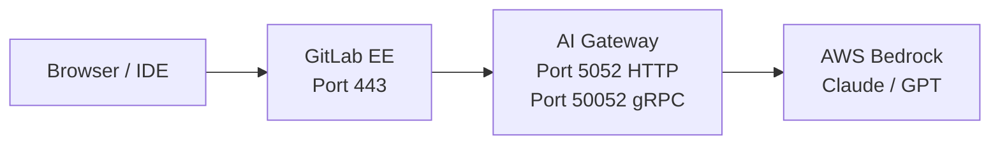



- Édition : GitLab Premium, GitLab Ultimate
- Offre : GitLab Self-Managed



Ce guide vous accompagne dans le déploiement de GitLab avec des modèles d'IA auto-hébergés utilisant AWS Bedrock, depuis une instance EC2 vierge jusqu'à un flow Duo Agent Platform (DAP) opérationnel. Chaque commande est copiable-collable. Chaque erreur courante est documentée.

Ce guide utilise une seule instance EC2 exécutant GitLab (Docker) et la passerelle d'IA (Docker Compose) côte à côte, avec AWS Bedrock comme fournisseur LLM. Cette architecture convient aux déploiements de preuve de concept et d'évaluation.

Pour les déploiements en production, consultez les [architectures de référence](../../administration/reference_architectures/_index.md).

## Prérequis {#prerequisites}

Avant de commencer, vous avez besoin de :

| Prérequis | Détails |
|-------------|---------|
| **AWS account** | Avec un accès Bedrock dans votre région cible (`us-east-1` recommandé). |
| **EC2 instance** | `t3.xlarge` minimum (4 vCPU, 16 Go de RAM). `t3.2xlarge` recommandé pour la production (8 vCPU, 32 Go). |
| **Domain name** | Deux enregistrements DNS pointant vers votre instance EC2 : `gitlab.example.com` et `aigw.example.com`. |
| **GitLab license** | Premium ou Ultimate. Les fonctionnalités Duo classiques (Chat, Suggestions de code) nécessitent l'[attribution de sièges Duo](../../subscriptions/subscription-add-ons.md). DAP avec une licence en ligne (GitLab 18.9 et versions ultérieures) utilise la [facturation à l'utilisation via les GitLab Credits](../../subscriptions/gitlab_credits.md) et ne nécessite pas de sièges Duo Enterprise. Pour DAP avec une licence hors ligne, contactez votre équipe commerciale GitLab pour connaître les options ELA. |
| **SSH access** | Vers votre instance EC2. |
| **Security group** | Ports 80, 443 et 8443 ouverts en entrée. |

## Présentation de l'architecture {#architecture-overview}



La passerelle d'IA s'exécute en tant que conteneur sidecar aux côtés de GitLab. Le NGINX intégré à GitLab transfère le trafic HTTPS et gRPC vers la passerelle d'IA. La passerelle d'IA transmet ensuite les requêtes LLM à AWS Bedrock.

Le port 8443 est requis pour les flows DAP. DAP utilise gRPC pour communiquer avec le Duo Workflow Service (DWS) de la passerelle d'IA. Le NGINX de GitLab doit proxy le TLS gRPC sur le port 8443 vers le port gRPC de la passerelle d'IA (50052).

## Étape 1 :  provisionner l'infrastructure AWS {#step-1-provision-aws-infrastructure}

### Lancer une instance EC2 {#launch-an-ec2-instance}

Lancez une instance Ubuntu 22.04 ou ultérieure avec :

- **Instance type:** `t3.xlarge` (minimum) ou `t3.2xlarge` (recommandé)
- **Stockage :** 100 Go gp3
- **AMI:** Ubuntu Server 22.04 LTS ou 24.04

### Configurer le groupe de sécurité {#configure-the-security-group}

Ouvrez ces ports entrants :

| Port | Protocole | Source | Objectif |
|------|----------|--------|---------|
| 22 | TCP | Votre IP | SSH |
| 80 | TCP | `0.0.0.0/0` | HTTP (validation Let's Encrypt) |
| 443 | TCP | `0.0.0.0/0` | HTTPS (proxy GitLab et passerelle d'IA) |
| 8443 | TCP | `0.0.0.0/0` | gRPC TLS (flows DAP) |

Les clients IDE (VS Code, JetBrains) se connectent directement au port 8443 pour les flows DAP. Si vos utilisateurs sont derrière un VPN, vous pouvez restreindre la plage d'adresses IP source.

### Installer Docker {#install-docker}

Connectez-vous en SSH à votre instance et installez Docker :

```shell
sudo apt-get update && sudo apt-get upgrade -y

# Install Docker (official method)
curl --fail --silent --show-error --location "https://get.docker.com" | sudo bash

# Install Docker Compose plugin
sudo apt-get install -y docker-compose-plugin

# Verify
sudo docker --version
sudo docker compose version
```

### Configurer le DNS {#set-up-dns}

Créez deux enregistrements A pointant vers l'IP publique de votre EC2 :

| Enregistrement | Type | Valeur |
|--------|------|-------|
| `gitlab.example.com` | A | IP publique de votre EC2 |
| `aigw.example.com` | A | IP publique de votre EC2 |

Les deux domaines pointent vers la même IP. Le NGINX de GitLab route le trafic en fonction du nom d'hôte.

Vérifiez la propagation DNS :

```shell
dig gitlab.example.com +short
dig aigw.example.com +short
```

Les deux commandes doivent retourner l'IP publique de votre EC2.

## Étape 2 :  installer GitLab {#step-2-install-gitlab}

### Créer les répertoires de données {#create-data-directories}

```shell
sudo mkdir -p /srv/gitlab/config /srv/gitlab/logs /srv/gitlab/data
```

### Exécuter GitLab {#run-gitlab}

Cette commande installe et démarre GitLab EE avec Let's Encrypt :

```shell
sudo docker run --detach \
  --hostname gitlab.example.com \
  --env GITLAB_OMNIBUS_CONFIG="
    external_url 'https://gitlab.example.com';
    letsencrypt['enable'] = true;
    letsencrypt['auto_renew'] = true;
    letsencrypt['contact_emails'] = ['you@example.com'];
    gitlab_rails['gitlab_shell_ssh_port'] = 2222;
  " \
  --publish 443:443 \
  --publish 80:80 \
  --publish 2222:22 \
  --publish 8443:8443 \
  --name gitlab \
  --restart always \
  --volume /srv/gitlab/config:/etc/gitlab \
  --volume /srv/gitlab/logs:/var/log/gitlab \
  --volume /srv/gitlab/data:/var/opt/gitlab \
  --shm-size 256m \
  gitlab/gitlab-ee:latest
```

> [!note]
> L'indicateur `--publish 8443:8443` est requis pour DAP (gRPC TLS). Si vous l'omettez, les flows DAP échouent silencieusement. Vous ne pouvez pas ajouter des ports à un conteneur en cours d'exécution. Vous devrez le recréer.

### Attendre le démarrage de GitLab {#wait-for-gitlab-to-start}

GitLab prend 3 à 5 minutes pour s'initialiser au premier démarrage :

```shell
until curl --silent --fail "https://gitlab.example.com/-/health" > /dev/null 2>&1; do
  echo "Waiting for GitLab to start..."
  sleep 10
done
echo "GitLab is up!"
```

### Définir le mot de passe root {#set-the-root-password}

```shell
sudo docker exec gitlab cat /etc/gitlab/initial_root_password
```

Connectez-vous à `https://gitlab.example.com` avec le nom d'utilisateur `root` et le mot de passe issu de la sortie de la commande. Changez-le immédiatement.

### Appliquer votre licence {#apply-your-license}

1. Accédez à **Admin > Abonnement**.
1. Importez votre fichier de licence GitLab.

## Étape 3 :  déployer la passerelle d'IA {#step-3-deploy-the-ai-gateway}

### Trouver le bon tag d'image {#find-the-correct-image-tag}

L'image de la passerelle d'IA est disponible sur Docker Hub à l'adresse `gitlab/model-gateway`. Vous devez utiliser un tag de version correspondant à votre version de GitLab.

> [!note]
> Il n'existe pas de tag `latest`. L'utilisation de `gitlab/model-gateway:latest` échoue avec une erreur d'image introuvable.

Format du tag : `self-hosted-v{MAJOR}.{MINOR}.{PATCH}-ee`

Vérifiez les tags disponibles :

```shell
curl --silent "https://hub.docker.com/v2/repositories/gitlab/model-gateway/tags?page_size=10&ordering=last_updated" | \
  python3 -c "import sys,json; [print(t['name'], '  ', t['last_updated'][:10]) for t in json.load(sys.stdin)['results']]"
```

### Générer une clé de signature JWT {#generate-a-jwt-signing-key}

La passerelle d'IA nécessite une clé JWT pour authentifier les requêtes DWS :

```shell
sudo mkdir -p /srv/enterprise-sidecar
openssl genrsa -out /srv/enterprise-sidecar/duo_workflow_jwt.key 2048
```

### Créer le fichier d'environnement {#create-the-environment-file}

Créez `/srv/enterprise-sidecar/.env` :

```shell
cat << 'EOF' | sudo tee /srv/enterprise-sidecar/.env
# AWS Bedrock credentials
AWS_ACCESS_KEY_ID=<your-aws-access-key>
AWS_SECRET_ACCESS_KEY=<your-aws-secret-key>
AWS_REGION=us-east-1

# AI Gateway: JWT signing key (for DWS authentication)
AIGW_JWT_SIGNING_KEY=<paste contents of duo_workflow_jwt.key>
EOF
```

Définissez des permissions restrictives sur le fichier d'environnement :

```shell
sudo chmod 600 /srv/enterprise-sidecar/.env
```

Pour intégrer la clé JWT dans le fichier d'environnement, remplacez les retours à la ligne par le caractère littéral `\n` afin que la clé tienne sur une seule ligne :

```shell
JWT_KEY=$(sudo awk '{printf "%s\\n", $0}' /srv/enterprise-sidecar/duo_workflow_jwt.key)
sudo sed -i "s|AIGW_JWT_SIGNING_KEY=.*|AIGW_JWT_SIGNING_KEY=${JWT_KEY}|" /srv/enterprise-sidecar/.env
```

### Créer le fichier Docker Compose {#create-the-docker-compose-file}

Créez `/srv/enterprise-sidecar/docker-compose.yml` :

```yaml
services:
  ai-gateway:
    image: gitlab/model-gateway:self-hosted-v<VERSION>-ee  # Replace <VERSION> with your GitLab version (for example, 18.11.0)
    container_name: ai-gateway
    restart: unless-stopped
    environment:
      AIGW_GITLAB_URL: https://gitlab.example.com
      AIGW_GITLAB_API_URL: https://gitlab.example.com/api/v4/
      DUO_WORKFLOW_SELF_SIGNED_JWT__SIGNING_KEY: ${AIGW_JWT_SIGNING_KEY}
      AWS_ACCESS_KEY_ID: ${AWS_ACCESS_KEY_ID}
      AWS_SECRET_ACCESS_KEY: ${AWS_SECRET_ACCESS_KEY}
      AWS_REGION: ${AWS_REGION:-us-east-1}
      AIGW_LOGGING__LEVEL: INFO
      DUO_WORKFLOW_LOGGING__LEVEL: INFO
    ports:
      - "5052:5052"
      - "50052:50052"
    deploy:
      resources:
        limits:
          memory: 2048M
        reservations:
          memory: 512M
    healthcheck:
      test: ["CMD", "curl", "--silent", "--fail", "http://localhost:5052/monitoring/healthz"]
      interval: 30s
      timeout: 10s
      retries: 3
      start_period: 30s
```

### Démarrer la passerelle d'IA {#start-the-ai-gateway}

```shell
cd /srv/enterprise-sidecar
sudo docker compose up -d
```

### Vérifier l'état de santé de la passerelle d'IA {#verify-ai-gateway-health}

```shell
# Check container is running
sudo docker ps | grep ai-gateway

# Check HTTP health endpoint (empty JSON means healthy)
curl --silent "http://localhost:5052/monitoring/healthz"

# Check logs for errors
sudo docker logs ai-gateway --tail 20
```

## Étape 4 :  configurer TLS pour la passerelle d'IA {#step-4-configure-tls-for-the-ai-gateway}

La passerelle d'IA nécessite HTTPS (pour Chat et Suggestions de code) et gRPC TLS (pour les flows DAP). Utilisez le NGINX intégré à GitLab comme proxy inverse, en partageant son certificat Let's Encrypt.

### Ajouter le sous-domaine de la passerelle d'IA à Let's Encrypt {#add-the-ai-gateway-subdomain-to-lets-encrypt}

Modifiez la configuration de GitLab :

```shell
sudo docker exec -it gitlab editor /etc/gitlab/gitlab.rb
```

Trouvez la section `letsencrypt` et ajoutez `alt_names` :

```ruby
letsencrypt['alt_names'] = ['aigw.example.com']
```

Si vous avez déjà d'autres `alt_names` (comme un sous-domaine de registre), ajoutez `aigw.example.com` au tableau existant :

```ruby
letsencrypt['alt_names'] = ['registry.example.com', 'aigw.example.com']
```

Renouvelez le certificat pour inclure le nouveau SAN :

```shell
sudo docker exec gitlab gitlab-ctl renew-le-certs
```

Vérifiez que le certificat inclut le sous-domaine de la passerelle d'IA :

```shell
echo | openssl s_client -connect gitlab.example.com:443 2>/dev/null | \
  openssl x509 -noout -ext subjectAltName
```

Vous devriez voir `DNS:aigw.example.com` dans la sortie.

### Créer la configuration du proxy NGINX {#create-the-nginx-proxy-configuration}

Créez le fichier de configuration du proxy sur l'hôte :

```shell
cat << 'NGINX' | sudo tee /srv/gitlab/config/nginx/aigw-proxy.conf
# AI Gateway reverse proxy: HTTPS for HTTP API, gRPC TLS for DAP

# HTTP API: Duo Chat, Code Suggestions
server {
    listen 443 ssl;
    server_name aigw.example.com;

    ssl_certificate /etc/gitlab/ssl/gitlab.example.com.crt;
    ssl_certificate_key /etc/gitlab/ssl/gitlab.example.com.key;
    ssl_protocols TLSv1.2 TLSv1.3;
    ssl_ciphers HIGH:!aNULL:!MD5;

    location / {
        proxy_pass http://172.17.0.1:5052;
        proxy_set_header Host $host;
        proxy_set_header X-Real-IP $remote_addr;
        proxy_set_header X-Forwarded-For $proxy_add_x_forwarded_for;
        proxy_set_header X-Forwarded-Proto https;
        proxy_read_timeout 600s;
        proxy_send_timeout 600s;
    }

    location /monitoring/healthz {
        proxy_pass http://172.17.0.1:5052/monitoring/healthz;
        access_log off;
    }
}

# gRPC TLS: DAP / Duo Agent Platform flows
server {
    listen 8443 ssl http2;
    server_name aigw.example.com;

    ssl_certificate /etc/gitlab/ssl/gitlab.example.com.crt;
    ssl_certificate_key /etc/gitlab/ssl/gitlab.example.com.key;
    ssl_protocols TLSv1.2 TLSv1.3;
    ssl_ciphers HIGH:!aNULL:!MD5;

    location / {
        grpc_pass grpc://172.17.0.1:50052;
        grpc_read_timeout 600s;
        grpc_send_timeout 600s;
    }
}
NGINX
```

L'adresse `172.17.0.1` est l'IP de la passerelle bridge par défaut de Docker. Depuis l'intérieur du conteneur GitLab, cette IP atteint la machine hôte et les ports publiés du conteneur de la passerelle d'IA.

### Inclure la configuration dans le NGINX de GitLab {#include-the-configuration-in-the-gitlab-nginx}

Copiez le fichier de configuration dans le répertoire d'exécution NGINX à l'intérieur du conteneur :

```shell
sudo docker exec gitlab mkdir -p /var/opt/gitlab/nginx/conf
sudo docker cp /srv/gitlab/config/nginx/aigw-proxy.conf \
  gitlab:/var/opt/gitlab/nginx/conf/aigw-proxy.conf
```

> [!note]
> Ne placez pas le fichier dans `/etc/gitlab/nginx/`. Seuls les fichiers référencés par `custom_nginx_config` dans `gitlab.rb` sont chargés. Le répertoire d'exécution est `/var/opt/gitlab/nginx/conf/`.

Ajoutez la directive include à `gitlab.rb` :

```shell
sudo docker exec -it gitlab editor /etc/gitlab/gitlab.rb
```

Trouvez ou ajoutez la ligne `nginx['custom_nginx_config']` :

```ruby
nginx['custom_nginx_config'] = "include /var/opt/gitlab/nginx/conf/aigw-proxy.conf;"
```

Si vous avez déjà des configurations NGINX personnalisées (par exemple, un proxy KeyCloak), enchaînez-les avec des points-virgules :

```ruby
nginx['custom_nginx_config'] = "include /var/opt/gitlab/nginx/conf/keycloak-proxy.conf; include /var/opt/gitlab/nginx/conf/aigw-proxy.conf;"
```

### Reconfigurer GitLab {#reconfigure-gitlab}

```shell
sudo docker exec gitlab gitlab-ctl reconfigure
```

### Vérifier TLS {#verify-tls}

```shell
# HTTPS for AI Gateway HTTP API
curl --silent "https://aigw.example.com/monitoring/healthz"
# Expected: {}

# gRPC TLS for DAP
openssl s_client -connect aigw.example.com:8443 < /dev/null 2>/dev/null | \
  grep "Verify return code"
# Expected: Verify return code: 0 (ok)
```

## Étape 5 :  connecter AWS Bedrock {#step-5-connect-aws-bedrock}

### Créer un utilisateur IAM pour Bedrock {#create-an-iam-user-for-bedrock}

Dans la console AWS, accédez à **IAM > Utilisateurs > Créer un utilisateur** :

- **Nom :** `gitlab-bedrock` (ou similaire)
- **Autorisations :** Attachez la politique gérée `AmazonBedrockFullAccess`

Créez une clé d'accès (cas d'utilisation : « Application s'exécutant hors d'AWS »). Enregistrez l'**ID de la clé d'accès** et la **Clé d'accès secrète**.

Comme alternative, si votre instance EC2 dispose d'un rôle IAM avec des permissions Bedrock, vous pouvez ignorer la clé d'accès. La passerelle d'IA utilise automatiquement le profil d'instance.

### Activer les modèles Anthropic sur Bedrock {#activate-anthropic-models-on-bedrock}

Cette étape est obligatoire et prend la plupart des utilisateurs par surprise :

1. Accédez à **AWS console > Amazon Bedrock > Providers > Anthropic**.
1. Remplissez le formulaire **Submit use case details**.
1. Attendez environ 15 minutes pour l'activation.

> [!note]
> Sans ce formulaire, tous les appels d'API Bedrock aux modèles Anthropic retournent : `"Model use case details have not been submitted for this account."` L'ancienne page « Accès aux modèles » a été retirée. Les modèles s'activent automatiquement à la première invocation, sauf Anthropic, qui nécessite le formulaire de cas d'utilisation.

### Trouver l'ID de profil d'inférence de votre modèle {#find-your-models-inference-profile-id}

Les modèles Claude plus récents (Claude 4.5 Sonnet et versions ultérieures) nécessitent un **inference profile ID** au lieu de l'ID de modèle direct.

```shell
aws bedrock list-inference-profiles --region us-east-1 --output json | \
  python3 -c "
import sys, json
profiles = json.load(sys.stdin)['inferenceProfileSummaries']
for p in profiles:
    if 'claude' in p['inferenceProfileId'].lower():
        print(p['inferenceProfileId'])
"
```

> [!note]
> Utilisez le préfixe `us.` (par exemple, `us.anthropic.claude-sonnet-4-6`), et non l'ID de modèle de base (`anthropic.claude-sonnet-4-6`).
>
> | Identifiant de modèle | Résultat |
> |---|---|
> | `bedrock/anthropic.claude-sonnet-4-6` | **400 Bad Request** : « on-demand throughput isn't supported » |
> | `bedrock/us.anthropic.claude-sonnet-4-6` | Fonctionne |
>
> Le préfixe `us.` route vers les régions américaines uniquement. Le préfixe `global.` route vers toutes les régions activées.

### Utiliser un ARN de profil d'inférence d'application {#use-an-application-inference-profile-arn}

Pour suivre l'allocation des coûts ou les dépenses par équipe ou projet, utilisez un ARN de [profil d'inférence d'application](https://docs.aws.amazon.com/bedrock/latest/userguide/inference-profiles-create.html) comme identifiant de modèle à la place d'un ID de profil d'inférence. Utilisez le format suivant :

```plaintext
bedrock/converse/arn:aws:bedrock:<region>:<account-id>:application-inference-profile/<id>
```

Le préfixe `converse/` route la requête via l'API Amazon Bedrock Converse, qui est requise pour les identifiants basés sur des ARN.

### Redémarrer la passerelle d'IA avec les identifiants {#restart-the-ai-gateway-with-credentials}

Si ce n'est pas déjà fait, ajoutez vos identifiants AWS à `/srv/enterprise-sidecar/.env`, puis redémarrez :

```shell
cd /srv/enterprise-sidecar
sudo docker compose down ai-gateway
sudo docker compose up -d ai-gateway
```

## Étape 6 :  configurer les paramètres d'administration GitLab {#step-6-configure-gitlab-admin-settings}

### Définir les URLs de la passerelle d'IA {#set-ai-gateway-urls}

Accédez à **Admin > GitLab Duo**, puis sélectionnez **Modifier la configuration**.

| Paramètre | Valeur |
|---------|-------|
| Méthode de connexion | Connexions indirectes via GitLab Self-Managed |
| URL locale de la passerelle d'IA | `https://aigw.example.com` |
| URL locale du service DAP | `aigw.example.com:8443` |
| Délai d'expiration des requêtes de la passerelle d'IA | `300` (secondes) |

> [!note]
> Le délai d'expiration par défaut de 60 secondes est trop court pour Bedrock. Un seul flow DAP peut prendre 5 à 10 minutes. Définissez cette valeur à au moins 300.

Sélectionnez **Enregistrer les modifications**.

### Lancer le contrôle d'état {#run-the-health-check}

Sur la même page, sélectionnez **Lancer l'état des services**. Vous devriez voir quatre coches vertes :

| Vérification | Résultat attendu |
|-------|----------|
| Passerelle d'IA | Connecté |
| Réseau | Accessible |
| Suggestions de code | Disponible |
| DAP | Disponible |

### Ajouter un modèle auto-hébergé {#add-a-self-hosted-model}

Accédez à **Admin > GitLab Duo > Configure models for GitLab Duo**.

Sélectionnez **Ajouter un modèle auto-hébergé** et remplissez :

| Champ | Valeur |
|-------|-------|
| Nom du déploiement | `Bedrock Claude Sonnet 4.6` (ou tout autre nom descriptif) |
| Plateforme | `Amazon Bedrock` |
| Famille de modèles | `Claude` |
| Identifiant de modèle | `bedrock/us.anthropic.claude-sonnet-4-6` |

> [!note]
> L'identifiant de modèle doit commencer par `bedrock/`.

Sélectionnez **Connexion au test**. Vous devriez voir : *« Connexion établie avec succès au modèle auto-hébergé. »*

Si vous voyez « 400 Bad Request », vous utilisez le mauvais identifiant de modèle. Utilisez l'ID de profil d'inférence (`us.anthropic.claude-sonnet-4-6`), et non l'ID de modèle direct.

Sélectionnez **Add model**.

### Attribuer le modèle aux fonctionnalités {#assign-the-model-to-features}

Sur la même page, sélectionnez l'onglet **Fonctionnalités d'IA natives**.

Pour chaque fonctionnalité que vous souhaitez router via Bedrock, sélectionnez votre modèle auto-hébergé dans la liste déroulante :

| Fonctionnalité | Attribution recommandée |
|---------|----------------------|
| **GitLab Duo Agent Platform > Agents & flows** | Bedrock Claude Sonnet 4.6 |
| **GitLab Duo Agent Platform > Chat agentique** | Bedrock Claude Sonnet 4.6 |
| Suggestions de code | Géré par GitLab (par défaut) ou Bedrock |
| Chat | Géré par GitLab (par défaut) ou Bedrock |
| Revue de code | Géré par GitLab (par défaut) ou Bedrock |

Commencez par attribuer uniquement les fonctionnalités DAP à Bedrock, en laissant Chat et Suggestions de code sur les valeurs par défaut gérées par GitLab. Cela vous permet de valider la connexion Bedrock sans risquer de dégrader l'expérience quotidienne des développeurs. Basculez d'autres fonctionnalités après avoir confirmé que tout fonctionne.

## Étape 7 :  enregistrer un runner pour les flows DAP {#step-7-register-a-runner-for-dap-flows}

Les flows DAP créent des pipelines CI/CD. Sans un runner enregistré, les flows DAP restent indéfiniment dans un état en attente.

### Installer et enregistrer un runner {#install-and-register-a-runner}

Sur votre instance EC2 (ou une machine séparée), installez GitLab Runner :

```shell
curl --location "https://packages.gitlab.com/install/repositories/runner/gitlab-runner/script.deb.sh" | sudo bash
sudo apt-get install -y gitlab-runner
```

Enregistrez le runner auprès de votre instance GitLab. Accédez à **Admin > CI/CD > Runners** et sélectionnez **New instance runner** pour obtenir un jeton d'enregistrement, puis exécutez :

```shell
sudo gitlab-runner register \
  --url "https://gitlab.example.com" \
  --token "<REGISTRATION_TOKEN>" \
  --executor docker \
  --docker-image "ruby:3.2" \
  --tag-list "docker" \
  --description "Docker runner for DAP"
```

Pour plus de détails, consultez [Installer GitLab Runner](https://docs.gitlab.com/runner/install/) et [Créer et enregistrer un runner](../../tutorials/create_register_first_runner/_index.md).

> [!note]
> Les flows DAP utilisent un workflow Docker-in-Docker. Le runner doit utiliser l'exécuteur `docker`.

## Étape 8 : activer les fonctionnalités Duo sur les groupes et les projets {#step-8-enable-duo-features-on-groups-and-projects}

La configuration au niveau Admin (Étape 6) rend les fonctionnalités Duo disponibles à l'échelle de l'instance, mais vous devez également les activer au niveau du groupe et du projet.

### Activer Duo sur un groupe {#enable-duo-on-a-group}

1. Accédez aux **Paramètres > Général** de votre groupe.
1. Développez **Permissions et fonctionnalités du groupe**.
1. Sous **Fonctionnalités de GitLab Duo**, sélectionnez **Enable GitLab Duo features**.
1. Pour utiliser DAP, sélectionnez également **Enable experiment and beta features** et **Autoriser l'exécution du flow** (cochez les types de flows que vous souhaitez activer).
1. Sélectionnez **Enregistrer les modifications**.

Pour plus de détails, consultez [Activer ou désactiver GitLab Duo](../../user/gitlab_duo/turn_on_off.md).

### Activer Duo sur un projet {#enable-duo-on-a-project}

1. Accédez aux **Paramètres > Général** de votre projet.
1. Développez **Visibilité, fonctionnalités du projet, autorisations**.
1. Sous **GitLab Duo**, activez **Use GitLab Duo features**.
1. Sélectionnez **Enregistrer les modifications**.

Pour plus de détails, consultez [Activer ou désactiver GitLab Duo](../../user/gitlab_duo/turn_on_off.md).

## Étape 9 : vérifier de bout en bout {#step-9-verify-end-to-end}

### Contrôles d'état {#health-checks}

```shell
# AI Gateway HTTP health
curl --silent "https://aigw.example.com/monitoring/healthz"
# Expected: {}

# gRPC TLS connectivity
openssl s_client -connect aigw.example.com:8443 < /dev/null 2>/dev/null | \
  grep "Verify return code"
# Expected: Verify return code: 0 (ok)
```

Dans le navigateur, accédez à **Admin > GitLab Duo**, sélectionnez **Modifier la configuration**, puis sélectionnez **Lancer l'état des services**. Les quatre vérifications doivent être vertes.

### Exécuter la tâche de vérification Rake {#run-the-rake-verification-task}

```shell
sudo docker exec gitlab gitlab-rake "gitlab:duo:verify_self_hosted_setup[your_username]"
```

Cela valide l'ensemble de la chaîne : licence, feature flags, connectivité de la passerelle d'IA et configuration du modèle.

> [!note]
> Le test de connexion au modèle de la tâche Rake utilise une URL de substitution (`bedrockselfhostedmodel.com`) et peut signaler un échec même lorsque votre déploiement fonctionne correctement. Toutes les autres vérifications (licence, passerelle d'IA, attributions de fonctionnalités) sont valides.

### Tester Duo Chat {#test-duo-chat}

> [!note]
> Duo Chat avec Bedrock peut retourner une erreur 400 (`"This model does not support assistant message prefill"`) sur certaines versions de la passerelle d'IA. Cela n'affecte que Duo Chat. Les flows DAP utilisent un chemin de code différent et fonctionnent correctement. Si vous voyez cette erreur, maintenez Chat sur les modèles gérés par GitLab et utilisez Bedrock uniquement pour les fonctionnalités DAP.

1. Ouvrez n'importe quel projet dans votre instance GitLab.
1. Sélectionnez l'icône **Duo Chat**.
1. Posez une question simple, comme « Qu'est-ce qu'une merge request ? »
1. Vérifiez que vous obtenez une réponse.

Surveillez les logs de la passerelle d'IA pour l'activité Bedrock :

```shell
sudo docker logs -f ai-gateway 2>&1 | grep -i "litellm\|bedrock\|chat"
```

### Tester un flow DAP {#test-a-dap-flow}

C'est le vrai test. Exécuter un flow Duo Agent Platform de bout en bout sur Bedrock :

1. Créez ou ouvrez un projet avec du code.
1. Créez un ticket (par exemple, « Ajouter une validation des entrées au formulaire de connexion »).
1. Sur la page du ticket, sélectionnez **Duo > Start workflow**.
1. Attendez. Un flow DAP utilisant Bedrock prend généralement 3 à 10 minutes.
1. Vérifiez le pipeline : **Version > Pipelines**. Recherchez `source: duo_workflow`.

Surveillez les logs de la passerelle d'IA pendant le flow :

```shell
sudo docker logs -f ai-gateway 2>&1 | grep -i "workflow\|bedrock\|litellm"
```

Sortie de log attendue pendant un flow DAP :

```plaintext
LiteLLM completion() model= us.anthropic.claude-sonnet-4-6; provider = bedrock
```

> [!note]
> Si les flows se terminent en environ 10 secondes, quelque chose ne va pas. Les flows sains prennent des minutes, pas des secondes. Vérifiez les logs de la passerelle d'IA pour les erreurs.

## Étape 10 : surveillance (optionnel) {#step-10-monitoring-optional}

### Métriques Prometheus de la passerelle d'IA {#ai-gateway-prometheus-metrics}

La passerelle d'IA expose des métriques sur deux ports :

| Port | Point de terminaison | Contenu |
|------|----------|---------|
| 8082 | `/metrics` | Métriques de la passerelle d'IA (FastAPI) : nombre de requêtes, latences |
| 8083 | `/metrics` | Métriques DWS : nombre d'appels gRPC |

Pour les exposer au scraping Prometheus, ajoutez-les aux ports de votre `docker-compose.yml` :

```yaml
ports:
  - "5052:5052"
  - "50052:50052"
  - "8082:8082"
  - "8083:8083"
```

Et ajoutez les variables d'environnement correspondantes :

```yaml
environment:
  AIGW_FASTAPI__METRICS_HOST: "0.0.0.0"
  AIGW_FASTAPI__METRICS_PORT: "8082"
  PROMETHEUS_METRICS__ADDR: "0.0.0.0"
  PROMETHEUS_METRICS__PORT: "8083"
```

## Dépannage {#troubleshooting}

### La passerelle d'IA ne démarre pas {#ai-gateway-does-not-start}

Si le conteneur se ferme immédiatement ou si le contrôle d'état n'aboutit jamais :

```shell
sudo docker logs ai-gateway --tail 50
```

| Erreur | Correctif |
|-------|-----|
| `Image not found` | Vous avez utilisé le tag `latest`. Utilisez une version explicite comme `self-hosted-v18.9.0-ee`. |
| `AIGW_GITLAB_URL must be set` | Ajoutez la variable d'environnement à `docker-compose.yml`. |
| Connexion refusée lors du contrôle d'état | Attendez 30 secondes pour le démarrage. Si le problème persiste, vérifiez les liaisons de ports. |

### Le contrôle d'état échoue dans l'interface d'administration {#health-check-fails-in-admin-ui}

| Vérification | Cause courante | Correctif |
|-------|-------------|-----|
| Passerelle d'IA : non connectée | URL incorrecte dans les paramètres d'administration | Utilisez `https://aigw.example.com` (pas `http://`, ni le port 5052). |
| Réseau : inaccessible | DNS ne se résout pas dans le conteneur | Vérifiez avec `docker exec gitlab dig aigw.example.com`. |
| DAP : indisponible | Port 8443 non publié | Recréez le conteneur GitLab avec `--publish 8443:8443`. |

### 400 Bad Request lors du test de la connexion au modèle {#400-bad-request-when-testing-model-connection}

Vous utilisez un ID de modèle direct au lieu d'un ID de profil d'inférence.

Remplacez `bedrock/anthropic.claude-sonnet-4-6` par `bedrock/us.anthropic.claude-sonnet-4-6` (notez le préfixe `us.`).

### « Model use case details have not been submitted » {#model-use-case-details-have-not-been-submitted}

1. Accédez à **AWS console > Amazon Bedrock > Providers > Anthropic**.
1. Soumettez le formulaire de détails du cas d'utilisation.
1. Attendez environ 15 minutes pour l'activation.
1. Réessayez.

### Erreurs TLS {#tls-errors}

Si `curl "https://aigw.example.com/monitoring/healthz"` retourne une erreur SSL :

1. Vérifiez que vous avez ajouté `aigw.example.com` à `letsencrypt['alt_names']` dans `gitlab.rb`.
1. Vérifiez que vous avez exécuté `gitlab-ctl renew-le-certs`.
1. Vérifiez que la configuration NGINX utilise le bon chemin de certificat.
1. Vérifiez que le fichier de configuration NGINX est à l'emplacement `/var/opt/gitlab/nginx/conf/` (et non `/etc/gitlab/nginx/`).
1. Vérifiez que `custom_nginx_config` dans `gitlab.rb` référence le fichier.

### Les flows DAP ne démarrent pas {#dap-flows-do-not-start}

Si vous sélectionnez **Start workflow** mais qu'aucun pipeline n'apparaît :

1. Vérifiez qu'un runner est enregistré et en ligne (**Admin > CI/CD > Runners**). Consultez [l'Étape 7](#step-7-register-a-runner-for-dap-flows).
1. Vérifiez que Duo est activé pour le groupe et le projet. Consultez [l'Étape 8](#step-8-enable-duo-features-on-groups-and-projects).
1. Vérifiez que l'utilisateur dispose de GitLab Credits ou d'un siège Duo (**Admin > GitLab Duo > Seat assignment**).
1. Vérifiez que le port 8443 est publié sur le conteneur GitLab.

### La configuration NGINX ne prend pas effet {#nginx-configuration-not-taking-effect}

Après avoir modifié `gitlab.rb` et exécuté reconfigure :

1. Vérifiez que le fichier existe dans le répertoire d'exécution :

   ```shell
   sudo docker exec gitlab ls -la /var/opt/gitlab/nginx/conf/
   ```

1. S'il est manquant, copiez-le à nouveau :

   ```shell
   sudo docker cp /srv/gitlab/config/nginx/aigw-proxy.conf \
     gitlab:/var/opt/gitlab/nginx/conf/aigw-proxy.conf
   ```

1. Reconfigurez et redémarrez NGINX :

   ```shell
   sudo docker exec gitlab gitlab-ctl reconfigure
   sudo docker exec gitlab gitlab-ctl restart nginx
   ```

## Sujets connexes {#related-topics}

- [Modèles pris en charge et exigences matérielles](../../administration/gitlab_duo_self_hosted/supported_models_and_hardware_requirements.md)
- [Plateformes de service LLM prises en charge](../../administration/gitlab_duo_self_hosted/supported_llm_serving_platforms.md)
- [Configurer les fonctionnalités Duo](../../administration/gitlab_duo_self_hosted/configure_duo_features.md)
- [Installer la passerelle d'IA](../../install/install_ai_gateway.md)
- [GitLab Duo Self-Hosted avec Ollama](aws_googlecloud_ollama.md)
