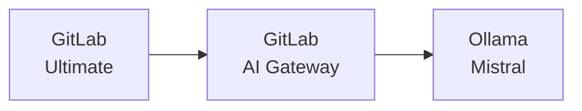



- Édition : GitLab Ultimate
- Module d'extension : GitLab Duo Pro ou Enterprise
- Offre : GitLab Self-Managed



Ce document décrit l'installation et l'intégration de GitLab et GitLab Duo avec un Grand Modèle de Langage (LLM) auto-hébergé exécutant un modèle Mistral sur Ollama. Le guide décrit la configuration à l'aide de 3 machines virtuelles différentes et peut être suivi sur AWS ou GCP. Bien entendu, le processus est également applicable à d'autres plateformes de déploiement.

Ce guide constitue un ensemble complet d'instructions de bout en bout pour mettre en place la configuration souhaitée. Il référence les nombreuses sections de la documentation GitLab qui ont été utilisées pour élaborer la configuration finale. Les documents référencés sont importants lorsqu'un contexte supplémentaire est nécessaire pour adapter l'implémentation à un scénario spécifique.
<!-- TOC -->

- GitLab Duo Self-Hosted : guide de déploiement complet AWS/Google Cloud avec intégration Ollama
  - [Prérequis](#prerequisites)
    - [Machines virtuelles](#virtual-machines)
      - [Ressources et système d'exploitation](#resources--operating-system)
      - [Réseau](#networking)
    - [GitLab](#gitlab)
      - [Licences](#licensing)
      - [SSL/TLS](#ssltls)
- [Introduction](#introduction)
  - [Installation](#installation)
    - [Passerelle d'IA](#ai-gateway)
    - [Ollama](#ollama)
      - [Installation](#installation)
      - [Déploiement du modèle](#model-deployment)
  - [Intégration](#integration)
    - [Activer GitLab Duo pour l'utilisateur root](#enable-gitlab-duo-for-root-user)
    - [Configurer le modèle auto-hébergé dans GitLab](#configure-gitlab-duo-self-hosted-in-gitlab)
  - [Vérification](#verification)

<!-- /TOC -->

## Prérequis {#prerequisites}

### Machines virtuelles {#virtual-machines}

#### Ressources et système d'exploitation {#resources--operating-system}

Nous installerons GitLab, la passerelle d'IA GitLab et Ollama chacun dans leur propre machine virtuelle distincte. Bien que nous ayons utilisé Ubuntu 24.0x dans ce guide, vous avez la liberté de choisir tout système d'exploitation Unix qui répond aux exigences et aux préférences de votre organisation. Cependant, l'utilisation d'un système d'exploitation Unix est obligatoire pour cette configuration. Cela garantit la stabilité du système, la sécurité et la compatibilité avec la pile logicielle requise. Cette configuration offre un bon équilibre entre coût et performance pour les phases de test et d'évaluation, bien que vous puissiez avoir besoin de mettre à niveau le type d'instance GPU lors du passage en production, en fonction de vos besoins d'utilisation et de la taille de votre équipe.

|                | **GCP**       | **AWS**     | **OS**    | **Disk** |
|----------------|---------------|-------------|-----------|----------|
| **GitLab**     | c2-standard-4 | c6xlarge    | Ubuntu 24 | 50 Go    |
| **Passerelle d'IA** | e2-medium     | t2.medium   | Ubuntu 24 | 20 Go    |
| **Ollama**     | n1-standard-4 | g4dn.xlarge | Ubuntu 24 | 50 Go    |

Pour plus d'informations sur le composant et son rôle, consultez [AI Gateway](../../administration/gitlab_duo/gateway.md).



Ces composants fonctionnent ensemble pour réaliser la fonctionnalité d'IA auto-hébergée. Ce guide fournit des instructions détaillées pour créer un environnement d'IA auto-hébergé complet en utilisant Ollama comme serveur LLM.

> [!note]
> Pour un environnement de production complet, la [documentation officielle](../../administration/gitlab_duo_self_hosted/supported_models_and_hardware_requirements.md) recommande des instances GPU plus puissantes telles que 1x NVIDIA A100 (40 Go). Cependant, le type d'instance g4dn.xlarge devrait être suffisant à des fins d'évaluation avec une petite équipe d'utilisateurs.

#### Réseau {#networking}

Pour permettre l'accès à GitLab, une adresse IP publique statique (telle qu'une IP Elastic dans AWS ou une IP externe dans Google Cloud) est requise. Tous les autres composants peuvent et doivent utiliser des adresses IP internes statiques pour la communication interne. Nous supposons que toutes les VM sont sur le même réseau et peuvent communiquer directement.

|                | **Public IP** | **Private IP** |
|----------------|---------------|----------------|
| **GitLab**     | oui           | oui            |
| **Passerelle d'IA** | non            | oui            |
| **Ollama**     | non            | oui            |

Pourquoi utiliser des IP internes ?

- Les IP internes restent statiques tout au long de la durée de vie d'une instance dans AWS/Google Cloud.
- Seul le serveur GitLab nécessite un accès externe, tandis que les autres composants, comme Ollama, s'appuient sur la communication interne.
- Cette approche réduit les coûts en évitant les frais liés aux adresses IP publiques et renforce la sécurité en maintenant le serveur LLM inaccessible depuis Internet.

### GitLab {#gitlab}

La suite de ce guide suppose que vous disposez déjà d'une instance GitLab opérationnelle qui répond aux exigences suivantes :

#### Licences {#licensing}

L'utilisation de GitLab Duo Self-Hosted nécessite à la fois une licence GitLab Ultimate et une licence GitLab Duo Enterprise. La licence GitLab Ultimate fonctionne avec les options de licence en ligne ou hors ligne. Cette documentation suppose que les deux licences ont été préalablement obtenues et sont disponibles pour l'implémentation.


#### SSL/TLS {#ssltls}

Un certificat SSL valide (tel que Let's Encrypt) doit être configuré pour l'instance GitLab. Il ne s'agit pas uniquement d'une bonne pratique de sécurité, mais d'une exigence technique, car :

- Le système de passerelle d'IA (depuis janvier 2025) exige strictement une vérification SSL appropriée lors de la communication avec GitLab
- Les certificats auto-signés ne sont pas acceptés par la passerelle d'IA
- Les connexions non SSL (HTTP) ne sont pas non plus prises en charge

GitLab propose un processus d'installation SSL automatisé pratique :

- Lors de l'installation de GitLab, spécifiez simplement votre URL avec le préfixe `https://`
- GitLab effectuera automatiquement les opérations suivantes :
  - Obtenir un certificat SSL Let's Encrypt
  - Installer le certificat
  - Configurer HTTPS
- Aucune gestion manuelle des certificats SSL n'est requise

Lors de l'installation de GitLab, la procédure ressemble à ceci :

1. Allouer et associer une adresse IP publique et statique à l'instance GitLab
1. Configurer vos enregistrements DNS pour pointer vers cette adresse
1. Lors de l'installation de GitLab, utilisez votre URL HTTPS (par exemple, `https://gitlab.yourdomain.com`)
1. Laisser GitLab gérer automatiquement la configuration du certificat SSL

Pour plus de détails, consultez la page de [documentation](https://docs.gitlab.com/omnibus/settings/ssl/).

## Introduction {#introduction}

Avant de configurer GitLab Duo Self-Hosted, il est important de comprendre le fonctionnement de l'IA. Le modèle d'IA est le cerveau de l'IA, entraîné avec des données. Ce cerveau a besoin d'un cadre pour fonctionner, appelé plateforme de service LLM ou simplement « Serving Platform ». Dans AWS, il s'agit d'« Amazon Bedrock », dans Azure, c'est l'« Azure OpenAI Service », et pour ChatGPT, c'est leur propre plateforme. Pour Anthropic, il s'agit de « Claude ». Pour l'auto-hébergement de modèles, Ollama est un choix courant.

Par exemple :

- Dans AWS, la plateforme de service est Amazon Bedrock.
- Dans Azure, il s'agit de l'Azure OpenAI Service.
- Pour ChatGPT, il s'agit de la plateforme propriétaire d'OpenAI
- Pour Anthropic, la plateforme de service est Claude.

Lorsque vous hébergez vous-même un modèle d'IA, vous devez également choisir une plateforme de service. Ollama est une option populaire pour les modèles auto-hébergés.

Dans cette analogie, la partie cerveau de ChatGPT est le modèle GPT-4, tandis que dans l'écosystème Anthropic, c'est le modèle Claude 3.7 Sonnet. La plateforme de service joue le rôle de cadre essentiel qui connecte le cerveau au monde, lui permettant de « penser » et d'interagir efficacement.

Pour plus d'informations sur les plateformes de service et les modèles pris en charge, consultez [LLM Serving Platforms](../../administration/gitlab_duo_self_hosted/supported_llm_serving_platforms.md) et [Models](../../administration/gitlab_duo_self_hosted/supported_models_and_hardware_requirements.md).

**Qu'est-ce qu'Ollama** ?

Ollama est un framework open source simplifié pour l'exécution de Grands Modèles de Langage (LLM) dans des environnements locaux. Il simplifie le processus traditionnellement complexe de déploiement de modèles d'IA, le rendant accessible aussi bien aux particuliers qu'aux organisations à la recherche de solutions d'IA efficaces, flexibles et évolutives.

Points clés :

1. **Simplified Deployment** : une interface en ligne de commande conviviale garantit une configuration rapide et une installation sans difficulté.
1. **Wide Model Support** : compatible avec les modèles open source populaires tels que Llama 2, Mistral et Code Llama.
1. **Optimized Performance** : fonctionne de manière fluide dans les environnements GPU et CPU pour une utilisation efficace des ressources.
1. **Integration-Ready** : dispose d'une API compatible OpenAI pour une intégration facile avec les outils et flux de travail existants.
1. **No Containers Needed** : s'exécute directement sur les systèmes hôtes, éliminant le besoin de Docker ou d'environnements conteneurisés.
1. **Versatile Hosting Options** : déployable sur des machines locales, des serveurs sur site ou des instances GPU dans le cloud.

Conçu pour la simplicité et la performance, Ollama permet aux utilisateurs d'exploiter la puissance des LLM sans la complexité d'une infrastructure d'IA traditionnelle. Des détails supplémentaires sur la configuration et les modèles pris en charge seront abordés plus loin dans la documentation.

- [Prise en charge des modèles Ollama](https://ollama.com/search)

## Installation {#installation}

### AI Gateway {#ai-gateway}

Bien que le guide d'installation officiel soit disponible dans [Installer la passerelle d'IA GitLab](../../install/install_ai_gateway.md), voici une approche simplifiée pour configurer la passerelle d'IA. Depuis janvier 2025, l'image `gitlab/model-gateway:self-hosted-v17.6.0-ee` a été vérifiée comme compatible avec GitLab 17.7.

1. Assurez-vous que...

   - Le port TCP 5052 vers la VM API Gateway est autorisé (vérifiez la configuration du groupe de sécurité)
   - Vous remplacez `GITLAB_DOMAIN` par le nom de domaine de VOTRE instance GitLab dans l'extrait de code suivant :

1. Exécutez la commande suivante pour démarrer la passerelle d'IA GitLab :

   ```shell
   GITLAB_DOMAIN="gitlab.yourdomain.com"
   docker run -p 5052:5052 \
     -e AIGW_GITLAB_URL=$GITLAB_DOMAIN \
     -e AIGW_GITLAB_API_URL=https://${GITLAB_DOMAIN}/api/v4/ \
     -e AIGW_AUTH__BYPASS_EXTERNAL=true \
     gitlab/model-gateway:self-hosted-v17.6.0-ee
   ```

Le tableau suivant explique les variables d'environnement clés et leurs rôles dans la configuration de votre instance :

| **Variable**                 | **Description** |
|------------------------------|-----------------|
| `AIGW_GITLAB_URL`            | Le domaine de votre instance GitLab. |
| `AIGW_GITLAB_API_URL`        | Le point de terminaison de l'API de votre instance GitLab. |
| `AIGW_AUTH__BYPASS_EXTERNAL` | Configuration pour la gestion de l'authentification. |

Lors de la phase de configuration initiale et de test, vous pouvez définir `AIGW_AUTH__BYPASS_EXTERNAL=true`pour contourner l'authentification et éviter les problèmes. Cependant, cette configuration ne doit jamais être utilisée dans un environnement de production ou sur des serveurs exposés à Internet.

### Ollama {#ollama}

#### Installation {#installation-1}

1. Installez Ollama à l'aide du script d'installation officiel :

   ```shell
   curl --fail --silent --show-error --location "https://ollama.com/install.sh" | sh
   ```

1. Configurez Ollama pour écouter sur l'IP interne en ajoutant la variable d'environnement `OLLAMA_HOST` à sa configuration de démarrage

   ```shell
   systemctl edit ollama.service
   ```

   ```ini
   [Service]
   Environment="OLLAMA_HOST=172.31.11.27"
   ```

   > [!note]
   > Remplacez l'adresse IP par l'adresse IP interne réelle de votre serveur.
1. Rechargez et redémarrez le service :

   ```shell
   systemctl daemon-reload
   systemctl restart ollama
   ```

#### Déploiement du modèle {#model-deployment}

1. Définissez la variable d'environnement :

   ```shell
   export OLLAMA_HOST=172.31.11.27
   ```

1. Installez le modèle Mistral Instruct :

   ```shell
   ollama pull mistral:instruct
   ```

   Le modèle `mistral:instruct` nécessite environ 4,1 Go d'espace de stockage et le téléchargement prendra un certain temps selon la vitesse de votre connexion.
1. Vérifiez l'installation du modèle :

   ```shell
   ollama list
   ```

   La commande doit afficher le modèle installé dans la liste. 

## Intégration {#integration}

### Activer GitLab Duo pour l'utilisateur root {#enable-gitlab-duo-for-root-user}

1. Accéder à l'interface Web GitLab

   - Se connecter en tant qu'utilisateur administrateur
   - Accéder à la zone d'administration (icône de clé à molette)

1. Configurer la licence Duo

   - Accédez à la section « Subscription » dans la barre latérale gauche
   - Vous devriez voir « Seats used : 1/5 » indiquant les sièges Duo disponibles
   - Remarque : un seul siège est nécessaire pour l'utilisateur root

1. Attribuer la licence Duo à root

   - Accédez à « Admin area » > « GitLab Duo » > « Seat utilization »
   - Localisez l'utilisateur root (Administrateur) dans la liste des utilisateurs
   - Activez le commutateur dans la colonne « GitLab Duo Enterprise » pour activer Duo pour l'utilisateur root
   - Le bouton bascule doit devenir bleu lorsqu'il est activé


> [!note]
> L'activation de Duo uniquement pour l'utilisateur root est suffisante pour la configuration initiale et les tests. Des utilisateurs supplémentaires peuvent se voir accorder l'accès à Duo ultérieurement si nécessaire, dans les limites de vos sièges de licence.

### Configurer GitLab Duo Self-Hosted dans GitLab {#configure-gitlab-duo-self-hosted-in-gitlab}

1. Accéder à la configuration de GitLab Duo Self-Hosted

   - Accédez à Admin Area > GitLab Duo > « Configure GitLab Duo Self-hosted »
   - Cliquez sur le bouton « Add self-hosted model »

   
1. Configurer les paramètres du modèle

   - **Nom de déploiement** : choisissez un nom descriptif (par exemple `Mistral-7B-Instruct-v0.3 on AWS Tokyo`)
   - **Famille de modèles** : sélectionnez « Mistral » dans la liste déroulante
   - **Point de terminaison** : saisissez l'URL de votre serveur Ollama au format :

     ```plaintext
     http://[Internal-IP]:11434/v1
     ```

     Exemple : `http://172.31.11.27:11434/v1`

   - **Identifiant du modèle** : saisissez `custom_openai/mistral:instruct`
   - **API Key** : saisissez n'importe quel texte de remplacement (par exemple, `test`) car ce champ ne peut pas être laissé vide


1. Activer les fonctionnalités d'IA

   - Accédez à l'onglet « AI-native features »
   - Attribuez le modèle configuré aux fonctionnalités suivantes :
     - Code Suggestions > Code Generation
     - Code Suggestions > Code Completion
     - GitLab Duo Chat > General Chat
   - Sélectionnez votre modèle déployé dans la liste déroulante pour chaque fonctionnalité


Ces paramètres établissent la connexion entre votre instance GitLab et le modèle Ollama auto-hébergé via la passerelle d'IA, activant ainsi les fonctionnalités natives de l'IA dans GitLab.

## Vérification {#verification}

1. Créer un groupe de test dans GitLab
1. L'icône GitLab Duo Chat doit apparaître dans le coin supérieur droit
1. Cela indique une intégration réussie entre GitLab et la passerelle d'IA


