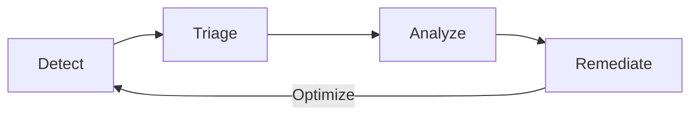



- Édition : Gratuite, GitLab Premium, GitLab Ultimate
- Offre : GitLab.com, GitLab Self-Managed, GitLab Dedicated



Les tests de sécurité des applications GitLab assurent une détection continue des vulnérabilités, pendant le développement et après le déploiement des modifications.

Les tests de sécurité des applications analysent le code source, les dépendances, les bibliothèques et les images de conteneur de votre projet. Les vulnérabilités d'exécution sont détectées par le biais d'attaques simulées et de tests de fuzzing contre votre application déployée dans un environnement de test.

Pendant le développement, les analyses s'exécutent automatiquement dans le cadre des pipelines CI/CD lorsque du code est commité ou que des merge requests sont créées. Les résultats de sécurité apparaissent directement dans les merge requests et les IDE, informant les développeurs avant que le code ne soit fusionné. Cette approche proactive réduit le coût et l'effort liés à la correction des tickets plus tard dans le développement.

En dehors du cycle de développement, vous pouvez exécuter des analyses de sécurité à la demande ou les planifier à intervalles réguliers. À mesure que les bases de données de vulnérabilités sont mises à jour avec des menaces nouvellement découvertes et des exploits zero-day, de nouveaux risques pour les bibliothèques logicielles et les images de conteneur de votre projet sont identifiés. Ensemble, ces méthodes permettent d'identifier des risques qui n'étaient pas connus auparavant lors du cycle de développement initial.

Pour une démonstration interactive, consultez [Intégrer la sécurité au pipeline](https://gitlab.navattic.com/gitlab-scans).
<!-- Demo published on 2024-01-15 -->

## Cycle de gestion des vulnérabilités {#vulnerability-management-cycle}

GitLab permet de mettre en place un workflow complet de gestion des vulnérabilités qui vous aide à améliorer en continu votre posture de sécurité applicative. Ce workflow est un cycle continu de détection, de triage, d'analyse, de remédiation et d'optimisation.

1. Détecter : identifier les vulnérabilités grâce aux tests de sécurité automatisés.
1. Trier : évaluer et prioriser les vulnérabilités afin de déterminer lesquelles nécessitent une attention immédiate et lesquelles peuvent être traitées ultérieurement.
1. Analyser : effectuer une analyse détaillée des vulnérabilités confirmées pour comprendre leur impact et déterminer les stratégies de remédiation appropriées.
1. Remédier : corriger la cause racine des vulnérabilités ou mettre en œuvre des mesures d'atténuation des risques appropriées.

Utilisez les résultats de chaque phase pour améliorer le cycle suivant. Par exemple, ajustez les règles de détection pour réduire les faux positifs identifiés lors de l'analyse.

Ce cycle se répète à chaque modification du code, vous permettant d'améliorer progressivement à la fois la sécurité de votre application et vos processus de gestion des vulnérabilités. Cette amélioration continue signifie que votre gestion des vulnérabilités devient plus efficace et plus performante au fil du temps.
