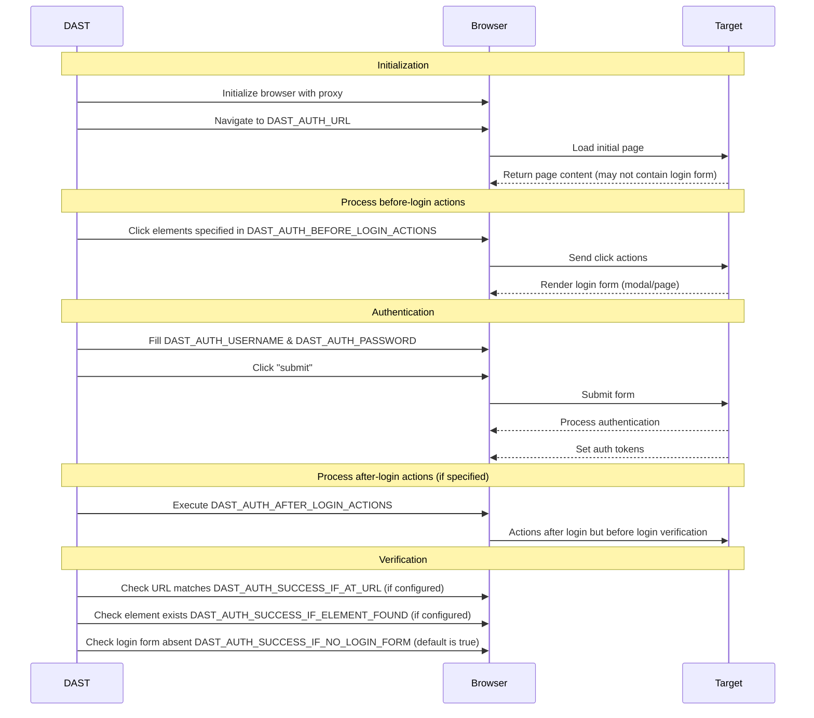

Pour une couverture complète, l'analyseur DAST doit s'authentifier auprès de l'application testée. Cela nécessite de configurer les identifiants d'authentification et la méthode d'authentification dans le job CI/CD DAST.

DAST nécessite une authentification pour :

- Simuler des attaques réelles et identifier les vulnérabilités susceptibles d'être exploitées par des attaquants.
- Tester les fonctionnalités spécifiques à l'utilisateur et les comportements personnalisés qui peuvent n'être visibles qu'après authentification.

Le job DAST s'authentifie auprès de l'application, le plus souvent en remplissant et en soumettant un formulaire de connexion dans un navigateur. Une fois le formulaire soumis, le job DAST confirme que l'authentification a réussi. Si l'authentification a réussi, le job DAST continue et enregistre également les identifiants pour les réutiliser lors de l'exploration de l'application cible. Dans le cas contraire, le job DAST s'arrête.

Les méthodes d'authentification prises en charge par DAST incluent :

- Formulaire de connexion en une seule étape
- Formulaire de connexion en plusieurs étapes
- Authentification auprès d'URL situées en dehors de l'URL cible configurée

Lors du choix des identifiants d'authentification :

- **NE PAS** utiliser des identifiants valides pour des systèmes de production, des serveurs de production, ou utilisés pour accéder à des données de production.
- **NE PAS** exécuter un scan authentifié contre un serveur de production. Les scans authentifiés peuvent effectuer **n'importe quelles** fonctions que l'utilisateur authentifié peut réaliser, notamment modifier ou supprimer des données, soumettre des formulaires et suivre des liens. N'exécutez un scan authentifié que contre des systèmes ou des serveurs hors production.
- Fournissez des identifiants permettant à DAST de tester l'intégralité de l'application.
- Notez la date d'expiration des identifiants, le cas échéant, pour référence future. Par exemple, avec un gestionnaire de mots de passe tel que 1Password.

Le diagramme suivant illustre l'utilisation des variables d'authentification aux différentes étapes de l'authentification :



## Premiers pas {#getting-started}

> [!note]
> Vous devriez confirmer périodiquement que l'authentification de l'analyseur fonctionne toujours, car celle-ci tend à se rompre au fil du temps en raison des modifications apportées à l'application.

Pour exécuter un scan authentifié DAST :

- Lisez les conditions [prérequises](#prerequisites) pour l'authentification.
- [Mettez à jour votre site web cible](#update-the-target-website) vers une page d'accueil d'un utilisateur authentifié.
- Si votre formulaire de connexion contient le nom d'utilisateur, le mot de passe et le bouton de soumission sur une seule page, utilisez les [variables CI/CD](#available-cicd-variables) pour configurer l'authentification par formulaire de connexion [en une seule étape](#configuration-for-a-single-step-login-form).
- Si votre formulaire de connexion comporte les champs nom d'utilisateur et mot de passe sur des pages différentes, utilisez les [variables CI/CD](#available-cicd-variables) pour configurer l'authentification par formulaire de connexion [en plusieurs étapes](#configuration-for-a-multi-step-login-form).
- Assurez-vous que l'utilisateur n'est pas [déconnecté](#excluding-logout-urls) pendant le scan.

### Prérequis {#prerequisites}

- Vous disposez du nom d'utilisateur et du mot de passe de l'utilisateur avec lequel vous souhaitez vous authentifier pendant le scan.
- Vous avez vérifié les [problèmes connus](#known-issues) pour vous assurer que DAST peut s'authentifier auprès de votre application.
- Vous avez satisfait les prérequis si vous utilisez l'[authentification par formulaire](#form-authentication).
- Vous avez satisfait les prérequis supplémentaires si votre flux d'authentification par formulaire inclut un [mot de passe à usage unique basé sur le temps](#totp-authentication).
- Vous avez réfléchi à la manière dont vous pouvez [vérifier](#verifying-authentication-is-successful) si l'authentification a réussi ou non.

#### Authentification par formulaire {#form-authentication}

- Vous connaissez l'URL du formulaire de connexion de votre application. Vous savez également comment accéder au formulaire de connexion depuis l'URL d'authentification (voir [cliquer pour accéder au formulaire de connexion](#clicking-to-go-to-the-login-form)).
- Vous connaissez les [sélecteurs](#finding-an-elements-selector) des champs HTML nom d'utilisateur et mot de passe que DAST utilise pour saisir les valeurs respectives.
- Vous connaissez le [sélecteur](#finding-an-elements-selector) de l'élément qui soumet le formulaire de connexion lorsqu'il est sélectionné.

#### Authentification TOTP {#totp-authentication}



- [Introduit](https://gitlab.com/groups/gitlab-org/-/epics/13633) dans la version 6.9 du scanner



- Vous disposez de la clé secrète pour l'enrôlement TOTP de l'utilisateur de test, encodée en Base32.
- Vous avez confirmé que le fournisseur d'authentification prend en charge la configuration TOTP suivante (identique à Google Authenticator) :
  - Algorithme HMAC : SHA-1
  - Intervalle de temps : 30 secondes
  - Longueur du jeton : 6
- Vous connaissez les [sélecteurs](#finding-an-elements-selector) du champ TOTP que DAST utilise pour saisir le jeton TOTP généré.
- Vous connaissez le [sélecteur](#finding-an-elements-selector) de l'élément qui soumet le jeton TOTP, s'il est soumis séparément du mot de passe.

### Variables CI/CD disponibles {#available-cicd-variables}

Pour obtenir la liste des variables CI/CD d'authentification DAST, consultez [Variables d'authentification](variables.md#authentication).

Le tableau des variables CI/CD DAST est généré par la tâche Rake `bundle exec rake gitlab:dast_variables:compile_docs`. Il utilise les métadonnées de variables définies dans [`lib/gitlab/security/dast_variables.rb`](https://gitlab.com/gitlab-org/gitlab/-/blob/master/lib/gitlab/security/dast_variables.rb).

### Mettre à jour le site web cible {#update-the-target-website}

Le site web cible, défini à l'aide de la variable CI/CD `DAST_TARGET_URL`, est l'URL que DAST utilise pour commencer l'exploration de votre application.

Pour obtenir les meilleurs résultats d'exploration lors d'un scan authentifié, le site web cible doit être une URL accessible uniquement après l'authentification de l'utilisateur. Il s'agit souvent de l'URL de la page sur laquelle l'utilisateur atterrit après s'être connecté.

Par exemple :

```yaml
include:
  - template: DAST.gitlab-ci.yml

dast:
  variables:
    DAST_TARGET_URL: "https://example.com/dashboard/welcome"
    DAST_AUTH_URL: "https://example.com/login"
```

### Configuration pour l'authentification HTTP {#configuration-for-http-authentication}

Pour utiliser un [schéma d'authentification HTTP](https://www.chromium.org/developers/design-documents/http-authentication/) tel que l'authentification de base, vous pouvez définir la valeur `DAST_AUTH_TYPE` sur `basic-digest`. D'autres schémas tels que Negotiate ou NTLM peuvent fonctionner, mais ne sont pas officiellement pris en charge en raison du manque actuel de couverture de tests automatisés.

La configuration nécessite que les variables CI/CD `DAST_AUTH_TYPE`, `DAST_AUTH_URL`, `DAST_AUTH_USERNAME`, `DAST_AUTH_PASSWORD` soient définies pour le job DAST. Si vous ne disposez pas d'une URL de connexion unique, définissez `DAST_AUTH_URL` sur la même URL que `DAST_TARGET_URL`.

```yaml
include:
  - template: DAST.gitlab-ci.yml

dast:
  variables:
    DAST_TARGET_URL: "https://example.com"
    DAST_AUTH_TYPE: "basic-digest"
    DAST_AUTH_URL: "https://example.com"
```

Ne définissez pas `DAST_AUTH_USERNAME` et `DAST_AUTH_PASSWORD` dans le fichier YAML de définition du job, car cela pourrait présenter un risque de sécurité. À la place, créez-les en tant que variables CI/CD masquées à l'aide de l'interface utilisateur GitLab. Consultez [Variables CI/CD personnalisées](../../../../../ci/variables/_index.md#for-a-project) pour plus d'informations.

### Configuration pour un formulaire de connexion en une seule étape {#configuration-for-a-single-step-login-form}

Un formulaire de connexion en une seule étape regroupe tous les éléments du formulaire de connexion sur une seule page. La configuration nécessite que les variables CI/CD `DAST_AUTH_URL`, `DAST_AUTH_USERNAME`, `DAST_AUTH_USERNAME_FIELD`, `DAST_AUTH_PASSWORD`, `DAST_AUTH_PASSWORD_FIELD` et `DAST_AUTH_SUBMIT_FIELD` soient définies pour le job DAST.

Vous devez configurer l'URL et les sélecteurs des champs dans le YAML de définition du job, par exemple :

```yaml
include:
  - template: DAST.gitlab-ci.yml

dast:
  variables:
    DAST_TARGET_URL: "https://example.com"
    DAST_AUTH_URL: "https://example.com/login"
    DAST_AUTH_USERNAME_FIELD: "css:[name=username]"
    DAST_AUTH_PASSWORD_FIELD: "css:[name=password]"
    DAST_AUTH_SUBMIT_FIELD: "css:button[type=submit]"
```

Ne définissez pas `DAST_AUTH_USERNAME` et `DAST_AUTH_PASSWORD` dans le fichier YAML de définition du job, car cela pourrait présenter un risque de sécurité. À la place, créez-les en tant que variables CI/CD masquées à l'aide de l'interface utilisateur GitLab. Consultez [Variables CI/CD personnalisées](../../../../../ci/variables/_index.md#for-a-project) pour plus d'informations.

### Configuration pour un formulaire de connexion en plusieurs étapes {#configuration-for-a-multi-step-login-form}

Un formulaire de connexion en plusieurs étapes comporte deux pages. La première page contient un formulaire avec le nom d'utilisateur et un bouton de soumission pour passer à l'étape suivante. Si le nom d'utilisateur est valide, un second formulaire sur la page suivante contient le mot de passe et le bouton de soumission du formulaire.

La configuration nécessite que les variables CI/CD suivantes soient définies pour le job DAST :

- `DAST_AUTH_URL`
- `DAST_AUTH_USERNAME`
- `DAST_AUTH_USERNAME_FIELD`
- `DAST_AUTH_FIRST_SUBMIT_FIELD`
- `DAST_AUTH_PASSWORD`
- `DAST_AUTH_PASSWORD_FIELD`
- `DAST_AUTH_SUBMIT_FIELD`

Vous devez configurer l'URL et les sélecteurs des champs dans le YAML de définition du job, par exemple :

```yaml
include:
  - template: DAST.gitlab-ci.yml

dast:
  variables:
    DAST_TARGET_URL: "https://example.com"
    DAST_AUTH_URL: "https://example.com/login"
    DAST_AUTH_USERNAME_FIELD: "css:[name=username]"
    DAST_AUTH_FIRST_SUBMIT_FIELD: "css:button[name=next]"
    DAST_AUTH_PASSWORD_FIELD: "css:[name=password]"
    DAST_AUTH_SUBMIT_FIELD: "css:button[type=submit]"
```

Ne définissez pas `DAST_AUTH_USERNAME` et `DAST_AUTH_PASSWORD` dans le fichier YAML de définition du job, car cela pourrait présenter un risque de sécurité. À la place, créez-les en tant que variables CI/CD masquées à l'aide de l'interface utilisateur GitLab. Consultez [Variables CI/CD personnalisées](../../../../../ci/variables/_index.md#for-a-project) pour plus d'informations.

### Configuration pour le mot de passe à usage unique basé sur le temps (TOTP) {#configuration-for-time-based-one-time-password-totp}

La configuration pour TOTP nécessite que ces variables CI/CD soient définies pour le job DAST :

- `DAST_AUTH_OTP_FIELD`
- `DAST_AUTH_OTP_KEY`

Si le jeton TOTP est soumis dans son propre formulaire après la soumission du mot de passe, vous devez également définir cette variable :

- `DAST_AUTH_OTP_SUBMIT_FIELD`

Les variables de sélecteur `_FIELD` peuvent être définies dans le YAML de définition du job, par exemple :

```yaml
include:
  - template: DAST.gitlab-ci.yml

dast:
  variables:
    DAST_TARGET_URL: "https://example.com"
    DAST_AUTH_URL: "https://example.com/login"
    DAST_AUTH_USERNAME_FIELD: "css:[name=username]"
    DAST_AUTH_PASSWORD_FIELD: "css:[name=password]"
    DAST_AUTH_SUBMIT_FIELD: "css:button[type=submit]"
    DAST_AUTH_OTP_FIELD: "name:otp"
    DAST_AUTH_OTP_SUBMIT_FIELD: "css:input[type=submit]"
```

Ne définissez pas `DAST_AUTH_OTP_KEY` dans le fichier YAML de définition du job, car cela pourrait présenter un risque de sécurité. À la place, créez-la en tant que variable CI/CD masquée à l'aide de l'interface utilisateur GitLab. Consultez [Variables CI/CD personnalisées](../../../../../ci/variables/_index.md#for-a-project) pour plus d'informations.

### Configuration pour l'authentification unique (SSO) {#configuration-for-single-sign-on-sso}

Si un utilisateur peut se connecter à une application, dans la plupart des cas, DAST est également capable de se connecter. Même lorsqu'une application utilise l'authentification unique (Single Sign-On). Les applications utilisant des solutions SSO doivent configurer l'authentification DAST à l'aide des guides de configuration de formulaire de connexion [en une seule étape](#configuration-for-a-single-step-login-form) ou [en plusieurs étapes](#configuration-for-a-multi-step-login-form).

DAST prend en charge les processus d'authentification dans lesquels un utilisateur est redirigé vers le site d'un fournisseur d'identité externe pour se connecter. Consultez les [problèmes connus](#known-issues) de l'authentification DAST pour déterminer si votre processus d'authentification SSO est pris en charge.

### Configuration pour l'authentification intégrée Windows (Kerberos) {#configuration-for-windows-integrated-authentication-kerberos}

L'authentification intégrée Windows (Kerberos) est un mécanisme d'authentification courant pour les applications métier (LOB) hébergées dans un domaine Windows. Elle fournit une authentification sans invite en utilisant la session d'ordinateur de l'utilisateur.

Pour configurer cette forme d'authentification, effectuez les étapes suivantes :

1. Collectez les informations nécessaires avec l'aide de votre équipe informatique/opérations.
1. Créez ou mettez à jour la définition du job `dast` dans votre fichier `.gitlab-ci.yml`.
1. Remplissez le fichier exemple `krb5.conf` à l'aide des informations collectées.
1. Définissez les variables de job nécessaires.
1. Définissez les variables secrètes nécessaires en utilisant la page **Paramètres** du projet.
1. Testez et vérifiez que l'authentification fonctionne correctement.

Collectez les informations suivantes avec l'aide de votre département informatique/opérations :

- Nom du domaine Windows ou du Realm Kerberos (doit contenir un point dans le nom, comme `EXAMPLE.COM`)
- Nom d'hôte du contrôleur de domaine Windows/Kerberos
- Pour Kerberos, le nom du serveur d'authentification. Pour les domaines Windows, il s'agit du contrôleur de domaine.

Créez le fichier `krb5.conf` :

```ini
[libdefaults]
  # Realm is another name for domain name
  default_realm = EXAMPLE.COM
  # These settings are not needed for Windows Domains
  # they support other Kerberos implementations
  kdc_timesync = 1
  ccache_type = 4
  forwardable = true
  proxiable = true
  rdns = false
  fcc-mit-ticketflags = true
[realms]
  EXAMPLE.COM = {
    # Domain controller or KDC
    kdc = kdc.example.com
    # Domain controller or admin server
    admin_server = kdc.example.com
  }
[domain_realm]
  # Mapping DNS domains to realms/Windows domain
  # DNS domains provided by DAST_AUTH_NEGOTIATE_DELEGATION
  # should also be represented here (but without the wildcard)
  .example.com = EXAMPLE.COM
  example.com = EXAMPLE.COM
```

Cette configuration utilise la variable `DAST_AUTH_NEGOTIATE_DELEGATION`. Cette variable définit les politiques Chromium suivantes nécessaires pour permettre l'authentification intégrée :

- [AuthServerAllowlist](https://chromeenterprise.google/policies/#AuthServerAllowlist)
- [AuthNegotiateDelegateAllowlist](https://chromeenterprise.google/policies/#AuthNegotiateDelegateAllowlist)

Les paramètres de cette variable sont les domaines DNS associés à votre domaine Windows ou Realm Kerberos. Vous devez les fournir :

- En minuscules et en majuscules
- Avec un motif générique et uniquement le nom de domaine

Dans notre exemple, le domaine Windows est `EXAMPLE.COM` et le domaine DNS est `example.com`. Cela nous donne une valeur de `*.example.com,example.com,*.EXAMPLE.COM,EXAMPLE.COM` pour `DAST_AUTH_NEGOTIATE_DELEGATION`.

Rassemblez le tout dans une définition de job :

```yaml
# This job will extend the dast job defined in
# the DAST template which must also be included.
dast:
  image:
    name: "$SECURE_ANALYZERS_PREFIX/dast:$DAST_VERSION$DAST_IMAGE_SUFFIX"
    docker:
      user: root
  variables:
    DAST_TARGET_URL: https://target.example.com
    DAST_AUTH_URL: https://target.example.com
    DAST_AUTH_TYPE: basic-digest
    DAST_AUTH_NEGOTIATE_DELEGATION: '*.example.com,example.com,*.EXAMPLE.COM,EXAMPLE.COM'
    # Not shown -- DAST_AUTH_USERNAME, DAST_AUTH_PASSWORD set via Settings -> CI -> Variables
  before_script:
    - KRB5_CONF='
[libdefaults]
  default_realm = EXAMPLE.COM
  kdc_timesync = 1
  ccache_type = 4
  forwardable = true
  proxiable = true
  rdns = false
  fcc-mit-ticketflags = true
[realms]
  EXAMPLE.COM = {
    kdc = ad1.example.com
    admin_server = ad1.example.com
  }
[domain_realm]
  .example.com = EXAMPLE.COM
  example.com = EXAMPLE.COM
'
    - cat "$KRB5_CONF" > /etc/krb5.conf
    - echo '$DAST_AUTH_PASSWORD' | kinit $DAST_AUTH_USERNAME
    - klist
```

Résultat attendu :

La sortie console du job contient le résultat du script `before`. Cela ressemblera à ce qui suit si l'authentification a réussi. Le job devrait échouer en cas d'échec sans exécuter de scan.

```plaintext
Password for mike@EXAMPLE.COM:
Ticket cache: FILE:/tmp/krb5cc_1000
Default principal: mike@EXAMPLE.COM

Valid starting       Expires              Service principal
11/11/2024 21:50:50  11/12/2024 07:50:50  krbtgt/EXAMPLE.COM@EXAMPLE.COM
        renew until 11/12/2024 21:50:50
```

Le scanner DAST produira également la sortie suivante, indiquant le succès :

```plaintext
2024-11-08T17:03:09.226 INF AUTH  attempting to authenticate find_auth_fields="basic-digest"
2024-11-08T17:03:09.226 INF AUTH  loading login page LoginURL="https://target.example.com"
2024-11-08T17:03:10.619 INF AUTH  verifying if login attempt was successful true_when="HTTP status code < 400 and has authentication token and no login form found (auto-detected)"
2024-11-08T17:03:10.619 INF AUTH  requirement is satisfied, HTTP login request returned status code 200 want="HTTP status code < 400" url="https://target.example.com/"
2024-11-08T17:03:10.623 INF AUTH  requirement is satisfied, did not detect a login form want="no login form found (auto-detected)"
2024-11-08T17:03:10.623 INF AUTH  authentication token cookies names=""
2024-11-08T17:03:10.623 INF AUTH  authentication token storage events keys=""
2024-11-08T17:03:10.623 INF AUTH  requirement is satisfied, basic authentication detected want="has authentication token"
2024-11-08T17:03:11.230 INF AUTH  login attempt succeeded
```

### Cliquer pour accéder au formulaire de connexion {#clicking-to-go-to-the-login-form}

Définissez `DAST_AUTH_BEFORE_LOGIN_ACTIONS` pour fournir un chemin d'éléments sur lesquels cliquer depuis `DAST_AUTH_URL` afin que DAST puisse accéder au formulaire de connexion. Cette méthode convient aux applications qui affichent le formulaire de connexion dans une fenêtre contextuelle (modale) ou lorsque le formulaire de connexion ne dispose pas d'une URL unique.

Par exemple :

```yaml
include:
  - template: DAST.gitlab-ci.yml

dast:
  variables:
    DAST_TARGET_URL: "https://example.com"
    DAST_AUTH_URL: "https://example.com/login"
    DAST_AUTH_BEFORE_LOGIN_ACTIONS: "css:.navigation-menu,css:.login-menu-item"
```

### Effectuer des actions supplémentaires après la soumission du formulaire de connexion {#taking-additional-actions-after-submitting-the-login-form}

Définissez `DAST_AUTH_AFTER_LOGIN_ACTIONS` pour fournir une séquence d'actions à effectuer après la soumission du formulaire de connexion, mais avant la vérification, lorsque les détails d'authentification sont enregistrés. Cela peut être utilisé pour passer une boîte de dialogue « rester connecté ».

| Action                           | Format                      |
|----------------------------------|-----------------------------|
| Cliquer sur un élément              | `click(on=<selector>)`      |
| Sélectionner une option dans une liste déroulante | `select(option=<selector>)` |

Les actions sont séparées par des virgules. Pour plus d'informations sur les sélecteurs, consultez [trouver le sélecteur d'un élément](#finding-an-elements-selector).

Par exemple :

```yaml
include:
  - template: DAST.gitlab-ci.yml

dast:
  variables:
    DAST_TARGET_URL: "https://example.com"
    DAST_AUTH_URL: "https://example.com/login"
    DAST_AUTH_AFTER_LOGIN_ACTIONS: "select(option=id:accept-yes),click(on=id:continue-button)"
```

### Exclure les URL de déconnexion {#excluding-logout-urls}

Si DAST explore l'URL de déconnexion lors de l'exécution d'un scan authentifié, l'utilisateur est déconnecté, ce qui entraîne l'exécution du reste du scan sans authentification. Il est donc recommandé d'exclure les URL de déconnexion à l'aide de la variable CI/CD `DAST_SCOPE_EXCLUDE_URLS`. DAST n'accède à aucune URL exclue, ce qui garantit que l'utilisateur reste connecté.

Les URL fournies peuvent être des URL absolues ou des expressions régulières de chemins d'URL relatifs au chemin de base de `DAST_TARGET_URL`. Par exemple :

```yaml
include:
  - template: DAST.gitlab-ci.yml

dast:
  variables:
    DAST_TARGET_URL: "https://example.com/welcome/home"
    DAST_SCOPE_EXCLUDE_URLS: "https://example.com/logout,/user/.*/logout"
```

### Trouver le sélecteur d'un élément {#finding-an-elements-selector}

Les sélecteurs sont utilisés par les variables CI/CD pour spécifier l'emplacement d'un élément affiché sur une page dans un navigateur. Les sélecteurs ont le format `type`:`search string`. DAST recherche le sélecteur en utilisant la chaîne de recherche basée sur le type.

| Type de sélecteur | Exemple                            | Description                                                                                                                                                                                           |
|---------------|------------------------------------|-------------------------------------------------------------------------------------------------------------------------------------------------------------------------------------------------------|
| `css`         | `css:.password-field`              | Recherche un élément HTML possédant le sélecteur CSS fourni. Les sélecteurs doivent être aussi spécifiques que possible pour des raisons de performance.                                                                    |
| `id`          | `id:element`                       | Recherche un élément HTML avec l'ID d'élément fourni.                                                                                                                                            |
| `name`        | `name:element`                     | Recherche un élément HTML avec le nom d'élément fourni.                                                                                                                                          |
| `xpath`       | `xpath://input[@id="my-button"]/a` | Recherche un élément HTML avec le XPath fourni. Les recherches XPath sont supposées être moins performantes que les autres recherches.                                                                           |

#### Trouver des sélecteurs avec Google Chrome {#find-selectors-with-google-chrome}

L'outil de sélection d'éléments de Chrome DevTools est un moyen efficace de trouver un sélecteur.

1. Ouvrez Chrome et accédez à la page sur laquelle vous souhaitez trouver un sélecteur, par exemple la page de connexion de votre site.
1. Ouvrez l'onglet `Elements` dans Chrome DevTools avec le raccourci clavier <kbd>Command</kbd>+<kbd>Shift</kbd>+<kbd>C</kbd> sur macOS ou <kbd>Control</kbd>+<kbd>Shift</kbd>+<kbd>C</kbd> sur Windows ou Linux.
1. Sélectionnez l'outil `Select an element in the page to select it`. 
1. Sélectionnez le champ de votre page pour lequel vous souhaitez connaître le sélecteur.
1. Une fois l'outil actif, mettez en surbrillance un champ dont vous souhaitez afficher les détails. 
1. Une fois mis en surbrillance, vous pouvez voir les détails de l'élément, notamment les attributs qui constitueraient un bon candidat pour un sélecteur.

Dans cet exemple, `id="user_login"` semble être un bon candidat. Vous pouvez l'utiliser comme sélecteur pour le champ de nom d'utilisateur DAST en définissant `DAST_AUTH_USERNAME_FIELD: "id:user_login"`.

#### Choisir le bon sélecteur {#choose-the-right-selector}

Un choix judicieux de sélecteur conduit à un scan résilient aux modifications de l'application.

Par ordre de préférence, vous devez choisir comme sélecteurs :

- Les champs `id`. Ces champs sont généralement uniques sur une page et changent rarement.
- Les champs `name`. Ces champs sont généralement uniques sur une page et changent rarement.
- Les valeurs `class` spécifiques au champ, comme le sélecteur `"css:.username"` pour la classe `username` sur le champ nom d'utilisateur.
- La présence d'attributs de données spécifiques au champ, comme le sélecteur `"css:[data-username]"` lorsque le champ `data-username` a une valeur quelconque sur le champ nom d'utilisateur.
- Plusieurs valeurs de hiérarchie `class`, comme le sélecteur `"css:.login-form .username"` lorsqu'il existe plusieurs éléments avec la classe `username` mais un seul imbriqué dans l'élément avec la classe `login-form`.

Lorsque vous utilisez des sélecteurs pour localiser des champs spécifiques, vous devez éviter de rechercher sur :

- Tout `id`, `name`, `attribute`, `class` ou `value` généré dynamiquement.
- Les noms de classe génériques, tels que `column-10` et `dark-grey`.
- Les recherches XPath, car elles sont moins performantes que les autres recherches par sélecteur.
- Les recherches non délimitées, comme celles commençant par `css:*` et `xpath://*`.

## Vérifier que l'authentification a réussi {#verifying-authentication-is-successful}

Après que DAST a soumis le formulaire de connexion, un processus de vérification est lancé pour déterminer si l'authentification a réussi. Le scan s'arrête avec une erreur si l'authentification échoue.

Suite à la soumission du formulaire de connexion, l'authentification est considérée comme ayant échoué lorsque :

- La réponse HTTP à la soumission du formulaire de connexion a un code de statut de la série `400` ou `500`.
- Un [contrôle de vérification](#verification-checks) échoue.
- Un [jeton d'authentification](#authentication-tokens) avec une valeur suffisamment aléatoire n'est pas défini pendant le processus d'authentification.

### Contrôles de vérification {#verification-checks}

Les contrôles de vérification vérifient l'état du navigateur une fois l'authentification terminée afin de déterminer plus précisément si l'authentification a réussi.

DAST vérifie l'absence d'un formulaire de connexion si aucun contrôle de vérification n'est configuré.

#### Vérifier en fonction de l'URL {#verify-based-on-the-url}

Définissez `DAST_AUTH_SUCCESS_IF_AT_URL` comme l'URL affichée dans l'onglet du navigateur après la soumission réussie du formulaire de connexion.

DAST compare l'URL de vérification à l'URL affichée dans le navigateur après l'authentification. Si elles ne sont pas identiques, l'authentification a échoué.

Par exemple :

```yaml
include:
  - template: DAST.gitlab-ci.yml

dast:
  variables:
    DAST_TARGET_URL: "https://example.com"
    DAST_AUTH_SUCCESS_IF_AT_URL: "https://example.com/user/welcome"
```

#### Vérifier en fonction de la présence d'un élément {#verify-based-on-presence-of-an-element}

Définissez `DAST_AUTH_SUCCESS_IF_ELEMENT_FOUND` comme un [sélecteur](#finding-an-elements-selector) qui trouve un ou plusieurs éléments sur la page affichée après la soumission réussie du formulaire de connexion. Si aucun élément n'est trouvé, l'authentification a échoué. La recherche du sélecteur sur la page affichée en cas d'échec de la connexion ne doit retourner aucun élément.

Par exemple :

```yaml
include:
  - template: DAST.gitlab-ci.yml

dast:
  variables:
    DAST_TARGET_URL: "https://example.com"
    DAST_AUTH_SUCCESS_IF_ELEMENT_FOUND: "css:.welcome-user"
```

#### Vérifier en fonction de l'absence d'un formulaire de connexion {#verify-based-on-absence-of-a-login-form}

Définissez `DAST_AUTH_SUCCESS_IF_NO_LOGIN_FORM` sur `"true"` pour indiquer que DAST doit rechercher le formulaire de connexion sur la page affichée après la soumission réussie du formulaire de connexion. Si un formulaire de connexion est toujours présent après la connexion, l'authentification a échoué.

Par exemple :

```yaml
include:
  - template: DAST.gitlab-ci.yml

dast:
  variables:
    DAST_TARGET_URL: "https://example.com"
    DAST_AUTH_SUCCESS_IF_NO_LOGIN_FORM: "true"
```

### Jetons d'authentification {#authentication-tokens}

DAST enregistre les jetons d'authentification définis pendant le processus d'authentification. Les jetons d'authentification sont chargés dans les nouveaux navigateurs lorsque DAST les ouvre, afin que l'utilisateur puisse rester connecté tout au long du scan.

Pour enregistrer les jetons, DAST prend un instantané des cookies, du stockage local et des valeurs de stockage de session définies par l'application avant le processus d'authentification. DAST fait de même après l'authentification et utilise la différence pour déterminer lesquels ont été créés par le processus d'authentification.

DAST considère que les cookies, le stockage local et les valeurs de stockage de session définis avec des valeurs suffisamment « aléatoires » sont des jetons d'authentification. Par exemple, `sessionID=HVxzpS8GzMlPAc2e39uyIVzwACIuGe0H` serait considéré comme un jeton d'authentification, tandis que `ab_testing_group=A1` ne le serait pas.

La variable CI/CD `DAST_AUTH_COOKIE_NAMES` peut être utilisée pour spécifier les noms des cookies d'authentification et contourner la vérification d'aléatoire utilisée par DAST. Cela peut non seulement rendre le processus d'authentification plus robuste, mais aussi améliorer la précision des contrôles de vulnérabilité pour les contrôles qui inspectent les jetons d'authentification.

Par exemple :

```yaml
include:
  - template: DAST.gitlab-ci.yml

dast:
  variables:
    DAST_TARGET_URL: "https://example.com"
    DAST_AUTH_COOKIE_NAMES: "sessionID,refreshToken"
```

## Problèmes connus {#known-issues}

- DAST ne peut pas contourner un CAPTCHA si le flux d'authentification en inclut un. Désactivez-les pour l'utilisateur configuré dans l'environnement de test de l'application analysée.
- DAST ne peut pas s'authentifier avec des mots de passe à usage unique (OTP) par SMS ou par biométrie. Désactivez-les pour l'utilisateur configuré dans l'environnement de test de l'application analysée ; ou modifiez le type de MFA de l'utilisateur en TOTP.
- DAST ne peut pas s'authentifier auprès d'applications qui ne définissent pas de [jeton d'authentification](#authentication-tokens) lors de la connexion.
- DAST ne peut pas s'authentifier auprès d'applications qui nécessitent plus de champs texte que le nom d'utilisateur, le mot de passe et le TOTP optionnel.

## Dépannage {#troubleshooting}

Les [journaux](#read-the-logs) fournissent des informations sur ce que DAST fait et attend lors du processus d'authentification. Pour des informations plus détaillées, configurez le [rapport d'authentification](#configure-the-authentication-report).

Pour plus d'informations sur des messages d'erreur ou des situations particulières, consultez [les problèmes connus](#known-problems).

L'analyseur basé sur navigateur est utilisé pour authentifier l'utilisateur. Pour un dépannage avancé, consultez [le dépannage basé sur navigateur](../troubleshooting.md).

### Lire les journaux {#read-the-logs}

La sortie console du job CI/CD DAST affiche des informations sur le processus d'authentification à l'aide du module de journalisation `AUTH`. Par exemple, le journal suivant montre un échec d'authentification pour un formulaire de connexion en plusieurs étapes. L'authentification a échoué car une page d'accueil aurait dû s'afficher après la connexion. Au lieu de cela, le formulaire de connexion était toujours présent.

```plaintext
2022-11-16T13:43:02.000 INF AUTH  attempting to authenticate
2022-11-16T13:43:02.000 INF AUTH  loading login page LoginURL=https://example.com/login
2022-11-16T13:43:10.000 INF AUTH  multi-step authentication detected
2022-11-16T13:43:15.000 INF AUTH  verifying if user submit was successful true_when="HTTP status code < 400"
2022-11-16T13:43:15.000 INF AUTH  requirement is satisfied, no login HTTP message detected want="HTTP status code < 400"
2022-11-16T13:43:20.000 INF AUTH  verifying if login attempt was successful true_when="HTTP status code < 400 and has authentication token and no login form found (no element found when searching using selector css:[id=email] or css:[id=password] or css:[id=submit])"
2022-11-24T14:43:20.000 INF AUTH  requirement is satisfied, HTTP login request returned status code 200 url=https://example.com/user/login?error=invalid%20credentials want="HTTP status code < 400"
2022-11-16T13:43:21.000 INF AUTH  requirement is unsatisfied, login form was found want="no login form found (no element found when searching using selector css:[id=email] or css:[id=password] or css:[id=submit])"
2022-11-16T13:43:21.000 INF AUTH  login attempt failed error="authentication failed: failed to authenticate user"
```

### Configurer le rapport d'authentification {#configure-the-authentication-report}

> [!warning]
> Le rapport d'authentification peut contenir des informations sensibles telles que les identifiants utilisés pour effectuer la connexion.

Un rapport d'authentification peut être enregistré en tant qu'artefact de job CI/CD pour aider à comprendre la cause d'un échec d'authentification.

Le rapport contient les étapes effectuées lors du processus de connexion, les requêtes et réponses HTTP, le modèle objet de document (DOM) et les captures d'écran.


Un exemple de configuration dans laquelle le rapport de débogage d'authentification est exporté peut ressembler à ce qui suit :

```yaml
dast:
  variables:
    DAST_TARGET_URL: "https://example.com"
    DAST_AUTH_REPORT: "true"
```

### Problèmes connus {#known-problems}

#### Formulaire de connexion introuvable {#login-form-not-found}

DAST n'a pas pu trouver un formulaire de connexion lors du chargement de la page de connexion, souvent parce que l'URL d'authentification n'a pas pu être chargée. Le journal signale une erreur fatale telle que :

```plaintext
2022-12-07T12:44:02.838 INF AUTH  loading login page LoginURL=[authentication URL]
2022-12-07T12:44:11.119 FTL MAIN  authentication failed: login form not found
```

Actions suggérées :

- Générez le [rapport d'authentification](#configure-the-authentication-report) pour inspecter la réponse HTTP.
- Vérifiez que l'authentification de l'application cible est déployée et en cours d'exécution.
- Vérifiez que `DAST_AUTH_URL` est correct.
- Vérifiez que le GitLab Runner peut accéder à `DAST_AUTH_URL`.
- Vérifiez que `DAST_AUTH_BEFORE_LOGIN_ACTIONS` est valide s'il est utilisé.

#### Le scan n'explore pas les pages authentifiées {#scan-doesnt-crawl-authenticated-pages}

Si DAST capture les mauvais [jetons d'authentification](#authentication-tokens) pendant le processus d'authentification, le scan ne peut pas explorer les pages authentifiées. Les noms des cookies et des jetons d'authentification de stockage sont écrits dans le journal. Par exemple :

```plaintext
2022-11-24T14:42:31.492 INF AUTH  authentication token cookies names=["sessionID"]
2022-11-24T14:42:31.492 INF AUTH  authentication token storage events keys=["token"]
```

Actions suggérées :

- Générez le [rapport d'authentification](#configure-the-authentication-report) et examinez la capture d'écran de `Login submit` pour vérifier que la connexion s'est déroulée comme prévu.
- Vérifiez que les jetons d'authentification enregistrés sont bien ceux utilisés par votre application.
- Si vous utilisez des cookies pour stocker les jetons d'authentification, définissez les noms des cookies de jeton d'authentification à l'aide de `DAST_AUTH_COOKIE_NAMES`.

#### Impossible de trouver des éléments avec le sélecteur {#unable-to-find-elements-with-selector}

DAST n'a pas pu trouver les éléments nom d'utilisateur, mot de passe, premier bouton de soumission ou bouton de soumission. Le journal signale une erreur fatale telle que :

```plaintext
2022-12-07T13:14:11.545 FTL MAIN  authentication failed: unable to find elements with selector: css:#username
```

Actions suggérées :

- Générez le [rapport d'authentification](#configure-the-authentication-report) pour utiliser la capture d'écran de `Login page` afin de vérifier que la page s'est chargée correctement.
- Chargez la page de connexion dans un navigateur et vérifiez que les [sélecteurs](#finding-an-elements-selector) configurés dans `DAST_AUTH_USERNAME_FIELD`, `DAST_AUTH_PASSWORD_FIELD`, `DAST_AUTH_FIRST_SUBMIT_FIELD` et `DAST_AUTH_SUBMIT_FIELD` sont corrects.

#### Échec de l'authentification de l'utilisateur {#failed-to-authenticate-user}

DAST n'a pas pu s'authentifier en raison d'un échec du contrôle de vérification de la connexion. Le journal signale une erreur fatale telle que :

```plaintext
2022-12-07T06:39:49.483 INF AUTH  verifying if login attempt was successful true_when="HTTP status code < 400 and has authentication token and no login form found (no element found when searching using selector css:[name=username] or css:[name=password] or css:button[type=\"submit\"])"
2022-12-07T06:39:49.484 INF AUTH  requirement is satisfied, HTTP login request returned status code 303 url=http://auth-manual:8090/login want="HTTP status code < 400"
2022-12-07T06:39:49.513 INF AUTH  requirement is unsatisfied, login form was found want="no login form found (no element found when searching using selector css:[name=username] or css:[name=password] or css:button[type=\"submit\"])"
2022-12-07T06:39:49.589 INF AUTH  login attempt failed error="authentication failed: failed to authenticate user"
2022-12-07T06:39:53.626 FTL MAIN  authentication failed: failed to authenticate user
```

Actions suggérées :

- Recherchez dans le journal `requirement is unsatisfied`. Répondez à l'erreur appropriée.

#### Exigence non satisfaite, formulaire de connexion trouvé {#requirement-unsatisfied-login-form-was-found}

Les applications affichent généralement un tableau de bord lorsque l'utilisateur se connecte et le formulaire de connexion avec un message d'erreur lorsque le nom d'utilisateur ou le mot de passe est incorrect.

Cette erreur se produit lorsque DAST détecte le formulaire de connexion sur la page affichée après l'authentification de l'utilisateur, indiquant que la tentative de connexion a échoué.

```plaintext
2022-12-07T06:39:49.513 INF AUTH  requirement is unsatisfied, login form was found want="no login form found (no element found when searching using selector css:[name=username] or css:[name=password] or css:button[type=\"submit\"])"
```

Actions suggérées :

- Vérifiez que le nom d'utilisateur et le mot de passe/les identifiants d'authentification utilisés sont corrects.
- Générez le [rapport d'authentification](#configure-the-authentication-report) et vérifiez que `Request` pour `Login submit` est correct.
- Il est possible que la requête et la réponse `Login submit` du rapport d'authentification soient vides. Cela se produit lorsqu'il n'y a aucune requête qui entraînerait un rechargement complet de la page, comme une requête effectuée lors de la soumission d'un formulaire HTML. Cela se produit lors de l'utilisation de websockets ou d'AJAX pour soumettre le formulaire de connexion.
- Si la page affichée après l'authentification de l'utilisateur contient réellement des éléments correspondant aux sélecteurs du formulaire de connexion, configurez `DAST_AUTH_SUCCESS_IF_AT_URL` ou `DAST_AUTH_SUCCESS_IF_ELEMENT_FOUND` pour utiliser une méthode alternative de vérification de la tentative de connexion.

#### Exigence non satisfaite, le sélecteur n'a retourné aucun résultat {#requirement-unsatisfied-selector-returned-no-results}

DAST ne trouve pas d'élément correspondant au sélecteur fourni dans `DAST_AUTH_SUCCESS_IF_ELEMENT_FOUND` sur la page affichée après la connexion de l'utilisateur.

```plaintext
2022-12-07T06:39:33.239 INF AUTH  requirement is unsatisfied, searching DOM using selector returned no results want="has element css:[name=welcome]"
```

Actions suggérées :

- Générez le [rapport d'authentification](#configure-the-authentication-report) et examinez la capture d'écran de `Login submit` pour vérifier que la page attendue est affichée.
- Assurez-vous que le [sélecteur](#finding-an-elements-selector) `DAST_AUTH_SUCCESS_IF_ELEMENT_FOUND` est correct.

#### Exigence non satisfaite, le navigateur n'est pas à l'URL {#requirement-unsatisfied-browser-not-at-url}

DAST a détecté que la page affichée après la connexion de l'utilisateur a une URL différente de celle attendue selon `DAST_AUTH_SUCCESS_IF_AT_URL`.

```plaintext
2022-12-07T11:28:00.241 INF AUTH  requirement is unsatisfied, browser is not at URL browser_url="https://example.com/home" want="is at url https://example.com/user/dashboard"
```

Actions suggérées :

- Générez le [rapport d'authentification](#configure-the-authentication-report) et examinez la capture d'écran de `Login submit` pour vérifier que la page attendue est affichée.
- Assurez-vous que `DAST_AUTH_SUCCESS_IF_AT_URL` est correct.

#### Exigence non satisfaite, code de statut de la requête HTTP de connexion {#requirement-unsatisfied-http-login-request-status-code}

La réponse HTTP lors du chargement du formulaire de connexion ou de la soumission du formulaire avait un code de statut 400 (erreur client) ou 500 (erreur serveur).

```plaintext
2022-12-07T06:39:53.626 INF AUTH  requirement is unsatisfied, HTTP login request returned status code 502 url="https://example.com/user/login" want="HTTP status code < 400"
```

- Vérifiez que le nom d'utilisateur et le mot de passe/les identifiants d'authentification utilisés sont corrects.
- Générez le [rapport d'authentification](#configure-the-authentication-report) et vérifiez que `Request` pour `Login submit` est correct.
- Vérifiez que l'application cible fonctionne comme prévu.

#### Exigence non satisfaite, aucun jeton d'authentification {#requirement-unsatisfied-no-authentication-token}

DAST n'a pas pu détecter un [jeton d'authentification](#authentication-tokens) créé pendant le processus d'authentification.

```plaintext
2022-12-07T11:25:29.010 INF AUTH  authentication token cookies names=[]
2022-12-07T11:25:29.010 INF AUTH  authentication token storage events keys=[]
2022-12-07T11:25:29.010 INF AUTH  requirement is unsatisfied, no basic authentication, cookie or storage event authentication token detected want="has authentication token"
```

Actions suggérées :

- Générez le [rapport d'authentification](#configure-the-authentication-report) et examinez la capture d'écran de `Login submit` pour vérifier que la connexion s'est déroulée comme prévu.
- À l'aide des outils de développement du navigateur, examinez les cookies et les objets de stockage local/session créés lors de la connexion. Assurez-vous qu'un jeton d'authentification a été créé avec une valeur suffisamment aléatoire.
- Si vous utilisez des cookies pour stocker les jetons d'authentification, définissez les noms des cookies de jeton d'authentification à l'aide de `DAST_AUTH_COOKIE_NAMES`.
