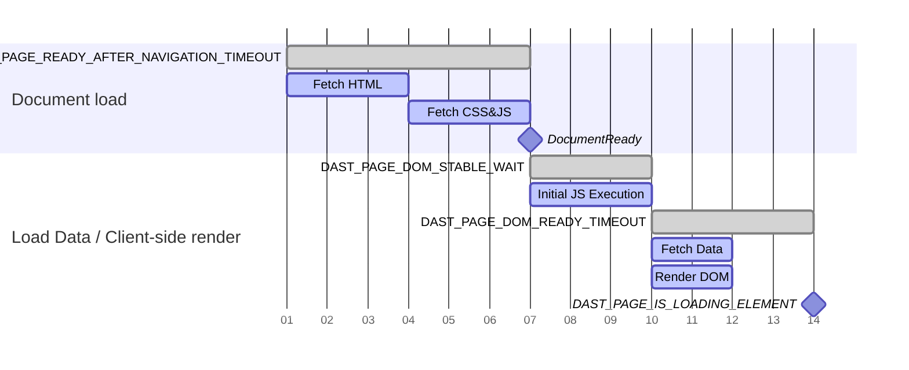

## Gestion de la portée {#managing-scope}

La portée contrôle les URL que DAST suit lors de l'exploration de l'application cible. Une portée correctement gérée minimise la durée d'exécution du scan tout en garantissant que seule l'application cible est vérifiée pour les vulnérabilités.

### Types de portée {#types-of-scope}

Il existe trois types de portée :

- dans la portée
- hors portée
- exclue de la portée

#### Dans la portée {#in-scope}

DAST suit les URL dans la portée et recherche dans le DOM les actions suivantes à effectuer pour poursuivre l'exploration. Les messages HTTP dans la portée enregistrés font l'objet de vérifications passives des vulnérabilités et sont utilisés pour créer des attaques lors de l'exécution d'un scan complet.

#### Hors portée {#out-of-scope}

DAST suit les URL hors portée pour les types de contenu non documentaires tels que les images, les feuilles de style, les polices, les scripts ou les requêtes AJAX. [L'authentification](#scope-works-differently-during-authentication) mise à part, DAST ne suit pas les URL hors portée pour les chargements de pages complètes, comme lorsqu'on clique sur un lien vers un site Web externe. À l'exception des vérifications passives qui recherchent des fuites d'informations, les messages HTTP enregistrés pour les URL hors portée ne sont pas vérifiés pour détecter des vulnérabilités.

#### Exclue de la portée {#excluded-from-scope}

DAST ne suit pas les URL exclues de la portée. À l'exception des vérifications passives qui recherchent des fuites d'informations, les messages HTTP enregistrés pour les URL exclues de la portée ne sont pas vérifiés pour détecter des vulnérabilités.

### La portée fonctionne différemment lors de l'authentification {#scope-works-differently-during-authentication}

De nombreuses applications cibles disposent d'un processus d'authentification qui dépend de sites Web externes, par exemple lors de l'utilisation d'un fournisseur de gestion des identités et des accès pour l'authentification unique (SSO). Pour garantir que DAST peut s'authentifier auprès de ces fournisseurs, DAST suit les URL hors portée pour les chargements de pages complètes lors de l'authentification. DAST ne suit pas les URL exclues de la portée.

### Comment DAST bloque les requêtes HTTP {#how-dast-blocks-http-requests}

DAST demande au navigateur d'effectuer la requête HTTP normalement lorsqu'il bloque une requête en raison des règles de portée. La requête est ensuite interceptée et rejetée avec la raison `BlockedByClient`. Cette approche permet à DAST d'enregistrer la requête HTTP tout en garantissant qu'elle n'atteint jamais le serveur cible. Les vérifications passives telles que [200.1](../checks/200.1.md) utilisent ces requêtes enregistrées pour vérifier les informations envoyées aux hôtes externes.

### Comment configurer la portée {#how-to-configure-scope}

Par défaut, les URL correspondant à l'hôte de l'application cible sont considérées comme étant dans la portée. Tous les autres hôtes sont considérés hors portée.

La portée est configurée à l'aide des variables CI/CD suivantes :

- Utilisez `DAST_SCOPE_ALLOW_HOSTS` pour ajouter des hôtes dans la portée.
- Utilisez `DAST_SCOPE_IGNORE_HOSTS` pour ajouter des hôtes hors portée.
- Utilisez `DAST_SCOPE_EXCLUDE_HOSTS` pour ajouter des hôtes exclus de la portée.
- Utilisez `DAST_SCOPE_EXCLUDE_URLS` pour définir des URL spécifiques à exclure de la portée.

Règles :

- L'exclusion d'un hôte est prioritaire sur son ignorance, qui est elle-même prioritaire sur son autorisation.
- La configuration de la portée pour un hôte ne configure pas la portée pour les sous-domaines de cet hôte.
- La configuration de la portée pour un hôte ne configure pas la portée pour tous les ports de cet hôte.

Voici un exemple de configuration typique :

```yaml
include:
  - template: DAST.gitlab-ci.yml

dast:
  variables:
    DAST_TARGET_URL: "https://my.site.com"                   # my.site.com URLs are considered in-scope by default
    DAST_SCOPE_ALLOW_HOSTS: "api.site.com:8443"       # include the API as part of the scan
    DAST_SCOPE_IGNORE_HOSTS: "analytics.site.com"      # explicitly disregard analytics from the scan
    DAST_SCOPE_EXCLUDE_HOSTS: "ads.site.com"           # don't visit any URLs on the ads subdomain
    DAST_SCOPE_EXCLUDE_URLS: "https://my.site.com/user/logout"  # don't visit this URL
```

## Détection des vulnérabilités {#vulnerability-detection}

DAST détecte les vulnérabilités grâce à nos [vérifications de vulnérabilités basées sur le navigateur](../checks/_index.md) complètes. Ces vérifications identifient les problèmes de sécurité dans vos applications Web lors du scan.

Le crawler exécute le site Web cible dans un navigateur avec DAST configuré en tant que serveur proxy. Cela garantit que toutes les requêtes et réponses effectuées par le navigateur sont analysées passivement par DAST. Lors de l'exécution d'un scan complet, les vérifications actives des vulnérabilités exécutées par DAST n'utilisent pas de navigateur. Cette différence dans la manière dont les vulnérabilités sont vérifiées peut entraîner des problèmes qui nécessitent la désactivation de certaines fonctionnalités du site Web cible pour garantir le bon fonctionnement du scan.

Par exemple, pour un site Web cible contenant des formulaires avec des jetons Anti-CSRF, un scan passif fonctionne comme prévu, car le navigateur affiche les pages et les formulaires comme si un utilisateur les consultait. Toutefois, les vérifications actives des vulnérabilités exécutées lors d'un scan complet ne peuvent pas soumettre des formulaires contenant des jetons Anti-CSRF. Dans ce cas, désactivez les jetons Anti-CSRF lors de l'exécution d'un scan complet.

## Gestion du temps de scan {#managing-scan-time}

Il est attendu que l'utilisation du crawler basé sur le navigateur offre une meilleure couverture pour de nombreuses applications Web, par rapport à la solution DAST GitLab standard. Cela peut entraîner une augmentation du temps de scan.

Vous pouvez gérer le compromis entre la couverture et le temps de scan avec les mesures suivantes :

- Si l'application cible comporte des pages basées sur des modèles ou du contenu répétitif, vous pouvez [regrouper les URL](#grouped-urls) à l'aide de la variable CI/CD `DAST_CRAWL_GROUPED_URLS`.
- Mettez le runner à l'échelle verticalement et utilisez un nombre plus élevé de navigateurs avec la [variable](variables.md) `DAST_CRAWL_WORKER_COUNT`. La valeur par défaut est définie dynamiquement en fonction du nombre de CPU logiques utilisables.
- Limitez le nombre d'actions exécutées par le navigateur avec la [variable](variables.md) `DAST_CRAWL_MAX_ACTIONS`. La valeur par défaut est `10,000`.
- Limitez la profondeur de page sur laquelle le crawler basé sur le navigateur vérifie la couverture avec la [variable](variables.md) `DAST_CRAWL_MAX_DEPTH`. Le crawler utilise une stratégie de recherche en largeur d'abord, de sorte que les pages moins profondes sont explorées en premier. La valeur par défaut est `10`.
- Limitez le temps consacré à l'exploration de l'application cible avec la [variable](variables.md) `DAST_CRAWL_TIMEOUT`. La valeur par défaut est `24h`. Les scans continuent avec des vérifications passives et actives lorsque le crawler expire.
- Créez le graphe d'exploration avec la [variable](variables.md) `DAST_CRAWL_GRAPH` pour voir quelles pages sont explorées.
- Empêchez l'exploration de pages à l'aide de la [variable](variables.md) `DAST_SCOPE_EXCLUDE_URLS`.
- Empêchez la sélection d'éléments à l'aide de la [variable](variables.md) `DAST_SCOPE_EXCLUDE_ELEMENTS`. À utiliser avec précaution, car la définition de cette variable entraîne une recherche supplémentaire pour chaque page explorée.
- Si l'application cible dispose d'un rendu minimal ou rapide, envisagez de réduire la [variable](variables.md) `DAST_PAGE_DOM_STABLE_WAIT` à une valeur inférieure. La valeur par défaut est `500ms`.

## Délais d'attente {#timeouts}

En raison de mauvaises conditions réseau ou d'une charge applicative importante, les délais d'attente par défaut peuvent ne pas être adaptés à votre application.

Les scans basés sur le navigateur offrent la possibilité d'ajuster différents délais d'attente pour garantir leur bon déroulement lors du passage d'une page à l'autre. Ces valeurs sont configurées à l'aide d'une [chaîne de durée](https://pkg.go.dev/time#ParseDuration), qui vous permet de configurer des durées avec un préfixe : `m` pour les minutes, `s` pour les secondes et `ms` pour les millisecondes.

Les navigations, ou l'acte de charger une nouvelle page, nécessitent généralement le plus de temps, car elles chargent plusieurs nouvelles ressources telles que des fichiers JavaScript ou CSS. En fonction de la taille de ces ressources ou de la vitesse à laquelle elles sont renvoyées, la valeur par défaut de `DAST_PAGE_READY_AFTER_NAVIGATION_TIMEOUT` peut ne pas être suffisante.

Les délais d'attente de stabilité, tels que ceux configurables avec `DAST_PAGE_DOM_READY_TIMEOUT` ou `DAST_PAGE_READY_AFTER_ACTION_TIMEOUT`, peuvent également être configurés. Les délais d'attente de stabilité déterminent quand les scans basés sur le navigateur considèrent qu'une page est entièrement chargée. Les scans basés sur le navigateur considèrent qu'une page est chargée lorsque :

1. L'événement [DOMContentLoaded](https://developer.mozilla.org/en-US/docs/Web/API/Document/DOMContentLoaded_event) a été déclenché.
1. Il n'y a pas de requêtes ouvertes ou en attente jugées importantes, telles que JavaScript et CSS. Les fichiers multimédias sont généralement considérés comme non importants.
1. Selon que le navigateur a effectué une navigation, a fait l'objet d'une transition forcée ou d'une action :

   - Il n'y a pas de nouveaux événements de modification du modèle objet de document (DOM) après les durées `DAST_PAGE_DOM_READY_TIMEOUT` ou `DAST_PAGE_READY_AFTER_ACTION_TIMEOUT`.

Après que ces événements se sont produits, les scans basés sur le navigateur considèrent la page chargée et prête, et tentent l'action suivante.

Si votre application connaît des problèmes de latence ou renvoie de nombreux échecs de navigation, envisagez d'ajuster les valeurs de délai d'attente comme dans cet exemple :

```yaml
include:
  - template: DAST.gitlab-ci.yml

dast:
  variables:
    DAST_TARGET_URL: "https://my.site.com"
    DAST_PAGE_READY_AFTER_NAVIGATION_TIMEOUT: "45s"
    DAST_PAGE_READY_AFTER_ACTION_TIMEOUT: "15s"
    DAST_PAGE_DOM_READY_TIMEOUT: "15s"
```

> [!note]
> L'ajustement de ces valeurs peut avoir un impact sur le temps de scan, car elles modifient la durée pendant laquelle chaque navigateur attend la fin de diverses activités.

### Délais d'attente de disponibilité des pages {#page-readiness-timeouts}

La disponibilité de la page désigne l'état dans lequel une page est entièrement chargée, son DOM est stabilisé et les éléments interactifs sont disponibles. Une détection correcte de la disponibilité des pages est essentielle pour :

- **Scanning accuracy** : l'analyse des pages avant leur chargement complet peut omettre du contenu ou produire des faux négatifs.
- **Crawl efficiency** : attendre trop longtemps gaspille du temps de scan, tandis qu'une attente insuffisante fait manquer du contenu dynamique.
- **Modern web application support** : les applications monopages, les sites à forte utilisation d'AJAX et les modèles de chargement progressif nécessitent une détection sophistiquée de la disponibilité.

Grâce à une séquence de délais d'attente configurables optionnels, le scanner DAST peut détecter quand différentes parties d'une page sont entièrement chargées.

#### Variables de délai d'attente {#timeout-variables}

Utilisez les variables CI/CD suivantes pour personnaliser les délais d'attente de disponibilité des pages DAST. Pour une liste complète, consultez [Variables CI/CD disponibles](variables.md).

| Variable de délai d'attente | Valeur par défaut | Description |
|:-----------------|:--------|:------------|
| `DAST_PAGE_READY_AFTER_NAVIGATION_TIMEOUT` | `15s` | La durée maximale d'attente pour qu'un navigateur navigue d'une page à une autre. Utilisé lors de la phase de chargement du document pour les chargements de pages complètes. |
| `DAST_PAGE_READY_AFTER_ACTION_TIMEOUT` | `7s` | La durée maximale d'attente pour qu'un navigateur considère qu'une page est chargée et prête pour l'analyse. Utilisé comme alternative à `DAST_PAGE_READY_AFTER_NAVIGATION_TIMEOUT` pour les actions sur la page qui ne déclenchent pas un chargement de page complet. |
| `DAST_PAGE_DOM_STABLE_WAIT` | `500ms` | Définit la durée d'attente des mises à jour du DOM avant de vérifier si une page est stable. Utilisé au début de la phase de rendu côté client. |
| `DAST_PAGE_DOM_READY_TIMEOUT` | `6s` | La durée maximale d'attente pour qu'un navigateur considère qu'une page est chargée et prête pour l'analyse après la fin d'une navigation. Contrôle l'attente de la récupération des données en arrière-plan et du rendu DOM. |
| `DAST_PAGE_IS_LOADING_ELEMENT` | Aucune | Sélecteur qui, lorsqu'il n'est plus visible sur la page, indique à l'analyseur que la page a terminé de se charger et que le scan peut continuer. Marque la fin du processus de rendu côté client. |

#### Workflow de chargement des pages {#page-loading-workflow}

Les applications Web modernes se chargent en plusieurs étapes. Le scanner DAST dispose de délais d'attente spécifiques pour chaque étape du processus :

1. **Document loading** : le navigateur récupère et traite la structure de base de la page.

   1. Récupérer le contenu HTML depuis le serveur.
   1. Charger les fichiers CSS et JavaScript référencés.
   1. Analyser le contenu et effectuer le rendu initial de la page.
   1. Déclencher l'événement standard « document ready ».

   Cette phase utilise soit `DAST_PAGE_READY_AFTER_NAVIGATION_TIMEOUT` (pour les chargements de pages complètes), soit `DAST_PAGE_READY_AFTER_ACTION_TIMEOUT` (pour les actions sur la page), qui définit le temps d'attente maximal pour le chargement du document.

1. **Client-Side rendering** : après le chargement initial, de nombreuses applications monopages :

   - effectuent l'exécution JavaScript initiale (`DAST_PAGE_DOM_STABLE_WAIT`) ;
   - récupèrent des données en arrière-plan via AJAX ou d'autres appels API ;
   - effectuent le rendu d'un DOM et les mises à jour basées sur les données récupérées (`DAST_PAGE_DOM_READY_TIMEOUT`) ;
   - affichent des indicateurs de chargement de page (`DAST_PAGE_IS_LOADING_ELEMENT`) ;

   Le scanner surveille ces activités pour déterminer quand la page est prête pour l'interaction.

Le graphe suivant illustre la séquence des délais d'attente utilisés lors de l'exploration d'une page :



## URL regroupées {#grouped-urls}

Lorsque vous exécutez le scanner DAST sur votre site Web, un scan typique peut prendre plusieurs heures. Ce délai se produit lorsque votre site Web contient des milliers de pages similaires qui utilisent le même modèle avec des informations variables. DAST traite chaque page séparément et les analyse individuellement, consacrant la majeure partie du temps de scan à l'exploration de ces pages similaires.

Par exemple :

- Sites e-commerce avec des milliers de pages produits (`/products/item-123`, `/products/item-456`)
- Plateformes sociales avec des profils utilisateurs (`/users/john`, `/users/jane`)
- Systèmes de gestion de contenu avec des articles catégorisés (`/blog/category/tech`, `/blog/category/news`)
- Interfaces de recherche avec des résultats paginés (`/search?q=term&page=1`, `/search?q=term&page=2`)

Au lieu de traiter chaque URL comme unique, les URL regroupées vous permettent de définir des modèles avec des caractères génériques qui regroupent les URL similaires. Lorsque DAST rencontre des URL correspondant à ces modèles, il analyse une URL représentative de chaque groupe pour réduire le temps de scan tout en maintenant la couverture de sécurité. Par exemple, si toutes les pages de détail produit suivent la même structure et le même modèle de sécurité, DAST n'a besoin de tester qu'une seule d'entre elles de manière approfondie.

### Fonctionnement des URL regroupées {#how-grouped-urls-work}

Lorsque vous configurez des modèles d'URL regroupées, le crawler de DAST optimise l'exploration :

1. Correspondance de modèles : au fur et à mesure que le crawler découvre de nouvelles URL, il vérifie chacune d'elles par rapport aux modèles définis.
1. Regroupement intelligent : les URL correspondant à un modèle sont regroupées, seule la première URL découverte étant entièrement analysée.
1. Navigation ignorée : les URL suivantes correspondant au même modèle sont exclues de l'exploration complète, mais restent enregistrées pour le reporting.
1. Couverture de sécurité : l'analyse de sécurité effectuée sur l'URL représentative s'applique à l'ensemble du groupe.

> [!warning]
> Une URL ignorée en raison de la configuration des URL regroupées peut apparaître comme **visitée** ou **en échec** dans le graphe d'exploration. Il s'agit d'un problème connu. Pour plus d'informations, consultez le [ticket 577252](https://gitlab.com/gitlab-org/gitlab/-/issues/577252).

### Exemple de guide de configuration {#example-configuration-guide}

L'exemple suivant utilise un site e-commerce hypothétique. Ce site comporte des pages de liste de produits avec des filtres variables en tant que paramètres de requête, et des pages de détail produit avec l'identifiant du produit comme sous-chemin dans l'URL.

**Analyze your application's URL patterns**

Avant de configurer les URL regroupées, comprenez la structure des URL de votre application :

1. Consultez votre plan du site ou les routes de votre application.
1. Examinez les journaux DAST des scans précédents pour identifier les modèles répétitifs.
1. Catégorisez les URL selon leur fonction (pages produits, profils utilisateurs, résultats de recherche).
1. Identifiez les pages basées sur des modèles qui partagent la même structure de page.

Dans cet exemple, un scan du site e-commerce produit les URL suivantes dans [le fichier journal trouvé dans les artefacts CI](../troubleshooting.md#log-destination) :

```plaintext
INF REPT  visited 8 URLs
INF REPT  URL visited: (DOC www.your-site.com/products?category=vegetables&sort=price) GET www.your-site.com/products?category=vegetables&sort=price
INF REPT  URL visited: (DOC www.your-site.com/products?category=fruits&sort=price) GET www.your-site.com/products?category=fruits&sort=price
INF REPT  URL visited: (DOC www.your-site.com/products?category=frozen&sort=price) GET www.your-site.com/products?category=frozen&sort=price
INF REPT  URL visited: (DOC www.your-site.com/products?category=frozen&sort=price) GET www.your-site.com/products?category=frozen&sort=price
INF REPT  URL visited: (DOC www.your-site.com/products/029039-apple-93000/details) GET www.your-site.com/products/029039-apple-93000/details
INF REPT  URL visited: (DOC www.your-site.com/products/99345-orange-33322/details) GET www.your-site.com/products/99345-orange/details
INF REPT  URL visited: (DOC www.your-site.com/products/90845-orange-33992/details) GET www.your-site.com/products/90845-orange/details
INF REPT  URL visited: (DOC www.your-site.com/products/100232-bananas-2677/details) GET www.your-site.com/products/100232-bananas-2677/details
```

Les quatre premières URL représentent des pages de liste de produits avec différents filtres `category` et `sort`. Les quatre dernières URL représentent des pages de détail produit individuelles avec des identifiants de produit uniques. Deux des pages de détail produit ont `orange` dans leurs identifiants.

Ces deux ensembles de pages partagent probablement les mêmes modèles sous-jacents et les mêmes caractéristiques de sécurité. Sans optimisation par URL regroupées, DAST explorerait et testerait les huit pages individuellement.

**Design your wildcard patterns**

Lors de la création de modèles, suivez ces règles :

1. Incluez au moins un caractère générique `*` pour la reconnaissance de modèles. Un `*` correspond à zéro ou plusieurs caractères dans l'URL. Les URL sont comparées par caractères plutôt que par parties spécifiques de l'URL. Un `*` peut correspondre à plus d'un sous-chemin de l'URL.
1. Recherchez les caractères qui varient dans l'URL au cours de l'exploration. Soyez précis pour éviter de regrouper à l'excès des pages sans rapport.
1. Tenez compte de l'ordre des modèles. Si une page correspond à plusieurs modèles, le premier modèle spécifié est utilisé.

Configurez les modèles pour le site e-commerce :

1. Modèle de groupe de liste des catégories de produits : les quatre premières URL peuvent être regroupées logiquement en utilisant le modèle `www.your-site.com/products?category=*&sort=price`. Ce modèle correspond à toutes les pages qui utilisent à la fois les filtres de catégorie et définissent `price` comme filtre `sort`.
1. Modèle de groupe de détails produit : les quatre dernières URL peuvent être regroupées logiquement en utilisant le modèle `www.your-site.com/products/*/details`. Ce modèle correspond à toutes les pages de détail produit, quel que soit l'identifiant du produit.

Vous pouvez également diviser le modèle de groupe de détails produit en deux groupes :

1. Modèle de groupe de détails produit orange : le modèle `www.your-site.com/products/*orange*/details` correspond aux deux URL pour les oranges.
1. Modèle de groupe de détails produit générique : le modèle `www.your-site.com/products/*/details` correspond à tous les autres produits.

Une page peut correspondre à plusieurs modèles d'URL. Spécifiez les modèles dans l'ordre dans lequel vous souhaitez qu'ils soient mis en correspondance. Par exemple, `www.your-site.com/products/4782-orange-777/details` correspond aux deux modèles, mais il s'agit d'une page de détail d'un produit orange. Pour garantir qu'elle correspond au modèle de groupe de détails produit orange, spécifiez les détails du produit orange avant le modèle de groupe de détails produit générique dans la configuration.

**Configurer la variable `DAST_CRAWL_GROUPED_URLS`**

Ajoutez la configuration à votre fichier `.gitlab-ci.yml` :

```yaml
include:
  - template: DAST.gitlab-ci.yml

dast:
  variables:
    DAST_TARGET_URL: "https://your-site.com"
    DAST_CRAWL_GROUPED_URLS: "https://your-site.com/products?category=*&sort=price,https://your-site.com/products/*orange*/details,https://your-site.com/products/*/details"
```

**Monitor and validate**

Après avoir mis en œuvre les URL regroupées :

1. Vérifiez le graphe d'exploration (si activé) pour valider le comportement de regroupement. Vous devriez voir moins de branches dans le graphe d'exploration.
1. Consultez les journaux de scan pour confirmer le blocage des URL attendu. Vous devriez voir moins d'URL visitées.
1. Validez que la couverture de sécurité n'est pas compromise. Le nombre de résultats peut diminuer, car une seule page par groupe est analysée pour détecter des vulnérabilités.
1. Mesurez les améliorations des performances en termes de durée de scan. Le scan devrait prendre moins de temps.

#### Exemples de configuration avancée {#advanced-configuration-examples}

Les exemples suivants illustrent des modèles avancés pour des scénarios courants d'applications Web :

**Multiple query parameters with wildcards**

Pour les pages de recherche ou de filtre avec plusieurs paramètres variables :

```yaml
dast:
  variables:
    DAST_TARGET_URL: "https://your-site.com"
    # Match search results with any query and page number
    DAST_CRAWL_GROUPED_URLS: "https://your-site.com/search?q=*&page=*,https://your-site.com/search?q=*&page=*&sort=*"
```

Cela regroupe toutes les pages de résultats de recherche, quels que soient les termes de recherche, la pagination ou les options de tri.

**Combine path and query parameter patterns**

Pour les applications avec à la fois des chemins dynamiques et des chaînes de requête :

```yaml
dast:
  variables:
    DAST_TARGET_URL: "https://your-site.com"
    DAST_CRAWL_GROUPED_URLS: |
      https://your-site.com/api/v1/users/*/profile?tab=*,
      https://your-site.com/dashboard/*/reports?year=*&month=*,
      https://your-site.com/catalog/*/items?filter=*
```

Cette configuration regroupe :

- Les pages de profil utilisateur avec différents onglets
- Les rapports de tableau de bord sur différentes périodes
- Les articles du catalogue avec différents filtres

**Hierarchical URL patterns**

Pour les structures de ressources imbriquées à plusieurs niveaux :

```yaml
dast:
  variables:
    DAST_TARGET_URL: "https://your-site.com"
    DAST_CRAWL_GROUPED_URLS: |
      https://your-site.com/organizations/*/teams/*/members/*,
      https://your-site.com/projects/*/issues/*/comments,
      https://your-site.com/categories/*/subcategories/*/products/*
```

Cette configuration gère les URL profondément imbriquées où plusieurs segments de chemin varient.

**API endpoints with resource IDs**

Pour les points de terminaison d'API REST avec des identifiants de ressources variables :

```yaml
dast:
  variables:
    DAST_TARGET_URL: "https://api.your-site.com"
    DAST_CRAWL_GROUPED_URLS: |
      https://api.your-site.com/v1/customers/*/orders,
      https://api.your-site.com/v1/customers/*/orders/*,
      https://api.your-site.com/v2/resources/*/relationships/*,
      https://api.your-site.com/*/items?id=*
```

Cette configuration regroupe les points de terminaison d'API REST par type de ressource plutôt que par identifiants individuels.

**Locale and language variations**

Pour les sites internationalisés avec des codes de langue ou de région :

```yaml
dast:
  variables:
    DAST_TARGET_URL: "https://your-site.com"
    DAST_CRAWL_GROUPED_URLS: |
      https://your-site.com/*/products/*,
      https://your-site.com/*/*/articles/*,
      https://*.your-site.com/content/*
```

Cette configuration regroupe :

- Les pages produits dans différentes langues (`/en/products/123`, `/fr/products/123`)
- Les articles avec des codes de langue et de région (`/en/us/articles/guide`)
- Les paramètres régionaux basés sur des sous-domaines (`en.your-site.com/content/page`)

**Session and token parameters**

Pour les URL avec des identifiants de session ou des jetons temporaires à regrouper :

```yaml
dast:
  variables:
    DAST_TARGET_URL: "https://your-site.com"
    DAST_CRAWL_GROUPED_URLS: |
      https://your-site.com/checkout?session=*,
      https://your-site.com/verify?token=*&email=*,
      https://your-site.com/share/*?ref=*
```

Cette configuration empêche DAST de traiter chaque session ou jeton unique comme une page distincte.

##### Scénarios e-commerce complexes {#complex-e-commerce-scenarios}

Pour une optimisation complète d'un site e-commerce :

```yaml
dast:
  variables:
    DAST_TARGET_URL: "https://shop.your-site.com"
    DAST_CRAWL_GROUPED_URLS: |
      https://shop.your-site.com/products?category=*&brand=*&price=*,
      https://shop.your-site.com/products/*/reviews?page=*,
      https://shop.your-site.com/products/*/reviews?page=*&sort=*,
      https://shop.your-site.com/cart?item=*&quantity=*,
      https://shop.your-site.com/user/orders/*/tracking,
      https://shop.your-site.com/compare?products=*
```

Cette configuration gère :

- Les listes de produits avec plusieurs combinaisons de filtres
- Les avis produits paginés avec différents tris
- Les variations de paniers d'achat
- Les pages de suivi de commandes
- Les pages de comparaison de produits

**Pattern order for specificity**

Lorsque des modèles se chevauchent, ordonnez-les du plus spécifique au plus général :

```yaml
dast:
  variables:
    DAST_TARGET_URL: "https://your-site.com"
    # Order matters: specific patterns first, general patterns last
    DAST_CRAWL_GROUPED_URLS: |
      https://your-site.com/products/*-premium-*/details,
      https://your-site.com/products/*-sale-*/details,
      https://your-site.com/products/*/details,
      https://your-site.com/products/*
```

Cette configuration garantit que les produits premium et en promotion sont regroupés séparément avant de revenir au modèle de produit général.

**Exclude specific patterns from grouping**

Combinez avec `DAST_SCOPE_EXCLUDE_URLS` pour exclure certaines URL du regroupement et du scan :

```yaml
dast:
  variables:
    DAST_TARGET_URL: "https://your-site.com"
    DAST_CRAWL_GROUPED_URLS: "https://your-site.com/articles/*/comments?page=*"
    # Exclude logout and admin URLs from scanning entirely
    DAST_SCOPE_EXCLUDE_URLS: "https://your-site.com/logout,https://your-site.com/admin/*"
```

Cette configuration regroupe les pages de commentaires d'articles tout en excluant les URL de déconnexion et d'administration du scan.
