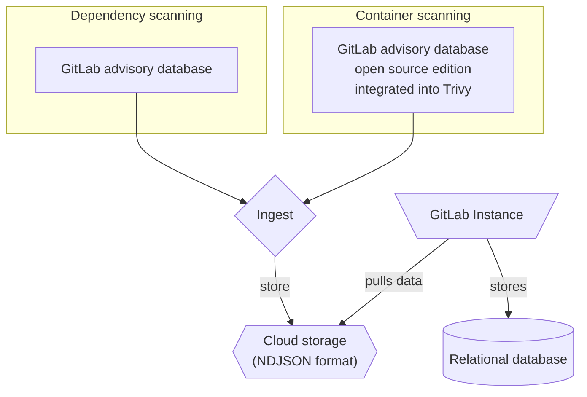

La [base de données des avis de sécurité GitLab](https://gitlab.com/gitlab-org/security-products/gemnasium-db) (GLAD) sert de dépôt pour les avis de sécurité liés aux dépendances logicielles. Elle est mise à jour toutes les heures avec les derniers avis de sécurité.

La base de données est un composant essentiel de l'[analyse des dépendances](../dependency_scanning/_index.md) et du [scan de conteneurs](../container_scanning/_index.md).

Une version gratuite et open source de la base de données des avis de sécurité GitLab est également disponible sous la forme de la [base de données des avis de sécurité GitLab (édition open source)](https://gitlab.com/gitlab-org/advisories-community). L'édition open source reçoit les mêmes mises à jour, mais avec un délai de 30 jours.

## Avis de sécurité GitLab sur les malwares {#gitlab-malware-advisories}



- Édition : GitLab Ultimate
- Offre : GitLab.com, GitLab Self-Managed, GitLab Dedicated
- Statut : version bêta





- [Introduit](https://gitlab.com/groups/gitlab-org/-/epics/20876) dans GitLab 19.3 [avec des indicateurs](../../../administration/feature_flags/_index.md) nommés `sync_malware_advisories` et `ingest_malware_advisories`. Fonctionnalité désactivée par défaut.
- [Activation sur GitLab.com, GitLab Self-Managed et GitLab Dedicated](https://gitlab.com/gitlab-org/gitlab/-/merge_requests/249740) dans GitLab 19.3.



> [!flag]
> La disponibilité de cette fonctionnalité est contrôlée par un feature flag. Pour plus d'informations, consultez l'historique.

GitLab maintient une base de données privée d'avis de sécurité pour les packages malveillants connus trouvés dans les registres de packages. Les avis de sécurité GitLab sur les malwares (GLAM) sont distincts des avis GLAD décrits ailleurs sur cette page. GitLab synchronise automatiquement ces avis de sécurité vers votre instance GitLab en arrière-plan.

GitLab obtient ces avis de sécurité à partir de trois sources :

- Le [projet OpenSSF malicious-packages](https://github.com/ossf/malicious-packages), un dépôt open source de rapports sur les packages malveillants
- Scans des registres de packages publics exécutés par GitLab
- Flux en amont de données d'avis de sécurité provenant des registres de packages

Chaque avis de sécurité sur un malware possède un identifiant commençant par `GLAM-`, sous la forme `GLAM-<year>-<month>-<sequence>`, par exemple `GLAM-2026-09-00138`. Les vulnérabilités créées à partir de ces avis portent cet identifiant comme identifiant et ne possèdent pas d'identifiant CVE.

> [!note]
> Dans les [environnements hors ligne](../offline_deployments/_index.md), GitLab ne peut pas synchroniser ces avis de sécurité automatiquement. À la place, vous [les téléchargez sur une machine disposant d'un accès Internet](../../../topics/offline/quick_start_guide.md#download-gitlab-v3-malware-advisories) et les copiez vers l'instance.

Ces avis de sécurité servent trois objectifs :

- L'[analyse des dépendances](../dependency_scanning/_index.md#dependency-scanning-using-sbom) les utilise pour créer une vulnérabilité lorsqu'un pipeline détecte un package malveillant.
- La [analyse continue des vulnérabilités](../continuous_vulnerability_scanning/_index.md#malicious-packages) les utilise pour créer une vulnérabilité sans nécessiter l'exécution d'un pipeline.
- Les [politiques d'approbation des merge requests](../policies/merge_request_approval_policies.md#block-malicious-packages-with-the-malware-rule) les utilisent pour bloquer une merge request qui introduit un package malveillant.

### Types de paquets pris en charge {#supported-package-types}

Les avis de sécurité sur les malwares sont disponibles pour les composants ayant les [types PURL](https://github.com/package-url/purl-spec/blob/346589846130317464b677bc4eab30bf5040183a/PURL-TYPES.rst) suivants :

- `cargo`
- `go`
- `maven`
- `npm`
- `nuget`
- `pypi`
- `rubygem`

Il s'agit d'un sous-ensemble des types PURL pris en charge pour les [avis de sécurité standard](../dependency_scanning/continuous_dependency_scanning/_index.md#supported-package-types). Il n'existe pas d'avis de sécurité sur les malwares pour `conan`, `packagist`, `pub` ou `swift`, de sorte que les composants avec ces types PURL ne sont jamais signalés comme malveillants. Il n'existe pas non plus d'avis de sécurité sur les malwares pour les types PURL de scan de conteneurs, tels que `apk` et `deb`.

## Standardisation {#standardization}

Les avis de sécurité GitLab utilisent des pratiques standardisées pour communiquer les vulnérabilités et leur impact.

- [CVE](../terminology/_index.md#cve)
- [CVSS](../terminology/_index.md#cvss)
- [CWE](../terminology/_index.md#cwe)

## Explorer la base de données {#explore-the-database}

Pour consulter le contenu de la base de données, accédez à la page d'accueil de la [base de données des avis de sécurité GitLab](https://advisories.gitlab.com). Sur la page d'accueil, vous pouvez :

- Rechercher dans la base de données par identifiant, nom de package et description.
- Consulter les avis de sécurité ajoutés récemment.
- Consulter des informations statistiques, notamment la couverture et la fréquence des mises à jour.

### Recherche {#search}

Chaque avis de sécurité dispose d'une page avec les détails suivants :

- **Identifiants** : identifiants publics. Par exemple, un identifiant CVE, un identifiant GHSA ou l'identifiant interne GitLab (`GMS-<year>-<nr>`).
- **Package Slug** : type de package et nom de package séparés par une barre oblique.
- **Vulnérabilité** : une brève description de la faille de sécurité.
- **Description** : une description détaillée de la faille de sécurité et des risques potentiels.
- **Versions affectées** : les versions affectées.
- **Solution** : comment remédier à la vulnérabilité.
- **Dernière modification** : la date à laquelle l'avis de sécurité a été modifié pour la dernière fois.

### API GraphQL {#graphql-api}



- Édition : GitLab Ultimate
- Offre : GitLab.com, GitLab Self-Managed
- Statut : version expérimentale





- [Introduit](https://gitlab.com/gitlab-org/gitlab/-/work_items/503307) dans GitLab 18.11 [avec le feature flag](../../../administration/feature_flags/_index.md) `pm_advisory_graphql`. Fonctionnalité désactivée par défaut. Cette fonctionnalité est une [version expérimentale](../../../policy/development_stages_support.md).



> [!flag]
> La disponibilité de cette fonctionnalité est contrôlée par un feature flag. Pour plus d'informations, consultez l'historique. Cette fonctionnalité est disponible à des fins de test, mais n'est pas prête pour une utilisation en production.

Utilisez les endpoints GraphQL suivants pour rechercher un ou plusieurs avis de sécurité par identifiant :

- [`Query.packageMetadataAdvisory` pour rechercher un seul avis de sécurité](../../../api/graphql/reference/_index.md#querypackagemetadataadvisory)
- [`Query.packageMetadataAdvisories` pour rechercher plusieurs avis de sécurité](../../../api/graphql/reference/_index.md#querypackagemetadataadvisories)

#### Exemples {#examples}

##### Avis de sécurité unique {#single-advisory}

Pour rechercher un seul avis de sécurité par identifiant :

```graphql
{
  packageMetadataAdvisory(identifier: "CVE-2026-34598") {
    id,
    title,
    description,
    publishedDate
    identifiers {
      name
      url
    }
  }
}
```

Retourne un résultat similaire à :

```json
{
  "data": {
    "packageMetadataAdvisory": {
      "id": "gid://gitlab/PackageMetadata::Advisory/8295281",
      "title": "YesWiki has Persistent Blind XSS at \"/?BazaR&vue=consulter\"",
      "description": "A stored and blind XSS vulnerability exists in the form title field. A malicious attacker can inject JavaScript without any authentication via a form title that is saved in the backend database. When any user visits that injected page, the JavaScript payload gets executed.\n\nType: Stored and Blind Cross-Site Scripting (XSS)\nAffected Component: form title input field\nAuthentication Required: No (Unauthenticated attack possible)\nImpact: Arbitrary JavaScript execution in victim's browser",
      "publishedDate": "2026-04-01",
      "identifiers": [
        {
          "name": "CVE-2026-34598",
          "url": "https://cve.mitre.org/cgi-bin/cvename.cgi?name=CVE-2026-34598"
        },
        {
          "name": "GHSA-37fq-47qj-6j5j",
          "url": "https://github.com/advisories/GHSA-37fq-47qj-6j5j"
        },
        {
          "name": "CWE-79",
          "url": "https://cwe.mitre.org/data/definitions/79.html"
        },
        {
          "name": "CWE-87",
          "url": "https://cwe.mitre.org/data/definitions/87.html"
        },
        {
          "name": "CWE-937",
          "url": "https://cwe.mitre.org/data/definitions/937.html"
        },
        {
          "name": "CWE-1035",
          "url": "https://cwe.mitre.org/data/definitions/1035.html"
        }
      ]
    }
  },
  "correlationId": "9f10f45bdb871a6e-MEL"
}
```

##### Plusieurs avis de sécurité {#multiple-advisories}

Pour rechercher plusieurs avis de sécurité par identifiants :

```graphql
{
  packageMetadataAdvisories(identifiers: ["CVE-2026-34598", "CVE-2026-34601"]) {
    nodes {
      id
      title
      description
      publishedDate
      identifiers {
        name
        url
      }
    }
  }
}
```

Retourne un résultat similaire à :

```json
{
  "data": {
    "packageMetadataAdvisories": {
      "nodes": [
        {
          "id": "gid://gitlab/PackageMetadata::Advisory/8295281",
          "title": "YesWiki has Persistent Blind XSS at \"/?BazaR&vue=consulter\"",
          "description": "A stored and blind XSS vulnerability exists in the form title field. A malicious attacker can inject JavaScript without any authentication via a form title that is saved in the backend database. When any user visits that injected page, the JavaScript payload gets executed.\n\nType: Stored and Blind Cross-Site Scripting (XSS)\nAffected Component: form title input field\nAuthentication Required: No (Unauthenticated attack possible)\nImpact: Arbitrary JavaScript execution in victim's browser",
          "publishedDate": "2026-04-01",
          "identifiers": [
            {
              "name": "CVE-2026-34598",
              "url": "https://cve.mitre.org/cgi-bin/cvename.cgi?name=CVE-2026-34598"
            },
            {
              "name": "GHSA-37fq-47qj-6j5j",
              "url": "https://github.com/advisories/GHSA-37fq-47qj-6j5j"
            },
            {
              "name": "CWE-79",
              "url": "https://cwe.mitre.org/data/definitions/79.html"
            },
            {
              "name": "CWE-87",
              "url": "https://cwe.mitre.org/data/definitions/87.html"
            },
            {
              "name": "CWE-937",
              "url": "https://cwe.mitre.org/data/definitions/937.html"
            },
            {
              "name": "CWE-1035",
              "url": "https://cwe.mitre.org/data/definitions/1035.html"
            }
          ]
        },
        {
          "id": "gid://gitlab/PackageMetadata::Advisory/8295301",
          "title": "xmldom: XML injection via unsafe CDATA serialization allows attacker-controlled markup insertion",
          "description": "`@xmldom/xmldom` allows attacker-controlled strings containing the CDATA terminator `]]>` to be inserted into a `CDATASection` node. During serialization, `XMLSerializer` emitted the CDATA content verbatim without rejecting or safely splitting the terminator. As a result, data intended to remain text-only became **active XML markup** in the serialized output, enabling XML structure\ninjection and downstream business-logic manipulation.\n\nThe sequence `]]>` is not allowed inside CDATA content and must be rejected or safely handled during serialization. ([MDN Web Docs](https://developer.mozilla.org/))",
          "publishedDate": "2026-04-01",
          "identifiers": [
            {
              "name": "CVE-2026-34601",
              "url": "https://cve.mitre.org/cgi-bin/cvename.cgi?name=CVE-2026-34601"
            },
            {
              "name": "GHSA-wh4c-j3r5-mjhp",
              "url": "https://github.com/advisories/GHSA-wh4c-j3r5-mjhp"
            },
            {
              "name": "CWE-91",
              "url": "https://cwe.mitre.org/data/definitions/91.html"
            },
            {
              "name": "CWE-937",
              "url": "https://cwe.mitre.org/data/definitions/937.html"
            },
            {
              "name": "CWE-1035",
              "url": "https://cwe.mitre.org/data/definitions/1035.html"
            }
          ]
        },
        {
          "id": "gid://gitlab/PackageMetadata::Advisory/8295310",
          "title": "xmldom: XML injection via unsafe CDATA serialization allows attacker-controlled markup insertion",
          "description": "`@xmldom/xmldom` allows attacker-controlled strings containing the CDATA terminator `]]>` to be inserted into a `CDATASection` node. During serialization, `XMLSerializer` emitted the CDATA content verbatim without rejecting or safely splitting the terminator. As a result, data intended to remain text-only became **active XML markup** in the serialized output, enabling XML structure\ninjection and downstream business-logic manipulation.\n\nThe sequence `]]>` is not allowed inside CDATA content and must be rejected or safely handled during serialization. ([MDN Web Docs](https://developer.mozilla.org/))",
          "publishedDate": "2026-04-01",
          "identifiers": [
            {
              "name": "CVE-2026-34601",
              "url": "https://cve.mitre.org/cgi-bin/cvename.cgi?name=CVE-2026-34601"
            },
            {
              "name": "GHSA-wh4c-j3r5-mjhp",
              "url": "https://github.com/advisories/GHSA-wh4c-j3r5-mjhp"
            },
            {
              "name": "CWE-91",
              "url": "https://cwe.mitre.org/data/definitions/91.html"
            },
            {
              "name": "CWE-937",
              "url": "https://cwe.mitre.org/data/definitions/937.html"
            },
            {
              "name": "CWE-1035",
              "url": "https://cwe.mitre.org/data/definitions/1035.html"
            }
          ]
        },
        {
          "id": "gid://gitlab/PackageMetadata::Advisory/9800476",
          "title": "xmldom: xmldom: XML structure injection via CDATA terminator",
          "description": "xmldom is a pure JavaScript W3C standard-based (XML DOM Level 2 Core) `DOMParser` and `XMLSerializer` module. In xmldom versions 0.6.0 and prior and @xmldom/xmldom prior to versions 0.8.12 and 0.9.9, xmldom/xmldom allows attacker-controlled strings containing the CDATA terminator ]]> to be inserted into a CDATASection node. During serialization, XMLSerializer emitted the CDATA content verbatim without rejecting or safely splitting the terminator. As a result, data intended to remain text-only became active XML markup in the serialized output, enabling XML structure injection and downstream business-logic manipulation. This issue has been patched in xmldom version 0.6.0 and @xmldom/xmldom versions 0.8.12 and 0.9.9.",
          "publishedDate": "2026-04-02",
          "identifiers": [
            {
              "name": "CVE-2026-34601",
              "url": "https://cve.mitre.org/cgi-bin/cvename.cgi?name=CVE-2026-34601"
            },
            {
              "name": "CWE-91",
              "url": "https://cwe.mitre.org/data/definitions/91.html"
            }
          ]
        }
      ]
    }
  },
  "correlationId": "9f10f5072e0f1a6e-MEL"
}
```

## Édition open source {#open-source-edition}

GitLab propose une version gratuite et open source de la base de données, la [base de données des avis de sécurité GitLab (édition open source)](https://gitlab.com/gitlab-org/advisories-community).

La version open source est un clone à délai temporel de la base de données des avis de sécurité GitLab, sous licence MIT, et contient tous les avis de sécurité de la base de données des avis de sécurité GitLab datant de plus de 30 jours ou portant l'indicateur `community-sync`.

## Intégrations {#integrations}

- [Analyse des dépendances](../dependency_scanning/_index.md)
- [Scan de conteneurs](../container_scanning/_index.md)
- Outils tiers

> [!note]
> Les conditions d'utilisation de la base de données des avis de sécurité GitLab interdisent l'utilisation des données contenues dans la base de données des avis de sécurité GitLab par des outils tiers. Les intégrateurs tiers peuvent utiliser le [clone du dépôt](https://gitlab.com/gitlab-org/advisories-community) sous licence MIT avec délai temporel.

### Comment la base de données peut être utilisée {#how-the-database-can-be-used}

L'exemple suivant utilise la base de données comme source pour un processus d'ingestion d'avis de sécurité dans le cadre de scans continus des vulnérabilités.



## Maintenance {#maintenance}

L'équipe Vulnerability Research est responsable de la maintenance et des mises à jour régulières de la base de données des avis de sécurité GitLab et de la base de données des avis de sécurité GitLab (édition open source).

Les contributions de la communauté sont accessibles dans [advisories-community](https://gitlab.com/gitlab-org/advisories-community) via l'indicateur `community-sync`.

## Contribuer à la base de données des vulnérabilités {#contributing-to-the-vulnerability-database}

Si vous avez connaissance d'une vulnérabilité qui n'est pas répertoriée, vous pouvez contribuer à la base de données des avis de sécurité GitLab en ouvrant un ticket ou en soumettant la vulnérabilité.

Pour plus d'informations, consultez les [directives de contribution](https://gitlab.com/gitlab-org/security-products/gemnasium-db/-/blob/master/CONTRIBUTING.md).

## Licence {#license}

La base de données des avis de sécurité GitLab est librement accessible conformément aux [conditions d'utilisation de la base de données des avis de sécurité GitLab](https://gitlab.com/gitlab-org/security-products/gemnasium-db/-/blob/master/LICENSE.md#gitlab-advisory-database-term).
