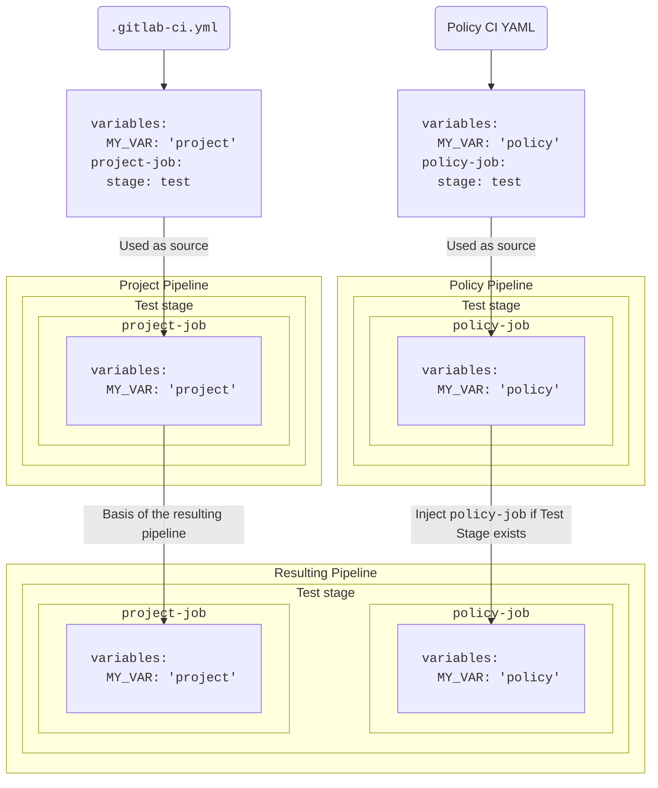



- Édition : GitLab Ultimate
- Offre : GitLab.com, GitLab Self-Managed, GitLab Dedicated





- [Introduit](https://gitlab.com/groups/gitlab-org/-/epics/13266) dans GitLab 17.2 [avec un flag](../../../administration/feature_flags/_index.md) nommé `pipeline_execution_policy_type`. Activé par défaut.
- [En disponibilité générale](https://gitlab.com/gitlab-org/gitlab/-/issues/454278) dans GitLab 17.3. Feature flag `pipeline_execution_policy_type` supprimé.



Utilisez les stratégies d'exécution des pipelines pour gérer et appliquer des jobs CI/CD sur plusieurs projets avec une configuration unique.

> [!warning]
> N'activez pas les stratégies d'exécution des pipelines tant que vous n'avez pas migré les [pipelines de conformité](../../compliance/compliance_pipelines.md) existants dans le même projet. Lorsque les deux sont configurés, les pipelines de conformité remplacent le pipeline de projet standard, mais les stratégies d'exécution des pipelines s'appliquent en fonction du pipeline de projet d'origine. Cela crée un comportement imprévisible qui varie selon la stratégie d'exécution des pipelines et les configurations CI/CD, et peut entraîner des jobs dupliqués, des échecs de pipeline ou des contrôles de sécurité et de conformité manquants. Les pipelines de conformité sont [dépréciés](../../../update/deprecations.md#compliance-pipelines). Vous devriez migrer les pipelines de conformité existants dès que possible et utiliser les stratégies d'exécution des pipelines pour toutes les nouvelles implémentations.

- <i class="fa-youtube-play" aria-hidden="true"></i> Pour une présentation vidéo, voir [Security Policies : Pipeline Execution Policy Type](https://www.youtube.com/watch?v=QQAOpkZ__pA).

## Schéma {#schema}



- [Activation](https://gitlab.com/gitlab-org/gitlab/-/merge_requests/159858) du champ `suffix` dans GitLab 17.4.
- [Modification](https://gitlab.com/gitlab-org/gitlab/-/merge_requests/165096) de l'exécution des pipelines afin que les étapes ultérieures attendent la fin de l'étape `.pipeline-policy-pre` dans GitLab 17.7.
- [Modification](https://gitlab.com/gitlab-org/gitlab/-/issues/558233) de l'exécution des pipelines afin que lorsqu'une étape `.pipeline-policy-pre` échoue, tous les jobs ultérieurs soient ignorés dans GitLab 18.10. Activé par défaut.
- Nouvelle exécution de pipeline [généralement disponible](https://gitlab.com/gitlab-org/gitlab/-/merge_requests/233245) dans GitLab 19.0. Feature flag `ensure_pipeline_policy_pre_succeeds` supprimé.



Le fichier YAML avec les stratégies d'exécution des pipelines se compose d'un tableau d'objets correspondant au schéma de stratégie d'exécution des pipelines, imbriqué sous la clé `pipeline_execution_policy`. Vous pouvez configurer un maximum de cinq politiques sous la clé `pipeline_execution_policy` par projet de politique de sécurité. Toute autre politique configurée après les cinq premières n'est pas appliquée.

Lorsque vous enregistrez une nouvelle politique, GitLab valide son contenu par rapport à [ce schéma JSON](https://gitlab.com/gitlab-org/gitlab/-/blob/master/ee/app/validators/json_schemas/security_orchestration_policy.json). Si vous n'êtes pas familier avec la lecture des [schémas JSON](https://json-schema.org/), les sections et tableaux suivants constituent une alternative.

| Champ | Type | Obligatoire | Description |
|-------|------|----------|-------------|
| `pipeline_execution_policy` | `array` de stratégie d'exécution des pipelines | true | Liste des stratégies d'exécution des pipelines (cinq au maximum) |

## Schéma `pipeline_execution_policy` {#pipeline_execution_policy-schema}

| Champ | Type | Obligatoire | Description                                                                                                                                                                                                                                                                                                                     |
|-------|------|----------|---------------------------------------------------------------------------------------------------------------------------------------------------------------------------------------------------------------------------------------------------------------------------------------------------------------------------------|
| `name` | `string` | true | Nom de la politique. 255 caractères maximum.                                                                                                                                                                                                                                                                                  |
| `description` (facultatif) | `string` | true | Description de la politique.                                                                                                                                                                                                                                                                                                      |
| `enabled` | `boolean` | true | Flag pour activer (`true`) ou désactiver (`false`) la politique.                                                                                                                                                                                                                                                                        |
| `content` | `object` de [`content`](#content-type) | true | Référence à la configuration CI/CD à injecter dans les pipelines de projet.                                                                                                                                                                                                                                                          |
| `pipeline_config_strategy` | `string` | false | Peut être `inject_policy`, `inject_ci` (déprécié) ou `override_project_ci`. Voir [les stratégies de pipeline](#pipeline-configuration-strategies) pour plus d'informations.                                                                                                                                                                 |
| `policy_scope` | `object` de [`policy_scope`](_index.md#configure-the-policy-scope) | false | Limite la portée de la politique en fonction des projets, des groupes ou des labels de framework de conformité que vous spécifiez.                                                                                                                                                                                                                                        |
| `suffix` | `string` | false | Peut être `on_conflict` (par défaut) ou `never`. Définit le comportement pour la gestion des conflits de nommage des jobs. `on_conflict` ajoute un suffixe unique aux noms des jobs qui briseraient l'unicité. `never` provoque l'échec du pipeline si les noms des jobs dans le projet et toutes les politiques applicables ne sont pas uniques. |
| `skip_ci` | `object` de [`skip_ci`](pipeline_execution_policies.md#skip_ci-type) | false | Définit si les utilisateurs peuvent appliquer la directive `skip-ci`. Par défaut, l'utilisation de `skip-ci` est ignorée et, par conséquent, les pipelines avec des stratégies d'exécution des pipelines ne peuvent pas être ignorés.                                                                                                                                             |
| `no_pipeline` | `object` de [`no_pipeline`](pipeline_execution_policies.md#no_pipeline-type) | false | Définit si les utilisateurs peuvent appliquer la directive `no_pipeline`. Par défaut, l'utilisation de `no_pipeline` est ignorée et, par conséquent, les pipelines avec des stratégies d'exécution des pipelines ne peuvent pas ne pas être créés.                                                                                                                                 |
| `variables_override` | `object` de [`variables_override`](pipeline_execution_policies.md#variables_override-type) | false | Contrôle si les utilisateurs peuvent remplacer le comportement des variables de politique dans les jobs créés par la politique. Par défaut, les variables de politique sont appliquées avec la priorité la plus haute et les utilisateurs ne peuvent pas les remplacer.                                                                                                               |

Notez ce qui suit :

- Les utilisateurs qui déclenchent un pipeline doivent avoir au moins un accès en lecture au fichier d'exécution des pipelines spécifié dans la stratégie d'exécution des pipelines, sinon les pipelines ne démarrent pas.
- Si le fichier d'exécution des pipelines est supprimé ou renommé, les pipelines dans les projets avec la politique appliquée peuvent cesser de fonctionner.
- Les jobs de stratégie d'exécution des pipelines peuvent être assignés à l'une des deux étapes réservées :
  - `.pipeline-policy-pre` au début du pipeline, avant l'étape `.pre`.
  - `.pipeline-policy-post` à la toute fin du pipeline, après l'étape `.post`.
- L'injection de jobs dans l'une des étapes réservées est garantie de toujours fonctionner. Les jobs de stratégie d'exécution peuvent également être assignés à toute étape standard (build, test, deploy) ou déclarée par l'utilisateur. Cependant, dans ce cas, les jobs peuvent être ignorés en fonction de la configuration du pipeline de projet.
- Il n'est pas possible d'assigner des jobs à des étapes réservées en dehors d'une stratégie d'exécution des pipelines.
- Choisissez des noms de jobs uniques pour les stratégies d'exécution des pipelines. Certaines configurations CI/CD sont basées sur des noms de jobs, ce qui peut entraîner des résultats indésirables si un nom de job existe plusieurs fois dans le même pipeline. Par exemple, le mot-clé `needs` rend un job dépendant d'un autre. S'il y a plusieurs jobs avec le nom `example`, un job qui `needs` le nom de job `example` dépend d'une seule des instances de job `example` au hasard.
- Les stratégies d'exécution des pipelines restent en vigueur même si le projet ne dispose pas d'un fichier de configuration CI/CD.
- L'ordre des politiques est important pour le suffixe appliqué.
- Si une politique appliquée à un projet donné a `suffix: never`, le pipeline échoue si un autre job portant le même nom est déjà présent dans le pipeline.
- Les stratégies d'exécution des pipelines sont appliquées sur toutes les branches et sources de pipeline. Cependant, pour les [pipelines de merge request](../../../ci/pipelines/merge_request_pipelines.md#configure-merge-request-pipelines), certaines configurations `rules:` ou `workflow:rules` peuvent empêcher les jobs de s'exécuter. Utilisez les [règles de workflow](../../../ci/yaml/workflow.md) pour contrôler quand les stratégies d'exécution des pipelines sont appliquées.

### Vérification du pipeline de politique de sécurité {#security-policy-pipeline-check}



- Édition : GitLab Ultimate
- Offre : GitLab.com, GitLab Self-Managed, GitLab Dedicated
- Statut :  Expérience





- [Introduit](https://gitlab.com/gitlab-org/gitlab/-/issues/589650) dans GitLab 18.11 [avec un flag](../../../administration/feature_flags/_index.md) nommé `security_policy_pipeline_check`. Désactivé par défaut.
- [Activé par défaut](https://gitlab.com/gitlab-org/gitlab/-/issues/592205) dans GitLab 18.11.



Lorsque des stratégies d'exécution des pipelines ou des [stratégies d'exécution de scan](scan_execution_policies.md) sont configurées pour un projet, la vérification du pipeline de politique de sécurité exige que tous les pipelines pour le dernier commit réussissent avant que le merge request puisse être fusionné. Cette vérification s'applique à tous les pipelines qui s'exécutent en raison du commit, pas seulement aux pipelines créés par les politiques de sécurité.

La vérification du pipeline de politique de sécurité empêche la fusion lorsque le pipeline de merge request réussit, mais qu'un autre pipeline (tel qu'un pipeline de branche créé par une politique de sécurité) échoue, ce qui pourrait sinon permettre la fusion de code non vérifié.

La vérification du pipeline de politique de sécurité se comporte comme suit :

- Si le paramètre de projet **Les pipelines doivent réussir** est activé, un pipeline en échec entraîne un blocage strict qui empêche la fusion.
- Si **Les pipelines doivent réussir** n'est pas activé, un pipeline en échec entraîne un avertissement. Le merge request peut toujours être configuré pour la [fusion automatique](../../project/merge_requests/auto_merge.md).
- Si le paramètre de projet **Les pipelines ignorés sont considérés réussis** est activé, les pipelines ignorés sont traités comme s'ils avaient réussi.

### Étape `.pipeline-policy-pre` {#pipeline-policy-pre-stage}



- [Modification](https://gitlab.com/gitlab-org/gitlab/-/issues/558233) de l'exécution des pipelines afin que lorsqu'une étape `.pipeline-policy-pre` échoue, tous les jobs ultérieurs soient ignorés dans GitLab 18.10. Activé par défaut.
- Nouvelle exécution de pipeline [généralement disponible](https://gitlab.com/gitlab-org/gitlab/-/merge_requests/233245) dans GitLab 19.0. Feature flag `ensure_pipeline_policy_pre_succeeds` supprimé.



Les jobs dans l'étape `.pipeline-policy-pre` s'exécutent toujours. Cette étape est conçue pour les cas d'utilisation de sécurité et de conformité. Les jobs dans le pipeline ne démarrent pas tant que l'étape `.pipeline-policy-pre` n'est pas terminée.

Si l'étape `.pipeline-policy-pre` échoue ou si tous les jobs de l'étape sont ignorés, tous les jobs des étapes ultérieures sont ignorés, notamment :

- Les jobs avec `needs: []`.
- Les jobs avec `when: always`.

Si vous n'avez pas besoin de ce comportement pour votre workflow, utilisez plutôt l'étape `.pre` ou une étape personnalisée.

> [!note]
> Dans GitLab 18.9 et versions antérieures, les jobs avec `needs: []` ou `when: always` pouvaient contourner une étape `.pipeline-policy-pre` en échec. Ce comportement est devenu le comportement par défaut dans GitLab 18.10 et est permanent depuis GitLab 19.0.

### Bonnes pratiques de nommage des jobs {#job-naming-best-practice}



- La gestion des conflits de nommage a été [introduite](https://gitlab.com/gitlab-org/gitlab/-/issues/473189) dans GitLab 17.4.



Il n'existe aucun indicateur visible qu'un job a été généré par une politique de sécurité. Pour faciliter l'identification des jobs créés par des politiques et éviter les collisions de noms de jobs, ajoutez un préfixe ou un suffixe unique au nom du job.

Exemples :

- Utiliser : `policy1:deployments:sast`. Ce nom est probablement unique dans toutes les autres politiques et tous les autres projets.
- Ne pas utiliser : `sast`. Ce nom risque d'être dupliqué dans d'autres politiques et d'autres projets.

Les stratégies d'exécution des pipelines gèrent les conflits de nommage en fonction de l'attribut `suffix`. S'il y a plusieurs jobs portant le même nom :

- Avec `on_conflict` (par défaut), un suffixe est ajouté à un job si son nom entre en conflit avec un autre job dans le pipeline.
- Avec `never`, aucun suffixe n'est ajouté en cas de conflit et le pipeline échoue.

Le suffixe est ajouté en fonction de l'ordre dans lequel les jobs sont fusionnés dans le pipeline principal.

L'ordre est le suivant :

1. Jobs du pipeline de projet
1. Jobs de politique de projet (le cas échéant)
1. Jobs de politique de groupe (le cas échéant, ordonnés par hiérarchie, le groupe principal est appliqué en dernier)

Le suffixe appliqué a le format suivant :

`:policy-<security-policy-project-id>-<policy-index>`.

Exemple du job résultant : `sast:policy-123456-0`.

Si plusieurs politiques dans un projet de politique de sécurité définissent le même nom de job, le suffixe numérique correspond à l'index de la politique en conflit.

Exemple des jobs résultants :

- `sast:policy-123456-0`
- `sast:policy-123456-1`

### Bonnes pratiques pour les étapes de jobs {#job-stage-best-practice}

Les jobs définis dans une stratégie d'exécution des pipelines peuvent utiliser n'importe quelle [étape](../../../ci/yaml/_index.md#stage) définie dans la configuration CI/CD du projet, ainsi que les étapes réservées `.pipeline-policy-pre` et `.pipeline-policy-post`.

> [!note]
> Si votre politique contient des jobs uniquement dans les étapes `.pre` et `.post`, le pipeline de la politique est évalué comme `empty`. Il n'est pas fusionné avec le pipeline du projet.
>
> Pour utiliser les étapes `.pre` et `.post` dans une stratégie d'exécution des pipelines, vous devez inclure au moins un autre job qui s'exécute dans une étape différente. Par exemple : `.pipeline-policy-pre`.

Lorsque vous utilisez la [stratégie de pipeline](#pipeline-configuration-strategies) `inject_policy`, si un projet cible ne contient pas son propre fichier `.gitlab-ci.yml`, toutes les étapes de la politique sont injectées dans le pipeline.

Lorsque vous utilisez la [stratégie de pipeline](#pipeline-configuration-strategies) (dépréciée) `inject_ci`, si un projet cible ne contient pas son propre fichier `.gitlab-ci.yml`, les seules étapes disponibles sont les étapes de pipeline par défaut et les étapes réservées.

Lorsque vous appliquez des stratégies d'exécution des pipelines sur des projets avec des configurations CI/CD que vous n'avez pas les autorisations de modifier, vous devez définir des jobs dans les étapes `.pipeline-policy-pre` et `.pipeline-policy-post`. Ces étapes sont toujours disponibles, quelle que soit la configuration CI/CD d'un projet.

Lorsque vous utilisez la [stratégie de pipeline](#pipeline-configuration-strategies) `override_project_ci` avec plusieurs stratégies d'exécution des pipelines et avec des étapes personnalisées, les étapes doivent être définies dans le même ordre relatif pour être compatibles entre elles :

Exemple de configuration valide :

```yaml
  - override-policy-1 stages: [build, test, policy-test, deploy]
  - override-policy-2 stages: [test, deploy]
```

Exemple de configuration invalide :

```yaml
  - override-policy-1 stages: [build, test, policy-test, deploy]
  - override-policy-2 stages: [deploy, test]
```

Le pipeline échoue si une ou plusieurs politiques `override_project_ci` ont une configuration `stages` invalide.

### Type `content` {#content-type}

| Champ | Type | Obligatoire | Description |
|-------|------|----------|-------------|
| `project` | `string` | true | Le chemin complet du projet GitLab vers un projet sur la même instance GitLab. |
| `file` | `string` | true | Un chemin de fichier complet relatif au répertoire racine (/). Les fichiers YAML doivent avoir l'extension `.yml` ou `.yaml`. |
| `ref` | `string` | false | La référence à partir de laquelle récupérer le fichier. Par défaut, pointe vers le HEAD du projet lorsqu'elle n'est pas spécifiée. |

Utilisez le type `content` dans une politique pour référencer une configuration CI/CD stockée dans un autre dépôt. Cela vous permet de réutiliser la même configuration CI/CD dans plusieurs politiques, réduisant ainsi la charge de maintenance de ces configurations. Par exemple, si vous avez une configuration CI/CD de détection des secrets personnalisée que vous souhaitez appliquer dans la politique A et la politique B, vous pouvez créer un seul fichier de configuration YAML et référencer la configuration dans les deux politiques.

Prérequis :

- Les utilisateurs déclenchant des pipelines qui s'exécutent dans les projets sur lesquels une politique contenant le type `content` est appliquée doivent avoir au minimum un accès en lecture seule au projet contenant la CI/CD
- Dans les projets qui appliquent des stratégies d'exécution des pipelines, les utilisateurs doivent avoir au moins un accès en lecture seule au projet qui contient la configuration CI/CD pour déclencher le pipeline.

  Dans GitLab 17.4 et versions ultérieures, vous pouvez accorder l'accès en lecture seule requis pour le fichier de configuration CI/CD spécifié dans un projet de politique de sécurité à l'aide du type `content`. Pour ce faire, activez le paramètre **Stratégies d'exécution des pipelines** dans les paramètres généraux du projet de politique de sécurité. L'activation de ce paramètre accorde à l'utilisateur qui a déclenché le pipeline l'accès en lecture au fichier de configuration CI/CD appliqué par la stratégie d'exécution des pipelines. Ce paramètre n'accorde pas à l'utilisateur l'accès à d'autres parties du projet où le fichier de configuration est stocké. Pour plus de détails, voir [Accorder l'accès automatiquement](#grant-access-automatically).

### Type `skip_ci` {#skip_ci-type}



- [Introduit](https://gitlab.com/gitlab-org/gitlab/-/merge_requests/173480) dans GitLab 17.7.



Les stratégies d'exécution des pipelines offrent un contrôle sur qui peut utiliser la directive `[skip ci]`. Vous pouvez spécifier certains utilisateurs ou comptes de service autorisés à utiliser `[skip ci]` tout en garantissant que les contrôles de sécurité et de conformité critiques sont effectués.

Utilisez le mot-clé `skip_ci` pour spécifier si les utilisateurs sont autorisés à appliquer la directive `skip_ci` pour ignorer les pipelines. Lorsque le mot-clé n'est pas spécifié, la directive `skip_ci` est ignorée, empêchant tous les utilisateurs de contourner les stratégies d'exécution des pipelines.

| Champ                   | Type     | Valeurs possibles          | Description |
|-------------------------|----------|--------------------------|-------------|
| `allowed` | `boolean`   | `true`, `false` | Flag pour autoriser (`true`) ou empêcher (`false`) l'utilisation de la directive `skip-ci` pour les pipelines avec des stratégies d'exécution des pipelines appliquées. |
| `allowlist`             | `object` | `users` | Spécifiez les utilisateurs qui sont toujours autorisés à utiliser la directive `skip-ci`, quelle que soit la valeur du flag `allowed`. Utilisez `users:` suivi d'un tableau d'objets avec des clés `id` représentant les identifiants d'utilisateur. |

### Type `no_pipeline` {#no_pipeline-type}

Les stratégies d'exécution des pipelines offrent un contrôle sur qui peut utiliser la directive `[no_pipeline]`. Vous pouvez spécifier certains utilisateurs ou comptes de service autorisés à utiliser `[no_pipeline]` tout en garantissant que les contrôles de sécurité et de conformité critiques sont effectués.

Utilisez le mot-clé `no_pipeline` pour spécifier si les utilisateurs sont autorisés à appliquer la directive `no_pipeline` pour ne pas créer de pipelines. Lorsque le mot-clé n'est pas spécifié, la directive `no_pipeline` est ignorée, empêchant tous les utilisateurs de contourner les stratégies d'exécution des pipelines.

| Champ                   | Type     | Valeurs possibles          | Description |
|-------------------------|----------|--------------------------|-------------|
| `allowed` | `boolean`   | `true`, `false` | Flag pour autoriser (`true`) ou empêcher (`false`) l'utilisation de la directive `no_pipeline` pour les pipelines avec des stratégies d'exécution des pipelines appliquées. |
| `allowlist`             | `object` | `users` | Spécifiez les utilisateurs qui sont toujours autorisés à utiliser la directive `no_pipeline`, quelle que soit la valeur du flag `allowed`. Utilisez `users:` suivi d'un tableau d'objets avec des clés `id` représentant les identifiants d'utilisateur. |

### Type `variables_override` {#variables_override-type}



- [Introduit](https://gitlab.com/groups/gitlab-org/-/epics/16430) dans GitLab 18.1.



| Champ                   | Type     | Valeurs possibles          | Description |
|-------------------------|----------|--------------------------|-------------|
| `allowed` | `boolean`   | `true`, `false` | Lorsque la valeur est `true`, les autres configurations peuvent remplacer les variables de politique. Lorsque la valeur est `false`, les autres configurations ne peuvent pas remplacer les variables de politique. |
| `exceptions` | `array` | `array` de `string` | Variables qui sont des exceptions à la règle globale. Lorsque la valeur est `allowed: false`, les `exceptions` constituent une liste d'autorisation. Lorsque la valeur est `allowed: true`, les `exceptions` constituent une liste de refus. |
| `dotenv` | `string` | `respect_policy`, `allow_override` | Contrôle si les variables d'[artefact dotenv](../../../ci/yaml/artifacts_reports.md#artifactsreportsdotenv) respectent les règles de politique `variables_override`. Par défaut (lorsqu'il n'est pas spécifié ou défini sur `respect_policy`), les variables dotenv sont soumises aux mêmes règles de remplacement que les autres variables. Définissez la valeur sur `allow_override` pour permettre aux variables dotenv de contourner les règles de politique. Cette option est fournie pour la compatibilité ascendante avec les workflows qui dépendent des artefacts dotenv remplaçant les variables de politique. L'utilisation de `allow_override` n'est pas recommandée car elle affaiblit les garanties de sécurité fournies par `variables_override`. |

Cette option contrôle la façon dont les variables définies par l'utilisateur sont gérées dans les pipelines avec des politiques appliquées. Cette fonctionnalité vous permet de :

- Refuser les variables définies par l'utilisateur par défaut (recommandé), ce qui offre une sécurité renforcée, mais nécessite que vous ajoutiez toutes les variables qui doivent être personnalisables à la liste d'autorisation `exceptions`.
- Autoriser les variables définies par l'utilisateur par défaut, ce qui offre plus de flexibilité mais une sécurité moindre, car vous devez ajouter les variables pouvant affecter l'application des politiques à la liste de refus `exceptions`.
- Définir des exceptions à la règle globale `allowed`.

Les variables définies par l'utilisateur peuvent affecter le comportement de tout job de politique dans le pipeline et peuvent provenir de diverses sources :

- [Variables de pipeline](../../../ci/variables/_index.md#use-pipeline-variables).
- [Variables de projet](../../../ci/variables/_index.md#for-a-project).
- [Variables de groupe](../../../ci/variables/_index.md#for-a-group).
- [Variables d'instance](../../../ci/variables/_index.md#for-an-instance).

Lorsque l'option `variables_override` n'est pas spécifiée, le comportement de « priorité la plus haute » est maintenu. Pour plus d'informations sur ce comportement, voir [la priorité des variables dans les stratégies d'exécution des pipelines](#precedence-of-variables-in-pipeline-execution-policies).

Lorsque la stratégie d'exécution des pipelines contrôle la priorité des variables, les job logs incluent les options `variables_override` configurées et le nom de la politique. Pour afficher ces logs, `gitlab-runner` doit être mis à jour vers la version 18.1 ou ultérieure.

#### Exemple de configuration `variables_override` {#example-variables_override-configuration}

Ajoutez l'option `variables_override` à votre configuration de stratégie d'exécution des pipelines :

```yaml
pipeline_execution_policy:
  - name: Security Scans
    description: 'Enforce security scanning'
    enabled: true
    pipeline_config_strategy: inject_policy
    content:
      include:
        - project: gitlab-org/security-policies
          file: security-scans.yml
    variables_override:
      allowed: false
      exceptions:
        - CS_IMAGE
        - SAST_EXCLUDED_ANALYZERS
```

##### Application des analyses de sécurité tout en autorisant la personnalisation des conteneurs (approche par liste d'autorisation) {#enforcing-security-scans-while-allowing-container-customization-allowlist-approach}

Pour appliquer les analyses de sécurité tout en permettant aux équipes de projet de spécifier leur propre image de conteneur :

```yaml
variables_override:
  allowed: false
  exceptions:
    - CS_IMAGE
```

Cette configuration bloque toutes les variables définies par l'utilisateur sauf `CS_IMAGE`, garantissant que les analyses de sécurité ne peuvent pas être désactivées, tout en permettant aux équipes de personnaliser l'image de conteneur.

##### Empêcher les remplacements de variables de sécurité spécifiques (approche par liste de refus) {#prevent-specific-security-variable-overrides-denylist-approach}

Pour autoriser la plupart des variables, mais empêcher la désactivation des analyses de sécurité :

```yaml
variables_override:
  allowed: true
  exceptions:
    - SECRET_DETECTION_DISABLED
    - SAST_DISABLED
    - DEPENDENCY_SCANNING_DISABLED
    - DAST_DISABLED
    - CONTAINER_SCANNING_DISABLED
```

Cette configuration autorise toutes les variables définies par l'utilisateur, à l'exception de celles qui pourraient désactiver les analyses de sécurité.

> [!warning]
> Bien que cette configuration puisse offrir une certaine flexibilité, elle est déconseillée en raison des implications sur la sécurité. Toute variable qui n'est pas explicitement listée dans `exceptions` peut être injectée par les utilisateurs. Par conséquent, la configuration de la politique n'est pas aussi bien protégée que lorsqu'on utilise l'approche `allowlist`.

### Schéma `policy scope` {#policy-scope-schema}

Pour personnaliser l'application des politiques, vous pouvez définir la portée d'une politique pour inclure ou exclure des projets, des groupes ou des labels de framework de conformité spécifiés. Pour plus de détails, voir [Portée](_index.md#configure-the-policy-scope).

> [!note]
> Définir un champ `policy_scope` sur une collection vide (par exemple, `including: []`) est traité de la même manière qu'omettre le champ ; ainsi, la politique s'applique à tous les projets pour cette dimension de portée. Pour désactiver entièrement une politique, utilisez `enabled: false`. Pour plus de détails, voir [Collections vides dans `policy_scope`](_index.md#empty-collections-in-policy_scope).

## Gérer l'accès à la configuration CI/CD {#manage-access-to-the-cicd-configuration}

Lorsque vous appliquez des stratégies d'exécution des pipelines sur un projet, les utilisateurs qui déclenchent des pipelines doivent avoir au moins un accès en lecture seule au projet qui contient la configuration CI/CD de la politique. Vous pouvez accorder l'accès au projet manuellement ou automatiquement.

### Accorder l'accès manuellement {#grant-access-manually}

Pour permettre aux utilisateurs ou aux groupes d'exécuter des pipelines avec des stratégies d'exécution des pipelines appliquées, vous pouvez les inviter dans le projet qui contient la configuration CI/CD de la politique.

### Accorder l'accès automatiquement {#grant-access-automatically}

Vous pouvez accorder automatiquement l'accès à la configuration CI/CD de la politique pour tous les utilisateurs qui exécutent des pipelines dans des projets avec des stratégies d'exécution des pipelines appliquées.

Prérequis :

- Assurez-vous que la configuration CI/CD de la stratégie d'exécution des pipelines est stockée dans un projet de politique de sécurité.
- Dans les paramètres généraux du projet de politique de sécurité, activez le paramètre **Stratégies d'exécution des pipelines**.

Si vous n'avez pas encore de projet de politique de sécurité et que vous souhaitez créer la première stratégie d'exécution des pipelines, créez un projet vide et liez-le en tant que projet de politique de sécurité. Pour lier le projet :

1. Dans le groupe ou le projet où vous souhaitez appliquer la politique, sélectionnez **Sécurisation** > **Politiques** > **Modifier le projet de politique**.
1. Sélectionnez le projet de politique de sécurité.

Le projet devient un projet de politique de sécurité et le paramètre devient disponible.

> [!note]
> Pour créer des pipelines downstream à l'aide de `$CI_JOB_TOKEN`, vous devez vous assurer que les projets et les groupes sont autorisés à demander le projet de politique de sécurité. Dans le projet de politique de sécurité, accédez à **Paramètres** > **CI/CD** > **Permissions de jetons de job** et ajoutez les groupes et projets autorisés à la liste d'autorisation. Si vous ne voyez pas les paramètres **CI/CD**, accédez à **Paramètres** > **Général** > **Visibilité, fonctionnalités du projet, autorisations** et activez **CI/CD**.

#### Configuration {#configuration}

1. Dans le projet de politique, sélectionnez **Paramètres** > **Général** > **Visibilité, fonctionnalités du projet, autorisations**.
1. Activez le paramètre **Stratégies d'exécution des pipelines**.
1. Dans le projet de politique, créez un fichier pour la configuration CI/CD de la politique.

   ```yaml
   # policy-ci.yml

   policy-job:
     script: ...
   ```

1. Dans le groupe ou le projet où vous souhaitez appliquer la politique, créez une stratégie d'exécution des pipelines et spécifiez le fichier de configuration CI/CD pour le projet de politique de sécurité.

   ```yaml
   pipeline_execution_policy:
   - name: My pipeline execution policy
     description: Enforces CI/CD jobs
     enabled: true
     pipeline_config_strategy: inject_policy
     content:
       include:
       - project: my-group/my-security-policy-project
         file: policy-ci.yml
   ```

## Stratégies de configuration des pipelines {#pipeline-configuration-strategies}

La stratégie de configuration des pipelines définit la méthode pour fusionner la configuration de la politique avec le pipeline de projet. Les stratégies d'exécution des pipelines exécutent les jobs définis dans le fichier `.gitlab-ci.yml` dans des pipelines isolés, qui sont fusionnés dans les pipelines des projets cibles.

### Type `inject_policy` {#inject_policy-type}



- [Introduit](https://gitlab.com/gitlab-org/gitlab/-/issues/475152) dans GitLab 17.9.



Cette stratégie ajoute des configurations CI/CD personnalisées dans le pipeline de projet existant sans remplacer entièrement la configuration CI/CD d'origine du projet. Elle convient lorsque vous souhaitez enrichir ou étendre le pipeline actuel avec des étapes supplémentaires, telles que l'ajout de nouvelles analyses de sécurité, de contrôles de conformité ou de scripts personnalisés.

Contrairement à la stratégie dépréciée `inject_ci`, `inject_policy` vous permet d'injecter des étapes de politique personnalisées dans votre pipeline, vous donnant un contrôle plus granulaire sur l'endroit où les règles de politique sont appliquées dans votre workflow CI/CD.

Si vous avez plusieurs politiques activées, cette stratégie injecte tous les jobs de chaque politique.

Lorsque vous utilisez cette stratégie, une configuration CI/CD de projet ne peut pas remplacer tout comportement défini dans les pipelines de politique car chaque pipeline dispose d'une configuration YAML isolée.

Pour les projets sans fichier `.gitlab-ci.yml`, cette stratégie crée implicitement un fichier `.gitlab-ci.yml`. Le pipeline exécuté contient uniquement les jobs définis dans la stratégie d'exécution des pipelines.

> [!note]
> Lorsqu'une stratégie d'exécution des pipelines utilise des règles de workflow qui empêchent les jobs de politique de s'exécuter, les seuls jobs qui s'exécutent sont les jobs CI/CD du projet. Si le projet utilise des règles de workflow qui empêchent les jobs CI/CD du projet de s'exécuter, les seuls jobs qui s'exécutent sont les jobs de la stratégie d'exécution des pipelines.

#### Injection d'étapes {#stages-injection}

Les étapes du pipeline de politique suivent la configuration CI/CD habituelle. Vous définissez l'ordre dans lequel une étape de politique personnalisée est injectée dans le pipeline de projet en fournissant les étapes avant et après les étapes personnalisées.

Les étapes du pipeline de projet et de politique sont représentées sous la forme d'un graphe acyclique orienté (DAG), où les nœuds sont des étapes et les arêtes représentent des dépendances. Lorsque vous combinez des pipelines, les DAGs individuels sont fusionnés en un seul DAG plus grand. Ensuite, un tri topologique est effectué, qui détermine l'ordre dans lequel les étapes de tous les pipelines doivent s'exécuter. Ce tri garantit que toutes les dépendances sont respectées dans l'ordre final. En cas de dépendances conflictuelles, le pipeline ne parvient pas à s'exécuter. Pour corriger les dépendances, assurez-vous que les étapes utilisées dans le projet et les politiques sont alignées.

Si une étape n'est pas explicitement définie dans la configuration du pipeline de politique, le pipeline utilise les étapes par défaut `stages: [build, test, deploy]`. Si ces étapes sont incluses mais listées dans un ordre différent, le pipeline échoue avec une erreur `Cyclic dependencies detected when enforcing policies`.

Les exemples suivants illustrent ce comportement. Tous les exemples supposent la configuration CI/CD de projet suivante :

```yaml
# .gitlab-ci.yml
stages: [build, test, deploy]

project-build-job:
  stage: build
  script: ...

project-test-job:
  stage: test
  script: ...

project-deploy-job:
  stage: deploy
  script: ...
```

##### Exemple 1 {#example-1}

```yaml
# policy-ci.yml
stages: [test, policy-stage, deploy]

policy-job:
  stage: policy-stage
  script: ...
```

Dans cet exemple, l'étape `policy-stage` :

- Doit être injectée après l'étape `test`, si elle est présente.
- Doit être injectée avant l'étape `deploy`, si elle est présente.

Résultat : Le pipeline contient les étapes suivantes : `[build, test, policy-stage, deploy]`.

Cas particuliers :

- Si le fichier `.gitlab-ci.yml` spécifie les étapes comme `[build, deploy, test]`, le pipeline échouera avec l'erreur `Cyclic dependencies detected when enforcing policies` car les contraintes ne peuvent pas être satisfaites. Pour corriger l'échec, ajustez la configuration du projet pour aligner les étapes avec les politiques.
- Si le fichier `.gitlab-ci.yml` spécifie les étapes comme `[build]`, le pipeline résultant a les étapes suivantes : `[build, policy-stage]`.

##### Exemple 2 {#example-2}

```yaml
# policy-ci.yml
stages: [policy-stage, deploy]

policy-job:
  stage: policy-stage
  script: ...
```

Dans cet exemple, l'étape `policy-stage` :

- Doit être injectée avant l'étape `deploy`, si elle est présente.

Résultat : Le pipeline contient les étapes suivantes : `[build, test, policy-stage, deploy]`.

Cas particuliers :

- Si le fichier `.gitlab-ci.yml` spécifie les étapes comme `[build, deploy, test]`, les étapes du pipeline résultant seraient : `[build, policy-stage, deploy, test]`.
- S'il n'y a pas d'étape `deploy` dans le pipeline de projet, l'étape `policy-stage` est injectée à la fin du pipeline, juste avant `.pipeline-policy-post`.

##### Exemple 3 {#example-3}

```yaml
# policy-ci.yml
stages: [test, policy-stage]

policy-job:
  stage: policy-stage
  script: ...
```

Dans cet exemple, l'étape `policy-stage` :

- Doit être injectée après l'étape `test`, si elle est présente.

Résultat : Le pipeline contient les étapes suivantes : `[build, test, deploy, policy-stage]`.

Cas particuliers :

- S'il n'y a pas d'étape `test` dans le pipeline de projet, l'étape `policy-stage` est injectée à la fin du pipeline, juste avant `.pipeline-policy-post`.

##### Exemple 4 {#example-4}

```yaml
# policy-ci.yml
stages: [policy-stage]

policy-job:
  stage: policy-stage
  script: ...
```

Dans cet exemple, l'étape `policy-stage` n'a pas de contraintes.

Résultat : Le pipeline contient les étapes suivantes : `[build, test, deploy, policy-stage]`.

##### Exemple 5 {#example-5}

```yaml
# policy-ci.yml
stages: [check, lint, test, policy-stage, deploy, verify, publish]

policy-job:
  stage: policy-stage
  script: ...
```

Dans cet exemple, l'étape `policy-stage` :

- Doit être injectée après les étapes `check`, `lint`, `test`, si elles sont présentes.
- Doit être injectée avant les étapes `deploy`, `verify`, `publish`, si elles sont présentes.

Résultat : Le pipeline contient les étapes suivantes : `[build, test, policy-stage, deploy]`.

Cas particuliers :

- Si le fichier `.gitlab-ci.yml` spécifie les étapes comme `[check, publish]`, le pipeline résultant a les étapes suivantes : `[check, policy-stage, publish]`

#### Ordre des étapes par défaut {#default-stage-order}

Lorsque les étapes ne sont pas définies dans une politique, GitLab applique l'ordre des étapes par défaut :

1. `.pre`
1. `build`
1. `test`
1. `deploy`
1. `.post`.

L'ordre par défaut peut entrer en conflit avec des projets qui utilisent l'une de ces étapes par défaut dans un ordre différent. Par exemple, utiliser `test` avant `build` dans `stages: [test, build, deploy]`.

#### Éviter les dépendances cycliques {#avoiding-cyclic-dependencies}

Des erreurs de dépendance cyclique se produisent lorsque l'ordre des étapes dans une politique entre en conflit avec l'ordre des étapes dans un projet. Pour éviter ces erreurs :

- Définissez toujours explicitement les étapes dans votre politique pour vous assurer que l'ordre des étapes est clair et compatible avec vos projets. Si votre politique utilise les étapes par défaut `build`, `test` ou `deploy`, sachez que l'ordre sera appliqué à tous les projets.
- Lorsque vous utilisez uniquement des étapes réservées (`.pipeline-policy-pre` et `.pipeline-policy-post`), vous n'avez pas besoin de définir les étapes par défaut dans votre politique, car ces étapes réservées sont toujours placées au début et à la fin du pipeline.

En suivant ces directives, vous pouvez créer des politiques qui fonctionnent de manière fiable dans des projets avec différentes configurations d'étapes.

### `inject_ci` (déprécié) {#inject_ci-deprecated}

> [!warning]
> Cette fonctionnalité a été [dépréciée](https://gitlab.com/gitlab-org/gitlab/-/issues/475152) dans GitLab 17.9. Utilisez plutôt [`inject_policy`](#inject_policy-type) car cette option prend en charge l'application des étapes de politique personnalisées.

Cette stratégie ajoute des configurations CI/CD personnalisées dans le pipeline de projet existant sans remplacer entièrement la configuration CI/CD d'origine du projet. Elle convient lorsque vous souhaitez enrichir ou étendre le pipeline actuel avec des étapes supplémentaires, telles que l'ajout de nouvelles analyses de sécurité, de contrôles de conformité ou de scripts personnalisés.

L'activation de plusieurs politiques injecte tous les jobs de manière additive.

Lorsque vous utilisez cette stratégie, une configuration CI/CD de projet ne peut pas remplacer tout comportement défini dans les pipelines de politique car chaque pipeline dispose d'une configuration YAML isolée.

Pour les projets sans fichier `.gitlab-ci.yml`, cette stratégie crée implicitement un fichier `.gitlab-ci.yml`. Cela permet à un pipeline contenant uniquement les jobs définis dans la stratégie d'exécution des pipelines de s'exécuter.

> [!note]
> Lorsqu'une stratégie d'exécution des pipelines utilise des règles de workflow qui empêchent les jobs de politique de s'exécuter, les seuls jobs qui s'exécutent sont les jobs CI/CD du projet. Si le projet utilise des règles de workflow qui empêchent les jobs CI/CD du projet de s'exécuter, les seuls jobs qui s'exécutent sont les jobs de la stratégie d'exécution des pipelines.

### `override_project_ci` {#override_project_ci}



- Mise à jour de la gestion des règles de workflow :
  - [Introduit](https://gitlab.com/gitlab-org/gitlab/-/merge_requests/175088) dans GitLab 17.8 [avec un flag](../../../administration/feature_flags/_index.md) nommé `policies_always_override_project_ci`. Activé par défaut.
  - [Généralement disponible](https://gitlab.com/gitlab-org/gitlab/-/issues/512877) dans GitLab 17.10. Feature flag `policies_always_override_project_ci` supprimé.
- La gestion de `override_project_ci` a été [modifiée](https://gitlab.com/gitlab-org/gitlab/-/issues/504434) pour permettre aux stratégies d'exécution de scan de s'exécuter conjointement avec les stratégies d'exécution des pipelines, dans GitLab 17.9.



Cette stratégie remplace la configuration CI/CD existante du projet par une nouvelle définie par la stratégie d'exécution des pipelines. Cette stratégie est idéale lorsque l'ensemble du pipeline doit être standardisé ou remplacé, par exemple lorsque vous souhaitez appliquer des normes CI/CD à l'échelle de l'organisation ou des exigences de conformité dans un secteur hautement réglementé. Pour remplacer la configuration du pipeline, définissez les jobs CI/CD et n'utilisez pas `include:project`.

La stratégie est prioritaire sur les autres politiques qui utilisent la stratégie `inject_ci` ou `inject_policy`. Si une politique avec `override_project_ci` est appliquée, la configuration CI/CD du projet est ignorée. Cependant, les autres configurations de politique de sécurité ne sont pas remplacées.

Lorsque vous utilisez `override_project_ci` dans une stratégie d'exécution des pipelines conjointement avec une stratégie d'exécution de scan, les configurations CI/CD sont fusionnées et les deux politiques sont appliquées au pipeline résultant.

Vous pouvez également fusionner la configuration CI/CD du projet avec le fichier `.gitlab-ci.yml` du projet au lieu de la remplacer. Pour fusionner la configuration, utilisez `include:project`. Cette stratégie permet aux utilisateurs d'inclure la configuration CI/CD du projet dans la configuration de la stratégie d'exécution des pipelines, permettant aux utilisateurs de personnaliser les jobs de politique. Par exemple, ils peuvent combiner la politique et la configuration CI/CD du projet dans un seul fichier YAML pour remplacer la configuration `before_script` ou définir des variables requises, telles que `CS_IMAGE`, pour définir le chemin requis vers le conteneur à analyser. Voici une [courte démonstration](https://youtu.be/W8tubneJ1X8) de ce comportement. Le diagramme suivant illustre comment les variables définies au niveau du projet et de la politique sont sélectionnées dans le pipeline résultant :



> [!note]
> Les règles de workflow dans la stratégie d'exécution des pipelines remplacent la configuration CI/CD d'origine du projet. En définissant des règles de workflow dans la politique, vous pouvez définir des règles appliquées à tous les projets liés, comme empêcher l'utilisation des pipelines de branche.

#### Nom du pipeline {#pipeline-name}

Les stratégies d'exécution des pipelines qui utilisent la stratégie `override_project_ci` remplacent le [nom du pipeline](../../../ci/yaml/_index.md#workflowname) défini dans la configuration CI/CD d'origine du projet.

Vous pouvez définir le nom du pipeline dans la configuration de la stratégie d'exécution des pipelines.

S'il y a plusieurs stratégies d'exécution des pipelines avec la stratégie `override_project_ci`, celle qui est la plus basse dans la hiérarchie de groupes est appliquée. Par exemple, une politique pour le projet remplace une politique pour le groupe auquel appartient le projet. Une politique pour un sous-groupe est prioritaire sur une politique pour le groupe auquel appartient le sous-groupe.

### Inclure la configuration CI/CD d'un projet dans la configuration de la stratégie d'exécution des pipelines {#include-a-projects-cicd-configuration-in-the-pipeline-execution-policy-configuration}

Lorsque vous utilisez la stratégie `override_project_ci`, la configuration du projet peut être incluse dans la configuration de la stratégie d'exécution des pipelines :

```yaml
include:
  - project: $CI_PROJECT_PATH
    ref: $CI_COMMIT_SHA
    file: $CI_CONFIG_PATH
    rules:
      - exists:
          paths:
            - '$CI_CONFIG_PATH'
          project: '$CI_PROJECT_PATH'
          ref: '$CI_COMMIT_SHA'

compliance_job:
 ...
```

> [!note]
> Lorsque la configuration `.gitlab-ci.yml` d'un projet est incluse dans une politique `override_project_ci` à l'aide de `include:project`, la configuration du projet fait partie du pipeline de politique. Dans ce scénario, la configuration de projet incluse peut assigner des jobs aux étapes réservées (`.pipeline-policy-pre` et `.pipeline-policy-post`), car l'utilisation des étapes réservées est autorisée dans un pipeline de politique. Hormis cette exception, [vous ne pouvez pas assigner des jobs aux étapes réservées](#job-stage-best-practice).

## Variables CI/CD {#cicd-variables}

> [!warning]
> Ne stockez pas d'informations sensibles ou de credentials dans des variables car elles sont stockées dans le cadre de la configuration de politique en texte clair dans un dépôt Git.

Par défaut, les stratégies d'exécution des pipelines s'exécutent en isolation, ce qui signifie qu'elles n'appliquent aucune variable définie en dehors de la politique.

Lorsque vous activez le paramètre [paramètre `variables_override`](#variables_override-type), les stratégies d'exécution des pipelines peuvent accéder aux variables définies par l'utilisateur suivantes :

- Variables des paramètres CI/CD de groupe.
- Variables des paramètres CI/CD de projet.
- Variables spécifiées par les utilisateurs lors de l'exécution d'un nouveau pipeline.

Cependant, même lorsque le paramètre `variables_override` est activé, les stratégies d'exécution des pipelines ne peuvent pas accéder aux types de variables suivants :

- Variables définies dans d'autres politiques.
- Variables définies dans le fichier `.gitlab-ci.yml` du projet.

Lorsqu'il est activé, le paramètre `variables_override` permet à la politique d'accéder aux variables et de les appliquer conformément aux règles standard de [priorité des variables CI/CD](../../../ci/variables/_index.md#cicd-variable-precedence).

Cependant, les règles de priorité sont plus complexes lors de l'utilisation d'une stratégie d'exécution des pipelines car elles peuvent varier selon la stratégie d'exécution des pipelines :

- Stratégie `inject_policy` : Si la variable est définie dans la stratégie d'exécution des pipelines, le job utilise toujours cette valeur. Si une variable n'est pas définie dans une stratégie d'exécution des pipelines, le job applique la valeur des paramètres de groupe ou de projet.
- Stratégie `inject_ci` : Si la variable est définie dans la stratégie d'exécution des pipelines, le job utilise toujours cette valeur. Si une variable n'est pas définie dans une stratégie d'exécution des pipelines, le job applique la valeur des paramètres de groupe ou de projet.
- Stratégie `override_project_ci` : Tous les jobs dans le pipeline résultant sont traités comme des jobs de politique. Les variables définies dans la politique (y compris celles des fichiers inclus) sont prioritaires sur les variables de projet et de groupe. Cela signifie que les variables des jobs dans la configuration CI/CD du projet inclus sont prioritaires sur les variables définies dans les paramètres du projet et du groupe.

Pour plus de détails sur les variables dans les stratégies d'exécution des pipelines, voir [la priorité des variables dans les stratégies d'exécution des pipelines](#precedence-of-variables-in-pipeline-execution-policies).

Vous pouvez [définir des variables de projet ou de groupe dans l'interface](../../../ci/variables/_index.md#define-a-cicd-variable-in-the-ui).

### Priorité des variables dans les stratégies d'exécution des pipelines {#precedence-of-variables-in-pipeline-execution-policies}

Lorsque vous utilisez des stratégies d'exécution des pipelines, notamment avec la stratégie `override_project_ci`, la priorité des valeurs de variables définies en plusieurs endroits peut différer des pipelines CI/CD GitLab standard. Voici quelques points importants à comprendre :

- Lors de l'utilisation de `override_project_ci`, tous les jobs dans le pipeline résultant sont considérés comme des jobs de politique, y compris ceux provenant des configurations CI/CD des projets inclus.
- Les variables définies dans un pipeline de politique (pour l'ensemble de l'instance ou pour un job) sont prioritaires sur les variables définies dans les paramètres du projet ou du groupe.
- Ce comportement s'applique à tous les jobs, y compris ceux inclus à partir du fichier de configuration CI/CD du projet (`.gitlab-ci.yml`).

#### Exemple {#example}

Si une variable dans la configuration CI/CD d'un projet et une variable de job définie dans un fichier `.gitlab-ci.yml` inclus ont le même nom, la variable de job est prioritaire lors de l'utilisation de `override_project_ci`.

Dans les paramètres CI/CD du projet, une variable `MY_VAR` est définie :

- Clé : `MY_VAR`
- Valeur : `Project configuration variable value`

Dans le fichier `.gitlab-ci.yml` du projet inclus, la même variable est définie :

```yaml
project-job:
  variables:
    MY_VAR: "Project job variable value"
  script:
    - echo $MY_VAR  # This will output "Project job variable value"
```

Dans ce cas, la valeur de variable de job `Project job variable value` est prioritaire.

### Préremplir des variables dans les pipelines déclenchés manuellement {#prefill-variables-in-manually-run-pipelines}



- [Introduit](https://gitlab.com/gitlab-org/gitlab/-/issues/527021) dans GitLab 18.5.



> [!warning]
> Cette fonctionnalité ne fonctionne pas avec les stratégies d'exécution des pipelines créées avant GitLab 18.5. Pour utiliser cette fonctionnalité avec des stratégies d'exécution des pipelines plus anciennes, vous pouvez soit :
>
> - Apporter n'importe quelle modification aux fichiers de configuration YAML existants pour les stratégies d'exécution des pipelines.
> - Copier, supprimer et recréer les politiques.
>
> Pour plus d'informations, voir [recréer les stratégies d'exécution des pipelines](#recreate-pipeline-execution-policies).

Vous pouvez utiliser les mots-clés `description`, `value` et `options` pour définir des variables CI/CD qui sont [préremplies lorsqu'un utilisateur exécute un pipeline manuellement](../../../ci/pipelines/_index.md#prefill-variables-in-manual-pipelines). Utilisez la description pour fournir des informations pertinentes, telles que l'utilisation de la variable et les valeurs acceptables.

Vous ne pouvez pas préremplir des variables spécifiques à un job.

Dans les pipelines déclenchés manuellement, la page **Nouveau pipeline** affiche toutes les variables de pipeline ayant une `description` définie dans la configuration CI/CD, depuis toutes les politiques applicables.

Vous devez configurer les variables préremplies comme autorisées à l'aide de [`variables_override`](pipeline_execution_policies.md#variables_override-type), sinon les valeurs utilisées lors du déclenchement manuel des pipelines sont ignorées.

#### Recréer les stratégies d'exécution des pipelines {#recreate-pipeline-execution-policies}

Pour recréer une stratégie d'exécution des pipelines :

<!-- markdownlint-disable MD044 -->

1. Dans la barre supérieure, sélectionnez **Rechercher ou aller à** et trouvez votre groupe.
1. Dans la barre latérale gauche, sélectionnez **Sécurisation** > **Politiques**.
1. Sélectionnez la stratégie d'exécution des pipelines que vous souhaitez recréer.
1. Dans la barre latérale droite, sélectionnez l'onglet **YAML** et copiez le contenu du fichier de politique entier.
1. À côté du tableau des politiques, sélectionnez les points de suspension verticaux (), puis sélectionnez **Supprimer**.
1. Fusionnez le merge request généré.
1. Revenez à **Sécurisation** > **Politiques** et sélectionnez **Nouvelle politique**.
1. Dans la section **Politique d'exécution de pipeline**, sélectionnez **Sélectionner la politique**.
1. Dans le **Mode .yaml**, collez le contenu de l'ancienne politique.
1. Sélectionnez **Mettre à jour via une requête de fusion** et fusionnez le merge request généré.

<!-- markdownlint-enable MD044 -->

## Garantir l'exécution des politiques critiques pour la sécurité {#ensuring-that-security-critical-policies-execute}

Lorsque vous implémentez des stratégies d'exécution des pipelines à des fins de sécurité et de conformité, tenez compte des bonnes pratiques suivantes pour vous assurer que vos politiques ne peuvent pas être contournées ou compromises.

### Éviter les règles `changes:` pour les jobs critiques pour la sécurité {#avoid-changes-rules-for-security-critical-jobs}

Dans les politiques de pipeline critiques pour la sécurité, évitez d'utiliser les règles `changes:` car elles peuvent produire des résultats inattendus sur les pipelines de branche. Le mot-clé `changes:` repose sur des diffs basés sur le SHA et peut être contourné dans certains scénarios, par exemple lors de l'utilisation de `git commit --amend` suivi d'un push forcé.

Lors de l'utilisation de `git commit --amend` suivi d'un push forcé, GitLab calcule les fichiers modifiés différemment :

1. Premier push (commit standard) :
   1. GitLab compare le nouveau commit avec son parent.
   1. GitLab détecte que le fichier cible a été modifié.
   1. La règle `changes: [filename]` se déclenche correctement.

1. Deuxième push (commit modifié avec `--force`) :
   1. Le commit modifié remplace entièrement le précédent par un nouveau SHA.
   1. GitLab calcule les modifications en utilisant `git diff HEAD~`, qui compare avec le commit précédent sur la branche.
   1. Comme le commit précédent sur cette branche avait également les mêmes modifications de fichier, le diff montre **no new changes**.
   1. La règle `changes:` ne se déclenche pas.

Utilisez plutôt des conditions qui ne peuvent pas être contournées :

```yaml
check-critical-files:
  stage: .pipeline-policy-pre
  script:
    - |
      # Check if critical files differ from the target branch
      if git diff origin/$CI_MERGE_REQUEST_TARGET_BRANCH_NAME --name-only | grep -q "Makefile\|\.gitlab-ci\.yml"; then
        echo "Critical files have been modified"
        exit 1
      fi
  rules:
    - if: $CI_PIPELINE_SOURCE == "merge_request_event"
      when: always
```

Vous pouvez également exécuter la vérification de politique sur chaque pipeline sans la condition `changes:` :

```yaml
security-check:
  stage: .pipeline-policy-pre
  script:
    - echo "Running security checks"
    - ./run-security-checks.sh
  rules:
    - when: always
```

Pour plus d'informations sur le comportement de `changes:`, voir [les jobs ou les pipelines s'exécutent de manière inattendue lors de l'utilisation de `changes`](../../../ci/jobs/job_troubleshooting.md#jobs-or-pipelines-run-unexpectedly-when-using-changes).

### Utiliser l'étape `.pipeline-policy-pre` pour les vérifications de sécurité critiques {#use-the-pipeline-policy-pre-stage-for-critical-security-checks}

Les jobs dans l'étape `.pipeline-policy-pre` sont conçus pour les cas d'utilisation de sécurité et de conformité. Tous les autres jobs du pipeline attendent la fin de cette étape avant de démarrer. Si l'étape `.pipeline-policy-pre` échoue, tous les jobs suivants sont ignorés.

#### Détecter les configurations de sécurité dupliquées {#detect-duplicate-security-configurations}

Vous pouvez utiliser `.pipeline-policy-pre` pour créer des jobs de validation personnalisés qui vérifient les configurations de sécurité existantes et fournissent des conseils. Par exemple, lorsque vous appliquez des analyses de sécurité dans une organisation avec des stratégies d'exécution des pipelines, mais que certains projets ont déjà leurs propres implémentations d'analyse de sécurité, vous pouvez utiliser `.pipeline-policy-pre` pour identifier les analyses dupliquées.

Exemple de configuration CI/CD de politique :

```yaml
# policy-ci.yml
check-duplicate-scans:
  stage: .pipeline-policy-pre
  script:
    - |
      echo "Checking for duplicate security scan configurations..."
      if [ -f ".gitlab-ci.yml" ]; then
        if grep -q "secret_detection:" .gitlab-ci.yml || \
           grep -q "sast:" .gitlab-ci.yml || \
           grep -q "dependency_scanning:" .gitlab-ci.yml || \
           grep -q "container_scanning:" .gitlab-ci.yml; then
          echo "WARNING: Duplicate security scans detected."
          echo ""
          echo "This project has security scans defined in .gitlab-ci.yml"
          echo "that might duplicate the scans enforced by pipeline execution policies."
          echo ""
          echo "To avoid redundant scans and reduce pipeline time:"
          echo "1. Review your .gitlab-ci.yml for security scanning jobs."
          echo "2. Remove duplicate jobs (secret_detection, sast, dependency_scanning, and so on)."
          echo "3. The pipeline execution policy ensures these scans still run."
          echo ""
          echo "For questions, contact your security team."
        else
          echo "No duplicate security scans detected."
        fi
      fi
  allow_failure: true
  rules:
    - when: always
```

Cette configuration :

- Détecte les configurations potentiellement dupliquées sans bloquer les pipelines.
- Fournit des conseils exploitables aux équipes de développement.
- Maintient la visibilité sur les projets qui nécessitent un nettoyage.
- Évite la complexité de la suppression automatique des jobs, ce qui pourrait avoir des conséquences imprévues.

Vous pouvez étendre cet exemple pour vérifier d'autres problèmes de configuration ou pour générer des rapports permettant aux équipes de sécurité de suivre la conformité dans les projets.

### Contrôler les remplacements de variables {#control-variable-overrides}

Utilisez la configuration [`variables_override`](#variables_override-type) pour empêcher les utilisateurs de remplacer des variables de sécurité critiques en désactivant les analyses de sécurité ou en modifiant des configurations de sécurité critiques.

```yaml
variables_override:
  allowed: false
  exceptions:
    - CS_IMAGE  # Allow customization of container image only
```

### Nommage sécurisé des jobs {#secure-job-naming}

Utilisez des noms de jobs uniques et descriptifs avec des préfixes pour éviter les conflits et indiquer clairement aux utilisateurs que les jobs sont appliqués par des politiques de sécurité :

```yaml
# Good: Clear security policy job name
security-policy:sast-scan:
  stage: .pipeline-policy-pre
  script: ...

# Avoid: Generic name that could conflict
sast:
  stage: .pipeline-policy-pre
  script: ...
```

## Comportement avec `[no_pipeline]` {#behavior-with-no_pipeline}

Par défaut, pour empêcher la création d'un pipeline standard, les utilisateurs peuvent pousser un commit vers une branche protégée avec `[no_pipeline]` dans les options de push. Cependant, les jobs définis avec une stratégie d'exécution des pipelines sont toujours déclenchés, car la politique ignore la directive `[no_pipeline]`. Cela empêche les développeurs de passer outre l'exécution des jobs définis dans la politique, ce qui garantit que les contrôles de sécurité et de conformité critiques sont toujours effectués.

Pour un contrôle plus flexible du comportement de `[no_pipeline]`, consultez la section [type `no_pipeline`](#no_pipeline-type).

## Comportement avec `[skip ci]` {#behavior-with-skip-ci}

Par défaut, pour empêcher le déclenchement d'un pipeline standard, les utilisateurs peuvent pousser un commit vers une branche protégée avec `[skip ci]` dans le message de commit. Cependant, les jobs définis avec une stratégie d'exécution des pipelines sont toujours déclenchés, car la politique ignore la directive `[skip ci]`. Cela empêche les développeurs de passer outre l'exécution des jobs définis dans la politique, ce qui garantit que les contrôles de sécurité et de conformité critiques sont toujours effectués.

Pour un contrôle plus flexible du comportement de `[skip ci]`, consultez la section [type `skip_ci`](#skip_ci-type).

## Exemples {#examples}

Ces exemples illustrent ce que vous pouvez réaliser avec les stratégies d'exécution des pipelines.

### Stratégie d'exécution des pipelines {#pipeline-execution-policy}

Vous pouvez utiliser l'exemple suivant dans un fichier `.gitlab/security-policies/policy.yml` stocké dans un [projet de politique de sécurité](enforcement/security_policy_projects.md) :

```yaml
---
pipeline_execution_policy:
- name: My pipeline execution policy
  description: Enforces CI/CD jobs
  enabled: true
  pipeline_config_strategy: override_project_ci
  content:
    include:
    - project: my-group/pipeline-execution-ci-project
      file: policy-ci.yml
      ref: main # optional
  policy_scope:
    projects:
      including:
      - id: 361
```

### Personnaliser les jobs appliqués en fonction des variables de projet {#customize-enforced-jobs-based-on-project-variables}

Les stratégies d'exécution des pipelines adaptent leur comportement en fonction des variables spécifiques au projet. Vous pouvez créer des politiques flexibles qui fournissent des valeurs par défaut sensées tout en permettant aux projets individuels de personnaliser certains aspects des jobs appliqués.

#### Évaluation des variables {#variable-evaluation}

Les règles dans les stratégies d'exécution des pipelines (telles que `if: $PROJECT_CS_IMAGE`) sont évaluées lors de l'exécution de la politique, et non en fonction du contexte du projet. Cela signifie :

- Les variables de projet sont disponibles dans la politique sous leurs noms standard (par exemple, `$PROJECT_CS_IMAGE`).
- Les variables de projet peuvent être prioritaires sur les variables définies par la politique.
- L'évaluation de la variable à utiliser se produit lorsque GitLab construit le pipeline de politique.

#### Modèles de nommage des variables {#variable-naming-patterns}

Lorsque vous créez des politiques personnalisables, suivez ces conventions de nommage :

- Variables de politique : Utilisez des noms standard (par exemple, `CS_IMAGE`) pour les valeurs par défaut.
- Variables de remplacement de projet : Utilisez des préfixes descriptifs (par exemple, `PROJECT_CS_IMAGE`) pour indiquer clairement leur objectif.

Ce modèle évite les conflits de nommage et clarifie l'intention.

#### Exemple : Analyse de conteneurs avec image personnalisable {#example-container-scanning-with-customizable-image}

Cet exemple montre comment créer une politique qui utilise une image de conteneur par défaut mais permet aux projets de spécifier leur propre image :

```yaml
variables:
  CS_ANALYZER_IMAGE: "$CI_TEMPLATE_REGISTRY_HOST/security-products/container-scanning:8"
  CS_IMAGE: alpine:latest  # Default fallback value

policy::container-security:
  stage: .pipeline-policy-pre
  rules:
    - if: $PROJECT_CS_IMAGE  # Check if project defined a custom image
      variables:
        CS_IMAGE: $PROJECT_CS_IMAGE  # Use project's custom image
    - when: always  # Always run the job (with default or custom image)
  script:
    - echo "CS_ANALYZER_IMAGE:$CS_ANALYZER_IMAGE"
    - echo "CS_IMAGE:$CS_IMAGE"
```

Fonctionnement :

1. Comportement par défaut : Si aucun `PROJECT_CS_IMAGE` n'est défini dans le projet, `CS_IMAGE` reste `alpine:latest`.
1. Comportement personnalisé : Si un projet définit `PROJECT_CS_IMAGE`, cette valeur remplace `CS_IMAGE`.
1. Évaluation des règles : La condition `if: $PROJECT_CS_IMAGE` est évaluée dans le contexte de la politique et peut accéder aux variables de projet.
1. Priorité des variables : L'attribution de variable par la politique est prioritaire sur la valeur par défaut.

Pour personnaliser l'image de conteneur, les projets doivent définir `PROJECT_CS_IMAGE` comme [variable de projet](../../../ci/variables/_index.md#for-a-project), et non la spécifier dans le fichier `.gitlab-ci.yml`.

#### Récapitulatif des considérations sur les variables {#summary-of-variable-considerations}

Sources de variables :

- Les variables de projet doivent être définies dans les paramètres CI/CD du projet, et non dans `.gitlab-ci.yml`.
- Les politiques peuvent également accéder aux variables de groupe et aux variables d'instance en utilisant leurs noms standard.
- Les variables de politique ont la priorité sur les variables de projet lorsque les deux sont définies avec le même nom.

Évaluation des règles :

- Toutes les conditions `rules:` dans les politiques d'exécution de pipeline sont évaluées lors de l'exécution de la politique. Cela signifie que les politiques peuvent accéder aux variables spécifiques au projet et réagir en conséquence.
- L'évaluation a lieu lors de la construction du pipeline, avant l'exécution de tout job.

Bonnes pratiques :

- Utilisez des noms de variables descriptifs avec des préfixes (par exemple, `PROJECT_*`) pour les remplacements au niveau du projet.
- Fournissez toujours des valeurs par défaut judicieuses dans la politique.
- Documentez les variables de personnalisation disponibles pour vos utilisateurs.

### Personnaliser les jobs appliqués à l'aide de `.gitlab-ci.yml` et des artefacts {#customize-enforced-jobs-using-gitlab-ciyml-and-artifacts}

Étant donné que les pipelines de politique s'exécutent en isolation, les politiques d'exécution de pipeline ne peuvent pas lire directement les variables depuis `.gitlab-ci.yml`. Si vous souhaitez utiliser les variables dans `.gitlab-ci.yml` au lieu de les définir dans la configuration CI/CD du projet, vous pouvez utiliser des artefacts pour transmettre des variables depuis la configuration `.gitlab-ci.yml` vers le pipeline de la politique d'exécution de pipeline.

```yaml
# .gitlab-ci.yml

build-job:
  stage: build
  script:
    - echo "BUILD_VARIABLE=value_from_build_job" >> build.env
  artifacts:
    reports:
      dotenv: build.env
```

```yaml
stages:
- build
- test

test-job:
  stage: test
  script:
    - echo "$BUILD_VARIABLE" # Prints "value_from_build_job"
```

### Personnaliser le comportement du scanner de sécurité avec `before_script` dans les configurations de projet {#customize-security-scanners-behavior-with-before_script-in-project-configurations}

Pour personnaliser le comportement d'un job de sécurité appliqué par une politique dans le fichier `.gitlab-ci.yml` du projet, vous pouvez remplacer `before_script`. Pour ce faire, utilisez la stratégie `override_project_ci` dans la politique et incluez la configuration CI/CD du projet. Exemple de configuration de politique d'exécution de pipeline :

```yaml
# policy.yml
type: pipeline_execution_policy
name: Secret detection
description: >
  This policy enforces secret detection and allows projects to override the
  behavior of the scanner.
enabled: true
pipeline_config_strategy: override_project_ci
content:
  include:
    - project: gitlab-org/pipeline-execution-policies/compliance-project
      file: secret-detection.yml
```

```yaml
# secret-detection.yml
include:
  - project: $CI_PROJECT_PATH
    ref: $CI_COMMIT_SHA
    file: $CI_CONFIG_PATH
  - template: Jobs/Secret-Detection.gitlab-ci.yml
```

Dans le fichier `.gitlab-ci.yml` du projet, vous pouvez définir `before_script` pour le scanner :

```yaml
include:
  - template: Jobs/Secret-Detection.gitlab-ci.yml

secret_detection:
  before_script:
    - echo "Before secret detection"
```

En utilisant `override_project_ci` et en incluant la configuration du projet, les configurations YAML peuvent être fusionnées.

### Configurer le contrôle des variables spécifiques aux ressources {#configure-resource-specific-variable-control}

Vous pouvez autoriser les équipes à définir des variables globales qui peuvent remplacer les variables de politique d'exécution de pipeline, tout en permettant des remplacements spécifiques aux jobs. Cela permet aux équipes de définir des valeurs par défaut appropriées pour les analyses de sécurité, tout en utilisant les ressources adéquates pour les autres jobs.

Incluez dans votre `resource-optimized-scans.yml` :

```yaml
variables:
  # Default resource settings for all jobs
  KUBERNETES_MEMORY_REQUEST: 4Gi
  KUBERNETES_MEMORY_LIMIT: 4Gi
  # Default values that teams can override via project variables
  SAST_KUBERNETES_MEMORY_REQUEST: 4Gi

sast:
  variables:
    SAST_EXCLUDED_ANALYZERS: 'spotbugs'
    KUBERNETES_MEMORY_REQUEST: $SAST_KUBERNETES_MEMORY_REQUEST
    KUBERNETES_MEMORY_LIMIT: $SAST_KUBERNETES_MEMORY_REQUEST
```

Incluez dans votre `policy.yml` :

```yaml
pipeline_execution_policy:
- name: Resource-Optimized Security Policy
  description: Enforces security scans with efficient resource management
  enabled: true
  pipeline_config_strategy: inject_ci
  content:
    include:
    - project: security/policy-templates
      file: resource-optimized-scans.yml
      ref: main

  variables_override:
    allowed: false
    exceptions:
      # Allow scan-specific resource overrides
      - SAST_KUBERNETES_MEMORY_REQUEST
      - SECRET_DETECTION_KUBERNETES_MEMORY_REQUEST
      - CS_KUBERNETES_MEMORY_REQUEST
      # Allow necessary scan customization
      - CS_IMAGE
      - SAST_EXCLUDED_PATHS
```

Cette approche permet aux équipes de définir des variables de ressources spécifiques aux analyses (comme `SAST_KUBERNETES_MEMORY_REQUEST`) via des remplacements de variables sans affecter tous les jobs de leur pipeline, ce qui améliore la gestion des ressources pour les grands projets. Cet exemple illustre également l'utilisation d'autres options courantes de personnalisation des analyses que vous pouvez proposer aux développeurs. Assurez-vous de documenter les variables disponibles afin que vos équipes de développement puissent en tirer parti.

### Utiliser des variables de groupe ou de projet dans une politique d'exécution de pipeline {#use-group-or-project-variables-in-a-pipeline-execution-policy}

Vous pouvez utiliser des variables de groupe ou de projet dans une politique d'exécution de pipeline.

Avec une variable de projet `PROJECT_VAR="I'm a project"`, le job de politique d'exécution de pipeline suivant donne le résultat : `I'm a project`.

```yaml
pipeline execution policy job:
    stage: .pipeline-policy-pre
    script:
    - echo "$PROJECT_VAR"
```

### Inclure des variables de la configuration du projet dans une politique d'exécution de pipeline {#include-variables-from-the-project-configuration-in-a-pipeline-execution-policy}

Les politiques d'exécution de pipeline s'exécutent dans leur propre contexte isolé, ce qui signifie que les variables définies dans le fichier `.gitlab-ci.yml` d'un projet ne sont pas automatiquement disponibles pour les jobs de la politique. Cependant, vous pouvez inclure des variables définies par le projet en référençant un fichier de variables distinct de votre projet.

Utilisez cette approche dans les cas suivants :

- Vous devez utiliser des conventions de nommage personnalisées pour les conteneurs Docker.
- Vous souhaitez maintenir des configurations spécifiques au projet que la politique doit respecter.
- Vous disposez de plusieurs conteneurs avec des noms différents mais construits à partir du même projet.

#### Exemple : Inclure le fichier de variables du projet {#example-include-project-variables-file}

Créez un fichier de variables dans votre dépôt de projet (par exemple, `gitlab-variables.yml`) :

```yaml
# gitlab-variables.yml
variables:
  DOCKER_TLS_CERTDIR: "/certs"
  CS_IMAGE: ${CI_REGISTRY_IMAGE}:build
  CUSTOM_VARIABLE: "custom-value"
```

Dans la configuration de votre politique d'exécution de pipeline, incluez ce fichier de variables :

```yaml
# Pipeline execution policy configuration
include:
  - project: $CI_PROJECT_PATH
    ref: $CI_COMMIT_SHA
    file: 'gitlab-variables.yml'
  - template: Jobs/Container-Scanning.gitlab-ci.yml

container_scanning:
  stage: test
  before_script:
    - echo "CS_IMAGE = $CS_IMAGE"
    - echo "CUSTOM_VARIABLE = $CUSTOM_VARIABLE"
```

Cette configuration :

1. Inclut le fichier `gitlab-variables.yml` du projet en cours d'analyse.
1. Rend les variables définies dans ce fichier disponibles pour les jobs de la politique.
1. Permet à chaque projet de définir ses propres valeurs de variables tout en maintenant une structure de politique cohérente.

#### Considérations importantes {#important-considerations}

- Priorité des variables : Les variables incluses depuis le fichier du projet suivent les [règles de priorité des variables](#precedence-of-variables-in-pipeline-execution-policies) standard pour les politiques d'exécution de pipeline.
- Emplacement du fichier : Le fichier de variables peut être situé n'importe où dans votre dépôt de projet. Utilisez un nom et un emplacement descriptifs pour faciliter la recherche et la maintenance.
- Éviter d'inclure la configuration CI/CD complète : Lorsque vous utilisez cette approche, incluez uniquement le fichier de variables, et non l'intégralité de `.gitlab-ci.yml`. L'inclusion de la configuration CI/CD complète peut entraîner une duplication des jobs.
- Sécurité : Ne stockez pas d'informations sensibles dans le fichier de variables. Utilisez des [variables CI/CD](../../../ci/variables/_index.md#define-a-cicd-variable-in-the-ui) définies dans les paramètres du projet ou du groupe pour les données sensibles.

#### Alternative : Utiliser les paramètres CI/CD du projet {#alternative-use-project-cicd-settings}

Si vous n'avez pas besoin de variables définies dynamiquement, vous pouvez définir une constante dans les paramètres CI/CD du projet (**Paramètres** > **CI/CD** > **Variables**) au lieu d'utiliser un fichier distinct. Ces variables sont automatiquement disponibles pour les jobs de politique d'exécution de pipeline sans configuration supplémentaire.

### Appliquer la valeur d'une variable à l'aide d'une politique d'exécution de pipeline {#enforce-a-variables-value-by-using-a-pipeline-execution-policy}

La valeur d'une variable définie dans une politique d'exécution de pipeline remplace la valeur d'une variable de groupe ou de politique portant le même nom. Dans cet exemple, la valeur du projet pour la variable `PROJECT_VAR` est écrasée et le job donne le résultat : `I'm a pipeline execution policy`.

```yaml
variables:
  PROJECT_VAR: "I'm a pipeline execution policy"

pipeline execution policy job:
    stage: .pipeline-policy-pre
    script:
    - echo "$PROJECT_VAR"
```

### Exemple de `policy.yml` avec des portées de politique de sécurité {#example-policyyml-with-security-policy-scopes}

Dans cet exemple, le `policy_scope` de la politique de sécurité :

- Inclut tout projet auquel des frameworks de conformité avec un ID `9` sont appliqués.
- Exclut les projets avec un ID `456`.

```yaml
pipeline_execution_policy:
- name: Pipeline execution policy
  description: ''
  enabled: true
  pipeline_config_strategy: inject_policy
  content:
    include:
    - project: my-group/pipeline-execution-ci-project
      file: policy-ci.yml
  policy_scope:
    compliance_frameworks:
    - id: 9
    projects:
      excluding:
      - id: 456
```

### Configurer `ci_skip` dans une politique d'exécution de pipeline {#configure-ci_skip-in-a-pipeline-execution-policy}

Dans l'exemple suivant, la politique d'exécution de pipeline est appliquée et [l'omission de CI](#skip_ci-type) est interdite, sauf pour l'utilisateur avec l'ID `75`.

```yaml
pipeline_execution_policy:
  - name: My pipeline execution policy with ci.skip exceptions
    description: 'Enforces CI/CD jobs'
    enabled: true
    pipeline_config_strategy: inject_policy
    content:
      include:
        - project: group-a/project1
          file: README.md
    skip_ci:
      allowed: false
      allowlist:
        users:
          - id: 75
```

### Configurer `ci_no_pipeline` dans une politique d'exécution de pipeline {#configure-ci_no_pipeline-in-a-pipeline-execution-policy}

Dans l'exemple suivant, la politique d'exécution de pipeline est appliquée et [la non-création de CI](#no_pipeline-type) est interdite, sauf pour l'utilisateur avec l'ID `75`.

```yaml
pipeline_execution_policy:
  - name: My pipeline execution policy with ci.no_pipeline exceptions
    description: 'Enforces CI/CD jobs'
    enabled: true
    pipeline_config_strategy: inject_policy
    content:
      include:
        - project: group-a/project1
          file: README.md
    no_pipeline:
      allowed: false
      allowlist:
        users:
          - id: 75
```

### Configurer la condition `exists` {#configure-the-exists-condition}

Utilisez la règle `exists` pour configurer la politique d'exécution de pipeline afin d'inclure le fichier de configuration CI/CD du projet lorsqu'un certain fichier existe.

Dans l'exemple suivant, la politique d'exécution de pipeline inclut la configuration CI/CD du projet si un fichier `Dockerfile` existe. Vous devez définir la règle `exists` pour utiliser `'$CI_PROJECT_PATH'` comme `project`, sinon GitLab évalue l'emplacement des fichiers dans le projet qui contient la configuration CI/CD de la politique de sécurité.

```yaml
include:
  - project: $CI_PROJECT_PATH
    ref: $CI_COMMIT_SHA
    file: $CI_CONFIG_PATH
    rules:
      - exists:
          paths:
            - 'Dockerfile'
          project: '$CI_PROJECT_PATH'
```

Pour utiliser cette approche, le groupe ou le projet doit utiliser la stratégie `override_project_ci`.

### Valider les étapes et les jobs du pipeline avec `CI_JOB_TOKEN` {#validate-pipeline-stages-and-jobs-with-ci_job_token}

Vous pouvez utiliser `CI_JOB_TOKEN` dans un job `.pipeline-policy-pre` pour appeler l'API GitLab et vérifier que les étapes et les jobs du pipeline figurent dans la liste des étapes ou jobs approuvés. Ce modèle est utile lorsque vous souhaitez empêcher les projets d'utiliser des étapes et des jobs CI/CD non approuvés.

L'exemple de script suivant récupère les jobs du pipeline depuis l'API, extrait les étapes et noms de jobs uniques, et vérifie chacun d'eux par rapport aux variables `APPROVED_STAGES` et `APPROVED_JOBS`. Si une étape ou un job non approuvé est détecté, le pipeline échoue avant l'exécution de tout autre job.

Définissez `APPROVED_STAGES` et `APPROVED_JOBS` en tant que [variables CI/CD](../../../ci/variables/_index.md) dans la configuration du projet, du groupe ou de la politique.

```yaml
validate-pipeline:
  stage: .pipeline-policy-pre
  image: alpine:latest
  before_script:
    - apk add --no-cache curl jq bash
  script:
    - |
      #!/bin/bash

      echo "Checking pipeline stages and jobs..."

      # Fetch pipeline jobs using CI_JOB_TOKEN
      api_url="$CI_API_V4_URL/projects/$CI_PROJECT_ID/pipelines/$CI_PIPELINE_ID/jobs"
      echo "API URL: $api_url"

      jobs=$(curl --silent --header "JOB-TOKEN: $CI_JOB_TOKEN" "$api_url")
      echo "Fetched Jobs: $jobs"

      if [[ "$jobs" == *"404 Project Not Found"* ]]; then
        echo "Failed to authenticate with GitLab API: Project not found"
        exit 1
      fi

      # Extract stages and jobs
      pipeline_stages=$(echo "$jobs" | jq -r '.[].stage' | sort | uniq | tr '\n' ',')
      pipeline_jobs=$(echo "$jobs" | jq -r '.[].name' | sort | uniq | tr '\n' ',')

      echo "Pipeline Stages: $pipeline_stages"
      echo "Pipeline Jobs: $pipeline_jobs"

      # Check if pipeline stages are approved
      for stage in $(echo $pipeline_stages | tr ',' ' '); do
        echo "Checking stage: $stage"
        if ! [[ ",$APPROVED_STAGES," =~ ",$stage," ]]; then
          echo "Stage $stage is not approved."
          exit 1
        fi
      done

      # Check if pipeline jobs are approved
      for job in $(echo $pipeline_jobs | tr ',' ' '); do
        echo "Checking job: $job"
        if ! [[ ",$APPROVED_JOBS," =~ ",$job," ]]; then
          echo "Job $job is not approved."
          exit 1
        fi
      done
```

### Appliquer un `component` de scan de conteneurs à l'aide d'une politique d'exécution de pipeline {#enforce-a-container-scanning-component-using-a-pipeline-execution-policy}

Vous pouvez utiliser des composants d'analyse de sécurité pour améliorer la gestion et l'application du versionnage.

```yaml
include:
  - component: gitlab.com/components/container-scanning/container-scanning@main
    inputs:
      cs_image: $CI_REGISTRY_IMAGE:$CI_COMMIT_SHA

container_scanning: # override component with additional configuration
  variables:
    CS_REGISTRY_USER: $CI_REGISTRY_USER
    CS_REGISTRY_PASSWORD: $CI_REGISTRY_PASSWORD
    SECURE_LOG_LEVEL: debug # add for verbose debugging of the container scanner
  before_script:
  - echo $CS_IMAGE # optionally add a before_script for additional debugging
```
