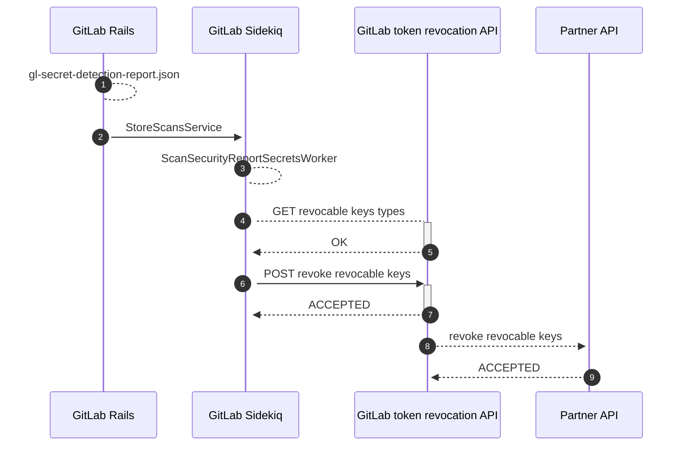
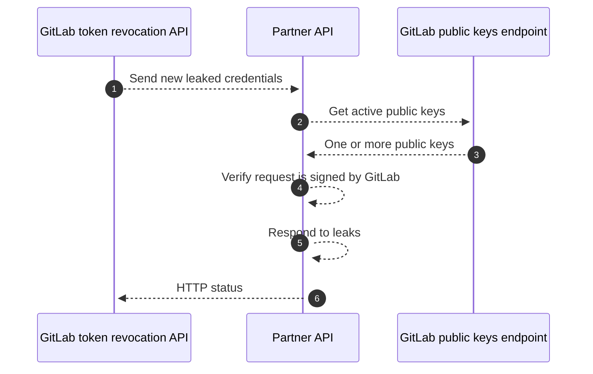



- Édition : GitLab Ultimate
- Offre : GitLab.com, GitLab Self-Managed, GitLab Dedicated



La détection des secrets GitLab répond automatiquement lorsqu'elle trouve certains types de secrets divulgués. Les réponses automatiques peuvent :

- Révoquer automatiquement le secret.
- Notifier le partenaire qui a émis le secret. Le partenaire peut alors révoquer le secret, notifier son propriétaire ou se protéger contre tout abus.

## Types de secrets et actions pris en charge {#supported-secret-types-and-actions}

GitLab prend en charge la réponse automatique pour les types de secrets suivants :

| Type de secret | Action effectuée | Pris en charge sur GitLab.com | Pris en charge dans GitLab Self-Managed |
| ----- | --- | --- | --- |
| GitLab [jetons d'accès personnels](../../profile/personal_access_tokens.md) | Révocation immédiate du jeton, envoi d'un e-mail au propriétaire. <sup>1</sup> | ✅ | ✅ |
| Amazon Web Services (AWS) [clés d'accès IAM](https://docs.aws.amazon.com/IAM/latest/UserGuide/id_credentials_access-keys.html) | Notifier AWS. | ✅ | ⚙ |
| Google Cloud [clés de compte de service](https://cloud.google.com/iam/docs/best-practices-for-managing-service-account-keys), [clés API](https://cloud.google.com/docs/authentication/api-keys) et [secrets client OAuth](https://support.google.com/cloud/answer/6158849#rotate-client-secret) | Notifier Google Cloud. | ✅ | ⚙ |
| Postman [clés API](https://learning.postman.com/docs/developer/postman-api/authentication/) | Notifier Postman. Postman [notifie le propriétaire de la clé](https://learning.postman.com/docs/administration/managing-your-team/secret-scanner/#protect-postman-api-keys-in-gitlab). | ✅ | ⚙ |

**Notes de bas de page** :

1. Pris en charge pour les [règles de détection](https://gitlab.com/gitlab-org/security-products/secret-detection/secret-detection-rules/-/blob/3204c843e960cec1b26a6cf8f95f609c68400de8/rules/mit/gitlab/gitlab.toml) `gitlab_personal_access_token`, `gitlab_personal_access_token_routable` et `gitlab_personal_access_token_routable_versioned`.

**Légende des composants** :

- ✅ - Disponible par défaut
- ⚙ - Nécessite une intégration manuelle à l'aide d'une API de révocation de jetons

## Disponibilité de la fonctionnalité {#feature-availability}

Les identifiants ne sont post-traités que lorsque la détection des secrets les trouve :

- Dans les projets publics, car les identifiants exposés publiquement représentent une menace accrue. L'extension aux projets privés est envisagée dans le [ticket 391379](https://gitlab.com/gitlab-org/gitlab/-/issues/391379).
- Dans les projets avec GitLab Ultimate, pour des raisons techniques. L'extension à toutes les éditions est suivie dans le [ticket 391763](https://gitlab.com/gitlab-org/gitlab/-/issues/391763).

## Activer la révocation automatique des jetons {#turn-on-automatic-token-revocation}

Sur GitLab.com, la révocation automatique des jetons est activée par défaut et aucune action n'est requise.

Sur GitLab Self-Managed et GitLab Dedicated, un administrateur doit l'activer en définissant `secret_detection_token_revocation_enabled` sur `true`. Ce paramètre ne dispose pas d'interface utilisateur et doit être configuré via l'[API des paramètres d'application](../../../api/settings.md) ou la [console Rails](../../../administration/operations/rails_console.md).





Utilisez l'[API des paramètres d'application](../../../api/settings.md) avec un jeton d'accès administrateur.

Pour vérifier la valeur actuelle, recherchez le champ `secret_detection_token_revocation_enabled` dans la réponse :

```shell
curl --header "PRIVATE-TOKEN: <your_admin_access_token>" \
  --url "https://gitlab.example.com/api/v4/application/settings"
```

Pour activer ce paramètre :

```shell
curl --request PUT \
  --header "PRIVATE-TOKEN: <your_admin_access_token>" \
  --data "secret_detection_token_revocation_enabled=true" \
  --url "https://gitlab.example.com/api/v4/application/settings"
```





Ouvrez une [session de console Rails](../../../administration/operations/rails_console.md#starting-a-rails-console-session).

Pour vérifier la valeur actuelle :

```ruby
::Gitlab::CurrentSettings.secret_detection_token_revocation_enabled?
```

Pour activer le paramètre :

```ruby
::Gitlab::CurrentSettings.update!(secret_detection_token_revocation_enabled: true)
```





## Architecture générale {#high-level-architecture}

Ce diagramme décrit comment un hook de post-traitement révoque un secret dans l'application GitLab :



1. Un pipeline avec un job de détection des secrets se termine, produisant un rapport d'analyse (**1**).
1. Le rapport est traité (**2**) par une classe de service, qui planifie un worker asynchrone si la révocation du jeton est possible.
1. Le worker asynchrone (**3**) communique avec un service HTTP déployé en externe (**4** et **5**) pour déterminer quels types de secrets peuvent être révoqués automatiquement.
1. Le worker envoie (**6** et **7**) la liste des secrets détectés que l'API de révocation de jetons GitLab est en mesure de révoquer.
1. L'API de révocation de jetons GitLab envoie (**8** et **9**) chaque jeton révocable à l'[API partenaire](#implement-a-partner-api) du fournisseur correspondant.

## Programme partenaire pour les notifications d'identifiants divulgués {#partner-program-for-leaked-credential-notifications}

GitLab notifie les partenaires lorsque les identifiants qu'ils émettent sont divulgués dans des dépôts publics sur GitLab.com. Si vous exploitez un produit cloud ou SaaS et que vous souhaitez recevoir ces notifications, apprenez-en davantage dans l'[epic 4944](https://gitlab.com/groups/gitlab-org/-/epics/4944). Les partenaires doivent [implémenter une API partenaire](#implement-a-partner-api), qui est appelée par l'API de révocation de jetons GitLab.

### Implémenter une API partenaire {#implement-a-partner-api}

Une API partenaire s'intègre à l'API de révocation de jetons GitLab pour recevoir et répondre aux demandes de révocation de jetons divulgués. Le service doit être une API HTTP accessible publiquement, idempotente et soumise à une limite de débit.

Les requêtes adressées à votre service peuvent inclure un ou plusieurs jetons divulgués, ainsi qu'un en-tête contenant la signature du corps de la requête. Nous vous recommandons vivement de vérifier les requêtes entrantes à l'aide de cette signature, afin de prouver qu'il s'agit d'une requête authentique de GitLab. Le diagramme ci-dessous détaille les étapes nécessaires pour recevoir, vérifier et révoquer les jetons divulgués :



1. L'API de révocation de jetons GitLab envoie (**1**) une [demande de révocation](#revocation-request) à l'API partenaire. La requête inclut des en-têtes contenant un identifiant de clé publique et la signature du corps de la requête.
1. L'API partenaire demande (**2**) une liste de [clés publiques](#public-keys-endpoint) à GitLab. La réponse (**3**) peut inclure plusieurs clés publiques en cas de rotation de clés et doit être filtrée à l'aide de l'identifiant présent dans l'en-tête de la requête.
1. L'API partenaire [vérifie la signature](#verifying-the-request) par rapport au corps réel de la requête, en utilisant la clé publique (**4**).
1. L'API partenaire traite les jetons divulgués, ce qui peut impliquer une révocation automatique (**5**).
1. L'API partenaire répond à l'API de révocation de jetons GitLab (**6**) avec le code de statut HTTP approprié :
   - Un code de réponse réussi (HTTP 200 à 299) confirme que le partenaire a bien reçu et traité la requête.
   - Un code d'erreur (HTTP 400 ou supérieur) entraîne une nouvelle tentative de la requête par l'API de révocation de jetons GitLab.

#### Demande de révocation {#revocation-request}

Ce document de schéma JSON décrit le corps de la demande de révocation :

```json
{
    "type": "array",
    "items": {
        "description": "A leaked token",
        "type": "object",
        "properties": {
            "type": {
                "description": "The type of token. This is vendor-specific and can be customized to suit your revocation service",
                "type": "string",
                "examples": [
                    "my_api_token"
                ]
            },
            "token": {
                "description": "The substring that was matched by the secret detection analyzer. In most cases, this is the entire token itself",
                "type": "string",
                "examples": [
                    "XXXXXXXXXXXXXXXX"
                ]
            },
            "url": {
                "description": "The URL to the raw source file hosted on GitLab where the leaked token was detected",
                "type": "string",
                "examples": [
                    "https://gitlab.example.com/some-repo/-/raw/abcdefghijklmnop/compromisedfile1.java"
                ]
            }
        }
    }
}
```

Exemple :

```json
[{"type": "my_api_token", "token": "XXXXXXXXXXXXXXXX", "url": "https://example.com/some-repo/-/raw/abcdefghijklmnop/compromisedfile1.java"}]
```

Dans cet exemple, la détection des secrets a déterminé qu'une instance de `my_api_token` a été divulguée. La valeur du jeton vous est fournie, en plus d'une URL accessible publiquement vers le contenu brut du fichier contenant le jeton divulgué.

La requête inclut deux en-têtes spéciaux :

| En-tête | Type | Description |
|--------|------|-------------|
| `Gitlab-Public-Key-Identifier` | Chaîne | Un identifiant unique pour la paire de clés utilisée pour signer cette requête. Principalement utilisé pour faciliter la rotation des clés. |
| `Gitlab-Public-Key-Signature` | Chaîne | Une signature encodée en base64 du corps de la requête. |

Vous pouvez utiliser ces en-têtes ainsi que le point de terminaison des clés publiques GitLab pour vérifier que la demande de révocation est authentique.

#### Point de terminaison des clés publiques {#public-keys-endpoint}

GitLab maintient un point de terminaison accessible publiquement pour récupérer les clés publiques utilisées pour vérifier les demandes de révocation. Le point de terminaison peut être fourni sur demande.

Ce document de schéma JSON décrit le corps de la réponse du point de terminaison des clés publiques :

```json
{
    "type": "object",
    "properties": {
        "public_keys": {
            "description": "An array of public keys managed by GitLab used to sign token revocation requests.",
            "type": "array",
            "items": {
                "type": "object",
                "properties": {
                    "key_identifier": {
                        "description": "A unique identifier for the keypair. Match this against the value of the Gitlab-Public-Key-Identifier header",
                        "type": "string"
                    },
                    "key": {
                        "description": "The value of the public key",
                        "type": "string"
                    },
                    "is_current": {
                        "description": "Whether the key is currently active and signing new requests",
                        "type": "boolean"
                    }
                }
            }
        }
    }
}
```

Exemple :

```json
{
    "public_keys": [
        {
            "key_identifier": "6917d7584f0fa65c8c33df5ab20f54dfb9a6e6ae",
            "key": "-----BEGIN PUBLIC KEY-----\nMFkwEwYHKoZIzj0CAQYIKoZIzj0DAQcDQgAEN05/VjsBwWTUGYMpijqC5pDtoLEf\nuWz2CVZAZd5zfa/NAlSFgWRDdNRpazTARndB2+dHDtcHIVfzyVPNr2aznw==\n-----END PUBLIC KEY-----\n",
            "is_current": true
        }
    ]
}
```

#### Vérification de la requête {#verifying-the-request}

Vous pouvez vérifier si une demande de révocation est authentique en vérifiant l'en-tête `Gitlab-Public-Key-Signature` par rapport au corps de la requête, en utilisant la clé publique correspondante issue de la réponse API ci-dessus. Nous utilisons [ECDSA](https://en.wikipedia.org/wiki/Elliptic_Curve_Digital_Signature_Algorithm) avec le hachage SHA256 pour produire la signature, qui est ensuite encodée en base64 dans la valeur de l'en-tête.

Le script Python ci-dessous montre comment la signature peut être vérifiée. Il utilise le module populaire [pyca/cryptography](https://cryptography.io/en/latest/) pour les opérations cryptographiques :

```python
import hashlib
import base64
from cryptography.hazmat.primitives import hashes
from cryptography.hazmat.primitives.serialization import load_pem_public_key
from cryptography.hazmat.primitives.asymmetric import ec

public_key = str.encode("")      # obtained from the public keys endpoint
signature_header = ""            # obtained from the `Gitlab-Public-Key-Signature` header
request_body = str.encode(r'')   # obtained from the revocation request body

pk = load_pem_public_key(public_key)
decoded_signature = base64.b64decode(signature_header)

pk.verify(decoded_signature, request_body, ec.ECDSA(hashes.SHA256()))  # throws if unsuccessful

print("Signature verified!")
```

Les étapes principales sont :

1. Chargement de la clé publique dans un format adapté à la bibliothèque de chiffrement que vous utilisez.
1. Décodage en base64 de la valeur de l'en-tête `Gitlab-Public-Key-Signature`.
1. Vérification du corps par rapport à la signature décodée, en spécifiant ECDSA avec le hachage SHA256.
