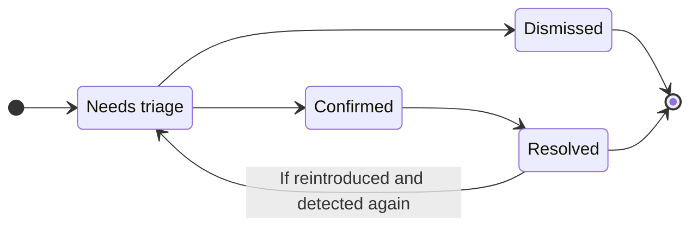



- Édition : GitLab Ultimate
- Offre : GitLab.com, GitLab Self-Managed, GitLab Dedicated





- Page de vulnérabilité repensée [introduite](https://gitlab.com/groups/gitlab-org/-/epics/21907) dans GitLab 19.0 en tant que fonctionnalité en version bêta [bêta](../../../policy/development_stages_support.md#beta) [avec un feature flag](../../../administration/feature_flags/_index.md) nommé `vulnerability_details_enrichment`. Désactivé par défaut.
- [Activée sur GitLab.com, GitLab Self-Managed et GitLab Dedicated](https://gitlab.com/gitlab-org/gitlab/-/work_items/606953) dans GitLab 19.3.



> [!flag]
> La disponibilité de la page de vulnérabilité repensée est contrôlée par un feature flag. Pour plus d'informations, consultez l'historique.

Chaque vulnérabilité dans un projet dispose d'une page de vulnérabilité. L'en-tête de la page affiche le titre de la vulnérabilité, la date et le pipeline lors duquel elle a été détectée, le nombre de merge requests et de tickets associés (le cas échéant), ainsi que les actions disponibles. La barre latérale droite affiche le statut et la gravité de la vulnérabilité. Les autres données de la vulnérabilité sont regroupées dans les sections suivantes :

- **Risque** : les scores et les indicateurs qui vous aident à prioriser la vulnérabilité.
- **Remédiation** : la solution rapportée par le scanner, lorsqu'elle est disponible.
- **Détails** : la description de la vulnérabilité, le scanner qui l'a signalée, et l'emplacement dans votre code, votre image de conteneur ou vos dépendances.
- **Informations complémentaires** : les identifiants tels que CVE et CWE, les liens vers des références externes, et la formation en sécurité.
- **Preuve** : la requête et la réponse enregistrées par le scanner, pour les scanners qui les rapportent.
- **Requêtes de fusion associées** et **Tickets associés** : les merge requests et les tickets liés à la vulnérabilité.
- **Activité** : un journal des changements de statut, des commentaires et des événements de détection.

Chaque section est réductible. Pour masquer ou afficher le contenu d'une section, dans l'en-tête de section, sélectionnez **Réduire** () ou **Étendre** ().

Pour les vulnérabilités figurant dans le catalogue [Common Vulnerabilities and Exposures (CVE)](https://www.cve.org/), la section **Risque** inclut également :

- Score CVSS
- [Score EPSS](risk_assessment_data.md#epss)
- [Statut KEV](risk_assessment_data.md#kev)
- [Statut d'accessibilité](../dependency_scanning/static_reachability.md) (disponibilité limitée)

Pour en savoir plus sur ces données supplémentaires, consultez la page [Données d'évaluation des risques liés aux vulnérabilités](risk_assessment_data.md).

Si le scanner a déterminé que la vulnérabilité est un faux positif, une alerte s'affiche au-dessus de la section **Risque**. Si GitLab Duo a identifié la vulnérabilité comme un possible faux positif, la section **Risque** affiche à la place un score de **Niveau de confiance des faux positifs**. Pour plus d'informations, consultez [la détection des faux positifs](false_positive_detection.md).

GitLab Duo peut analyser automatiquement les vulnérabilités détectées par SAST et générer une merge request contenant des correctifs de code qui tiennent compte du contexte. Pour en savoir plus, voir [Agentic SAST vulnerability resolution](agentic_vulnerability_resolution.md).

## Secret false positive detection {#secret-false-positive-detection}



- Édition : GitLab Ultimate
- Module complémentaire : GitLab Duo Core, GitLab Duo Pro ou GitLab Duo Enterprise
- Offre : GitLab.com, GitLab Self-Managed, GitLab Dedicated
- Statut : version bêta





- Introduction de Secret false positive detection dans l'[epic 17885](https://gitlab.com/groups/gitlab-org/-/work_items/20152), dans GitLab 18.10, en [version bêta](../../../policy/development_stages_support.md#beta), avec le [feature flag](../../../administration/feature_flags/_index.md) `duo_secret_detection_false_positive`. [Activation sur GitLab.com, GitLab Self-Managed et GitLab Dedicated](https://gitlab.com/gitlab-org/gitlab/-/merge_requests/227074).



GitLab Duo analyse automatiquement les résultats de la détection des secrets pour y identifier d'éventuels faux positifs. Le rejet des faux positifs réduit le bruit dans le rapport de vulnérabilités en signalant les résultats qui ne présentent probablement pas de risque réel pour la sécurité.

GitLab Duo fournit les éléments suivants pour chaque vulnérabilité analysée :

- Un score de confiance qui indique dans quelle mesure l'évaluation est susceptible d'être exacte.
- Une explication des raisons pour lesquelles le résultat peut être exact ou non.
- Des indicateurs visuels du rapport de vulnérabilités qui signalent qu'une vulnérabilité a été identifiée comme faux positif potentiel.

Pour en savoir plus, voir [Secret false positive detection](secret_false_positive_detection.md).

## Vulnerability Resolution {#vulnerability-resolution}



- Édition : GitLab Ultimate
- Module complémentaire : GitLab Duo Enterprise, GitLab Duo with Amazon Q
- Offre : GitLab.com, GitLab Self-Managed, GitLab Dedicated





- [LLM par défaut](../../gitlab_duo/model_selection.md#default-models)
- LLM pour Amazon Q : Amazon Q Developer
- Disponible sur [GitLab Duo avec des modèles auto-hébergés](../../../administration/gitlab_duo_self_hosted/_index.md)





- [Introduction](https://gitlab.com/groups/gitlab-org/-/work_items/10779) dans GitLab 16.7 en tant que [version expérimentale](../../../policy/development_stages_support.md#experiment) sur GitLab.com.
- Passage en version bêta dans GitLab 17.3.
- À partir de GitLab 17.6 et versions ultérieures, le module d'extension GitLab Duo est devenu obligatoire.



Utilisez GitLab Duo Vulnerability resolution pour créer automatiquement une merge request qui résout la vulnérabilité. Par défaut, cette fonctionnalité s'appuie sur le modèle [`claude-3.5-sonnet`](https://console.cloud.google.com/vertex-ai/publishers/anthropic/model-garden/claude-3-5-sonnet) d'Anthropic.

GitLab ne peut pas garantir que le grand modèle de langage produise des résultats exacts. Vous devez toujours examiner la modification proposée avant de l'intégrer. Pendant cet examen, vérifiez que :

- le fonctionnement existant de votre application est préservé ;
- la vulnérabilité est résolue conformément aux normes de votre organisation.

<i class="fa-youtube-play" aria-hidden="true"></i> [Visionner une présentation](https://www.youtube.com/watch?v=VJmsw_C125E&list=PLFGfElNsQthZGazU1ZdfDpegu0HflunXW)

Prérequis :

- Vous devez disposer de l'abonnement GitLab Ultimate et de GitLab Duo Enterprise.
- Vous devez être membre du projet.
- La vulnérabilité doit être un résultat SAST provenant d'un analyseur pris en charge :
  - Tout [analyseur pris en charge par GitLab](../sast/analyzers.md).
  - Un scanner SAST tiers correctement intégré qui indique, pour chaque vulnérabilité, son emplacement et son identifiant CWE.
- La vulnérabilité doit relever d'un [type pris en charge](#supported-vulnerabilities-for-vulnerability-resolution).

En savoir plus sur [l'activation de toutes les fonctionnalités GitLab Duo](../../gitlab_duo/turn_on_off.md).

Pour résoudre la vulnérabilité :

1. Dans la barre supérieure, sélectionnez **Rechercher ou accéder à** et repérez votre projet.
1. Dans la barre latérale gauche, sélectionnez **Sécurisation** > **Rapport de vulnérabilités**.
1. Facultatif. Pour supprimer les filtres par défaut, sélectionnez **Effacer** ().
1. Sélectionnez la barre de filtres située au-dessus de la liste des vulnérabilités.
1. Dans la liste déroulante qui s'affiche, sélectionnez **Activité**, puis, dans la catégorie **GitLab Duo (IA)**, sélectionnez **Résolution de vulnérabilités disponible**.
1. Cliquez en dehors du champ de filtre. Les totaux de vulnérabilités par niveau de gravité et la liste des vulnérabilités correspondantes sont mis à jour.
1. Sélectionnez la vulnérabilité SAST à résoudre.
   - Une icône bleue s'affiche à côté des vulnérabilités compatibles avec Vulnerability Resolution.
1. Dans le coin supérieur droit, sélectionnez **Résoudre grâce à l'IA**. Si ce bouton n'est pas affiché, sélectionnez **Actions IA**, puis sélectionnez **Résoudre grâce à l'IA**. Si ce projet est un projet public, sachez que la création d'une merge request exposera publiquement la vulnérabilité et la résolution proposée. Pour créer la merge request en privé, [créez un fork privé](../../project/merge_requests/confidential.md), puis répétez la procédure.
1. Ajoutez un commit supplémentaire à la merge request. Cela déclenche l'exécution d'un nouveau pipeline.
1. Une fois le pipeline terminé, confirmez dans l'[onglet de sécurité du pipeline](../detect/security_scanning_results.md) que la vulnérabilité n'apparaît plus.
1. Dans le rapport de vulnérabilités, [mettez à jour manuellement la vulnérabilité](../vulnerability_report/_index.md#change-status-of-vulnerabilities).

Une merge request contenant les suggestions de remédiation générées par l'IA s'ouvre. Examinez les modifications suggérées, puis traitez la merge request selon votre workflow standard.

Donnez votre avis sur cette fonctionnalité dans le [ticket 476553](https://gitlab.com/gitlab-org/gitlab/-/issues/476553).

### Vulnérabilités prises en charge par Vulnerability Resolution {#supported-vulnerabilities-for-vulnerability-resolution}

Pour assurer la qualité des résolutions suggérées, Vulnerability Resolution n'est disponible que pour un ensemble défini de vulnérabilités. Le système s'appuie sur l'identifiant Common Weakness Enumeration (CWE) de la vulnérabilité pour déterminer si Vulnerability Resolution doit être proposée.

Les vulnérabilités actuellement prises en charge ont été sélectionnées à partir de tests menés par des systèmes automatisés et des experts en sécurité. GitLab travaille à étendre cette prise en charge à davantage de types de vulnérabilités.

<details><summary style="color:#5943b6; margin-top: 1em;"><a>Consulter la liste complète des CWE pris en charge par Vulnerability Resolution</a></summary>

<ul>
  <li>CWE-23 : Relative Path Traversal</li>
  <li>CWE-73 : External Control of File Name or Path</li>
  <li>CWE-78 : Improper Neutralization of Special Elements used in an OS Command ('OS Command Injection')</li>
  <li>CWE-80 : Improper Neutralization of Script-Related HTML Tags in a Web Page (Basic XSS)</li>
  <li>CWE-89 : Improper Neutralization of Special Elements used in an SQL Command ('SQL Injection')</li>
  <li>CWE-116 : Improper Encoding or Escaping of Output</li>
  <li>CWE-118 : Incorrect Access of Indexable Resource ('Range Error')</li>
  <li>CWE-119 : Improper Restriction of Operations within the Bounds of a Memory Buffer</li>
  <li>CWE-120 : Buffer Copy without Checking Size of Input ('Classic Buffer Overflow')</li>
  <li>CWE-126 : Buffer Over-read</li>
  <li>CWE-190 : Integer Overflow or Wraparound</li>
  <li>CWE-200 : Exposure of Sensitive Information to an Unauthorized Actor</li>
  <li>CWE-208 : Observable Timing Discrepancy</li>
  <li>CWE-209 : Generation of Error Message Containing Sensitive Information</li>
  <li>CWE-272 : Least Privilege Violation</li>
  <li>CWE-287 : Improper Authentication</li>
  <li>CWE-295 : Improper Certificate Validation</li>
  <li>CWE-297 : Improper Validation of Certificate with Host Mismatch</li>
  <li>CWE-305 : Authentication Bypass by Primary Weakness</li>
  <li>CWE-310 : Cryptographic Issues</li>
  <li>CWE-311 : Missing Encryption of Sensitive Data</li>
  <li>CWE-323 : Reusing a Nonce, Key Pair in Encryption</li>
  <li>CWE-327 : Use of a Broken or Risky Cryptographic Algorithm</li>
  <li>CWE-328 : Use of Weak Hash</li>
  <li>CWE-330 : Use of Insufficiently Random Values</li>
  <li>CWE-338 : Use of Cryptographically Weak Pseudo-Random Number Generator (PRNG)</li>
  <li>CWE-345 : Insufficient Verification of Data Authenticity</li>
  <li>CWE-346 : Origin Validation Error</li>
  <li>CWE-352 : Cross-Site Request Forgery</li>
  <li>CWE-362 : Concurrent Execution using Shared Resource with Improper Synchronization ('Race Condition')</li>
  <li>CWE-369 : Divide By Zero</li>
  <li>CWE-377 : Insecure Temporary File</li>
  <li>CWE-378 : Creation of Temporary File With Insecure Permissions</li>
  <li>CWE-400 : Uncontrolled Resource Consumption</li>
  <li>CWE-489 : Active Debug Code</li>
  <li>CWE-521 : Weak Password Requirements</li>
  <li>CWE-539 : Use of Persistent Cookies Containing Sensitive Information</li>
  <li>CWE-599 : Missing Validation of OpenSSL Certificate</li>
  <li>CWE-611 : Improper Restriction of XML External Entity Reference</li>
  <li>CWE-676 : Use of potentially dangerous function</li>
  <li>CWE-704 : Incorrect Type Conversion or Cast</li>
  <li>CWE-754 : Improper Check for Unusual or Exceptional Conditions</li>
  <li>CWE-770 : Allocation of Resources Without Limits or Throttling</li>
  <li>CWE-1004 : Sensitive Cookie Without 'HttpOnly' Flag</li>
  <li>CWE-1275 : Sensitive Cookie with Improper SameSite Attribute</li>
</ul>
</details>

### Dépannage {#troubleshooting}

Vulnerability Resolution ne peut pas toujours générer une proposition de correctif. Les causes fréquentes sont notamment les suivantes :

- Faux positif détecté :
  - Avant de proposer un correctif, le modèle d'IA évalue si la vulnérabilité est avérée. Il peut estimer que la vulnérabilité n'est pas avérée ou qu'elle ne justifie pas de correctif.
  - Cela peut se produire si la vulnérabilité se trouve dans du code de test. Votre organisation peut néanmoins choisir de corriger les vulnérabilités situées dans du code de test, mais les modèles les considèrent parfois comme des faux positifs.
  - Si vous êtes d'accord que la vulnérabilité est un faux positif ou ne mérite pas d'être corrigée, vous devriez [ignorer la vulnérabilité](#vulnerability-status-values) et [sélectionner une raison correspondante](#vulnerability-dismissal-reasons).
    - Pour personnaliser votre configuration SAST ou signaler un problème lié à une règle GitLab SAST, consultez [les règles SAST](../sast/rules.md).
- Erreur temporaire ou inattendue :
  - Le message d'erreur peut mentionner `an unexpected error has occurred`, `the upstream AI provider request timed out`, `something went wrong` ou une cause similaire.
  - Des problèmes temporaires affectant le fournisseur d'IA ou GitLab Duo peuvent provoquer ces erreurs.
  - Une nouvelle demande peut aboutir. Vous pouvez donc essayer une nouvelle fois de résoudre la vulnérabilité.
  - Si ces erreurs persistent, contactez GitLab pour obtenir de l'aide.

### Données partagées avec des API d'IA tierces dans le cadre de Vulnerability Resolution {#data-shared-with-third-party-ai-apis-for-vulnerability-resolution}

Les données suivantes sont partagées avec des API d'IA tierces :

- Nom de la vulnérabilité
- Description de la vulnérabilité
- Identifiants (CWE, OWASP)
- Fichier complet contenant les lignes de code vulnérables
- Lignes de code vulnérables (numéros de ligne)

## Vulnerability Resolution dans une merge request {#vulnerability-resolution-in-a-merge-request}



- Édition : GitLab Ultimate
- Module complémentaire : GitLab Duo Enterprise
- Offre : GitLab.com, GitLab Self-Managed, GitLab Dedicated





- [Introduction](https://gitlab.com/groups/gitlab-org/-/work_items/14862) dans GitLab 17.6.
- [Activation par défaut](https://gitlab.com/gitlab-org/gitlab/-/merge_requests/175150) dans GitLab 17.7.
- [Passage en disponibilité générale](https://gitlab.com/gitlab-org/gitlab/-/merge_requests/185452) dans GitLab 17.11. Suppression du feature flag `resolve_vulnerability_in_mr`.



Utilisez GitLab Duo Vulnerability Resolution dans une merge request pour créer automatiquement un commentaire contenant une suggestion qui résout le résultat de vulnérabilité. Par défaut, cette fonctionnalité s'appuie sur le modèle [`claude-3.5-sonnet`](https://console.cloud.google.com/vertex-ai/publishers/anthropic/model-garden/claude-3-5-sonnet) d'Anthropic.

Pour résoudre ce résultat de vulnérabilité :

1. Dans la barre supérieure, sélectionnez **Rechercher ou accéder à** et repérez votre projet.
1. Dans la barre latérale gauche, sélectionnez **Code** > **Requêtes de fusion**.
1. Sélectionnez une merge request.
   - Les résultats de vulnérabilité pris en charge par Vulnerability Resolution sont signalés par l'icône IA tanuki ().
1. Sélectionnez les résultats pris en charge pour ouvrir la boîte de dialogue du résultat de sécurité.
1. Dans le coin inférieur droit, sélectionnez **Résoudre grâce à l'IA**.

Un commentaire contenant les suggestions de remédiation générées par l'IA s'ouvre dans la merge request. Examinez les modifications suggérées, puis appliquez la suggestion dans la merge request selon votre workflow standard.

Donnez votre avis sur cette fonctionnalité dans le [ticket 476553](https://gitlab.com/gitlab-org/gitlab/-/issues/476553).

### Dépannage {#troubleshooting-1}

Dans une merge request, Vulnerability Resolution ne peut pas toujours générer une proposition de correctif. Les causes fréquentes sont notamment les suivantes :

- Faux positif détecté :
  - Avant de proposer un correctif, le modèle d'IA évalue si la vulnérabilité est avérée. Il peut estimer que la vulnérabilité n'est pas avérée ou qu'elle ne justifie pas de correctif.
  - Cela peut se produire si la vulnérabilité se trouve dans du code de test. Votre organisation peut néanmoins choisir de corriger les vulnérabilités situées dans du code de test, mais les modèles les considèrent parfois comme des faux positifs.
  - Si vous êtes d'accord que la vulnérabilité est un faux positif ou ne mérite pas d'être corrigée, vous devriez [ignorer la vulnérabilité](#vulnerability-status-values) et [sélectionner une raison correspondante](#vulnerability-dismissal-reasons).
    - Pour personnaliser votre configuration SAST ou signaler un problème lié à une règle GitLab SAST, consultez [les règles SAST](../sast/rules.md).
- Erreur temporaire ou inattendue :
  - Le message d'erreur peut mentionner `an unexpected error has occurred`, `the upstream AI provider request timed out`, `something went wrong` ou une cause similaire.
  - Des problèmes temporaires affectant le fournisseur d'IA ou GitLab Duo peuvent provoquer ces erreurs.
  - Une nouvelle demande peut aboutir. Vous pouvez donc essayer une nouvelle fois de résoudre la vulnérabilité.
  - Si ces erreurs persistent, contactez GitLab pour obtenir de l'aide.
- Erreur `Resolution target could not be found in the merge request, unable to create suggestion` :
  - Cette erreur peut se produire si aucun pipeline complet d'analyse de sécurité n'a été exécuté sur la branche cible. Consultez la [documentation sur les merge requests](../detect/security_scanning_results.md).

## Flow de code d'une vulnérabilité {#vulnerability-code-flow}



- Édition : GitLab Ultimate
- Offre : GitLab.com, GitLab Self-Managed, GitLab Dedicated



GitLab Advanced SAST fournit des informations sur le [flow de code](../sast/gitlab_advanced_sast.md#code-flow) pour certains types de vulnérabilités. Le flow de code d'une vulnérabilité correspond au chemin suivi par les données depuis l'entrée utilisateur (source) jusqu'à la ligne de code vulnérable (sink), en passant par toutes les affectations, manipulations et opérations d'assainissement.

Pour plus de détails sur l'affichage du flow de code d'une vulnérabilité, consultez [Flow de code d'une vulnérabilité](../sast/gitlab_advanced_sast.md#code-flow).


## Statuts d'une vulnérabilité {#vulnerability-status-values}

Le statut d'une vulnérabilité peut prendre les valeurs suivantes :

- **Nécessite une priorisation** : statut attribué par défaut aux vulnérabilités nouvellement découvertes.
- **Confirmé** : un utilisateur a pris connaissance de cette vulnérabilité et en a confirmé l'exactitude.
- **Rejeté** : un utilisateur a évalué cette vulnérabilité et [l'a rejetée](#vulnerability-dismissal-reasons). Les vulnérabilités rejetées sont ignorées lors des analyses ultérieures, même si elles sont de nouveau détectées.
- **Résolu** : la vulnérabilité a été corrigée ou n'est plus présente. Si une vulnérabilité résolue est réintroduite puis détectée de nouveau, son enregistrement est rétabli et son statut passe à **Nécessite une priorisation**.

Une vulnérabilité suit généralement le cycle de vie suivant :



## La vulnérabilité n'est plus détectée {#vulnerability-is-no-longer-detected}



- Dans GitLab 17.9, [introduction](https://gitlab.com/gitlab-org/gitlab/-/issues/372799) d'un lien vers le commit qui a résolu la vulnérabilité et [passage en disponibilité générale sur GitLab Self-Managed et GitLab Dedicated](https://gitlab.com/gitlab-org/gitlab/-/merge_requests/178748). Suppression du feature flag `vulnerability_representation_information`.



Une vulnérabilité peut ne plus être détectée à la suite de modifications apportées volontairement pour y remédier ou sous l'effet indirect d'autres modifications. À l'exécution d'une analyse de sécurité, si une vulnérabilité n'est plus détectée dans la branche par défaut, le scanner ajoute **N'est plus détectée** au journal d'activité de l'enregistrement, mais le statut de l'enregistrement ne change pas. À la place, vous devez vérifier et confirmer que la vulnérabilité a été résolue et, le cas échéant, [modifier manuellement son statut en **Résolue**](#change-the-status-of-a-vulnerability). Vous pouvez également utiliser une [politique de gestion des vulnérabilités](../policies/vulnerability_management_policy.md) pour faire automatiquement passer au statut **Résolu** les vulnérabilités qui correspondent à des critères précis.

Vous pouvez trouver un lien vers le commit qui a résolu la vulnérabilité dans la section **Activité** de la page de vulnérabilité.

## Motifs de rejet d'une vulnérabilité {#vulnerability-dismissal-reasons}

Lorsque vous rejetez une vulnérabilité, vous devez choisir l'un des motifs suivants :

- **Risque acceptable** : la vulnérabilité est connue et n'a fait l'objet ni d'une remédiation ni d'une mesure d'atténuation, mais elle est considérée comme un risque métier acceptable.
- **Faux positif** : erreur de signalement dans laquelle un résultat de test indique à tort la présence d'une vulnérabilité dans un système alors que cette vulnérabilité est absente.
- **Contrôle d'atténuation** : le risque lié à la vulnérabilité est atténué par un contrôle de gestion, opérationnel ou technique, c'est-à-dire une mesure de protection ou une contre-mesure mise en œuvre par une organisation pour offrir à un système d'information une protection équivalente ou comparable.
- **Utilisation dans les tests** : le résultat n'est pas une vulnérabilité, car il fait partie d'un test ou il s'agit de données de test.
- **Non applicable** : la vulnérabilité est connue et n'a fait l'objet ni d'une remédiation ni d'une mesure d'atténuation, mais elle est considérée comme présente dans une partie de l'application qui ne sera pas mise à jour.

## Modifier le statut d'une vulnérabilité {#change-the-status-of-a-vulnerability}



- L'autorisation qui permettait aux utilisateurs ayant le rôle `Developer` de modifier le statut d'une vulnérabilité (`admin_vulnerability`) a fait l'objet d'une [dépréciation](https://gitlab.com/gitlab-org/gitlab/-/issues/424133) dans GitLab 16.4, puis d'une [suppression](https://gitlab.com/gitlab-org/gitlab/-/issues/412693) dans GitLab 17.0.
- [Ajout](https://gitlab.com/gitlab-org/gitlab/-/issues/451480) de la zone de texte **Commentaire** dans GitLab 17.9.



Prérequis :

- Vous devez disposer du rôle Responsable sécurité, Maintainer ou Owner pour le projet, ou d'un rôle personnalisé avec la permission `admin_vulnerability`.

Pour modifier le statut d'une vulnérabilité depuis la page de cette vulnérabilité :

1. Dans la barre supérieure, sélectionnez **Rechercher ou accéder à** et repérez votre projet.
1. Dans la barre latérale gauche, sélectionnez **Sécurisation** > **Rapport de vulnérabilités**.
1. Sélectionnez la description de la vulnérabilité.
1. Dans la barre latérale droite, dans la section **Statut**, sélectionnez **Modifier**.
1. Dans la liste déroulante **Statut**, sélectionnez un statut ou un [motif de rejet](#vulnerability-dismissal-reasons) si vous souhaitez faire passer la vulnérabilité au statut **Rejeté**.
1. Dans la zone de texte **Commentaire**, ajoutez un commentaire qui précise les motifs du rejet. Lorsque vous appliquez le statut **Rejeté**, un commentaire est obligatoire.
1. Sélectionnez **Modifier le statut**.

Les détails du changement de statut, notamment qui a effectué la modification et à quel moment, sont enregistrés dans la section **Activité** de la page de vulnérabilité.

## Créer un ticket GitLab pour une vulnérabilité {#create-a-gitlab-issue-for-a-vulnerability}

Vous pouvez créer un ticket GitLab pour suivre toute action menée afin de résoudre ou d'atténuer une vulnérabilité. Pour créer un ticket GitLab pour une vulnérabilité :

1. Dans la barre supérieure, sélectionnez **Rechercher ou accéder à** et repérez votre projet.
1. Dans la barre latérale gauche, sélectionnez **Sécurisation** > **Rapport de vulnérabilités**.
1. Sélectionnez la description de la vulnérabilité.
1. Sélectionnez **Créer un ticket**.

Le ticket est créé dans le projet GitLab à partir des informations du rapport de vulnérabilités.

Pour créer un ticket Jira, consultez la section [Créer un ticket Jira pour une vulnérabilité](../../../integration/jira/configure.md#create-a-jira-issue-for-a-vulnerability).

## Lier une vulnérabilité à des tickets GitLab et Jira {#linking-a-vulnerability-to-gitlab-and-jira-issues}

Vous pouvez lier une vulnérabilité à un ou plusieurs tickets [GitLab](#create-a-gitlab-issue-for-a-vulnerability) ou [Jira](../../../integration/jira/configure.md#create-a-jira-issue-for-a-vulnerability) existants. Une seule fonctionnalité d'association est disponible à la fois. L'ajout d'un lien permet de suivre le ticket qui résout ou atténue une vulnérabilité.

### Lier une vulnérabilité à des tickets GitLab existants {#link-a-vulnerability-to-existing-gitlab-issues}

Prérequis :

- L'[intégration des tickets Jira](../../../integration/jira/configure.md) ne doit pas être activée.

Pour lier une vulnérabilité à des tickets GitLab existants :

1. Dans la barre supérieure, sélectionnez **Rechercher ou accéder à** et repérez votre projet.
1. Dans la barre latérale gauche, sélectionnez **Sécurisation** > **Rapport de vulnérabilités**.
1. Sélectionnez la description de la vulnérabilité.
1. Dans la section **Tickets associés**, sélectionnez **Ajouter un ticket existant**.
1. Pour chaque ticket à lier, effectuez l'une des actions suivantes :
   - Coller un lien vers le ticket.
   - Saisir l'identifiant du ticket (précédé d'un dièse `#`).
1. Sélectionnez **Ajouter**.

Les tickets GitLab sélectionnés sont ajoutés à la section **Tickets associés**, et le compteur de tickets liés est mis à jour.

Les tickets GitLab liés à une vulnérabilité s'affichent dans le rapport de vulnérabilités et sur la page de la vulnérabilité.

Tenez compte des conditions suivantes pour l'association entre une vulnérabilité et un ticket GitLab lié :

- La page de la vulnérabilité affiche les tickets associés, mais la page du ticket n'affiche pas la vulnérabilité associée à ce ticket.
- Un ticket ne peut être lié qu'à une seule vulnérabilité à la fois.
- Les tickets peuvent être liés entre des groupes et des projets.

### Lier une vulnérabilité à des tickets Jira existants {#link-a-vulnerability-to-existing-jira-issues}

Prérequis :

- Assurez-vous que l'intégration des tickets Jira est [configurée](../../../integration/jira/configure.md#configure-the-integration) et que la case **Créer des tickets Jira pour les vulnérabilités** est cochée.

Pour lier une vulnérabilité à des tickets Jira existants, ajoutez la ligne suivante à la description du ticket Jira :

```plaintext
/-/security/vulnerabilities/<id>
```

`<id>` représente un [identifiant de vulnérabilité](../../../api/vulnerabilities.md#retrieve-a-vulnerability). Vous pouvez ajouter plusieurs lignes avec des identifiants différents dans une même description.

Les tickets Jira avec une description appropriée sont ajoutés à la section **Tickets Jira associés**, et le compteur de tickets liés est mis à jour.

Les tickets Jira liés à une vulnérabilité ne s'affichent que sur la page de cette vulnérabilité.

Tenez compte des conditions suivantes concernant l'association entre une vulnérabilité et un ticket Jira lié :

- La page de la vulnérabilité et la page du ticket affichent toutes deux la vulnérabilité associée.
- Un ticket peut être lié simultanément à une ou plusieurs vulnérabilités.

## Résoudre une vulnérabilité {#resolve-a-vulnerability}

Pour certaines vulnérabilités, une solution est déjà connue mais doit être implémentée manuellement. La section **Remédiation** de la page de vulnérabilité affiche une solution fournie par l'outil d'analyse de sécurité qui a signalé la découverte, ou saisie lors de la [création manuelle d'une vulnérabilité](../vulnerability_report/_index.md#manually-add-a-vulnerability). Les outils GitLab utilisent les informations de la [base de données des avis GitLab](../gitlab_advisory_database/_index.md).

Certains outils peuvent également inclure un correctif logiciel pour appliquer la solution suggérée. Dans ces cas, la liste déroulante **Autres actions** sur la page d'une vulnérabilité inclut une action **Résoudre grâce à la suggestion du scanner**.

Les scanners suivants sont pris en charge par cette fonctionnalité :

- [Analyse des dépendances](../dependency_scanning/_index.md). La création automatique de correctifs n'est disponible que pour les projets Node.js gérés avec `yarn`. La création automatique de correctifs n'est prise en charge que lorsque le [mode FIPS](../../../development/fips_gitlab.md#enable-fips-mode) est désactivé.

- [Analyse des conteneurs](../container_scanning/_index.md).

Pour résoudre une vulnérabilité, vous pouvez utiliser l'une des méthodes suivantes :

- [Résoudre une vulnérabilité avec une merge request](#resolve-a-vulnerability-with-a-merge-request).
- [Résoudre une vulnérabilité manuellement](#resolve-a-vulnerability-manually).

### Résoudre une vulnérabilité avec une merge request {#resolve-a-vulnerability-with-a-merge-request}

Pour résoudre la vulnérabilité avec une merge request :

1. Dans la barre supérieure, sélectionnez **Rechercher ou accéder à** et repérez votre projet.
1. Dans la barre latérale gauche, sélectionnez **Sécurisation** > **Rapport de vulnérabilités**.
1. Sélectionnez la description de la vulnérabilité.
1. Dans le coin supérieur droit, sélectionnez **Autres actions**, puis sélectionnez **Résoudre grâce à la suggestion du scanner**.

Une merge request est créée pour appliquer le correctif nécessaire à la résolution de la vulnérabilité. Traitez la merge request selon votre workflow standard.

### Résoudre une vulnérabilité manuellement {#resolve-a-vulnerability-manually}

Pour appliquer manuellement le correctif généré par GitLab pour une vulnérabilité :

1. Dans la barre supérieure, sélectionnez **Rechercher ou accéder à** et repérez votre projet.
1. Dans la barre latérale gauche, sélectionnez **Sécurisation** > **Rapport de vulnérabilités**.
1. Sélectionnez la description de la vulnérabilité.
1. Dans le coin supérieur droit, sélectionnez **Autres actions**, puis sélectionnez **Télécharger le correctif**.
1. Assurez-vous que votre projet local est positionné sur le commit utilisé pour générer le correctif.
1. Exécutez `git apply remediation.patch`.
1. Vérifiez les modifications, puis commitez-les dans votre branche.
1. Créez une merge request pour appliquer les modifications à votre branche principale.
1. Traitez la merge request selon votre workflow standard.

## Activer la formation à la sécurité pour les vulnérabilités {#enable-security-training-for-vulnerabilities}

> [!note]
> La formation à la sécurité n'est pas accessible dans un environnement hors ligne, c'est-à-dire lorsque les ordinateurs sont isolés de l'Internet public par mesure de sécurité. Plus précisément, le serveur GitLab doit pouvoir interroger les points de terminaison d'API de chaque fournisseur de formation que vous choisissez d'activer. Certains fournisseurs de formation tiers peuvent vous demander de créer un compte gratuit. Créez un compte auprès de l'un des fournisseurs suivants : [Secure Code Warrior](https://www.securecodewarrior.com/), [Kontra](https://application.security/) ou [SecureFlag](https://www.secureflag.com/index.html). GitLab n'envoie aucune information sur les utilisateurs à ces fournisseurs tiers ; en revanche, GitLab leur transmet l'identifiant CWE ou OWASP ainsi que le nom du langage associé à l'extension de fichier.

La formation à la sécurité aide vos développeurs à apprendre à corriger les vulnérabilités. Les développeurs peuvent consulter des formations à la sécurité adaptées à la vulnérabilité détectée et proposées par des fournisseurs de formation sélectionnés.

Pour activer la formation à la sécurité pour les vulnérabilités de votre projet :

1. Dans la barre supérieure, sélectionnez **Rechercher ou accéder à** et repérez votre projet.
1. Dans la barre latérale gauche, sélectionnez **Sécurisation** > **Configuration de la sécurité**.
1. Dans la barre d'onglets, sélectionnez **Gestion des vulnérabilités**.
1. Pour activer un fournisseur de formation à la sécurité, activez la bascule correspondante.

Chaque intégration soumet l'identifiant de vulnérabilité, par exemple CWE ou OWASP, ainsi que le langage au fournisseur de formation à la sécurité. Le lien ainsi généré vers la formation du fournisseur apparaît dans une vulnérabilité GitLab.

## Afficher la formation à la sécurité pour une vulnérabilité {#view-security-training-for-a-vulnerability}

Si la formation à la sécurité est activée, la page d'une vulnérabilité peut afficher un lien vers une formation adaptée à la vulnérabilité détectée. La formation n'est disponible que si le fournisseur de formation activé propose du contenu adapté à la vulnérabilité concernée. Le contenu de formation est demandé en fonction des identifiants de vulnérabilité. L'identifiant attribué à une vulnérabilité varie d'une vulnérabilité à l'autre, et le contenu de formation disponible varie selon les fournisseurs. Pour certaines vulnérabilités, aucun contenu de formation ne s'affiche. Les vulnérabilités associées à un identifiant CWE sont les plus susceptibles d'obtenir un résultat de formation.

Pour afficher la formation à la sécurité associée à une vulnérabilité :

1. Dans la barre supérieure, sélectionnez **Rechercher ou accéder à** et repérez votre projet.
1. Dans la barre latérale gauche, sélectionnez **Sécurisation** > **Rapport de vulnérabilités**.
1. Sélectionnez la vulnérabilité dont vous voulez afficher la formation à la sécurité.
1. Dans la section **Informations complémentaires**, sous **Formation**, sélectionnez **Voir la formation**.

## Afficher l'emplacement d'une vulnérabilité dans les dépendances transitives {#view-the-location-of-a-vulnerability-in-transitive-dependencies}



- Option Afficher les chemins de dépendance [introduite](https://gitlab.com/gitlab-org/gitlab/-/issues/519965) dans GitLab 17.11 [avec un feature flag](../../../administration/feature_flags/_index.md) nommé `dependency_paths`. Désactivé par défaut.
- [Passage en disponibilité générale](https://gitlab.com/gitlab-org/gitlab/-/merge_requests/197224) de l'option Afficher les chemins de dépendance dans GitLab 18.2. Le feature flag `dependency_paths` est activé par défaut.



> [!flag]
> Un feature flag contrôle la disponibilité de cette fonctionnalité. Pour plus d'informations, consultez l'historique.

Lors de la gestion des vulnérabilités détectées dans les dépendances, la section **Détails** de la page de vulnérabilité affiche :

- L'emplacement de la dépendance directe dans laquelle la vulnérabilité a été détectée.
- Le numéro précis de la ligne où se situe la vulnérabilité, s'il est disponible.

Si la vulnérabilité se situe dans une ou plusieurs dépendances transitives, connaître uniquement la dépendance directe peut ne pas suffire. Les dépendances transitives sont des dépendances indirectes qui ont un dépendant direct dans leur ascendance.

S'il existe des dépendances transitives, vous pouvez afficher les chemins de toutes les dépendances, y compris ceux des dépendances transitives qui contiennent la vulnérabilité.

- Sur la page de vulnérabilité, dans la section **Détails**, sélectionnez **Afficher les chemins de dépendance**. Si **Afficher les chemins de dépendance** ne s'affiche pas, aucune dépendance transitive n'est présente.
