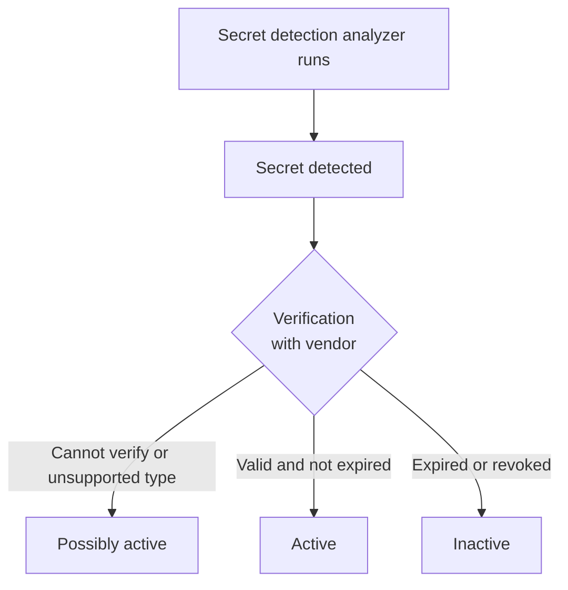



- Édition : GitLab Ultimate
- Offre : GitLab.com, GitLab Self-Managed, GitLab Dedicated





- [Introduction](https://gitlab.com/gitlab-org/gitlab/-/issues/520923) dans GitLab 18.0 [avec le feature flag](../../../api/feature_flags.md) `validity_checks`. Fonctionnalité désactivée par défaut.
- Accès supplémentaire [introduit](https://gitlab.com/gitlab-org/gitlab/-/issues/556765) dans GitLab 18.2 avec un flag nommé `validity_checks_security_finding_status`. Fonctionnalité désactivée par défaut.
- [Activé sur GitLab.com](https://gitlab.com/gitlab-org/gitlab/-/issues/531222) dans GitLab 18.5.
- [Passage](https://gitlab.com/gitlab-org/gitlab/-/merge_requests/206929) de la version expérimentale à la version bêta dans GitLab 18.5.
- [Passage en disponibilité générale](https://gitlab.com/gitlab-org/gitlab/-/merge_requests/213223) dans GitLab 18.7. Le feature flag `validity_checks_security_finding_status` a été supprimé.
- [Passage en disponibilité générale](https://gitlab.com/gitlab-org/gitlab/-/merge_requests/216525) dans GitLab 18.7. Le feature flag `validity_checks` est activé par défaut.
- [Suppression](https://gitlab.com/gitlab-org/gitlab/-/merge_requests/216100) du feature flag `validity_checks` dans GitLab 18.8.



> [!flag]
> La disponibilité de cette fonctionnalité est contrôlée par un feature flag. Pour plus d'informations, consultez l'historique.

Les vérifications de validité GitLab déterminent si un secret, tel qu'un jeton d'accès, est actif. Un secret est actif lorsque :

- Il n'est pas expiré.
- Il peut être utilisé pour l'authentification.

Les secrets actifs pouvant être utilisés pour usurper l'identité d'un utilisateur légitime, ils représentent un risque de sécurité plus élevé que les secrets inactifs. Si plusieurs secrets sont exposés en même temps, savoir lesquels sont actifs constitue une étape importante du triage et de la remédiation.

## Activer les vérifications de validité {#enable-validity-checks}

Prérequis :

- Vous devez disposer d'un projet pour lequel l'analyse de sécurité des pipelines est activée.
- Votre instance doit disposer d'un [accès réseau sortant](#configure-outbound-network-access) aux API de validation partenaires.

Pour activer les vérifications de validité pour un projet :

1. Dans la barre supérieure, sélectionnez **Rechercher ou accéder à**, puis recherchez votre projet.
1. Dans la barre latérale gauche, sélectionnez **Sécurisation** > **Configuration de la sécurité**.
1. Sous **Détection des secrets des pipelines**, activez le bouton bascule **Vérifications de validité**.

GitLab vérifie le statut des secrets détectés lorsque le job CI/CD `secret_detection` est terminé. Pour afficher le statut d'un secret, consultez la page de détails de la vulnérabilité. Pour mettre à jour le statut d'un secret, par exemple après l'avoir révoqué, réexécutez le job CI/CD `secret_detection`.

Pour activer les vérifications de validité au niveau du groupe, en tant que Mainteneur ou avec un rôle supérieur, utilisez une [mutation de l'API GraphQL](../../../api/graphql/reference/_index.md#mutationsetgroupvaliditychecks) :

```graphql
mutation {
  setGroupValidityChecks(input: {
    validityChecksEnabled: true,
    namespacePath: "my-group/my-subgroup",
    projectsToExclude: [100, 105, 108]
  }) {
    clientMutationId
    validityChecksEnabled
  }
}
```

### Couverture {#coverage}



- [Introduction](https://gitlab.com/groups/gitlab-org/-/epics/16890) de la prise en charge des jetons de services externes dans GitLab 18.7 [avec un feature flag](../../../api/feature_flags.md) nommé `secret_detection_partner_token_verification`. Activés par défaut.
- [Disponibilité générale](https://gitlab.com/gitlab-org/gitlab/-/work_items/567736) dans GitLab 18.8. 
- [Extension](https://gitlab.com/gitlab-org/gitlab/-/work_items/612115) des vérifications de validité pour les jetons de services externes dans GitLab 19.3.
- [Suppression](https://gitlab.com/gitlab-org/gitlab/-/work_items/619506) du feature flag `secret_detection_partner_token_verification` dans GitLab 19.4.
- [Extension](https://gitlab.com/gitlab-org/gitlab/-/work_items/624216) des vérifications de validité à davantage de types de jetons GitHub dans GitLab 19.4.
- [Extension](https://gitlab.com/gitlab-org/gitlab/-/work_items/628281) des vérifications de validité à davantage de types de jetons OpenAI dans GitLab 19.5.



Les vérifications de validité prennent en charge les types de secrets suivants :

**Jetons GitLab :**

- Jetons d'accès personnels GitLab
- Jetons d'accès personnels GitLab routables
- Jetons de déploiement GitLab
- Jetons d'authentification GitLab Runner
- Jetons d'authentification GitLab Runner routables
- Jetons d'agent Kubernetes GitLab
- Jetons SCIM OAuth GitLab
- Jetons de job CI/CD GitLab
- Jetons d'e-mail entrant GitLab
- Jetons de flux GitLab (v2)
- Jetons de déclenchement de pipeline GitLab

**Jetons de services externes :**

- Clés API Anthropic
- ID de clés d'accès à long terme AWS IAM (commençant par `AKIA`)
- Clés API Datadog
- Jetons d'installation d'application GitHub
- Jetons d'accès personnels GitHub à granularité fine
- Jetons d'accès OAuth GitHub
- Jetons d'accès personnels GitHub (classiques)
- Clés API Google Cloud
- Clés API Heroku
- Clés API d'administration OpenAI
- Clés API de projet OpenAI
- Clés de compte de service OpenAI
- Clés API utilisateur OpenAI
- Jetons API Postman
- Jetons API SendGrid
- Clés secrètes live Stripe

Les vérifications de validité pour les ID de clés d'accès AWS IAM, les clés API Google Cloud et les jetons API Postman fonctionnent avec tout analyseur de détection des secrets. GitLab valide tous les autres types de jetons de services externes, y compris les types de jetons ajoutés à l'avenir, uniquement lorsque [GitLab Secret Scanning for Source Code](../secret_detection/gitlab_secret_scanner/_index.md) détecte le secret.

### Configurer l'accès réseau sortant {#configure-outbound-network-access}

Les vérifications de validité ne sont pas prises en charge dans les environnements hors ligne. Cette fonctionnalité nécessite un accès réseau sortant aux API de validation partenaires pour vérifier si les jetons détectés sont actifs.

Si votre instance GitLab est derrière un pare-feu mais dispose d'un accès à Internet, ajoutez les URL de l'API de validation de chaque partenaire à la liste d'autorisation. Les URL prises en charge sont :

- `https://api.anthropic.com/v1/models`
- `https://api.datadoghq.com/api/v1/validate`
- `https://api.getpostman.com/me`
- `https://api.github.com/installation/repositories`
- `https://api.github.com/user`
- `https://api.heroku.com/account`
- `https://api.openai.com/v1/models`
- `https://api.openai.com/v1/organization/admin_api_keys`
- `https://api.sendgrid.com/v3/scopes`
- `https://api.stripe.com/v1/balance`
- `https://sts.amazonaws.com/`
- `https://www.googleapis.com/discovery/v1/apis`

Si vous ne pouvez pas autoriser l'accès sortant vers ces points de terminaison, n'activez pas cette fonctionnalité. L'activation des vérifications de validité dans un environnement réseau restreint entraîne des erreurs réseau lors de la validation.

## Workflow de vérification de validité {#validity-check-workflow}

Lorsque l'analyseur de détection des secrets détecte un secret potentiel, GitLab vérifie le statut du secret auprès de son fournisseur et attribue à la détection l'un des statuts suivants :

- Potentiellement actif : GitLab n'a pas pu vérifier le statut du secret, ou le type de secret n'est pas pris en charge par les vérifications de validité.
- Actif : le secret n'est pas expiré et peut être utilisé pour l'authentification.
- Inactif : le secret est expiré ou révoqué et ne peut pas être utilisé pour l'authentification.

Vous devez faire pivoter les secrets actifs et potentiellement actifs dès que possible.



## Actualiser le statut d'un secret {#refresh-secret-status}



- [Introduction](https://gitlab.com/gitlab-org/gitlab/-/issues/537133) dans GitLab 18.2 [avec un feature flag](../../../api/feature_flags.md) nommé `secret_detection_validity_checks_refresh_token`. Fonctionnalité désactivée par défaut.
- [Disponibilité générale](https://gitlab.com/gitlab-org/gitlab/-/work_items/552306) dans GitLab 18.7\. Le feature flag `secret_detection_validity_checks_refresh_token` a été supprimé.



Une fois les vérifications de validité exécutées, le statut d'un jeton n'est pas mis à jour automatiquement, même si le jeton est révoqué ou expire. Pour mettre à jour un jeton, vous pouvez actualiser manuellement le statut :

1. Dans le rapport des vulnérabilités, sélectionnez la vulnérabilité que vous souhaitez actualiser.
1. À côté du statut du jeton, sélectionnez **Réessayer** ().

Les vérifications de validité sont réexécutées et le statut du jeton est mis à jour.

## Dépannage {#troubleshooting}

Lorsque vous utilisez les vérifications de validité, vous pouvez rencontrer les problèmes suivants.

### Statut de jeton inattendu {#unexpected-token-status}

Un jeton a le statut « potentiellement actif » lorsque GitLab ne peut pas vérifier sa validité. Cela peut être dû aux raisons suivantes :

- Le job de validation des secrets ne s'est pas exécuté.
- Le type de secret n'est pas pris en charge par les vérifications de validité.
- Un problème s'est produit lors de la connexion au fournisseur de jetons.

Pour résoudre ce problème, réexécutez le job `secret_detection`. Si le statut persiste après plusieurs tentatives, vous devrez peut-être valider le secret manuellement.

À moins d'être certain que le jeton n'est pas actif, vous devez révoquer et remplacer les secrets potentiellement actifs dès que possible.

### Délais de vérification des jetons de services externes {#external-service-token-verification-delays}

La vérification des jetons de services externes peut prendre plus de temps que la vérification des jetons GitLab en raison des limites de débit imposées par les services externes. Si un jeton de service externe affiche temporairement le statut **potentiellement actif**, cela est normal. La vérification est mise en file d'attente et se termine rapidement. Vérifiez l'horodatage **Date/heure de dernière vérification** pour voir quand le statut a été mis à jour pour la dernière fois, ou actualisez la page après quelques instants.
