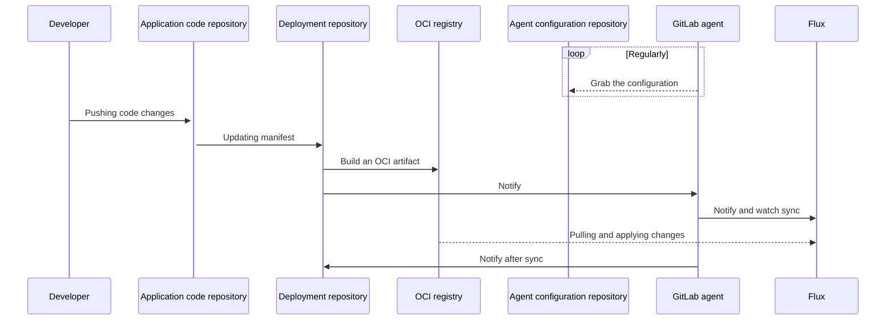



- Édition : Gratuite, GitLab Premium, GitLab Ultimate
- Offre : GitLab.com, GitLab Self-Managed, GitLab Dedicated



GitLab intègre [Flux](https://fluxcd.io/flux/) pour GitOps. Pour démarrer avec Flux, consultez le [tutoriel Flux pour GitOps](getting_started.md).

Avec GitOps, vous pouvez gérer des clusters et des applications conteneurisés depuis un dépôt Git qui :

- Constitue l'unique source de vérité de votre système.
- Constitue l'endroit unique où vous exploitez votre système.

En combinant GitLab, Kubernetes et GitOps, vous pouvez disposer de :

- GitLab en tant qu'opérateur GitOps.
- Kubernetes en tant que système d'automatisation et de convergence.
- GitLab CI/CD pour l'intégration continue.
- L'agent pour le déploiement continu et l'observabilité du cluster.
- Remédiation automatique des dérives intégrée.
- Gestion des ressources avec les [applications server-side](https://kubernetes.io/docs/reference/using-api/server-side-apply/) pour une gestion transparente des champs multi-acteurs.

## Séquence de déploiement {#deployment-sequence}

Ce diagramme illustre les dépôts et les principaux acteurs d'un déploiement GitOps :



Vous devez utiliser Flux et `agentk` pour les déploiements GitOps. Flux maintient l'état du cluster synchronisé avec la source, tandis que `agentk` simplifie la configuration de Flux, assure la gestion des accès entre le cluster et GitLab, et visualise l'état du cluster dans l'interface de GitLab.

### OCI pour le contrôle des sources {#oci-for-source-control}

Vous devez utiliser des images OCI comme contrôleur de source pour Flux, à la place d'un dépôt Git. Le [registre de conteneurs GitLab](../../packages/container_registry/_index.md) prend en charge les images OCI.

| Registre OCI | Dépôt Git |
| ---          | ---              |
| Conçu pour distribuer des images de conteneurs à grande échelle. | Conçu pour versionner et stocker le code source. |
| Immuable, prend en charge les analyses de sécurité. | Mutable. |
| La branche Git par défaut peut stocker l'état du cluster sans déclencher de synchronisation. | La branche Git par défaut déclenche une synchronisation lorsqu'elle est utilisée pour stocker l'état du cluster. |

## Structure du dépôt {#repository-structure}

Pour simplifier la configuration, utilisez un seul dépôt de livraison par équipe. Vous pouvez packager le dépôt de livraison en plusieurs images OCI par application.

Pour des recommandations supplémentaires sur la structure des dépôts, consultez la [documentation Flux](https://fluxcd.io/flux/guides/repository-structure/).

## Réconciliation immédiate du dépôt Git {#immediate-git-repository-reconciliation}

Généralement, le contrôleur de source Flux réconcilie les dépôts Git à des intervalles configurés. Cela peut entraîner des délais entre un `git push` et la réconciliation de l'état du cluster, et génère des pulls inutiles depuis GitLab.

L'agent pour Kubernetes détecte automatiquement les objets Flux `GitRepository` qui référencent des projets GitLab dans l'instance à laquelle l'agent est connecté, et configure un [`Receiver`](https://fluxcd.io/flux/components/notification/receivers/) pour l'instance. Lorsque l'agent pour Kubernetes détecte un `git push` vers un dépôt auquel il a accès, le `Receiver` est déclenché et Flux réconcilie le cluster avec les modifications apportées au dépôt.

Pour utiliser la réconciliation immédiate du dépôt Git, vous devez disposer d'un cluster Kubernetes qui exécute :

- L'agent pour Kubernetes.
- Flux `source-controller` et `notification-controller`.

La réconciliation immédiate du dépôt Git peut réduire le délai entre un push et la réconciliation, mais elle ne garantit pas que chaque événement `git push` est reçu. Vous devez tout de même définir [`GitRepository.spec.interval`](https://fluxcd.io/flux/components/source/gitrepositories/#interval) sur une durée acceptable.

> [!note]
> L'agent a uniquement accès au projet de configuration de l'agent et à tous les projets publics. L'agent n'est pas en mesure de réconcilier immédiatement les projets privés, à l'exception du projet de configuration de l'agent. La possibilité d'autoriser l'agent à accéder aux projets privés est proposée dans le [ticket 389393](https://gitlab.com/gitlab-org/gitlab/-/issues/389393).

### Endpoints de webhook personnalisés {#custom-webhook-endpoints}

Lorsque l'agent pour Kubernetes appelle le webhook `Receiver`, l'agent utilise par défaut `http://webhook-receiver.flux-system.svc.cluster.local`, qui est également l'URL par défaut définie par une installation bootstrap Flux. Pour configurer un endpoint personnalisé, définissez `flux.webhook_receiver_url` sur une URL que l'agent peut résoudre. Par exemple :

```yaml
flux:
  webhook_receiver_url: http://webhook-receiver.another-flux-namespace.svc.cluster.local
```

Une gestion spéciale est appliquée aux [URL de proxy de service](https://kubernetes.io/docs/tasks/access-application-cluster/access-cluster-services/) configurées dans ce format : `/api/v1/namespaces/[^/]+/services/[^/]+/proxy`. Par exemple :

```yaml
flux:
  webhook_receiver_url: /api/v1/namespaces/flux-system/services/http:webhook-receiver:80/proxy
```

Dans ces cas, l'agent pour Kubernetes utilise la configuration et le contexte Kubernetes disponibles pour se connecter à l'endpoint de l'API. Vous pouvez utiliser cette option si vous exécutez un agent en dehors d'un cluster et que vous n'avez pas [configuré d'`Ingress`](https://fluxcd.io/flux/guides/webhook-receivers/#expose-the-webhook-receiver) pour le contrôleur de notification Flux.

> [!warning]
> Vous devez uniquement configurer des URL de proxy de service de confiance. Lorsque vous fournissez une URL de proxy de service, l'agent pour Kubernetes envoie des requêtes API Kubernetes classiques qui incluent les informations d'identification nécessaires à l'authentification auprès du service d'API.

## Gestion des jetons {#token-management}

Pour utiliser certaines fonctionnalités de Flux, vous pourriez avoir besoin de plusieurs jetons d'accès. De plus, vous pouvez utiliser plusieurs types de jetons pour obtenir le même résultat.

Cette section fournit des recommandations concernant les jetons dont vous pourriez avoir besoin, et propose des recommandations sur le type de jeton à utiliser lorsque cela est possible.

### Accès à GitLab par Flux {#gitlab-access-by-flux}

Pour accéder au registre de conteneurs GitLab ou aux dépôts Git, Flux peut utiliser :

- Un jeton de déploiement de projet ou de groupe.
- Une clé de déploiement de projet ou de groupe.
- Un jeton d'accès au projet ou au groupe.
- Un jeton d'accès personnel.

Le jeton n'a pas besoin d'un accès en écriture.

Vous devez utiliser des jetons de déploiement de projet si l'accès `http` est possible. Si vous avez besoin d'un accès `git+ssh`, vous devez utiliser des clés de déploiement. Pour comparer les clés de déploiement et les jetons de déploiement, consultez [Clés de déploiement](../../project/deploy_keys/_index.md).

La prise en charge de l'automatisation de la création, de la rotation et du rapport des jetons de déploiement est proposée dans le [ticket 389393](https://gitlab.com/gitlab-org/gitlab/-/issues/389393).

### Notification de Flux vers GitLab {#flux-to-gitlab-notification}

Si vous configurez Flux pour synchroniser depuis une source Git, [Flux peut enregistrer le statut d'un job externe](https://fluxcd.io/flux/components/notification/providers/#git-commit-status-updates) dans les pipelines GitLab.

Pour obtenir les statuts des jobs externes depuis Flux, vous pouvez utiliser :

- Un jeton de déploiement de projet ou de groupe.
- Un jeton d'accès au projet ou au groupe.
- Un jeton d'accès personnel.

Le jeton nécessite la portée `api`. Pour minimiser la surface d'attaque en cas de fuite d'un jeton, vous devez utiliser un jeton d'accès au projet.

L'intégration de Flux dans les pipelines GitLab en tant que job est proposée dans le [ticket 405007](https://gitlab.com/gitlab-org/gitlab/-/issues/405007).

## Sujets connexes {#related-topics}

- [Exemples GitOps pour la formation et les démonstrations](https://gitlab.com/groups/guided-explorations/gl-k8s-agent/gitops/-/wikis/home)
- [Atelier de formation en auto-apprentissage](https://gitlab-for-eks.awsworkshop.io) (utilise AWS EKS, mais peut être utilisé pour d'autres clusters Kubernetes)
- Gestion des secrets Kubernetes dans un workflow GitOps
  - [avec SOPS intégré à Flux](https://fluxcd.io/flux/guides/mozilla-sops/)
  - [avec Sealed Secrets](https://fluxcd.io/flux/guides/sealed-secrets/)
