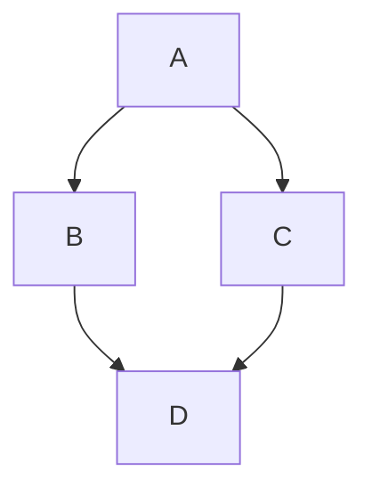



- Édition : Gratuite, GitLab Premium, GitLab Ultimate
- Offre : GitLab.com, GitLab Self-Managed, GitLab Dedicated



GitLab utilise le gem [`gitlab-markup`](https://gitlab.com/gitlab-org/gitlab-markup), qui utilise le gem [`org-ruby`](https://github.com/wallyqs/org-ruby), pour convertir le contenu Org mode en HTML. Pour une référence complète de la syntaxe Org mode, consultez le [manuel Org](https://orgmode.org/manuals.html).

Vous pouvez utiliser Org mode dans les zones suivantes :

- Les documents Org mode (`.org`) dans les dépôts
- Les extraits de code (snippets), lorsque le fichier d'extrait est nommé avec une extension `.org`
- Les pages wiki

## Titres {#headings}

Les astérisques initiaux (`*`) s'affichent comme des titres de niveau 1 à 6.

```org
* Heading 1
** Heading 2
*** Heading 3
**** Heading 4
***** Heading 5
****** Heading 6
```

`#+TITLE:` s'affiche comme le titre H1 en haut de la page :

```org
#+TITLE: Welcome to Org-mode
```

### Ancres de titres {#heading-anchors}

GitLab ajoute automatiquement une ancre à chaque titre Org mode, afin que vous puissiez y créer un lien.

Au survol, un lien vers ces ancres devient visible afin de faciliter la copie du lien vers le titre pour l'utiliser ailleurs.

Les ancres sont générées à partir du contenu du titre selon les règles suivantes :

1. Tout le texte est converti en minuscules.
1. Tous les caractères autres que les lettres, les chiffres, les tirets et les traits de soulignement sont supprimés.
1. Tous les espaces sont convertis en tirets.
1. Si un titre avec la même ancre a déjà été généré, un numéro incrémentiel unique est ajouté, en commençant à 1.

Exemple :

<!--
Translation note: DO NOT TRANSLATE this example.
The example must stay untranslated to stay in sync with the example anchors.
-->

```org
* This heading has spaces in it
** This heading has an accent in it: Café
** This heading has Unicode in it: 日本語
** This heading has spaces in it
*** This heading has spaces in it
** This heading has 3.5 in it (& parentheses)
** This heading has  multiple spaces and - hyphens_and_underscores
```

Générerait les ancres de titres suivantes :

1. `#this-heading-has-spaces-in-it`
1. `#this-heading-has-an-accent-in-it-café`
1. `#this-heading-has-unicode-in-it-日本語`
1. `#this-heading-has-spaces-in-it-1`
1. `#this-heading-has-spaces-in-it-2`
1. `#this-heading-has-35-in-it--parentheses`
1. `#this-heading-has--multiple-spaces-and---hyphens_and_underscores`

Dans un snippet, les titres reçoivent également un préfixe dérivé du nom de fichier, afin d'éviter les collisions d'ancres entre plusieurs fichiers. Par exemple, un titre `* TL;DR` dans un fichier nommé `README.org` obtient l'ancre `#readme-tldr` au lieu de `#tldr`.

## Listes {#lists}

Org mode prend en charge les listes non ordonnées, les listes ordonnées, les listes de définitions et les listes imbriquées.

### Listes non ordonnées {#unordered-lists}

Un tiret (`-`) ou un signe plus (`+`) crée une liste non ordonnée :

```org
- Item one
- Item two
  - Nested item
```

```org
+ Item one
+ Item two
  + Nested item
```

Une fois rendus, les deux exemples ressemblent à :

> - Élément un
> - Élément deux
>   - Élément imbriqué

### Listes ordonnées {#ordered-lists}

Un nombre suivi d'un point (`.`) ou d'une parenthèse fermante (`)`) crée une liste ordonnée :

```org
1. First item
2. Second item
   1. Nested item
```

```org
1) First item
2) Second item
   1) Nested item
```

Une fois rendus, les deux exemples ressemblent à :

> 1. Premier élément
> 1. Deuxième élément
>    1. Élément imbriqué

### Listes de descriptions {#description-lists}

```org
- term1 :: Definition of term one
- term2 :: Definition of term two
```

Lorsqu'il est affiché, l'exemple ressemble à :

> term1 : Définition du terme un
>
> term2 : Définition du terme deux

## Cases à cocher {#checkboxes}

`[ ]`, `[X]` et `[-]` après un marqueur de liste s'affichent comme des éléments de saisie de type case à cocher. `[-]` (partiellement coché) s'affiche comme une case à cocher indéterminée :

<!--
Translation note: DO NOT TRANSLATE this example.
The example must stay untranslated to stay in sync with the image.
-->

```org
- [-] Prepare release
  - [X] Update changelog
  - [ ] Review merge requests
```

Lorsqu'il est affiché, l'exemple ressemble à :


Les cases à cocher fonctionnent également dans les listes ordonnées :

<!--
Translation note: DO NOT TRANSLATE this example.
The example must stay untranslated to stay in sync with the image.
-->

```org
1. [-] Prepare release
   1. [X] Update changelog
   2. [ ] Review merge requests
```

Lorsqu'il est affiché, l'exemple ressemble à :


## Tableaux {#tables}

Les barres verticales (`|`) créent un tableau. Une ligne de séparation composée de tirets (`-`) et de signes plus (`+`) transforme la ligne qui la précède en en-tête de tableau :

```org
| Item  | Unit price ($) | Quantity | Subtotal ($) |
|-------+----------------+----------+--------------|
| Eggs  |              3 |        2 |            6 |
| Milk  |              2 |        1 |            2 |
| Bread |              1 |        3 |            3 |
|-------+----------------+----------+--------------|
| Total |                |          |           11 |
#+TBLFM: $>=$2*$3::@>$>=vsum(@I..@II)
```

Lorsqu'il est affiché, l'exemple ressemble à :

> | Article  | Prix unitaire ($) | Quantité | Sous-total ($) |
> |-------|----------------|----------|--------------|
> | Œufs  | 3              | 2        | 6            |
> | Lait  | 2              | 1        | 2            |
> | Pain | 1              | 3        | 3            |
> | Total |                |          | 11           |

## Liens {#links}

Vous pouvez créer des liens de plusieurs façons :

```org
- This line shows an [[https://example.com][inline-style link]]
- This line shows a [[./permissions.md][link to a file in the same directory]]
- This line shows a [[../_index.md][relative link to a file one directory higher]]
- This line links to a [[#headings][heading on the same page, using a `#` and the heading anchor]]
```

Lorsqu'il est affiché, l'exemple ressemble à :

> - Cette ligne affiche un [lien de style inline](https://example.com)
> - Cette ligne affiche un [lien vers un fichier dans le même répertoire](permissions.md)
> - Cette ligne affiche un [lien relatif vers un fichier un répertoire plus haut](../_index.md)
> - Cette ligne renvoie vers un [titre sur la même page, en utilisant un `#` et l'ancre du titre](#headings)

### Liaison automatique des URL {#url-auto-linking}

Presque toute URL que vous placez dans votre texte est automatiquement liée :

```org
See https://example.com for details.
```

Lorsqu'il est affiché, l'exemple ressemble à :

> Consultez <https://example.com> pour plus de détails.

## Emphase {#emphasis}

| Style                           | Résultat                                |
|---------------------------------|---------------------------------------|
| `*bold*`                        | **gras**                              |
| `/italic/`                      | *italique*                              |
| `+strikethrough+`               | ~~barré~~                     |
| `=verbatim=`                    | `verbatim`                            |
| `~code~`                        | `code`                                |
| `This is a ^{superscript} text` | Ceci est un texte en <sup>exposant</sup> |
| `This is a _{subscript} text`   | Ceci est un texte en <sub>indice</sub>   |

## Images {#images}

Créer un lien vers un fichier image sans texte de description intègre l'image en ligne :

```org
[[img/markdown_logo_v17_11.png]]
```

Lorsqu'il est affiché, l'exemple ressemble à :


## Règles horizontales {#horizontal-rules}

Cinq tirets consécutifs ou plus (`-`) créent une règle horizontale :

```org
Paragraph before.

-----

Paragraph after.
```

Lorsqu'il est affiché, l'exemple ressemble à :

> Paragraphe avant.
>
> ---
>
> Paragraphe après.

## Commentaires {#comments}

Les lignes qui commencent par `#` suivi d'un espace ne sont pas rendues :

```org
Visible before.

# This line is a comment and isn't rendered.

Visible after.
```

Lorsqu'il est affiché, l'exemple ressemble à :

> Visible avant.
>
> Visible après.

Le contenu entre `#+BEGIN_COMMENT` et `#+END_COMMENT` n'est pas rendu :

```org
Visible before the block.

#+BEGIN_COMMENT
This entire block is a comment.
None of these lines are rendered.
#+END_COMMENT

Visible after the block.
```

Lorsqu'il est affiché, l'exemple ressemble à :

> Visible avant le bloc.
>
> Visible après le bloc.

Un titre marqué avec `COMMENT` juste après les marqueurs de titre, ainsi que tout ce qui lui est imbriqué, n'est pas rendu :

```org
* Visible heading

Some visible text.

* COMMENT Hidden heading

This text isn't rendered.

** Nested under hidden heading

This text isn't rendered either.

* Another visible heading
```

Seuls `Visible heading` et `Another visible heading`, ainsi que le texte entre eux, apparaissent dans le rendu.

## Blocs de texte {#text-blocks}

`#+BEGIN_QUOTE` et `#+END_QUOTE` créent un bloc de citation :

```org
#+BEGIN_QUOTE
Everything should be made as simple as possible,
but not any simpler ---Albert Einstein
#+END_QUOTE
```

Lorsqu'il est affiché, l'exemple ressemble à :

> > Tout doit être rendu aussi simple que possible, mais pas plus simple. —Albert Einstein

`#+BEGIN_EXAMPLE` et `#+END_EXAMPLE` créent un bloc de texte préformaté :

```org
#+BEGIN_EXAMPLE
Here is an example.
#+END_EXAMPLE
```

Lorsqu'il est affiché, l'exemple ressemble à :

> ```plaintext
> Here is an example.
> ```

Deux-points (`:`) et un espace créent également un bloc de texte préformaté :

```org
: Here is an example.
```

Lorsqu'il est affiché, l'exemple ressemble à :

> ```plaintext
> Here is an example.
> ```

## Blocs de code source {#source-code-blocks}

`#+BEGIN_SRC` et `#+END_SRC` accompagnés d'un nom de langage créent un bloc de code avec coloration syntaxique :

```org
#+BEGIN_SRC python
import requests
data = requests.get("https://jsonplaceholder.typicode.com/users/1").json()
#+END_SRC
```

Lorsqu'il est affiché, l'exemple ressemble à :

> ```python
> import requests
> data = requests.get("https://jsonplaceholder.typicode.com/users/1").json()
> ```

GitLab utilise la [bibliothèque Rouge Ruby](https://github.com/rouge-ruby/rouge) pour la coloration syntaxique. Pour obtenir la liste des langages pris en charge, consultez le [wiki du projet Rouge](https://github.com/rouge-ruby/rouge/wiki/List-of-supported-languages-and-lexers).

L'ajout de `:exports both` à l'en-tête du bloc inclut les résultats d'exécution (`#+RESULTS:`) d'un bloc source dans le rendu :

```org
#+BEGIN_SRC python :exports both :results output code
import requests
data = requests.get("https://jsonplaceholder.typicode.com/users/1").json()
print([data["username"], data["email"]])
#+END_SRC

#+RESULTS:
#+begin_src python
['Bret', 'Sincere@april.biz']
#+end_src
```

Lorsqu'il est affiché, l'exemple ressemble à :

> ```python
> import requests
> data = requests.get("https://jsonplaceholder.typicode.com/users/1").json()
> print([data["username"], data["email"]])
> ```
>
> ```python
> ['Bret', 'Sincere@april.biz']
> ```

## Diagrammes et organigrammes {#diagrams-and-flowcharts}

Vous pouvez générer des diagrammes à partir de texte dans un bloc de code source, de la même manière que dans [GitLab Flavored Markdown](markdown.md#diagrams-and-flowcharts).

### Mermaid {#mermaid}

```org
#+BEGIN_SRC mermaid
graph TD;
    A-->B;
    A-->C;
    B-->D;
    C-->D;
#+END_SRC
```

Lorsqu'il est affiché, l'exemple ressemble à :



### PlantUML {#plantuml}

L'intégration PlantUML est activée sur GitLab.com. Pour rendre PlantUML disponible sur GitLab Self-Managed, un administrateur GitLab [doit l'activer](../administration/integration/plantuml.md).

```org
#+BEGIN_SRC plantuml
Bob -> Alice : hello
Alice -> Bob : hi
#+END_SRC
```

## Équations mathématiques {#math-equations}

Les équations mathématiques écrites dans un bloc de code source avec le langage déclaré comme `math` sont rendues avec [KaTeX](https://github.com/KaTeX/KaTeX). KaTeX ne prend en charge qu'un [sous-ensemble](https://katex.org/docs/supported.html) de LaTeX.

```org
#+BEGIN_SRC math
\left( \sum_{k=1}^n a_k b_k \right)^2 \leq \left( \sum_{k=1}^n a_k^2 \right) \left( \sum_{k=1}^n b_k^2 \right)
#+END_SRC
```

Lorsqu'il est affiché, l'exemple ressemble à :


## GitLab Query Language (GLQL) {#gitlab-query-language-glql}

Un bloc de code source avec le langage déclaré comme `glql` intègre une vue [GitLab Query Language (GLQL)](glql/_index.md) :

<!--
Translation note: DO NOT TRANSLATE this example.
The example must stay untranslated to stay in sync with the image.
-->

```yaml
#+BEGIN_SRC glql
display: table
title: GLQL table 🎉
description: This view lists my open issues
fields: title, state, health, epic, milestone, weight, updated
limit: 5
query: type = Issue AND group = "gitlab-org" AND assignee = currentUser() AND state = opened
#+END_SRC
```

Lorsqu'il est affiché, l'exemple ressemble à :


