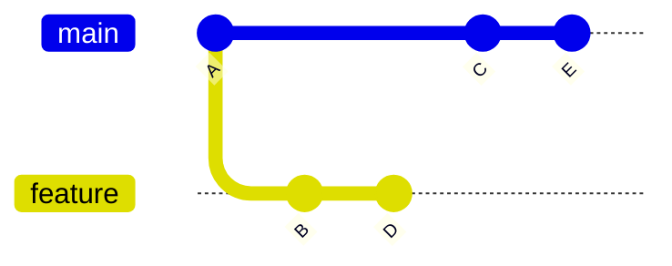
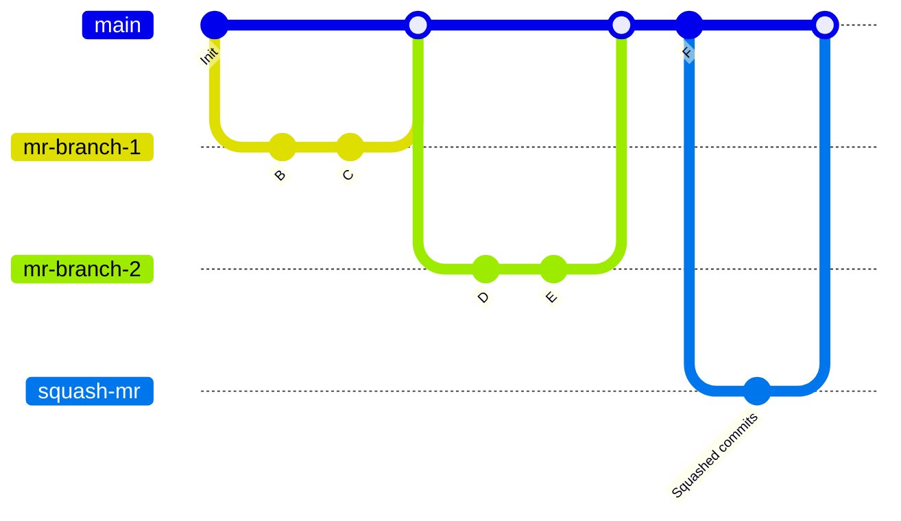
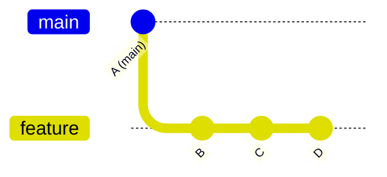
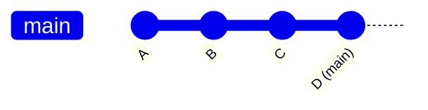
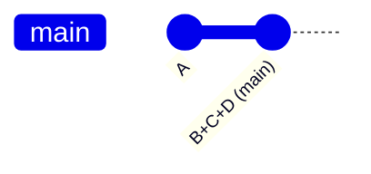



- Édition : Gratuite, GitLab Premium, GitLab Ultimate
- Offre : GitLab.com, GitLab Self-Managed, GitLab Dedicated



La méthode de fusion que vous sélectionnez pour votre projet détermine comment les modifications de vos merge requests sont fusionnées dans une branche existante.

Les exemples de cette page supposent une branche `main` avec les commits A, C et E, et une branche `feature` avec les commits B et D :



## Configurer la méthode de fusion d'un projet {#configure-a-projects-merge-method}

1. Dans la barre supérieure, sélectionnez **Rechercher ou accédez à** et repérez votre projet.
1. Dans la barre latérale gauche, sélectionnez **Paramètres** > **Requêtes de fusion**.
1. Sélectionnez la **Méthode de fusion** souhaitée parmi ces options :
   - Validation de fusion
   - Validation de fusion avec un historique semi-linéaire
   - Fusion en avance rapide
1. Dans **Squasher les commits lors de la fusion**, sélectionnez le comportement par défaut pour la gestion des commits :
   - **Ne pas autoriser** : le squashing n'est jamais effectué et l'utilisateur ne peut pas modifier le comportement.
   - **Autoriser** : le squashing est désactivé par défaut, mais l'utilisateur peut modifier le comportement.
   - **Encourager** : le squashing est activé par défaut, mais l'utilisateur peut modifier le comportement.
   - **Exiger** : le squashing est toujours effectué et l'utilisateur ne peut pas modifier le comportement.
1. Sélectionnez **Enregistrer les modifications**.

## Validation de fusion {#merge-commit}

Par défaut, GitLab crée un commit de fusion lorsqu'une branche est fusionnée dans `main`. Un commit de fusion distinct est toujours créé, que les commits soient ou non [squashés lors de la fusion](../squash_and_merge.md). Cette stratégie peut entraîner l'ajout à la fois d'un commit squash et d'un commit de fusion à votre branche `main`.

Ces diagrammes montrent comment la branche `feature` fusionne dans `main` si vous utilisez la stratégie **Validation de fusion**. Ils sont équivalents à la commande `git merge --no-ff <feature>`, et à la sélection de `Merge commit` comme **Méthode de fusion** dans l'interface utilisateur GitLab :

- Après la fusion d'une branche feature avec la méthode **Validation de fusion**, votre branche `main` ressemble à ceci :

  ```mermaid
  %%{init: { 'gitGraph': {'logLevel': 'debug', 'showBranches': true, 'showCommitLabel':true,'mainBranchName': 'main', 'fontFamily': 'GitLab Sans'}} }%%
  gitGraph
     accTitle: Diagram of a merge commit
     accDescr: A Git graph showing how merge commits are created in GitLab when a feature branch is merged.
     commit id: "A"
     branch feature
     commit id: "B"
     commit id: "D"
     checkout main
     commit id: "C"
     commit id: "E"
     merge feature
  ```

- En comparaison, un squash merge construit un commit squash, une copie virtuelle de tous les commits de la branche `feature`. Les commits d'origine (B et D) restent inchangés sur la branche `feature`, puis un commit de fusion est créé sur la branche `main` pour fusionner la branche squashée :

  ```mermaid
  %%{init: { 'gitGraph': {'showBranches': true, 'showCommitLabel':true,'mainBranchName': 'main', 'fontFamily': 'GitLab Sans'}} }%%
  gitGraph
     accTitle: Diagram of a squash merge
     accDescr: A Git graph showing repository and branch structure after a squash commit is added to the main branch.
     commit id:"A"
     branch feature
     checkout main
     commit id:"C"
     checkout feature
     commit id:"B"
     commit id:"D"
     checkout main
     commit id:"E"
     branch "B+D"
     commit id: "B+D"
     checkout main
     merge "B+D"
  ```

Le graphe de squash merge est équivalent à ces paramètres dans l'interface utilisateur GitLab :

- **Méthode de fusion** : validation de fusion.
- **Squasher les commits lors de la fusion** doit être défini sur l'une des valeurs suivantes :
  - Exiger.
  - Autoriser ou Encourager, et le squashing doit être sélectionné sur la merge request.

Le graphe de squash merge est également équivalent à ces commandes :

  ```shell
  git checkout `git merge-base feature main`
  git merge --squash feature
  git commit --no-edit
  SOURCE_SHA=`git rev-parse HEAD`
  git checkout main
  git merge --no-ff $SOURCE_SHA
  ```

Si vous continuez à travailler sur une branche source à long terme après un squash merge, les merge requests suivantes peuvent afficher des commits déjà fusionnés et un avertissement indiquant que la branche source est en retard par rapport à la branche cible. Pour plus d'informations, voir [le comportement des branches à long terme](../squash_and_merge.md#long-running-branch-behavior).

## Validation de fusion avec un historique semi-linéaire {#merge-commit-with-semi-linear-history}

Un commit de fusion est créé pour chaque fusion, mais la branche n'est fusionnée que si une fusion en avance rapide est possible. Cela garantit que si la compilation de la merge request a réussi, la compilation de la branche cible réussit également après la fusion. Exemple de graphe de commits généré à l'aide de cette méthode de fusion :



Lorsque vous consultez la page de la merge request avec la méthode `Merge commit with semi-linear history` sélectionnée, vous pouvez l'accepter uniquement si une fusion en avance rapide est possible. Lorsqu'une fusion en avance rapide n'est pas possible, l'utilisateur a la possibilité de rebaser ; voir [Rebasage dans les méthodes de fusion (semi-)linéaires](#rebasing-in-semi-linear-merge-methods).

Cette méthode est équivalente aux mêmes commandes Git que dans la méthode **Validation de fusion**. Cependant, si votre branche source est basée sur une version obsolète de la branche cible (comme `main`), vous devez rebaser votre branche source. Cette méthode de fusion crée un historique à l'apparence plus claire, tout en vous permettant de voir où chaque branche a commencé et a été fusionnée.

## Fusion en avance rapide {#fast-forward-merge}

Parfois, une politique de workflow peut imposer un historique de commits propre sans commits de fusion. Dans ce cas, la fusion en avance rapide est appropriée. Avec les merge requests en avance rapide, vous pouvez conserver un historique Git linéaire sans créer de commits de fusion.

Une fusion en avance rapide n'est possible que lorsque la branche cible (telle que `main`) n'a pas divergé du commit de base de la branche source. Si la branche cible comporte de nouveaux commits qui ne se trouvent pas dans la branche source, vous devez d'abord rebaser la branche source.

Lorsque le paramètre de fusion en avance rapide ([`--ff-only`](https://git-scm.com/docs/git-merge#git-merge---ff-only)) est activé, la fusion n'est autorisée que si la branche peut être avancée rapidement. Si une fusion en avance rapide n'est pas possible, vous avez la possibilité de rebaser. Pour plus d'informations, voir [Rebasage dans les méthodes de fusion (semi-)linéaires](#rebasing-in-semi-linear-merge-methods).

### Sans squashing {#without-squashing}

Lorsque le squashing est désactivé, tous les commits de la branche source sont ajoutés directement à la branche cible, en conservant leur historique de commits individuel.

Avant la fusion, avec `main` au commit A et `feature` contenant les commits B, C et D :



Après la fusion en avance rapide, `main` pointe désormais vers le commit D, incluant tous les commits de la branche feature :



Cette méthode est équivalente à `git merge --ff-only <source-branch>`.

### Avec squashing {#with-squashing}

Lorsque le squashing est activé, tous les commits de la branche source sont d'abord combinés en un seul commit, puis avancés rapidement vers la branche cible.

Avant la fusion, avec `main` au commit A et `feature` contenant les commits B, C et D :


Après la fusion en avance rapide avec squashing, `main` inclut désormais un seul commit contenant toutes les modifications de B, C et D :



Cette méthode est équivalente à `git merge --squash <source-branch>` suivi de `git commit`.

## Rebasage dans les méthodes de fusion (semi-)linéaires {#rebasing-in-semi-linear-merge-methods}

Dans ces méthodes de fusion, vous ne pouvez fusionner que lorsque votre branche source est à jour avec la branche cible :

- Validation de fusion avec un historique semi-linéaire.
- Fusion en avance rapide.

Si une fusion en avance rapide n'est pas possible mais qu'un rebasage sans conflit est possible, GitLab fournit :

- L'[action rapide `/rebase`](../conflicts.md#rebase).
- L'option permettant de sélectionner **Rebaser** dans l'interface utilisateur.

Vous devez rebaser la branche source localement avant une fusion en avance rapide si les deux conditions sont vraies :

- La branche cible est en avance sur la branche source.
- Un rebasage sans conflit n'est pas possible.

Un rebasage peut être nécessaire avant le squashing, même si le squashing peut lui-même être considéré comme équivalent au rebasage.

### Rebasage automatique avant la fusion {#automatic-rebase-before-merge}



- [Introduction](https://gitlab.com/gitlab-org/gitlab/-/merge_requests/183928) dans GitLab 18.0 [avec un feature flag](../../../../administration/feature_flags/_index.md) nommé `rebase_on_merge_automatic`. Désactivés par défaut.
- [Activé sur GitLab.com](https://gitlab.com/gitlab-org/gitlab/-/work_items/524048) dans GitLab 18.11.
- Le feature flag `rebase_on_merge_automatic` a été [supprimé](https://gitlab.com/gitlab-org/gitlab/-/merge_requests/231406) dans GitLab 19.0.
- [Passage en disponibilité générale](https://gitlab.com/gitlab-org/gitlab/-/merge_requests/243879) dans GitLab 19.2.



Lorsque vous utilisez la méthode **Validation de fusion avec un historique semi-linéaire** ou **Fusion en avance rapide**, vous pouvez activer le rebasage automatique avant la fusion. Lorsque ce paramètre est activé, GitLab rebase automatiquement la branche source sur la branche cible au moment de la fusion lorsque la branche source est en retard par rapport à la branche cible. Vous n'avez pas besoin de rebaser manuellement ou d'attendre qu'un rebasage soit terminé avant de fusionner.

Le rebasage côté serveur supprime les signatures GPG des commits. Si votre projet nécessite des commits signés, déterminez si le rebasage automatique est approprié.

Rebasage automatique :

- Crée un rebasage côté serveur de la branche source sans modifier la branche source d'origine.
- Avance rapidement la branche cible pour inclure les commits rebasés.
- Ne ré-exécute pas les pipelines CI/CD sur le résultat rebasé.
- Exige que le rebasage puisse se terminer sans conflits de merge.

> [!note]
> Étant donné que le pipeline CI/CD ne s'exécute pas à nouveau après le rebasage automatique, le résultat fusionné peut différer de la dernière exécution du pipeline. Pour valider le résultat rebasé avant la fusion, utilisez les [merge trains](../../../../ci/pipelines/merge_trains.md).

#### Activer le rebasage automatique avant la fusion {#turn-on-automatic-rebase-before-merge}

Prérequis :

- Disposer du rôle Chargé de maintenance ou Propriétaire pour le projet.
- La [méthode de fusion](#configure-a-projects-merge-method) du projet doit être définie sur **Validation de fusion avec un historique semi-linéaire** ou **Fusion en avance rapide**.

Pour activer le rebasage automatique :

1. Dans la barre supérieure, sélectionnez **Rechercher ou accédez à** et repérez votre projet.
1. Dans la barre latérale gauche, sélectionnez **Paramètres** > **Requêtes de fusion**.
1. Dans la section **Méthode de fusion**, sélectionnez **Activer la rebase automatique avant la fusion**.
1. Sélectionnez **Enregistrer les modifications**.

### Rebaser sans pipeline CI/CD {#rebase-without-cicd-pipeline}

Pour rebaser la branche d'une merge request sans déclencher de pipeline CI/CD, sélectionnez **Rebaser sans pipeline** dans la section des rapports de la merge request.

Cette option est :

- Disponible lorsque la fusion en avance rapide n'est pas possible mais qu'un rebasage sans conflit est possible.
- Non disponible lorsque l'option **Les pipelines doivent réussir** est activée.

Le rebasage sans pipeline CI/CD économise des ressources dans les projets avec un workflow semi-linéaire nécessitant des rebasages fréquents.

## Sujets connexes {#related-topics}

- [Squash and merge](../squash_and_merge.md)
