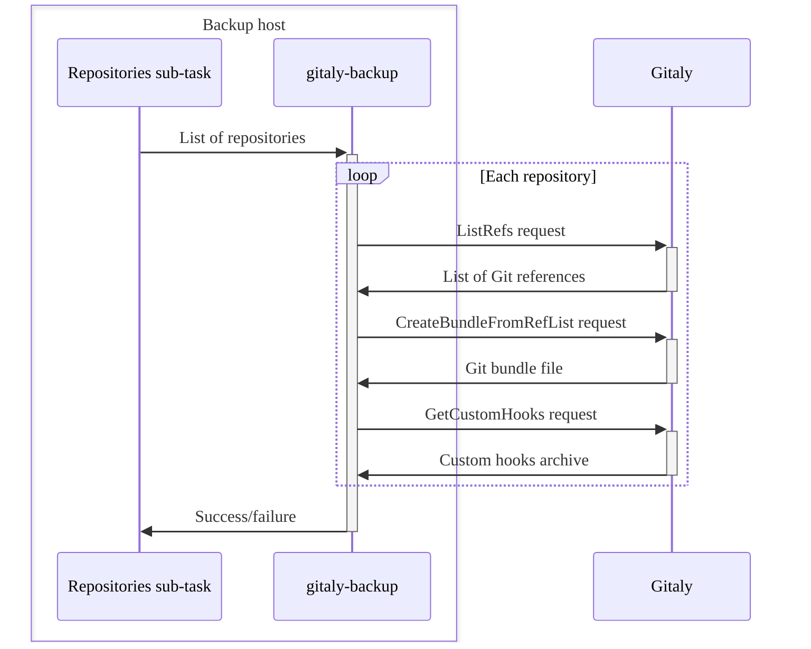
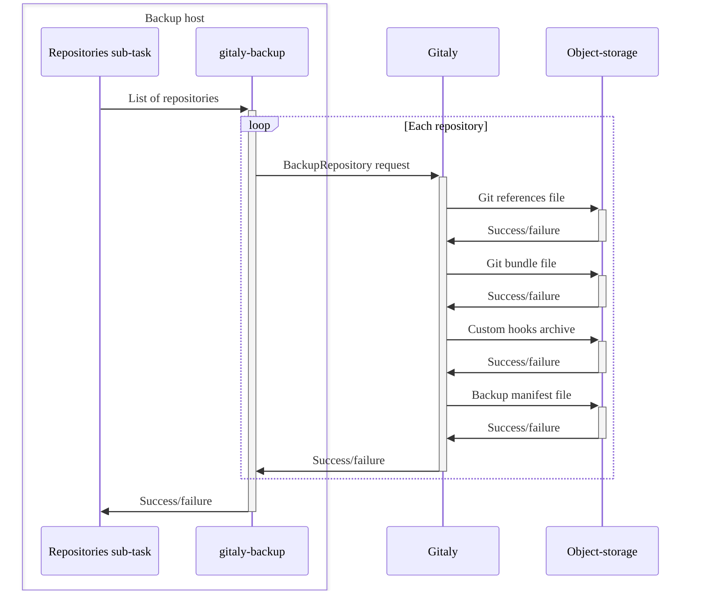

[バックアップコマンド](backup_gitlab.md#backup-command)を実行すると、バックアップスクリプトはGitLabデータを保存するためのバックアップアーカイブファイルを作成します。

アーカイブファイルを作成するために、バックアップスクリプトは次の処理を行います:

1. 増分バックアップを実行している場合、以前のバックアップアーカイブファイルを抽出します。
1. バックアップアーカイブファイルを更新または生成します。
1. すべてのバックアップサブタスクを実行して、以下を行います:
   - [データベースをバックアップする](#back-up-the-database)。
   - [Gitリポジトリをバックアップする](#back-up-git-repositories)。
   - [ファイルをバックアップする](#back-up-files)。
1. バックアップステージングエリアを`tar`ファイルにアーカイブします。
1. 新しいバックアップアーカイブを[設定](backup_gitlab.md#upload-backups-to-a-remote-cloud-storage)されている場合、オブジェクトストレージにアップロードします。
1. アーカイブされた[バックアップステージングエリア](#backup-staging-directory)ファイルのクリーンアップを行います。

## データベースをバックアップする {#back-up-the-database}

データベースをバックアップするには、`db`サブタスクは以下を行います:

1. [SQLバックアップ](https://www.postgresql.org/docs/16/backup-dump.html)を作成するために`pg_dump`を使用します。
1. `pg_dump`の出力を`gzip`に通し、圧縮されたSQLファイルを作成します。
1. ファイルを[バックアップステージングエリア](#backup-staging-directory)に保存します。

## Gitリポジトリをバックアップする {#back-up-git-repositories}

Gitリポジトリをバックアップするには、`repositories`サブタスクは以下を行います:

1. どのリポジトリをバックアップするかを`gitaly-backup`に通知します。
1. `gitaly-backup`を実行して、以下を行います:

   - Gitalyで一連のRemote Procedure呼び出し (RPCs) を呼び出す。
   - 各リポジトリのバックアップデータを収集します。

1. 収集されたデータを[バックアップステージングエリア](#backup-staging-directory)内のディレクトリ構造にストリーミングします。

次の図は、プロセスを示しています:



Gitalyクラスタリング (Praefect) 構成ストレージは、スタンドアロンのGitalyインスタンスと同じ方法でバックアップされます。

- Gitalyクラスタリング (Praefect) が`gitaly-backup`からのRPCsを呼び出しを受信すると、自身のデータベースを再構築します。
  - Gitalyクラスタリング (Praefect) データベースを個別にバックアップする必要はありません。
- バックアップはRPCsを介して動作するため、レプリケーション係数に関係なく、各リポジトリは1回のみバックアップされます。

### サーバー側のバックアップ {#server-side-backups}

サーバー側のリポジトリバックアップは、Gitリポジトリをバックアップするための効率的な方法です。この方法の利点は次のとおりです:

- データはGitalyからのRPCsを介して送信されません。
- サーバー側のバックアップは、ネットワーク転送をあまり必要としません。
- バックアップRakeタスクを実行しているマシン上のディスクストレージは必要ありません。

サーバー側でGitalyをバックアップするには、`repositories`サブタスクは以下を行います:

1. `gitaly-backup`を実行して、各リポジトリに対して単一のRPCを呼び出す。
1. 物理リポジトリを格納しているGitalyノードをトリガーして、バックアップデータをオブジェクトストレージにアップロードします。
1. オブジェクトストレージに保存されているバックアップを、[バックアップID](#backup-id)を使用して、作成されたバックアップアーカイブにリンクします。

次の図は、そのプロセスを示しています:



## ファイルをバックアップする {#back-up-files}

以下のサブタスクは、ファイルをバックアップします:

- `uploads`: 添付ファイル
- `builds`: CI/CDジョブ出力ログ
- `artifacts`: CI/CDジョブアーティファクト
- `pages`: ページコンテンツ
- `lfs`: LFSオブジェクト
- `terraform_state`: Terraformステート
- `registry`: コンテナレジストリイメージ
- `packages`: パッケージ
- `ci_secure_files`: プロジェクトレベルのセキュアファイル
- `external_diffs`: マージリクエストの差分（外部に保存されている場合）

各サブタスクは、タスク固有のディレクトリ内の一連のファイルを識別し、以下を行います:

1. `tar`ユーティリティを使用して、識別されたファイルのアーカイブを作成します。
1. ディスクに保存せずに、`gzip`を介してアーカイブを圧縮します。
1. `tar`ファイルを[バックアップステージングディレクトリ](#backup-staging-directory)に保存します。

バックアップはライブインスタンスから作成されるため、バックアップ処理中にファイルが変更される可能性があります。この場合、ファイルをバックアップするために[代替ストラテジ](backup_gitlab.md#backup-strategy-option)を使用できます。`rsync`ユーティリティは、バックアップするファイルのコピーを作成し、アーカイブするためにそれらを`tar`に渡します。



このストラテジを使用している場合、バックアップRakeタスクを実行しているマシンには、コピーされたファイルと圧縮されたアーカイブの両方を保存するのに十分なストレージが必要です。



## バックアップ {#backup-id}

バックアップIDは、バックアップアーカイブの一意の識別子です。これらのIDは、GitLabを復元する必要がある場合、および複数のバックアップアーカイブが利用可能な場合に重要です。

バックアップアーカイブは、`config/gitlab.yml`ファイルの`backup_path`設定で指定されたディレクトリに保存されます。デフォルトの場所は`/var/opt/gitlab/backups`です。

バックアップIDは以下で構成されます:

- バックアップ作成のタイムスタンプ
- 日付（`YYYY_MM_DD`）
- GitLabバージョン
- GitLabエディション

以下はバックアップIDの例です：`1493107454_2018_04_25_10.6.4-ce`

## バックアップファイル名 {#backup-filename}

デフォルトでは、ファイル名は`<backup-id>_gitlab_backup.tar`構造に従います。たとえば`1493107454_2018_04_25_10.6.4-ce_gitlab_backup.tar`などです。

## バックアップ情報ファイル {#backup-information-file}

バックアップ情報ファイル`backup_information.yml`は、バックアップに含まれていないすべての入力を保存します。ファイルは、[バックアップステージングディレクトリ](#backup-staging-directory)に保存されます。サブタスクは、このファイルを使用して、復元方法を決定し、バックアップ内のデータを[サーバー側のリポジトリバックアップ](#server-side-backups)のような外部サービスとリンクします。

バックアップ情報ファイルには、以下が含まれます:

- バックアップが作成された時間。
- バックアップを生成したGitLabのバージョン。
- その他に指定されたオプション。たとえば、スキップされたサブタスク。

## バックアップステージングディレクトリ {#backup-staging-directory}

バックアップステージングディレクトリは、バックアップおよび復元プロセス中に使用される一時的なストレージの場所です。このディレクトリは次のとおりです:

- GitLabのバックアップアーカイブを作成する前に、アーティファクトをバックアップに保存します。
- バックアップを復元する前、または増分バックアップを作成する前に、バックアップアーカイブを解凍します。

バックアップステージングディレクトリは、完了したバックアップアーカイブが作成されるディレクトリと同じです。解凍されたバックアップを作成する場合、バックアップアーティファクトはこのディレクトリに残ります。アーカイブは作成されません。

以下は、解凍されたバックアップを含むバックアップステージングディレクトリの例です:

```plaintext
backups/
├── 1701728344_2023_12_04_16.7.0-pre_gitlab_backup.tar
├── 1701728447_2023_12_04_16.7.0-pre_gitlab_backup.tar
├── artifacts.tar.gz
├── backup_information.yml
├── builds.tar.gz
├── ci_secure_files.tar.gz
├── db
│   ├── ci_database.sql.gz
│   └── database.sql.gz
├── lfs.tar.gz
├── packages.tar.gz
├── pages.tar.gz
├── repositories
│   ├── manifests/
│   ├── @hashed/
│   └── @snippets/
├── terraform_state.tar.gz
└── uploads.tar.gz
```
