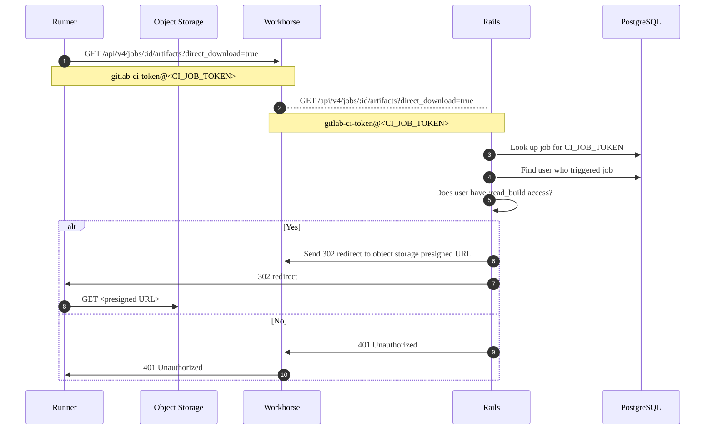
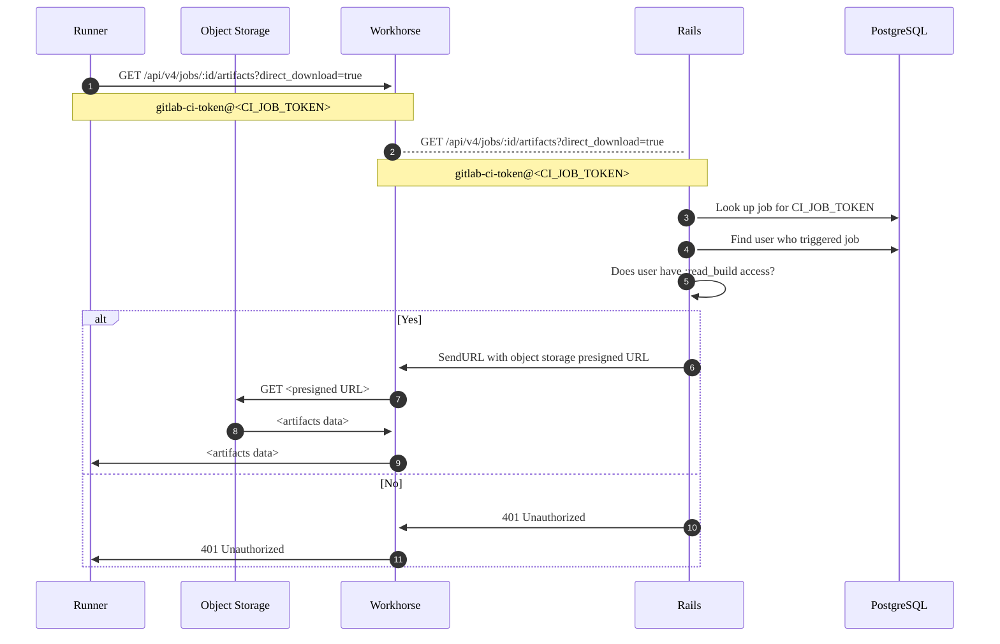



- プラン: Free、Premium、Ultimate
- 提供形態: GitLab Self-Managed



ジョブアーティファクトを管理する際に、次の問題が発生する可能性があります。

## ジョブアーティファクトがディスク容量を過剰に使用している {#job-artifacts-using-too-much-disk-space}

ジョブアーティファクトは、予想以上に早くディスク容量を消費する可能性があります。考えられる理由を以下に示します:

- ユーザーが、ジョブアーティファクトの有効期限を必要以上に長く設定している。
- 実行されるジョブの数、ひいては生成されるアーティファクトの数が、予想以上に多い。
- ジョブログが予想以上に大きく、時間の経過とともに蓄積されている。
- ファイルシステムは、[アーティファクトのハウスキーピングによって空のディレクトリが残される](https://gitlab.com/gitlab-org/gitlab/-/issues/17465)ため、inodeを使い果たしてしまう可能性があります。[孤立したアーティファクトファイルに対するRakeタスク](../raketasks/cleanup.md#remove-orphan-artifact-files)は、これらを削除します。
- アーティファクトファイルがディスク上に残され、ハウスキーピングによって削除されない可能性があります。これらを削除するには、[孤立したアーティファクトファイルに対するRakeタスク](../raketasks/cleanup.md#remove-orphan-artifact-files)を実行します。このスクリプトは、空のディレクトリも削除するため、（前の理由を参照）常に実行する作業を見つけるはずです。
- `unknown`ステータスのアーティファクトは、自動クリーンアップで処理されない可能性があります。ディスク容量を回復するために、[これらのアーティファクトをチェック](#check-for-artifacts-with-unknown-status)してクリーンアップできます。
- [最新の成功ジョブから最新のアーティファクトを保持](../../ci/jobs/job_artifacts.md#keep-artifacts-from-most-recent-successful-jobs)する機能が有効になっています。

これらのケースやその他のケースでは、ディスク容量の使用に最も責任のあるプロジェクトを特定し、どの種類のアーティファクトが最も容量を使用しているかを把握し、場合によっては、ジョブアーティファクトを手動で削除してディスク容量を回復します。

### アーティファクトのハウスキーピング {#artifacts-housekeeping}

アーティファクトのハウスキーピングとは、どのアーティファクトが有効期限切れで削除可能かを識別するプロセスです。

#### `unknown`ステータスのアーティファクトを確認する {#check-for-artifacts-with-unknown-status}

一部のアーティファクトのステータスが`unknown`になっているのは、ハウスキーピングシステムが正しいロックステータスを判別できないためです。これらのアーティファクトは、有効期限が切れても自動クリーンアップで処理されず、ディスク容量の過剰な使用につながる可能性があります。

インスタンスに`unknown`ステータスのアーティファクトがあるかどうかを確認するには、次の手順に従います:

1. データベースコンソールを起動します:

   

   

   ```shell
   sudo gitlab-psql
   ```

   

   

   ```shell
   # Find the toolbox pod
   kubectl --namespace <namespace> get pods -lapp=toolbox
   # Connect to the PostgreSQL console
   kubectl exec -it <toolbox-pod-name> -- /srv/gitlab/bin/rails dbconsole --include-password --database main
   ```

   

   

   ```shell
   sudo docker exec -it <container_name> /bin/bash
   gitlab-psql
   ```

   

   

   ```shell
   sudo -u git -H psql -d gitlabhq_production
   ```

   

   

1. 次のクエリを実行します:

   ```sql
   select expire_at, file_type, locked, count(*) from ci_job_artifacts
   where expire_at is not null and
   file_type != 3
   group by expire_at, file_type, locked having count(*) > 1;
   ```

ロックされたステータス`2`でレコードが返された場合、これらは`unknown`アーティファクトです。次に例を示します: 

```plaintext
           expire_at           | file_type | locked | count
-------------------------------+-----------+--------+--------
 2021-06-21 22:00:00+00        |         1 |      2 |  73614
 2021-06-21 22:00:00+00        |         2 |      2 |  73614
 2021-06-21 22:00:00+00        |         4 |      2 |   3522
 2021-06-21 22:00:00+00        |         9 |      2 |     32
 2021-06-21 22:00:00+00        |        12 |      2 |    163
```

`unknown`アーティファクトがある場合は、[有効期限を短く設定する](#clean-up-unknown-artifacts)か、手動で削除してディスク容量を回復できます。

#### `unknown`アーティファクトをクリーンアップする {#clean-up-unknown-artifacts}

`unknown`アーティファクトをクリーンアップするには、より短い有効期限を設定して、自動クリーンアッププロセスで処理できるようにします:

1. [Railsコンソール](../operations/rails_console.md#starting-a-rails-console-session)を起動します。
1. `unknown`アーティファクトの有効期限を現在の時刻に設定します:

   ```ruby
   # This marks unknown artifacts for immediate cleanup
   Ci::JobArtifact.where(locked: 2).update_all(artifacts_expire_at: Time.current)
   ```

自動ハウスキーピングプロセスは、次回の実行時にこれらのアーティファクトをクリーンアップします。

#### `@final`アーティファクトがオブジェクトストレージから削除されない {#final-artifacts-not-deleted-from-object-store}

GitLab 16.1以降、アーティファクトは、一時的な場所を最初に使用するのではなく、`@final`ディレクトリ内の最終ストレージの場所に直接アップロードされます。

GitLab 16.1および16.2の問題により、[アーティファクトが有効期限切れになったときにオブジェクトストレージから削除されません](https://gitlab.com/gitlab-org/gitlab/-/issues/419920)。有効期限切れのアーティファクトのクリーンアッププロセスでは、`@final`ディレクトリからアーティファクトは削除されません。この問題はGitLab 16.3以降で修正されています。

GitLab 16.1または16.2をしばらく実行していたインスタンスの管理者は、アーティファクトによって使用されるオブジェクトストレージの増加を確認できる可能性があります。これらのアーティファクトを確認して削除するには、次の手順に従います。

ファイルの削除は、2段階のプロセスです:

1. [どのファイルが孤立しているかを特定](#list-orphaned-job-artifacts)します。
1. [特定されたファイルをオブジェクトストレージから削除](#delete-orphaned-job-artifacts)します。

##### 孤立したジョブアーティファクトを一覧表示する {#list-orphaned-job-artifacts}





```shell
sudo gitlab-rake gitlab:cleanup:list_orphan_job_artifact_final_objects
```





```shell
docker exec -it <container-id> bash
gitlab-rake gitlab:cleanup:list_orphan_job_artifact_final_objects
```

コンテナにマウントされている永続ボリュームに書き込むか、コマンドが完了したら、セッションから出力ファイルをコピーします。





```shell
sudo -u git -H bundle exec rake gitlab:cleanup:list_orphan_job_artifact_final_objects RAILS_ENV=production
```





```shell
# find the pod
kubectl get pods --namespace <namespace> -lapp=toolbox

# open the Rails console
kubectl exec -it -c toolbox <toolbox-pod-name> bash
gitlab-rake gitlab:cleanup:list_orphan_job_artifact_final_objects
```

コマンドが完了したら、セッションから永続ストレージにファイルをコピーします。





Rakeタスクには、すべてのタイプのGitLabデプロイに適用される追加機能がいくつかあります:

- オブジェクトストレージのスキャンは中断できます。進行状況はRedisに記録され、これはその時点からアーティファクトのスキャンを再開するために使用されます。
- デフォルトでは、RakeタスクはCSVファイルを生成します。`/opt/gitlab/embedded/service/gitlab-rails/tmp/orphan_job_artifact_final_objects.csv`
- 環境変数を設定して、別のファイル名を指定します:

  ```shell
  # Packaged GitLab
  sudo su -
  FILENAME='custom_filename.csv' gitlab-rake gitlab:cleanup:list_orphan_job_artifact_final_objects
  ```

- 出力ファイルがすでに存在する場合（デフォルトまたは指定されたファイル）、ファイルにエントリが追加されます。
- 各行には、ファイルヘッダーなしで、コンマで区切られたフィールド`object_path,object_size`が含まれています。次に例を示します: 

  ```plaintext
  35/13/35135aaa6cc23891b40cb3f378c53a17a1127210ce60e125ccf03efcfdaec458/@final/1a/1a/5abfa4ec66f1cc3b681a4d430b8b04596cbd636f13cdff44277211778f26,201
  ```

##### 孤立したジョブアーティファクトを削除する {#delete-orphaned-job-artifacts}





```shell
sudo gitlab-rake gitlab:cleanup:delete_orphan_job_artifact_final_objects
```





```shell
docker exec -it <container-id> bash
gitlab-rake gitlab:cleanup:delete_orphan_job_artifact_final_objects
```

- コマンドが完了したら、セッションから出力ファイルをコピーするか、コンテナによってマウントされたボリュームに書き込みます。





```shell
sudo -u git -H bundle exec rake gitlab:cleanup:delete_orphan_job_artifact_final_objects RAILS_ENV=production
```





```shell
# find the pod
kubectl get pods --namespace <namespace> -lapp=toolbox

# open the Rails console
kubectl exec -it -c toolbox <toolbox-pod-name> bash
gitlab-rake gitlab:cleanup:delete_orphan_job_artifact_final_objects
```

- コマンドが完了したら、セッションから永続ストレージにファイルをコピーします。





以下は、すべてのタイプのGitLabデプロイに適用されます:

- `FILENAME`変数を使用して入力ファイル名を指定します。デフォルトでは、スクリプトは以下を探します。`/opt/gitlab/embedded/service/gitlab-rails/tmp/orphan_job_artifact_final_objects.csv`
- スクリプトはファイルを削除すると、削除されたファイルを含むCSVファイルを出力します:
  - ファイルは入力ファイルと同じディレクトリにあります
  - ファイル名には`deleted_from--`というプレフィックスが付きます。例: `deleted_from--orphan_job_artifact_final_objects.csv`。
  - ファイルの行は`object_path,object_size,object_generation/version`です。以下に例を示します:

    ```plaintext
    35/13/35135aaa6cc23891b40cb3f378c53a17a1127210ce60e125ccf03efcfdaec458/@final/1a/1a/5abfa4ec66f1cc3b681a4d430b8b04596cbd636f13cdff44277211778f26,201,1711616743796587
    ```

### 特定の有効期限（または有効期限なし）を持つアーティファクトを含むプロジェクトとビルドを一覧表示する {#list-projects-and-builds-with-artifacts-with-a-specific-expiration-or-no-expiration}

[Railsコンソール](../operations/rails_console.md)を使用すると、ジョブアーティファクトを持つプロジェクトを次のいずれかで見つけることができます:

- 有効期限の日付がありません。
- 有効期限が7日以上先の未来の日付。

[アーティファクトの削除](#delete-old-builds-and-artifacts)と同様に、次の時間の例を使用して、必要に応じて変更します:

- `7.days.from_now`
- `10.days.from_now`
- `2.weeks.from_now`
- `3.months.from_now`
- `1.year.from_now`

次の各スクリプトは、`.limit(50)`で検索を50件の結果に制限しますが、必要に応じてこの数値を変更することもできます:

```ruby
# Find builds & projects with artifacts that never expire
builds_with_artifacts_that_never_expire = Ci::Build.with_downloadable_artifacts.where(artifacts_expire_at: nil).limit(50)
builds_with_artifacts_that_never_expire.find_each do |build|
  puts "Build with id #{build.id} has artifacts that don't expire and belongs to project #{build.project.full_path}"
end

# Find builds & projects with artifacts that expire after 7 days from today
builds_with_artifacts_that_expire_in_a_week = Ci::Build.with_downloadable_artifacts.where('artifacts_expire_at > ?', 7.days.from_now).limit(50)
builds_with_artifacts_that_expire_in_a_week.find_each do |build|
  puts "Build with id #{build.id} has artifacts that expire at #{build.artifacts_expire_at} and belongs to project #{build.project.full_path}"
end
```

### 保存されているジョブアーティファクトの合計サイズでプロジェクトを一覧表示する {#list-projects-by-total-size-of-job-artifacts-stored}

[Railsコンソール](../operations/rails_console.md)で次のコードを実行して、保存されているジョブアーティファクトの合計サイズでソートされた上位20件のプロジェクトを一覧表示します:

```ruby
include ActionView::Helpers::NumberHelper
ProjectStatistics.order(build_artifacts_size: :desc).limit(20).each do |s|
  puts "#{number_to_human_size(s.build_artifacts_size)} \t #{s.project.full_path}"
end
```

表示されるプロジェクトの数を変更するには、`.limit(20)`を必要な数に変更します。

### 単一プロジェクトで最大のアーティファクトを一覧表示する {#list-largest-artifacts-in-a-single-project}

[Railsコンソール](../operations/rails_console.md)で次のコードを実行して、単一プロジェクトで最大の50個のジョブアーティファクトを一覧表示します:

```ruby
include ActionView::Helpers::NumberHelper
project = Project.find_by_full_path('path/to/project')
Ci::JobArtifact.where(project: project).order(size: :desc).limit(50).map { |a| puts "ID: #{a.id} - #{a.file_type}: #{number_to_human_size(a.size)}" }
```

表示されるジョブアーティファクトの数を変更するには、`.limit(50)`を必要な数に変更します。

### 単一プロジェクト内のアーティファクトを一覧表示する {#list-artifacts-in-a-single-project}

単一プロジェクトのアーティファクトを、アーティファクトサイズでソートして一覧表示します。出力には以下が含まれます:

- アーティファクトを作成したジョブのID
- アーティファクトサイズ
- アーティファクトファイルタイプ
- アーティファクト作成日
- アーティファクトのディスク上の場所

```ruby
p = Project.find_by_id(<project_id>)
arts = Ci::JobArtifact.where(project: p)

list = arts.order(size: :desc).limit(50).each do |art|
    puts "Job ID: #{art.job_id} - Size: #{art.size}b - Type: #{art.file_type} - Created: #{art.created_at} - File loc: #{art.file}"
end
```

表示されるジョブアーティファクトの数を変更するには、`limit(50)`の数値を変更します。

### 古いビルドとアーティファクトを削除する {#delete-old-builds-and-artifacts}



これらのコマンドはデータを完全に削除します。本番環境で実行する前に、まずテスト環境で試してから、必要に応じて復元できるインスタンスのバックアップを作成する必要があります。



#### プロジェクトの古いアーティファクトを削除する {#delete-old-artifacts-for-a-project}

この手順では、ユーザーが[保持することを選択した](../../ci/jobs/job_artifacts.md#with-an-expiry)アーティファクトも消去します:

```ruby
project = Project.find_by_full_path('path/to/project')
builds_with_artifacts =  project.builds.with_downloadable_artifacts
builds_with_artifacts.where("finished_at < ?", 1.year.ago).each_batch do |batch|
  batch.each do |build|
    Ci::JobArtifacts::DeleteService.new(build).execute
  end

  batch.update_all(artifacts_expire_at: Time.current)
end
```

#### 古いアーティファクトをインスタンス全体で削除する {#delete-old-artifacts-instance-wide}

この手順では、ユーザーが[保持することを選択した](../../ci/jobs/job_artifacts.md#with-an-expiry)アーティファクトも消去します:

```ruby
builds_with_artifacts = Ci::Build.with_downloadable_artifacts
builds_with_artifacts.where("finished_at < ?", 1.year.ago).each_batch do |batch|
  batch.each do |build|
    Ci::JobArtifacts::DeleteService.new(build).execute
  end

  batch.update_all(artifacts_expire_at: Time.current)
end
```

#### プロジェクトの古いジョブログとアーティファクトを削除する {#delete-old-job-logs-and-artifacts-for-a-project}

```ruby
project = Project.find_by_full_path('path/to/project')
builds =  project.builds
admin_user = User.find_by(username: 'username')
builds.where("finished_at < ?", 1.year.ago).each_batch do |batch|
  batch.each do |build|
    print "Ci::Build ID #{build.id}... "

    if build.erasable?
      Ci::BuildEraseService.new(build, admin_user).execute
      puts "Erased"
    else
      puts "Skipped (Nothing to erase or not erasable)"
    end
  end
end
```

#### 古いジョブログとアーティファクトをインスタンス全体で削除する {#delete-old-job-logs-and-artifacts-instance-wide}

```ruby
builds = Ci::Build.all
admin_user = User.find_by(username: 'username')
builds.where("finished_at < ?", 1.year.ago).each_batch do |batch|
  batch.each do |build|
    print "Ci::Build ID #{build.id}... "

    if build.erasable?
      Ci::BuildEraseService.new(build, admin_user).execute
      puts "Erased"
    else
      puts "Skipped (Nothing to erase or not erasable)"
    end
  end
end
```

`1.year.ago`はRailsの[`ActiveSupport::Duration`](https://api.rubyonrails.org/classes/ActiveSupport/Duration.html)メソッドです。まだ使用中のアーティファクトを誤って削除するリスクを軽減するために、長い期間から開始します。必要に応じて、`3.months.ago`、`2.weeks.ago`、または`7.days.ago`など、短い期間で削除を再実行します。

メソッド`erase_erasable_artifacts!`は同期的であり、実行時にアーティファクトはすぐに削除されます。バックグラウンドキューによってスケジュールされることはありません。

### アーティファクトを削除しても、ディスク容量はすぐには回復しません。 {#deleting-artifacts-does-not-immediately-reclaim-disk-space}

アーティファクトが削除されると、プロセスは2つのフェーズで発生します:

1. **削除準備完了としてマーク**：`Ci::JobArtifact`レコードはデータベースから削除され、将来の`pick_up_at`タイムスタンプを持つ`Ci::DeletedObject`レコードに変換されます。
1. **ストレージから削除**: アーティファクトファイルは、`Ci::ScheduleDeleteObjectsCronWorker`ワーカーが`Ci::DeletedObject`レコードを処理し、物理的にファイルを削除するまでディスク上に残ります。

削除は、システムリソースの過負荷を防ぐために意図的に制限されています:

- ワーカーは、1時間に1回、16分に実行されます。
- 最大20件の同時ジョブのバッチでオブジェクトを処理します。
- 削除された各オブジェクトには`pick_up_at`タイムスタンプがあり、物理的な削除の対象となる時期を決定します

大規模な削除の場合、ディスク容量が完全に回復するまでに、物理的なクリーンアップにかなりの時間がかかることがあります。クリーンアップには、非常に大規模な削除の場合、数日かかることがあります。

ディスク容量を迅速に回復する必要がある場合は、アーティファクトの削除を迅速化できます。

#### アーティファクトの削除を迅速化する {#expedite-artifact-removal}

大量のアーティファクトを削除した後にディスク容量を迅速に回復する必要がある場合は、標準のスケジューリング制限を回避するて、削除プロセスを迅速化できます。



大量のアーティファクトを削除している場合、これらのコマンドはシステムに大きな負荷をかけます。



```ruby
# Set the pick_up_date to the current time on all artifacts
# This will mark them for immediate deletion
Ci::DeletedObject.update_all(pick_up_at: Time.current)

# Get the count of artifacts marked for deletion
Ci::DeletedObject.where("pick_up_at < ?", Time.current)

# Delete the artifacts from disk
while Ci::DeletedObject.where("pick_up_at < ?", Time.current).count > 0
  Ci::DeleteObjectsService.new.execute
  sleep(10)
end

# Get the count of artifacts marked for deletion (should now be zero)
Ci::DeletedObject.count
```

### 古いパイプラインを削除する {#delete-old-pipelines}



これらのコマンドはデータを完全に削除します。本番環境で実行する前に、サポートエンジニアからのガイダンスを求めることを検討してください。また、最初にテスト環境で試してから、必要に応じて復元できるインスタンスのバックアップを作成する必要があります。



パイプラインを削除すると、そのパイプラインの以下も削除されます:

- ジョブアーティファクト
- ジョブログ
- ジョブメタデータ
- パイプラインメタデータ

ジョブとパイプラインのメタデータを削除すると、データベース内のCIテーブルのサイズを削減できます。CIテーブルは通常、インスタンスのデータベースで最大のテーブルです。

#### プロジェクトの古いパイプラインを削除する {#delete-old-pipelines-for-a-project}

```ruby
project = Project.find_by_full_path('path/to/project')
user = User.find(1)
project.ci_pipelines.where("finished_at < ?", 1.year.ago).each_batch do |batch|
  batch.each do |pipeline|
    puts "Erasing pipeline #{pipeline.id}"
    Ci::DestroyPipelineService.new(pipeline.project, user).execute(pipeline)
  end
end
```

#### インスタンス全体の古いパイプラインを削除する {#delete-old-pipelines-instance-wide}

```ruby
user = User.find(1)
Ci::Pipeline.where("finished_at < ?", 1.year.ago).each_batch do |batch|
  batch.each do |pipeline|
    puts "Erasing pipeline #{pipeline.id} for project #{pipeline.project_id}"
    Ci::DestroyPipelineService.new(pipeline.project, user).execute(pipeline)
  end
end
```

## ジョブアーティファクトのアップロードがエラー500で失敗する {#job-artifact-upload-fails-with-error-500}

アーティファクトにオブジェクトストレージを使用しており、ジョブアーティファクトのアップロードが失敗した場合は、以下を確認してください:

- 次のようなエラーメッセージのジョブログ:

  ```plaintext
  WARNING: Uploading artifacts as "archive" to coordinator... failed id=12345 responseStatus=500 Internal Server Error status=500 token=abcd1234
  ```

- 次のようなエラーメッセージの[ワークホースログ](../logs/_index.md#workhorse-logs):

  ```json
  {"error":"MissingRegion: could not find region configuration","level":"error","msg":"error uploading S3 session","time":"2021-03-16T22:10:55-04:00"}
  ```

どちらの場合も、ジョブアーティファクトの[オブジェクトストレージ設定](../object_storage.md)に`region`を追加する必要がある場合があります。

## ジョブアーティファクトのアップロードが`500 Internal Server Error (Missing file)`で失敗する {#job-artifact-upload-fails-with-500-internal-server-error-missing-file}

フォルダーパスを含むバケット名は、[統合されたオブジェクトストレージ](../object_storage.md#configure-a-single-storage-connection-for-all-object-types-consolidated-form)ではサポートされていません。たとえば`bucket/path`などです。バケット名にパスが含まれている場合は、次のようなエラーが表示されることがあります:

```plaintext
WARNING: Uploading artifacts as "archive" to coordinator... POST https://gitlab.example.com/api/v4/jobs/job_id/artifacts?artifact_format=zip&artifact_type=archive&expire_in=1+day: 500 Internal Server Error (Missing file)
FATAL: invalid argument
```

統合されたオブジェクトストレージを使用しているときに、前のエラーが原因でジョブアーティファクトのアップロードが失敗する場合は、データタイプごとに[個別のバケットを使用](../object_storage.md#use-separate-buckets)していることを確認してください。

## Windowsマウントを使用している場合、ジョブアーティファクトのアップロードが`FATAL: invalid argument`で失敗する {#job-artifacts-fail-to-upload-with-fatal-invalid-argument-when-using-windows-mount}

ジョブアーティファクトにCIFSでWindowsマウントを使用している場合、Runnerがアーティファクトをアップロードしようとすると、`invalid argument`エラーが表示されることがあります:

```plaintext
WARNING: Uploading artifacts as "dotenv" to coordinator... POST https://<your-gitlab-instance>/api/v4/jobs/<JOB_ID>/artifacts: 500 Internal Server Error  id=1296 responseStatus=500 Internal Server Error status=500 token=*****
FATAL: invalid argument
```

この問題を回避するには、次のことを試してください:

- CIFSの代わりにext4マウントに切り替えます。
- CIFSファイルリースに関連する重要なバグ修正が多数含まれている、少なくともLinuxカーネル5.15にスケールします。
- 古いカーネルの場合は、ファイルリースを無効にするには、`nolease`マウントオプションを使用します。

詳細については、[調査の詳細を参照してください](https://gitlab.com/gitlab-org/gitlab/-/issues/389995)。

## 使用量クォータにアーティファクトストレージの使用量が正しく表示されない {#usage-quota-shows-incorrect-artifact-storage-usage}

場合によっては、[アーティファクトストレージの使用量](../../user/storage_usage_quotas.md)に、アーティファクトで使用される合計ストレージ容量の誤った値が表示されることがあります。インスタンス内のすべてのプロジェクトについてアーティファクトの使用状況の統計を再計算するには、このバックグラウンドスクリプトを実行します:

```shell
gitlab-rake gitlab:refresh_project_statistics_build_artifacts_size[https://example.com/path/file.csv]
```

`https://example.com/path/file.csv`ファイルには、アーティファクトストレージの使用量を再計算するすべてのプロジェクトのプロジェクトIDを一覧表示する必要があります。ファイルには次の形式を使用します:

```plaintext
PROJECT_ID
1
2
```

スクリプトの実行中に、アーティファクトの使用量の値が`0`に変動する可能性があります。再計算後、使用量は再び期待どおりに表示されるはずです。

## アーティファクトダウンロードフロー図 {#artifact-download-flow-diagrams}

次のフロー図は、ジョブアーティファクトの仕組みを示しています。これらの図は、ジョブアーティファクトにオブジェクトストレージが設定されていることを前提としています。

### プロキシダウンロードが無効 {#proxy-download-disabled}

[`proxy_download`が`false`に設定されている](../object_storage.md)場合、GitLabは、署名済みURLを使用してオブジェクトストレージからアーティファクトをダウンロードするようにRunnerをリダイレクトします。通常、Runnerがソースから直接フェッチする方が高速であるため、通常、この設定が推奨されます。また、データがGitLabによってフェッチされ、Runnerに送信される必要がないため、帯域幅の使用量も削減されるはずです。ただし、オブジェクトストレージへの直接アクセスをRunnerに許可する必要があります。

リクエストフローは次のようになります:



この図の説明:

1. まず、Runnerは`GET /api/v4/jobs/:id/artifacts`エンドポイントを使用してジョブアーティファクトをフェッチしようとします。Runnerは、オブジェクトストレージから直接ダウンロードできることを示すために、最初の試行で`direct_download=true`クエリパラメータをアタッチします。直接ダウンロードは、[`FF_USE_DIRECT_DOWNLOAD`機能フラグ](https://docs.gitlab.com/runner/configuration/feature-flags.html)を介してRunner設定で無効にできます。このフラグは、`true`にデフォルトで設定されています。

1. Runnerは、`gitlab-ci-token`のユーザー名と自動生成されたCI/CDジョブトークンをパスワードとして使用して、HTTP Basic認証でGETリクエストを送信します。このトークンはGitLabによって生成され、ジョブの開始時にRunnerに与えられます。

1. GETリクエストはGitLab APIに渡され、データベース内のトークンを検索し、トリガーしたユーザー名を検索します。

1. 手順5～8:

   - ユーザー名にビルドへのアクセス権がある場合、GitLabは事前署名付きURLを生成し、`Location`をそのURLに設定して302リダイレクトを送信します。Runnerは302リダイレクトに従い、アーティファクトをダウンロードします。

   - ジョブが見つからない場合、またはユーザー名がジョブへのアクセス権を持っていない場合、APIは401 Unauthorizedを返します。

   Runnerは、次のHTTPステータスコードを受信した場合、再試行しません:

   - 200 OK
   - 401 Unauthorized
   - 403 Forbidden
   - 404 Not Found

   ただし、Runnerが500エラーなどの他のステータスコードを受信した場合、アーティファクトのダウンロードをさらに2回再試行し、各試行の間に1秒間スリープします。後続の試行では、`direct_download=true`は省略されます。

### プロキシダウンロードが有効 {#proxy-download-enabled}

`proxy_download`が`true`の場合、Runnerが`direct_download=true`クエリパラメータを送信したとしても、GitLabは常にオブジェクトストレージからアーティファクトをフェッチし、データをRunnerに送信します。Runnerのネットワーキングアクセスが制限されている場合は、プロキシダウンロードが望ましい場合があります。

次の図は、プロキシダウンロードが無効になっている例と似ていますが、手順6～9では、GitLabは302リダイレクトをRunnerに送信しません。代わりに、GitLabはWorkhorseにデータのフェッチとRunnerへのストリーミングバックを指示します。Runnerの観点からは、`/api/v4/jobs/:id/artifacts`への元のGETリクエストはバイナリデータを直接返します。



## `413 Request Entity Too Large`エラー {#413-request-entity-too-large-error}

アーティファクトが大きすぎる場合、ジョブは次のエラーで失敗する可能性があります:

```plaintext
Uploading artifacts as "archive" to coordinator... too large archive <job-id> responseStatus=413 Request Entity Too Large status=413" at end of a build job on pipeline when trying to store artifacts to <object-storage>.
```

以下のことを行う必要があるかもしれません:

- [最大アーティファクトサイズ](../settings/continuous_integration.md#set-maximum-artifacts-size)を大きくします。
- プロキシサーバーとしてNGINXを使用している場合は、ファイルのアップロードサイズの制限を大きくします。この制限はデフォルトでは1MBに制限されています。NGINXの設定ファイルで、`client-max-body-size`の値を高く設定します。
