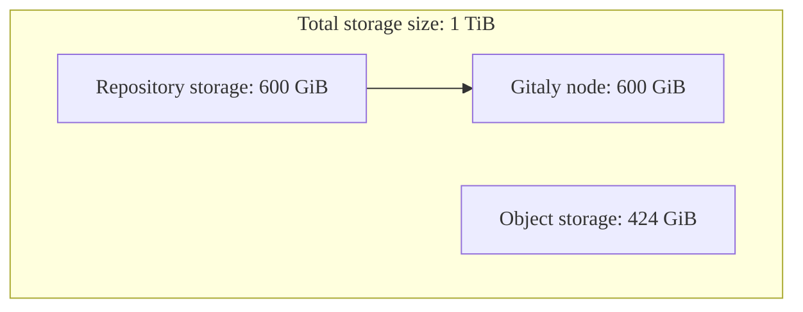
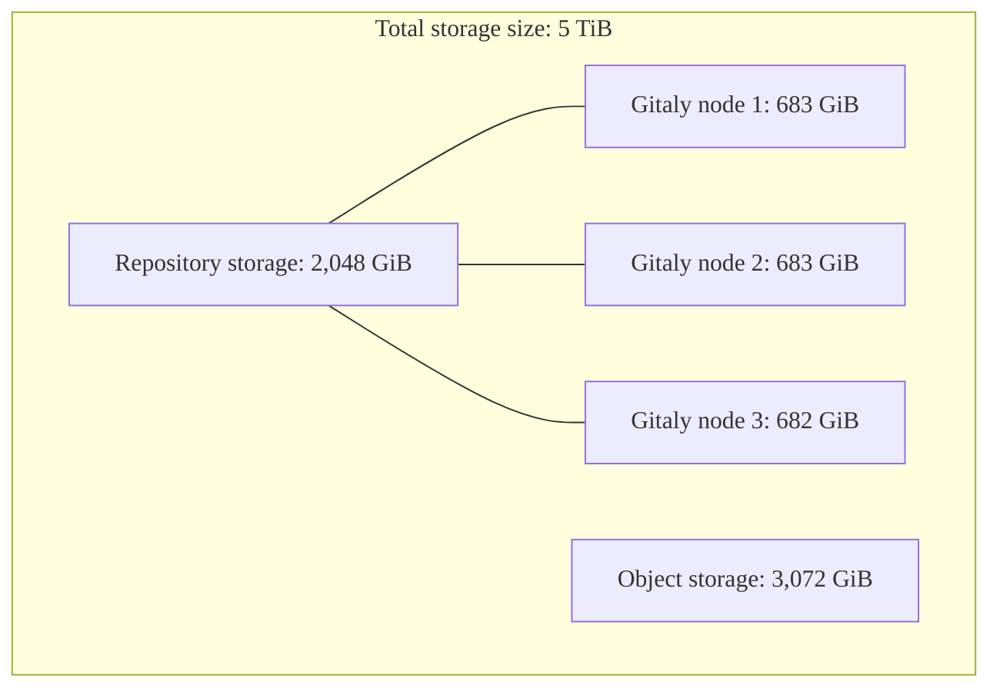



- プラン: Ultimate
- 提供形態: GitLab Dedicated



GitLab Dedicatedは、シングルテナントで完全に管理されたGitLabインスタンスを、ご希望のAWSクラウドリージョンにデプロイします。お客様のアカウントチームは、調達プロセス中にお客様のストレージニーズを判断します。

GitLab Dedicatedでのストレージの仕組みを理解することで、インスタンスの設定とリソース管理について、十分な情報に基づいた意思決定を行うことができます。

## ストレージコンポーネント {#storage-components}

GitLab Dedicatedでは、さまざまな目的に応じて、さまざまな種類のストレージを使用します。ストレージの総割り当て量は、使用パターンに基づいて、これらのコンポーネント間で分割されます。

### 合計ストレージサイズ {#total-storage-size}

合計ストレージサイズとは、リポジトリストレージとオブジェクトストレージの両方を含め、GitLab Dedicatedインスタンスに割り当てられたストレージの合計のことです。この割り当ては、GitLab Dedicatedのサブスクリプションで購入し、インスタンスのプロビジョニング時に設定した合計ストレージ容量を表します。

ストレージのニーズを判断する際には、これが計画と価格設定に使用される主要なメトリクスとなります。ストレージの合計は、予想される使用パターンに基づいて、リポジトリストレージとオブジェクトストレージの間で分配されます。

### リポジトリストレージ {#repository-storage}

リポジトリストレージとは、Gitalyノード全体でGitリポジトリに割り当てられた領域のことです。このストレージは、お客様のリファレンスアーキテクチャに基づいて、インスタンス内のGitalyノード間に分散されます。

#### Gitalyノードごとのリポジトリストレージ {#repository-storage-per-gitaly-node}

インスタンス内の各Gitalyノードには、特定のストレージ容量があります。単一のリポジトリが単一のGitalyノードの容量を超えることができないため、この容量は個々のリポジトリのサイズに影響します。

たとえば、各Gitalyノードのストレージ容量が100GiBで、3つのGitalyノードがある場合、インスタンスは合計300GiBのリポジトリデータを保存できますが、単一のリポジトリが100GiBを超えることはできません。

### オブジェクトストレージ {#object-storage}

オブジェクトストレージとは、データをファイル階層としてではなく、オブジェクトとして管理するストレージアーキテクチャです。GitLabでは、オブジェクトストレージは、Gitリポジトリの一部ではないすべてのものを処理します。以下を含みます:

- CI/CDパイプラインからのジョブアーティファクトとジョブログ
- コンテナレジストリに保存されている画像
- パッケージレジストリに保存されているパッケージ
- GitLab Pagesでデプロイされたウェブサイト
- Terraformプロジェクトのステートファイル

GitLab Dedicatedのオブジェクトストレージは、データ保護のために適切なレプリケーションを備えたAmazon S3を使用して実装されています。

### ブレンドストレージ {#blended-storage}

ブレンドストレージとは、オブジェクトストレージ、リポジトリストレージ、データ転送など、GitLab Dedicatedインスタンスで使用される全体的なストレージのことです。

<!-- vale gitlab_base.Spelling = NO -->

### 非ブレンドストレージ {#unblended-storage}

非ブレンドストレージとは、各ストレージタイプのインフラストラクチャレベルでのストレージ容量のことです。主に、合計ストレージサイズとリポジトリストレージの数値を扱います。

<!-- vale gitlab_base.Spelling = YES -->

## ストレージの計画と設定 {#storage-planning-and-configuration}

GitLab Dedicatedインスタンスのストレージ計画には、オブジェクトストレージとリポジトリストレージがインフラストラクチャ全体にどのように割り当てられるかを理解することが含まれます。

### 初期ストレージ割り当ての決定 {#determining-initial-storage-allocation}

GitLab Dedicatedのアカウントチームは、以下に基づいて適切なストレージ量を決定するのに役立ちます:

- ユーザー数
- リポジトリの数とサイズ
- CI/CDの使用パターン
- 予想される成長

### リポジトリ容量とリファレンスアーキテクチャ {#repository-capacity-and-reference-architectures}

リポジトリストレージは、Gitalyノード全体に分散されます。単一のリポジトリが単一のGitalyノードの容量を超えることができないため、これは個々のリポジトリのサイズに影響します。

インスタンスのGitalyノードの数は、主にユーザー数に基づいて、オンボーディング時に決定されるリファレンスアーキテクチャによって異なります。2,000人以上のユーザーがいるインスタンスのリファレンスアーキテクチャでは、通常、3つのGitalyノードが使用されます。詳細については、[リファレンスアーキテクチャ](../../reference_architectures/_index.md)を参照してください。

#### リファレンスアーキテクチャを表示 {#view-reference-architecture}

お客様のリファレンスアーキテクチャを表示するには:

1. [スイッチボード](https://console.gitlab-dedicated.com/)にサインインします。
1. ページの上部にある**設定**を選択します。
1. テナント概要ページで、**Reference architecture**フィールドを探します。



テナントアーキテクチャ内のGitalyノードの数を確認するには、[サポートチケット](https://support.gitlab.com/hc/en-us/requests/new?ticket_form_id=4414917877650)を送信してください。



### ストレージ計算の例 {#example-storage-calculations}

これらの例は、ストレージ割り当てがリポジトリサイズの制限にどのように影響するかを示しています:

#### 2,000人のユーザーがいる標準的なワークロード {#standard-workload-with-2000-users}

- リファレンスアーキテクチャ: 最大2,000人のユーザー（Gitalyノード1つ）
- 合計ストレージサイズ: 1 TiB（1,024 GiB）
- 割り当て: 600 GiBのリポジトリストレージ、424 GiBのオブジェクトストレージ
- Gitalyノードごとのリポジトリストレージ: 600 GiB

#### 10,000人のユーザーがいるCI/CD集約型ワークロード {#cicd-intensive-workload-with-10000-users}

- リファレンスアーキテクチャ: 最大10,000人のユーザー（Gitalyノード3つ）
- 合計ストレージサイズ: 5 TiB（5,120 GiB）
- 割り当て: 2,048GiBのリポジトリストレージ、3,072GiBのオブジェクトストレージ
- Gitalyノードごとのリポジトリストレージ: 約683 GiB（2,048 GiB ÷ 3 Gitalyノード）

## ストレージの増加を管理する {#manage-storage-growth}

ストレージの増加を効果的に管理するには:

- 古いパッケージアセットを自動的に削除するように、[パッケージレジストリ](../../../user/packages/package_registry/reduce_package_registry_storage.md#cleanup-policy)のクリーンアップポリシーを設定します。
- 未使用のコンテナタグを削除するように、[コンテナレジストリ](../../../user/packages/container_registry/reduce_container_registry_storage.md#cleanup-policy)のクリーンアップポリシーを設定します。
- [ジョブアーティファクト](../../../ci/jobs/job_artifacts.md#with-an-expiry)の有効期限を設定します。
- [未使用のプロジェクト](../../../user/project/working_with_projects.md)をレビューしてアーカイブするか、削除します。

## よくある質問 {#frequently-asked-questions}

### インスタンスのプロビジョニング後にストレージの割り当てを変更できますか？ {#can-i-change-my-storage-allocation-after-my-instance-is-provisioned}

はい、アカウントチームに連絡するか、サポートチケットを開いて、追加のストレージをリクエストできます。ストレージの変更は課金に影響します。

### ストレージはパフォーマンスにどのように影響しますか？ {#how-does-storage-affect-performance}

適切なストレージ割り当てにより、最適なパフォーマンスが保証されます。ストレージのサイズが不足すると、特にリポジトリ操作とCI/CDパイプラインで、パフォーマンスの問題が発生する可能性があります。

### Geoレプリケーションのストレージはどのように処理されますか？ {#how-is-storage-handled-for-geo-replication}

GitLab Dedicatedには、ディザスターリカバリー用のセカンダリGeoサイトが含まれており、ストレージ割り当てはプライマリサイトの設定に基づいています。

### オブジェクトストレージ用に自分のS3バケットを持ち込むことはできますか？ {#can-i-bring-my-own-s3-bucket-for-object-storage}

いいえ、GitLab Dedicatedは、テナントアカウントでGitLabが管理するAWS S3バケットを使用します。

## 関連トピック {#related-topics}

- [データレジデンシーと高可用性](data_residency_high_availability.md)
- [リファレンスアーキテクチャ](../../reference_architectures/_index.md)
- [リポジトリのストレージ](../../repository_storage_paths.md)
- [オブジェクトストレージ](../../object_storage.md)
