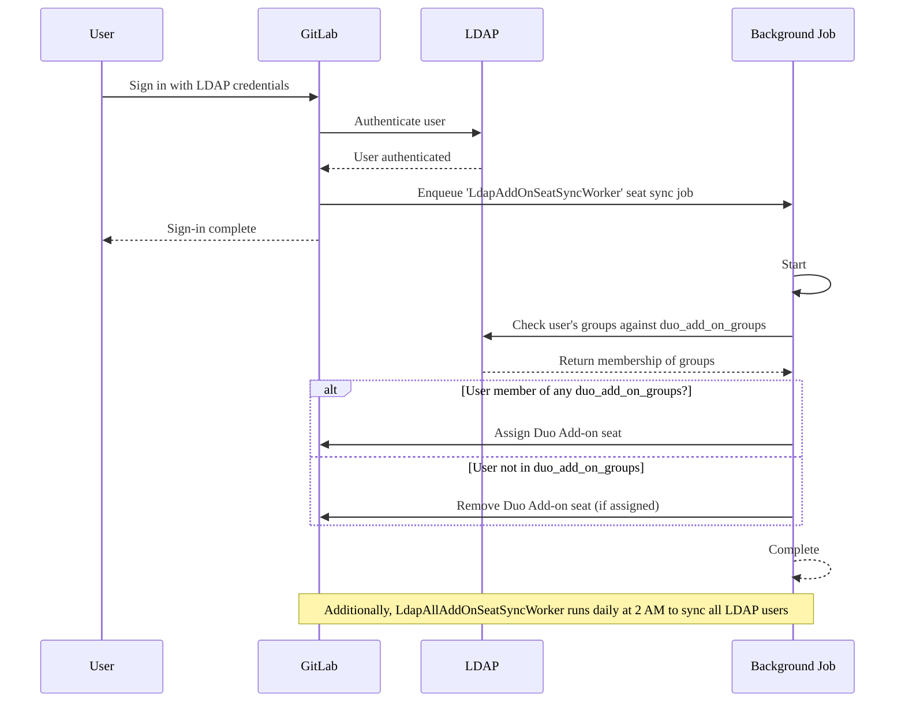



- プラン: Premium、Ultimate
- 提供形態: GitLab Self-Managed





- GitLab 17.8で[導入](https://gitlab.com/gitlab-org/gitlab/-/merge_requests/175101)されました。



GitLab管理者は、LDAPグループメンバーシップに基づいて、GitLab Duoアドオンのシートの自動割り当てを構成できます。有効にすると、GitLabはユーザーのLDAPグループメンバーシップに応じて、サインイン時にユーザーのアドオンシートを自動的に割り当てまたは削除します。

## シート管理ワークフロー {#seat-management-workflow}

1. **設定**: 管理者は、`duo_add_on_groups`のLDAPグループを[設定](#configure-duo-add-on-seat-management)で指定します。
1. **Seat synchronization**（シートの同期）: GitLabは、次の2つの方法でLDAPグループメンバーシップを確認します:
   - **On user sign-in**（ユーザーサインイン時）: ユーザーがLDAP経由でサインインすると、GitLabはそのグループメンバーシップを即座にチェックします。
   - **Scheduled sync**（定刻同期）: GitLabは、ユーザーのサインインがなくてもシートの割り当てが最新の状態になるように、毎日午前2時（サーバー時刻）にすべてのLDAPユーザーを自動的に同期します。
1. **Seat assignment**（シートの割り当て）:
   - ユーザーが`duo_add_on_groups`にリストされているグループに属している場合、（まだ割り当てられていない場合は）アドオンシートが割り当てられます。
   - ユーザーがリストされているどのグループにも属していない場合、そのアドオンシートは（以前に割り当てられている場合は）削除されます。
1. **Async processing**（非同期処理）: シートの割り当てと削除は、メインのサインインワークフローが中断されないように非同期で処理されます。

次の図は、ワークフローを示しています:



## Duoアドオンシート管理の構成 {#configure-duo-add-on-seat-management}

LDAPでアドオンシート管理を有効にするには、次のようにします:

1. [インストール](auth/ldap/ldap_synchronization.md#gitlab-duo-add-on-for-groups)用に編集したGitLab設定ファイルを開きます。
1. `duo_add_on_groups`設定をLDAPサーバーの構成に追加します。
1. Duoアドオンシートを持つ必要があるLDAPグループ名の配列を指定します。

次の例は、Linuxパッケージインストールの`gitlab.rb`構成です:

```ruby
gitlab_rails['ldap_servers'] = {
  'main' => {
    # Additional LDAP settings removed for readability
    'duo_add_on_groups' => ['duo_users', 'admins'],
  }
}
```
