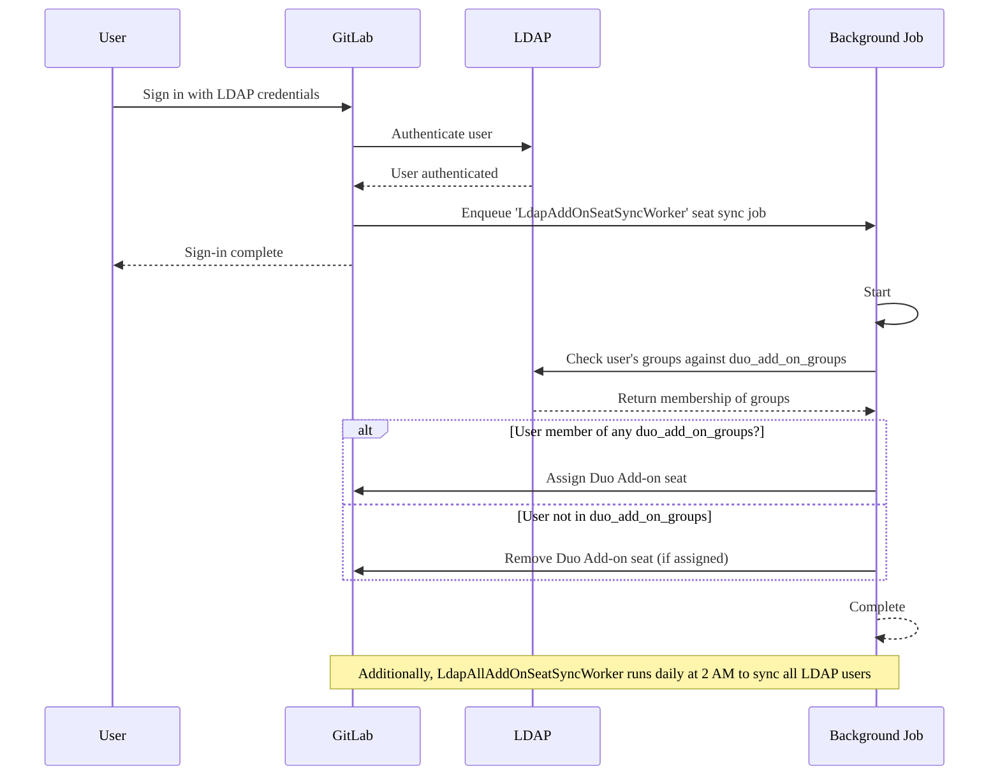



- プラン: Premium、Ultimate
- 提供形態: GitLab Self-Managed





- GitLab 17.8で[導入](https://gitlab.com/gitlab-org/gitlab/-/merge_requests/175101)されました。



GitLabの管理者は、LDAPグループメンバーシップに基づいて、GitLab Duoアドオンシートの自動割り当てを設定できます。有効にすると、ユーザーがサインインするときに、LDAPグループメンバーシップに応じて、GitLabはユーザーのアドオンシートを自動的に割り当てまたは削除します。

## シート管理ワークフロー {#seat-management-workflow}

1. **設定**: 管理者は、`duo_add_on_groups`の[設定](#configure-gitlab-duo-add-on-seat-management)でLDAPグループを指定します。
1. **Seat synchronization**: GitLabは、LDAPグループのメンバーシップを次の2つの方法で確認します:
   - **ユーザーサインイン時**: ユーザーがLDAP経由でサインインすると、GitLabはそのグループメンバーシップを即座にチェックします。
   - **定刻同期**: GitLabは、ユーザーのサインインがなくても、シートの割り当てが最新の状態になるように、毎日午前2時にすべてのLDAPユーザーを自動的に同期します。
1. **Seat assignment**:
   - ユーザーが`duo_add_on_groups`にリストされているグループに属している場合、（まだ割り当てられていない場合は）アドオンシートが割り当てられます。
   - ユーザーがリストされているグループに属していない場合、（以前に割り当てられている場合は）アドオンシートが削除されます。
1. **Async processing**: シートの割り当てと削除は非同期で処理されるため、メインのサインインフローが中断されることはありません。

次の図は、ワークフローを示しています:



## GitLab Duoアドオンシート管理を設定する {#configure-gitlab-duo-add-on-seat-management}

LDAPでアドオンシート管理をオンにするには、次の手順に従います:

1. [インストール](auth/ldap/ldap_synchronization.md#gitlab-duo-add-on-for-groups)用に編集したGitLab設定ファイルを開きます。
1. `duo_add_on_groups`設定をLDAPサーバー設定に追加します。
1. GitLab Duoアドオンシートを持つ必要があるLDAPグループ名の配列を指定します。

次の例は、Linuxパッケージインストールの`gitlab.rb`設定です:

```ruby
gitlab_rails['ldap_servers'] = {
  'main' => {
    # Additional LDAP settings removed for readability
    'duo_add_on_groups' => ['duo_users', 'admins'],
  }
}
```
