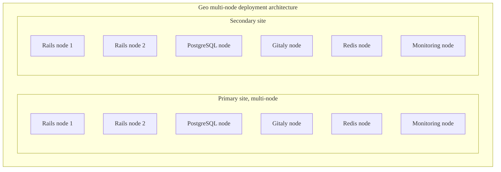



- プラン: Premium、Ultimate
- 提供形態: GitLab Self-Managed
- ステータス: 実験的機能



ディザスターリカバリー（Geo）プロモート手順書。



この手順書は[実験](../../../../policy/development_stages_support.md#experiment)です。完全な、本番環境に対応したドキュメントについては、[ディザスターリカバリードキュメント](../_index.md)を参照してください。



## マルチノード構成のGeo計画フェイルオーバー {#geo-planned-failover-for-a-multi-node-configuration}

| コンポーネント   | 設定                |
|:------------|:-----------------------------|
| PostgreSQL  | Linuxパッケージで管理 |
| Geoサイト    | マルチノード                   |
| セカンダリ | 1                          |

この手順書では、1つのセカンダリを持つマルチノードGeoサイトの計画フェイルオーバーについて説明します。次の[40 RPS / 2,000ユーザーリファレンスアーキテクチャ](../../../reference_architectures/2k_users.md)が想定されています:



ロードバランサーノードとオプションのNFSサーバーは、わかりやすくするために省略されています。

このガイドの結果は次のとおりです:

1. オフラインのプライマリ。
1. プロモートされたセカンダリ。これは新しいプライマリです。

対象外:

1. 古い**プライマリ**をセカンダリとして再度追加する。
1. 新しいセカンダリの追加。

### 準備 {#preparation}



これらの手順を実行する前に、Geoレプリカをプロモートしてフェイルオーバーを実行する自動化された方法が提供されていないため、プロモートする**セカンダリ**への`root`アクセス権があることを確認してください。



**セカンダリ**サイトの場合:

1. 左側のサイドバーの下部で、**管理者**を選択します。
1. 左側のサイドバーの下部にある**Geo** > **サイト**を選択して、ステータスを確認します。レプリケートされたオブジェクト（緑色で表示）は100%に近く、失敗（赤色で表示）がないはずです。オブジェクトの大部分がレプリケートされない場合（灰色で表示）、サイトが完了するまでさらに時間をかけることを検討してください。

   

オブジェクトのレプリケートに失敗しているものがある場合は、メンテナンス期間をスケジュールする前に調査する必要があります。計画的なフェイルオーバーの後、レプリケートに失敗したものは**lost**（失われます）。

レプリケーションの失敗の一般的な原因は、**プライマリ**サイトにデータがないことです。これらの失敗は、バックアップからデータを復元するか、不足しているデータへの参照を削除することで解決できます。

このメンテナンス期間は、Geoのレプリケーションと検証が完全に完了するまで終了しません。期間をできるだけ短くするには、アクティブな使用中にこれらのプロセスを可能な限り100%に近づけるようにする必要があります。

**セカンダリ**サイトがまだ**プライマリ**サイトからデータをレプリケートしている場合は、不要なデータ損失を回避するために、次の手順に従ってください:

1. [メンテナンスモード](../../../maintenance_mode/_index.md)を**プライマリ**サイトで有効にし、すべての[バックグラウンドジョブ](../../../maintenance_mode/_index.md#background-jobs)を停止していることを確認してください。
1. すべてのデータをレプリケートおよび検証し終わったら:

   

   すべてのデータが自動的にレプリケートされるわけではありません。[除外されるもの](../planned_failover.md#not-all-data-is-automatically-replicated)の詳細をご覧ください。

   

   1. 手動でGeoで管理されていない[データ](../../replication/datatypes.md#replicated-data-types)をレプリケートする場合は、最終的なレプリケーションプロセスを今すぐトリガーします。
   1. **プライマリ**サイトの場合:
      1. 左側のサイドバーの下部で、**管理者**を選択します。
      1. 左側のサイドバーで、**モニタリング** > **バックグラウンドジョブ**を選択します。
      1. Sidekiqダッシュボードで、**Queues**（キュー）を選択し、名前が`geo`のものを除くすべてのキューが0になるまで待ちます。これらのキューには、ユーザーが送信した作業が含まれています。完了する前にフェイルオーバーすると、作業が失われる原因になります。
      1. 左側のサイドバーで、**Geo** > **サイト**を選択し、フェイルオーバー先の**セカンダリ**サイトについて、次の条件が満たされるまで待ちます:

         - すべてのレプリケーションメーターが100% レプリケート、0% 失敗に達します。
         - すべての検証メーターが100%検証済み、0% 失敗に達します。
         - データベースのレプリケーションラグは0ミリ秒です。
         - Geoログカーソルが最新の状態です（0イベント遅延）。

   1. **セカンダリ**サイトの場合:
      1. 左側のサイドバーの下部で、**管理者**を選択します。
      1. 左側のサイドバーで、**モニタリング** > **バックグラウンドジョブ**を選択します。
      1. Sidekiqダッシュボードで、**Queues**（キュー）を選択し、すべての`geo`Geoキューがキューに登録されたジョブ0、実行中のジョブ0になるまで待ちます。
      1. [整合性チェックを実行する](../../../raketasks/check.md)して、CIアーティファクト、LFSオブジェクト、およびファイルストレージ内のアップロードの整合性を検証します。

   この時点で、**セカンダリ**サイトには、**プライマリ**サイトにあるすべての最新のコピーが含まれているため、フェイルオーバー時に何も失われることはありません。

1. この最後の手順では、**プライマリ**サイトを完全に無効にする必要があります。

   

   **プライマリ**サイトがオフラインになると、**プライマリ**サイトに保存されているデータが、**セカンダリ**サイトにレプリケートされていない可能性があります。このデータは、続行する場合は失われたものとして扱う必要があります。

   

   

   [**プライマリ**ドメインDNSレコードを更新する](../_index.md#step-4-optional-updating-the-primary-domain-dns-record)計画がある場合は、伝播を高速化するために、TTLを下げることができます。

   

   フェイルオーバーを実行する場合、書き込みが2つの異なるGitLabインスタンスで発生するスプリットブレイン状態を回避する必要があります。そのため、フェイルオーバーに備えるには、**プライマリ**サイトを無効にする必要があります:

   - **プライマリ**サイトへのSSHアクセス権がある場合は、GitLabを停止して無効にします:

     ```shell
     sudo gitlab-ctl stop
     ```

     サーバーが予期せず再起動した場合に、GitLabが再度起動しないようにします:

     ```shell
     sudo systemctl disable gitlab-runsvdir
     ```

     

     （**CentOSのみ**）CentOS 6以前では、マシンが再起動してもGitLabが起動しないようにすることが困難です（[イシュー3058](https://gitlab.com/gitlab-org/omnibus-gitlab/-/issues/3058)を参照）。`sudo yum remove gitlab-ee`でGitLabパッケージを完全にアンインストールするのが最も安全な場合があります。

     

     

     （**Ubuntu 14.04 LTS**）Upstart initシステムに基づく古いバージョンのUbuntuまたはその他のディストリビューションを使用している場合は、`root`としてマシンを再起動すると`initctl stop gitlab-runsvvdir && echo 'manual' > /etc/init/gitlab-runsvdir.override && initctl reload-configuration`でGitLabが起動しないようにすることができます。

     

   - **プライマリ**サイトへのSSHアクセス権がない場合は、マシンをオフラインにして再起動しないようにします。これを実現する方法はたくさんあるため、1つの推奨事項は避けてください。次のことを行う必要がある場合があります:

     - ロードバランサーを再構成します。
     - DNSレコードを変更します（たとえば、**プライマリ**DNSレコードを**セカンダリ**サイトに向けて、**プライマリ**サイトの使用を停止します）。
     - 仮想サーバーを停止します。
     - ファイアウォールを介したトラフィックをブロックします。
     - **プライマリ**サイトからオブジェクトストレージの権限を失効します。
     - マシンを物理的に切断します。

### **セカンダリ**サイトのプロモート {#promoting-the-secondary-site}

1. **セカンダリ**サイト内のすべてのSidekiq、PostgreSQL、およびGitalyノードにSSHで接続し、次のいずれかのコマンドを実行します:

   - セカンダリサイトをプライマリにプロモートするには:

     ```shell
     sudo gitlab-ctl geo promote
     ```

   - セカンダリサイトを**without any further confirmation**（確認なしで）プライマリにプロモートするには:

     ```shell
     sudo gitlab-ctl geo promote --force
     ```

1. **セカンダリ**サイトの各RailsノードにSSHで接続し、次のいずれかのコマンドを実行します:

   - セカンダリサイトをプライマリにプロモートするには:

     ```shell
     sudo gitlab-ctl geo promote
     ```

   - セカンダリサイトを**without any further confirmation**（確認なしで）プライマリにプロモートするには:

     ```shell
     sudo gitlab-ctl geo promote --force
     ```

1. **プライマリ**サイトに、以前に**セカンダリ**サイトで使用したURLを使用して接続できることを確認します。

1. 成功した場合、**セカンダリ**サイトが**プライマリ**サイトにプロモートされるようになりました。

### 次の手順 {#next-steps}

地理的な冗長性をできるだけ早く回復するには、[**セカンダリ**サイトを追加](../../setup/_index.md)する必要があります。これを行うには、古い**プライマリ**を新しいセカンダリとして再度追加し、オンラインに戻します。
