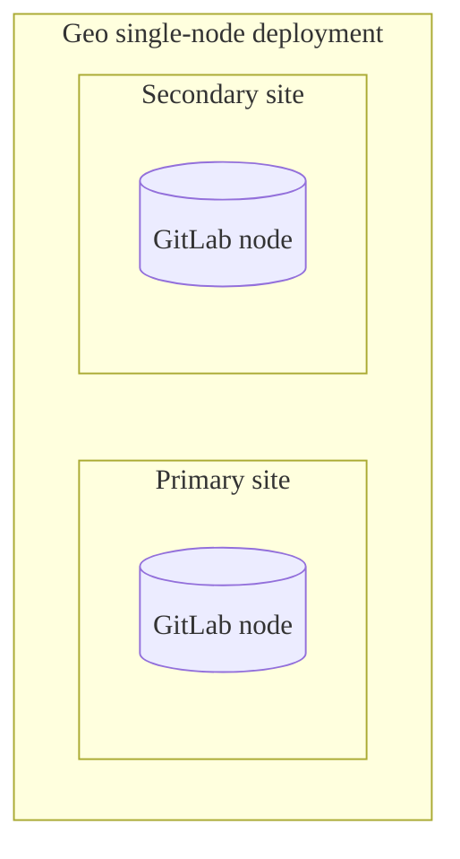



- プラン: Premium、Ultimate
- 提供形態: GitLab Self-Managed
- ステータス: 実験的機能



ディザスターリカバリー（Geo）ジョブの手順書。



この手順書は[実験](../../../../policy/development_stages_support.md#experiment)です。完全な本番環境対応のドキュメントについては、[ディザスターリカバリドキュメント](../_index.md)を参照してください。



## シングルノード構成のGeo計画フェイルオーバー {#geo-planned-failover-for-a-single-node-configuration}

| コンポーネント   | 設定                |
|:------------|:-----------------------------|
| PostgreSQL  | Linuxパッケージで管理 |
| Geoサイト    | シングルノード                  |
| セカンダリ | 1                          |

この手順書では、1つのセカンダリを持つシングルノードのGeoサイトの計画フェイルオーバーについて説明します。次の一般的なアーキテクチャを想定しています:



このガイドの結果は次のとおりです:

1. オフラインのプライマリ。
1. プロモートされたセカンダリが、新しいプライマリになりました。

対象外:

1. 古い**プライマリ**をセカンダリとして再度追加。
1. 新しいセカンダリの追加。

### 準備 {#preparation}



これらの手順を実行する前に、Geoレプリカをプロモートしてフェイルオーバーを実行する自動化された方法がないため、**セカンダリ**をプロモートするための`root`アクセス権があることを確認してください。



**セカンダリ**サイトで、**管理者エリア** > **Geo**ダッシュボードに移動して、ステータスを確認します。レプリケートされたオブジェクト（緑色で表示）は100％に近く、エラー（赤色で表示）はないはずです。オブジェクトの大部分がまだレプリケートされていない場合（灰色で表示）、サイトが完了するまでもう少し時間をかけてください。


オブジェクトのレプリケートに失敗しているものがある場合は、メンテナンス期間をスケジュールする前に調査する必要があります。計画的なフェイルオーバーの後、レプリケートに失敗したものは**lost**（失われます）。

レプリケーションの失敗の一般的な原因は、**プライマリ**サイトでデータが失われていることです。これらの失敗は、バックアップからデータを復元するか、見つからないデータへの参照を削除することで解決できます。

Geoのレプリケーションと検証が完全に終了するまで、メンテナンス期間は終了しません。期間をできるだけ短くするには、アクティブな使用中にこれらのプロセスが可能な限り100％に近づいていることを確認する必要があります。

**セカンダリ**サイトがまだ**プライマリ**サイトからデータをレプリケートしている場合は、不要なデータ損失を回避するために、次の手順に従ってください:

1. [読み取り専用モード](https://gitlab.com/gitlab-org/gitlab/-/issues/14609)が実装されるまで、**プライマリ**への手動による更新を防止する必要があります。メンテナンス期間中、**セカンダリ**サイトは**プライマリ**サイトへの読み取り専用アクセスを必要とします:

   1. スケジュールされた時間に、クラウドプロバイダーまたはサイトのファイアウォールを使用して、**プライマリ**サイトとの間のすべてのHTTP、HTTPS、およびSSHトラフィックを、自分のIPと**セカンダリ**サイトのIPを除き、**except**（ブロック）します。

      たとえば、**プライマリ**サイトで次のコマンドを実行できます:

      ```shell
      sudo iptables -A INPUT -p tcp -s <secondary_site_ip> --destination-port 22 -j ACCEPT
      sudo iptables -A INPUT -p tcp -s <your_ip> --destination-port 22 -j ACCEPT
      sudo iptables -A INPUT --destination-port 22 -j REJECT

      sudo iptables -A INPUT -p tcp -s <secondary_site_ip> --destination-port 80 -j ACCEPT
      sudo iptables -A INPUT -p tcp -s <your_ip> --destination-port 80 -j ACCEPT
      sudo iptables -A INPUT --tcp-dport 80 -j REJECT

      sudo iptables -A INPUT -p tcp -s <secondary_site_ip> --destination-port 443 -j ACCEPT
      sudo iptables -A INPUT -p tcp -s <your_ip> --destination-port 443 -j ACCEPT
      sudo iptables -A INPUT --tcp-dport 443 -j REJECT
      ```

      この時点から、ユーザーは**プライマリ**サイトでデータを表示したり、変更を加えたりすることができなくなります。また、**セカンダリ**サイトにサインインすることもできません。ただし、既存のセッションはメンテナンス期間の残りの期間動作する必要があるため、パブリックデータは全体を通してアクセス可能です。

   1. 別のIPを介してブラウザでアクセスすることにより、**プライマリ**サイトがHTTPトラフィックに対してブロックされていることを確認します。サーバーは接続を拒否する必要があります。

   1. SSHリモートURLを使用して既存のGitリポジトリをプルしようとすることにより、**プライマリ**サイトがSSH経由のGitトラフィックに対してブロックされていることを確認します。サーバーは接続を拒否する必要があります。

   1. **プライマリ**サイトで次の手順に従います:
      1. 左側のサイドバーの下部で、**管理者**を選択します。
      1. 左側のサイドバーで、**モニタリング** > **バックグラウンドジョブ**を選択します。
      1. Sidekiqダッシュボードで、**Cron**を選択します。
      1. Geo以外の定期的なバックグラウンドジョブを無効にするには、`Disable All`を選択します。
      1. `geo_sidekiq_cron_config_worker` cronジョブの`Enable`を選択します。このジョブは、計画的なフェイルオーバーを正常に完了するために不可欠ないくつかの他のcronジョブを再度有効にします。

1. すべてのデータのレプリケーションと検証を完了します:

   

   すべてのデータが自動的にレプリケートされるわけではありません。[除外](../planned_failover.md#not-all-data-is-automatically-replicated)されるものについて詳しくは、こちらをご覧ください。

   

   1. 手動で[Geoで管理されていないデータ](../../replication/datatypes.md#replicated-data-types)をレプリケートしている場合は、今すぐ最終的なレプリケーションプロセスをトリガーします。
   1. **プライマリ**サイトで次の手順に従います:
      1. 左側のサイドバーの下部で、**管理者**を選択します。
      1. 左側のサイドバーで、**モニタリング** > **バックグラウンドジョブ**を選択します。
      1. Sidekiqダッシュボードで、**Queues**を選択し、名前が`geo`のものを除くすべてのキューが0になるまで待ちます。これらのキューには、ユーザーが送信した作業が含まれています。完了する前にフェイルオーバーすると、作業が失われます。
      1. 左側のサイドバーで、**Geo** > **サイト**を選択し、フェイルオーバー先の**セカンダリ**サイトについて、次の条件が満たされるまで待ちます:

         - すべてのレプリケーションメーターが100％レプリケート、0％失敗に達します。
         - すべての検証メーターが100％検証済み、0％失敗に達します。
         - データベースのレプリケーションのラグは0ミリ秒です。
         - Geoログカーソルが最新の状態です（0イベント遅れています）。

   1. **セカンダリ**サイトの場合:
      1. 左側のサイドバーの下部で、**管理者**を選択します。
      1. 左側のサイドバーで、**モニタリング** > **バックグラウンドジョブ**を選択します。
      1. Sidekiqダッシュボードで、**Queues**を選択し、すべての`geo`キューが0 queuedおよび0 runningジョブにドロップするまで待ちます。
      1. [整合性チェックを実行](../../../raketasks/check.md)して、ファイルストレージ内のCIアーティファクト、LFSオブジェクト、およびアップロードの整合性を確認します。

   この時点で、**セカンダリ**サイトには、**プライマリ**サイトにあるすべての最新のコピーが含まれているため、フェイルオーバー時に何も失われません。

1. この最後のステップでは、**プライマリ**サイトを完全に無効にする必要があります。

   

   **プライマリ**サイトがオフラインになると、**プライマリ**サイトに保存されているデータが**セカンダリ**サイトにレプリケートされていない可能性があります。続行する場合は、このデータは失われたものとして扱う必要があります。

   

   

   [**プライマリ**ドメインDNSレコード](../_index.md#step-4-optional-updating-the-primary-domain-dns-record)を更新する予定がある場合は、伝播を高速化するために、今すぐTTLを短くすることをお勧めします。

   

   フェイルオーバーを実行する場合、2つの異なるGitLabインスタンスで書き込みが発生するスプリットブレイン状態を回避する必要があります。そのため、フェイルオーバーに備えるには、**プライマリ**サイトを無効にする必要があります:

   - **プライマリ**サイトへのSSHアクセスがある場合は、GitLabを停止して無効にします:

     ```shell
     sudo gitlab-ctl stop
     ```

     サーバーが予期せず再起動した場合、GitLabが再び起動しないようにします:

     ```shell
     sudo systemctl disable gitlab-runsvdir
     ```

     

     （**CentOS only**（CentOSのみ））CentOS 6以前では、マシンの再起動が利用できない場合、GitLabが起動するのを防ぐ簡単な方法はありません（[イシュー3058](https://gitlab.com/gitlab-org/omnibus-gitlab/-/issues/3058)を参照）。`sudo yum remove gitlab-ee`を使用して、GitLabパッケージを完全にアンインストールするのが最も安全な場合があります。

     

     

     （**Ubuntu 14.04 LTS**）Upstart initシステムに基づく古いバージョンのUbuntuまたはその他のディストリビューションを使用している場合は、`root`としてマシンが再起動した場合、GitLabが起動しないようにすることができます。`initctl stop gitlab-runsvvdir && echo 'manual' > /etc/init/gitlab-runsvdir.override && initctl reload-configuration`。

     

   - **プライマリ**サイトへのSSHアクセスがない場合は、マシンをオフラインにして再起動しないようにします。これを達成するために好む方法が多数あるため、単一の推奨事項は避けています。必要に応じて:

     - ロードバランサーを再構成します。
     - DNSレコードを変更します（たとえば、**プライマリ**DNSレコードを**セカンダリ**サイトにポイントして、**プライマリ**サイトの使用を停止します）。
     - 仮想サーバーを停止します。
     - ファイアウォールを介してトラフィックをブロックします。
     - **プライマリ**サイトからオブジェクトストレージの権限を失効する。
     - マシンを物理的に切断します。

### **セカンダリ**サイトのプロモート {#promoting-the-secondary-site}

セカンダリのプロモート時に、以下に注意してください:

- 新しい**セカンダリ**をこの時追加しないでください。新しい**セカンダリ**を追加する場合は、**セカンダリ**を**プライマリ**にプロモートするプロセス全体を完了した後に行います。
- このプロセス中に`ActiveRecord::RecordInvalid: Validation failed: Name has already been taken`エラーが発生した場合は、[トラブルシューティングのアドバイス](../failover_troubleshooting.md#fixing-errors-during-a-failover-or-when-promoting-a-secondary-to-a-primary-site)をお読みください。

セカンダリサイトをプロモートするには:

1. **セカンダリ**サイトにSSHでログインし、次のいずれかのコマンドを実行します:

   - セカンダリサイトをプライマリにプロモートするには:

     ```shell
     sudo gitlab-ctl geo promote
     ```

   - **without any further confirmation**（それ以上の確認なしに）セカンダリサイトをプライマリにプロモートするには:

     ```shell
     sudo gitlab-ctl geo promote --force
     ```

1. 以前に**セカンダリ**サイトに使用したURLを使用して、新しくプロモートされた**プライマリ**サイトに接続できることを確認します。

   成功した場合、**セカンダリ**サイトが**プライマリ**サイトにプロモートされました。

### 次の手順 {#next-steps}

地理的な冗長性をできるだけ早く回復するには、[新しい**セカンダリ**サイトを追加する](../../setup/_index.md)必要があります。これを行うには、古い**プライマリ**を新しいセカンダリとして再度追加して、オンラインに戻すことができます。
