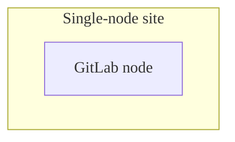
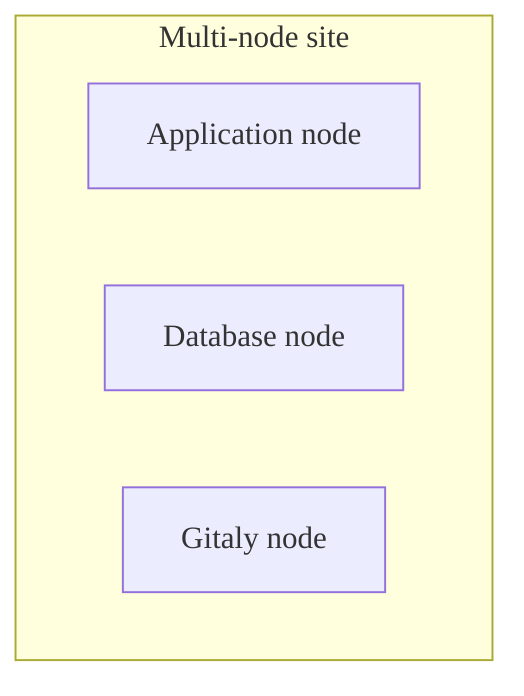
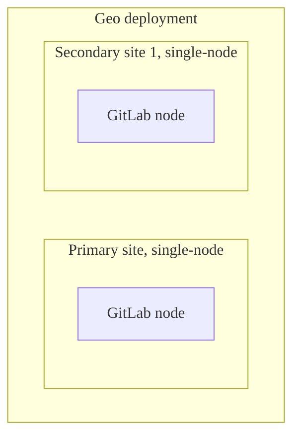
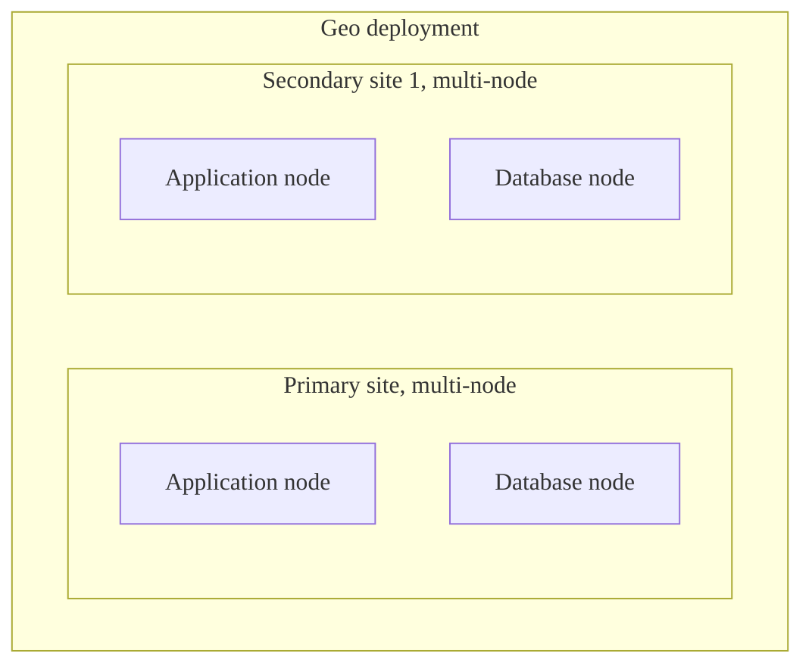
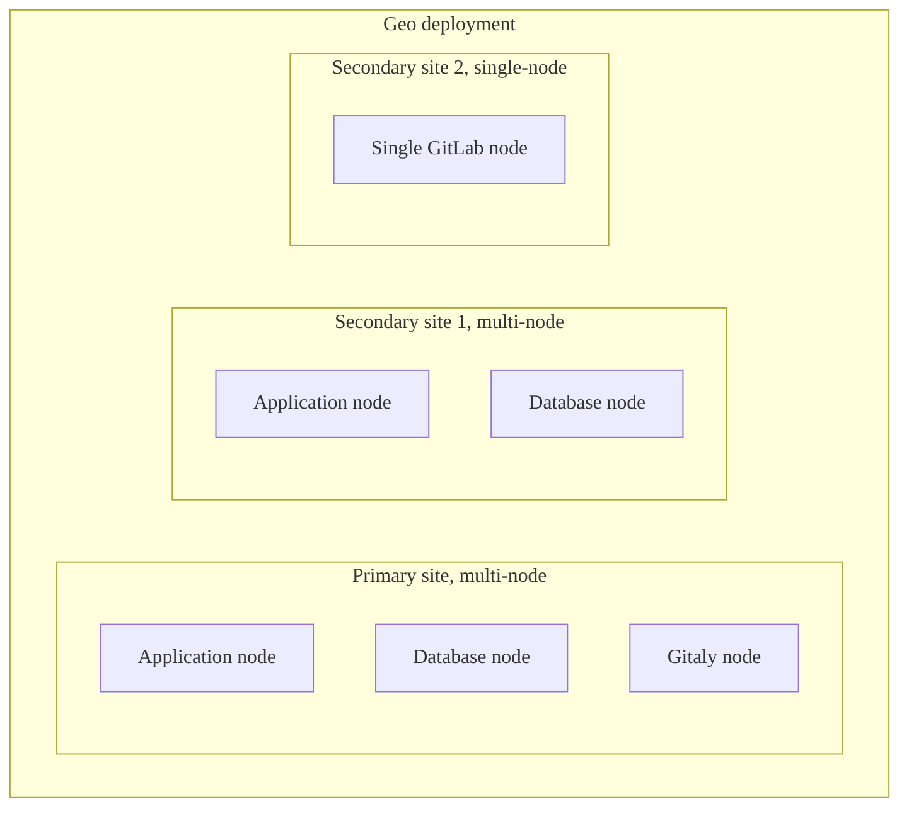



- プラン: Premium、Ultimate
- 提供形態: GitLab Self-Managed





これらの変更を反映するために、Geoドキュメント、ユーザーインターフェース、およびコマンドを更新しています。まだこれらの定義に準拠していないページもあります。



これらは、Geoのすべての側面を説明するために定義された用語です。明確に定義された用語を使用することで、効率的にコミュニケーションを図り、混乱を避けることができます。このページの言語は、ユビキタスであること、そして可能な限りシンプルであることを目指しています。

## 主な用語 {#main-terms}

用語の正しい使い方を示すために、[図と記述例](#examples)を示します。

| 用語                   | 定義                                                                                                                                                                                     | スコープ        | 推奨されない同義語                            |
|------------------------|------------------------------------------------------------------------------------------------------------------------------------------------------------------------------------------------|--------------|-------------------------------------------------|
| Node                   | 個々のサーバーは、特定のロールを持つか、全体としてGitLabを実行します（たとえば、Railsアプリケーションノード）。クラウド環境では、これは特定のマシンタイプである可能性があります。                | GitLab       | インスタンス、サーバー                                |
| サイト                   | 単一のGitLabアプリケーションを実行するノードの1つまたはコレクション。サイトは、シングルノードまたはマルチノードにすることができます。                                                                                     | GitLab       | デプロイ、インストールインスタンス               |
| シングルノードサイト       | 1つのノードだけを使用するGitLabの特定設定。                                                                                                                                 | GitLab       | シングルサーバー、シングルインスタンス                  |
| マルチノードサイト        | 複数のノードを使用するGitLabの特定設定。                                                                                                                               | GitLab       | マルチサーバー、マルチインスタンス、高可用性 |
| 1つのプライマリサイト。           | 少なくとも1つのセカンダリサイトによってデータがレプリケーションされているGitLabサイト。プライマリサイトは1つしか存在できません。                                                                          | Geo固有 | Geoデプロイ、プライマリノード                    |
| セカンダリサイト         | プライマリサイトのデータをレプリケーションするように設定されているGitLabサイト。1つまたは複数のセカンダリサイトを設定できます。                                                                            | Geo固有 | Geoデプロイ、セカンダリノード                  |
| Geoデプロイ         | 1つまたは複数のセカンダリサイトによってレプリケーションされるプライマリサイトが1つだけである、2つ以上のGitLabサイトの集合。                                                                        | Geo固有 |                                                 |
| リファレンスアーキテクチャ: | 複数のノードと複数のサイトを含む可能性のある、[1秒あたりのリクエスト数またはユーザー数に基づくGitLabの指定された設定](../reference_architectures/_index.md)。                  | GitLab       |                                                 |
| プロモート              | サイトのロールをセカンダリからプライマリに変更すること。                                                                                                                                         | Geo固有 |                                                 |
| デモート               | サイトのロールをプライマリからセカンダリに変更すること。                                                                                                                                         | Geo固有 |                                                 |
| フェイルオーバー               | プライマリサイトからセカンダリサイトにユーザーを移行するプロセス全体。これにはセカンダリのプロモートが含まれますが、他の部分も含まれます。たとえば、メンテナンスのスケジュール。      | Geo固有 |                                                 |
| レプリケーション            | 「同期」とも呼ばれます。プライマリサイト上のリソースと一致するようにセカンダリサイト上のリソースを更新する一方向プロセス。                                              | Geo固有 |                                                 |
| レプリケーションスロット       | データベースとの永続的な接続ポイントを保証し、スタンバイサーバーでまだ必要なWALセグメントを追跡するPostgreSQLレプリケーション機能。サイトの`geo_node_name`に一致するようにレプリケーションスロットに名前を付けると役立つ場合がありますが、必須ではありません。 | PostgreSQL   |                                                 |
| 検証           | プライマリサイトに存在するデータとセカンダリサイトにレプリケーションされたデータを比較するプロセス。レプリケートされたデータの整合性を確保するために使用されます。                                        | Geo固有 |                                                 |
| 統合URL            | すべてのGeoサイトに使用される単一の外部URL。リクエストをプライマリGeoサイトまたはセカンダリGeoサイトにルーティングできます。                                                          | Geo固有 |                                                 |
| Geoプロキシ           | セカンダリGeoサイトが、セカンダリGeoサイトでローカルに処理できる特定の操作を除き、操作をプライマリサイトに透過的に転送するメカニズム。                  | Geo固有 |                                                 |
| Blob                   | さまざまなGitLabコンポーネントをカバーするためにレプリケーションできるGeo関連のデータ型。                                                                                                              | Geo固有 | ファイル                                            |

## レプリケーター用語 {#replicator-terms}

Geoは、プライマリサイトとセカンダリサイトの間で、個々のGitLabコンポーネントのデータをレプリケートするためにレプリケーターを使用します。これらのコンポーネントの個々の[データ型](replication/datatypes.md#data-types)をどのように処理および検証する必要があるかを定義します。たとえば、GitLabコンテナレジストリのデータは、CIジョブアーティファクトとは異なる方法で処理する必要があります。一部のコンポーネントには、複数のレプリケーターがある場合があり、名前も異なる可能性があります。そのため、次の表では、レプリケーターの名前と、それらが属するGitLabコンポーネントについて説明します。

同じレプリケーター名は、管理者エリアのGeoセクション、またはGeo関連のコンソールコマンドを使用する場合にも表示されます。

| Geoレプリケーター名            | GitLabコンポーネント名                  |
|--------------------------------|----------------------------------------|
| CIセキュアファイル                | CIセキュアファイル                        |
| コンテナリポジトリ         | コンテナレジストリ                     |
| 依存プロキシblob。         | 依存プロキシイメージ                |
| 依存プロキシmanifest。     | 依存プロキシイメージ                |
| 設計管理リポジトリ | プロジェクト設計リポジトリ             |
| グループウィキリポジトリ        | グループウィキリポジトリ                  |
| CIジョブアーティファクト               | CIジョブアーティファクト                       |
| LFSオブジェクト                    | LFSオブジェクト                            |
| マージリクエストの差分            | 外部マージリクエストの差分           |
| パッケージファイル                  | パッケージレジストリ                       |
| ページデプロイ              | Pages                                  |
| パイプラインアーティファクト             | パイプラインアーティファクト                     |
| プロジェクトリポジトリ           | プロジェクトリポジトリ                     |
| プロジェクトウィキリポジトリ      | プロジェクトウィキリポジトリ                |
| スニペットリポジトリ           | 個人スニペットとプロジェクトスニペット |
| Terraformステートバージョン       | バージョニングされたTerraformステート              |
| アップロード                        | ユーザーアップロード                           |

## 例 {#examples}

### シングルノードサイト {#single-node-site}

### マルチノードサイト {#multi-node-site}

### Geoデプロイ - シングルノードサイト {#geo-deployment---single-node-sites}

このGeoデプロイには、シングルノードプライマリサイト、シングルノードセカンダリサイトがあります:

### Geoデプロイ - マルチノードサイト {#geo-deployment---multi-node-sites}

このGeoデプロイには、マルチノードプライマリサイト、マルチノードセカンダリサイトがあります:

### Geoデプロイ - 混合サイト {#geo-deployment---mixed-sites}

このGeoデプロイには、マルチノードプライマリサイト、マルチノードセカンダリサイト、および別のシングルノードセカンダリサイトがあります:

