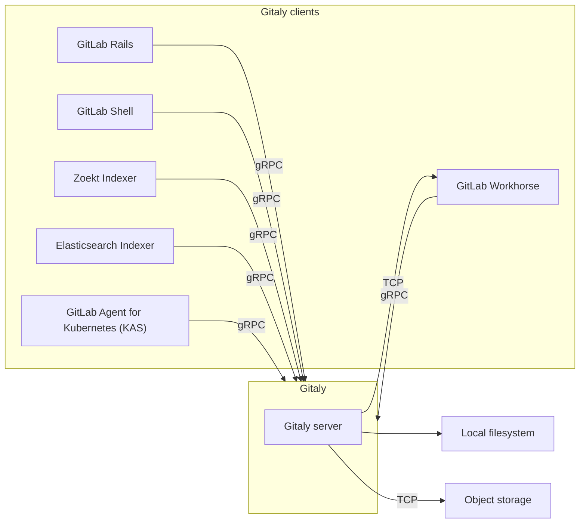



- プラン: Free、Premium、Ultimate
- 提供形態: GitLab Self-Managed



[Gitaly](https://gitlab.com/gitlab-org/gitaly)は、Gitリポジトリへの高レベルRPC（リモートプロシージャコール）アクセスを提供します。GitLabは、Gitデータの読み書きにGitalyを使用します。

GitalyはすべてのGitLabインストールに存在し、Gitリポジトリのストレージと取得を調整します。Gitalyは次のように動作します。

- 単一インスタンスのLinuxパッケージインストール（1台のマシン上でGitLab全体を実行する）でバックグラウンドサービスとして動作する。
- スケーリングや可用性の要件に応じて、独自のインスタンスに分離され、完全なクラスター設定で設定される。



Gitalyは、GitLabのGitリポジトリへのアクセスのみを管理しています。それ以外の種類のGitLabデータへのアクセスには、Gitalyを使用しません。



GitLabは、設定された[リポジトリストレージ](../repository_storage_paths.md)を通じて[リポジトリ](../../user/project/repository/_index.md)にアクセスします。新しいリポジトリはそれぞれ[設定されたウェイト](../repository_storage_paths.md#configure-where-new-repositories-are-stored)に基づいて、いずれかのリポジトリストレージに保存されます。各リポジトリストレージは次のいずれかです。

- [ストレージパス](../repository_storage_paths.md)を使用してリポジトリに直接アクセスするGitalyストレージ。各リポジトリは単一のGitalyノードに保存され、すべてのリクエストはこのノードにルーティングされます。
- [Gitaly Cluster (Praefect)](praefect/_index.md)によって提供される[仮想ストレージ](praefect/_index.md#virtual-storage)で、各リポジトリは、フォールトトレランスのために複数のGitalyノードに保存されることがあります。Gitalyクラスター（Praefect）の場合:
  - 読み取りリクエストは複数のGitalyノードに分散され、パフォーマンスが向上します。
  - 書き込みリクエストはリポジトリのレプリカにブロードキャストされます。

以下は、Gitalyへの直接アクセスを使用するよう設定されたGitLabを示しています。

この例では、次のように動作します。

- 各リポジトリは、3つのGitalyストレージ（`storage-1`、`storage-2`、`storage-3`）のいずれかに保存されます。
- 各ストレージは、Gitalyノードによって処理されます。
- 3つのGitalyノードは、それぞれのファイルシステムにデータを保存します。

## ディスク要件 {#disk-requirements}

GitalyとGitalyクラスター (Praefect) は、I/O負荷の高いプロセスであるため、効果的に動作させるには高速ローカルストレージが必要です。そのため、すべてのGitalyノードでソリッドステートドライブ（SSD）を使用することを強くおすすめします。これらのSSDは、Gitalyが多くの小さなファイルを並行処理でオペレートするため、高い読み取りおよび書き込みスループットが必要です。

参考として、次のチャートは、GitLab.com上のGitalyの本番環境フリート全体のP99ディスクIOPSを1分単位で示しています。データは、月曜日の朝に始まり、月曜日の朝に終わる7日間の代表的な期間からクエリされました。稼働週におけるトラフィック増加に伴い、IOPSが定期的にスパイクしていることがわかります。Rawデータではさらに大きなスパイクが確認でき、書き込みは最大で8000 IOPSに達しました。ディスクのスループットは、こうしたスパイクを処理できる必要があり、Gitalyリクエストの途切れを防ぐ上で不可欠です。

- P99ディスクIOPS（読み取り）：

  

- P99ディスクIOPS（書き込み）：

  

通常、次のようになります。

- 1秒あたり500〜1000読み取り、ピーク時は1秒あたり3500読み取り。
- 1秒あたり約500回の書き込み、ピーク時は1秒あたり3000回以上の書き込み。

執筆時点でのGitalyフリートの大部分は、`t2d-standard-32`インスタンスと`pd-ssd`ディスクです。[Advertised](https://cloud.google.com/compute/docs/disks/performance#t2d_instances)（アドバタイズ）されている最大書き込みおよび読み取りIOPSは60,000です。

GitLab.comでは、GitLab Self-Managedインスタンスではデフォルトで有効になっていない、コストの大きいGit操作に対して、より厳格な[並行処理制限](concurrency_limiting.md)を設けています。反対に、並行処理制限が緩い場合や、特に大規模モノレポに対する操作、あるいは[pack-objectsキャッシュ](configure_gitaly.md#pack-objects-cache)の利用などによっても、ディスクアクティビティーは大幅に増加する可能性があります。

実際には、独自の環境では、Gitalyインスタンスで観察されるディスクアクティビティーは、公開されているこれらの結果とは大きく異なる場合があります。クラウドプロバイダー環境で実行している場合、より大きなインスタンスを選択すると、通常、利用可能なディスクIOPSが増加します。スループットが保証されたプロビジョニングされたIOPSディスクタイプを選択することもできます。IOPSを正しく構成する方法については、クラウドプロバイダーのドキュメントを参照してください。

リポジトリデータについては、パフォーマンスと一貫性の理由から、GitalyとGitalyクラスター (Praefect) ではローカルストレージのみがサポートされています。[NFS](../nfs.md)や[クラウドベースのファイルシステム](../nfs.md#avoid-using-cloud-based-file-systems)などの代替手段はサポートされていません。

## Gitalyアーキテクチャ {#gitaly-architecture}

Gitalyはクライアント/サーバーアーキテクチャを実装しています。

- Gitalyサーバーとは、Gitaly自体を実行しているノードのことです。
- Gitalyクライアントとは、Gitalyサーバーにリクエストを送信するプロセスを実行するノードのことです。Gitalyクライアントは、Gitalyコンシューマーとも呼ばれ、次が含まれます。
  - [GitLab Railsアプリケーション](https://gitlab.com/gitlab-org/gitlab)
  - [GitLab Shell](https://gitlab.com/gitlab-org/gitlab-shell)
  - [GitLab Workhorse](https://gitlab.com/gitlab-org/gitlab-workhorse)
  - [GitLab Elasticsearch Indexer](https://gitlab.com/gitlab-org/gitlab-elasticsearch-indexer)
  - [GitLab Zoekt Indexer](https://gitlab.com/gitlab-org/gitlab-zoekt-indexer)
  - [Kubernetes向けGitLabエージェント（KAS）](https://gitlab.com/gitlab-org/cluster-integration/gitlab-agent)

以下は、Gitalyのクライアント/サーバーアーキテクチャを示しています。

## GitalyのConfigure {#configuring-gitaly}

Gitalyは、Linuxパッケージインストールにあらかじめ設定された状態で提供されており、この設定は[最大20 RPS/1,000ユーザーに適しています](../reference_architectures/1k_users.md)。想定する規模に応じて以下を参照してください。

- 最大40 RPS/2,000ユーザーまでのLinuxパッケージインストールについては、[個別のGitaly設定手順](../reference_architectures/2k_users.md#configure-gitaly)を参照してください。
- 自己コンパイルインストールまたはカスタムGitalyインストールについては、[Gitalyを設定する](configure_gitaly.md)を参照してください。

毎日Git書き込みオペレーションを行うアクティブユーザーが2,000人を超えるGitLabインストールでは、Gitalyクラスター (Praefect) の使用が最適な場合があります。

## Gitalyコマンドラインインターフェース（CLI） {#gitaly-cli}



- GitLab 17.4で、`gitaly git`サブコマンドが[導入](https://gitlab.com/gitlab-org/gitaly/-/merge_requests/7119)されました。



`gitaly`コマンドは、Gitaly管理者に追加のサブコマンドを提供するコマンドラインインターフェースです。たとえば、Gitaly CLIは次の用途に使用されます。

- リポジトリに対して[カスタムGitフックを設定](../server_hooks.md)する。
- Gitalyの設定ファイルを検証する。
- 内部Gitaly APIにアクセスできることを確認する。
- ディスク上のリポジトリに対して[Gitコマンドを実行](troubleshooting.md#use-gitaly-git-when-git-is-required-for-troubleshooting)する。

その他のサブコマンドの詳細については、`sudo -u git -- /opt/gitlab/embedded/bin/gitaly --help`コマンドを実行してください。

## リポジトリをバックアップする {#backing-up-repositories}

GitLab以外のツールを使用してリポジトリをバックアップまたは同期する場合は、リポジトリデータのコピー中に[書き込みを防止](../backup_restore/backup_gitlab.md#prevent-writes-and-copy-the-git-repository-data)する必要があります。

## バンドルURI {#bundle-uris}

Gitalyでは、Gitの[バンドルURI](https://git-scm.com/docs/bundle-uri)を使用できます。詳細については、[バンドルURIに関するドキュメント](bundle_uris.md)を参照してください。

## リポジトリへの直接アクセス {#directly-accessing-repositories}

Gitクライアントやその他のツールを使用して、ディスクに保存されているGitalyリポジトリに直接アクセスすることはおすすめしません。これは、Gitalyが継続的に改善および変更されているためです。これらの改善により、前提としていたことが無効になり、パフォーマンスの低下、不安定化、さらにはデータ損失が発生する可能性があります。次に例を示します。

- Gitalyには、[`info/refs`アドバタイズメントキャッシュ](https://gitlab.com/gitlab-org/gitaly/blob/master/doc/design_diskcache.md)のような最適化機能があり、公式のgRPCインターフェースを利用してリポジトリへのアクセスを制御およびモニタリングすることで成り立っています。
- [Gitaly Cluster (Praefect)](praefect/_index.md)には、フォールトトレランスや[分散読み取り](praefect/_index.md#distributed-reads)といった最適化機能があり、gRPCインターフェースとデータベースを用いてリポジトリの状態を判断することで実現されています。



Gitリポジトリへの直接アクセスは、ご自身の責任で行ってください。サポートは提供されていません。


