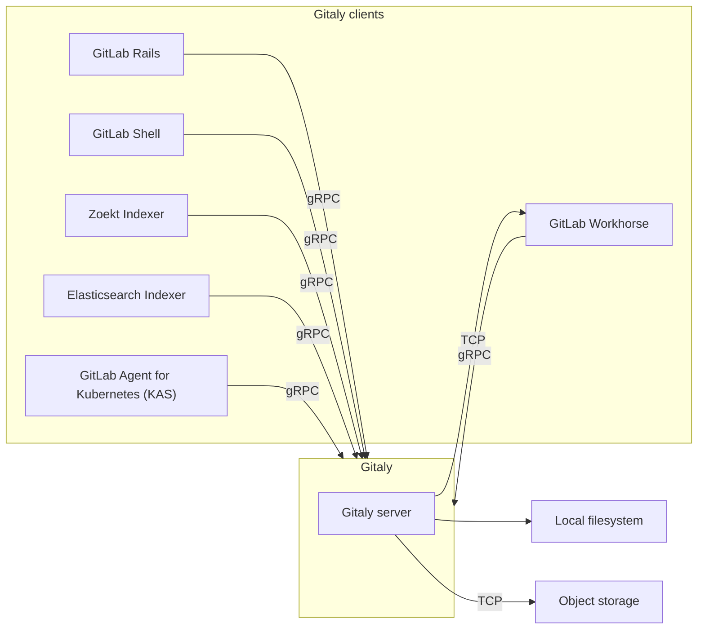



- プラン: Free、Premium、Ultimate
- 提供形態: GitLab Self-Managed



[Gitaly](https://gitlab.com/gitlab-org/gitaly)は、Gitリポジトリへの高レベルRPCアクセスを提供します。GitLabは、Gitデータを読み書きするためにGitalyを使用します。

GitalyはすべてのGitLabインストールに存在し、Gitリポジトリのストレージと取得を調整します。Gitalyは次のように動作します。

- 単一インスタンスのLinuxパッケージインストール（1台のマシン上でGitLab全体を実行する）でバックグラウンドサービスとして動作する。
- スケーリングや可用性の要件に応じて、独自のインスタンスに分離され、完全なクラスター構成で設定される。

Gitalyはクライアント/サーバーアーキテクチャを実装しています。

- Gitalyサーバーとは、Gitaly自体を実行しているノードのことです。
- Gitalyクライアントとは、Gitalyサーバーにリクエストを送信するプロセスを実行するノードのことです。Gitalyクライアントは、_Gitalyコンシューマー_とも呼ばれ、次が含まれます。
  - [GitLab Railsアプリケーション](https://gitlab.com/gitlab-org/gitlab)
  - [GitLab Shell](https://gitlab.com/gitlab-org/gitlab-shell)
  - [GitLab Workhorse](https://gitlab.com/gitlab-org/gitlab-workhorse)
  - [GitLab Elasticsearch Indexer](https://gitlab.com/gitlab-org/gitlab-elasticsearch-indexer)
  - [GitLab Zoekt Indexer](https://gitlab.com/gitlab-org/gitlab-zoekt-indexer)
  - [Kubernetes向けGitLabエージェント（KAS）](https://gitlab.com/gitlab-org/cluster-integration/gitlab-agent)

Gitalyは、GitLabのGitリポジトリへのアクセスのみを管理しています。それ以外の種類のGitLabデータへのアクセスには、Gitalyは使用されません。

GitLabは、設定された[リポジトリストレージ](../repository_storage_paths.md)を通じて[リポジトリ](../../user/project/repository/_index.md)にアクセスします。新しいリポジトリはそれぞれ[設定されたウェイト](../repository_storage_paths.md#configure-where-new-repositories-are-stored)に基づいて、いずれかのリポジトリストレージに保存されます。各リポジトリストレージは次のいずれかです。

- [ストレージパス](../repository_storage_paths.md)を使用してリポジトリに直接アクセスするGitalyストレージ。各リポジトリは単一のGitalyノードに保存され、すべてのリクエストはこのノードにルーティングされます。
- [Gitaly Cluster](#gitaly-cluster)によって提供される[仮想ストレージ](#virtual-storage)。各リポジトリは、フォールトトレランスのために複数のGitalyノードに保存されることがあります。Gitaly Clusterでは次のようにリクエストを処理します。
  - 読み取りリクエストは複数のGitalyノードに分散され、パフォーマンスが向上します。
  - 書き込みリクエストはリポジトリのレプリカにブロードキャストされます。

## Gitaly Clusterをデプロイする前に

Gitaly Clusterはフォールトトレランスの利点を提供しますが、セットアップと管理がさらに複雑になります。Gitaly Clusterをデプロイする前に、以下を参照してください。

- [既知の問題](#known-issues)。
- [スナップショットによるバックアップとリカバリー](#snapshot-backup-and-recovery)。
- [設定ガイダンス](configure_gitaly.md)と[リポジトリストレージのオプション](../repository_storage_paths.md)を参照して、Gitaly Clusterが最適なセットアップであることを確認してください。

まだGitaly Clusterに移行していない場合、次の2つのオプションがあります。

- シャーディングされたGitalyインスタンス
- Gitaly Cluster

ご不明な点がある場合は、[カスタマーサクセスマネージャー](https://handbook.gitlab.com/job-families/sales/customer-success-management/)またはカスタマーサポートにお問い合わせください。

### 既知の問題

次の表は、Gitaly Clusterの使用に影響を与える、現時点における既知の問題の概要を示しています。これらの問題の最新状況については、参照されているイシューとエピックをご確認ください。

| 問題                                                                                 | 概要                                                                                                                                                                                                                                                                                                                                                                                                                                                                                                                                                     | 回避方法 |
|:--------------------------------------------------------------------------------------|:------------------------------------------------------------------------------------------------------------------------------------------------------------------------------------------------------------------------------------------------------------------------------------------------------------------------------------------------------------------------------------------------------------------------------------------------------------------------------------------------------------------------------------------------------------|:--------------------------------|
| Gitaly Cluster + Geo - 同期失敗時の再試行の問題                             | Gitaly ClusterをGeoセカンダリサイトで使用している場合、同期に失敗したリポジトリは、Geoによる再同期の試行においても引き続き失敗する可能性があります。この状態から回復するには、サポートからの支援を受けて手動で対応する必要があります。 | GitLab 15.0 - 15.2では、Geoプライマリサイトで[`gitaly_praefect_generated_replica_paths`機能フラグ](#praefect-generated-replica-paths)を有効にします。GitLab 15.3では、この機能フラグはデフォルトで有効になっています。 |
| アップグレード後に移行が適用されていないため、Praefectがデータベースにデータを挿入できない | 移行が完了しておらずデータベースが最新の状態に保たれていない場合、Praefectノードは標準の操作を実行できません。 | Praefectデータベースが起動して実行中であり、すべての移行が完了していることを確認してください（例: `sudo -u git -- /opt/gitlab/embedded/bin/praefect -config /var/opt/gitlab/praefect/config.toml sql-migrate-status`を実行すると、適用されたすべての移行のリストが表示されます）。[アップグレード支援を依頼](https://about.gitlab.com/support/scheduling-upgrade-assistance/)して、アップグレード計画をサポートに確認してもらうことを検討してください。 |
| 実行中のクラスターで、スナップショットからGitaly Clusterノードを復元する | Gitaly Clusterは一貫した状態で動作しているため、1つだけ遅れているノードを導入すると、クラスターはそのノードのデータと他のノードのデータ間で調整できなくなります。 | バックアップスナップショットから単一のGitaly Clusterノードのみを復元しないでください。バックアップから復元する必要がある場合は、次の手順に従います。<br/><br/>1. [GitLabをシャットダウン](../read_only_gitlab.md#shut-down-the-gitlab-ui)します。<br/>2\.すべてのGitaly Clusterノードのスナップショットを同時に作成します。<br/>3\.Praefectデータベースのデータベースダンプを作成します。 |
| Kubernetes、Amazon ECSなどで実行する場合の制限 | Praefect（Gitaly Cluster）はサポートされておらず、Gitalyには既知の制限があります。詳細については、[エピック6127](https://gitlab.com/groups/gitlab-org/-/epics/6127)を参照してください。 | GitLabの[リファレンスアーキテクチャ](../reference_architectures/_index.md)を使用してください。 |

### スナップショットのバックアップとリカバリー

Gitaly Clusterはスナップショットバックアップをサポートしていません。スナップショットバックアップは、Praefectデータベースがディスクストレージと同期が取れなくなる問題を引き起こす可能性があります。復元時にPraefectがGitalyディスク情報のレプリケーションメタデータを再構築する方法に起因するため、[公式のバックアップおよび復元用Rakeタスク](../backup_restore/_index.md)を使用する必要があります。

[増分バックアップ方式](../backup_restore/backup_gitlab.md#incremental-repository-backups)を使用して、Gitaly Clusterのバックアップを高速化できます。

どちらの方法も使用できない場合は、カスタマーサポートに復元の支援を依頼してください。

### Gitaly Clusterで問題や制限が発生した場合の対処方法

復元またはリカバリーの緊急支援については、カスタマーサポートにお問い合わせください。

## ディスク要件

GitalyとGitaly Clusterは、I/O負荷の高いプロセスであるため、効果的に動作させるには高速ローカルストレージが必要です。そのため、すべてのGitalyノードでソリッドステートドライブ（SSD）を使用することを強くおすすめします。

これらのSSDのスループットは、少なくとも次の要件を満たす必要があります。

- 読み取り操作の場合、8,000 IOPS（1秒あたりの入出力操作回数）。
- 書き込み操作の場合、2,000 IOPS。

これらのIOPS値は初期推奨値であり、環境のワークロードの規模に応じて増減させる場合があります。クラウドプロバイダーで環境を運用している場合は、IOPSを正しく設定する方法についてクラウドプロバイダーのドキュメントを参照してください。

リポジトリデータについては、パフォーマンスと一貫性の理由から、GitalyおよびGitaly Clusterではローカルストレージのみがサポートされています。[NFS](../nfs.md)や[クラウドベースのファイルシステム](../nfs.md#avoid-using-cloud-based-file-systems)などの代替手段はサポートされていません。

## リポジトリへの直接アクセス

Gitクライアントやその他のツールを使用して、ディスクに保存されているGitalyリポジトリに直接アクセスすることはおすすめしません。これは、Gitalyが継続的に改善および変更されているためです。これらの改善により、前提としていたことが無効になり、パフォーマンスの低下、不安定化、さらにはデータ損失が発生する可能性があります。次に例を示します。

- Gitalyには、[`info/refs`アドバタイズメントキャッシュ](https://gitlab.com/gitlab-org/gitaly/blob/master/doc/design_diskcache.md)など、公式のgRPCインターフェースを介してリポジトリへのアクセスを制御およびモニタリングする仕組みに依存した最適化があります。
- [Gitaly Cluster](#gitaly-cluster)には、フォールトトレランスや[分散読み取り](#distributed-reads)など、gRPCインターフェースとデータベースに依存してリポジトリの状態を判断する最適化があります。



Gitリポジトリへの直接アクセスは、ご自身の責任で行ってください。サポートは提供されません。



## Gitaly

以下は、Gitalyへの直接アクセスを使用するよう設定されたGitLabを示しています。


この例では、次のように動作します。

- 各リポジトリは、3つのGitalyストレージ（`storage-1`、`storage-2`、`storage-3`）のいずれかに保存されます。
- 各ストレージは、Gitalyノードによって処理されます。
- 3つのGitalyノードは、それぞれのファイルシステムにデータを保存します。

### Gitalyアーキテクチャ

以下は、Gitalyのクライアント/サーバーアーキテクチャを示しています。



### Gitalyを設定する

Gitalyは、Linuxパッケージインストールにあらかじめ設定された状態で提供されており、この設定は[最大20 RPS/1,000ユーザーに適しています](../reference_architectures/1k_users.md)。想定する規模に応じて以下を参照してください。

- 最大40 RPS/2,000ユーザーまでのLinuxパッケージインストールについては、[個別のGitaly設定手順](../reference_architectures/2k_users.md#configure-gitaly)を参照してください。
- 自己コンパイルインストールまたはカスタムGitalyインストールについては、[Gitalyを設定する](configure_gitaly.md)を参照してください。

毎日Git書き込み操作を行うアクティブユーザーが2,000人を超えるGitLabインストールでは、Gitaly Clusterの使用が最適な場合があります。

### Gitalyコマンドラインインターフェース（CLI）



- GitLab 17.4で、`gitaly git`サブコマンドが[導入](https://gitlab.com/gitlab-org/gitaly/-/merge_requests/7119)されました。



`gitaly`コマンドは、Gitaly管理者に追加のサブコマンドを提供するコマンドラインインターフェースです。たとえば、Gitaly CLIは次の用途に使用されます。

- リポジトリに対して[カスタムGitフックを設定](../server_hooks.md)する。
- Gitalyの設定ファイルを検証する。
- 内部Gitaly APIにアクセスできることを確認する。
- ディスク上のリポジトリに対して[Gitコマンドを実行](troubleshooting.md#use-gitaly-git-when-git-is-required-for-troubleshooting)する。

その他のサブコマンドの詳細については、次のコマンドを実行してください。`sudo -u git -- /opt/gitlab/embedded/bin/gitaly --help`

### リポジトリをバックアップする

GitLab以外のツールを使用してリポジトリをバックアップまたは同期する場合は、リポジトリデータのコピー中に[書き込みを防止](../backup_restore/backup_gitlab.md#prevent-writes-and-copy-the-git-repository-data)する必要があります。

### バンドルURI

Gitalyでは、Gitの[バンドルURI](https://git-scm.com/docs/bundle-uri)を使用できます。詳細については、[バンドルURIに関するドキュメント](bundle_uris.md)を参照してください。

## Gitaly Cluster

Gitストレージは、GitLabのGitalyサービスを通じて提供され、GitLabの運用に不可欠です。ユーザー数、リポジトリ数、アクティビティが増加した場合は、次の方法でGitalyを適切にスケールすることが重要です。

- リソースの枯渇によってGit、Gitaly、GitLabアプリケーションのパフォーマンスが低下する前に、Gitで利用可能なCPUおよびメモリリソースを増やす。
- 書き込み操作が失敗する原因となるストレージ制限に達する前に、利用可能なストレージを増やす。
- 単一障害点を取り除き、フォールトトレランスを向上させる。サービスの低下により本番環境への変更のデプロイが妨げられる場合は、Gitをミッションクリティカルなものと見なす必要があります。

Gitalyはクラスター構成で実行でき、以下を実現します。

- Gitalyサービスをスケールする。
- フォールトトレランスを高める。

この構成では、すべてのGitリポジトリをクラスター内の複数のGitalyノードに保存できます。

Gitaly Clusterを使用すると、次の方法でフォールトトレランスが向上します。

- 書き込み操作をウォームスタンバイ状態のGitalyノードにレプリケートする。
- Gitalyノードの障害を検出する。
- 利用可能なGitalyノードにGitリクエストを自動的にルーティングする。



Gitaly Clusterのテクニカルサポートは、GitLab PremiumおよびUltimateのお客様に限定されています。



以下は、Gitaly Clusterによって提供される仮想ストレージである`storage-1`にアクセスするように設定されたGitLabを示しています。


この例では、次のように動作します。

- リポジトリは、`storage-1`という仮想ストレージに保存される。
- `storage-1`へのアクセスは、3つのGitalyノード（`gitaly-1`、`gitaly-2`、`gitaly-3`）が提供している。
- 3つのGitalyノードは、3つの異なるハッシュ化されたストレージの場所でデータを共有している。
- [レプリケーション係数](#replication-factor)は`3`で、各リポジトリの3つのコピーが保持される。

単一ノードの障害を想定したGitaly Clusterの可用性目標は次のとおりです。

- **目標リカバリー時点（RPO）: **1分未満。

  書き込みは非同期でレプリケートされます。新たにプロモートされたプライマリにレプリケートされていない書き込みは、失われます。

  [強い整合性](#strong-consistency)により、状況によっては損失を防ぐことができます。

- **目標リカバリー時間（RTO）: **10秒未満。停止は、各Praefectノードが毎秒実行するヘルスチェックによって検出されます。フェイルオーバーが行われるには、各Praefectノードで10回連続してヘルスチェックに失敗する必要があります。

RPOとRTOの改善については、エピック[8903](https://gitlab.com/groups/gitlab-org/-/epics/8903)で提案されています。



クラスター全体の障害が発生した場合は、ディザスタリカバリ計画を実行する必要があります。この場合、上記のRPOおよびRTOに影響を与える可能性があります。



### Geoとの比較

Gitaly Clusterと[Geo](../geo/_index.md)は、どちらも冗長性を提供します。ただし、次のような違いがあります。

- Gitaly Clusterは、データストレージに対するフォールトトレランスを提供し、ユーザーからは見えません。Gitaly Clusterを使用している場合、ユーザーがそれを認識することはありません。
- Geoは、GitLabインスタンス全体の[レプリケーション](../geo/_index.md)と[ディザスタリカバリ](../geo/disaster_recovery/_index.md)を提供します。[レプリケーション](../geo/_index.md)にGeoを使用している場合、ユーザーはそれを認識しています。Geoは、Gitデータを含む[複数のデータタイプをレプリケート](../geo/replication/datatypes.md#replicated-data-types)します。

次の表は、Gitaly ClusterとGeoの主な違いの概要を示しています。

| ツール           | ノード    | 場所 | レイテンシー耐性                                                                                     | フェイルオーバー                                                                    | 一貫性                           | 冗長性を提供する対象 |
|:---------------|:---------|:----------|:------------------------------------------------------------------------------------------------------|:----------------------------------------------------------------------------|:--------------------------------------|:------------------------|
| Gitaly Cluster | 複数 | 単一    | [1秒未満（理想的には1桁のミリ秒）](praefect.md#network-latency-and-connectivity) | [自動](praefect.md#automatic-failover-and-primary-election-strategies) | [強い整合性](_index.md#strong-consistency) | Gitのデータストレージ     |
| Geo            | 複数 | 複数  | 最大1分                                                                                      | [手動](../geo/disaster_recovery/_index.md)                                 | 結果整合性                              | GitLabインスタンス全体  |

詳細については、以下を参照してください。

- Geoの[ユースケース](../geo/_index.md#use-cases)
- Geoの[アーキテクチャ](../geo/_index.md#architecture)

### 仮想ストレージ

仮想ストレージを使用することで、GitLabを単一のリポジトリストレージで運用でき、リポジトリの管理が簡素化されます。

Gitaly Clusterの仮想ストレージは、通常、Gitalyストレージを直接設定する方法に代わる手段となります。ただし、その代償として、各リポジトリを複数のGitalyノードに保存するために追加のストレージ容量が必要になります。Gitalyストレージを直接使用する場合に比べて、Gitaly Cluster仮想ストレージを使用する利点は次のとおりです。

- 各Gitalyノードがすべてのリポジトリのコピーを保持しているため、フォールトトレランスが向上する。
- 読み取り負荷がGitalyノード間で分散されるため、リソースの使用率が向上し、シャード固有のピーク負荷に対する過剰なプロビジョニングの必要性が軽減される。
- 読み取り負荷がGitalyノード間で分散されるため、パフォーマンス向上のために手動で再分散する必要がなくなる。
- すべてのGitalyノードが同一であるため、管理が簡素化される。

リポジトリレプリカの数は、[レプリケーション係数](#replication-factor)を使用して設定できます。

すべてのリポジトリに同じレプリケーション係数を適用するのは、経済的ではない可能性があります。非常に大規模なGitLabインスタンスにおける柔軟性を高めるために、可変レプリケーション係数について[このイシュー](https://gitlab.com/groups/gitlab-org/-/epics/3372)で追跡されています。

標準のGitalyストレージと同様に、仮想ストレージもシャーディングできます。

### ストレージレイアウト



ストレージレイアウトは、Gitaly Clusterの内部詳細であり、リリース間で安定して維持されている保証はありません。ここに記載されている情報は、情報提供およびデバッグ支援のみを目的としています。リポジトリに対してディスク上で直接変更を加えることはサポートされておらず、破損や変更の上書きにつながる可能性があります。



Gitaly Clusterの仮想ストレージは、単一のストレージのように見える抽象化を提供しますが、実際には複数の物理ストレージで構成されています。Gitaly Clusterは、各操作を各物理ストレージにレプリケートする必要があります。操作が一部の物理ストレージでは成功し、他のストレージでは失敗する場合もあります。

部分的に適用された操作は、他の操作に問題を引き起こしたり、システムを回復不能な状態にしたりする可能性があります。このような種類の問題を回避するには、各操作を完全に適用するか、まったく適用しないかのいずれかにする必要があります。この操作の特性は、[アトミック性](https://en.wikipedia.org/wiki/Atomicity_(database_systems))と呼ばれます。

GitLabは、リポジトリストレージのストレージレイアウトを制御します。GitLabは、リポジトリを作成、削除、移動する場所をリポジトリストレージに指示します。これらの操作は、複数の物理ストレージに適用される際にアトミック性の問題を引き起こす可能性があります。次に例を示します。

- レプリカの1つが利用できないときに、GitLabがリポジトリを削除した。
- その後、GitLabはリポジトリを再作成した。

その結果、削除時に利用できなかった古いレプリカが原因で競合が発生し、リポジトリの再作成を妨げる可能性があります。

こうしたアトミック性の問題により、過去に次のような状況で複数の問題が発生しています。

- Gitaly Clusterを使用したGeoのセカンダリサイトへの同期
- バックアップの復元
- リポジトリストレージ間のリポジトリの移動

Gitaly Clusterは、これらの操作に対してアトミック性を確保するため、特別なレイアウトでリポジトリをディスクに保存することにより、部分的に適用された操作によって発生する可能性のある競合を防ぎます。

#### クライアントによって生成されたレプリカパス

リポジトリは、[Gitalyクライアント](#gitaly-architecture)によって決定された相対パスに基づきストレージに保存されます。これらのパスは、先頭に`@cluster`プレフィックスが付いていないことで識別できます。相対パスは、[ハッシュ化されたストレージ](../repository_storage_paths.md#hashed-storage)のスキーマに従います。

#### Praefectによって生成されたレプリカパス



- GitLab 15.0で、`gitaly_praefect_generated_replica_paths`[フラグ](../feature_flags.md)とともに[導入](https://gitlab.com/gitlab-org/gitaly/-/issues/4218)されました。デフォルトで無効になっています。
- GitLab 15.2の[GitLab.comで有効](https://gitlab.com/gitlab-org/gitaly/-/issues/4218)になりました。
- GitLab 15.3の[GitLab Self-Managedで有効](https://gitlab.com/gitlab-org/gitaly/-/merge_requests/4809)になりました。
- GitLab 15.6で[一般提供](https://gitlab.com/gitlab-org/gitaly/-/merge_requests/4941)されました。機能フラグ`gitaly_praefect_generated_replica_paths`が削除されました。



Gitaly Clusterはリポジトリを作成する際、リポジトリに_リポジトリID_という一意の永続的なIDを割り当てます。リポジトリIDはGitaly Cluster内部のものであり、GitLabの他の場所で使用されているIDとは関係ありません。リポジトリがGitaly Clusterから削除され、後で戻された場合、そのリポジトリには新しいリポジトリIDが割り当てられ、Gitaly Clusterの視点では別のリポジトリになります。リポジトリIDの連番は常に増加しますが、連番に欠落が生じる場合があります。

リポジトリIDは、クラスター上の各リポジトリに対して_レプリカパス_という一意のストレージパスを導き出すために使用されます。リポジトリのレプリカはすべて、ストレージ上で同じレプリカパスに保存されます。レプリカパスは、_相対パス_とは異なります。

- 相対パスは、Gitalyクライアントがリポジトリを識別するために使用する名前であり、その仮想ストレージと併せて、クライアントにとって一意なものです。
- レプリカパスは、物理ストレージ内の実際の物理パスです。

Praefectは、クライアントリクエストを処理する際、RPC内のリポジトリを仮想`(virtual storage, relative path)`識別子から物理リポジトリ`(storage, replica_path)`識別子に変換します。

レプリカパスの形式:

- オブジェクトプールの場合: `@cluster/pools/<xx>/<xx>/<repository ID>`。オブジェクトプールは、他のリポジトリとは異なるディレクトリに保存されます。ハウスキーピングの一環として削除されないように、オブジェクトプールはGitalyによって識別できる必要があります。オブジェクトプールを削除すると、リンクされたリポジトリでデータが失われる可能性があります。
- 他のリポジトリの場合: `@cluster/repositories/<xx>/<xx>/<repository ID>`

例: `@cluster/repositories/6f/96/54771`

レプリカパスの最後の要素である`54771`は、リポジトリIDです。これを使用して、ディスク上のリポジトリを識別できます。

`<xx>/<xx>`は、リポジトリIDの文字列表現に対するSHA256ハッシュの先頭4桁の16進数値です。これらの数字は、リポジトリをサブディレクトリに均等に分散させることで、一部のファイルシステムで問題を引き起こす可能性のある過度に大きなディレクトリを回避するために使用されます。この例では、`54771`は`6f960ab01689464e768366d3315b3d3b2c28f38761a58a70110554eb04d582f7`にハッシュされるため、先頭の4桁は`6f`と`96`になります。

#### ディスク上のリポジトリを識別する

[`praefect metadata`](troubleshooting_gitaly_cluster.md#view-repository-metadata)サブコマンドを使用して、以下を行います。

- メタデータストアからリポジトリの仮想ストレージと相対パスを取得する。ハッシュ化されたストレージパスを取得したら、Railsコンソールを使用してプロジェクトパスを取得できます。
- 次のいずれかを使用して、クラスター内のリポジトリの保存場所を特定する。
  - 仮想ストレージと相対パス
  - リポジトリID

ディスク上のリポジトリには、Git設定ファイル内のプロジェクトパスも含まれています。リポジトリのメタデータが削除されても、設定ファイルを使用してプロジェクトパスを特定できます。[ハッシュ化されたストレージに関するドキュメントの手順](../repository_storage_paths.md#from-hashed-path-to-project-name)に従ってください。

#### 操作のアトミック性

Gitaly Clusterは、ストレージレイアウトとともにPostgreSQLメタデータストアを使用して、リポジトリの作成、削除、移動操作におけるアトミック性を確保します。ディスク操作は、複数のストレージにまたがってアトミックに適用することはできません。ただし、PostgreSQLはメタデータ操作のアトミック性を保証します。Gitaly Clusterは、操作に失敗しても常にメタデータの整合性を保つよう、操作をモデル化しています。操作が成功した後でも、ディスクに古い状態が残っている可能性があります。この状況は想定されており、残った状態が今後の操作の妨げになることはありませんが、クリーンアップが実行されるまで不必要にディスク容量を消費する可能性があります。

ストレージに残ったリポジトリをクリーンアップするための[バックグラウンドクローラー](https://gitlab.com/gitlab-org/gitaly/-/issues/3719)の開発が進められています。

##### リポジトリを作成する

リポジトリを作成する際、Praefectは以下を行います。

1. PostgreSQLからリポジトリIDを予約します。これはアトミックであり、2つ作成して同じIDになることはありません。
1. リポジトリIDから派生したレプリカパスで、Gitalyストレージにレプリカを作成します。
1. リポジトリがディスク上に正常に作成された後、メタデータレコードを作成します。

たとえ2つの同時操作で同じリポジトリを作成した場合でも、ストレージ上の異なるディレクトリに保存され、競合は発生しません。最初に完了した操作がメタデータレコードを作成し、もう一方の操作は「すでに存在する」というエラーで失敗します。失敗した作成操作によって、ストレージ上にリポジトリが残ることになります。ストレージに残ったリポジトリをクリーンアップするための[バックグラウンドクローラー](https://gitlab.com/gitlab-org/gitaly/-/issues/3719)の開発が進められています。

リポジトリIDは、PostgreSQLの`repositories_repository_id_seq`から生成されます。上記の例では、失敗した操作はリポジトリを正常に作成することなく、1つのリポジトリIDを取得しました。リポジトリの作成に失敗すると、リポジトリIDに欠落が生じることが想定されています。

##### リポジトリを削除する

リポジトリは、そのメタデータレコードを削除することで削除されます。メタデータレコードが削除されるとすぐに、リポジトリは論理的に存在しなくなります。PostgreSQLは削除のアトミック性を保証しており、同時に削除しようとすると「見つかりません」というエラーで失敗します。メタデータレコードの削除に成功した後、Praefectはストレージからレプリカの削除を試みます。これに失敗し、不要になった状態がストレージに残る可能性があります。この残された状態は最終的にクリーンアップされます。

##### リポジトリを移動する

Gitalyとは異なり、Gitaly Clusterはストレージ内のリポジトリを移動しません。メタデータストア内のリポジトリの相対パスを更新することで、リポジトリを仮想的に移動するだけです。

### コンポーネント

Gitaly Clusterは、複数のコンポーネントで構成されています。

- リクエストを分散し、Praefectノードへの耐障害性のあるアクセスを提供する[ロードバランサー](praefect.md#load-balancer)
- クラスターを管理し、リクエストをGitalyノードにルーティングする[Praefect](praefect.md#praefect)ノード
- クラスターのメタデータを永続化するための[PostgreSQLデータベース](praefect.md#postgresql)と、Praefectのデータベース接続をプールするために推奨される[PgBouncer](praefect.md#use-pgbouncer)
- リポジトリストレージおよびGitアクセスを提供するGitalyノード

### アーキテクチャ

Praefectは、Gitalyのルーターおよびトランザクションマネージャーであり、Gitaly Clusterを実行するために必要なコンポーネントです。


詳細については、[Gitaly高可用性（HA）設計](https://gitlab.com/gitlab-org/gitaly/-/blob/master/doc/design_ha.md)を参照してください。

### 機能

Gitaly Clusterは、次の機能を提供します。

- Gitalyノード間での[分散読み取り](#distributed-reads)
- セカンダリレプリカの[強い整合性](#strong-consistency)
- 冗長性を向上させるためのリポジトリの[レプリケーション係数](#replication-factor)
- プライマリGitalyノードからセカンダリGitalyノードへの[自動フェイルオーバー](praefect.md#automatic-failover-and-primary-election-strategies)
- レプリケーションキューが空でない場合に可能性のある[データ損失](recovery.md#check-for-data-loss)のレポート

[読み取りの水平分散](https://gitlab.com/groups/gitlab-org/-/epics/2013)などの改善については、[Gitaly Clusterのエピック](https://gitlab.com/groups/gitlab-org/-/epics/1489)を参照してください。

#### 分散読み取り

Gitaly Clusterは、[仮想ストレージ](#virtual-storage)用に設定されたGitalyノード間における読み取り操作の分散をサポートしています。

`ACCESSOR`オプションでマークされたすべてのRPCは、最新かつ正常なGitalyノードにリダイレクトされます。たとえば、[`GetBlob`](https://gitlab.com/gitlab-org/gitaly/-/blob/v12.10.6/proto/blob.proto#L16)などです。

このコンテキストでの_最新_とは、次の状態を意味します。

- このGitalyノードに対してスケジュールされているレプリケーション操作が存在しない。
- 最後のレプリケーション操作が_完了_状態である。

プライマリノードは、次の場合にリクエストを処理するように選択されます。

- 最新のノードが存在しない。
- ノードの選択中にその他のエラーが発生した。

大規模で頻繁に変更されるリポジトリ（数ギガバイト規模のモノレポなど）がある場合、Praefectによるセカンダリへのレプリケートよりも速く変更が入ってくると、プライマリノードがほとんど、またはすべてのリクエストを処理することになります。このような状況になると、プライマリノードの処理能力がボトルネックとなり、CI/CDジョブやその他のリポジトリトラフィックに影響を与える可能性があります。

Prometheusを使用して、[読み取りの分散状況をモニタリング](monitoring.md#monitor-gitaly-cluster)できます。

#### 強い整合性

Gitaly Clusterは、すべての正常かつ最新のレプリカに対して変更を同期的に書き込むことで、強い整合性を提供します。トランザクション時にレプリカが古くなっているか異常な場合、書き込みはそのレプリカに対して非同期的にレプリケートされます。

強い整合性は、主要なレプリケーション方式です。一部の操作では、強い整合性ではなく、依然としてレプリケーションジョブ（結果整合性）を使用しています。詳細については、[強い整合性に関するエピック](https://gitlab.com/groups/gitlab-org/-/epics/1189)を参照してください。

強い整合性が利用できない場合、Gitaly Clusterは結果整合性を保証します。この場合、Gitaly Clusterは、プライマリGitalyノードへの書き込みが行われた後、すべての書き込みをセカンダリGitalyノードにレプリケートします。

強い整合性のモニタリングの詳細については、Gitaly Clusterの[Prometheusメトリクスに関するドキュメント](monitoring.md#monitor-gitaly-cluster)を参照してください。

#### レプリケーション係数

レプリケーション係数は、Gitaly Clusterが特定のリポジトリに対して保持するコピーの数です。レプリケーション係数が高いほど、次の効果があります。

- より優れた冗長性と読み取りワークロードの分散を実現する。
- ストレージコストが高くなる。

デフォルトでは、Gitaly Clusterは[仮想ストレージ](#virtual-storage)内のすべてのストレージにリポジトリをレプリケートします。

設定の詳細については、[レプリケーション係数を設定する](praefect.md#configure-replication-factor)を参照してください。

### Gitaly Clusterを設定する

Gitaly Clusterの設定の詳細については、[Gitaly Clusterを設定する](praefect.md)を参照してください。

### Gitaly Clusterをアップグレードする

Gitaly Clusterをアップグレードするには、[ゼロダウンタイムアップグレード](../../update/zero_downtime.md)のドキュメントに記載された手順に従います。

### Gitaly Clusterを以前のバージョンにダウングレードする

Gitaly Clusterを以前のバージョンにロールバックする必要がある場合、一部のPraefectデータベースの移行を元に戻す必要がある可能性があります。

Gitaly Clusterをダウングレードするには、次の手順に従います（複数のPraefectノードがあることを前提とします）。

1. すべてのPraefectノードでPraefectサービスを停止します。

   ```shell
   gitlab-ctl stop praefect
   ```

1. いずれかのPraefectノードで、GitLabパッケージを以前のバージョンにダウングレードします。
1. ダウングレードしたノードで、Praefectの移行の状態を確認します。

   ```shell
   sudo -u git -- /opt/gitlab/embedded/bin/praefect -config /var/opt/gitlab/praefect/config.toml sql-migrate-status
   ```

1. `APPLIED`列で、`unknown migration`を使用して移行の数をカウントします。
1. ダウングレード**していない**Praefectノードで、ロールバックのドライランを実行して、どの移行を元に戻す必要があるのかを検証します。`<CT_UNKNOWN>`は、ダウングレードしたノードによって報告された不明な移行の数です。

   ```shell
   sudo -u git -- /opt/gitlab/embedded/bin/praefect -config /var/opt/gitlab/praefect/config.toml sql-migrate <CT_UNKNOWN>
   ```

1. 結果に問題がないようであれば、同じコマンドに`-f`オプションを付けて実行し、移行を元に戻します。

   ```shell
   sudo -u git -- /opt/gitlab/embedded/bin/praefect -config /var/opt/gitlab/praefect/config.toml sql-migrate -f <CT_UNKNOWN>
   ```

1. 残りのPraefectノードでGitLabパッケージをダウングレードし、Praefectサービスを再び開始します。

   ```shell
   gitlab-ctl start praefect
   ```

### Gitaly Clusterに移行する



Gitaly Clusterには、[既知の問題](#known-issues)がいくつか存在します。移行を進める前に、次の情報を確認してください。



Gitaly Clusterに移行する前に、次の作業を行います。

- [Gitaly Clusterをデプロイする前に](#before-deploying-gitaly-cluster)の内容を確認する。
- 改善やバグ修正の恩恵を受けるため、可能な限り最新バージョンのGitLabにアップグレードする。

Gitaly Clusterに移行するには、次の手順に従います。

1. 必要なストレージを作成します。[リポジトリストレージの推奨事項](praefect.md#repository-storage-recommendations)を参照してください。
1. [Gitaly Cluster](praefect.md)を作成して設定します。
1. [TCPを使用するように](praefect.md#use-tcp-for-existing-gitlab-instances)既存のGitalyインスタンスを設定します（まだそのように設定していない場合）。
1. [リポジトリを移動](../operations/moving_repositories.md#moving-repositories)します。Gitaly Clusterに移行するには、Gitaly Clusterの外部に保存されている既存のリポジトリを移動する必要があります。自動移行はありませんが、GitLab APIで移動をスケジュールできます。

`default`リポジトリストレージを使用しない場合でも、設定されていることを確認する必要があります。[この制限の詳細](configure_gitaly.md#gitlab-requires-a-default-repository-storage)をご覧ください。

### Gitaly Clusterから移行する

Gitaly Clusterの制限事項やトレードオフがお客様の環境に適していない場合は、Gitaly ClusterからシャーディングされたGitalyインスタンスに移行できます。

1. 新しい[Gitalyサーバー](configure_gitaly.md#run-gitaly-on-its-own-server)を作成して設定します。
1. 新しく作成したストレージに[リポジトリを移動](../operations/moving_repositories.md#moving-repositories)します。リポジトリはシャードまたはグループ単位で移動できるため、複数のGitalyサーバーに分散して配置する機会が得られます。

### Gitaly Clusterに移行する

複雑さを解消するため、GitLabにおける直接的なGitアクセスを削除する必要があります。ただし、一部のGitLabインストール環境でNFS上のGitリポジトリを必要としている限り、削除することはできません。

GitLabにおける直接的なGitアクセスを削除するための取り組みには、次の2つの側面があります。

- GitLabによる非効率なGitalyクエリの数を減らす。
- 耐障害性または水平スケールされたGitLabインスタンスの管理者に、NFSからの移行を促す。

このうち、唯一の実質的な解決策となるのは2番目です。このために、[Gitaly Cluster](#gitaly-cluster)を開発しました。
