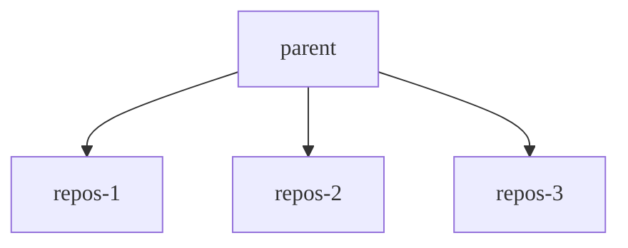

Linuxでコントロールグループ（cgroup）を使用して、特定のプロセスが消費できるメモリとCPUの量を制限できます。Cgroupは、メモリとCPUの過剰消費による予期しないリソース枯渇からシステムを保護するのに役立ちます。Cgroupは広く利用可能であり、コンテナ化の基本的なメカニズムとして一般的に使用されています。

Cgroupは、通常`/sys/fs/cgroup`にマウントされている疑似ファイルシステムを使用して設定され、リソースを階層的に割り当てます。マウントポイントはGitalyで設定可能です。構造は、使用されているcgroupのバージョンによって異なります:

- Cgroups v1は、リソース指向の階層に従います。親ディレクトリは、`cpu`や`memory`のようなリソースです。
- Cgroups v2は、プロセス指向のアプローチを採用しています。親ディレクトリはプロセスのグループであり、内部のファイルは制御されている各リソースを表します。

詳細な紹介については、[cgroups Linuxのmanページ](https://man7.org/linux/man-pages/man7/cgroups.7.html)を参照してください。

Gitalyの実行時:

- 仮想マシンでは、cgroups v1とcgroups v2の両方がサポートされています。Gitalyは、マウントポイントに基づいて使用するcgroupのバージョンを自動的に検出します。
- Kubernetesクラスターでは、cgroups v1を使用したコンテナへのcgroup階層への読み取りおよび書き込み権限を委譲できないため、cgroups v2のみがサポートされています。

Gitalyがcgroups v2で実行されている場合、[clone](https://man7.org/linux/man-pages/man2/clone.2.html) syscallを使用してcgroupの下でプロセスを直接起動する機能など、追加の機能と改善が利用できる場合があります。

## はじめる前 {#before-you-begin}

環境に対する制限の有効化は、予期しないトラフィックから保護するなど、特定の状況下でのみ慎重に行う必要があります。制限に達すると、ユーザーに悪影響を与える切断が発生します。一貫性のある安定したパフォーマンスを得るには、まずノードの仕様の調整、および[大規模リポジトリのレビュー](../../user/project/repository/monorepos/_index.md)またはワークロードなどの他のオプションを調査する必要があります。

メモリにcgroupを有効にする場合は、プロセスが終了する代わりにそれを使用するように切り替わる可能性があるため、Gitalyノードでスワップが設定されていないことを確認する必要があります。カーネルは、利用可能なスワップメモリをcgroupによって課される制限に追加されるものと見なします。この状況は、著しく損なわれたパフォーマンスにつながる可能性があります。

## Gitalyがcgroupから得られるメリット {#how-gitaly-benefits-from-cgroups}

一部のGit操作は、次のような状況で過剰なリソースを消費して枯渇する可能性があります:

- 予期せぬトラフィックの増加。
- ベストプラクティスに従わない大規模リポジトリに対して実行される操作。

これらのリソースを消費する特定リポジトリのアクティビティーは、「うるさい隣人」として知られており、Gitalyサーバーでホストされている他のリポジトリのGitパフォーマンスが低下する可能性があります。

厳格な保護として、Gitalyはcgroupを使用して、カーネルにこれらの操作を終了させ、システムリソースをすべて占有して不安定になるのを防ぐことができます。Gitalyは、Gitコマンドが動作しているリポジトリに基づいて、Gitプロセスをcgroupに割り当てます。これらのcgroupは、リポジトリcgroupと呼ばれます。各リポジトリcgroup:

- メモリとCPUの制限があります。
- 1つ以上のリポジトリのGitプロセスが含まれています。cgroupの総数は設定可能です。各cgroupは一貫した巡回ハッシュを使用し、特定リポジトリのGitプロセスが常に同じcgroupに配置されるようにします。

リポジトリcgroupがその状態に達すると:

- メモリ制限に達すると、カーネルは終了する候補のプロセスを調査し、中断されたクライアントリクエストにつながる可能性があります。
- CPU制限では、プロセスは終了しませんが、プロセスは許可されているよりも多くのCPUを消費できなくなり、クライアントリクエストが調整される可能性がありますが、中断されません。

これらの制限に達すると、パフォーマンスが低下し、ユーザーが切断される可能性があります。

次の図は、cgroupの構造を示しています:

- 親cgroupは、すべてのGitプロセスの制限を管理します。
- 各リポジトリcgroup（`repos-1`から`repos-3`という名前）は、リポジトリレベルで制限を適用します。

Gitalyストレージが提供する場合:

- 3つのリポジトリのみ、各リポジトリはcgroupの1つに直接スロットされます。
- リポジトリcgroupの数よりも多い場合、複数のリポジトリが一貫した方法で同じグループに割り当てられます。



## オーバーサブスクリプションの設定 {#configuring-oversubscription}

リポジトリcgroupの数は、数千のリポジトリを提供するストレージで分離が引き続き発生するように、妥当な高さにする必要があります。リポジトリ数の適切な開始ポイントは、ストレージ上のアクティブなリポジトリ数の2倍です。

リポジトリcgroupは親cgroupの上に制限を追加するため、親制限をグループ数で割って設定すると、制限が厳しすぎることになります。例: 

- 親メモリ制限は32 GiBです。
- アクティブなリポジトリは約100個あります。
- `cgroups.repositories.count = 100`を設定しました。

32 GiBを100で割ると、リポジトリcgroupあたりわずか0.32 GiBが割り当てられます。この設定により、パフォーマンスが非常に悪くなり、利用率が大幅に低下します。

オーバーサブスクリプションを使用すると、通常の操作中にベースラインレベルのパフォーマンスを維持しながら、少数の高ワークロードリポジトリが必要に応じて「バースト」できるようになり、無関係なリクエストに影響を与えることはありません。オーバーサブスクリプションとは、システムで技術的に利用可能な量よりも多くのリソースを割り当てることを指します。

前の例を使用すると、システムに10 GiB * 100のシステムメモリがないにもかかわらず、各メモリに10 GiBを割り当てることで、リポジトリcgroupをオーバーサブスクライブできます。これらの値は、1つのリポジトリに対する通常の操作には10 GiBで十分であると想定していますが、2つのリポジトリがそれぞれ10 GiBにバーストすることを可能にし、ベースラインパフォーマンスを維持するために3番目のバケットのリソースを残します。

同様のルールがCPU時間にも適用されます。システム全体で利用可能なCPUコアよりも多くのCPUコアをリポジトリcgroupに意図的に割り当てます。たとえば、システムに合計400個のコアがない場合でも、リポジトリcgroupあたり4つのコアを割り当てることを決定する場合があります。

2つの主要な値がオーバーサブスクリプションを制御します:

-`cpu_quota_us` -`memory_bytes`

親cgroupとリポジトリcgroupの各値の違いにより、オーバーサブスクリプションの量が決まります。

## 測定と調整 {#measurement-and-tuning}

オーバーサブスクリプションの正しいベースラインリソース要件を確立および調整するには、Gitalyサーバーの本番環境ワークロードを観察する必要があります。デフォルトで公開されている[Prometheusメトリクス](../monitoring/prometheus/_index.md)は、これで十分です。特定のGitalyサーバーのCPUとメモリ使用量を測定するためのガイドとして、次のクエリを使用できます:

| クエリ                                                                                                                                                | リソース                                                          |
|------------------------------------------------------------------------------------------------------------------------------------------------------|-------------------------------------------------------------------|
| `quantile_over_time(0.99, instance:node_cpu_utilization:ratio{type="gitaly", fqdn="gitaly.internal"}[5m])`    | 指定された`fqdn`を持つGitalyノードのp99 CPU使用率    |
| `quantile_over_time(0.99, instance:node_memory_utilization:ratio{type="gitaly", fqdn="gitaly.internal"}[5m])` | 指定された`fqdn`を持つGitalyノードのp99メモリ使用率 |

代表的な期間（たとえば、典型的な稼働週）にわたって観察する利用率に基づいて、通常の操作のベースラインリソース要件を判断できます。前の例の設定を思い付くために、稼働週全体で10 GiBの一貫したメモリ使用量と、CPUの4コア負荷を観察したでしょう。

ワークロードが変化したら、メトリクスを再検討し、cgroupの設定を調整する必要があります。cgroupを有効にした後、パフォーマンスが大幅に低下した場合は、設定を調整する必要もあります。これは、制限が厳しすぎる兆候である可能性があるためです。

## 利用可能な設定 {#available-configuration-settings}



- `max_cgroups_per_repo`はGitLab 16.7で[導入](https://gitlab.com/gitlab-org/gitaly/-/issues/5689)されました。
- レガシーメソッドのドキュメントは、GitLab 17.8で[削除](https://gitlab.com/gitlab-org/gitlab/-/merge_requests/176694)されました。



Gitalyでリポジトリcgroupを設定するには、`/etc/gitlab/gitlab.rb`の`gitaly['configuration'][:cgroups]`に次の設定を使用します:

- `mountpoint`は、親cgroupディレクトリがマウントされている場所です。`/sys/fs/cgroup`がデフォルトです。
- `hierarchy_root`は、Gitalyがグループを作成する親cgroupであり、Gitalyが実行されるユーザーとグループが所有することが期待されます。Linuxパッケージインストールは、Gitalyが起動すると、`mountpoint/<cpu|memory>/hierarchy_root`の設定を作成します。
- `memory_bytes`は、Gitalyが起動するすべてのGitプロセスに集合的に課せられる総メモリ制限です。0は制限がないことを意味します。
- `cpu_shares`は、Gitalyが起動するすべてのGitプロセスに集合的に課せられるCPU制限です。0は制限がないことを意味します。最大は1024共有で、CPUの100％を表します。
- `cpu_quota_us`は、[`cfs_quota_us`](https://docs.kernel.org/scheduler/sched-bwc.html#management)であり、cgroupのプロセスがこのクォータ値を超えた場合に調整します。`cfs_period_us`を`100ms`に設定したため、1コアは`100000`です。0は制限がないことを意味します。
- `repositories.count`は、cgroupプール内のcgroupの数です。新しいGitコマンドが起動されるたびに、Gitalyは、コマンドの対象となるリポジトリに基づいて、これらのcgroupの1つにそれを割り当てます。巡回ハッシュアルゴリズムは、Gitコマンドをこれらのcgroupに割り当てるため、リポジトリのGitコマンドは常に同じcgroupに割り当てられます。
- `repositories.memory_bytes`は、リポジトリcgroupに含まれるすべてのGitプロセスに課せられる総メモリ制限です。0は制限がないことを意味します。この値は、トップレベルの`memory_bytes`の値を超えることはできません。
- `repositories.cpu_shares`は、リポジトリcgroupに含まれるすべてのGitプロセスに課せられるCPU制限です。0は制限がないことを意味します。最大は1024共有で、CPUの100％を表します。この値は、トップレベルの`cpu_shares`の値を超えることはできません。
- `repositories.cpu_quota_us`は、[`cfs_quota_us`](https://docs.kernel.org/scheduler/sched-bwc.html#management)であり、リポジトリcgroupに含まれるすべてのGitプロセスに課せられます。Gitプロセスは、指定されたクォータを超えて使用することはできません。`cfs_period_us`を`100ms`に設定したため、1コアは`100000`です。0は制限がないことを意味します。
- `repositories.max_cgroups_per_repo`は、特定のリポジトリをターゲットとするGitプロセスを分散できるリポジトリcgroupの数です。これにより、バースト性の高いワークロードを許可しながら、リポジトリcgroupに対してより保守的なCPUとメモリ制限を設定できます。たとえば、`2`の`max_cgroups_per_repo`と10 GBの`memory_bytes`制限がある場合、特定のリポジトリに対する独立したGit操作は、最大20 GBのメモリを消費する可能性があります。

例（必ずしも推奨される設定ではありません）:

```ruby
# in /etc/gitlab/gitlab.rb
gitaly['configuration'] = {
  # ...
  cgroups: {
    mountpoint: '/sys/fs/cgroup',
    hierarchy_root: 'gitaly',
    memory_bytes: 64424509440, # 60 GB
    cpu_shares: 1024,
    cpu_quota_us: 400000 # 4 cores
    repositories: {
      count: 1000,
      memory_bytes: 32212254720, # 20 GB
      cpu_shares: 512,
      cpu_quota_us: 200000, # 2 cores
      max_cgroups_per_repo: 2
    },
  },
}
```

## cgroupのモニタリング {#monitoring-cgroups}

cgroupのモニタリングについては、[Gitaly cgroupのモニタリング](monitoring.md#monitor-gitaly-cgroups)を参照してください。
