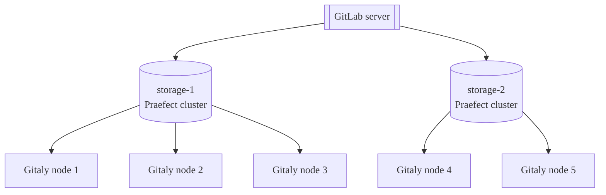
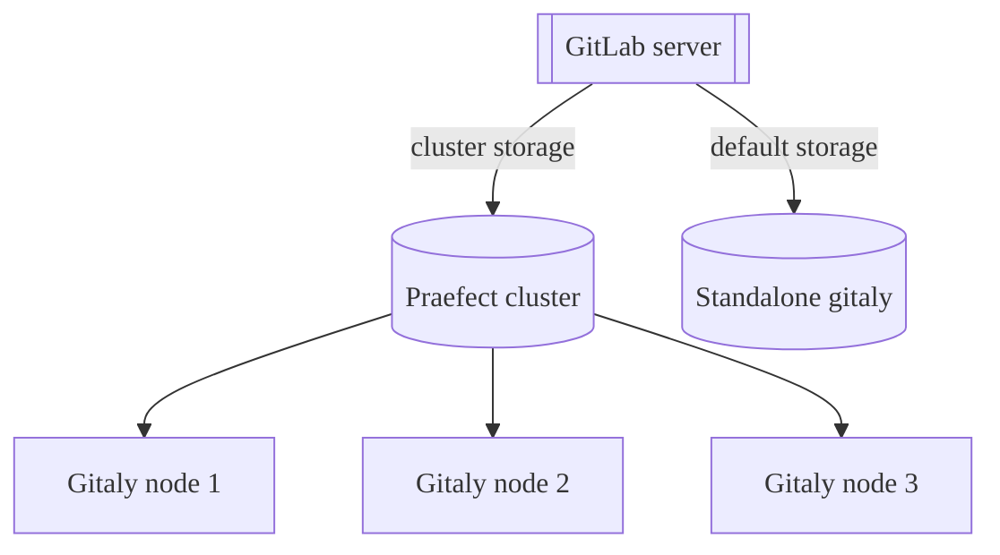



- プラン: Free、Premium、Ultimate
- 提供形態: GitLab Self-Managed



Gitストレージは、GitLabのGitalyサービスを通じて提供され、GitLabの運用に不可欠です。ユーザー数、リポジトリ数、アクティビティーが増加した場合は、次の方法でGitalyを適切にスケールすることが重要です:

- リソースの枯渇によってGit、Gitaly、GitLabアプリケーションのパフォーマンスが低下する前に、Gitで利用可能なCPUおよびメモリリソースを増やす。
- 書き込み操作が失敗する原因となるストレージ制限に達する前に、利用可能なストレージを増やす。
- 単一障害点を取り除き、耐障害性を向上させる。サービスの低下により本番環境への変更のデプロイが妨げられる場合は、Gitをミッションクリティカルなものと見なす必要があります。

Gitalyはクラスター設定で実行でき、以下を実現します:

- Gitalyサービスをスケールする。
- 耐障害性を高める。

この設定では、すべてのGitリポジトリをクラスター内の複数のGitalyノードに保存できます。

Gitaly Cluster (Praefect)を使用すると、冗長性が向上します:

- 書き込み操作をウォームスタンバイ状態のGitalyノードにレプリケートする。
- Gitalyノードの障害を検出する。
- 利用可能なGitalyノードにGitリクエストを自動的にルーティングする。



Gitaly Cluster (Praefect)のテクニカルサポートは、GitLab PremiumおよびUltimateプランのお客様に限定されています。



以下に、Gitaly Cluster (Praefect)によって提供される仮想ストレージである`storage-1`にアクセスするように設定されたGitLabを示します:


この例では、次のように動作します:

- リポジトリは、`storage-1`という仮想ストレージに保存される。
- `storage-1`へのアクセスは、3つのGitalyノード（`gitaly-1`、`gitaly-2`、`gitaly-3`）が提供している。
- 3つのGitalyノードは、3つの異なるハッシュ化されたストレージの場所でデータを共有している。
- [レプリケーション係数](#replication-factor)は`3`で、各リポジトリの3つのコピーが保持される。

単一ノードの障害を想定したGitaly Cluster (Praefect)の可用性目標は次のとおりです:

- 目標リカバリー時点（RPO）: 1分未満。

  書き込みは非同期でレプリケートされます。新たにプロモートされたプライマリにレプリケートされていない書き込みは、失われます。失敗したノードで進行中だった読み取り操作はすべて終了します。

  [強い整合性](#strong-consistency)により、状況によっては損失を防ぐことができます。

- 目標リカバリー時間（RTO）: 10秒未満。停止は、各Praefectノードが毎秒実行するヘルスチェックによって検出されます。フェイルオーバーが行われるには、各Praefectノードで10回連続してヘルスチェックに失敗する必要があります。

RPOとRTOの改善については、エピック[8903](https://gitlab.com/groups/gitlab-org/-/epics/8903)で提案されています。



クラスター全体の障害が発生した場合は、ディザスターリカバリー計画を実行する必要があります。この場合、前述のRPOおよびRTOに影響を与える可能性があります。



## Gitaly Cluster (Praefect)をデプロイする前に {#before-deploying-gitaly-cluster-praefect}

Gitaly Cluster (Praefect) は、耐障害性の利点を提供しますが、セットアップと管理がさらに複雑になります。Gitaly Cluster (Praefect)をデプロイする前に、以下を確認してください:

- [既知の問題](#known-issues)。
- [スナップショットによるバックアップとリカバリー](#snapshot-backup-and-recovery)。
- [構成に関するガイダンス](../configure_gitaly.md)と[リポジトリストレージ](../../repository_storage_paths.md)オプションを参照して、Gitaly Cluster (Praefect)が最適なセットアップであることを確認してください。

まだGitaly Cluster (Praefect)に移行していない場合、次の2つのオプションがあります:

- シャーディングされたGitalyインスタンス。
- Gitaly Cluster (Praefect)。

ご不明な点がある場合は、カスタマーサクセスマネージャーまたはカスタマーサポートにお問い合わせください。

すでにGitaly Cluster (Praefect)を使用しているときに、問題や制限が発生した場合は、カスタマーサポートに連絡して、復元またはリカバリーのサポートを受けてください。

### 既知の問題 {#known-issues}

次の表は、Gitaly Cluster (Praefect)の使用に影響を与える、現時点における既知の問題の概要を示しています。これらの問題の最新状況については、参照されているイシューとエピックをご確認ください。

| 問題                                                                                                 | 概要                                                                                                                                                                                                                                    | 回避方法                                                                                                                                                                                                                                                                                                                                                                                                               |
|:------------------------------------------------------------------------------------------------------|:-------------------------------------------------------------------------------------------------------------------------------------------------------------------------------------------------------------------------------------------|:---------------------------------------------------------------------------------------------------------------------------------------------------------------------------------------------------------------------------------------------------------------------------------------------------------------------------------------------------------------------------------------------------------------------------|
| Gitaly Cluster (Praefect)+ Geo - 同期失敗時の再試行に関する問題                                        | Gitaly Cluster (Praefect)がGeoのセカンダリサイトで使用されている場合、同期に失敗したリポジトリは、Geoによる再同期の試行においても引き続き失敗する可能性があります。この状態から回復するには、サポートからの支援を受けて手動で対応する必要があります。 | GitLab 15.0 - 15.2では、Geoプライマリサイトで[`gitaly_praefect_generated_replica_paths`機能フラグ](#praefect-generated-replica-paths)を有効にします。GitLab 15.3では、この機能フラグはデフォルトで有効になっています。                                                                                                                                                                                                           |
| アップグレード後に移行が適用されていないため、Praefectがデータベースにデータを挿入できない | 移行が完了しておらず、データベースが最新の状態に保たれていない場合、Praefectノードは標準操作を実行できません。                                                                                                          | Praefectデータベースが起動し、すべての移行が完了していることを確認してください。たとえば、このコマンドを実行すると、適用されたすべての移行のリストが表示されます: `sudo -u git -- /opt/gitlab/embedded/bin/praefect -config /var/opt/gitlab/praefect/config.toml sql-migrate-status`。[アップグレード支援を依頼](https://about.gitlab.com/support/scheduling-upgrade-assistance/)して、アップグレード計画をサポートに確認してもらうことを検討してください。 |
| 実行中のクラスターで、スナップショットからGitaly Cluster (Praefect) ノードを復元する                       | Gitaly Cluster (Praefect)は一貫した状態で動作しているため、1つだけ遅れているノードを導入すると、クラスターはそのノードのデータと他のノードのデータ間で調整できなくなります。                                    | バックアップスナップショットから単一のGitaly Cluster (Praefect) ノードのみを復元しないでください。バックアップから復元する必要がある場合は、次の手順に従います:<br/><br/>1\.[GitLabをシャットダウン](../../read_only_gitlab.md#shut-down-the-gitlab-ui)します。<br/>2\.すべてのGitaly Cluster (Praefect) ノードのスナップショットを同時に作成します。<br/>3\.Praefectデータベースのデータベースダンプを作成します。                                                                                              |
| Kubernetes、Amazon ECSなどで実行する場合の制限                                        | Gitaly Cluster (Praefect)はサポートされておらず、Gitalyには既知の制限があります。詳細については、[エピック6127](https://gitlab.com/groups/gitlab-org/-/epics/6127)を参照してください。                                                                     | GitLabの[リファレンスアーキテクチャ](../../reference_architectures/_index.md)を使用してください。                                                                                                                                                                                                                                                                                                                                                |
| 書き込みがPraefectによって記録される前に`PostReceiveHook`が実行されました                                    | 競合状態により、書き込みがすべてのノードにレプリケートされる前に`PostReceiveHook`が実行される可能性があります。CI/CDパイプラインがまだ書き込みを受信していないレプリカをターゲットにしている場合、この競合状態により、`couldn't find remote ref refs/merge-requests/$iid/{head,merge}`エラーが発生してパイプラインが失敗します。詳細については、[issue 5406](https://gitlab.com/gitlab-org/gitaly/-/issues/5406)を参照してください。 | ジョブ全体を再試行するか、フェッチソースステージングを再試行してください。詳しくは[job stages attempts](../../../ci/runners/configure_runners.md#job-stages-attempts)をご覧ください。 |

### スナップショットのバックアップとリカバリー {#snapshot-backup-and-recovery}

Gitaly Cluster (Praefect)はスナップショットのバックアップをサポートしていません。スナップショットバックアップは、Praefectデータベースがディスクストレージと同期が取れなくなる問題を引き起こす可能性があります。復元時にPraefectがGitalyディスク情報のレプリケーションメタデータを再構築する方法に起因するため、[公式のバックアップおよび復元用Rakeタスク](../../backup_restore/_index.md)を使用する必要があります。

[増分バックアップ方式](../../backup_restore/backup_gitlab.md#incremental-repository-backups)を使用して、Gitaly Cluster (Praefect) のバックアップを高速化できます。

どちらの方法も使用できない場合は、カスタマーサポートに復元の支援を依頼してください。

## Geoとの比較 {#comparison-to-geo}

Gitaly Cluster (Praefect)と[Geo](../../geo/_index.md)は、異なる種類の冗長性を提供します。

- Gitaly Cluster (Praefect)の冗長性は、データストレージのフォールトトレランスを提供し、ユーザーには見えません。
- Geoの冗長性は、[レプリケーション](../../geo/_index.md)（ユーザーに表示されます）とGitLabインスタンス全体の[ディザスターリカバリー](../../geo/disaster_recovery/_index.md)を提供します。Geoは、Gitデータを含む[複数のデータタイプをレプリケート](../../geo/replication/datatypes.md#replicated-data-types)します。

次の表は、Gitaly Cluster (Praefect)とGeoの主な違いの概要を示しています:

| ツール                      | ノード    | 場所 | レイテンシー耐性                                                                                      | フェイルオーバー                                                                     | 一貫性                   | 冗長性を提供する対象 |
|:--------------------------|:---------|:----------|:-------------------------------------------------------------------------------------------------------|:-----------------------------------------------------------------------------|:------------------------------|:------------------------|
| Gitaly Cluster (Praefect) | 複数 | 単一    | [1秒未満（理想的には1桁のミリ秒）](configure.md#network-latency-and-connectivity) | [自動](configure.md#automatic-failover-and-primary-election-strategies) | [強い整合性](#strong-consistency) | Gitのデータストレージ     |
| Geo                       | 複数 | 複数  | 最大1分                                                                                       | [手動](../../geo/disaster_recovery/_index.md)                              | 結果整合性                      | GitLabインスタンス全体  |

詳細については、以下を参照してください:

- Geoの[ユースケース](../../geo/_index.md#use-cases)。
- Geoの[アーキテクチャ](../../geo/_index.md#architecture)。

## 仮想ストレージ {#virtual-storage}

仮想ストレージを使用することで、GitLabを単一のリポジトリストレージで運用でき、リポジトリの管理が簡素化されます。

Gitaly Cluster (Praefect)の仮想ストレージは、通常、Gitalyストレージを直接設定する方法に代わる手段となります。ただし、その代償として、各リポジトリを複数のGitalyノードに保存するために追加のストレージ容量が必要になります。Gitalyストレージを直接使用する場合に比べて、Gitaly Cluster (Praefect)仮想ストレージを使用する利点は次のとおりです:

- 各Gitalyノードがすべてのリポジトリのコピーを保持しているため、耐障害性が向上する。
- 読み取り負荷がGitalyノード間で分散されるため、リソースの使用率が向上し、シャード固有のピーク負荷に対する過剰なプロビジョニングの必要性が軽減される。
- 読み取り負荷がGitalyノード間で分散されるため、パフォーマンス向上のために手動で再分散する必要がなくなる。
- すべてのGitalyノードが同一であるため、管理が簡素化される。

リポジトリレプリカの数は、[レプリケーション係数](#replication-factor)を使用して設定できます。

すべてのリポジトリに同じレプリケーション係数を適用するのは、経済的ではない可能性があります。非常に大規模なGitLabインスタンスにおける柔軟性を高めるために、可変レプリケーション係数について[このイシュー](https://gitlab.com/groups/gitlab-org/-/epics/3372)で追跡されています。

標準のGitalyストレージと同様に、仮想ストレージもシャーディングできます。

### 複数の仮想ストレージ {#multiple-virtual-storages}

Gitaly Cluster (Praefect)デプロイで複数の仮想ストレージを設定できます。これにより、次のことが可能になります:

- 異なるパフォーマンス特性を持つ個別のクラスターにリポジトリを編成します。
- 異なるリポジトリのグループに異なるレプリケーション係数を適用します。
- インフラストラクチャのさまざまな部分を個別にスケールします。

仮想ストレージは、GitLabサーバーの`gitlab_rails['repositories_storages']`で設定されます。このハッシュ内の各エントリは、個別の仮想ストレージを表します。Praefect設定は、各仮想ストレージを提供するGitalyノードを定義します。異なる仮想ストレージ内のリポジトリは完全に独立しており、仮想ストレージ間でレプリケートされません。

たとえば、次のように設定できます:

- `storage-1`: レプリケーション係数が3の重要な本番環境リポジトリ用の仮想ストレージ。
- `storage-2`: レプリケーション係数が2の重要度の低いリポジトリ用の仮想ストレージ。

各仮想ストレージには、独自のGitalyノードセットが必要です。



設定手順については、[複数の仮想ストレージの設定](configure.md#configure-multiple-virtual-storages)を参照してください。

### 混合設定 {#mixed-configuration}

次の組み合わせを使用するようにGitLabを設定できます:

- スタンドアロンGitalyインスタンス（ダイレクトGitalyストレージ）。
- Gitaly Cluster (Praefect)仮想ストレージ。

混合設定は、次の場合に使用できます:

- スタンドアロンGitalyからGitaly Cluster (Praefect)に段階的に移行する。
- 一部のリポジトリは高可用性を必要とし、他のリポジトリは必要としない。
- 重要なリポジトリにのみGitaly Cluster (Praefect)を使用することで、コストを最適化したい。

混合設定では、各ストレージはGitLabで個別に設定されます:

- スタンドアロンGitalyストレージは、Gitalyノードに直接接続します。
- Gitaly Cluster (Praefect)ストレージは、Praefectロードバランサーに接続します。

GitLabは、設定されているすべてのストレージを、スタンドアロンかクラスターされているかに関係なく、平等に扱います。新しいリポジトリを作成するとき、GitLabは設定されたストレージウェイトと利用可能な容量に基づいてストレージを選択します。



詳細については、以下を参照してください:

- 設定例については、[混合設定](../configure_gitaly.md#mixed-configuration)を参照してください。
- 移行のガイダンスについては、[既存のGitLabインスタンスにTCPを使用する](configure.md#use-tcp-for-existing-gitlab-instances)を参照してください。

## ストレージレイアウト {#storage-layout}



ストレージレイアウトは、Gitaly Cluster (Praefect)の内部詳細であり、リリース間で安定して維持されている保証はありません。ここに記載されている情報は、情報提供およびデバッグ支援のみを目的としています。リポジトリに対してディスク上で直接変更を加えることはサポートされておらず、破損や変更の上書きにつながる可能性があります。



Gitaly Cluster (Praefect) の仮想ストレージは、単一のように見える抽象化を提供しますが、実際には複数の物理ストレージで構成されています。Gitaly Cluster (Praefect)は、各操作を各物理ストレージにレプリケートする必要があります。操作が一部の物理ストレージでは成功し、他のストレージでは失敗する場合もあります。

部分的に適用された操作は、他の操作に問題を引き起こしたり、システムを回復不能な状態にしたりする可能性があります。このような種類の問題を回避するには、各操作を完全に適用するか、まったく適用しないかのいずれかにする必要があります。この操作の特性は、[アトミック性](https://en.wikipedia.org/wiki/Atomicity_(database_systems))と呼ばれます。

GitLabは、リポジトリストレージのストレージレイアウトを制御します。GitLabは、リポジトリを作成、削除、移動する場所をリポジトリストレージに指示します。これらの操作は、複数の物理ストレージに適用される際にアトミック性の問題を引き起こす可能性があります。次に例を示します:

- レプリカの1つが利用できないときに、GitLabがリポジトリを削除した。
- その後、GitLabはリポジトリを再作成した。

その結果、削除時に利用できなかった古いレプリカが原因で競合が発生し、リポジトリの再作成を妨げる可能性があります。

こうしたアトミック性の問題により、過去に次のような状況で複数の問題が発生しています:

- Gitaly Cluster (Praefect)を使用したGeoのセカンダリサイトへの同期。
- バックアップの復元。
- リポジトリストレージ間のリポジトリの移動。

Gitaly Cluster (Praefect)は、これらの操作に対してアトミック性を確保するため、特別なレイアウトでリポジトリをディスクに保存することにより、部分的に適用された操作によって発生する可能性のある競合を防ぎます。

### クライアントによって生成されたレプリカパス {#client-generated-replica-paths}

リポジトリは、[Gitalyクライアント](../_index.md#gitaly-architecture)によって決定された相対パスに基づきストレージに保存されます。これらのパスは、先頭に`@cluster`プレフィックスが付いていないことで識別できます。相対パスは、[ハッシュ化されたストレージ](../../repository_storage_paths.md#hashed-storage)のスキーマに従います。

### Praefectによって生成されたレプリカパス {#praefect-generated-replica-paths}

Gitaly Cluster (Praefect)はリポジトリを作成する際、リポジトリに_リポジトリID_という一意の永続的なIDを割り当てます。リポジトリIDはGitaly Cluster (Praefect)内部のものであり、GitLabの他の場所で使用されているIDとは関係ありません。リポジトリがGitaly Cluster (Praefect)から削除され、後で戻された場合、そのリポジトリには新しいリポジトリIDが割り当てられ、Gitaly Cluster (Praefect)の視点では別のリポジトリになります。リポジトリIDの連番は常に増加しますが、連番に欠落が生じる場合があります。

リポジトリIDは、クラスター上の各リポジトリに対して_レプリカパス_という一意のストレージパスを導き出すために使用されます。リポジトリのレプリカはすべて、ストレージ上で同じレプリカパスに保存されます。レプリカパスは、_相対パス_とは異なります:

- 相対パスは、Gitalyクライアントがリポジトリを識別するために使用する名前であり、その仮想ストレージと併せて、クライアントにとって一意なものです。
- レプリカパスは、物理ストレージ内の実際の物理パスです。

Praefectは、クライアントリクエストを処理する際、RPC内のリポジトリを仮想`(virtual storage, relative path)`識別子から物理リポジトリ`(storage, replica_path)`識別子に変換します。

レプリカパスの形式:

- オブジェクトプールの場合: `@cluster/pools/<xx>/<xx>/<repository ID>`。オブジェクトプールは、他のリポジトリとは異なるディレクトリに保存されます。ハウスキーピングの一環として削除されないように、オブジェクトプールはGitalyによって識別できる必要があります。オブジェクトプールを削除すると、リンクされたリポジトリでデータが失われる可能性があります。
- 他のリポジトリの場合: `@cluster/repositories/<xx>/<xx>/<repository ID>`

例: `@cluster/repositories/6f/96/54771`。

レプリカパスの最後の要素である`54771`は、リポジトリIDです。これを使用して、ディスク上のリポジトリを識別できます。

`<xx>/<xx>`は、リポジトリIDの文字列表現に対するSHA256ハッシュの先頭4桁の16進数値です。これらの数字は、リポジトリをサブディレクトリに均等に分散させることで、一部のファイルシステムで問題を引き起こす可能性のある過度に大きなディレクトリを回避するために使用されます。この例では、`54771`は`6f960ab01689464e768366d3315b3d3b2c28f38761a58a70110554eb04d582f7`にハッシュされるため、先頭の4桁は`6f`と`96`になります。

### ディスク上のリポジトリを識別する {#identify-repositories-on-disk}

[`praefect metadata`](troubleshooting.md#view-repository-metadata)サブコマンドを使用して、以下を行います:

- メタデータストアからリポジトリの仮想ストレージと相対パスを取得する。ハッシュ化されたストレージパスを取得したら、Railsコンソールを使用してプロジェクトパスを取得できます。
- 次のいずれかを使用して、クラスター内のリポジトリの保存場所を特定する:
  - 仮想ストレージと相対パス。
  - リポジトリID。

ディスク上のリポジトリには、Git設定ファイル内のプロジェクトパスも含まれています。リポジトリのメタデータが削除されても、設定ファイルを使用してプロジェクトパスを特定できます。[ハッシュ化されたストレージに関するドキュメントの手順](../../repository_storage_paths.md#from-hashed-path-to-project-name)に従ってください。

### 操作のアトミック性 {#atomicity-of-operations}

Gitaly Cluster (Praefect)は、PostgreSQLメタデータストアをストレージレイアウトとともに使用して、リポジトリの作成、削除、移動操作におけるアトミック性を確保します。ディスク操作は、複数のストレージにまたがってアトミックに適用することはできません。ただし、PostgreSQLはメタデータ操作のアトミック性を保証します。Gitaly Cluster (Praefect)は、操作に失敗しても常にメタデータの整合性を保つよう、操作をモデル化しています。操作が成功した後でも、ディスクに古い状態が残っている可能性があります。この状況は想定されており、残った状態が今後の操作の妨げになることはありませんが、クリーンアップが実行されるまで不必要にディスク容量を消費する可能性があります。

ストレージに残ったリポジトリをクリーンアップするための[バックグラウンドクローラー](https://gitlab.com/gitlab-org/gitaly/-/issues/3719)の開発が進められています。

#### リポジトリを作成する {#repository-creations}

リポジトリを作成する際、Praefectは以下を行います:

1. PostgreSQLからリポジトリIDを予約します。これはアトミックであり、2つ作成して同じIDになることはありません。
1. リポジトリIDから派生したレプリカパスで、Gitalyストレージにレプリカを作成します。
1. リポジトリがディスク上に正常に作成された後、メタデータレコードを作成します。

たとえ2つの同時操作で同じリポジトリを作成した場合でも、ストレージ上の異なるディレクトリに保存され、競合は発生しません。最初に完了した操作がメタデータレコードを作成し、もう一方の操作は「すでに存在する」というエラーで失敗します。失敗した作成操作によって、ストレージ上にリポジトリが残ることになります。ストレージに残ったリポジトリをクリーンアップするための[バックグラウンドクローラー](https://gitlab.com/gitlab-org/gitaly/-/issues/3719)の開発が進められています。

リポジトリIDは、PostgreSQLの`repositories_repository_id_seq`から生成されます。前述の例では、失敗した操作はリポジトリを正常に作成することなく、1つのリポジトリIDを取得しました。リポジトリの作成に失敗すると、リポジトリIDに欠落が生じることが想定されています。

#### リポジトリを削除する {#repository-deletions}

リポジトリは、そのメタデータレコードを削除することで削除されます。メタデータレコードが削除されるとすぐに、リポジトリは論理的に存在しなくなります。PostgreSQLは削除のアトミック性を保証しており、同時に削除しようとすると「見つかりません」というエラーで失敗します。メタデータレコードの削除に成功した後、Praefectはストレージからレプリカの削除を試みます。これに失敗し、不要になった状態がストレージに残る可能性があります。この残された状態は最終的にクリーンアップされます。

#### リポジトリを移動する {#repository-moves}

Gitalyとは異なり、Gitaly Cluster (Praefect)はストレージ内のリポジトリを移動しません。メタデータストア内のリポジトリの相対パスを更新することで、リポジトリを仮想的に移動するだけです。

## コンポーネント {#components}

Gitaly Cluster (Praefect)は、複数のコンポーネントで構成されています:

- リクエストを分散し、Praefectノードへの耐障害性のあるアクセスを提供する[ロードバランサー](configure.md#load-balancer)。
- クラスターを管理し、リクエストをGitalyノードにルーティングする[Praefect](configure.md#praefect)ノード。
- クラスターのメタデータを永続化するための[PostgreSQLデータベース](configure.md#postgresql)と、Praefectのデータベース接続をプールするために推奨される[PgBouncer](configure.md#use-pgbouncer)。
- リポジトリストレージおよびGitアクセスを提供するGitalyノード。

## アーキテクチャ {#architecture}

Praefectは、Gitalyのルーターおよびトランザクションマネージャーであり、Gitaly Cluster (Praefect)を実行するために必要なコンポーネントです。


詳細については、[Gitaly高可用性（HA）設計](https://gitlab.com/gitlab-org/gitaly/-/blob/master/doc/design_ha.md)を参照してください。

## 機能 {#features}

Gitaly Cluster (Praefect)は、次の機能を提供します:

- Gitalyノード間での[分散読み取り](#distributed-reads)。
- セカンダリレプリカの[強い整合性](#strong-consistency)。
- 冗長性を向上させるためのリポジトリの[レプリケーション係数](#replication-factor)。
- プライマリGitalyノードからセカンダリGitalyノードへの[自動フェイルオーバー](configure.md#automatic-failover-and-primary-election-strategies)。
- レプリケーションキューが空でない場合に可能性のある[データ損失](recovery.md#check-for-data-loss)のレポート。

[epic 1489](https://gitlab.com/groups/gitlab-org/-/epics/1489)に従って、[分散読み取り](https://gitlab.com/groups/gitlab-org/-/epics/2013)を含む提案された改善策を確認してください。

### 分散読み取り {#distributed-reads}

Gitaly Cluster (Praefect)は、[仮想ストレージ](#virtual-storage)用に設定されたGitalyノード間における読み取り操作の分散をサポートしています。

`ACCESSOR`オプションでマークされたすべてのRPCは、最新かつ正常なGitalyノードにリダイレクトされます。たとえば、[`GetBlob`](https://gitlab.com/gitlab-org/gitaly/-/blob/v12.10.6/proto/blob.proto#L16)などです。

このコンテキストでの「最新」とは、次の状態を意味します:

- このGitalyノードに対してスケジュールされているレプリケーション操作が存在しない。
- 最後のレプリケーション操作が完了状態である。

プライマリノードは、次の場合にリクエストを処理するように選択されます:

- 最新のノードが存在しない。
- ノードの選択中にその他のエラーが発生した。

大規模で頻繁に変更されるリポジトリ（数ギガバイト規模のモノレポなど）がある場合、Praefectによるセカンダリへのレプリケートよりも速く変更が入ってくると、プライマリノードがほとんど、またはすべてのリクエストを処理することになります。このような状況になると、プライマリノードの処理能力がボトルネックとなり、CI/CDジョブやその他のリポジトリトラフィックに影響を与える可能性があります。

Prometheusを使用して、[読み取りの分散状況をレポートする](monitoring.md)できます。

### 強い整合性 {#strong-consistency}

Gitaly Cluster (Praefect)は、すべての正常かつ最新のレプリカに対して変更を同期的に書き込むことで、強い整合性を提供します。トランザクション時にレプリカが古くなっているか異常な場合、書き込みはそのレプリカに対して非同期的にレプリケートされます。

強い整合性は、主要なレプリケーション方式です。一部の操作では、強い整合性ではなく、依然としてレプリケーションジョブ（結果整合性）を使用しています。詳細については、[強い整合性に関するエピック](https://gitlab.com/groups/gitlab-org/-/epics/1189)を参照してください。

強い整合性が利用できない場合、Gitaly Cluster (Praefect)は結果整合性を保証します。この場合、Gitaly Cluster (Praefect)は、プライマリGitalyノードへの書き込みが行われた後、すべての書き込みをセカンダリGitalyノードにレプリケートします。

強力な整合性のモニタリングの詳細については、[Gitaly Cluster (Praefect)のモニタリング](monitoring.md)を参照してください。

### レプリケーション係数 {#replication-factor}

レプリケーション係数は、Gitaly Cluster (Praefect)が特定のリポジトリに対して保持するコピーの数です。レプリケーション係数が高いほど、次の効果があります:

- より優れた冗長性と読み取りワークロードの分散を実現する。
- ストレージコストが高くなる。

デフォルトでは、Gitaly Cluster (Praefect)は[仮想ストレージ](#virtual-storage)内のすべてのリポジトリストレージにリポジトリをレプリケートします。

設定の詳細については、[レプリケーション係数を設定する](configure.md#configure-replication-factor)を参照してください。

## Gitaly Cluster (Praefect)をアップグレードする {#upgrade-gitaly-cluster-praefect}

Gitaly Cluster (Praefect)をアップグレードするには、[ゼロダウンタイムアップグレード](../../../update/zero_downtime.md)のドキュメントに記載された手順に従います。

## Gitaly Cluster (Praefect)を以前のバージョンにロールバックする {#roll-back-gitaly-cluster-praefect-to-a-previous-version}

Gitaly Cluster (Praefect)を以前のバージョンにロールバックする必要がある場合、一部のPraefectデータベースの移行を元に戻す必要がある可能性があります。

複数のPraefectノードを想定して、Gitaly Cluster (Praefect)をロールバックするには、次の手順に従います:

1. すべてのPraefectノードでPraefectサービスを停止します:

   ```shell
   gitlab-ctl stop praefect
   ```

1. いずれかのPraefectノードで、GitLabパッケージを以前のバージョンにロールバックします。
1. ロールバックされたノードで、Praefect移行の状態を確認します:

   ```shell
   sudo -u git -- /opt/gitlab/embedded/bin/praefect -config /var/opt/gitlab/praefect/config.toml sql-migrate-status
   ```

1. `APPLIED`列で、`unknown migration`を使用して移行の数をカウントします。
1. ダウングレードしていないPraefectノードで、ロールバックのドライランを実行して、どの移行を元に戻す必要があるのかを検証します。`<CT_UNKNOWN>`は、ダウングレードしたノードによってレポートされた不明な移行の数です。

   ```shell
   sudo -u git -- /opt/gitlab/embedded/bin/praefect -config /var/opt/gitlab/praefect/config.toml sql-migrate <CT_UNKNOWN>
   ```

1. 結果に問題がないようであれば、同じコマンドに`-f`オプションを付けて実行し、移行を元に戻します:

   ```shell
   sudo -u git -- /opt/gitlab/embedded/bin/praefect -config /var/opt/gitlab/praefect/config.toml sql-migrate -f <CT_UNKNOWN>
   ```

1. 残りのPraefectノードでGitLabパッケージをダウングレードし、Praefectサービスを再び開始します:

   ```shell
   gitlab-ctl start praefect
   ```

## Gitaly Cluster (Praefect)に移行します {#migrate-to-gitaly-cluster-praefect}



Gitaly Cluster (Praefect)には、[既知の問題](#known-issues)がいくつか存在します。移行を進める前に、次の情報を確認してください。



Gitaly Cluster (Praefect)に移行する前に、次の作業を行います:

- [Gitaly Cluster (Praefect)をデプロイする前に](#before-deploying-gitaly-cluster-praefect)の内容を確認する。
- 改善やバグ修正の恩恵を受けるため、可能な限り最新バージョンのGitLabにアップグレードする。

Gitaly Cluster (Praefect)に移行するには、次の手順に従います:

1. 必要なストレージを作成します。[リポジトリストレージの推奨事項](configure.md#repository-storage-recommendations)を参照してください。
1. [Gitaly Cluster (Praefect)](configure.md)を作成して設定します。
1. [TCPを使用するように](configure.md#use-tcp-for-existing-gitlab-instances)既存のGitalyインスタンスを設定します（まだそのように設定していない場合）。
1. [リポジトリを移動](../../operations/moving_repositories.md)します。Gitaly Cluster (Praefect)に移行するには、Gitaly Cluster (Praefect)の外部に保存されている既存のリポジトリを移動する必要があります。自動移行はありませんが、GitLab APIで移動をスケジュールできます。

`default`リポジトリストレージを使用しない場合でも、設定されていることを確認する必要があります。[この制限の詳細](../configure_gitaly.md#gitlab-requires-a-default-repository-storage)をご覧ください。

## Gitaly Cluster (Praefect)から移行する {#migrate-off-gitaly-cluster-praefect}

Gitaly Cluster (Praefect)の制限事項やトレードオフがお客様の環境に適していない場合は、Gitaly Cluster (Praefect)からシャーディングされたGitalyインスタンスに移行できます:

1. 新しい[Gitalyサーバー](../configure_gitaly.md#run-gitaly-on-its-own-server)を作成して設定します。
1. 新しく作成したストレージに[リポジトリを移動](../../operations/moving_repositories.md)します。リポジトリはシャードまたはグループ単位で移動できるため、複数のGitalyサーバーに分散して配置する機会が得られます。
