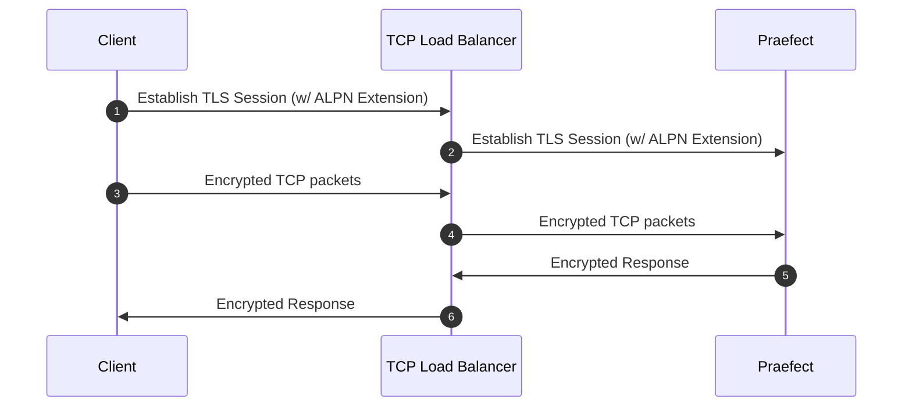
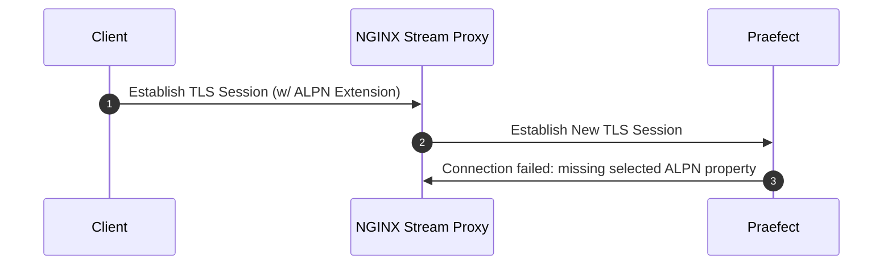

いずれかの方法でGitaly Cluster (Praefect) を設定します:

- [リファレンスアーキテクチャ](../../reference_architectures/_index.md)の一部として利用可能なGitaly Cluster (Praefect) の設定手順（最大インストール数）:
  - [60 RPSまたは3,000ユーザー](../../reference_architectures/3k_users.md#configure-gitaly-cluster-praefect)。
  - [100 RPSまたは5,000ユーザー](../../reference_architectures/5k_users.md#configure-gitaly-cluster-praefect)。
  - [200 RPSまたは10,000ユーザー](../../reference_architectures/10k_users.md#configure-gitaly-cluster-praefect)。
  - [500 RPSまたは25,000ユーザー](../../reference_architectures/25k_users.md#configure-gitaly-cluster-praefect)。
  - [1000 RPSまたは50,000ユーザー](../../reference_architectures/50k_users.md#configure-gitaly-cluster-praefect)。
- このページに続くカスタム設定の手順。

より小規模なGitLabインストールでは、[Gitaly自体](../_index.md)のみが必要な場合があります。



Gitaly Cluster (Praefect)は、Kubernetes、Amazon ECS、または同様のコンテナ環境ではまだサポートされていません。詳細については、[エピック6127](https://gitlab.com/groups/gitlab-org/-/epics/6127)を参照してください。



## 要件 {#requirements}

Gitaly Cluster (Praefect)の最小推奨構成には、以下が必要です:

- 1つのロードバランサー
- 1つのPostgreSQLデータベース（[サポートされているバージョン](../../../install/requirements.md#postgresql)）
- 3つのPraefectノード:
- 3つのGitalyノード（1つのプライマリ、2つのセカンダリ）



[ディスク要件](../_index.md#disk-requirements)は、Gitalyノードに適用されます。



トランザクションで、Gitalyノードの1つが変更RPCs呼び出しに失敗した場合のタイブレーカーが発生するように、奇数のGitalyノードを設定する必要があります。

実装の詳細については、[設計ドキュメント](https://gitlab.com/gitlab-org/gitaly/-/blob/master/doc/design_ha.md)を参照してください。



GitLabで設定されていない場合、コンソールから機能フラグがfalseとして読み取られ、Praefectはデフォルト値を使用します。デフォルト値は、GitLabのバージョンによって異なります。



### ネットワークレイテンシーと接続性 {#network-latency-and-connectivity}

Gitaly Cluster (Praefect)のネットワークレイテンシーは、理想的には1桁台のミリ秒で測定できる必要があります。レイテンシーは、特に以下で重要です:

- Gitalyノードのヘルスチェック。ノードは1秒以内に応答できる必要があります。
- [ストロングコンシステンシー](_index.md#strong-consistency)を適用する参照トランザクション。レイテンシーが低いほど、Gitalyノードは変更に迅速に同意できます。

Gitalyノード間で許容できるレイテンシーを実現します:

- 物理ネットワークでは一般に、高帯域幅、単一ロケーション接続を意味します。
- クラウドでは一般に、クロス可用性ゾーンレプリケーションを許可するなど、同じリージョン内にあることを意味します。これらのリンクは、このタイプの同期用に設計されています。2 ms未満のレイテンシーは、Gitaly Cluster (Praefect)に十分である必要があります。

（たとえば、遠隔地間で）レプリケーション用に低いネットワークレイテンシーを提供できない場合は、Geoを検討してください。詳細については、[Geoとの比較](_index.md#comparison-to-geo)を参照してください。

Gitaly Cluster (Praefect)[コンポーネント](_index.md#components)は、多くのルートを介して相互に通信します。Gitaly Cluster (Praefect)が適切に機能するためには、ファイアウォールルールで以下を許可する必要があります:

| から                   | から                     | デフォルトのポート | TLSポート |
|:-----------------------|:-----------------------|:-------------|:---------|
| GitLab                 | Praefectロードバランサー | `2305`       | `3305`   |
| Praefectロードバランサー | Praefect               | `2305`       | `3305`   |
| Praefect               | Gitaly                 | `8075`       | `9999`   |
| Praefect               | GitLab（内部API）  | `80`         | `443`    |
| Gitaly                 | GitLab（内部API）  | `80`         | `443`    |
| Gitaly                 | Praefectロードバランサー | `2305`       | `3305`   |
| Gitaly                 | Praefect               | `2305`       | `3305`   |
| Gitaly                 | Gitaly                 | `8075`       | `9999`   |



GitalyはPraefectに直接接続しません。ただし、PraefectノードのファイアウォールでGitalyノードからのトラフィックが許可されていない場合、GitalyからPraefectロードバランサーへのリクエストがブロックされる可能性があります。



### Praefectデータベースストレージ {#praefect-database-storage}

データベースには以下のメタデータのみが含まれるため、要件は比較的低くなっています:

- リポジトリが配置されている場所。
- キューに入れられた一部の作業。

リポジトリの数によって異なりますが、適切な最小値は5〜10 GBで、メインのGitLabアプリケーションデータベースと同様です。

## セットアップ手順 {#setup-instructions}

（強く推奨される）Linuxパッケージを使用して[デプロイされた](https://about.gitlab.com/install/)GitLabを使用している場合は、以下の手順に従ってください:

1. [準備](#preparation)
1. [Praefectデータベースの設定](#postgresql)
1. [Praefectプロキシ/ルーターの設定](#praefect)
1. [各Gitalyノードの設定](#gitaly)（Gitalyノードごとに1回）
1. [ロードバランサーの設定](#load-balancer)
1. [GitLabサーバー構成の更新](#gitlab)
1. [Grafanaを設定する](#grafana)

### 準備 {#preparation}

開始する前に、すでに動作しているGitLabインスタンスが必要です。GitLabの[インストール方法](https://about.gitlab.com/install/)について説明します。

PostgreSQLサーバーをプロビジョニングします。Linuxパッケージに同梱されているPostgreSQLを使用して、PostgreSQLデータベースを設定する必要があります。外部PostgreSQLサーバーを使用できますが、[手動で](#manual-database-setup)セットアップする必要があります。

[GitLabをインストール](https://about.gitlab.com/install/)して、すべての新しいノードを準備します。以下が必要です:

- 1つのPostgreSQLノード
- 1つのPgBouncerノード（オプション）
- 少なくとも1つのPraefectノード（必要なストレージは最小限）
- 3つのGitalyノード（高CPU、高メモリ、高速ストレージ）
- 1つのGitLabサーバー

各ノードのIP/ホストアドレスも必要です:

1. `PRAEFECT_LOADBALANCER_HOST`: PraefectロードバランサーのIP/ホストアドレス
1. `POSTGRESQL_HOST`: PostgreSQLサーバーのIP/ホストアドレス
1. `PGBOUNCER_HOST`: PostgreSQLサーバーのIP/ホストアドレス
1. `PRAEFECT_HOST`: PraefectサーバーのIP/ホストアドレス
1. `GITALY_HOST_*`: 各GitalyサーバーのIPまたはホストアドレス
1. `GITLAB_HOST`: GitLabサーバーのIP/ホストアドレス

Google Cloud Platform、SoftLayer、またはVPC（VPC）を提供するその他のベンダーを使用している場合は、`PRAEFECT_HOST`、`GITALY_HOST_*`、および`GITLAB_HOST`の各クラウドインスタンスのプライベートアドレス（Google Cloud Platformの「内部アドレス」に対応）を使用できます。

#### シークレット {#secrets}

コンポーネント間の通信は、以下で説明するさまざまなシークレットで保護されています。開始する前に、それぞれに一意のシークレットを生成し、メモしておきます。これにより、設定プロセスを完了する際に、これらのプレースホルダートークンをセキュアトークンに置き換えることができます。

1. `GITLAB_SHELL_SECRET_TOKEN`: これは、Gitプッシュを受け入れるときに、GitフックがGitLabにコールバックHTTPAPIリクエストを行うために使用されます。このシークレットは、従来の理由からGitLab Shellと共有されます。
1. `PRAEFECT_EXTERNAL_TOKEN`: お客様のPraefectクラスターでホストされているリポジトリには、このトークンを持つGitalyクライアントのみがアクセスできます。
1. `PRAEFECT_INTERNAL_TOKEN`: このトークンは、Praefectクラスター内のレプリケーショントラフィックに使用されます。これは、GitalyクライアントがPraefectクラスターの内部ノードに直接アクセスできないようにする必要があるため、`PRAEFECT_EXTERNAL_TOKEN`とは異なります。そうしないと、データが失われる可能性があります。
1. `PRAEFECT_SQL_PASSWORD`: このパスワードは、PraefectがPostgreSQLに接続するために使用します。
1. `PRAEFECT_SQL_PASSWORD_HASH`: Praefectユーザーのパスワードのハッシュ。`gitlab-ctl pg-password-md5 praefect`を使用して、ハッシュを生成します。このコマンドラインは、`praefect`ユーザーのパスワードを要求します。`PRAEFECT_SQL_PASSWORD`の平文パスワードを入力します。デフォルトでは、Praefectは`praefect`ユーザーを使用しますが、変更できます。
1. `PGBOUNCER_SQL_PASSWORD_HASH`: PgBouncerユーザーのパスワードのハッシュ。PgBouncerは、このパスワードを使用してPostgreSQLに接続します。詳細については、[バンドルされたPgBouncer](../../postgresql/pgbouncer.md)のドキュメントを参照してください。

これらのシークレットが必要な場所を以下の手順で説明します。



Linuxパッケージのインストールでは、`gitlab-secrets.json`を`GITLAB_SHELL_SECRET_TOKEN`に使用できます。



### タイムサーバー設定のカスタマイズ {#customize-time-server-setting}

デフォルトでは、GitalyノードとPraefectノードは、時刻同期チェックのために`pool.ntp.org`のタイムサーバーを使用します。各ノードの`gitlab.rb`に以下を追加して、この設定をカスタマイズできます:

- `gitaly['env'] = { "NTP_HOST" => "ntp.example.com" }`(Gitalyノードの場合)。
- `praefect['env'] = { "NTP_HOST" => "ntp.example.com" }`(Praefectノードの場合)。

### PostgreSQL {#postgresql}



Praefectは、GitLabアプリケーションデータベースとは別のデータベースを使用して、Gitalyのリポジトリレプリケーション状態を管理します。[Geo](../../geo/_index.md)とGitaly Cluster (Praefect)を使用する場合、Praefectレプリケーション状態はサイトごとに一意です。各Geoサイトには、Praefectデータベースを格納するための個別の読み取り/書き込みPostgreSQLデータベースインスタンスが必要です。

- GitLabアプリケーションデータベースとPraefectデータベースを同じPostgreSQLサーバーにストレージしないでください。
- GeoプライマリサイトでPraefect Postgresデータベースを構成して、Geoセカンダリサイトにレプリケートしないでください。



これらの手順は、単一のPostgreSQLデータベースを設定するのに役立ちますが、これにより、単一障害点が作成されます。これを回避するには、独自のクラスター化されたPostgreSQLを構成できます。その他のデータベース（PraefectデータベースやGeoデータベースなど）のクラスター化されたデータベースサポートは、[イシュー7292](https://gitlab.com/gitlab-org/omnibus-gitlab/-/issues/7292)で提案されています。

次のオプションを使用できます:

- Geo以外のインストールの場合は、次のいずれかを行います:
  - ドキュメント化されている[PostgreSQLのセットアップ](../../postgresql/_index.md)のいずれかを使用します。
  - 独自のサードパーティ製データベース設定を使用します。これには、[手動セットアップ](#manual-database-setup)が必要です。
- Geoインスタンスの場合は、次のいずれかを行います:
  - 別の[PostgreSQLインスタンス](https://www.postgresql.org/docs/16/high-availability.html)をセットアップします。
  - クラウドマネージドPostgreSQLサービスを使用します。AWS [Relational Database Service](https://aws.amazon.com/rds/)をお勧めします。

PostgreSQLを設定すると、空のPraefectテーブルが作成されます。詳細については、[関連するトラブルシューティングセクション](troubleshooting.md#relation-does-not-exist-errors)を参照してください。

#### 同じサーバーでGitLabデータベースとPraefectデータベースを実行する {#running-gitlab-and-praefect-databases-on-the-same-server}

GitLabアプリケーションデータベースとPraefectデータベースは、同じサーバー上で実行できます。ただし、LinuxパッケージからPostgreSQLを使用する場合は、Praefectに独自のデータベースサーバーが必要です。フェイルオーバーが発生した場合、Praefectは認識されず、使用しようとしているデータベースが次のいずれかになるため、失敗し始めます:

- 使用できません。
- 読み取り専用モード。

#### 手動データベース設定 {#manual-database-setup}

このセクションを完了するには、以下が必要です:

- 1つのPraefectノード
- 1つのPostgreSQLノード
  - データベースサーバーを管理する権限を持つPostgreSQLユーザー

このセクションでは、PostgreSQLデータベースを設定します。これは、外部およびLinuxパッケージが提供するPostgreSQLサーバーの両方で使用できます。

次の手順を実行するには、Linuxパッケージによって`psql`がインストールされているPraefectノード（`/opt/gitlab/embedded/bin/psql`）を使用できます。Linuxパッケージが提供するPostgreSQLを使用している場合は、代わりにPostgreSQLノードで`gitlab-psql`を使用できます:

1. Praefectで使用される新しいユーザー`praefect`を作成します:

   ```sql
   CREATE ROLE praefect WITH LOGIN PASSWORD 'PRAEFECT_SQL_PASSWORD';
   ```

   `PRAEFECT_SQL_PASSWORD`を、準備手順で生成した強力なパスワードに置き換えます。

1. `praefect`ユーザーが所有する新しいデータベース`praefect_production`を作成します。

   ```sql
   CREATE DATABASE praefect_production WITH OWNER praefect ENCODING UTF8;
   ```

Linuxパッケージが提供するPgBouncerを使用する場合は、次の追加手順を実行する必要があります。Linuxパッケージに同梱されているPostgreSQLをバックエンドとして使用することを強くお勧めします。次の手順は、Linuxパッケージが提供するPostgreSQLでのみ機能します:

1. Linuxパッケージが提供するPgBouncerの場合、実際のパスワードの代わりに`praefect`パスワードのハッシュを使用する必要があります:

   ```sql
   ALTER ROLE praefect WITH PASSWORD 'md5<PRAEFECT_SQL_PASSWORD_HASH>';
   ```

   準備手順で生成したパスワードのハッシュで`<PRAEFECT_SQL_PASSWORD_HASH>`を置き換えます。それは`md5`リテラルで始まります。

1. PgBouncerで使用する新しいユーザー`pgbouncer`を作成します:

   ```sql
   CREATE ROLE pgbouncer WITH LOGIN;
   ALTER USER pgbouncer WITH password 'md5<PGBOUNCER_SQL_PASSWORD_HASH>';
   ```

   準備手順で生成した強力なパスワードハッシュで`PGBOUNCER_SQL_PASSWORD_HASH`を置き換えます。

1. Linuxパッケージに同梱されているPgBouncerは、[`auth_query`](https://www.pgbouncer.org/config.html#generic-settings)を使用するように構成されており、`pg_shadow_lookup`関数を使用します。`praefect_production`データベースでこの関数を作成する必要があります:

   ```sql
   CREATE OR REPLACE FUNCTION public.pg_shadow_lookup(in i_username text, out username text, out password text) RETURNS record AS $$
   BEGIN
       SELECT usename, passwd FROM pg_catalog.pg_shadow
       WHERE usename = i_username INTO username, password;
       RETURN;
   END;
   $$ LANGUAGE plpgsql SECURITY DEFINER;

   REVOKE ALL ON FUNCTION public.pg_shadow_lookup(text) FROM public, pgbouncer;
   GRANT EXECUTE ON FUNCTION public.pg_shadow_lookup(text) TO pgbouncer;
   ```

Praefectが使用するデータベースが構成されました。

これで、データベースを使用するようにPraefectを構成できます:

```ruby
praefect['configuration'] = {
   # ...
   database: {
      # ...
      host: POSTGRESQL_HOST,
      user: 'praefect',
      port: 5432,
      password: PRAEFECT_SQL_PASSWORD,
      dbname: 'praefect_production',
   }
}
```

PostgreSQLの設定後にPraefectデータベースエラーが表示される場合は、[トラブルシューティングの手順](troubleshooting.md#relation-does-not-exist-errors)を参照してください。

#### 読み取りディストリビューションキャッシュ {#reads-distribution-caching}

`session_pooled`設定をさらに構成することで、Praefectのパフォーマンスを向上させることができます:

```ruby
praefect['configuration'] = {
   # ...
   database: {
      # ...
      session_pooled: {
         # ...
         host: POSTGRESQL_HOST,
         port: 5432

         # Use the following to override parameters of direct database connection.
         # Comment out where the parameters are the same for both connections.
         user: 'praefect',
         password: PRAEFECT_SQL_PASSWORD,
         dbname: 'praefect_production',
         # sslmode: '...',
         # sslcert: '...',
         # sslkey: '...',
         # sslrootcert: '...',
      }
   }
}
```

構成すると、この接続は[SQL LISTEN](https://www.postgresql.org/docs/16/sql-listen.html)機能に自動的に使用され、Praefectはキャッシュ無効化のためにPostgreSQLから通知を受信できます。

この機能が動作していることを確認するには、Praefectログで次のログエントリを探します:

```plaintext
reads distribution caching is enabled by configuration
```

#### PgBouncerの使用 {#use-pgbouncer}

PostgreSQLリソースの消費量を削減するには、[PgBouncer](https://www.pgbouncer.org/)をセットアップしてPostgreSQLインスタンスの前面に構成する必要があります。ただし、Praefectの接続数は少ないため、PgBouncerは必須ではありません。PgBouncerを使用することを選択した場合は、GitLabアプリケーションデータベースとPraefectデータベースの両方に同じPgBouncerインスタンスを使用できます。

PostgreSQLインスタンスの前面でPgBouncerを構成するには、Praefect構成でデータベースパラメータを設定して、PgBouncerをポイントする必要があります:

```ruby
praefect['configuration'] = {
   # ...
   database: {
      # ...
      host: PGBOUNCER_HOST,
      port: 6432,
      user: 'praefect',
      password: PRAEFECT_SQL_PASSWORD,
      dbname: 'praefect_production',
      # sslmode: '...',
      # sslcert: '...',
      # sslkey: '...',
      # sslrootcert: '...',
   }
}
```

Praefectには、[LISTEN](https://www.postgresql.org/docs/16/sql-listen.html)機能をサポートするPostgreSQLへの追加接続が必要です。PgBouncerを使用すると、この機能は`session`プールモード（`pool_mode = session`）でのみ使用できます。これは、`transaction`プールモード（`pool_mode = transaction`）ではサポートされていません。

追加の接続を構成するには、次のいずれかを行う必要があります:

- 同じPostgreSQLデータベースエンドポイントを使用するが、異なるプールモード（`pool_mode = session`）を使用する新しいPgBouncerデータベースを構成します。
- PraefectをPostgreSQLに直接接続し、PgBouncerをバイパスします。

##### `pool_mode = session`を使用して新しいPgBouncerデータベースを構成します {#configure-a-new-pgbouncer-database-with-pool_mode--session}

`session`プールモードでPgBouncerを使用する必要があります。[バンドルされたPgBouncer](../../postgresql/pgbouncer.md)を使用するか、外部PgBouncerを使用して[手動で構成します](https://www.pgbouncer.org/config.html)。

次の例では、バンドルされたPgBouncerを使用し、PostgreSQLホスト上に2つの個別の接続プールを設定します。1つは`session`プールモードで、もう1つは`transaction`プールモードです。この例を機能させるには、[セットアップ手順](#manual-database-setup)に記載されているように、PostgreSQLサーバーを準備する必要があります。

次に、PgBouncerホストで個別の接続プールを設定します:

```ruby
pgbouncer['databases'] = {
  # Other database configuration including gitlabhq_production
  ...

  praefect_production: {
    host: POSTGRESQL_HOST,
    # Use `pgbouncer` user to connect to database backend.
    user: 'pgbouncer',
    password: PGBOUNCER_SQL_PASSWORD_HASH,
    pool_mode: 'transaction'
  },
  praefect_production_direct: {
    host: POSTGRESQL_HOST,
    # Use `pgbouncer` user to connect to database backend.
    user: 'pgbouncer',
    password: PGBOUNCER_SQL_PASSWORD_HASH,
    dbname: 'praefect_production',
    pool_mode: 'session'
  },

  ...
}

# Allow the praefect user to connect to PgBouncer
pgbouncer['users'] = {
  'praefect': {
    'password': PRAEFECT_SQL_PASSWORD_HASH,
  }
}
```

`praefect_production`と`praefect_production_direct`は両方とも同じデータベースエンドポイント (`praefect_production`) を使用しますが、プールモードが異なります。これは、PgBouncerの次の`databases`セクションに変換されます:

```ini
[databases]
praefect_production = host=POSTGRESQL_HOST auth_user=pgbouncer pool_mode=transaction
praefect_production_direct = host=POSTGRESQL_HOST auth_user=pgbouncer dbname=praefect_production pool_mode=session
```

これで、Praefectが両方の接続にPgBouncerを使用するように設定できます:

```ruby
praefect['configuration'] = {
   # ...
   database: {
      # ...
      host: PGBOUNCER_HOST,
      port: 6432,
      user: 'praefect',
      # `PRAEFECT_SQL_PASSWORD` is the plain-text password of
      # Praefect user. Not to be confused with `PRAEFECT_SQL_PASSWORD_HASH`.
      password: PRAEFECT_SQL_PASSWORD,
      dbname: 'praefect_production',
      session_pooled: {
         # ...
         dbname: 'praefect_production_direct',
         # There is no need to repeat the following. Parameters of direct
         # database connection will fall back to the values specified in the
         # database block.
         #
         # host: PGBOUNCER_HOST,
         # port: 6432,
         # user: 'praefect',
         # password: PRAEFECT_SQL_PASSWORD,
      },
   },
}
```

この設定により、Praefectは両方の接続タイプにPgBouncerを使用します。



Linuxパッケージのインストールは、（`auth_query`を使用して）認証要件を処理しますが、データベースを手動で準備し、外部PgBouncerを設定する場合は、PgBouncerで使用されるファイルに`praefect`ユーザーとそのパスワードを含める必要があります。たとえば、[`auth_file`](https://www.pgbouncer.org/config.html#auth_file)設定オプションが設定されている場合は、`userlist.txt`。詳細については、PgBouncerのドキュメントを参照してください。



##### PostgreSQLに直接接続するようにPraefectを設定する {#configure-praefect-to-connect-directly-to-postgresql}

`session`プールモードでPgBouncerを設定する代わりに、PostgreSQLへの直接アクセスに異なる接続変数を使用するようにPraefectを設定できます。この接続は、`LISTEN`機能をサポートしています。

PgBouncerを回避してPostgreSQLに直接接続するPraefect設定の例:

```ruby
praefect['configuration'] = {
   # ...
   database: {
      # ...
      session_pooled: {
         # ...
         host: POSTGRESQL_HOST,
         port: 5432,

         # Use the following to override parameters of direct database connection.
         # Comment out where the parameters are the same for both connections.
         #
         user: 'praefect',
         password: PRAEFECT_SQL_PASSWORD,
         dbname: 'praefect_production',
         # sslmode: '...',
         # sslcert: '...',
         # sslkey: '...',
         # sslrootcert: '...',
      },
   },
}
```

### Praefect {#praefect}

Praefectを設定する前に、[Praefect設定ファイルの例](https://gitlab.com/gitlab-org/gitaly/-/blob/master/config.praefect.toml.example)を参照して、理解を深めてください。Linuxパッケージを使用してGitLabをインストールした場合、例のファイル内の設定はRubyに変換する必要があります。

複数のPraefectノードがある場合:

1. 1つのノードをデプロイノードとして指定し、次の手順で設定します。
1. 追加のノードごとに次の手順を実行します。

このセクションを完了するには、[設定済みのPostgreSQLサーバー](#postgresql)が必要です。以下を含みます:



Praefectは専用のノードで実行する必要があります。PraefectをアプリケーションサーバーまたはGitalyノードで実行しないでください。



Praefectノード上:

1. `/etc/gitlab/gitlab.rb`を編集して、他のすべてのサービスを無効にします:

<!--
Updates to example must be made at:
- https://gitlab.com/gitlab-org/gitlab/-/blob/master/doc/administration/gitaly/praefect.md
- all reference architecture pages
-->

   ```ruby
   # Avoid running unnecessary services on the Praefect server
   gitaly['enable'] = false
   postgresql['enable'] = false
   redis['enable'] = false
   nginx['enable'] = false
   puma['enable'] = false
   sidekiq['enable'] = false
   gitlab_workhorse['enable'] = false
   prometheus['enable'] = false
   alertmanager['enable'] = false
   gitlab_exporter['enable'] = false
   gitlab_kas['enable'] = false

   # Enable only the Praefect service
   praefect['enable'] = true

   # Prevent database migrations from running on upgrade automatically
   praefect['auto_migrate'] = false
   gitlab_rails['auto_migrate'] = false
   ```

1. `/etc/gitlab/gitlab.rb`を編集して、ネットワークインターフェースでリッスンするようにPraefectを設定します:

   ```ruby
   praefect['configuration'] = {
      # ...
      listen_addr: '0.0.0.0:2305',
   }
   ```

1. `/etc/gitlab/gitlab.rb`を編集してPrometheusメトリクスを設定します:

   ```ruby
   praefect['configuration'] = {
      # ...
      #
      # Enable Prometheus metrics access to Praefect. You must use firewalls
      # to restrict access to this address/port.
      # The default metrics endpoint is /metrics
      prometheus_listen_addr: '0.0.0.0:9652',
      # Some metrics run queries against the database. Enabling separate database metrics allows
      # these metrics to be collected when the metrics are
      # scraped on a separate /db_metrics endpoint.
      prometheus_exclude_database_from_default_metrics: true,
   }
   ```

1. `/etc/gitlab/gitlab.rb`を編集してPraefectの強力な認証トークンを設定します。これは、(GitLab Shellのような) クラスターの外部のクライアントがPraefectクラスターと通信するために必要です:

   ```ruby
   praefect['configuration'] = {
      # ...
      auth: {
         # ...
         token: 'PRAEFECT_EXTERNAL_TOKEN',
      },
   }
   ```

1. [PostgreSQLデータベースに接続](#postgresql)するようにPraefectを設定します。[PgBouncer](#use-pgbouncer)も使用することを強くお勧めします。

   TLSクライアント証明書を使用する場合は、以下のオプションを使用できます:

   ```ruby
   praefect['configuration'] = {
      # ...
      database: {
         # ...
         #
         # Connect to PostgreSQL using a TLS client certificate
         # sslcert: '/path/to/client-cert',
         # sslkey: '/path/to/client-key',
         #
         # Trust a custom certificate authority
         # sslrootcert: '/path/to/rootcert',
      },
   }
   ```

   デフォルトでは、PraefectはオポチュニスティックTLSを使用してPostgreSQLに接続します。これは、Praefectが`prefer`に設定された`sslmode`を使用してPostgreSQLへの接続を試みることを意味します。これをオーバーライドするには、次の行のコメントを解除します:

   ```ruby
   praefect['configuration'] = {
      # ...
      database: {
         # ...
         # sslmode: 'disable',
      },
   }
   ```

1. `/etc/gitlab/gitlab.rb`を編集して、クラスター内の各Gitalyノードに接続するようにPraefectクラスターを設定します。

   仮想ストレージの名前は、GitLab設定で設定されたストレージ名と一致する必要があります。後の手順で、ストレージ名を`default`として設定するため、ここでも`default`を使用します。このクラスターには3つのGitalyノード（`gitaly-1`、`gitaly-2`、`gitaly-3`）があり、これらは互いのレプリカになることを目的としています。

   

   すでに`default`というストレージにデータがある場合は、仮想ストレージに別の名前を設定し、その後で[データをGitaly Cluster (Praefect)ストレージに移行する](_index.md#migrate-to-gitaly-cluster-praefect)必要があります。

   

   `PRAEFECT_INTERNAL_TOKEN`を強力なシークレットに置き換えます。これは、クラスター内のGitalyノードと通信するときにPraefectで使用されます。このトークンは、`PRAEFECT_EXTERNAL_TOKEN`とは異なります。

   `GITALY_HOST_*`を各GitalyノードのIPまたはホストアドレスに置き換えます。

   クラスターにGitalyノードを追加して、レプリカの数を増やすこともできます。非常に大規模なGitLabインスタンスの場合は、クラスターをさらに追加することもできます。

   

   仮想ストレージにGitalyノードを追加する場合、その仮想ストレージ内のすべてのストレージ名は一意である必要があります。さらに、Praefect設定で参照されるすべてのGitalyノードアドレスは一意である必要があります。

   

   ```ruby
   # Name of storage hash must match storage name in gitlab_rails['repositories_storages'] on GitLab
   # server ('default') and in gitaly['configuration'][:storage][INDEX][:name] on Gitaly nodes ('gitaly-1')
   praefect['configuration'] = {
      # ...
      virtual_storage: [
         {
            # ...
            name: 'default',
            node: [
               {
                  storage: 'gitaly-1',
                  address: 'tcp://GITALY_HOST_1:8075',
                  token: 'PRAEFECT_INTERNAL_TOKEN'
               },
               {
                  storage: 'gitaly-2',
                  address: 'tcp://GITALY_HOST_2:8075',
                  token: 'PRAEFECT_INTERNAL_TOKEN'
               },
               {
                  storage: 'gitaly-3',
                  address: 'tcp://GITALY_HOST_3:8075',
                  token: 'PRAEFECT_INTERNAL_TOKEN'
               },
            ],
         },
      ],
   }
   ```

1. `/etc/gitlab/gitlab.rb`への変更を保存し、[Praefectを再設定します](../../restart_gitlab.md#reconfigure-a-linux-package-installation):

   ```shell
   gitlab-ctl reconfigure
   ```

1. 詳細は以下の説明を参照してください:

   - 「デプロイノード」:
     1. `/etc/gitlab/gitlab.rb`で`praefect['auto_migrate'] = true`を設定して、Praefectデータベースの自動移行を再度有効にします。
     1. データベースの移行が再設定中にのみ実行され、アップグレード時に自動的に実行されないようにするには、以下を実行します:

        ```shell
        sudo touch /etc/gitlab/skip-auto-reconfigure
        ```

   - 他のノードについては、設定をそのままにしておくことができます。`/etc/gitlab/skip-auto-reconfigure`は必須ではありませんが、`apt-get update`などのコマンドラインを実行するときに、GitLabが自動的に再設定されるのを防ぐために、それを設定することをお勧めします。これにより、追加の設定変更を行い、手動で再設定を実行できます。

1. `/etc/gitlab/gitlab.rb`への変更を保存し、[Praefectを再設定します](../../restart_gitlab.md#reconfigure-a-linux-package-installation):

   ```shell
   gitlab-ctl reconfigure
   ```

1. Praefectが[Prometheusリスンアドレスを更新した](https://gitlab.com/gitlab-org/gitaly/-/issues/2734)ことを確認するには、[Praefectを再起動](../../restart_gitlab.md#reconfigure-a-linux-package-installation)します:

   ```shell
   gitlab-ctl restart praefect
   ```

1. PraefectがPostgreSQLに到達できることを確認します:

   ```shell
   sudo -u git -- /opt/gitlab/embedded/bin/praefect -config /var/opt/gitlab/praefect/config.toml sql-ping
   ```

   チェックに失敗した場合は、手順に正しく従っていることを確認してください。`/etc/gitlab/gitlab.rb`を編集する場合は、`sql-ping`コマンドを試す前に、必ず`sudo gitlab-ctl reconfigure`を再度実行してください。

#### TLSサポートを有効にする {#enable-tls-support}

PraefectはTLS暗号化をサポートしています。セキュアな接続をリッスンするPraefectインスタンスと通信するには、次のことを行う必要があります:

- Gitalyが[TLS用に設定されている](../tls_support.md)ことを確認し、GitLab設定内の対応するストレージエントリの`gitaly_address`で`tls://` URLスキームを使用します。
- 証明書は自動的に提供されないため、独自の証明書を用意してください。各Praefectサーバーに対応する証明書を、そのPraefectサーバーにインストールする必要があります。

さらに、証明書またはその認証局は、[GitLabカスタム証明書の設定](https://docs.gitlab.com/omnibus/settings/ssl/#install-custom-public-certificates)で説明されている手順（以下にも繰り返します）に従って、すべてのGitalyサーバー、およびこのサーバーと通信するすべてのPraefectクライアントにインストールする必要があります。

次の点に注意してください:

- 証明書は、Praefectサーバーへのアクセスに使用するアドレスを指定する必要があります。ホスト名またはIPアドレスをサブジェクトの別名（SAN）として証明書に追加する必要があります。
- [Gitaly TLS](../tls_support.md)が有効なコマンドラインから`dial-nodes`や`list-untracked-repositories`などのPraefectサブコマンドを実行する場合は、Gitaly証明書が信頼されるように、`SSL_CERT_DIR`または`SSL_CERT_FILE`環境変数を設定する必要があります。例: 

   ```shell
   SSL_CERT_DIR=/etc/gitlab/trusted-certs sudo -u git -- /opt/gitlab/embedded/bin/praefect -config /var/opt/gitlab/praefect/config.toml dial-nodes
   ```

- Praefectサーバーは、暗号化されていないリスニングアドレス`listen_addr`と暗号化されたリスニングアドレス`tls_listen_addr`の両方で同時に設定できます。これにより、必要に応じて、暗号化されていないトラフィックから暗号化されたトラフィックへの段階的な移行を行うことができます。

  暗号化されていないリスナーを無効にするには、以下を設定します:

  ```ruby
  praefect['configuration'] = {
    # ...
    listen_addr: nil,
  }
  ```

TLSでPraefectを設定します。

Linuxパッケージインストールの場合:

1. Praefectサーバーの証明書を作成します。

1. Praefectサーバーで、`/etc/gitlab/ssl`ディレクトリを作成し、キーと証明書をそこにコピーします:

   ```shell
   sudo mkdir -p /etc/gitlab/ssl
   sudo chmod 755 /etc/gitlab/ssl
   sudo cp key.pem cert.pem /etc/gitlab/ssl/
   sudo chmod 644 key.pem cert.pem
   ```

1. `/etc/gitlab/gitlab.rb`を編集して、以下を追加します:

   ```ruby
   praefect['configuration'] = {
      # ...
      tls_listen_addr: '0.0.0.0:3305',
      tls: {
         # ...
         certificate_path: '/etc/gitlab/ssl/cert.pem',
         key_path: '/etc/gitlab/ssl/key.pem',
      },
   }
   ```

1. ファイルを保存して[再設定](../../restart_gitlab.md#reconfigure-a-linux-package-installation)します。

1. Praefectクライアント（各Gitalyサーバーを含む）で、証明書またはその認証局を`/etc/gitlab/trusted-certs`にコピーします:

   ```shell
   sudo cp cert.pem /etc/gitlab/trusted-certs/
   ```

1. Praefectクライアント（Gitalyサーバーを除く）で、`/etc/gitlab/gitlab.rb`の`gitlab_rails['repositories_storages']`を次のように編集します:

   ```ruby
   gitlab_rails['repositories_storages'] = {
     "default" => {
       "gitaly_address" => 'tls://PRAEFECT_LOADBALANCER_HOST:3305',
       "gitaly_token" => 'PRAEFECT_EXTERNAL_TOKEN'
     }
   }
   ```

1. ファイルを保存して[GitLabを再設定](../../restart_gitlab.md#reconfigure-a-linux-package-installation)します。

自己コンパイルによるインストールの場合: 

1. Praefectサーバーの証明書を作成します。
1. Praefectサーバーで、`/etc/gitlab/ssl`ディレクトリを作成し、キーと証明書をそこにコピーします:

   ```shell
   sudo mkdir -p /etc/gitlab/ssl
   sudo chmod 755 /etc/gitlab/ssl
   sudo cp key.pem cert.pem /etc/gitlab/ssl/
   sudo chmod 644 key.pem cert.pem
   ```

1. Praefectクライアント（各Gitalyサーバーを含む）で、証明書またはその認証局をにコピーします:

   ```shell
   sudo cp cert.pem /usr/local/share/ca-certificates/praefect.crt
   sudo update-ca-certificates
   ```

1. Praefectクライアント（Gitalyサーバーを除く）で、`/home/git/gitlab/config/gitlab.yml`の`storages`を次のように編集します:

   ```yaml
   gitlab:
     repositories:
       storages:
         default:
           gitaly_address: tls://PRAEFECT_LOADBALANCER_HOST:3305
   ```

1. ファイルを保存して、[GitLab](../../restart_gitlab.md#self-compiled-installations)を再起動します。
1. すべてのPraefectサーバー証明書またはその認証局を各Gitalyサーバー上のシステム信頼済み証明書にコピーして、Gitalyサーバーから呼び出されたときにPraefectサーバーが証明書を信頼するようにします:

   ```shell
   sudo cp cert.pem /usr/local/share/ca-certificates/praefect.crt
   sudo update-ca-certificates
   ```

1. `/home/git/praefect/config.toml`を編集して、以下を追加します:

   ```toml
   tls_listen_addr = '0.0.0.0:3305'

   [tls]
   certificate_path = '/etc/gitlab/ssl/cert.pem'
   key_path = '/etc/gitlab/ssl/key.pem'
   ```

1. ファイルを保存して、[GitLab](../../restart_gitlab.md#self-compiled-installations)を再起動します。

#### サービスディスカバリ {#service-discovery}

前提要件: 

- ドメイン名サービスサーバー。

GitLabはサービスディスカバリを使用して、Praefectホストのリスト取得します。サービスディスカバリには、ドメイン名サービスAまたはAAAAレコードの定期的なチェックが含まれ、レコードから取得されたIPがターゲットノードのアドレスとして機能します。Praefectは、SRVレコードによるサービスディスカバリをサポートしていません。

デフォルトでは、チェック間の最小時間は、レコードのTTLに関係なく5分です。Praefectは、この間隔のカスタマイズをサポートしていません。クライアントが更新を受信すると、次のようになります:

- 新しいIPアドレスへの新しい接続を確立します。
- 既存の接続をそのままのIPアドレスに維持します。
- 削除されたIPアドレスへの接続をドロップします。

削除される接続での処理中のリクエストは、完了するまで引き続き処理されます。Workhorseのタイムアウトは10分ですが、他のクライアントは正常なタイムアウトを指定しません。

ドメイン名サービスサーバーは、ロードバランシング自体ではなく、すべてのIPアドレスを返す必要があります。クライアントは、ラウンドロビン方式でIPアドレスにリクエストを配布できます。

クライアント設定を更新する前に、ドメイン名サービスサービスディスカバリが正しく動作していることを確認してください。IPアドレスのリストが正しく返されるはずです。`dig`は、確認に使用するのに適したツールです。

```console
❯ dig A praefect.service.consul @127.0.0.1

; <<>> DiG 9.10.6 <<>> A praefect.service.consul @127.0.0.1
;; global options: +cmd
;; Got answer:
;; ->>HEADER<<- opcode: QUERY, status: NOERROR, id: 29210
;; flags: qr aa rd ra; QUERY: 1, ANSWER: 3, AUTHORITY: 0, ADDITIONAL: 1

;; OPT PSEUDOSECTION:
; EDNS: version: 0, flags:; udp: 4096
;; QUESTION SECTION:
;praefect.service.consul.                     IN      A

;; ANSWER SECTION:
praefect.service.consul.              0       IN      A       10.0.0.3
praefect.service.consul.              0       IN      A       10.0.0.2
praefect.service.consul.              0       IN      A       10.0.0.1

;; Query time: 0 msec
;; SERVER: ::1#53(::1)
;; WHEN: Wed Dec 14 12:53:58 +07 2022
;; MSG SIZE  rcvd: 86
```

##### サービスディスカバリを設定する {#configure-service-discovery}

デフォルトでは、Praefectはドメイン名サービス解決をオペレーティングシステムに委任します。このような場合、Gitalyアドレスは次のいずれかの形式で設定できます:

- `dns:[host]:[port]`
- `dns:///[host]:[port]` (スラッシュが3つあることに注意してください)

また、次の形式で認証ネームサーバーを指定することもできます:

- `dns://[authority_host]:[authority_port]/[host]:[port]`





1. 各PraefectノードのIPアドレスをドメイン名サービスサービスディスカバリアドレスに追加します。
1. Praefectクライアント（Gitalyサーバーを除く）で、`/etc/gitlab/gitlab.rb`の`gitlab_rails['repositories_storages']`を次のように編集します。`PRAEFECT_SERVICE_DISCOVERY_ADDRESS`をPraefectサービスディスカバリアドレス（`praefect.service.consul`など）に置き換えます。

   ```ruby
   gitlab_rails['repositories_storages'] = {
     "default" => {
       "gitaly_address" => 'dns:PRAEFECT_SERVICE_DISCOVERY_ADDRESS:2305',
       "gitaly_token" => 'PRAEFECT_EXTERNAL_TOKEN'
     }
   }
   ```

1. ファイルを保存して[GitLabを再設定](../../restart_gitlab.md#reconfigure-a-linux-package-installation)します。





1. ドメイン名サービスサービスディスカバリサービスをインストールします。すべてのPraefectノードをサービスに登録します。
1. Praefectクライアント（Gitalyサーバーを除く）で、`/home/git/gitlab/config/gitlab.yml`の`storages`を次のように編集します:

   ```yaml
   gitlab:
     repositories:
       storages:
         default:
           gitaly_address: dns:PRAEFECT_SERVICE_DISCOVERY_ADDRESS:2305
   ```

1. ファイルを保存して、[GitLab](../../restart_gitlab.md#self-compiled-installations)を再起動します。





##### Consulでサービスディスカバリを設定する {#configure-service-discovery-with-consul}

アーキテクチャにConsulサーバーが既にある場合は、各PraefectノードにConsulエージェントを追加し、`praefect`サービスを登録できます。これにより、各ノードのIPアドレスが`praefect.service.consul`に登録されるため、サービスディスカバリで見つけることができます。

前提要件: 

- コンソールエージェントを追跡するための、1つ以上の[コンソール](../../consul.md)サーバー。

1. 各Praefectサーバーで、`/etc/gitlab/gitlab.rb`に以下を追加します:

   ```ruby
   consul['enable'] = true
   praefect['consul_service_name'] = 'praefect'

   # The following must also be added until this issue is addressed:
   # https://gitlab.com/gitlab-org/omnibus-gitlab/-/issues/8321
   consul['monitoring_service_discovery'] = true
   praefect['configuration'] = {
     # ...
     #
     prometheus_listen_addr: '0.0.0.0:9652',
   }
   ```

1. ファイルを保存して[GitLabを再設定](../../restart_gitlab.md#reconfigure-a-linux-package-installation)します。
1. サービスディスカバリで使用するために、各Praefectサーバーで上記の手順を繰り返します。
1. Praefectクライアント（Gitalyサーバーを除く）で、`/etc/gitlab/gitlab.rb`の`gitlab_rails['repositories_storages']`を次のように編集します。`CONSUL_SERVER`をConsulサーバーのIPまたはアドレスに置き換えます。デフォルトのConsulドメイン名サービスポートは`8600`です。

   ```ruby
   gitlab_rails['repositories_storages'] = {
     "default" => {
       "gitaly_address" => 'dns://CONSUL_SERVER:8600/praefect.service.consul:2305',
       "gitaly_token" => 'PRAEFECT_EXTERNAL_TOKEN'
     }
   }
   ```

1. `dig A praefect.service.consul @CONSUL_SERVER -p 8600`で`praefect.service.consul`に各IPアドレスが登録されていることを確認するには、Praefectクライアントから`dig`を使用します。`CONSUL_SERVER`を以前に設定した値に置き換えると、すべてのPraefectノードIPアドレスが出力に表示されます。
1. ファイルを保存して[GitLabを再設定](../../restart_gitlab.md#reconfigure-a-linux-package-installation)します。

### Gitaly {#gitaly}



これらの手順は、各Gitalyノードで完了する必要があります。



このセクションを完了するには、以下が必要です:

- [設定済みのPraefectノード](#praefect)
- GitLabがインストールされ、Gitalyノードとして設定される3つ（またはそれ以上）のサーバー。これらは専用ノードである必要があります。これらのノードで他のサービスを実行しないでください。

Praefectクラスターに割り当てられたすべてのGitalyサーバーを設定する必要があります。この設定は、標準の[スタンドアロンGitalyサーバー](_index.md)と同じですが、例外があります:

- ストレージ名はGitLabではなくPraefectに公開されます
- シークレットトークンはGitLabではなくPraefectと共有されます

Praefectクラスター内のすべてのGitalyノードの設定は同一にすることができます。これは、操作を正しくルーティングするためにPraefectに依存しているためです。

特に注意すべき点は次のとおりです:

- このセクションで設定された`gitaly['configuration'][:auth][:token]`は、Praefectノードの`praefect['configuration'][:virtual_storage][<index>][:node][<index>][:token]`にある`token`値と一致する必要があります。この値は、[前のセクション](#praefect)で設定されました。このドキュメントでは、プレースホルダー`PRAEFECT_INTERNAL_TOKEN`全体で使用します。
- このセクションで設定された`gitaly['configuration'][:storage]`の物理ストレージ名は、Praefectノードの`praefect['configuration'][:virtual_storage]`の物理ストレージ名と一致する必要があります。これは、[前のセクション](#praefect)で設定されました。このドキュメントでは、`gitaly-1`、`gitaly-2`、および`gitaly-3`を物理ストレージ名として使用します。

Gitalyサーバーの設定の詳細については、[Gitalyドキュメント](../configure_gitaly.md#configure-gitaly-servers)を参照してください。

1. SSHを使用してGitalyノードに接続し、rootとしてログインします:

   ```shell
   sudo -i
   ```

1. `/etc/gitlab/gitlab.rb`を編集して、他のすべてのサービスを無効にします:

   ```ruby
   # Disable all other services on the Gitaly node
   postgresql['enable'] = false
   redis['enable'] = false
   nginx['enable'] = false
   puma['enable'] = false
   sidekiq['enable'] = false
   gitlab_workhorse['enable'] = false
   prometheus_monitoring['enable'] = false
   gitlab_kas['enable'] = false

   # Enable only the Gitaly service
   gitaly['enable'] = true

   # Enable Prometheus if needed
   prometheus['enable'] = true

   # Disable database migrations to prevent database connections during 'gitlab-ctl reconfigure'
   gitlab_rails['auto_migrate'] = false
   ```

1. `/etc/gitlab/gitlab.rb`を編集して、ネットワークインターフェースでリッスンするようにGitalyを設定します:

   ```ruby
   gitaly['configuration'] = {
      # ...
      #
      # Make Gitaly accept connections on all network interfaces.
      # Use firewalls to restrict access to this address/port.
      listen_addr: '0.0.0.0:8075',
      # Enable Prometheus metrics access to Gitaly. You must use firewalls
      # to restrict access to this address/port.
      prometheus_listen_addr: '0.0.0.0:9236',
   }
   ```

1. `/etc/gitlab/gitlab.rb`を編集して、Gitalyの強力な`auth_token`を設定します。これは、クライアントがこのGitalyノードと通信するために必要です。通常、このトークンはすべてのGitalyノードで同じです。

   ```ruby
   gitaly['configuration'] = {
      # ...
      auth: {
         # ...
         token: 'PRAEFECT_INTERNAL_TOKEN',
      },
   }
   ```

1. `git push`操作に必要なGitLab Shellシークレットトークンを設定します。次のいずれかの操作を行います:

   - 方法1:

     1. GitalyクライアントからGitalyサーバーおよびその他のGitalyクライアント上の同じパスに`/etc/gitlab/gitlab-secrets.json`をコピーします。
     1. Gitalyサーバーで[GitLabを再設定します](../../restart_gitlab.md#reconfigure-a-linux-package-installation)。

   - 方法2:

     1. `/etc/gitlab/gitlab.rb`を編集します。
     1. `GITLAB_SHELL_SECRET_TOKEN`を実際のシークレットに置き換えます。

        - GitLab 17.5以降:

          ```ruby
          gitaly['gitlab_secret'] = 'GITLAB_SHELL_SECRET_TOKEN'
          ```

        - GitLab 17.4以前:

          ```ruby
          gitlab_shell['secret_token'] = 'GITLAB_SHELL_SECRET_TOKEN'
          ```

1. `internal_api_url`を設定します。これは、`git push`操作にも必要です:

   ```ruby
   # Configure the gitlab-shell API callback URL. Without this, `git push` will
   # fail. This can be your front door GitLab URL or an internal load balancer.
   # Examples: 'https://gitlab.example.com', 'http://10.0.2.2'
   gitlab_rails['internal_api_url'] = 'https://gitlab.example.com'
   ```

1. `/etc/gitlab/gitlab.rb`で`gitaly['configuration'][:storage]`を設定して、Gitデータのストレージの場所を設定します。各Gitalyノードには一意のストレージ名（`gitaly-1`など）が必要であり、他のGitalyノードで複製しないでください。

   ```ruby
   gitaly['configuration'] = {
      # ...
      storage: [
        # Replace with appropriate name for each Gitaly nodes.
        {
          name: 'gitaly-1',
          path: '/var/opt/gitlab/git-data/repositories',
        },
      ],
   }
   ```

1. `/etc/gitlab/gitlab.rb`への変更を保存し、[Gitalyを再設定します](../../restart_gitlab.md#reconfigure-a-linux-package-installation):

   ```shell
   gitlab-ctl reconfigure
   ```

1. Gitalyが[Prometheusリスンアドレスを更新した](https://gitlab.com/gitlab-org/gitaly/-/issues/2734)ことを確認するには、[Gitalyを再起動](../../restart_gitlab.md#reconfigure-a-linux-package-installation)します:

   ```shell
   gitlab-ctl restart gitaly
   ```



上記の手順は、各Gitalyノードで完了する必要があります。



すべてのGitalyノードを設定した後、Praefect接続チェッカーを実行して、PraefectがPraefect設定内のすべてのGitalyサーバーに接続できることを確認します。

1. SSHを使用して各Praefectノードに接続し、Praefect接続チェッカーを実行します:

   ```shell
   sudo -u git -- /opt/gitlab/embedded/bin/praefect -config /var/opt/gitlab/praefect/config.toml dial-nodes
   ```

### ロードバランサー {#load-balancer}

耐障害性のあるGitaly設定では、GitLabアプリケーションからPraefectノードへの内部トラフィックをルーティングするには、ロードバランサーが必要です。どのロードバランサーを使用するか、またはその正確な設定に関する詳細は、GitLabドキュメントのスコープ外です。



ロードバランサーは、GitLabノードに加えて、Gitalyノードからのトラフィックを受け入れるように設定する必要があります。



GitLabのような耐障害性のあるシステムを管理している場合は、既に選択したロードバランサーがあることを願っています。例としては、[HAProxy](https://www.haproxy.org/)（オープンソース）、[Google内部ロードバランサー](https://cloud.google.com/load-balancing/docs/internal/)、[AWS Elastic Load Balancer](https://aws.amazon.com/elasticloadbalancing/)、F5 Big-IP LTM、Citrix Net Scalerなどがあります。このドキュメントでは、設定する必要があるポートとプロトコルについて説明します。

HAProxy `leastconn`ロードバランシング戦略と同等のものを使用する必要があります。これは、長時間実行される操作（複製など）により、一部の接続が長期間開いたままになるためです。

| LBポート | バックエンドポート | プロトコル |
|:--------|:-------------|:---------|
| 2305    | 2305         | TCP      |

TCPロードバランサーを使用する必要があります。[Gitalyサイドチャンネル](https://gitlab.com/gitlab-org/gitaly/-/blob/master/doc/sidechannel.md)のため、HTTP/2またはgRPCロードバランサーをPraefectで使用することはできません。この最適化は、gRPCハンドシェイキングプロセスをインターセプトします。すべての負荷の高いGit操作をgRPCよりも効率的な「チャンネル」にリダイレクトしますが、HTTP/2またはgRPCロードバランサーは、このようなリクエストを適切に処理しません。

TLSが有効になっている場合、[Praefectのバージョンによっては](#alpn-enforcement) 、[RFC 7540](https://datatracker.ietf.org/doc/html/rfc7540#section-3.3)に従ってApplication-Layer Protocol Negotiation（ALPN）拡張機能を使用する必要があります。TCPロードバランサーは、追加の設定なしでALPNを直接渡します:



一部のTCPロードバランサーは、TLSクライアント接続を受け入れ、新しいTLS接続でPraefectへの接続をプロキシするように構成できます。ただし、これはALPNが両方の接続でサポートされている場合にのみ機能します。

このため、[`ngx_stream_proxy_module`](https://nginx.org/en/docs/stream/ngx_stream_proxy_module.html)は、`proxy_ssl`設定オプションが有効になっている場合は機能しません:



手順2では、[NGINXがこれをサポートしていない](https://mailman.nginx.org/pipermail/nginx-devel/2017-July/010307.html)ため、ALPNは使用されません。詳細については、[NGINXイシュー406に従って](https://github.com/nginx/nginx/issues/406)ください。

#### ALPN適用 {#alpn-enforcement}

一部のバージョンのGitLabではALPN適用が有効になっていました。ただし、ALPNの適用によりデプロイが中断されたため、[移行](https://github.com/grpc/grpc-go/issues/7922)するためのパスを提供するために無効になっています。次のバージョンのGitLabでは、ALPN適用が有効になっています:

- GitLab 17.7.0
- GitLab 17.6.0 - 17.6.2
- GitLab 17.5.0 - 17.5.4
- GitLab 17.4.x

[GitLab 17.5.5、17.6.3、および17.7.1](https://about.gitlab.com/releases/2025/01/08/patch-release-gitlab-17-7-1-released/)では、ALPNの適用は再度無効になっています。GitLab 17.4以前のバージョンでは、ALPN適用が有効になったことはありませんでした。

### GitLab {#gitlab}

このセクションを完了するには、以下が必要です:

- [設定済みのPraefectノード](#praefect)
- [設定済みのGitalyノード](#gitaly)

Praefectクラスターは、`gitlab_rails['repositories_storages']`を更新することで、ストレージの場所としてGitLabアプリケーションに公開する必要があります。

特に注意すべき点は、次のとおりです:

- このセクションの`gitlab_rails['repositories_storages']`に追加されたストレージ名は、Praefectノードの`praefect['configuration'][:virtual_storage]`のストレージ名と一致する必要があります。これは、このガイドの[Praefect](#praefect)セクションで設定されました。このドキュメントでは、`default`をPraefectストレージ名として使用します。

1. GitLabノードにSSHで接続し、rootとしてログインします:

   ```shell
   sudo -i
   ```

1. `external_url`を設定して、`/etc/gitlab/gitlab.rb`を編集して、GitLabが適切なエンドポイントアクセスによってファイルを提供できるようにします:

   `GITLAB_SERVER_URL`を、現在のGitLabインスタンスが提供している実際の外部に公開されているURLに置き換える必要があります:

   ```ruby
   external_url 'GITLAB_SERVER_URL'
   ```

1. GitLabホストで実行されているデフォルトのGitalyサービスを無効にします。GitLabは設定済みのクラスターに接続するため、これは必要ありません。

   

   デフォルトのGitalyストレージに既存のデータが格納されている場合は、最初に[データをGitaly Cluster (Praefect)ストレージに移行する必要があります](_index.md#migrate-to-gitaly-cluster-praefect)。

   

   ```ruby
   gitaly['enable'] = false
   ```

1. `/etc/gitlab/gitlab.rb`を編集して、Praefectクラスターをストレージの場所として追加します。

   以下を置き換える必要があります:

   - `PRAEFECT_LOADBALANCER_HOST`を、ロードバランサーのIPアドレスまたはホスト名に置き換えます。
   - `PRAEFECT_EXTERNAL_TOKEN`を実際のシークレットに置き換える必要があります

   TLSを使用している場合:

   - `gitaly_address`は、代わりに`tls://`で始まる必要があります。
   - ポートを`3305`に変更する必要があります。

   ```ruby
   gitlab_rails['repositories_storages'] = {
     "default" => {
       "gitaly_address" => "tcp://PRAEFECT_LOADBALANCER_HOST:2305",
       "gitaly_token" => 'PRAEFECT_EXTERNAL_TOKEN'
     }
   }
   ```

1. `git push`中のGitalyノードからのコールバックが適切に認証されるように、GitLab Shellのシークレットトークンを設定します。次のいずれかの操作を行います:

   - 方法1:

     1. GitalyクライアントからGitalyサーバーおよびその他のGitalyクライアント上の同じパスに`/etc/gitlab/gitlab-secrets.json`をコピーします。
     1. Gitalyサーバーで[GitLabを再設定します](../../restart_gitlab.md#reconfigure-a-linux-package-installation)。

   - 方法2:

     1. `/etc/gitlab/gitlab.rb`を編集します。
     1. `GITLAB_SHELL_SECRET_TOKEN`を実際のシークレットに置き換えます:

        - GitLab 17.5以降:

          ```ruby
          gitaly['gitlab_secret'] = 'GITLAB_SHELL_SECRET_TOKEN'
          ```

        - GitLab 17.4以前:

          ```ruby
          gitlab_shell['secret_token'] = 'GITLAB_SHELL_SECRET_TOKEN'
          ```

1. `/etc/gitlab/gitlab.rb`を編集して、Prometheusモニタリング設定を追加します。Prometheusが別のノードで有効になっている場合は、代わりにそのノードで編集します。

   以下を置き換える必要があります:

   - `PRAEFECT_HOST`をPraefectノードのIPアドレスまたはホスト名に置き換えます
   - `GITALY_HOST_*`を各GitalyノードのIPアドレスまたはホスト名に置き換えます

   ```ruby
   prometheus['scrape_configs'] = [
     {
       'job_name' => 'praefect',
       'static_configs' => [
         'targets' => [
           'PRAEFECT_HOST:9652', # praefect-1
           'PRAEFECT_HOST:9652', # praefect-2
           'PRAEFECT_HOST:9652', # praefect-3
         ]
       ]
     },
     {
       'job_name' => 'praefect-gitaly',
       'static_configs' => [
         'targets' => [
           'GITALY_HOST_1:9236', # gitaly-1
           'GITALY_HOST_2:9236', # gitaly-2
           'GITALY_HOST_3:9236', # gitaly-3
         ]
       ]
     }
   ]
   ```

1. `/etc/gitlab/gitlab.rb`への変更を保存し、[GitLabを再設定します](../../restart_gitlab.md#reconfigure-a-linux-package-installation):

   ```shell
   gitlab-ctl reconfigure
   ```

1. 各Gitalyノードで、GitフックがGitLabに到達できることを確認します。各Gitalyノードで、以下を実行します:

   ```shell
   sudo -u git -- /opt/gitlab/embedded/bin/gitaly check /var/opt/gitlab/gitaly/config.toml
   ```

1. GitLabがPraefectに到達できることを確認します:

   ```shell
   gitlab-rake gitlab:gitaly:check
   ```

1. Praefectストレージが新しいリポジトリを格納するように設定されていることを確認します:

   1. 左側のサイドバーの下部で、**管理者**を選択します。
   1. 左側のサイドバーで、**設定** > **リポジトリ**を選択します。
   1. **リポジトリのストレージ**セクションを展開します。

   このガイドに従うと、`default`ストレージには、すべての新しいリポジトリを格納するためのウェイト100が必要です。

1. すべてが機能していることを確認するには、新しいプロジェクトを作成します。リポジトリに表示されるコンテンツが含まれるように、「Readmeでリポジトリを初期化する」チェックボックスをオンにします。プロジェクトが作成され、Readmeファイルが表示される場合は、機能します。

#### 既存のGitLabインスタンスにTCPを使用する {#use-tcp-for-existing-gitlab-instances}

既存のGitalyインスタンスにGitaly Cluster (Praefect)を追加する場合、既存のGitalyストレージはTCP/TLSでリッスンしている必要があります。`gitaly_address`が指定されていない場合は、Unixソケットが使用されます。これにより、クラスターとの通信が妨げられます。

例: 

```ruby
gitlab_rails['repositories_storages'] = {
  'default' => { 'gitaly_address' => 'tcp://old-gitaly.internal:8075' },
  'cluster' => {
    'gitaly_address' => 'tls://<PRAEFECT_LOADBALANCER_HOST>:3305',
    'gitaly_token' => '<praefect_external_token>'
  }
}
```

複数のGitalyストレージの実行に関する詳細については、[混合設定](../configure_gitaly.md#mixed-configuration)を参照してください。

#### 複数の仮想ストレージを構成する {#configure-multiple-virtual-storages}

複数の仮想ストレージを設定して、リポジトリを個別のGitaly Cluster (Praefect)クラスターに編成できます。各仮想ストレージは、独自のGitalyノードとレプリケーション設定のセットで個別に動作します。

複数の仮想ストレージを設定するには:

1. 各Praefectノードで、`/etc/gitlab/gitlab.rb`を編集して、`virtual_storage`配列に複数のエントリを追加します:

   ```ruby
   praefect['configuration'] = {
      # ...
      virtual_storage: [
         {
            name: 'storage-1',
            default_replication_factor: 3,
            node: [
               {
                  storage: 'gitaly-1',
                  address: 'tcp://GITALY_HOST_1:8075',
                  token: 'PRAEFECT_INTERNAL_TOKEN'
               },
               {
                  storage: 'gitaly-2',
                  address: 'tcp://GITALY_HOST_2:8075',
                  token: 'PRAEFECT_INTERNAL_TOKEN'
               },
               {
                  storage: 'gitaly-3',
                  address: 'tcp://GITALY_HOST_3:8075',
                  token: 'PRAEFECT_INTERNAL_TOKEN'
               }
            ]
         },
         {
            name: 'storage-2',
            default_replication_factor: 2,
            node: [
               {
                  storage: 'gitaly-4',
                  address: 'tcp://GITALY_HOST_4:8075',
                  token: 'PRAEFECT_INTERNAL_TOKEN'
               },
               {
                  storage: 'gitaly-5',
                  address: 'tcp://GITALY_HOST_5:8075',
                  token: 'PRAEFECT_INTERNAL_TOKEN'
               },
               {
                  storage: 'gitaly-6',
                  address: 'tcp://GITALY_HOST_6:8075',
                  token: 'PRAEFECT_INTERNAL_TOKEN'
               }
            ]
         }
      ]
   }
   ```

1. 変更を保存して、[Praefectを再設定します](../../restart_gitlab.md#reconfigure-a-linux-package-installation):

   ```shell
   gitlab-ctl reconfigure
   ```

1. GitLabサーバーで、`/etc/gitlab/gitlab.rb`を編集して、両方の仮想ストレージを設定します:

   ```ruby
   gitlab_rails['repositories_storages'] = {
     "storage-1" => {
       "gitaly_address" => "tcp://PRAEFECT_1_LOADBALANCER_HOST:2305",
       "gitaly_token" => 'PRAEFECT_EXTERNAL_TOKEN'
     },
     "storage-2" => {
       "gitaly_address" => "tcp://PRAEFECT_2_LOADBALANCER_HOST:2305",
       "gitaly_token" => 'PRAEFECT_EXTERNAL_TOKEN'
     }
   }
   ```

1. 変更を保存して、[GitLabを再設定します](../../restart_gitlab.md#reconfigure-a-linux-package-installation):

   ```shell
   gitlab-ctl reconfigure
   ```

1. 設定を確認します:

   ```shell
   gitlab-rake gitlab:gitaly:check
   ```

設定後、以下を実行できます:

- ストレージのウェイトを割り当てて、新しいリポジトリに使用されるストレージを制御します。[リポジトリストレージのウェイト](../../repository_storage_paths.md#configure-where-new-repositories-are-stored)を参照してください。
- ストレージ間で既存のリポジトリを移動します。[リポジトリを移動する](../../operations/moving_repositories.md)を参照してください。

#### 混合スタンドアロンストレージとクラスターストレージを設定する {#configure-mixed-standalone-and-cluster-storages}

GitLabを設定して、スタンドアロンのGitalyインスタンスとGitaly Cluster (Praefect)の仮想ストレージの両方を同時に使用できます。これは、移行中、または一部のリポジトリにのみ高可用性が必要な場合に実行できます。

混合設定を設定するには:

1. スタンドアロンのGitalyインスタンスがTCPでリッスンするように設定されていることを確認します。スタンドアロンのGitalyノードで、`/etc/gitlab/gitlab.rb`を編集します:

   ```ruby
   gitaly['configuration'] = {
      # ...
      listen_addr: '0.0.0.0:8075'
   }
   ```

1. スタンドアロンのGitalyインスタンスの認証を設定します:

   ```ruby
   gitaly['configuration'] = {
      # ...
      auth: {
         token: 'GITALY_AUTH_TOKEN',
      },
   }
   ```

1. 保存して[再設定します](../../restart_gitlab.md#reconfigure-a-linux-package-installation):

   ```shell
   gitlab-ctl reconfigure
   ```

1. GitLabサーバーで、`/etc/gitlab/gitlab.rb`を編集して、スタンドアロンストレージとクラスターストレージの両方を設定します:

   ```ruby
   gitlab_rails['repositories_storages'] = {
     'default' => {
       'gitaly_address' => 'tcp://STANDALONE_GITALY_HOST:8075',
       'gitaly_token' => 'GITALY_AUTH_TOKEN'
     },
     'cluster' => {
       'gitaly_address' => 'tcp://PRAEFECT_LOADBALANCER_HOST:2305',
       'gitaly_token' => 'PRAEFECT_EXTERNAL_TOKEN'
     }
   }
   ```

1. 保存して[GitLab](../../restart_gitlab.md#reconfigure-a-linux-package-installation)を再設定します:

   ```shell
   gitlab-ctl reconfigure
   ```

1. 両方のストレージにアクセスできることを確認します:

   ```shell
   gitlab-rake gitlab:gitaly:check
   ```

この設定では、次のようになります:

- `default`ストレージは、スタンドアロンのGitalyノードに直接接続します。
- `cluster`ストレージは、ロードバランサーを介してGitaly Cluster (Praefect)に接続します。
- GitLabは両方のストレージを平等に扱い、どちらのストレージにもリポジトリを格納できます。
- [ストレージのウェイトを設定して](../../repository_storage_paths.md#configure-where-new-repositories-are-stored)、新しいリポジトリに対して、あるストレージを別のストレージよりも優先させることができます。

詳細については、[混合設定](../configure_gitaly.md#mixed-configuration)を参照してください。

### Grafana {#grafana}

GrafanaはGitLabに付属しており、Praefectクラスターをモニタリングするために使用できます。詳細なドキュメントについては、[Grafanaダッシュボードサービス](../../monitoring/performance/grafana_configuration.md)を参照してください。

すぐに開始するには:

1. GitLabノード（またはGrafanaが有効になっているノード）にSSHで接続し、rootとしてログインします:

   ```shell
   sudo -i
   ```

1. `/etc/gitlab/gitlab.rb`を編集して、Grafanaログインフォームを有効にします。

   ```ruby
   grafana['disable_login_form'] = false
   ```

1. `/etc/gitlab/gitlab.rb`への変更を保存して、[GitLabを再設定します](../../restart_gitlab.md#reconfigure-a-linux-package-installation):

   ```shell
   gitlab-ctl reconfigure
   ```

1. Grafanaの管理者パスワードを設定します。このコマンドを実行すると、新しいパスワードを入力するように求められます:

   ```shell
   gitlab-ctl set-grafana-password
   ```

1. Webブラウザーで、GitLabサーバーの`/-/grafana`（`https://gitlab.example.com/-/grafana`など）を開きます。

   設定したパスワードとユーザー名`admin`を使用してログインします。

1. **検索**に移動し、`gitlab_build_info`をクエリして、すべてのマシンからメトリクスを取得していることを確認します。

おつかれさまでした。監視可能なフォールトトレラントPraefectクラスターを設定しました。

## レプリケーション係数を設定する {#configure-replication-factor}

Praefectは、リポジトリをホストするために特定のストレージノードを割り当てることにより、リポジトリごとにレプリケーション係数を設定することをサポートします。



設定可能なレプリケーション係数には、[リポジトリ固有のプライマリノード](#repository-specific-primary-nodes)が必要です。

オブジェクトプールのレプリケーション係数を小さくしないでください。これにより、リンクされたリポジトリが中断する可能性があります。オブジェクトプールには、`@pools/`で始まる相対パスがあります。



Praefectは実際のレプリケーション係数を格納しませんが、目的のレプリケーション係数が満たされるように、リポジトリをホストするのに十分なストレージを割り当てます。ストレージノードが後で仮想ストレージから削除された場合、ストレージに割り当てられたリポジトリのレプリケーション係数はそれに応じて減少します。

以下を設定できます:

- 新しく作成されたリポジトリに適用される各仮想ストレージのデフォルトのレプリケーション係数。
- `set-replication-factor`サブコマンドを使用して、既存のリポジトリのレプリケーション係数。

### デフォルトのレプリケーション係数を設定する {#configure-default-replication-factor}



オブジェクトプールがある場合にデフォルトのレプリケーションを減らすと、リンクされたリポジトリが中断する可能性があります。オブジェクトプールには、`@pools/`で始まる相対パスがあります。



`default_replication_factor`が設定されていない場合、リポジトリは常に`virtual_storages`で定義されているすべてのストレージノードでレプリケートされます。新しいストレージノードが仮想ストレージに導入されると、新規および既存のリポジトリはすべてノードに自動的にレプリケートされます。

多くのストレージノードがある大規模なGitaly Cluster (Praefect)デプロイの場合、リポジトリをすべてのストレージノードにレプリケートすることは多くの場合、意味がなく、問題を引き起こす可能性があります。レプリケーション係数3で十分な場合が多く、これは、使用可能なストレージがさらに多くても、3つのストレージにリポジトリをレプリケートすることを意味します。レプリケーション係数が高いほど、プライマリストレージへの負荷が増加します。

デフォルトのレプリケーション係数を設定するには、`/etc/gitlab/gitlab.rb`ファイルに設定を追加します:

```ruby
praefect['configuration'] = {
   # ...
   virtual_storage: [
      {
         # ...
         name: 'default',
         default_replication_factor: 3,
      },
   ],
}
```

### 既存のリポジトリのレプリケーション係数を設定する {#configure-replication-factor-for-existing-repositories}

`set-replication-factor`サブコマンドは、目的のレプリケーション係数に到達するために必要なストレージノードを自動的に割り当てまたは割り当て解除します。リポジトリのプライマリノードは常に最初に割り当てられ、割り当て解除されることはありません。

```shell
sudo -u git -- /opt/gitlab/embedded/bin/praefect -config /var/opt/gitlab/praefect/config.toml set-replication-factor -virtual-storage <virtual-storage> -repository <relative-path> -replication-factor <replication-factor>
```

- `-virtual-storage`は、リポジトリが配置されている仮想ストレージです。
- `-repository`は、ストレージ内のリポジトリの相対パスです。
- `-replication-factor`は、リポジトリに必要なレプリケーション係数です。プライマリにはリポジトリのコピーが必要なため、最小値は`1`です。最大レプリケーション係数は、仮想ストレージ内のストレージの数です。

成功すると、割り当てられたホストストレージが出力されます。例: 

```shell
$ sudo -u git -- /opt/gitlab/embedded/bin/praefect -config /var/opt/gitlab/praefect/config.toml set-replication-factor -virtual-storage default -repository @hashed/3f/db/3fdba35f04dc8c462986c992bcf875546257113072a909c162f7e470e581e278.git -replication-factor 2

current assignments: gitaly-1, gitaly-2
```

### リポジトリストレージに関する推奨事項 {#repository-storage-recommendations}

必要なストレージのサイズはインスタンスによって異なり、設定された[レプリケーション係数](_index.md#replication-factor)によって異なります。リポジトリストレージの冗長性の実装を含めることをお勧めします。

レプリケーション係数:

- `1`の: GitalyとGitaly Cluster (Praefect)のストレージ要件はほぼ同じです。
- `1`を超える: 必要なストレージの量は`used space * replication factor`です。`used space`には、計画されている将来の拡張を含める必要があります。

## リポジトリの検証 {#repository-verification}

Praefectは、リポジトリに関するメトリクスデータをデータベースに格納します。リポジトリがPraefectを介さずにディスク上で変更された場合、メトリクスデータが不正確になる可能性があります。たとえば、Gitalyノードが新しいノードに置き換えられるのではなく再構築された場合、リポジトリの検証により、これが確実に検出されます。

メトリクスデータは、レプリケーションとルーティングの決定に使用されるため、不正確さによって問題が発生する可能性があります。Praefectには、ディスク上の実際の状態に対して定期的にメトリクスデータを検証するバックグラウンドワーカーが含まれています。ワーカー:

1. 正常なストレージで検証するレプリカのバッチを取得します。レプリカは、検証されていないか、設定された検証間隔を超えています。検証されたことのないレプリカが優先され、次に、最後に成功した検証以降の時間が最も長い順に並べられた他のレプリカが優先されます。
1. レプリカがそれぞれのストレージに存在するかどうかを確認します。以下の場合:
   - レプリカが存在する場合は、前回の検証成功時間を更新します。
   - レプリカが存在しない場合は、そのメタデータレコードを削除します。
   - チェックに失敗した場合、次のワーカーがより多くの作業をデキューすると、レプリカが再度検証のために選択されます。

ワーカーは、検証しようとしている各レプリカに対して、排他的な検証リースを取得します。これにより、複数のワーカーが同じレプリカを同時に検証することを回避できます。ワーカーは、チェックが完了するとリースを解放します。何らかの理由でリースを解放せずにワーカーが終了した場合、Praefectには、10秒ごとに古いリースを解放するバックグラウンドゴルーチンが含まれています。

ワーカーは、実行する前に、メタデータの削除をそれぞれログに記録します。`perform_deletions`キーは、無効なメタデータレコードが実際に削除されるかどうかを示します。例: 

```json
{
  "level": "info",
  "msg": "removing metadata records of non-existent replicas",
  "perform_deletions": false,
  "replicas": {
    "default": {
      "@hashed/6b/86/6b86b273ff34fce19d6b804eff5a3f5747ada4eaa22f1d49c01e52ddb7875b4b.git": [
        "praefect-internal-0"
      ]
    }
  }
}
```

### 検証ワーカーを構成する {#configure-the-verification-worker}

ワーカーはデフォルトで有効になっており、7日ごとにメタデータレコードを検証します。検証間隔は、有効な[Go duration string](https://pkg.go.dev/time#ParseDuration)で構成可能です。

3日ごとにメタデータを検証するには:

```ruby
praefect['configuration'] = {
   # ...
   background_verification: {
      # ...
      verification_interval: '72h',
   },
}
```

0以下の値を指定すると、バックグラウンド検証ツールが無効になります。

```ruby
praefect['configuration'] = {
   # ...
   background_verification: {
      # ...
      verification_interval: '0',
   },
}
```

#### 削除を有効にする {#enable-deletions}



- GitLab 15.0で[導入](https://gitlab.com/gitlab-org/gitaly/-/issues/4080)され、デフォルトで無効になっています
- GitLab 15.9で[Default enabled](https://gitlab.com/gitlab-org/gitaly/-/merge_requests/5321)。





GitLab 15.9より前の削除は、リポジトリの名前変更による競合状態のためにデフォルトで無効になっていました。これにより、不正な削除が発生する可能性があり、Geoでは、GeoがないインスタンスよりもGeoインスタンスの方が多く名前変更を実行するため、特に顕著です。GitLab 15.0～15.5では、[`gitaly_praefect_generated_replica_paths`機能フラグ](_index.md#praefect-generated-replica-paths)が有効になっている場合にのみ、削除を有効にする必要があります。GitLab 15.6で機能フラグが削除され、削除は常に安全に有効にできるようになりました。



デフォルトでは、ワーカーは無効なメタデータレコードを削除します。また、削除されたレコードをログに記録し、Prometheusのメトリクスを出力します。

無効なメタデータレコードの削除は、次のようにして無効にできます:

```ruby
praefect['configuration'] = {
   # ...
   background_verification: {
      # ...
      delete_invalid_records: false,
   },
}
```

### 手動で検証の優先順位を設定する {#prioritize-verification-manually}

いくつかのレプリカの検証を、次に予定されている検証時間よりも優先させることができます。これは、たとえば、管理者がディスクの内容が変更された可能性があることを知っている場合に、ディスク障害後に必要になる場合があります。Praefectはいずれレプリカを再度検証しますが、その間、ユーザーはエラーが発生する可能性があります。

いくつかのレプリカの再検証を手動で優先するには、`praefect verify`サブコマンドを使用します。このサブコマンドは、レプリカを未検証としてマークします。未検証のレプリカは、バックグラウンド検証ワーカーによって優先順位が付けられます。検証するレプリカに対して、検証ワーカーが有効になっている必要があります。

特定リポジトリのレプリカの検証に優先順位を付けます:

```shell
sudo -u git -- /opt/gitlab/embedded/bin/praefect -config /var/opt/gitlab/praefect/config.toml verify -repository-id=<repository-id>
```

仮想ストレージに保存されているすべてのレプリカの検証に優先順位を付けます:

```shell
sudo -u git -- /opt/gitlab/embedded/bin/praefect -config /var/opt/gitlab/praefect/config.toml verify -virtual-storage=<virtual-storage>
```

ストレージに保存されているすべてのレプリカの検証に優先順位を付けます:

```shell
sudo -u git -- /opt/gitlab/embedded/bin/praefect -config /var/opt/gitlab/praefect/config.toml verify -virtual-storage=<virtual-storage> -storage=<storage>
```

出力には、未検証としてマークされたレプリカの数が含まれています。

## 自動フェイルオーバーとプライマリー選択戦略 {#automatic-failover-and-primary-election-strategies}

Praefectは、各Gitalyノードのヘルスチェックを定期的に実行します。これは、現在のプライマリノードが異常であると判断された場合に、新しく選択されたプライマリGitalyノードに自動的にフェイルオーバーするために使用されます。

[リポジトリ固有のプライマリノード](#repository-specific-primary-nodes)は、唯一利用可能な選挙戦略です。

### リポジトリ固有のプライマリノード {#repository-specific-primary-nodes}

Gitaly Cluster (Praefect) は、リポジトリごとにプライマリGitalyノードを個別に選択します。[構成可能なレプリケーション係数](#configure-replication-factor)と組み合わせることで、ストレージ容量を水平方向にスケールするし、Gitalyノード間で書き込み負荷を分散できます。

プライマリの選択は遅延して実行されます。Praefectは、現在のプライマリノードが異常な場合、すぐに新しいプライマリノードを選択しません。現在のプライマリが利用できないときにリクエストを処理する必要がある場合は、新しいプライマリが選択されます。

有効なプライマリノードの候補は、次のGitalyノードです:

- 正常であること。Gitalyノードは、過去10秒間に`>=50%` PraefectノードがGitalyノードのヘルスチェックに成功した場合に正常と見なされます。
- リポジトリの最新のコピーを完全に保持していること。

複数のプライマリノード候補がある場合、Praefect:

- それらのいずれかをランダムに選択します。
- リポジトリをホストするために割り当てられたGitalyノードのプロモートを優先します。プライマリとして選択する割り当てられたGitalyノードがない場合、Praefectは一時的に割り当てられていないものを選択する場合があります。割り当てられていないプライマリは、割り当てられたものが利用可能になると、優先度が下げられます。

リポジトリに有効なプライマリ候補がない場合:

- 異常のあるプライマリノードは降格され、リポジトリはプライマリノードなしで放置されます。
- プライマリノードを必要とする操作は、プライマリが正常に選択されるまで失敗します。
