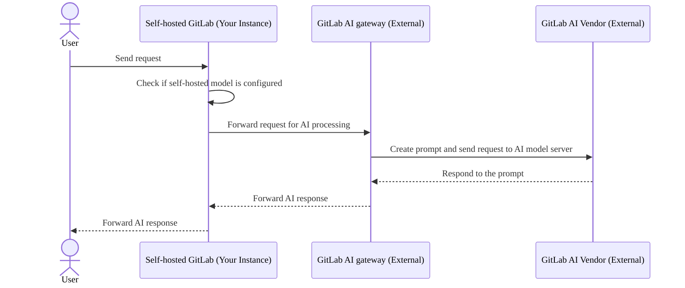
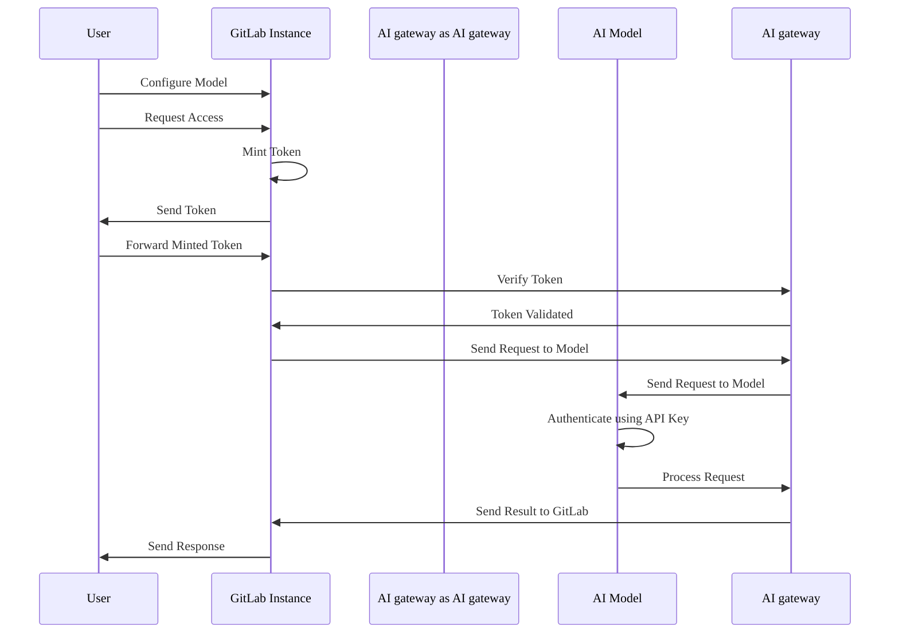



- プラン: Premium、Ultimate
- アドオン: GitLab Duo Enterprise
- 提供形態: GitLab Self-Managed





- GitLab 17.1で`ai_custom_model`[フラグ](../feature_flags/_index.md)とともに[導入](https://gitlab.com/groups/gitlab-org/-/epics/12972)されました。デフォルトでは無効になっています。
- GitLab 17.6の[GitLab Self-Managed](https://gitlab.com/groups/gitlab-org/-/epics/15176)で有効になりました。
- GitLab 17.6以降、GitLab Duoアドオンが必須となりました。
- GitLab 17.8で機能フラグ`ai_custom_model`は削除されました。
- GitLab 17.9で一般提供となりました。
- GitLab 18.0で、Premiumに含まれるようになりました。



セルフマネージドのお客様向けの設定オプションは2つあります:

- **GitLab.com AIゲートウェイ**: これはGitLab Self-Managedのお客様向けのデフォルト設定です。GitLabで選択された外部大規模言語モデル（LLM）プロバイダー（たとえば、Google VertexまたはAnthropic）で、GitLabマネージドのAIゲートウェイを使用します。
- **Self-hosted AIゲートウェイ**: GitLabが提供する外部言語プロバイダーに依存せずに、独自のAIゲートウェイと言語AIモデルをインフラストラクチャにデプロイして管理します。

## GitLab.com AIゲートウェイ {#gitlabcom-ai-gateway}

この設定では、GitLabインスタンスは外部のGitLab AIゲートウェイに依存してリクエストを送信します。これは、Google VertexやAnthropicなどの外部AIベンダーと通信します。次に、レスポンスがGitLabインスタンスに転送されます。

## Self-hosted AIゲートウェイ {#self-hosted-ai-gateway}

この設定では、システム全体が企業内で分離され、データのプライバシーを保護する完全に自己ホストされた環境が保証されます。

## GitLab Duo Self-Hostedの認証 {#authentication-for-gitlab-duo-self-hosted}

GitLab Duo Self-Hostedの認証プロセスは安全で効率的であり、次の主要コンポーネントで構成されています:

- **自己発行トークン**: このアーキテクチャでは、アクセス認証情報は`cloud.gitlab.com`と同期されていません。代わりに、トークンはGitLab.comの機能と同様に、動的に自己発行されます。この方法により、高レベルのセキュリティを維持しながら、ユーザーはすぐにアクセスできます。

- **オフライン環境**: オフラインセットアップでは、`cloud.gitlab.com`への接続はありません。すべてのリクエストは、自己ホスト型AIゲートウェイにのみルーティングされます。

- **トークンの生成と検証**: インスタンスはトークンを生成し、AIゲートウェイによってGitLabインスタンスに対して検証されます。

- **AIモデルの設定とセキュリティ**: 管理者がAIモデルを設定すると、APIキーを組み込んでリクエストを認証できます。さらに、ネットワーク内の接続IPアドレスを指定することでセキュリティを強化し、信頼できるIPのみがAIモデルと対話できるようにすることができます。

次の図に示すように:

1. 認証フローは、ユーザーがGitLabインスタンスを介してAIモデルを設定し、GitLab Duo機能にアクセスするためのリクエストを送信すると開始されます。
1. GitLabインスタンスはアクセストークンを生成し、ユーザーはそれをGitLabに転送し、次に検証のためにAIゲートウェイに転送します。
1. トークンの有効性を確認すると、AIゲートウェイはAIAIモデルにリクエストを送信します。これはAPIキーを使用してリクエストを認証し、処理します。
1. 結果はGitLabインスタンスに中継され、応答をユーザーに送信してフローが完了します。これは安全で効率的になるように設計されています。

