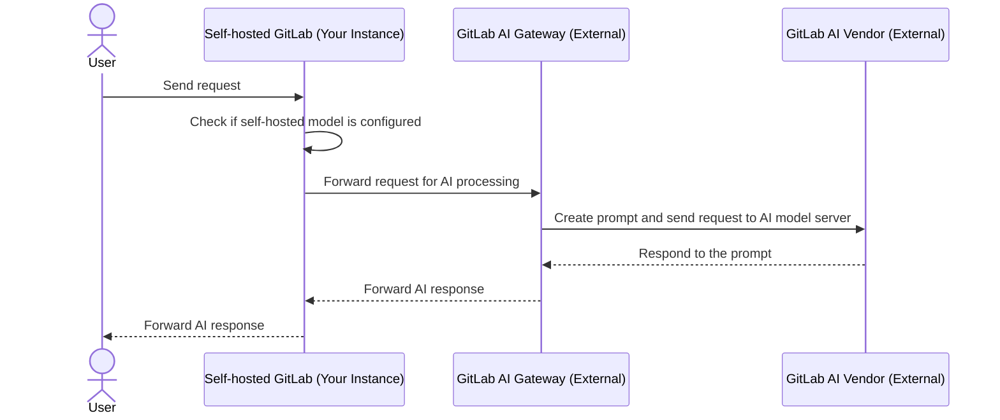
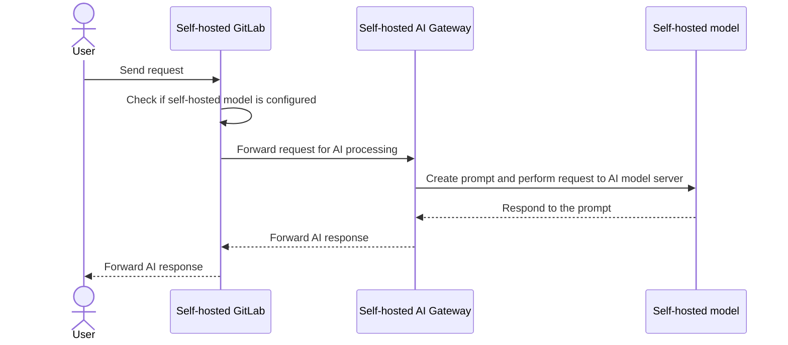
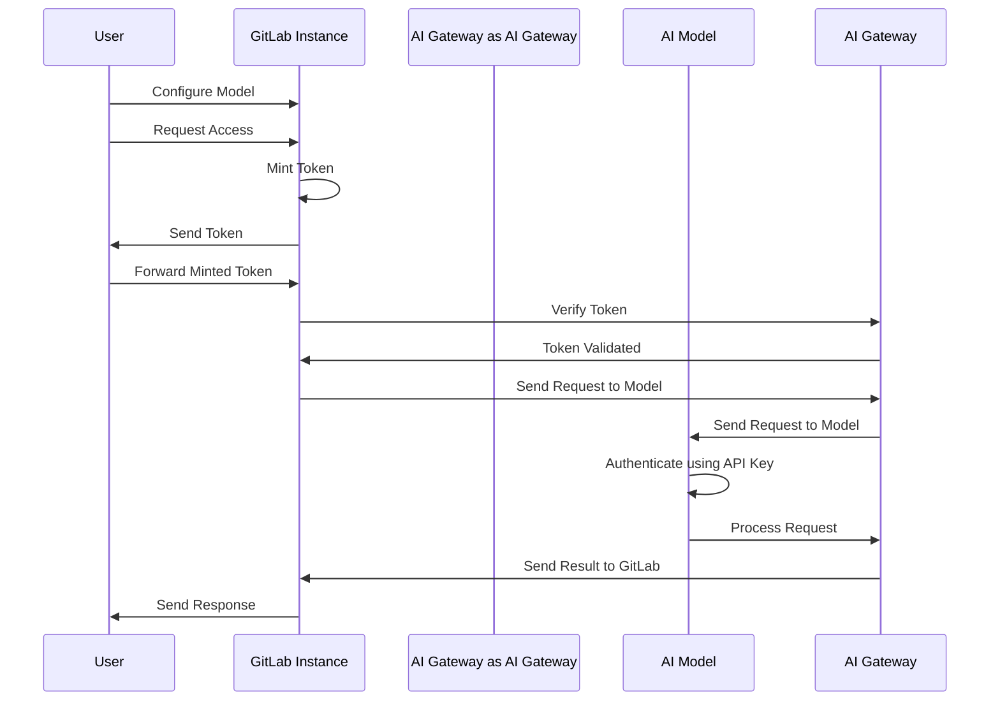



- プラン: Premium、Ultimate
- アドオン: GitLab Duo Enterprise
- 提供形態: GitLab Self-Managed





- GitLab 17.1で`ai_custom_model`[フラグ](../feature_flags/_index.md)とともに[導入](https://gitlab.com/groups/gitlab-org/-/epics/12972)されました。デフォルトでは無効になっています。
- GitLab 17.6の[GitLab Self-Managedで有効](https://gitlab.com/groups/gitlab-org/-/epics/15176)になりました。
- GitLab 17.6以降、GitLab Duoアドオンが必須となりました。
- 機能フラグ`ai_custom_model`は、GitLab 17.8で削除されました。
- GitLab 17.9で一般提供となりました。
- GitLab 18.0でPremiumを含むように変更されました。



セルフマネージドのお客様向けの設定オプションは2つあります:

- **GitLab.com AI Gateway**: これはGitLab Self-Managedのお客様向けのデフォルト設定です。GitLabが選択した外部の大規模言語モデル（LLM）プロバイダー（Google VertexやAnthropicなど）で、GitLabが管理するAIゲートウェイを使用します。
- **Self-hosted AI Gateway**: GitLabが提供する外部言語プロバイダーに依存することなく、独自のインフラストラクチャで独自のAIゲートウェイと言語モデルをデプロイし、管理します。

## GitLab.com AIゲートウェイ {#gitlabcom-ai-gateway}

この設定では、GitLabインスタンスは外部のGitLab AIゲートウェイに依存し、リクエストを送信します。これは、Google VertexやAnthropicなどの外部AIベンダーと通信します。レスポンスはGitLabインスタンスに転送されます。

## Self-hosted AIゲートウェイ {#self-hosted-ai-gateway}

この設定では、システム全体が企業内に隔離されており、データプライバシーを保護する完全なセルフホスト環境を確保します。

## GitLab Duo Self-Hostedの認証 {#authentication-for-gitlab-duo-self-hosted}

GitLab Duo Self-Hostedの認証プロセスは安全で効率的であり、次の主要コンポーネントで構成されています:

- **自己発行トークン**: このアーキテクチャでは、アクセス認証情報は`cloud.gitlab.com`と同期されません。代わりに、トークンはGitLab.comの機能と同様に、動的に自己発行されます。この方法により、高レベルのセキュリティを維持しながら、ユーザーはすぐにアクセスできます。

- **オフライン環境**: オフライン設定では、`cloud.gitlab.com`への接続はありません。すべてのリクエストは、Self-hosted AIゲートウェイにのみルーティングされます。

- **トークンの生成と検証**: インスタンスはトークンをミントし、その後、そのトークンはGitLabインスタンスに対してAIゲートウェイによって認証されます。

- **モデル設定とセキュリティ**: 管理者がモデルを設定する際、リクエストを認証するためのAPIキーを組み込むことができます。さらに、ネットワーク内で接続IPアドレスを指定することでセキュリティを強化し、信頼されたIPのみがモデルと対話できるようにします。

次の図に示すように:

1. 認証フローは、ユーザーがGitLabインスタンスを介してモデルを設定し、GitLab Duo機能にアクセスリクエストを送信することから始まります。
1. GitLabインスタンスはをミントし、ユーザーはそれをGitLabに転送し、次に認証のためにAIゲートウェイに転送します。
+1. トークンの有効性を確認すると、AIゲートウェイはAIモデルにリクエストを送信します。これは、APIキーを使用してリクエストを認証し、処理します。
1. 結果はGitLabインスタンスに中継され、レスポンスをユーザーに送信してフローが完了します。このプロセスは安全かつ効率的に設計されています。

