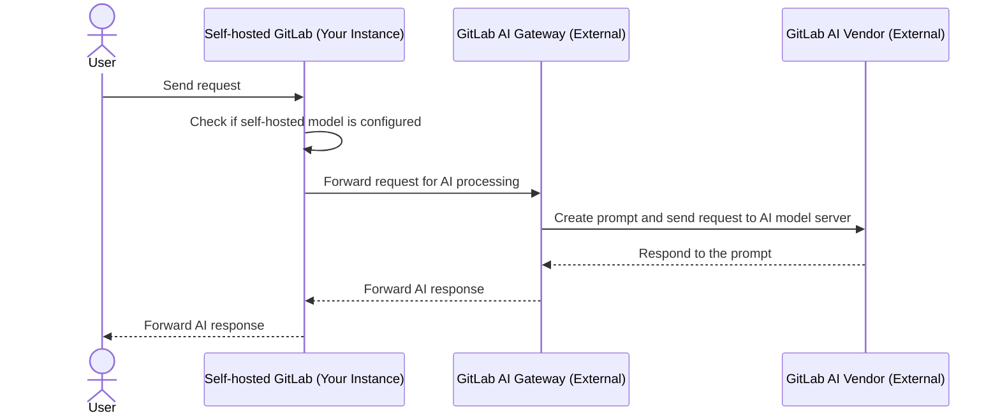
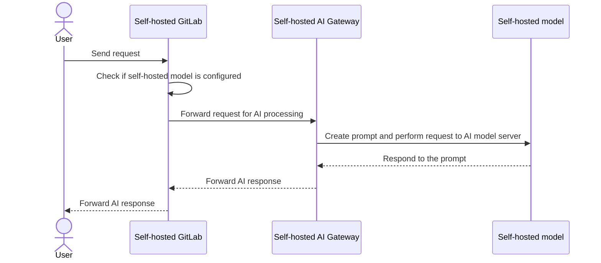
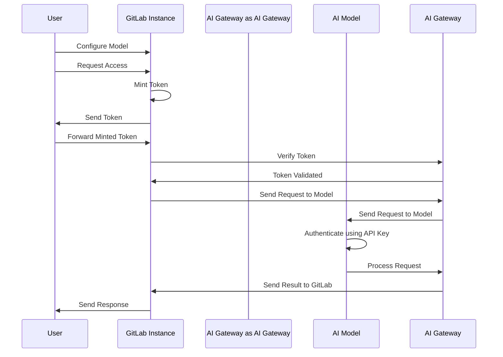



- プラン: Premium、Ultimate
- アドオン: GitLab Duo Enterprise
- 提供形態: GitLab Self-Managed





- GitLab 17.1で`ai_custom_model`[フラグ](../feature_flags/_index.md)とともに[導入](https://gitlab.com/groups/gitlab-org/-/epics/12972)されました。デフォルトでは無効になっています。
- GitLab 17.6の[GitLab Self-Managedで有効](https://gitlab.com/groups/gitlab-org/-/epics/15176)になりました。
- GitLab 17.6以降、GitLab Duoアドオンが必須になりました。
- 機能フラグ`ai_custom_model`は、GitLab 17.8で削除されました。
- GitLab 17.9で一般提供になりました。
- GitLab 18.0でPremiumを含むように変更されました。



セルフマネージドのお客様向けのAIゲートウェイの設定オプションは2つあります:

- **GitLab.com AIゲートウェイ**: これはGitLab Self-Managedのお客様向けのデフォルト設定です。GitLabが選択した外部の大規模言語モデル（LLM）プロバイダー（Google VertexやAnthropicなど）で、GitLabが管理するAIゲートウェイを使用します。
- **セルフホストAIゲートウェイ**: GitLabが提供する外部言語プロバイダーに依存することなく、独自のインフラストラクチャで独自のAIゲートウェイと言語モデルをデプロイし、管理します。

## GitLab.com AIゲートウェイ {#gitlabcom-ai-gateway}

この設定では、GitLabインスタンスは外部のGitLab AIゲートウェイに依存し、リクエストを送信します。外部のGitLab AIゲートウェイは、Google VertexやAnthropicなどの外部AIベンダーと通信します。レスポンスはGitLabインスタンスに転送されます。

```mermaid
sequenceDiagram
    accTitle: GitLab.com AI Gateway flow
    accDescr: User requests are processed through a self-hosted GitLab instance, external AI Gateway, and AI vendor.

    actor User as User
    participant SelfHostedGitLab as Self-hosted GitLab (Your Instance)
    participant GitLabAIGateway as GitLab AI Gateway (External)
    participant GitLabAIVendor as GitLab AI Vendor (External)

    User ->> SelfHostedGitLab: Send request
    SelfHostedGitLab ->> SelfHostedGitLab: Check if self-hosted model is configured
    SelfHostedGitLab ->> GitLabAIGateway: Forward request for AI processing
    GitLabAIGateway ->> GitLabAIVendor: Create prompt and send request to AI model server
    GitLabAIVendor -->> GitLabAIGateway: Respond to the prompt
    GitLabAIGateway -->> SelfHostedGitLab: Forward AI response
    SelfHostedGitLab -->> User: Forward AI response
```

## セルフホストAIゲートウェイ {#self-hosted-ai-gateway}

この設定では、システム全体が企業内に隔離されており、データプライバシーを保護する完全なセルフホスト環境を確保します。

```mermaid
sequenceDiagram
    accTitle: Self-hosted AI Gateway flow
    accDescr: User requests are processed entirely within self-hosted infrastructure using an AI Gateway and model.

    actor User as User
    participant SelfHostedGitLab as Self-hosted GitLab
    participant SelfHostedAIGateway as Self-hosted AI Gateway
    participant SelfHostedModel as Self-hosted model

    User ->> SelfHostedGitLab: Send request
    SelfHostedGitLab ->> SelfHostedGitLab: Check if self-hosted model is configured
    SelfHostedGitLab ->> SelfHostedAIGateway: Forward request for AI processing
    SelfHostedAIGateway ->> SelfHostedModel: Create prompt and perform request to AI model server
    SelfHostedModel -->> SelfHostedAIGateway: Respond to the prompt
    SelfHostedAIGateway -->> SelfHostedGitLab: Forward AI response
    SelfHostedGitLab -->> User: Forward AI response
```

## セルフホストモデルの認証 {#authentication-for-self-hosted-models}

セルフホストモデルの認証プロセスは安全で効率的であり、次の主要コンポーネントで構成されています:

- **自己発行トークン**: このアーキテクチャでは、アクセス認証情報は`cloud.gitlab.com`と同期されません。代わりに、トークンはGitLab.comの機能と同様に、動的に自己発行されます。この方法により、高レベルのセキュリティを維持しながら、ユーザーはすぐにアクセスできます。

- **オフライン環境**: オフライン設定では、`cloud.gitlab.com`への接続はありません。すべてのリクエストは、セルフホストAIゲートウェイにのみルーティングされます。

- **トークンの生成と検証**: インスタンスはトークンを生成し、AIゲートウェイによってGitLabインスタンスに対して認証されます。

- **モデル設定とセキュリティ**: 管理者がモデルを設定する際、リクエストを認証するためのAPIキーを組み込むことができます。さらに、ネットワーク内で接続IPアドレスを指定することでセキュリティを強化し、信頼されたIPのみがモデルと対話できるようにします。

次の図に示すように:

1. 認証フローは、ユーザーがGitLabインスタンスを介してモデルを設定し、GitLab Duo機能にアクセスリクエストを送信することから始まります。
1. GitLabインスタンスはアクセストークンを生成し、ユーザーはそれをGitLabに転送し、その後、検証のためにAIゲートウェイに転送します。
1. トークンの有効性を確認すると、AIゲートウェイはAIモデルにリクエストを送信します。モデルはAPIキーを使用してリクエストを認証し、処理します。
1. 結果はGitLabインスタンスに中継され、レスポンスをユーザーに送信してフローが完了します。このプロセスは安全かつ効率的に設計されています。

```mermaid
sequenceDiagram
    accTitle: GitLab Duo authentication flow
    accDescr: Authentication tokens are minted, verified, and used to secure AI model requests.

    participant User as User
    participant GitLab as GitLab Instance
    participant AI Gateway as AI Gateway
    participant AIModel as AI Model

    User->>GitLab: Configure Model
    User->>GitLab: Request Access
    GitLab->>GitLab: Mint Token
    GitLab->>User: Send Token
    User->>GitLab: Forward Minted Token
    GitLab->>AI Gateway: Verify Token
    AI Gateway->>GitLab: Token Validated
    GitLab->>AI Gateway: Send Request to Model
    AI Gateway->>AIModel: Send Request to Model
    AIModel->>AIModel: Authenticate using API Key
    AIModel->>AI Gateway: Process Request
    AI Gateway->>GitLab: Send Result to GitLab
    GitLab->>User: Send Response
```
