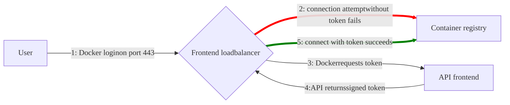



- プラン: Free、Premium、Ultimate
- 提供形態: GitLab Self-Managed





[次世代コンテナレジストリ](container_registry_metadata_database.md)が、GitLab Self-Managedインスタンスでアップグレードできるようになりました。このアップグレードされたレジストリは、オンラインガベージコレクションをサポートするほか、パフォーマンスと信頼性が大幅に向上しています。



GitLabコンテナレジストリを使用すると、すべてのプロジェクトが、Dockerイメージを保存するための独自のスペースを保持できます。

Distribution Registryの詳細については、以下を参照してください。

- [Configuration](https://distribution.github.io/distribution/about/configuration/)（設定）
- [Storage drivers](https://distribution.github.io/distribution/storage-drivers/)（ストレージドライバー）
- [Deploy a registry server](https://distribution.github.io/distribution/about/deploying/)（レジストリサーバーをデプロイする）

このドキュメントは管理者向けガイドです。GitLabコンテナレジストリの使用方法については、[ユーザードキュメント](../../user/packages/container_registry/_index.md)を参照してください。

## コンテナレジストリを有効にする {#enable-the-container-registry}

コンテナレジストリを有効にするプロセスは、使用するインストールのタイプによって異なります。

### Linuxパッケージインストール {#linux-package-installations}

Linuxパッケージを使用してGitLabをインストールした場合、コンテナレジストリはデフォルトで使用できるときと、そうでないときがあります。

組み込みの[Let's Encryptインテグレーション](https://docs.gitlab.com/omnibus/settings/ssl/#enable-the-lets-encrypt-integration)を使用している場合、コンテナレジストリは、GitLabドメインのポート5050で自動的に有効になって使用できるようになります。

そうでない場合、コンテナレジストリは有効になりません。有効にするには、次の手順に従います。

- [GitLabドメイン](#configure-container-registry-under-an-existing-gitlab-domain)用にコンテナレジストリを設定できます。
- または、[別のドメイン](#configure-container-registry-under-its-own-domain)用にコンテナレジストリを設定できます。

コンテナレジストリは、デフォルトでHTTPSで動作します。HTTPを使用できますが、推奨されておらず、このドキュメントでは扱いません。

### Helmチャートによるインストール {#helm-charts-installations}

Helmチャートによるインストールについては、Helmチャートに関するドキュメントの[コンテナレジストリを使用する](https://docs.gitlab.com/charts/charts/registry/)を参照してください。

### 自己コンパイルによるインストール {#self-compiled-installations}

GitLabインストールを自分でコンパイルした場合は、次の手順に従います。

1. インストールするGitLabのバージョンに対応するイメージ（例: `registry.gitlab.com/gitlab-org/build/cng/gitlab-container-registry:v3.15.0-gitlab`）を使用して、レジストリをデプロイする必要があります。
1. インストールの完了後、レジストリを有効にするには、`gitlab.yml`でレジストリの設定を構成する必要があります。
1. [`lib/support/nginx/registry-ssl`](https://gitlab.com/gitlab-org/gitlab/-/blob/master/lib/support/nginx/registry-ssl)にあるサンプルNGINX設定ファイルを使用して、`host`、`port`、TLS証明書のパスに一致するようにレジストリを編集します。

`gitlab.yml`の内容は次のとおりです。

```yaml
registry:
  enabled: true
  host: <registry.gitlab.example.com>
  port: <5005>
  api_url: <http://localhost:5000/>
  key: <config/registry.key>
  path: <shared/registry>
  issuer: <gitlab-issuer>
```

各設定項目の意味は次のとおりです。

| パラメータ | 説明 |
| --------- | ----------- |
| `enabled` | `true`または`false`。GitLabでレジストリを有効にします。デフォルトで、`false`です。 |
| `host`    | レジストリが実行され、ユーザーが使用できるホストURL。 |
| `port`    | 外部レジストリドメインがリッスンするポート。 |
| `api_url` | レジストリが公開される内部API URL。デフォルトは`http://localhost:5000`です。[外部Dockerレジストリ](#use-an-external-container-registry-with-gitlab-as-an-auth-endpoint)を設定する場合を除き、このURLを変更しないでください。 |
| `key`     | レジストリの`rootcertbundle`のペアである秘密キーの場所。 |
| `path`    | これは、レジストリの`rootdirectory`で指定されているものと同じディレクトリである必要があります。このパスは、GitLabユーザー、Webサーバーユーザー、レジストリユーザーが読み取り可能である必要があります。 |
| `issuer`  | これは、レジストリの`issuer`で設定されているものと同じ値である必要があります。 |

ソースからGitLabをインストールする場合、レジストリの初期化ファイルはGitLabに同梱されていません。したがって、設定を変更しても、[GitLabを再起動](../restart_gitlab.md#self-compiled-installations)してレジストリを再起動することはできません。それを行う方法については、アップストリームドキュメントをお読みください。

最小限の**絶対的**な条件として、レジストリの設定に、サービスとしての`container_registry`とレルムとしての`https://gitlab.example.com/jwt/auth`があることを確認してください。

```yaml
auth:
  token:
    realm: <https://gitlab.example.com/jwt/auth>
    service: container_registry
    issuer: gitlab-issuer
    rootcertbundle: /root/certs/certbundle
```



`auth`が設定されていない場合、ユーザーは認証なしでDockerイメージをプルできます。



## コンテナレジストリドメインの設定 {#container-registry-domain-configuration}

レジストリの外部ドメインは、次のいずれかの方法で設定できます。

- [既存のGitLabドメインを使用します](#configure-container-registry-under-an-existing-gitlab-domain)。レジストリはポートでリッスンし、GitLabのTLS証明書を再利用します。
- [完全に別のドメイン](#configure-container-registry-under-its-own-domain)とその新しいTLS証明書を使用します。

コンテナレジストリにはTLS証明書が必要なため、コストが考慮事項となる場合があります。

コンテナレジストリを初めて設定する前に、この点を考慮してください。

### 既存のGitLabドメインでコンテナレジストリを設定する {#configure-container-registry-under-an-existing-gitlab-domain}

既存のGitLabドメインを使用するようにコンテナレジストリが設定されている場合、ポートでコンテナレジストリを公開できます。これにより、既存のGitLab TLS証明書を再利用できます。

GitLabドメインが`https://gitlab.example.com`で、外部へのポートが`5050`の場合、コンテナレジストリを設定するには、次のことを行います。

- Linuxパッケージインストールを使用している場合は、`gitlab.rb`を編集します。
- 自己コンパイルによるインストールを使用している場合は、`gitlab.yml`を編集します。

レジストリがリッスンするポート（デフォルトでは`5000`）とは異なるポートを選択してください。そうしないと、競合が発生します。



ホストとコンテナのファイアウォールルールは、`gitlab_rails['registry_port']`（デフォルトでは`5000`）の下にリストされているポートではなく、`registry_external_url`行の下にリストされているポートを通過するトラフィックを許可するように設定する必要があります。







1. `/etc/gitlab/gitlab.rb`には、レジストリURLに加えて、GitLabで使用されている既存のTLS証明書とキーへのパスを含める必要があります。

   ```ruby
   registry_external_url '<https://gitlab.example.com:5050>'
   ```

   `registry_external_url`は既存のGitLab URLのHTTPSでリッスンしますが、ポートは異なります。

   TLS証明書が`/etc/gitlab/ssl/gitlab.example.com.crt`になく、キーが`/etc/gitlab/ssl/gitlab.example.com.key`にない場合は、以下の行をアンコメントします。

   ```ruby
   registry_nginx['ssl_certificate'] = "</path/to/certificate.pem>"
   registry_nginx['ssl_certificate_key'] = "</path/to/certificate.key>"
   ```

1. ファイルを保存して、[GitLabを再設定](../restart_gitlab.md#reconfigure-a-linux-package-installation)し、変更を有効にします。

1. 以下を使用して検証します。

   ```shell
   openssl s_client -showcerts -servername gitlab.example.com -connect gitlab.example.com:5050 > cacert.pem
   ```

証明書プロバイダーがCAバンドル証明書を提供している場合は、それらの証明書をTLS証明書ファイルに追加します。

管理者は、コンテナレジストリが`5678`などの任意のポートでリッスンすることを望むかもしれません。しかし、レジストリとアプリケーションサーバーは、ポート`80`および`443`のみでリッスンするAWSアプリケーションロードバランサーの背後にあります。管理者は`registry_external_url`のポート番号を削除して、HTTPまたはHTTPSが想定されるようにすることができます。その結果、ロードバランサーをレジストリにマップするルールが適用され、ポート`80`または`443`から任意のポートに変更されます。これは、ユーザーがコンテナレジストリの`docker login`の例に依存している場合に重要です。次に例を示します。

```ruby
registry_external_url '<https://registry-gitlab.example.com>'
registry_nginx['redirect_http_to_https'] = true
registry_nginx['listen_port'] = 5678
```





1. `/home/git/gitlab/config/gitlab.yml`を開き、`registry`エントリを見つけて、次の設定で構成します。

   ```yaml
   registry:
     enabled: true
     host: <gitlab.example.com>
     port: 5050
   ```

1. ファイルを保存して、[GitLabを再起動](../restart_gitlab.md#self-compiled-installations)し、変更を有効にします。
1. NGINXでも、関連する変更（ドメイン、ポート、TLS証明書パス）を行います。





これで、ユーザーは次のコマンドを使用して、GitLab認証情報でコンテナレジストリにサインインできるはずです。

```shell
docker login <gitlab.example.com:5050>
```

### 独自のドメインでコンテナレジストリを設定する {#configure-container-registry-under-its-own-domain}

独自のドメインを使用するようにレジストリが設定されている場合は、その特定のドメイン（例: `registry.example.com`）のTLS証明書が必要です。既存のGitLabドメインのサブドメインでホストされている場合は、ワイルドカード証明書が必要になる場合があります。たとえば、`*.gitlab.example.com`は`registry.gitlab.example.com`に一致するワイルドカードであり、`*.example.com`とは異なります。

手動で生成されたSSL証明書（ここで説明しています）だけでなく、Let's Encryptによって自動的に生成された証明書も[Linuxパッケージのインストールでサポート](https://docs.gitlab.com/omnibus/settings/ssl/)されています。

`https://registry.gitlab.example.com`でコンテナレジストリにアクセスできるようにしたいとします。





1. TLS証明書とキーを`/etc/gitlab/ssl/<registry.gitlab.example.com>.crt`と`/etc/gitlab/ssl/<registry.gitlab.example.com>.key`に配置し、正しい権限があることを確認します。

   ```shell
   chmod 600 /etc/gitlab/ssl/<registry.gitlab.example.com>.*
   ```

1. TLS証明書を配置したら、`/etc/gitlab/gitlab.rb`を次のように編集します。

   ```ruby
   registry_external_url '<https://registry.gitlab.example.com>'
   ```

   `registry_external_url`はHTTPSでリッスンしています。

1. ファイルを保存して、[GitLabを再設定](../restart_gitlab.md#reconfigure-a-linux-package-installation)し、変更を有効にします。

[ワイルドカード証明書](https://en.wikipedia.org/wiki/Wildcard_certificate)がある場合は、URLに加えて、証明書へのパスを指定する必要があります。この場合、`/etc/gitlab/gitlab.rb`は次のようになります。

```ruby
registry_nginx['ssl_certificate'] = "/etc/gitlab/ssl/certificate.pem"
registry_nginx['ssl_certificate_key'] = "/etc/gitlab/ssl/certificate.key"
```





1. `/home/git/gitlab/config/gitlab.yml`を開き、`registry`エントリを見つけて、次の設定で構成します。

   ```yaml
   registry:
     enabled: true
     host: <registry.gitlab.example.com>
   ```

1. ファイルを保存して、[GitLabを再起動](../restart_gitlab.md#self-compiled-installations)し、変更を有効にします。
1. NGINXでも、関連する変更（ドメイン、ポート、TLS証明書パス）を行います。





これで、ユーザーはGitLab認証情報を使用して、コンテナレジストリにサインインできるはずです。

```shell
docker login <registry.gitlab.example.com>
```

## コンテナレジストリをサイト全体で無効にする {#disable-container-registry-site-wide}

これらの手順に従ってレジストリを無効にしても、既存のDockerイメージは削除されません。Dockerイメージの削除は、レジストリアプリケーション自体によって処理されます。





1. `/etc/gitlab/gitlab.rb`を開き、`registry['enable']`を`false`に設定します。

   ```ruby
   registry['enable'] = false
   ```

1. ファイルを保存して、[GitLabを再設定](../restart_gitlab.md#reconfigure-a-linux-package-installation)し、変更を有効にします。





1. `/home/git/gitlab/config/gitlab.yml`を開き、`registry`エントリを見つけて、`enabled`を`false`に設定します。

   ```yaml
   registry:
     enabled: false
   ```

1. ファイルを保存して、[GitLabを再起動](../restart_gitlab.md#self-compiled-installations)し、変更を有効にします。





## 新しいプロジェクトのコンテナレジストリをサイト全体で無効にする {#disable-container-registry-for-new-projects-site-wide}

コンテナレジストリが有効になっている場合、すべての新しいプロジェクトで使用可能になります。この機能を無効にして、プロジェクトのオーナーがコンテナレジストリを自分で有効にできるようにするには、次の手順に従います。





1. `/etc/gitlab/gitlab.rb`を編集して、次の行を追加します。

   ```ruby
   gitlab_rails['gitlab_default_projects_features_container_registry'] = false
   ```

1. ファイルを保存して、[GitLabを再設定](../restart_gitlab.md#reconfigure-a-linux-package-installation)し、変更を有効にします。





1. `/home/git/gitlab/config/gitlab.yml`を開き、`default_projects_features`エントリを見つけて、`container_registry`が`false`に設定されるように構成します。

   ```yaml
   ## Default project features settings
   default_projects_features:
     issues: true
     merge_requests: true
     wiki: true
     snippets: false
     builds: true
     container_registry: false
   ```

1. ファイルを保存して、[GitLabを再起動](../restart_gitlab.md#self-compiled-installations)し、変更を有効にします。





### トークンの持続時間を増やす {#increase-token-duration}

GitLabでは、コンテナレジストリのトークンは5分ごとに期限切れになります。トークンの持続時間を増やすには、次の手順に従います。

1. 左側のサイドバーの下部で、**管理者**を選択します。
1. **設定 > CI/CD**を選択します。
1. **コンテナレジストリ**を展開します。
1. **認証トークンの持続時間（分）**の値を更新します。
1. **変更を保存**を選択します。

## コンテナレジストリのストレージを設定する {#configure-storage-for-the-container-registry}



この機能をサポートしているストレージバックエンドの場合、オブジェクトのバージョニングを使用して、バケットに保存されているすべてのオブジェクトの最新バージョン以外のバージョンを保持、取得、復元することができます。ただし、これにより、ストレージの使用量とコストが増加する可能性があります。レジストリの仕組みにより、イメージのアップロードは最初に一時パスに保存され、その後、最終的な場所に転送されます。S3やGCSなどのオブジェクトストレージバックエンドの場合、この転送は、コピーした後、削除することで行われます。オブジェクトのバージョニングが有効になっていると、これらの削除された一時的なアップロードアーティファクトは最新バージョン以外のバージョンとして保持されるため、ストレージバケットのサイズが大きくなります。最新バージョン以外のバージョンが一定時間後に削除されるようにするには、ストレージプロバイダーと協力してオブジェクトライフサイクルポリシーを設定する必要があります。





コンテナレジストリに保存されているファイルまたはオブジェクトを直接変更しないでください。レジストリ以外がこれらのエントリを書き込んだり削除したりすると、インスタンス全体のデータの一貫性や不安定性に関する問題が発生し、リカバリーできなくなる可能性があります。



ストレージドライバーを設定することにより、さまざまなストレージバックエンドを使用するようにコンテナレジストリを設定できます。デフォルトでは、GitLabコンテナレジストリは、[ファイルシステムドライバー](#use-file-system)設定を使用するように設定されています。

サポートされているドライバーは次のとおりです。

| ドライバー       | 説明                          |
|--------------|--------------------------------------|
| `filesystem` | ローカルファイルシステムのパスを使用します |
| `azure`      | Microsoft Azure Blob Storage         |
| `gcs`        | Google Cloud Storage                 |
| `s3`         | Amazon Simple Storage Service。正しい[S3権限スコープ](https://distribution.github.io/distribution/storage-drivers/s3/#s3-permission-scopes)でストレージバケットを設定してください。 |

ほとんどのS3互換サービス（[MinIO](https://min.io/)など）はコンテナレジストリで動作するはずですが、AWS S3のサポートのみが保証されています。サードパーティのS3実装の正しさは保証できないため、問題のデバッグは可能ですが、AWS S3バケットに対して問題を再現できない限り、レジストリにパッチを適用することはできません。

### ファイルシステムを使用する {#use-file-system}

ファイルシステムにイメージを保存する場合は、以下の手順に従って、コンテナレジストリのストレージパスを変更できます。

このパスには、次のユーザーがアクセスできます。

- コンテナレジストリデーモンを実行しているユーザー。
- GitLabを実行しているユーザー。

GitLab、レジストリ、Webサーバーのすべてのユーザーがこのディレクトリにアクセスできる必要があります。





Linuxパッケージのインストールでイメージが保存されるデフォルトの場所は、`/var/opt/gitlab/gitlab-rails/shared/registry`です。変更するには、次の手順に従います。

1. `/etc/gitlab/gitlab.rb`を編集します。

   ```ruby
   gitlab_rails['registry_path'] = "</path/to/registry/storage>"
   ```

1. ファイルを保存して、[GitLabを再設定](../restart_gitlab.md#reconfigure-a-linux-package-installation)し、変更を有効にします。





自己コンパイルによるインストールでイメージが保存されるデフォルトの場所は、`/home/git/gitlab/shared/registry`です。変更するには、次の手順に従います。

1. `/home/git/gitlab/config/gitlab.yml`を開き、`registry`エントリを見つけて、`path`設定を変更します。

   ```yaml
   registry:
     path: shared/registry
   ```

1. ファイルを保存して、[GitLabを再起動](../restart_gitlab.md#self-compiled-installations)し、変更を有効にします。





### オブジェクトストレージを使用する {#use-object-storage}

ローカルファイルシステムの代わりに、オブジェクトストレージにコンテナレジストリイメージを保存する場合は、サポートされているストレージドライバーのいずれかを設定できます。

詳細については、[オブジェクトストレージ](../object_storage.md)を参照してください。



GitLabは、ファイルシステムに保存されていないDockerイメージをバックアップしません。必要に応じて、オブジェクトストレージプロバイダーでバックアップを有効にしてください。



#### Linuxパッケージのインストールのオブジェクトストレージを設定する {#configure-object-storage-for-linux-package-installations}

コンテナレジストリのオブジェクトストレージを設定するには、次の手順に従います。

1. 使用するストレージドライバーを選択します。
1. 適切な設定で`/etc/gitlab/gitlab.rb`を編集します。
1. ファイルを保存して、[GitLabを再設定](../restart_gitlab.md#reconfigure-a-linux-package-installation)し、変更を有効にします。





S3ストレージドライバーは、Amazon S3またはS3互換のオブジェクトストレージサービスと連携します。

<!--- start_remove The following content will be removed on remove_date: '2025-08-15' -->



AWS SDK v1を使用するS3ストレージドライバーは、GitLab 17.10で[非推奨](https://gitlab.com/gitlab-org/gitlab/-/issues/523095)となり、GitLab 19.0で削除される予定です。

代わりに、2025年5月に利用可能になる`s3_v2`ドライバー（ベータ版）を使用してください。このドライバーでは、パフォーマンス、信頼性、AWS認証要件との互換性が向上しています。これは破壊的な変更ですが、新しいドライバーは徹底的にテストされており、ほとんどの設定でドロップイン置換となるように設計されています。

本番環境にデプロイする前に、非本番環境で新しいドライバーをテストして、特定のセットアップおよび使用パターンとの互換性を確認してください。これにより、環境に固有のエッジケースを特定して対処できます。

[イシュー525855](https://gitlab.com/gitlab-org/gitlab/-/issues/525855)を使用して、イシューやフィードバックを報告してください。



<!--- end_remove -->

`s3_v2`ドライバー（ベータ版）はAWS SDK v2を使用し、認証に対して署名バージョン4のみをサポートします。このドライバーについては、パフォーマンスと信頼性が向上しているほか、古い署名方法のサポートが非推奨になったため、AWS認証要件との互換性が確保されています。詳細については、[エピック16272](https://gitlab.com/groups/gitlab-org/-/epics/16272)を参照してください。

各ドライバーのすべての設定パラメータのリストについては、[`s3_v1`](https://gitlab.com/gitlab-org/container-registry/-/blob/f4ece8cdba4413b968c8a3fd20497a8186f23d26/docs/storage-drivers/s3_v1.md)および[`s3_v2`](https://gitlab.com/gitlab-org/container-registry/-/blob/f4ece8cdba4413b968c8a3fd20497a8186f23d26/docs/storage-drivers/s3_v2.md)を参照してください。

S3ストレージドライバーを設定するには、次のいずれかの設定を`/etc/gitlab/gitlab.rb`ファイルに追加します。

```ruby
# Deprecated: Will be removed in GitLab 19.0
registry['storage'] = {
  's3' => {
    'accesskey' => '<s3-access-key>',
    'secretkey' => '<s3-secret-key-for-access-key>',
    'bucket' => '<your-s3-bucket>',
    'region' => '<your-s3-region>',
    'regionendpoint' => '<your-s3-regionendpoint>'
  }
}
```

または

```ruby
# Beta: s3_v2 driver
registry['storage'] = {
  's3_v2' => {
    'accesskey' => '<s3-access-key>',
    'secretkey' => '<s3-secret-key-for-access-key>',
    'bucket' => '<your-s3-bucket>',
    'region' => '<your-s3-region>',
    'regionendpoint' => '<your-s3-regionendpoint>'
  }
}
```

セキュリティを強化するため、`accesskey`パラメータと`secretkey`パラメータを使用せずに、静的な認証情報の代わりにIAMロールを使用できます。

ストレージコストの増加を防ぐため、S3バケットで、不完全なマルチパートアップロードをパージするようにライフサイクルポリシーを設定します。コンテナレジストリは、これらを自動的にクリーンアップしません。不完全なマルチパートアップロードの3日間という有効期限ポリシーは、ほとんどの利用パターンに適しています。



`loglevel`設定は、[`s3_v1`](https://gitlab.com/gitlab-org/container-registry/-/blob/f4ece8cdba4413b968c8a3fd20497a8186f23d26/docs/storage-drivers/s3_v1.md#configuration-parameters)ドライバーと[`s3_v2`](https://gitlab.com/gitlab-org/container-registry/-/blob/f4ece8cdba4413b968c8a3fd20497a8186f23d26/docs/storage-drivers/s3_v2.md#configuration-parameters)ドライバーで異なります。正しくないドライバーに`loglevel`を設定すると、この設定は無視され、警告メッセージが表示されます。



`s3_v2`ドライバーでMinIOを使用する場合は、`checksum_disabled`パラメータを追加して、AWSチェックサムを無効にします。

```ruby
registry['storage'] = {
  's3_v2' => {
    'accesskey' => '<s3-access-key>',
    'secretkey' => '<s3-secret-key-for-access-key>',
    'bucket' => '<your-s3-bucket>',
    'region' => '<your-s3-region>',
    'regionendpoint' => '<your-s3-regionendpoint>',
    'checksum_disabled' => true
  }
}
```

S3 VPCエンドポイントの場合:

```ruby
registry['storage'] = {
  's3_v2' => {  # Beta driver
    'accesskey' => '<s3-access-key>',
    'secretkey' => '<s3-secret-key-for-access-key>',
    'bucket' => '<your-s3-bucket>',
    'region' => '<your-s3-region>',
    'regionendpoint' => '<your-s3-vpc-endpoint>',
    'pathstyle' => false
  }
}
```

S3設定パラメータ:

- `<your-s3-bucket>`: 既存のバケットの名前。サブディレクトリを含めることはできません。
- `regionendpoint`: MinIOやAWS S3 VPCエンドポイントのようなS3互換サービスを使用する場合に必要です。
- `pathstyle`: URL形式を制御します。`host/bucket_name/object`（ほとんどのS3互換サービス）にするには`true`に、`bucket_name.host/object`（AWS S3）にするには`false`に設定します。

S3 APIからの503エラーを回避するために、`maxrequestspersecond`パラメータを追加して、接続に対するレート制限を設定します。

```ruby
registry['storage'] = {
  's3' => {
    'accesskey' => '<s3-access-key>',
    'secretkey' => '<s3-secret-key-for-access-key>',
    'bucket' => '<your-s3-bucket>',
    'region' => '<your-s3-region>',
    'regionendpoint' => '<your-s3-regionendpoint>',
    'maxrequestspersecond' => 100
  }
}
```





Azure Storageドライバーは、Microsoft Azure Blob Storageと連携します。



従来のAzure Storageドライバーは、GitLab 17.10で[非推奨](https://gitlab.com/gitlab-org/gitlab/-/issues/523096)となり、GitLab 19.0で削除される予定です。

代わりに`azure_v2`ドライバー（ベータ）を使用してください。このドライバーでは、パフォーマンスと信頼性が向上しており、最新の認証方法がサポートされます。これは破壊的な変更ですが、新しいドライバーは広範にテストされており、ほとんどの設定でスムーズな移行を行うことができます。

本番環境にデプロイする前に、非本番環境で新しいドライバーをテストして、環境および使用パターンに固有のエッジケースを特定して対処してください。

[イシュー525855](https://gitlab.com/gitlab-org/gitlab/-/issues/525855)を使用して、イシューやフィードバックを報告してください。



各ドライバーのすべての設定パラメータのリストについては、[`azure_v1`](https://gitlab.com/gitlab-org/container-registry/-/blob/7b1786d261481a3c69912ad3423225f47f7c8242/docs/storage-drivers/azure_v1.md)および[`azure_v2`](https://gitlab.com/gitlab-org/container-registry/-/blob/7b1786d261481a3c69912ad3423225f47f7c8242/docs/storage-drivers/azure_v2.md)を参照してください。

Azure Storageドライバーを設定するには、次のいずれかの設定を`/etc/gitlab/gitlab.rb`ファイルに追加します。

```ruby
# Deprecated: Will be removed in GitLab 19.0
registry['storage'] = {
  'azure' => {
    'accountname' => '<your_storage_account_name>',
    'accountkey' => '<base64_encoded_account_key>',
    'container' => '<container_name>'
  }
}
```

または

```ruby
# Beta: azure_v2 driver
registry['storage'] = {
  'azure_v2' => {
    'credentials_type' => '<client_secret>',
    'tenant_id' => '<your_tenant_id>',
    'client_id' => '<your_client_id>',
    'secret' => '<your_secret>',
    'container' => '<your_container>',
    'accountname' => '<your_account_name>'
  }
}
```

デフォルトでは、Azure Storageドライバーは`core.windows.net realm`を使用します。Azureセクションでレルムに別の値を設定できます（たとえば、Azure Government Cloudの場合は`core.usgovcloudapi.net`）。





GCSストレージドライバーは、Google Cloud Storageと連携します。

```ruby
registry['storage'] = {
  'gcs' => {
    'bucket' => '<your_bucket_name>',
    'keyfile' => '<path/to/keyfile>',
    # If you have the bucket shared with other apps beyond the registry, uncomment the following:
    # 'rootdirectory' => '/gcs/object/name/prefix'
  }
}
```

GitLabは、[利用可能なすべてのパラメータ](https://docs.docker.com/registry/storage-drivers/gcs/)をサポートしています。





#### 自己コンパイルによるインストール {#self-compiled-installations-1}

ストレージドライバーの設定は、Dockerレジストリをデプロイしたときに作成されたレジストリ設定YAMLファイルで行います。

`s3`ストレージドライバーの例:

```yaml
storage:
  s3:
    accesskey: '<s3-access-key>'                # Not needed if IAM role used
    secretkey: '<s3-secret-key-for-access-key>' # Not needed if IAM role used
    bucket: '<your-s3-bucket>'
    region: '<your-s3-region>'
    regionendpoint: '<your-s3-regionendpoint>'
  cache:
    blobdescriptor: inmemory
  delete:
    enabled: true
```

`<your-s3-bucket>`は、既存のバケットの名前である必要があり、サブディレクトリを含めることはできません。

#### ダウンタイムなしでオブジェクトストレージに移行する {#migrate-to-object-storage-without-downtime}



[AWS DataSync](https://aws.amazon.com/datasync/)を使用してレジストリデータをS3バケットに、またはS3バケット間でコピーすると、バケット内に無効なメタデータオブジェクトが作成されます。詳細については、[名前が空のタグ](container_registry_troubleshooting.md#tags-with-an-empty-name)を参照してください。S3バケットに、またはS3バケット間でデータを移動するには、AWS CLI `sync`操作をおすすめします。



コンテナレジストリを停止せずにストレージを移行するには、コンテナレジストリを読み取り専用モードに設定します。大規模なインスタンスでは、コンテナレジストリをしばらくの間、読み取り専用モードにする必要があります。この間、コンテナレジストリからプルすることはできますが、プッシュすることはできません。

1. （オプション）移行するデータ量を減らすには、[ガベージコレクションツールをダウンタイムなしで](#performing-garbage-collection-without-downtime)実行します。
1. この例では、`aws`コマンドラインインターフェースを使用します。以前にコマンドラインインターフェースを設定していない場合は、`sudo aws configure`を実行して、認証情報を設定する必要があります。管理者以外のユーザーはコンテナレジストリフォルダーにアクセスできない可能性が高いため、`sudo`を使用するようにしてください。認証情報の設定を確認するには、[`ls`](https://awscli.amazonaws.com/v2/documentation/api/latest/reference/s3/ls.html) を実行して、すべてのバケットをリストします。

   ```shell
   sudo aws --endpoint-url <https://your-object-storage-backend.com> s3 ls
   ```

   AWSをバックエンドとして使用している場合、[`--endpoint-url`](https://docs.aws.amazon.com/cli/latest/reference/#options)は必要ありません。
1. たとえば、`aws`コマンドラインインターフェース[`cp`](https://awscli.amazonaws.com/v2/documentation/api/latest/reference/s3/cp.html)または[`sync`](https://awscli.amazonaws.com/v2/documentation/api/latest/reference/s3/sync.html)コマンドを使用して、初期データをS3バケットにコピーします。`docker`フォルダーをバケット内のトップレベルフォルダーとして保持する必要があります。

   ```shell
   sudo aws --endpoint-url <https://your-object-storage-backend.com> s3 sync registry s3://mybucket
   ```

   

   大量のデータがある場合は、[並行同期操作を実行](https://repost.aws/knowledge-center/s3-improve-transfer-sync-command)することにより、パフォーマンスを向上させることができる場合があります。

   

1. 最終的なデータ同期を行うには、[コンテナレジストリを`read-only`モードにして](#performing-garbage-collection-without-downtime)、[GitLabを再設定します](../restart_gitlab.md#reconfigure-a-linux-package-installation)。
1. 最初のデータ読み込み以降に行われた変更をS3バケットに同期し、移行先のバケットには存在するが移行元には存在しないファイルを削除します。

   ```shell
   sudo aws --endpoint-url <https://your-object-storage-backend.com> s3 sync registry s3://mybucket --delete --dryrun
   ```

   コマンドが期待どおりに動作することを確認したら、[`--dryrun`](https://docs.aws.amazon.com/cli/latest/reference/s3/sync.html)フラグを削除してコマンドを実行します。

   

   [`--delete`](https://docs.aws.amazon.com/cli/latest/reference/s3/sync.html)フラグは、移行先には存在するが移行元には存在しないファイルを削除します。移行先と移行元を入れ替えると、レジストリ内のすべてのデータが削除されます。

   

1. 次の2つのコマンドから返されるファイル数を確認して、すべてのコンテナレジストリファイルがオブジェクトストレージにアップロードされていることを確認します。

   ```shell
   sudo find registry -type f | wc -l
   ```

   ```shell
   sudo aws --endpoint-url <https://your-object-storage-backend.com> s3 ls s3://<mybucket> --recursive | wc -l
   ```

   これらのコマンドの出力は、`_uploads`ディレクトリとそのサブディレクトリの内容を除いて一致するはずです。
1. [ストレージにS3バケットを使用](#use-object-storage)するようにレジストリを設定します。
1. 変更を有効にするには、レジストリを`read-write`モードに戻し、[GitLabを再設定](../restart_gitlab.md#reconfigure-a-linux-package-installation)します。

#### Azureオブジェクトストレージに移行する {#moving-to-azure-object-storage}





```ruby
registry['storage'] = {
  'azure' => {
    'accountname' => '<your_storage_account_name>',
    'accountkey' => '<base64_encoded_account_key>',
    'container' => '<container_name>',
    'trimlegacyrootprefix' => true
  }
}
```





```yaml
storage:
  azure:
    accountname: <your_storage_account_name>
    accountkey: <base64_encoded_account_key>
    container: <container_name>
    trimlegacyrootprefix: true
```





デフォルトでは、Azure Storageドライバーは`core.windows.net`レルムを使用します。`azure`セクションで`realm`に別の値を設定できます（たとえば、Azure Government Cloudの場合は`core.usgovcloudapi.net`）。

### ストレージドライバーのリダイレクトを無効にする {#disable-redirect-for-storage-driver}

デフォルトでは、リモートバックエンドで設定されたレジストリにアクセスするユーザーは、ストレージドライバーのデフォルトバックエンドにリダイレクトされます。たとえば、`s3`ストレージドライバーを使用してレジストリを設定できます。このストレージドライバーは、リクエストをリモートS3バケットにリダイレクトして、GitLabサーバーの負荷を軽減します。

ただし、この動作は、パブリックサーバーに通常アクセスできない内部ホストで使用されるレジストリに対しては望ましくありません。リダイレクトと[プロキシダウンロード](../object_storage.md#proxy-download)を無効にするには、次のように`disable`フラグをtrueに設定します。これにより、すべてのトラフィックが常にレジストリサービスを通過するようになります。その結果、セキュリティが向上しますが（ストレージバックエンドが公開されないため、攻撃されにくくなります）、パフォーマンスが低下します（すべてのトラフィックがサービスを経由してリダイレクトされます）。





1. `/etc/gitlab/gitlab.rb`を編集します。

   ```ruby
   registry['storage'] = {
     's3' => {
       'accesskey' => '<s3_access_key>',
       'secretkey' => '<s3_secret_key_for_access_key>',
       'bucket' => '<your_s3_bucket>',
       'region' => '<your_s3_region>',
       'regionendpoint' => '<your_s3_regionendpoint>'
     },
     'redirect' => {
       'disable' => true
     }
   }
   ```

1. ファイルを保存して、[GitLabを再設定](../restart_gitlab.md#reconfigure-a-linux-package-installation)し、変更を有効にします。





1. レジストリ設定YAMLファイルに`redirect`フラグを追加します。

   ```yaml
   storage:
     s3:
       accesskey: '<s3_access_key>'
       secretkey: '<s3_secret_key_for_access_key>'
       bucket: '<your_s3_bucket>'
       region: '<your_s3_region>'
       regionendpoint: '<your_s3_regionendpoint>'
     redirect:
       disable: true
     cache:
       blobdescriptor: inmemory
     delete:
       enabled: true
   ```

1. ファイルを保存して、[GitLabを再起動](../restart_gitlab.md#self-compiled-installations)し、変更を有効にします。





#### 暗号化されたS3バケット {#encrypted-s3-buckets}

[デフォルトでSSE-S3またはSSE-KMS暗号化が有効になっている](https://docs.aws.amazon.com/kms/latest/developerguide/services-s3.html)S3バケットに対して、AWS KMSによるサーバー側の暗号化を使用できます。カスタマーマスターキー（CMK）とSSE-C暗号化は、リクエストごとに暗号化キーを送信する必要があるため、サポートされていません。

SSE-S3の場合は、レジストリ設定の`encrypt`オプションを有効にする必要があります。これ行う方法は、GitLabをインストールした方法によって異なります。インストール方法に応じて、次の手順に従ってください。





1. `/etc/gitlab/gitlab.rb`を編集します。

   ```ruby
   registry['storage'] = {
     's3' => {
       'accesskey' => '<s3_access_key>',
       'secretkey' => '<s3_secret_key_for_access_key>',
       'bucket' => '<your_s3_bucket>',
       'region' => '<your_s3_region>',
       'regionendpoint' => '<your_s3_regionendpoint>',
       'encrypt' => true
     }
   }
   ```

1. ファイルを保存して、[GitLabを再設定](../restart_gitlab.md#reconfigure-a-linux-package-installation)し、変更を有効にします。





1. レジストリ設定YAMLファイルを編集します。

   ```yaml
   storage:
     s3:
       accesskey: '<s3_access_key>'
       secretkey: '<s3_secret_key_for_access_key>'
       bucket: '<your_s3_bucket>'
       region: '<your_s3_region>'
       regionendpoint: '<your_s3_regionendpoint>'
       encrypt: true
   ```

1. ファイルを保存して、[GitLabを再起動](../restart_gitlab.md#self-compiled-installations)し、変更を有効にします。





### ストレージの制限 {#storage-limitations}

ストレージの制限がなければ、ユーザーは任意のサイズのDockerイメージを無制限にアップロードできます。この設定は、将来のリリースで設定可能になるはずです。

## レジストリの内部ポートを変更する {#change-the-registrys-internal-port}

レジストリサーバーはデフォルトでポート`5000`のlocalhostでリッスンします。これは、レジストリサーバーが接続を受け入れるアドレスです。次の例では、レジストリのポートを`5010`に設定します。





1. `/etc/gitlab/gitlab.rb`を開き、`registry['registry_http_addr']`を設定します。

   ```ruby
   registry['registry_http_addr'] = "localhost:5010"
   ```

1. ファイルを保存して、[GitLabを再設定](../restart_gitlab.md#reconfigure-a-linux-package-installation)し、変更を有効にします。





1. レジストリサーバーの設定ファイルを開き、[`http:addr`](https://distribution.github.io/distribution/about/configuration/#http)の値を編集します。

   ```yaml
   http:
     addr: localhost:5010
   ```

1. ファイルを保存して、レジストリサーバーを再起動します。





## プロジェクトごとにコンテナレジストリを無効にする {#disable-container-registry-per-project}

GitLabインスタンスでレジストリが有効になっているが、プロジェクトに必要ない場合は、[プロジェクトの設定からレジストリを無効にする](../../user/project/settings/_index.md#configure-project-features-and-permissions)ことができます。

## GitLabを認証エンドポイントとして外部コンテナレジストリを使用する {#use-an-external-container-registry-with-gitlab-as-an-auth-endpoint}



GitLabでのサードパーティコンテナレジストリの使用は、GitLab 15.8で[非推奨](https://gitlab.com/gitlab-org/gitlab/-/issues/376217)となり、GitLab 16.0でサポートが終了しました。GitLabコンテナレジストリではなく、サードパーティコンテナレジストリを使用する必要がある場合は、[フィードバックイシュー958](https://gitlab.com/gitlab-org/container-registry/-/issues/958)でユースケースについて教えてください。



外部コンテナレジストリを使用すると、コンテナレジストリに関連付けられている一部の機能が使用できなくなったり、[固有のリスク](../../user/packages/container_registry/reduce_container_registry_storage.md#use-with-external-container-registries)が発生したりする場合があります。

インテグレーションを機能させるには、JSON Webトークンを使用してGitLabで認証するように外部レジストリを設定する必要があります。[外部レジストリのランタイム設定](https://distribution.github.io/distribution/about/configuration/#token)には、次のエントリが**必ず**含まれている必要があります。

```yaml
auth:
  token:
    realm: https://<gitlab.example.com>/jwt/auth
    service: container_registry
    issuer: gitlab-issuer
    rootcertbundle: /root/certs/certbundle
```

これらのエントリがない場合、レジストリログインはGitLabで認証できません。また、GitLabは、`registry.example.com/group/project/image-name:tag`や`registry.example.com/group/project/my/image-name:tag`など、プロジェクト階層下の[ネストされたイメージ名](../../user/packages/container_registry/_index.md#naming-convention-for-your-container-images)を認識せず、`registry.example.com/group/project:tag`のみを認識します。

### Linuxパッケージインストール {#linux-package-installations-1}

GitLabを外部コンテナレジストリの認証エンドポイントとして使用できます。

1. `/etc/gitlab/gitlab.rb`を開き、必要な設定を行います。

   ```ruby
   gitlab_rails['registry_enabled'] = true
   gitlab_rails['registry_api_url'] = "https://<external_registry_host>:5000"
   gitlab_rails['registry_issuer'] = "gitlab-issuer"
   ```

   - `gitlab_rails['registry_enabled'] = true`は、GitLabコンテナレジストリ機能と認証エンドポイントを有効にするために必要です。これを有効にしても、GitLabにバンドルされているコンテナレジストリサービスは起動しません。
   - `gitlab_rails['registry_api_url'] = "http://<external_registry_host>:5000"`は、レジストリがインストールされているホストと一致するように変更する必要があります。また、外部レジストリがTLSを使用するように設定されている場合は、`https`を指定する必要があります。

1. GitLabと外部コンテナレジストリが安全に通信するには、証明書とキーのペアが必要です。証明書とキーのペアを作成して、公開証明書（`rootcertbundle`）を使用して外部コンテナレジストリを設定し、秘密キーを使用してGitLabを設定する必要があります。そうするには、`/etc/gitlab/gitlab.rb`に次のコードを追加します。

   ```ruby
   # registry['internal_key'] should contain the contents of the custom key
   # file. Line breaks in the key file should be marked using `\n` character
   # Example:
   registry['internal_key'] = "---BEGIN RSA PRIVATE KEY---\nMIIEpQIBAA\n"

   # Optionally define a custom file for a Linux package installation to write the contents
   # of registry['internal_key'] to.
   gitlab_rails['registry_key_path'] = "/custom/path/to/registry-key.key"
   ```

   再設定が実行されるたびに、`registry_key_path`で指定されたファイルには、`internal_key`で指定されたコンテンツが入力されます。ファイルが指定されていない場合、Linuxパッケージのインストールでは、デフォルトで`/var/opt/gitlab/gitlab-rails/etc/gitlab-registry.key`になり、そのファイルに入力されます。

1. GitLabコンテナレジストリページに表示されるコンテナレジストリURLを変更するには、次のように設定します。

   ```ruby
   gitlab_rails['registry_host'] = "<registry.gitlab.example.com>"
   gitlab_rails['registry_port'] = "5005"
   ```

1. ファイルを保存して、[GitLabを再設定](../restart_gitlab.md#reconfigure-a-linux-package-installation)し、変更を有効にします。

### 自己コンパイルによるインストール {#self-compiled-installations-2}

1. `/home/git/gitlab/config/gitlab.yml`を開き、`registry`の下の設定を編集します。

   ```yaml
   ## Container registry

   registry:
     enabled: true
     host: "<registry.gitlab.example.com>"
     port: "5005"
     api_url: "https://<external_registry_host>:5000"
     path: /var/lib/registry
     key: </path/to/keyfile>
     issuer: gitlab-issuer
   ```

   これらのパラメータの意味については、[こちら](#enable-the-container-registry)をご覧ください。

1. ファイルを保存して、[GitLabを再起動](../restart_gitlab.md#self-compiled-installations)し、変更を有効にします。

## コンテナレジストリ通知を設定する {#configure-container-registry-notifications}

レジストリで発生するイベントに応じてWebhook通知を送信するようにコンテナレジストリを設定できます。

コンテナレジストリ通知設定のオプションの詳細については、[Dockerレジストリ通知のドキュメント](https://distribution.github.io/distribution/about/notifications/)を参照してください。



`threshold`パラメータのサポートは、GitLab 17.0で[非推奨](https://gitlab.com/gitlab-org/container-registry/-/issues/1243)となり、18.0で削除される予定です。代わりに`maxretries`を使用してください。



コンテナレジストリに複数のエンドポイントを設定できます。





Linuxパッケージインストールで通知エンドポイントを設定するには、次の手順に従います。

1. `/etc/gitlab/gitlab.rb`を編集します。

   ```ruby
   registry['notifications'] = [
     {
       'name' => '<test_endpoint>',
       'url' => 'https://<gitlab.example.com>/api/v4/container_registry_event/events',
       'timeout' => '500ms',
       'threshold' => 5, # DEPRECATED: use `maxretries` instead.
       'maxretries' => 5,
       'backoff' => '1s',
       'headers' => {
         "Authorization" => ["<AUTHORIZATION_EXAMPLE_TOKEN>"]
       }
     }
   ]

   gitlab_rails['registry_notification_secret'] = '<AUTHORIZATION_EXAMPLE_TOKEN>' # Must match the auth token in registry['notifications']
   ```

  

  `<AUTHORIZATION_EXAMPLE_TOKEN>`を、文字で始まり、大文字と小文字が区別される英数字文字列に置き換えます。`< /dev/urandom tr -dc _A-Z-a-z-0-9 | head -c 32 | sed "s/^[0-9]*//"; echo`を使用して、この英数字文字列を生成できます

  

1. ファイルを保存して、[GitLabを再設定](../restart_gitlab.md#reconfigure-a-linux-package-installation)し、変更を有効にします。





通知エンドポイントの設定は、Dockerレジストリをデプロイしたときに作成されたレジストリ設定YAMLファイルで行われます。

例:

```yaml
notifications:
  endpoints:
    - name: <alistener>
      disabled: false
      url: https://<my.listener.com>/event
      headers: <http.Header>
      timeout: 500
      threshold: 5 # DEPRECATED: use `maxretries` instead.
      maxretries: 5
      backoff: 1000
```





## クリーンアップポリシーを実行する {#run-the-cleanup-policy}

前提要件:

- Sidekiqとは異なるノードでコンテナレジストリが実行される分散アーキテクチャを使用している場合は、[外部Sidekiqを使用する場合のコンテナレジストリの設定](../sidekiq/_index.md#configure-the-container-registry-when-using-an-external-sidekiq)の手順に従います。

[クリーンアップポリシーを作成](../../user/packages/container_registry/reduce_container_registry_storage.md#create-a-cleanup-policy)したら、すぐに実行してコンテナレジストリのストレージ容量を削減できます。スケジュールされたクリーンアップを待つ必要はありません。

特定のプロジェクトで使用されるコンテナレジストリのディスク容量を削減するために、管理者は次のことを行えます。

1. [プロジェクトごとのディスク容量使用量を確認](#registry-disk-space-usage-by-project)して、クリーンアップが必要なプロジェクトを特定します。
1. GitLab Railsコンソールを使用してクリーンアップポリシーを実行し、イメージタグを削除します。
1. [ガベージコレクションを実行](#container-registry-garbage-collection)して、参照されていないレイヤーとタグ付けされていないマニフェストを削除します。

### プロジェクトごとのレジストリディスク容量使用量 {#registry-disk-space-usage-by-project}

各プロジェクトで使用されるディスク容量を確認するには、[GitLab Railsコンソール](../operations/rails_console.md#starting-a-rails-console-session)で次のスクリプトを実行します。

```ruby
projects_and_size = [["project_id", "creator_id", "registry_size_bytes", "project path"]]
# You need to specify the projects that you want to look through. You can get these in any manner.
projects = Project.last(100)

registry_metadata_database = ContainerRegistry::GitlabApiClient.supports_gitlab_api?

if registry_metadata_database
  projects.each do |project|
    size = project.container_repositories_size
    if size > 0
      projects_and_size << [project.project_id, project.creator&.id, size, project.full_path]
    end
  end
else
  projects.each do |project|
    project_layers = {}

    project.container_repositories.each do |repository|
      repository.tags.each do |tag|
        tag.layers.each do |layer|
          project_layers[layer.digest] ||= layer.size
        end
      end
    end

    total_size = project_layers.values.compact.sum
    if total_size > 0
      projects_and_size << [project.project_id, project.creator&.id, total_size, project.full_path]
    end
  end
end

# print it as comma separated output
projects_and_size.each do |ps|
   puts "%s,%s,%s,%s" % ps
end
```



このスクリプトは、コンテナイメージレイヤーに基づいてサイズを計算します。レイヤーは複数のプロジェクト間で共有できるため、結果はおおよその数値ですが、プロジェクト間の相対的なディスク使用量を示すことができます。



クリーンアップポリシーを実行してイメージタグを削除するには、[GitLab Railsコンソール](../operations/rails_console.md)で次のコマンドを実行します。

```ruby
# Numeric ID of the project whose container registry should be cleaned up
P = <project_id>

# Numeric ID of a user with Developer, Maintainer, or Owner role for the project
U = <user_id>

# Get required details / objects
user    = User.find_by_id(U)
project = Project.find_by_id(P)
policy  = ContainerExpirationPolicy.find_by(project_id: P)

# Loop through each container repository
project.container_repositories.find_each do |repo|
  puts repo.attributes

  # Start the tag cleanup
  puts Projects::ContainerRepository::CleanupTagsService.new(container_repository: repo, current_user: user, params: policy.attributes.except("created_at", "updated_at")).execute
end
```

[スケジュールに従ってクリーンアップを実行](../../user/packages/container_registry/reduce_container_registry_storage.md#cleanup-policy)することもできます。

すべてのプロジェクトのクリーンアップポリシーをインスタンス全体で有効にするには、コンテナレジストリがあるが、クリーンアップポリシーが無効になっているすべてのプロジェクトを見つける必要があります。

```ruby
# Find all projects where Container registry is enabled, and cleanup policies disabled

projects = Project.find_by_sql ("SELECT * FROM projects WHERE id IN (SELECT project_id FROM container_expiration_policies WHERE enabled=false AND id IN (SELECT project_id FROM container_repositories))")

# Loop through each project
projects.each do |p|

# Print project IDs and project full names
    puts "#{p.id},#{p.full_name}"
end
```

## コンテナレジストリのメタデータデータベース {#container-registry-metadata-database}



- プラン: Free、Premium、Ultimate
- 提供形態: GitLab Self-Managed





- GitLab 17.3で[一般提供](https://gitlab.com/gitlab-org/gitlab/-/issues/423459)になりました。



メタデータデータベースは、オンラインガベージコレクションなど、多くの新しいレジストリ機能を有効にするほか、多くのレジストリ操作の効率を向上させます。詳細については、[コンテナレジストリのメタデータデータベース](container_registry_metadata_database.md)のページを参照してください。

## コンテナレジストリのガベージコレクション {#container-registry-garbage-collection}

前提要件:

- Linuxパッケージまたは[GitLab Helmチャート](https://docs.gitlab.com/charts/charts/registry/#garbage-collection)を使用して、GitLabをインストールしている必要があります。



Amazon S3ライフサイクルなどのオブジェクトストレージプロバイダーの保持ポリシーにより、オブジェクトが適切に削除されなくなる場合があります。



コンテナレジストリはかなりの量のストレージ容量を使用する可能性があるため、[ストレージの使用量を削減](../../user/packages/container_registry/reduce_container_registry_storage.md)することをおすすめします。リストされているオプションの中で最も効果的なのはタグの削除です。ただし、タグを削除するだけではイメージレイヤーは削除されず、基盤となるイメージマニフェストのタグが削除されたままになります。

より効果的に容量を解放するために、コンテナレジストリには、参照されていないレイヤーと（オプションで）タグ付けされていないマニフェストを削除できるガベージコレクターがあります。

ガベージコレクターを開始するには、次の`gitlab-ctl`コマンドを実行します。

```shell
sudo gitlab-ctl registry-garbage-collect
```

ガベージコレクションの実行に必要な時間は、コンテナレジストリのデータサイズに比例します。



`registry-garbage-collect`コマンドは、ガベージコレクションの前にコンテナレジストリをシャットダウンし、ガベージコレクションが完了した後にのみコンテナレジストリを再起動します。ダウンタイムを回避したい場合は、コンテナレジストリを手動で[読み取り専用モードに設定して、`gitlab-ctl`をバイパスできます](#performing-garbage-collection-without-downtime)。

このコマンドは、メタデータがオブジェクトストレージにある場合にのみ実行されます。このコマンドは、[コンテナレジストリメタデータデータベース](#container-registry-metadata-database)が有効になっている場合には実行されません。



### コンテンツアドレス可能なレイヤーについて理解する {#understanding-the-content-addressable-layers}

初めてイメージをビルドする次の例を考えてみましょう。

```shell
# This builds a image with content of sha256:<111111...>
docker build -t <my.registry.com>/<my.group>/<my.project>:latest .
docker push <my.registry.com>/<my.group>/<my.project>:latest
```

次に、`latest`を新しいバージョンで上書きします。

```shell
# This builds a image with content of sha256:<222222...>
docker build -t <my.registry.com>/<my.group>/<my.project>:latest .
docker push <my.registry.com>/<my.group>/<my.project>:latest
```

これで、`latest`タグは`sha256:<222222...>`のマニフェストを指します。レジストリのアーキテクチャにより、`latest`タグを介して直接アクセスできなくなったとしても、イメージ`<my.registry.com>/<my.group>/<my.project>@sha256:<111111...>`をプルすると、このデータにアクセスできます。

### 参照されていないレイヤーを削除する {#remove-unreferenced-layers}

イメージレイヤーは、コンテナレジストリストレージの大部分を占めています。イメージマニフェストがレイヤーを参照していない場合、レイヤーは参照されていないと見なされます。参照されていないレイヤーは、コンテナレジストリのガベージコレクターのデフォルトのターゲットです。

設定ファイルのデフォルトの場所を変更しなかった場合は、次のコマンドを実行します。

```shell
sudo gitlab-ctl registry-garbage-collect
```

コンテナレジストリ`config.yml`の場所を変更した場合は、次のコマンドを実行します。

```shell
sudo gitlab-ctl registry-garbage-collect /path/to/config.yml
```

[タグ付けされていないマニフェストと参照されていないレイヤーをすべて削除](#removing-untagged-manifests-and-unreferenced-layers)して、追加の容量を回復することもできます。

### タグ付けされていないマニフェストと参照されていないレイヤーを削除する {#removing-untagged-manifests-and-unreferenced-layers}

デフォルトでは、コンテナレジストリのガベージコレクターはタグ付けされていないイメージを無視し、ユーザーはタグ付けされていないイメージをダイジェストでプルし続けることができます。また、ユーザーは将来、イメージに再度タグ付けして、GitLab UIとAPIで再び表示できるようにすることもできます。

タグ付けされていないイメージと、これらのイメージによって排他的に参照されるレイヤーに関心がない場合は、それらをすべて削除できます。`registry-garbage-collect`コマンドで`-m`フラグを使用します。

```shell
sudo gitlab-ctl registry-garbage-collect -m
```

タグ付けされていないイメージの削除について迷っている場合は、続行する前にレジストリデータをバックアップしてください。

### ダウンタイムなしでガベージコレクションを実行する {#performing-garbage-collection-without-downtime}

コンテナレジストリをオンラインに保ちながらガベージコレクションを実行するには、レジストリを読み取り専用モードにし、組み込みの`gitlab-ctl registry-garbage-collect`コマンドをバイパスします。

コンテナレジストリが読み取り専用モードの場合、イメージをプルできますが、プッシュすることはできません。コンテナレジストリは、ガベージコレクションの全期間にわたって読み取り専用のままでなければなりません。

デフォルトでは、[レジストリストレージパス](#configure-storage-for-the-container-registry)は`/var/opt/gitlab/gitlab-rails/shared/registry`です。

読み取り専用モードを有効にするには、次の手順に従います。

1. `/etc/gitlab/gitlab.rb`で、読み取り専用モードを指定します。

   ```ruby
   registry['storage'] = {
     'filesystem' => {
       'rootdirectory' => "<your_registry_storage_path>"
     },
     'maintenance' => {
       'readonly' => {
         'enabled' => true
       }
     }
   }
   ```

1. 保存してGitLabを再設定します。

   ```shell
   sudo gitlab-ctl reconfigure
   ```

   このコマンドは、コンテナレジストリを読み取り専用モードに設定します。

1. 次に、ガベージコレクションコマンドの1つをトリガーします。

   ```shell
   # Remove unreferenced layers
   sudo /opt/gitlab/embedded/bin/registry garbage-collect /var/opt/gitlab/registry/config.yml

   # Remove untagged manifests and unreferenced layers
   sudo /opt/gitlab/embedded/bin/registry garbage-collect -m /var/opt/gitlab/registry/config.yml
   ```

   このコマンドは、ガベージコレクションを開始します。完了までの時間は、レジストリデータサイズに比例します。

1. 完了したら、`/etc/gitlab/gitlab.rb`で、読み取り/書き込みモードに戻します。

   ```ruby
   registry['storage'] = {
     'filesystem' => {
       'rootdirectory' => "<your_registry_storage_path>"
     },
     'maintenance' => {
       'readonly' => {
         'enabled' => false
       }
     }
   }
   ```

1. 保存してGitLabを再設定します。

   ```shell
   sudo gitlab-ctl reconfigure
   ```

### スケジュールに従ってガベージコレクションを実行する {#running-the-garbage-collection-on-schedule}

理想的には、レジストリが使用されていないときに、レジストリのガベージコレクションを週に1回定期的に実行する必要があります。最も簡単な方法は、週に1回定期的に実行される新しいcrontabジョブを追加することです。

`/etc/cron.d/registry-garbage-collect`の下にファイルを作成します。

```shell
SHELL=/bin/sh
PATH=/usr/local/sbin:/usr/local/bin:/sbin:/bin:/usr/sbin:/usr/bin

# Run every Sunday at 04:05am
5 4 * * 0  root gitlab-ctl registry-garbage-collect
```

[タグ付けされていないマニフェストと参照されていないレイヤーを削除](#removing-untagged-manifests-and-unreferenced-layers)するには、`-m`フラグを追加することをおすすめします。

### ガベージコレクションを停止する {#stop-garbage-collection}

ガベージコレクションを停止することを想定している場合は、[ダウンタイムなしでガベージコレクションを実行する](#performing-garbage-collection-without-downtime)で説明されているように、ガベージコレクションを手動で実行する必要があります。その後、<kbd>Control</kbd>+<kbd>C</kbd>を押して、ガベージコレクションを停止できます。

そうしないと、`gitlab-ctl`を中断すると、レジストリサービスがダウン状態になる可能性があります。この場合、`gitlab-ctl`コマンドでレジストリサービスを再び起動できるようにするために、システムで[ガベージコレクションプロセス](https://gitlab.com/gitlab-org/omnibus-gitlab/-/blob/master/files/gitlab-ctl-commands/registry_garbage_collect.rb#L26-35)自体を見つける必要があります。

また、プロセスのマークフェーズ中に進行状況や結果を保存する方法はありません。blobが削除され始めると初めて、永続的な処理が行われます。

### 継続的なゼロダウンタイムのガベージコレクション {#continuous-zero-downtime-garbage-collection}

[メタデータデータベース](container_registry_metadata_database.md)に移行すると、ガベージコレクションのスケジュールを設定したり、読み取り専用モードを要求したりすることなく、バックグラウンドでガベージコレクションを実行できます。

## コンポーネントごとのスケーリング {#scaling-by-component}

このセクションでは、コンポーネントごとにレジストリトラフィックが増加するに伴い、パフォーマンス上のボトルネックが発生する可能性について簡単に説明します。各サブセクションは、小さいレジストリワークロードに役立つものから大きいワークロードに役立つものへと至る、おおまかな推奨事項順に記載されています。レジストリは[リファレンスアーキテクチャ](../reference_architectures/_index.md)に含まれておらず、シート数または1秒あたりのリクエスト数を対象にしたスケーリングガイドはありません。

### データベース {#database}

1. **別個のデータベースに移行する**: データベースの負荷が増加するにつれて、レジストリのメタデータデータベースを別個の物理データベースに移動して、垂直方向にスケールしてください。別個のデータベースを使用すると、レジストリによって生成されるトラフィックを分離しながら、レジストリデータベースで使用できるリソースの量を増やすことができます。
1. **HA PostgreSQLサードパーティソリューションに移行する**: [Praefect](../reference_architectures/5k_users.md#praefect-ha-postgresql-third-party-solution)と同様に、評価の高いプロバイダーまたはソリューションに移行すると、HAが実現し、マルチノードレジストリデプロイが簡単になります。レジストリはネイティブのPostgresパーティション、トリガー、および関数を多用するため、これらをサポートするプロバイダーを選択する必要があります。

### レジストリサーバー {#registry-server}

1. **別個のノードに移行する**: [別個のノード](#configure-gitlab-and-registry-on-separate-nodes-linux-package-installations)への移行は、垂直方向にスケールして、コンテナレジストリのサーバープロセスで使用できるリソースを増やす方法の1つです。
1. **ロードバランサーの背後で複数のレジストリノードを実行する**: レジストリは1つの大きなノードで大量のトラフィックを処理できますが、レジストリは通常、複数のデプロイで水平にスケールするように設計されています。複数の小さなノードを設定すると、オートスケールなどの手法も有効になります。

### Redisキャッシュ {#redis-cache}

[Redis](https://gitlab.com/gitlab-org/container-registry/-/blob/master/docs/configuration.md?ref_type=heads#redis)キャッシュを有効にすると、パフォーマンスが向上するだけでなく、リポジトリの名前変更などの機能も有効になります。

1. **Redisサーバー**: 単一のRedisインスタンスがサポートされています。これは、Redisキャッシュのメリットを利用する最も簡単な方法です。
1. **Redis Sentinel**: Redis Sentinelもサポートされており、キャッシュをHAにすることができます。
1. **Redis Cluster**: Redis Clusterは、デプロイの拡大に合わせて、さらにスケールするために使用することもできます。

### ストレージ {#storage}

1. **ローカルファイルシステム**: ローカルファイルシステムはデフォルトであり、比較的高いパフォーマンスを発揮しますが、マルチノードデプロイや大量のレジストリデータには適していません。
1. **オブジェクトストレージ**: [オブジェクトストレージを使用](#use-object-storage)して、大量のレジストリデータの実用的なストレージを実現します。オブジェクトストレージは、マルチノードレジストリデプロイにも適しています。

### オンラインガベージコレクション {#online-garbage-collection}

1. **デフォルトを調整する**: オンラインガベージコレクションが[レビューキュー](container_registry_metadata_database.md#queue-monitoring)を確実にクリアしない場合は、[`gc`](https://gitlab.com/gitlab-org/container-registry/-/blob/master/docs/configuration.md?ref_type=heads#gc)設定セクションの`manifests`および`blobs`セクションで`interval`設定を調整できます。デフォルトは`5s`ですが、たとえば`500ms`のように、ミリ秒単位で設定することもできます。
1. **レジストリサーバーで水平にスケールする**: マルチノードデプロイでレジストリアプリケーションを水平方向にスケールしている場合、設定を変更する必要なしに、オンラインガベージコレクションは自動的にスケールします。

## 別々のノードでGitLabとレジストリを設定する（Linuxパッケージインストール） {#configure-gitlab-and-registry-on-separate-nodes-linux-package-installations}

デフォルトでは、GitLabパッケージは、両方のサービスが同じノードで実行されることを前提としています。サービスを別々のノードで実行するには、個別の設定必要です。

### 設定オプション {#configuration-options}

次の設定オプションは、それぞれのノードの`/etc/gitlab/gitlab.rb`で設定する必要があります。

#### レジストリノードの設定 {#registry-node-settings}

| オプション                                     | 説明 |
| ------------------------------------------ | ----------- |
| `registry['registry_http_addr']`           | レジストリがリッスンするネットワークアドレスとポート。Webサーバーまたはロードバランサーから到達できる必要があります。デフォルト: [プログラムで設定](https://gitlab.com/gitlab-org/omnibus-gitlab/blob/10-3-stable/files/gitlab-cookbooks/gitlab/libraries/registry.rb#L50)。 |
| `registry['token_realm']`                  | 認証エンドポイントのURL。通常はGitLabインスタンスのURLです。ユーザーがアクセスできる必要があります。デフォルト: [プログラムで設定](https://gitlab.com/gitlab-org/omnibus-gitlab/blob/10-3-stable/files/gitlab-cookbooks/gitlab/libraries/registry.rb#L53)。 |
| `registry['http_secret']`                  | クライアント側の改ざんから保護するために使用されるセキュリティトークン。[ランダムな文字列](https://gitlab.com/gitlab-org/omnibus-gitlab/blob/10-3-stable/files/gitlab-cookbooks/gitlab/libraries/registry.rb#L32)として生成されます。 |
| `registry['internal_key']`                 | トークン署名キー。レジストリサーバーで作成されますが、GitLabで使用されます。デフォルト: [自動的に生成](https://gitlab.com/gitlab-org/omnibus-gitlab/blob/10-3-stable/files/gitlab-cookbooks/gitlab/recipes/gitlab-rails.rb#L113-119)。 |
| `registry['internal_certificate']`         | トークン署名のための証明書。デフォルト: [自動的に生成](https://gitlab.com/gitlab-org/omnibus-gitlab/blob/10-3-stable/files/gitlab-cookbooks/registry/recipes/enable.rb#L60-66)。 |
| `registry['rootcertbundle']`               | `internal_certificate`が保存されているファイルのパス。デフォルト: [プログラムで設定](https://gitlab.com/gitlab-org/omnibus-gitlab/blob/10-3-stable/files/gitlab-cookbooks/registry/recipes/enable.rb#L60)。 |
| `registry['health_storagedriver_enabled']` | ストレージドライバーのヘルスモニタリングを有効にします。デフォルト: [プログラムで設定](https://gitlab.com/gitlab-org/omnibus-gitlab/blob/10-7-stable/files/gitlab-cookbooks/gitlab/libraries/registry.rb#L88)。 |
| `gitlab_rails['registry_key_path']`        | `internal_key`が保存されているファイルのパス。デフォルト: [プログラムで設定](https://gitlab.com/gitlab-org/omnibus-gitlab/blob/10-3-stable/files/gitlab-cookbooks/gitlab/recipes/gitlab-rails.rb#L35)。 |
| `gitlab_rails['registry_issuer']`          | トークン発行者名。レジストリとGitLab設定間で一致する必要があります。デフォルト: [プログラムで設定](https://gitlab.com/gitlab-org/omnibus-gitlab/blob/10-3-stable/files/gitlab-cookbooks/gitlab/attributes/default.rb#L153)。 |

<!--- start_remove The following content will be removed on remove_date: '2025/08/15' -->



コンテナレジストリでのAmazon S3署名バージョン2を使用したリクエスト認証のサポートは、GitLab 17.8で非推奨となり、18.0で削除される予定です。代わりに署名バージョン4を使用してください。これは破壊的な変更です。詳細については、[イシュー1449](https://gitlab.com/gitlab-org/container-registry/-/issues/1449)を参照してください。



<!--- end_remove -->

#### GitLabノードの設定 {#gitlab-node-settings}

| オプション                              | 説明 |
| ----------------------------------- | ----------- |
| `gitlab_rails['registry_enabled']`  | GitLabレジストリAPIのインテグレーションを有効にします。`true`に設定する必要があります。 |
| `gitlab_rails['registry_api_url']`  | GitLabで使用される内部レジストリURL（ユーザーには表示されません）。スキームで`registry['registry_http_addr']`を使用します。デフォルト: [プログラムで設定](https://gitlab.com/gitlab-org/omnibus-gitlab/blob/10-3-stable/files/gitlab-cookbooks/gitlab/libraries/registry.rb#L52)。 |
| `gitlab_rails['registry_host']`     | スキームなしのパブリックレジストリホスト名（例: `registry.gitlab.example`）。このアドレスはユーザーに表示されます。 |
| `gitlab_rails['registry_port']`     | ユーザーに表示されるパブリックレジストリのポート番号。 |
| `gitlab_rails['registry_issuer']`   | レジストリの設定と一致する必要があるトークン発行者名。 |
| `gitlab_rails['registry_key_path']` | レジストリで使用される証明書キーのファイルパス。 |
| `gitlab_rails['internal_key']`      | GitLabで使用されるトークン署名キーのコンテンツ。 |

### ノードをセットアップする {#set-up-the-nodes}

別々のノードでGitLabとコンテナレジストリを設定するには、次の手順に従います。

1. レジストリノードで、次の設定を使用して`/etc/gitlab/gitlab.rb`を編集します。

   ```ruby
   # Registry server details
   # - IP address: 10.30.227.194
   # - Domain: registry.example.com

   # Disable unneeded services
   gitlab_workhorse['enable'] = false
   puma['enable'] = false
   sidekiq['enable'] = false
   postgresql['enable'] = false
   redis['enable'] = false
   gitlab_kas['enable'] = false
   gitaly['enable'] = false
   nginx['enable'] = false

   # Configure registry settings
   registry['enable'] = true
   registry['registry_http_addr'] = '0.0.0.0:5000'
   registry['token_realm'] = 'https://<gitlab.example.com>'
   registry['http_secret'] = '<6b86b273ff34fce19d6b804eff5a3f5747ada4eaa22f1d49c01e52ddb7875b4b>'

   # Configure GitLab Rails settings
   gitlab_rails['registry_issuer'] = 'omnibus-gitlab-issuer'
   gitlab_rails['registry_key_path'] = '/etc/gitlab/gitlab-registry.key'
   ```

1. GitLabノードで、次の設定を使用して`/etc/gitlab/gitlab.rb`を編集します。

   ```ruby
   # GitLab server details
   # - IP address: 10.30.227.149
   # - Domain: gitlab.example.com

   # Configure GitLab URL
   external_url 'https://<gitlab.example.com>'

   # Configure registry settings
   gitlab_rails['registry_enabled'] = true
   gitlab_rails['registry_api_url'] = '<http://10.30.227.194:5000>'
   gitlab_rails['registry_host'] = '<registry.example.com>'
   gitlab_rails['registry_port'] = 5000
   gitlab_rails['registry_issuer'] = 'omnibus-gitlab-issuer'
   gitlab_rails['registry_key_path'] = '/etc/gitlab/gitlab-registry.key'
   ```

1. 両方のノード間で`/etc/gitlab/gitlab-secrets.json`ファイルを同期します。

   1. ファイルをGitLabノードからレジストリノードにコピーします。
   1. ファイルの権限が正しいことを確認します。
   1. 両方のノードで`sudo gitlab-ctl reconfigure`を実行します。

## コンテナレジストリのアーキテクチャ {#container-registry-architecture}

ユーザーは、独自のDockerイメージをコンテナレジストリに保存できます。レジストリはクライアントに面しているため、レジストリはWebサーバーまたはロードバランサー（LB）に直接公開されます。



認証フローには、次の手順が含まれます。

1. ユーザーはクライアントで`docker login registry.gitlab.example`を実行します。このリクエストは、ポート443でWebサーバー（またはLB）に到達します。
1. Webサーバーは、レジストリのバックエンドプールに接続します（デフォルトではポート5000）。ユーザーが有効なトークンを持っていないため、レジストリは`401 Unauthorized` HTTPコードと、トークンを取得するためのURLを返します。このURLは、レジストリ設定の[`token_realm`](#registry-node-settings)によって定義され、GitLab APIを指します。
1. DockerクライアントはGitLab APIに接続して、トークンを取得します。
1. APIはレジストリキーでトークンに署名して、Dockerクライアントに送信します。
1. Dockerクライアントは、APIから受信したトークンを使用して再度ログインします。これで、認証されたクライアントはDockerイメージをプッシュおよびプルできるようになりました。

参照: <https://distribution.github.io/distribution/spec/auth/token/>

### GitLabとコンテナレジストリ間の通信 {#communication-between-gitlab-and-the-container-registry}

コンテナレジストリはユーザーを内部的に認証できないため、GitLabを介して認証情報を検証します。レジストリとGitLab間の接続は、TLSで暗号化されています。

GitLabは秘密キーを使用してトークンに署名し、レジストリは証明書によって提供される公開キーを使用して署名を検証します。

デフォルトでは、自己署名証明書とキーのペアがすべてのインストールに対して生成されます。レジストリ設定の[`internal_key`](#registry-node-settings)設定を使用して、この動作をオーバーライドできます。

次の手順は、通信フローについて説明しています。

1. GitLabは、レジストリの秘密キーを使用してレジストリを操作します。レジストリリクエストが送信されると、有効期間の短い（10分）ネームスペース制限トークンが生成され、秘密キーで署名されます。
1. レジストリは、署名が、設定で指定されたレジストリ証明書と一致することを検証し、操作を許可します。
1. GitLabは、Sidekiqを介してバックグラウンドジョブを処理します。このとき、レジストリともやり取りします。これらのジョブはレジストリと直接通信して、イメージの削除を処理します。

## サードパーティレジストリから移行する {#migrate-from-a-third-party-registry}

GitLabでの外部コンテナレジストリの使用は、GitLab 15.8で[非推奨](https://gitlab.com/gitlab-org/gitlab/-/issues/376217)となり、GitLab 16.0でサポートが終了しました。詳細については、[非推奨に関する通知](../../update/deprecations.md#use-of-third-party-container-registries-is-deprecated)を参照してください。

このインテグレーションはGitLab 16.0で無効になっていませんが、問題のデバッグと修正のサポートは提供されなくなりました。また、このインテグレーションの開発は終了し、新機能で強化されなくなりました。新しいGitLabコンテナレジストリバージョンがGitLab Self-Managedで利用可能になった後（エピック[5521](https://gitlab.com/groups/gitlab-org/-/epics/5521)を参照）、サードパーティレジストリ機能は完全に削除される可能性があります。GitLabコンテナレジストリのみがサポートされる予定です。

このセクションでは、サードパーティレジストリからGitLabコンテナレジストリに移行するための管理者向けガイダンスを提供します。使用しているサードパーティコンテナレジストリがここにリストされていない場合は、[フィードバックイシュー](https://gitlab.com/gitlab-org/container-registry/-/issues/958)でユースケースについて説明してください。

以下のすべての手順については、まずテスト環境で試してみる必要があります。本番環境でレプリケートする前に、すべてが期待どおりに動作し続けることを確認してください。

### Docker Distribution Registry {#docker-distribution-registry}

[Docker Distribution Registry](https://docs.docker.com/registry/)はCNCFに寄贈され、現在は[Distribution Registry](https://distribution.github.io/distribution/)として知られています。このレジストリは、GitLabコンテナレジストリの基盤となるオープンソースの実装です。GitLabコンテナレジストリは、サポートされているすべてのストレージバックエンドを含む、Distribution Registryによって提供される基本機能と互換性があります。GitLabコンテナレジストリに移行するには、このページの手順に従い、Distribution Registryと同じストレージバックエンドを使用します。GitLabコンテナレジストリでは、Distribution Registryに使用しているのと同じ設定を使用できるはずです。

## コンテナイメージ削除の最大再試行回数 {#max-retries-for-deleting-container-images}



- GitLab 17.5で`set_delete_failed_container_repository`[フラグ](../feature_flags/_index.md)とともに[導入](https://gitlab.com/gitlab-org/gitlab/-/issues/480652)されました。デフォルトでは無効になっています。
- GitLab 17.6で[一般提供](https://gitlab.com/gitlab-org/gitlab/-/issues/490354)になりました。機能フラグ`set_delete_failed_container_repository`は削除されました。



コンテナイメージを削除するときにエラーが発生する可能性があります。そのため、エラーが一時的な問題ではないことを確認するために、削除が再試行されます。削除は最大10回再試行され、再試行間にはバックオフ遅延が適用されます。この遅延により、再試行の間隔を長くして、一時的なエラーを解決できるようにします。

また、再試行の最大回数を設定すると、再試行間で解決されていない永続的なエラーがあるかどうかを検出するのに役立ちます。削除が再試行の最大回数を超えると、コンテナリポジトリの`status`が`delete_failed`に設定されます。このステータスになると、リポジトリは削除を再試行しなくなります。

`delete_failed`ステータスのコンテナリポジトリを調査し、問題の解決を試みてください。問題が解決したら、リポジトリのステータスを`delete_scheduled`に戻して、イメージが再び削除されるようにすることができます。リポジトリのステータスを更新するには、Railsコンソールから次のスクリプトを実行します。

```ruby
container_repository = ContainerRepository.find(<id>)
container_repository.update(status: 'delete_scheduled')
```
