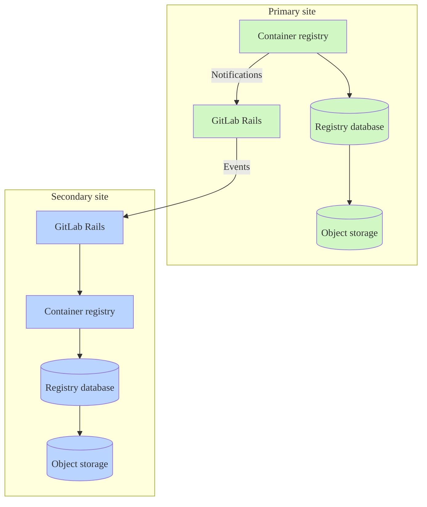



- プラン: Free、Premium、Ultimate
- 提供形態: GitLab Self-Managed





- GitLab 16.4で[導入](https://gitlab.com/gitlab-org/gitlab/-/issues/423459)されました。GitLab Self-Managedの[ベータ](../../policy/development_stages_support.md)機能です。
- GitLab 17.3で[一般公開](https://gitlab.com/gitlab-org/gitlab/-/issues/423459)になりました。



メタデータデータベースは、コンテナレジストリにいくつかの[拡張](#enhancements)を提供し、パフォーマンスを向上させ、新機能を追加します。レジストリメタデータデータベース機能のGitLab Self-Managedリリースに関する作業は、[エピック](https://gitlab.com/groups/gitlab-org/-/epics/5521)5521で追跡されます。

デフォルトでは、コンテナレジストリは、コンテナイメージに関連するメタデータを永続化するために、オブジェクトストレージまたはローカルファイルシステムを使用します。このメタデータを保存する方法では、データのアクセス効率が制限されます。特に、タグの一覧表示など、複数のイメージにまたがるデータの場合に制限されます。データベースを使用してこのデータを保存すると、多くの新機能が利用可能になります。たとえば、ダウンタイムなしで古いデータを自動的に削除する[オンラインガベージコレクション](https://gitlab.com/gitlab-org/container-registry/-/blob/master/docs/spec/gitlab/online-garbage-collection.md)などがあります。

このデータベースは、レジストリですでに使用されているストレージと連携して動作しますが、オブジェクトストレージまたはファイルシステムを置き換えるものではありません。メタデータをメタデータデータベースにインポートした後でも、ストレージソリューションを維持する必要があります。

Helm Chartsのインストールについては、Helm Chartsドキュメントの[コンテナレジストリメタデータデータベースの管理](https://docs.gitlab.com/charts/charts/registry/metadata_database.html#create-the-database)を参照してください。

## 拡張機能 {#enhancements}

メタデータデータベースアーキテクチャは、従来のメタデータストレージでは利用できないパフォーマンスの向上、バグ修正、および新機能をサポートします。これらの機能強化には、次のものがあります:

- 自動[オンラインガベージコレクション](../../user/packages/container_registry/delete_container_registry_images.md#garbage-collection)
- [リポジトリ、プロジェクト、およびグループのストレージ使用量の可視性](../../user/packages/container_registry/reduce_container_registry_storage.md#view-container-registry-usage)
- [イメージ署名](../../user/packages/container_registry/_index.md#container-image-signatures)
- [リポジトリの移動と名前変更](../../user/packages/container_registry/_index.md#move-or-rename-container-registry-repositories)
- [保護タグ](../../user/packages/container_registry/protected_container_tags.md)
- [クリーンアップポリシー](../../user/packages/container_registry/reduce_container_registry_storage.md#cleanup-policy)のパフォーマンスが向上し、大規模なリポジトリのクリーンアップが正常に実行されるようになります
- リポジトリタグの一覧表示のパフォーマンス向上
- タグ公開タイムスタンプの追跡と表示（[イシュー290949](https://gitlab.com/gitlab-org/gitlab/-/issues/290949)を参照）
- 名前以外の追加の属性によるリポジトリタグの並べ替え

従来のメタデータストレージの技術的な制約により、新機能はメタデータデータベースバージョンでのみ実装されます。セキュリティ以外のバグ修正は、メタデータデータベースバージョンに限定される場合があります。

## 既知の制限事項 {#known-limitations}

- 既存のレジストリのメタデータインポートには、読み取り専用の時間が必要です。
- Geo機能は制限されています。追加機能は[エピック](https://gitlab.com/groups/gitlab-org/-/epics/15325)15325で提案されています。
- 18.3より前では、バージョンをアップグレードするときに、レジストリの通常のスキーマとデプロイ後のデータベース移行を手動で実行する必要があります。
- マルチノードLinuxパッケージ環境では、[アップグレード中のダウンタイムゼロ](../../update/zero_downtime.md)は保証されません。
- バックアップとリストアのジョブには、レジストリデータベースは含まれません。詳細については、[メタデータデータベースを使用したバックアップ](#backup-with-metadata-database)を参照してください。

## メタデータデータベースの機能サポート {#metadata-database-feature-support}

既存のレジストリからメタデータデータベースにメタデータをインポートし、オンラインガベージコレクションを使用できます。

一部のデータベース対応機能はGitLab.comでのみ有効になっており、レジストリデータベースの自動データベースプロビジョニングは利用できません。コンテナレジストリデータベースに関連する機能のステータスについては、[フィードバックissue](https://gitlab.com/gitlab-org/gitlab/-/issues/423459#supported-feature-status)の機能サポートレポートを参照してください。

## Linuxパッケージインストールでメタデータデータベースを有効にする {#enable-the-metadata-database-for-linux-package-installations}

前提要件: 

- GitLab 17.5が最小必須バージョンですが、追加された改善と簡単な設定により、GitLab 18.3以降を推奨します。
- PostgreSQLデータベース（[バージョン要件内](../../install/requirements.md#postgresql)）。これは、レジストリノードからアクセスできる必要があります。
- 外部データベースを使用する場合は、最初に外部データベース接続をセットアップする必要があります。詳細については、[外部データベースの使用](#using-an-external-database)を参照してください。

状況に一致する手順に従ってください:

- [新規インストール](#new-installations)またはコンテナレジストリを初めて有効にします。
- 既存のコンテナイメージメタデータをメタデータデータベースにインポートします:
  - [ワンステップインポート](#one-step-import)。比較的小規模なレジストリ、またはダウンタイムを回避するための要件がない場合に推奨されます。
  - [3段階インポート](#three-step-import)。大規模なコンテナレジストリに推奨されます。

### はじめに {#before-you-start}

- データベースを有効にした後は、引き続き使用する必要があります。データベースはレジストリメタデータのソースになったため、この時点以降に無効にすると、データベースがアクティブなときに書き込まれたすべてのイメージの可視性がレジストリで失われます。
- [オフラインガベージコレクション](container_registry.md#container-registry-garbage-collection)は不要になりました。GitLabに付属しているガベージコレクションコマンドは、データベースが有効になっている場合は安全に終了しますが、アップストリームレジストリによって提供されるコマンドなどのサードパーティコマンドは、タグ付けされたイメージに関連付けられたデータを削除します。
- 特にサードパーティのコマンドを使用して、オフラインガベージコレクションを自動化していないことを確認します。
- 最初に[レジストリのストレージを削減する](../../user/packages/container_registry/reduce_container_registry_storage.md)と、プロセスを高速化できます。
- 可能であれば、[コンテナレジストリデータ](../backup_restore/backup_gitlab.md#container-registry)をバックアップします。

### 新規インストール {#new-installations}

コンテナレジストリにデータを書き込んだことのないインストールでは、インポートは必要ありません。レジストリにデータを書き込む前に、データベースを有効にする必要があります。





データベースを有効にするには:

1. `/etc/gitlab/gitlab.rb`を編集し、`enabled`を`true`に設定して、データベースを有効にします:

   ```ruby
   registry['database'] = {
     'enabled' => true,
   }
   ```

1. ファイルを保存して[GitLabを再設定](../restart_gitlab.md#reconfigure-a-linux-package-installation)します。





前提要件: 

- [外部データベース](../postgresql/external.md#container-registry-metadata-database)を作成します。

データベースを有効にするには:

1. データベース接続の詳細を追加して`/etc/gitlab/gitlab.rb`を編集しますが、最初にメタデータデータベースを無効にして開始します:

   ```ruby
   registry['database'] = {
     'enabled' => false,
     'host' => '<registry_database_host_placeholder_change_me>',
     'port' => 5432, # Default, but set to the port of your database instance if it differs.
     'user' => '<registry_database_username_placeholder_change_me>',
     'password' => '<registry_database_placeholder_change_me>',
     'dbname' => '<registry_database_name_placeholder_change_me>',
     'sslmode' => 'require', # See the PostgreSQL documentation for additional information https://www.postgresql.org/docs/16/libpq-ssl.html.
     'sslcert' => '</path/to/cert.pem>',
     'sslkey' => '</path/to/private.key>',
     'sslrootcert' => '</path/to/ca.pem>'
   }
   ```

1. ファイルを保存して[GitLabを再設定](../restart_gitlab.md#reconfigure-a-linux-package-installation)します。
1. [データベースの移行](#apply-database-migrations)。
1. `/etc/gitlab/gitlab.rb`を編集し、`enabled`を`true`に設定して、データベースを有効にします:

   ```ruby
   registry['database'] = {
     'enabled' => true,
     'host' => '<registry_database_host_placeholder_change_me>',
     'port' => 5432, # Default, but set to the port of your database instance if it differs.
     'user' => '<registry_database_username_placeholder_change_me>',
     'password' => '<registry_database_placeholder_change_me>',
     'dbname' => '<registry_database_name_placeholder_change_me>',
     'sslmode' => 'require', # See the PostgreSQL documentation for additional information https://www.postgresql.org/docs/16/libpq-ssl.html.
     'sslcert' => '</path/to/cert.pem>',
     'sslkey' => '</path/to/private.key>',
     'sslrootcert' => '</path/to/ca.pem>'
   }
   ```





### 既存のレジストリ {#existing-registries}

既存のコンテナレジストリメタデータは、ワンステップインポート方法または3段階インポート方法のいずれかを使用してインポートできます。インポートの期間に影響を与える要因がいくつかあります:

- レジストリ内のタグ付きイメージの数。
- 既存のレジストリデータのサイズ。
- PostgreSQLインスタンスの仕様。
- 実行中のレジストリインスタンスの数。
- レジストリ、PostgreSQL、および設定されたストレージ間のネットワークレイテンシー。

インポートの準備をする際に、次のことを行う必要はありません:

- 追加のオブジェクトストレージまたはファイルシステム領域を割り当てる: インポートでは、このストレージへの重要な書き込みは行われません。
- オフラインガベージコレクションを実行する: 有害ではありませんが、オフラインガベージコレクションでは、このコマンドの実行に費やした時間を回収するのに十分なほどインポートが短縮されません。



メタデータインポートは、タグ付きイメージのみを対象とします。タグなしで参照されていないマニフェスト、およびそれらによって排他的に参照されるレイヤーは、後に残され、アクセスできなくなります。タグ付けされていないイメージは、GitLabユーザーインターフェースまたはAPIを介して表示されることはありませんでしたが、「dangling」になり、バックエンドに残される可能性があります。新しいレジストリにインポートした後、すべてのイメージは継続的なオンラインガベージコレクションの対象となり、デフォルトでは、タグが付けられておらず、参照されていないマニフェストとレイヤーは24時間以上残っているものが削除されます。



#### 適切なインポート方法の選択方法 {#how-to-choose-the-right-import-method}

[オフラインガベージコレクション](container_registry.md#container-registry-garbage-collection)を定期的に実行する場合は、ワンステップインポート方法を使用します。この方法は、同様の時間がかかり、3段階インポート方法と比較してより簡単な操作です。

レジストリが大きすぎてオフラインガベージコレクションを定期的に実行できない場合は、3段階インポート方法を使用して、読み取り専用時間を大幅に最小限に抑えるます。

外部データベースを使用する場合は、移行パスに進む前に、外部データベース接続を設定していることを確認してください。

詳細については、[外部データベースの使用](#using-an-external-database)を参照してください。

#### ワンステップインポート {#one-step-import}



レジストリはシャットダウンするか、インポート中は`read-only`モードのままにする必要があります。そうしないと、インポート中に書き込まれたデータにアクセスできなくなったり、不整合が発生したりする可能性があります。







1. `/etc/gitlab/gitlab.rb`ファイルの`registry['database']`セクションで、データベースが無効になっていることを確認してください:

   ```ruby
   registry['database'] = {
     'enabled' => false, # Must be false!
   }
   ```

1. レジストリが`read-only`モードに設定されていることを確認してください。

   `/etc/gitlab/gitlab.rb`を編集し、`maintenance`セクションを`registry['storage']`設定に追加します。たとえば、`gcs`バックエンドレジストリが`gs://my-company-container-registry`バケットを使用している場合、設定は次のようになります:

   ```ruby
   ## Object Storage - Container Registry
   registry['storage'] = {
     'gcs' => {
       'bucket' => '<my-company-container-registry>',
       'chunksize' => 5242880
     },
     'maintenance' => {
       'readonly' => {
         'enabled' => true # Must be set to true.
       }
     }
   }
   ```

1. ファイルを保存して[GitLabを再設定](../restart_gitlab.md#reconfigure-a-linux-package-installation)します。
1. [データベースの移行](#apply-database-migrations)。
1. 次のコマンドを実行します:

   ```shell
   sudo -u registry gitlab-ctl registry-database import --log-to-stdout
   ```

1. コマンドが正常に完了した場合、レジストリは完全にインポートされます。データベースを有効にし、設定で読み取り専用モードをオフにして、レジストリサービスを開始できます:

   ```ruby
   registry['database'] = {
     'enabled' => true, # Must be enabled now!
   }

   ## Object Storage - Container Registry
   registry['storage'] = {
     'gcs' => {
       'bucket' => '<my-company-container-registry>',
       'chunksize' => 5242880
     },
     'maintenance' => {
       'readonly' => {
         'enabled' => false
       }
     }
   }
   ```

1. ファイルを保存して[GitLabを再設定](../restart_gitlab.md#reconfigure-a-linux-package-installation)します。





前提要件: 

- [外部データベース](../postgresql/external.md#container-registry-metadata-database)を作成します。

1. `database`セクションを`/etc/gitlab/gitlab.rb`ファイルに追加しますが、最初にメタデータデータベースを無効にして開始します:

   ```ruby
   registry['database'] = {
     'enabled' => false, # Must be false!
     'host' => '<registry_database_host_placeholder_change_me>',
     'port' => 5432, # Default, but set to the port of your database instance if it differs.
     'user' => '<registry_database_username_placeholder_change_me>',
     'password' => '<registry_database_placeholder_change_me>',
     'dbname' => '<registry_database_name_placeholder_change_me>',
     'sslmode' => 'require', # See the PostgreSQL documentation for additional information https://www.postgresql.org/docs/16/libpq-ssl.html.
     'sslcert' => '</path/to/cert.pem>',
     'sslkey' => '</path/to/private.key>',
     'sslrootcert' => '</path/to/ca.pem>'
   }
   ```

1. レジストリが`read-only`モードに設定されていることを確認してください。

   `/etc/gitlab/gitlab.rb`を編集し、`maintenance`セクションを`registry['storage']`設定に追加します。たとえば、`gcs`バックのレジストリが`gs://my-company-container-registry`バケットを使用している場合、設定は次のようになります:

   ```ruby
   ## Object Storage - Container Registry
   registry['storage'] = {
     'gcs' => {
       'bucket' => '<my-company-container-registry>',
       'chunksize' => 5242880
     },
     'maintenance' => {
       'readonly' => {
         'enabled' => true # Must be set to true.
       }
     }
   }
   ```

1. ファイルを保存して[GitLabを再設定](../restart_gitlab.md#reconfigure-a-linux-package-installation)します。
1. まだ行っていない場合は、[データベース移行を適用](#apply-database-migrations)します。
1. 次のコマンドを実行します:

   ```shell
   sudo gitlab-ctl registry-database import
   ```

1. コマンドが正常に完了した場合、レジストリは完全にインポートされました。データベースを有効にし、設定で読み取り専用モードをオフにして、レジストリサービスを開始できるようになりました:

   ```ruby
   registry['database'] = {
     'enabled' => true, # Must be enabled now!
     'host' => '<registry_database_host_placeholder_change_me>',
     'port' => 5432, # Default, but set to the port of your database instance if it differs.
     'user' => '<registry_database_username_placeholder_change_me>',
     'password' => '<registry_database_placeholder_change_me>',
     'dbname' => '<registry_database_name_placeholder_change_me>',
     'sslmode' => 'require', # See the PostgreSQL documentation for additional information https://www.postgresql.org/docs/16/libpq-ssl.html.
     'sslcert' => '</path/to/cert.pem>',
     'sslkey' => '</path/to/private.key>',
     'sslrootcert' => '</path/to/ca.pem>'
   }

   ## Object Storage - Container Registry
   registry['storage'] = {
     'gcs' => {
       'bucket' => '<my-company-container-registry>',
       'chunksize' => 5242880
     },
     'maintenance' => {
       'readonly' => {
         'enabled' => false
       }
     }
   }
   ```

1. ファイルを保存して[GitLabを再設定](../restart_gitlab.md#reconfigure-a-linux-package-installation)します。





メタデータデータベースをすべての操作に使用できるようになりました。

#### 3段階インポート {#three-step-import}

このガイドに従って、既存のコンテナレジストリメタデータをインポートします。次の手順は、大規模なレジストリ（200 GiB以上）の場合、またはインポートを完了する際のダウンタイムを最小限に抑える場合に推奨されます。

##### リポジトリの事前インポート（ステップ1） {#pre-import-repositories-step-one}

ユーザーは、ステップ1のインポートが[1時間あたり2～4 TBのレートで完了した](https://gitlab.com/gitlab-org/gitlab/-/issues/423459)とレポートしています。速度が遅い場合、100TBを超えるデータを持つレジストリでは、48時間以上かかる可能性があります。

ステップ1の完了中に、レジストリを通常どおり使用し続けることができます。





1. `/etc/gitlab/gitlab.rb`ファイルへの`database`セクションで、データベースが無効になっていることを確認します:

   ```ruby
   registry['database'] = {
     'enabled' => false, # Must be false!
   }
   ```

1. ファイルを保存して[GitLabを再設定](../restart_gitlab.md#reconfigure-a-linux-package-installation)します。
1. [データベースの移行](#apply-database-migrations)。
1. インポートを開始するには、最初の手順を実行します:

   ```shell
   sudo -u registry gitlab-ctl registry-database import --step-one --log-to-stdout
   ```





前提要件: 

- [外部データベース](../postgresql/external.md#container-registry-metadata-database)を作成します。

1. `database`セクションを`/etc/gitlab/gitlab.rb`ファイルに追加しますが、最初にメタデータデータベースを無効にして開始します:

   ```ruby
   registry['database'] = {
     'enabled' => false, # Must be false!
     'host' => '<registry_database_host_placeholder_change_me>',
     'port' => 5432, # Default, but set to the port of your database instance if it differs.
     'user' => '<registry_database_username_placeholder_change_me>',
     'password' => '<registry_database_placeholder_change_me>',
     'dbname' => '<registry_database_name_placeholder_change_me>',
     'sslmode' => 'require', # See the PostgreSQL documentation for additional information https://www.postgresql.org/docs/16/libpq-ssl.html.
     'sslcert' => '</path/to/cert.pem>',
     'sslkey' => '</path/to/private.key>',
     'sslrootcert' => '</path/to/ca.pem>'
   }
   ```

1. ファイルを保存して[GitLabを再設定](../restart_gitlab.md#reconfigure-a-linux-package-installation)します。
1. まだ行っていない場合は、[データベース移行を適用](#apply-database-migrations)します。
1. インポートを開始するには、最初の手順を実行します:

   ```shell
   sudo gitlab-ctl registry-database import --step-one
   ```







必要なダウンタイムの量を削減するために、できるだけ早く次の手順をスケジュールするようにしてください。理想的には、ステップ1が完了してから1週間以内です。ステップ1とステップ2の間にレジストリに書き込まれた新しいデータは、ステップ2に時間がかかる原因になります。



##### すべてのリポジトリデータのインポート（ステップ2） {#import-all-repository-data-step-two}

このステップでは、レジストリをシャットダウンするか、`read-only`モードに設定する必要があります。ただし、このステップはステップ1よりも約90％速く完了することが予想されます。ステップ2の実行中は、ダウンタイムに十分な時間を確保してください。





1. レジストリが`read-only`モードに設定されていることを確認してください。

   `/etc/gitlab/gitlab.rb`を編集し、`maintenance`セクションを`registry['storage']`設定に追加します。たとえば、`gcs`バックエンドレジストリが`gs://my-company-container-registry`バケットを使用している場合、設定は次のようになります:

   ```ruby
   ## Object Storage - Container Registry
   registry['storage'] = {
     'gcs' => {
       'bucket' => '<my-company-container-registry>',
       'chunksize' => 5242880
     },
     'maintenance' => {
       'readonly' => {
         'enabled' => true # Must be set to true.
       }
     }
   }
   ```

1. ファイルを保存して[GitLabを再設定](../restart_gitlab.md#reconfigure-a-linux-package-installation)します。
1. インポートのステップ2を実行します:

   ```shell
   sudo -u registry gitlab-ctl registry-database import --step-two --log-to-stdout
   ```

1. コマンドが正常に完了した場合、すべてのイメージが完全にインポートされます。データベースを有効にし、設定で読み取り専用モードをオフにして、レジストリサービスを開始できるようになりました:

   ```ruby
   registry['database'] = {
     'enabled' => true, # Must be set to true!
   }

   ## Object Storage - Container Registry
   registry['storage'] = {
     'gcs' => {
       'bucket' => '<my-company-container-registry>',
       'chunksize' => 5242880
     },
     'maintenance' => { # This section can be removed.
       'readonly' => {
         'enabled' => false
       }
     }
   }
   ```

1. ファイルを保存して[GitLabを再設定](../restart_gitlab.md#reconfigure-a-linux-package-installation)します。





1. レジストリが`read-only`モードに設定されていることを確認してください。

   `/etc/gitlab/gitlab.rb`を編集し、`maintenance`セクションを`registry['storage']`設定に追加します。たとえば、`gcs`バックのレジストリが`gs://my-company-container-registry`バケットを使用している場合、設定は次のようになります:

   ```ruby
   ## Object Storage - Container Registry
   registry['storage'] = {
     'gcs' => {
       'bucket' => '<my-company-container-registry>',
       'chunksize' => 5242880
     },
     'maintenance' => {
       'readonly' => {
         'enabled' => true # Must be set to true.
       }
     }
   }
   ```

1. ファイルを保存して[GitLabを再設定](../restart_gitlab.md#reconfigure-a-linux-package-installation)します。
1. インポートのステップ2を実行します:

   ```shell
   sudo gitlab-ctl registry-database import --step-two
   ```

1. コマンドが正常に完了した場合、すべてのイメージが完全にインポートされます。データベースを有効にし、設定で読み取り専用モードをオフにして、レジストリサービスを開始できるようになりました:

   ```ruby
   registry['database'] = {
     'enabled' => true, # Must be set to true!
     'host' => '<registry_database_host_placeholder_change_me>',
     'port' => 5432, # Default, but set to the port of your database instance if it differs.
     'user' => '<registry_database_username_placeholder_change_me>',
     'password' => '<registry_database_placeholder_change_me>',
     'dbname' => '<registry_database_name_placeholder_change_me>',
     'sslmode' => 'require', # See the PostgreSQL documentation for additional information https://www.postgresql.org/docs/16/libpq-ssl.html.
     'sslcert' => '</path/to/cert.pem>',
     'sslkey' => '</path/to/private.key>',
     'sslrootcert' => '</path/to/ca.pem>'
   }

   ## Object Storage - Container Registry
   registry['storage'] = {
     'gcs' => {
       'bucket' => '<my-company-container-registry>',
       'chunksize' => 5242880
     },
     'maintenance' => { # This section can be removed.
       'readonly' => {
         'enabled' => false
       }
     }
   }
   ```

1. ファイルを保存して[GitLabを再設定](../restart_gitlab.md#reconfigure-a-linux-package-installation)します。





メタデータデータベースをすべての操作に使用できるようになりました。

##### 残りのデータのインポート（ステップ3） {#import-remaining-data-step-three}

レジストリは現在、メタデータのデータベースを完全に使用していますが、潜在的に未使用のレイヤーblobにアクセスできず、オンラインガベージコレクターによってこれらのblobが削除されるのを防ぎます。

ステップ3の完了中に、レジストリを通常どおり使用し続けることができます。

プロセスを完了するには、移行の最後の手順を実行します:





```shell
sudo -u registry gitlab-ctl registry-database import --step-three --log-to-stdout
```





```shell
sudo gitlab-ctl registry-database import --step-three
```





そのコマンドが正常に終了すると、レジストリメタデータがデータベースに完全にインポートされます。

#### インポートの中断を復元する {#restore-interrupted-imports}



- GitLab 18.5で[導入](https://gitlab.com/gitlab-org/container-registry/-/issues/1162)。



過去72時間以内に事前にインポートしたリポジトリをスキップして、中断されたインポートを再開します。リポジトリは、次のいずれかによって事前にインポートされます:

- 3段階のインポートプロセスのステップ1を完了することによって
- ワンステップインポートプロセスを完了することによって

インポートの中断を復元するには、`--pre-import-skip-recent`フラグを設定します。デフォルトは72時間です。

例: 

```shell
# Skip repositories imported within 6 hours from the start of the import command
--pre-import-skip-recent 6h

# Disable skipping behavior
--pre-import-skip-recent 0
```

有効な期間単位の詳細については、[Go言語の期間文字列](https://pkg.go.dev/time#ParseDuration)を参照してください。

#### インポート後 {#post-import}

レジストリストレージの減少を確認するには、インポート後に約48時間かかる場合があります。これはオンラインガベージコレクションの正常な予期される部分です。この遅延により、オンラインガベージコレクションがイメージのプッシュを妨げないようにします。オンラインガベージコレクターの進行状況とヘルスを監視する方法については、[オンラインガベージコレクションのモニタリング](#online-garbage-collection-monitoring)セクションを確認してください。

## データベースの移行 {#database-migrations}

コンテナレジストリは、2種類の移行をサポートしています:

- 通常のスキーマ移行: 新しいアプリケーションコードをデプロイする前に実行する必要があるデータベース構造への変更。デプロイ前の移行とも呼ばれます。これらは、デプロイの遅延を回避するために、高速（数分以内）である必要があります。

- デプロイ後の移行: アプリケーションの実行中に実行できるデータベース構造への変更。大規模なテーブルにインデックスを作成するような、より時間のかかる操作に使用され、起動の遅延やアップグレードのダウンタイムの長期化を回避します。

デフォルトでは、レジストリは、通常のスキーマとデプロイ後の移行の両方を同時に適用します。アップグレード中のダウンタイムを削減するために、デプロイ後の移行をスキップし、アプリケーションの起動後に手動で適用できます。

### データベースの移行を適用する {#apply-database-migrations}

アプリケーションの起動前に、通常のスキーマとデプロイ後の移行の両方を適用するには、次のようにします:

1. データベースの移行を再実行します:

   ```shell
   sudo -u registry gitlab-ctl registry-database migrate up
   ```

デプロイ後の移行をスキップするには:

1. 通常のスキーマの移行のみを実行します:

   ```shell
   sudo -u registry gitlab-ctl registry-database migrate up --skip-post-deployment
   ```

   `--skip-post-deployment`フラグの代わりに、`SKIP_POST_DEPLOYMENT_MIGRATIONS`環境変数を`true`に設定することもできます:

   ```shell
   SKIP_POST_DEPLOYMENT_MIGRATIONS=true sudo -u registry gitlab-ctl registry-database migrate up
   ```

1. アプリケーションの起動後、保留中のデプロイ後の移行を適用します:

   ```shell
   sudo -u registry gitlab-ctl registry-database migrate up
   ```



`migrate up`コマンドには、移行の適用方法を制御するために使用できる追加のフラグがいくつか用意されています。詳細については、`sudo gitlab-ctl registry-database migrate up --help`を実行してください。



## オンラインガベージコレクションのモニタリング {#online-garbage-collection-monitoring}

インポート処理後のオンラインガベージコレクションの初期実行時間は、インポートされたイメージの数によって異なります。この期間中は、オンラインガベージコレクションの効率性とヘルスをモニタリングする必要があります。

### データベースパフォーマンスのモニタリング {#monitor-database-performance}

インポートが完了すると、ガベージコレクションキューが排出されるにつれて、データベースに高負荷がかかる期間が発生することが予想されます。この高負荷は、キューに入れられたタスクを処理するオンラインガベージコレクターからの個々のデータベースコールが多数発生することが原因です。

エラーまたは警告がないか、PostgreSQLとレジストリのログを定期的に確認してください。レジストリログでは、`component=registry.gc.*`でフィルタリングされたログに特に注意してください。

### メトリクスの追跡 {#track-metrics}

PrometheusやGrafanaなどのモニタリングツールを使用して、ガベージコレクションのメトリクスを視覚化および追跡し、`registry_gc_*`のプレフィックスが付いたメトリクスに焦点を当てます。これらには、削除対象としてマークされたオブジェクトの数、正常に削除されたオブジェクト、実行間隔、および期間が含まれます。Prometheusを有効にする方法については、[レジストリデバッグサーバーを有効にする](container_registry_troubleshooting.md#enable-the-registry-debug-server)を参照してください。

### キューモニタリング {#queue-monitoring}

`gc_blob_review_queue`テーブルと`gc_manifest_review_queue`テーブルの行数をカウントして、キューのサイズを確認します。初期状態では、キューが大きくなることが予想され、行数はインポートされたバイナリラージオブジェクトとマニフェストの数に比例します。キューは時間の経過とともに減少し、ガベージコレクションがジョブを正常にレビューしていることを示します。

```sql
SELECT COUNT(*) FROM gc_blob_review_queue;
SELECT COUNT(*) FROM gc_manifest_review_queue;
```

キューサイズの解釈:

- キューの縮小: ガベージコレクションがタスクを正常に処理していることを示します。
- ほぼゼロの`gc_manifest_review_queue`: 削除の可能性が指摘されたほとんどのイメージは、レビューされ、まだ使用中であるか、削除されたものとして分類されています。
- 期限切れのタスク: 次のクエリを実行して、期限切れのGCタスクを確認します:

  ```sql
  SELECT COUNT(*) FROM gc_blob_review_queue WHERE review_after < NOW();
  SELECT COUNT(*) FROM gc_manifest_review_queue WHERE review_after < NOW();
  ```

  期限切れのタスクの数が多い場合は、問題を示しています。キューのサイズが大きくても、時間の経過とともに減少し、期限切れのタスクの数がゼロに近い場合は問題ありません。期限切れのタスクの数が多い場合は、ログの緊急検査を促す必要があります。

バイナリラージオブジェクトがまだ使用中であることを示すGCログを、たとえば`msg=the blob is not dangling`のように確認します。これは、それらが削除されないことを意味します。

### バイナリラージオブジェクト間隔の調整 {#adjust-blobs-interval}

`gc_blob_review_queue`のサイズが大きく、ガベージコレクションバイナリラージオブジェクトまたはマニフェストワーカーの実行頻度を上げたい場合は、間隔設定をデフォルト（`5s`）から`1s`に更新します:

```ruby
registry['gc'] = {
  'blobs' => {
    'interval' => '1s'
  },
  'manifests' => {
    'interval' => '1s'
  }
}
```

インポート負荷がクリアされたら、データベースとレジストリのインスタンスで不要なCPU負荷が発生しないように、長期的にこれらの設定を微調整する必要があります。パフォーマンスとリソースの使用量のバランスが取れる値まで、間隔を徐々に大きくすることができます。

### データ整合性の検証 {#validate-data-consistency}

インポート後のデータ整合性を確保するには、[`crane validate`](https://github.com/google/go-containerregistry/blob/main/cmd/crane/doc/crane_validate.md)ツールを使用します。このツールは、コンテナレジストリ内のすべてのイメージレイヤーとマニフェストがアクセス可能で、正しくリンクされていることを確認します。`crane validate`を実行することにより、レジストリ内のイメージが完全でアクセス可能であることを確認し、インポートが成功したことを保証します。

### クリーンアップポリシーのレビュー {#review-cleanup-policies}

ほとんどのイメージにタグ付けされている場合、ガベージコレクションはタグ付けされていないイメージのみを削除するため、ストレージスペースを大幅に削減できません。

不要なタグ付けを削除するためのクリーンアップポリシーを実装します。これにより、最終的に、ガベージコレクションとストレージスペースの回復を通じてイメージが削除されます。

## 外部データベースの使用 {#using-an-external-database}

デフォルトでは、GitLab 18.3以降では、コンテナレジストリのメタデータ用に、メインのGitLabデータベース内に論理データベースが事前にプロビジョニングされます。ただし、[レジストリをスケールする](container_registry.md#scaling-by-component)場合は、コンテナレジストリ専用の外部データベースを使用することをお勧めします。

### ステップ {#steps}

- [外部データベース](../postgresql/external.md#container-registry-metadata-database)を作成します。

その後、デフォルトのデータベースと同じ手順に従い、独自のデータベース値を代入します。データベースを無効にした状態で開始し、指示に従ってデータベースを有効および無効にしてください:

```ruby
registry['database'] = {
  'enabled' => false,
  'host' => '<registry_database_host_placeholder_change_me>',
  'port' => 5432, # Default, but set to the port of your database instance if it differs.
  'user' => '<registry_database_username_placeholder_change_me>',
  'password' => '<registry_database_placeholder_change_me>',
  'dbname' => '<registry_database_name_placeholder_change_me>',
  'sslmode' => 'require', # See the PostgreSQL documentation for additional information https://www.postgresql.org/docs/16/libpq-ssl.html.
  'sslcert' => '</path/to/cert.pem>',
  'sslkey' => '</path/to/private.key>',
  'sslrootcert' => '</path/to/ca.pem>'
}
```



外部データベースを使用する場合は、このドキュメント全体で、コマンドから`-u registry`オプションを省略してください。



## メタデータデータベースを使用したバックアップ {#backup-with-metadata-database}



コンテナレジストリのメタデータ用に独自のデータベースを設定している場合は、バックアップを手動で管理する必要があります。`gitlab-backup`は、メタデータデータベースをバックアップしません。データベースの自動バックアップの進捗状況については、[イシュー532507](https://gitlab.com/gitlab-org/gitlab/-/issues/532507)を参照してください。



メタデータデータベースが有効になっている場合、バックアップは、これまでと同様に、レジストリで使用されるオブジェクトストレージとデータベースの両方をキャプチャする必要があります。オブジェクトストレージとデータベースのバックアップは、レジストリの状態を可能な限り相互に近くなるようにキャプチャするために調整する必要があります。レジストリを復元するには、両方のバックアップをまとめて適用する必要があります。

## レジストリのダウングレード {#downgrade-a-registry}

インポートが完了した後、レジストリを以前のバージョンにダウングレードするには、ダウングレードするために、目的のバージョンのバックアップに復元する必要があります。

## Geoを使用したデータベースアーキテクチャ {#database-architecture-with-geo}

コンテナレジストリでGitLab Geoを使用する場合は、各Geoサイトで、レジストリ用に個別のデータベースとオブジェクトストレージのスタックを設定する必要があります。コンテナレジストリへのGeoレプリケーションでは、データベースのレプリケーションではなく、レジストリ通知から生成されたイベントを使用します。

### 前提要件 {#prerequisites}

各Geoサイトでは、サイト固有の以下が必要です:

1. コンテナレジストリデータベース用のPostgreSQLインスタンス。
1. コンテナレジストリのオブジェクトストレージインスタンス。
1. これらのサイト固有のリソースを使用するように設定されたコンテナレジストリ。

この図は、データの流れと基本的なアーキテクチャを示しています:



各サイトで個別のデータベースインスタンスを使用する理由は次のとおりです:

1. メインのGitLabデータベースは、読み取り専用としてセカンダリサイトにレプリケーションされます。
1. このレプリケーションは、レジストリデータベースに対して選択的に無効にすることはできません。
1. コンテナレジストリでは、両方のサイトでデータベースへの書き込みアクセスが必要です。
1. 同種の設定により、Geoサイト間で最大限の同等性が確保されます。

## オブジェクトストレージメタデータへの復帰 {#revert-to-object-storage-metadata}

メタデータインポートの完了後、レジストリを復帰してオブジェクトストレージメタデータを使用できます。



オブジェクトストレージメタデータに復帰すると、インポート完了とこの復帰操作の間に追加または削除されたコンテナイメージ、タグ、またはリポジトリは使用できなくなります。



オブジェクトストレージメタデータに復帰するには:

1. 移行前に取得した[バックアップ](../backup_restore/backup_gitlab.md#container-registry)を復元します。
1. 次の設定を`/etc/gitlab/gitlab.rb`ファイルに追加します:

   ```ruby
   registry['database'] = {
     'enabled' => false,
   }
   ```

1. ファイルを保存して[GitLabを再設定](../restart_gitlab.md#reconfigure-a-linux-package-installation)します。

## トラブルシューティング {#troubleshooting}

### エラー: `there are pending database migrations` {#error-there-are-pending-database-migrations}

レジストリが更新され、保留中のスキーマ移行がある場合、レジストリは次のエラーメッセージで起動に失敗します:

```shell
FATA[0000] configuring application: there are pending database migrations, use the 'registry database migrate' CLI command to check and apply them
```

この問題を解決するには、[データベース移行を適用する](#apply-database-migrations)手順に従ってください。

バージョン18.3より前は、バージョンをアップグレードするたびに、データベース移行を手動で適用する必要があります。

### エラー: `offline garbage collection is no longer possible` {#error-offline-garbage-collection-is-no-longer-possible}

レジストリがメタデータデータベースを使用しているときに、[オフラインガベージコレクション](container_registry.md#container-registry-garbage-collection)を実行しようとすると、レジストリは次のエラーメッセージで失敗します:

```shell
ERRO[0000] this filesystem is managed by the metadata database, and offline garbage collection is no longer possible, if you are not using the database anymore, remove the file at the lock_path in this log message lock_path=/docker/registry/lockfiles/database-in-use
```

次のいずれかの条件を満たす必要があります:

- オフラインガベージコレクションの使用を停止します。
- メタデータデータベースをもう使用していない場合は、エラーメッセージに表示されている`lock_path`にある指示されたロックファイルを削除します。たとえば、`/docker/registry/lockfiles/database-in-use`ファイルを削除します。

### エラー: `cannot execute <STATEMENT> in a read-only transaction` {#error-cannot-execute-statement-in-a-read-only-transaction}

レジストリは、次のエラーメッセージで[データベース移行を適用する](#apply-database-migrations)ことに失敗する可能性があります:

```shell
err="ERROR: cannot execute CREATE TABLE in a read-only transaction (SQLSTATE 25006)"
```

また、[オンラインガベージコレクション](container_registry.md#performing-garbage-collection-without-downtime)を実行しようとすると、レジストリが次のエラーメッセージで失敗する可能性があります:

```shell
error="processing task: fetching next GC blob task: scanning GC blob task: ERROR: cannot execute SELECT FOR UPDATE in a read-only transaction (SQLSTATE 25006)"
```

読み取り専用トランザクションが無効になっていることを確認するには、PostgreSQLコンソールで`default_transaction_read_only`と`transaction_read_only`の値を確認する必要があります。例: 

```sql
# SHOW default_transaction_read_only;
 default_transaction_read_only
 -------------------------------
 on
(1 row)

# SHOW transaction_read_only;
 transaction_read_only
 -----------------------
 on
(1 row)
```

これらの値のいずれかが`on`に設定されている場合は、無効にする必要があります:

1. `postgresql.conf`を編集し、次の値を設定します:

   ```shell
   default_transaction_read_only=off
   ```

1. Postgresサーバーを再起動して、これらの設定を適用します。
1. 該当する場合は、[データベース移行を適用する](#apply-database-migrations)をもう一度試してください。
1. レジストリ`sudo gitlab-ctl restart registry`を再起動します。

### エラー: `cannot import all repositories while the tags table has entries` {#error-cannot-import-all-repositories-while-the-tags-table-has-entries}

[既存のレジストリメタデータをインポートする](#existing-registries)ときに次のエラーが発生した場合は、次のようにします:

```shell
ERRO[0000] cannot import all repositories while the tags table has entries, you must truncate the table manually before retrying,
see https://docs.gitlab.com/ee/administration/packages/container_registry_metadata_database.html#troubleshooting
common_blobs=true dry_run=false error="tags table is not empty"
```

このエラーは、レジストリデータベースの`tags`テーブルに既存のエントリがある場合に発生します。これは、次のいずれかの場合に発生する可能性があります:

- [ワンステップインポート](#one-step-import)を試みて、エラーが発生しました。
- [3段階インポート](#three-step-import)処理を試みて、エラーが発生しました。
- インポート処理を意図的に停止しました。
- 上記のアクションのいずれかを実行した後、インポートをもう一度実行しようとしました。
- 誤った設定ファイルに対してインポートを実行しました。

この問題を解決するには、タグテーブル内の既存のエントリを削除する必要があります。PostgreSQLインスタンスで、テーブルを手動で切り詰める必要があります:

1. `/etc/gitlab/gitlab.rb`を編集し、メタデータデータベースが無効になっていることを確認します:

   ```ruby
   registry['database'] = {
     'enabled' => false,
   }
   ```

1. PostgreSQLクライアントを使用して、レジストリデータベースに接続します。
1. `tags`テーブルを切り詰めるて、既存のエントリをすべて削除します:

   ```sql
   TRUNCATE TABLE tags RESTART IDENTITY CASCADE;
   ```

1. `tags`テーブルを切り詰めるた後、インポート処理をもう一度実行してみてください。

### エラー: `database-in-use lockfile exists` {#error-database-in-use-lockfile-exists}

[既存のレジストリメタデータをインポートする](#existing-registries)ときに次のエラーが発生した場合は、次のようにします:

```shell
|  [0s] step two: import tags failed to import metadata: importing all repositories: 1 error occurred:
    * could not restore lockfiles: database-in-use lockfile exists
```

このエラーは、レジストリを以前にインポートし、すべてのリポジトリデータ（ステップ2）のインポートを完了し、`database-in-use`がレジストリファイルシステムに存在することを意味します。この問題が発生した場合は、インポーターを再度実行しないでください。

続行する必要がある場合は、ファイルシステムから`database-in-use`ロックファイルを削除する必要があります。このファイルは、`/path/to/rootdirectory/docker/registry/lockfiles/database-in-use`にあります。

### エラー: `pre importing all repositories: AccessDenied:` {#error-pre-importing-all-repositories-accessdenied}

[既存のレジストリをインポートする](#existing-registries)ときに、`AccessDenied`エラーが表示され、ストレージバックエンドとしてAWS S3を使用している可能性があります:

```shell
/opt/gitlab/embedded/bin/registry database import --step-one /var/opt/gitlab/registry/config.yml
  [0s] step one: import manifests
  [0s] step one: import manifests failed to import metadata: pre importing all repositories: AccessDenied: Access Denied
```

コマンドを実行するユーザーに、正しい[権限スコープ](https://docker-docs.uclv.cu/registry/storage-drivers/s3/#s3-permission-scopes)があることを確認してください。

### メタデータ管理の問題が原因で、レジストリの起動に失敗しました {#registry-fails-to-start-due-to-metadata-management-issues}

レジストリは、次のエラーのいずれかで起動に失敗する可能性があります:

#### エラー: `registry filesystem metadata in use, please import data before enabling the database` {#error-registry-filesystem-metadata-in-use-please-import-data-before-enabling-the-database}

このエラーは、設定`registry['database'] = { 'enabled' => true}`でデータベースが有効になっている場合に発生しますが、メタデータデータベースに[既存のレジストリメタデータをインポートする](#existing-registries)ことはまだ完了していません。

#### エラー: `registry metadata database in use, please enable the database` {#error-registry-metadata-database-in-use-please-enable-the-database}

このエラーは、メタデータデータベースへの[既存のレジストリメタデータのインポート](#existing-registries)が完了したが、設定でデータベースを有効にしていない場合に発生します。

#### ロックファイルの確認または作成時の問題 {#problems-checking-or-creating-the-lock-files}

次のいずれかのエラーが発生した場合:

- `could not check if filesystem metadata is locked`
- `could not check if database metadata is locked`
- `failed to mark filesystem for database only usage`
- `failed to mark filesystem only usage`

レジストリは、設定された`rootdirectory`にアクセスできません。以前に動作するレジストリがあった場合は、このエラーが発生する可能性は低いです。設定ミスの問題がないか、エラーログをレビューしてください。

### タグを削除してもストレージ使用量が減少しない {#storage-usage-not-decreasing-after-deleting-tags}

デフォルトでは、オンラインガベージコレクターは、関連付けられていたすべてのタグが削除されてから48時間後に、参照されていないレイヤーの削除を開始するだけです。この遅延により、ガベージコレクターが長時間実行されている、または中断されたイメージプッシュを妨げることがなくなります。レイヤーはイメージとタグに関連付けられる前にレジストリにプッシュされるためです。

### エラー: `permission denied for schema public (SQLSTATE 42501)` {#error-permission-denied-for-schema-public-sqlstate-42501}

レジストリ移行中に、次のエラーのいずれかが発生する可能性があります:

- `ERROR: permission denied for schema public (SQLSTATE 42501)`
- `ERROR: relation "public.blobs" does not exist (SQLSTATE 42P01)`

これらのタイプのエラーは、PostgreSQL 15+ の変更によるもので、セキュリティ上の理由から、パブリックスキーマに対するデフォルトのCREATE権限が削除されています。デフォルトでは、データベースオーナーのみがPostgreSQL 15+ のパブリックスキーマにオブジェクトを作成できます。

エラーを解決するには、次のコマンドを実行して、レジストリユーザーにレジストリデータベースのオーナー権限を付与します:

```sql
ALTER DATABASE <registry_database_name> OWNER TO <registry_user>;
```

これにより、レジストリユーザーに、テーブルを作成し、移行を正常に実行するために必要な権限が付与されます。
