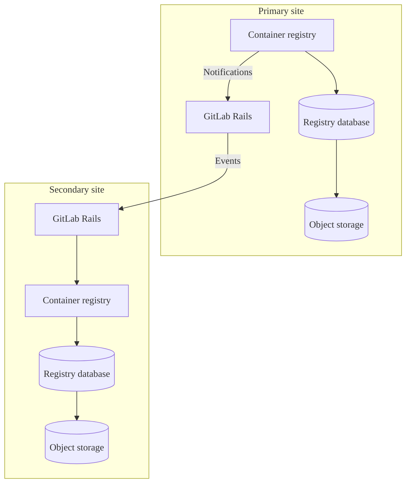



- プラン: Free、Premium、Ultimate
- 提供形態: GitLab Self-Managed





- [GitLab Self-Managedで有効](https://gitlab.com/gitlab-org/gitlab/-/issues/423459) （GitLab 16.4の[ベータ](../../policy/development_stages_support.md)機能）。
- GitLab 17.3で[一般公開](https://gitlab.com/gitlab-org/gitlab/-/issues/423459)になりました。



メタデータデータベースは、コンテナレジストリにいくつかの[機能拡張](#enhancements)を提供します。それにより、パフォーマンスが向上し、新機能が追加されます。レジストリメタデータデータベース機能のGitLab Self-Managedリリースの作業は、[エピック5521](https://gitlab.com/groups/gitlab-org/-/epics/5521)で追跡されます。

デフォルトでは、コンテナレジストリはオブジェクトストレージまたはローカルファイルシステムを使用して、コンテナイメージに関連するメタデータを保持します。このメタデータを保存する方法では、特にタグをリストするときなど、複数のイメージにまたがるデータの場合に、データへのアクセス効率が制限されます。データベースを使用してこのデータを保存することで、停止時間なしで古いデータを自動的に削除する[オンラインガベージコレクション](https://gitlab.com/gitlab-org/container-registry/-/blob/master/docs/spec/gitlab/online-garbage-collection.md)など、多くの新機能が利用可能になります。

このデータベースは、レジストリですでに使用されているストレージと連携して動作しますが、オブジェクトストレージまたはファイルシステムを置き換えるものではありません。メタデータをメタデータデータベースにインポートした後でも、ストレージソリューションの追跡を継続する必要があります。

Helm Chartのインストールについては、Helm Chartのドキュメントの[コンテナレジストリメタデータデータベースの管理](https://docs.gitlab.com/charts/charts/registry/metadata_database/#create-the-database)を参照してください。

## 機能拡張 {#enhancements}

メタデータデータベースのアーキテクチャは、従来のメタデータストレージでは利用できないパフォーマンスの改善、バグ修正、および新機能をサポートしています。これらの機能拡張には以下が含まれます:

- 自動[オンラインガベージコレクション](../../user/packages/container_registry/delete_container_registry_images.md#garbage-collection)
- リポジトリ、プロジェクト、およびグループの[ストレージ使用量の表示](../../user/packages/container_registry/reduce_container_registry_storage.md#view-container-registry-usage)
- [イメージ署名](../../user/packages/container_registry/_index.md#container-image-signatures)
- [リポジトリの移動と名前変更](../../user/packages/container_registry/_index.md#move-or-rename-container-registry-repositories)
- [保護タグ](../../user/packages/container_registry/protected_container_tags.md)
- [クリーンアップポリシー](../../user/packages/container_registry/reduce_container_registry_storage.md#cleanup-policy)のパフォーマンス改善により、大規模なリポジトリのクリーンアップを正常に実行できるようになります
- リポジトリタグのリスト表示のパフォーマンスが向上
- タグ公開タイムスタンプの追跡と表示 ([イシュー290949](https://gitlab.com/gitlab-org/gitlab/-/issues/290949)を参照)
- 名前以外の追加の属性によるリポジトリタグの並べ替え

従来のメタデータストレージの技術的な制約により、新機能はメタデータデータベースバージョンでのみ実装されます。セキュリティ以外のバグ修正は、メタデータデータベースバージョンに限定される場合があります。

## 既知の制限事項 {#known-limitations}

- 既存のレジストリへのメタデータインポートには、読み取り専用の時間が必要です。
- バージョンをアップグレードする場合、18.3より前のレジストリの通常のスキーマとデプロイ後のデータベースの移行は、手動で実行する必要があります。
- マルチノードLinuxパッケージ環境では、レジストリの[アップグレード中の停止時間ゼロ](../../update/zero_downtime.md)は保証されません。
- バックアップと復元のジョブには、レジストリデータベースは含まれません。詳細については、[メタデータデータベースを使用したバックアップ](#backup-with-metadata-database)を参照してください。
- 既存のレジストリのメタデータインポート中、イメージタグの`createdAt`と`publishedAt`のタイムスタンプ値はインポート日に設定されます。これは、整合性を確保するために意図的に行われます。従来のレジストリがすべてのイメージのタグ公開日を収集しないためです。一部のイメージのメタデータにはビルド日が含まれていますが、そうでないイメージも多くあります。詳細については、[イシュー1384](https://gitlab.com/gitlab-org/container-registry/-/issues/1384)を参照してください。

## メタデータデータベース機能のサポート {#metadata-database-feature-support}

既存のレジストリからメタデータデータベースにメタデータをインポートし、オンラインガベージコレクションを使用できます。

一部のデータベース対応機能はGitLab.comでのみ有効になり、レジストリデータベースの自動データベースプロビジョニングは利用できません。コンテナレジストリデータベースに関連する機能のステータスについては、[フィードバックイシュー](https://gitlab.com/gitlab-org/gitlab/-/issues/423459#supported-feature-status)の機能サポートテーブルを確認してください。

## Linuxパッケージインストールでのメタデータデータベースの有効化 {#enable-the-metadata-database-for-linux-package-installations}

前提条件: 

- GitLab 17.5が最小必須バージョンですが、GitLab 18.3以降をお勧めします。改善と設定が容易になっているためです。
- [バージョン要件に適合する](../../install/requirements.md#postgresql)PostgreSQLデータベース。レジストリノードからアクセス可能なものである必要があります。
- 外部データベースを使用する場合は、最初に外部データベース接続をセットアップする必要があります。詳細については、[外部データベースの使用](#using-an-external-database)を参照してください。

### はじめに {#before-you-start}

- データベースを有効にした後は、継続してそのデータベースを使用する必要があります。データベースはレジストリメタデータのソースになりました。この時点より後に無効にすると、データベースがアクティブな間、レジストリはそこに書き込まれたすべてのイメージの表示レベルを失います。
- [オフラインガベージコレクション](container_registry.md#container-registry-garbage-collection)は不要になりました。GitLabに付属しているガベージコレクションコマンドは、データベースが有効になっている場合は安全に終了します。しかし、アップストリームレジストリによって提供されるコマンドなど、サードパーティのコマンドの場合は、タグ付きイメージに関連付けられたデータを削除します。
- オフラインガベージコレクションを自動化していないことを確認してください。サードパーティのコマンドを使用している場合は、特に確認してください。
- 最初に[レジストリのストレージを削減することで](../../user/packages/container_registry/reduce_container_registry_storage.md)、プロセスを高速化できます。
- 可能であれば、[コンテナレジストリデータ](../backup_restore/backup_gitlab.md#container-registry)をバックアップします。

### 新しいインストールでのデータベースの有効化 {#enable-the-database-for-new-installations}

コンテナレジストリにデータを書き込んだことのないインストールの場合、インポートは必要ありません。データをレジストリに書き込む前に、データベースを有効にする必要があります。

詳細については、[新しいインストール](container_registry_metadata_database_new_install.md)の手順を参照してください。

### 既存のレジストリのデータベースの有効化 {#enable-the-database-for-existing-registries}

既存のコンテナレジストリメタデータを、ワンステップインポート方法または3ステップインポート方法のいずれかを使用してインポートできます。インポートの期間に影響を与える要因が、以下のとおりいくつかあります:

- レジストリ内のタグ付きイメージの数。
- 既存のレジストリデータのサイズ。
- PostgreSQLインスタンスの仕様。
- 実行中のレジストリインスタンスの数。
- レジストリ、PostgreSQL、設定されたストレージ間のネットワークレイテンシー。

インポート前に、準備として以下を行う必要はありません:

- 追加のオブジェクトストレージまたはファイルシステム領域の割り当て: ただし、インポート処理ではこのストレージに対して大きな書き込みは行われません。
- オフラインガベージコレクションの実行: この操作自体に害はありませんが、オフラインガベージコレクションはインポート処理を短縮する効果はほとんどなく、コマンドの実行に要する時間を取り戻すほどの効果はありません。

> [!note]
> メタデータインポートは、タグ付きイメージのみを対象とします。タグなしおよび参照されていないマニフェスト、およびそれらによって排他的に参照されるレイヤーは、背後に残され、アクセスできなくなります。タグ付けされていないイメージは、GitLabのUIやAPIからはもともと表示されませんが、バックエンド上では「dangling（ダングリング）」状態となり、残存してしまうことがあります。新しいレジストリへのインポート後、すべてのイメージは継続的なオンラインガベージコレクションの対象となります。デフォルトでは、タグ付けされておらず参照もされていないマニフェストやレイヤーは、24時間以上残っている場合に自動的に削除されます

#### 適切なインポート方法の選択方法 {#how-to-choose-the-right-import-method}

定期的に[オフラインガベージコレクション](container_registry.md#container-registry-garbage-collection)を実行する場合は、[ワンステップインポート](container_registry_metadata_database_one_step_import.md)方式を使用します。この方法は、処理にかかる時間がほぼ同程度であり、3ステップのインポート方法と比べて操作がより簡単です。

レジストリが大きすぎてオフラインガベージコレクションを定期的に実行できない場合は、[3ステップのインポート](container_registry_metadata_database_three_step_import.md)方式を使用すると、読み取り専用時間を大幅に短縮できます。

外部データベースを使用する場合は、移行パスに進む前に、外部データベース接続をセットアップしてください。

詳細については、[外部データベースの使用](#using-an-external-database)を参照してください。

#### インポートの中断からの復元 {#restore-interrupted-imports}



- GitLab 18.5で[導入](https://gitlab.com/gitlab-org/container-registry/-/issues/1162)されました。



過去72時間以内に事前インポートしたリポジトリをスキップして、中断したインポートを再開します。リポジトリは、次のいずれかによって事前インポートされます:

- 3ステップのインポートプロセスのステップ1を完了する
- 1ステップのインポートプロセスを完了する

中断したインポートを復元するには、`--pre-import-skip-recent`フラグを設定します。デフォルトは72時間です。

例: 

```shell
# Skip repositories imported within 6 hours from the start of the import command
--pre-import-skip-recent 6h

# Disable skipping behavior
--pre-import-skip-recent 0
```

有効な期間単位の詳細については、[Go言語のduration文字列](https://pkg.go.dev/time#ParseDuration)を参照してください。

#### インポート後 {#post-import}

レジストリストレージの減少を確認するには、インポート後約48時間かかる場合があります。これはオンラインガベージコレクションの正常かつ想定された動作です。この遅延は、オンラインガベージコレクションがイメージのプッシュ処理に干渉しないようにするためのものです。オンラインガベージコレクターの進捗とヘルスをモニタリングする方法については、[オンラインガベージコレクションのモニタリング](#online-garbage-collection-monitoring)セクションを確認してください。

## データベースの移行 {#database-migrations}

コンテナレジストリは、2種類の移行をサポートしています:

- 通常のスキーマ移行: 新しいアプリケーションコードをデプロイする前に実行する必要があるデータベース構造の変更、いわゆるプレデプロイ後の移行です。これらの処理はデプロイの遅延を防ぐため、数分以内で完了することが望まれます。

- デプロイ後の移行: アプリケーションの稼働中に実行できるデータベース構造の変更です。大規模なテーブルへのインデックス作成など、時間のかかる処理に使用され、起動時の遅延やアップグレード時の長時間停止を回避できます。

デフォルトでは、レジストリは通常のスキーマ移行とポストデプロイ後の移行の両方を同時に適用します。アップグレード時のダウンタイムを短縮するには、ポストデプロイ後の移行をスキップし、アプリケーションの起動後に手動で実行することができます。

### データベース移行の適用 {#apply-database-migrations}

アプリケーションの起動前に、通常のスキーマとデプロイ後の移行の両方を適用するには、以下を実行します:

1. データベース移行を実行します:

   ```shell
   sudo -u registry gitlab-ctl registry-database migrate up
   ```

デプロイ後の移行をスキップするには、以下を実行します:

1. 通常のスキーマ移行のみを実行します:

   ```shell
   sudo -u registry gitlab-ctl registry-database migrate up --skip-post-deployment
   ```

   `--skip-post-deployment`フラグの代わりに、`SKIP_POST_DEPLOYMENT_MIGRATIONS`環境変数を`true`に設定することもできます:

   ```shell
   SKIP_POST_DEPLOYMENT_MIGRATIONS=true sudo -u registry gitlab-ctl registry-database migrate up
   ```

1. アプリケーションの起動後、保留中のデプロイ後の移行を適用します:

   ```shell
   sudo -u registry gitlab-ctl registry-database migrate up
   ```

> [!note] `migrate up`コマンドには、移行の適用方法を制御するために使用できる追加のフラグがいくつか用意されています。詳細については、`sudo gitlab-ctl registry-database migrate up --help`を実行してください。

## オンラインガベージコレクションのモニタリング {#online-garbage-collection-monitoring}

インポート処理後に実行される最初のオンラインガベージコレクションは、インポートされたイメージの数に応じて所要時間が異なります。この期間中は、オンラインガベージコレクションの効率性と健全性を監視することを推奨します。

### データベースパフォーマンスのモニタリング {#monitor-database-performance}

インポートが完了すると、ガベージコレクションのキューが処理される間、データベースに高負荷がかかる期間が発生します。この高負荷は、オンラインガベージコレクターがキューに登録されたタスクを処理する際に、多数の個別データベース呼び出しを行うことによって生じます。

PostgreSQLとレジストリのログにエラーまたは警告がないか定期的に確認してください。レジストリログでは、`component=registry.gc.*`でフィルタリングされたログに特に注意してください。

### メトリクスの追跡 {#track-metrics}

PrometheusやGrafanaなどのモニタリングツールを使用してガベージコレクションメトリクスを視覚化および追跡し、`registry_gc_*`のプレフィックスが付いたメトリクスに焦点を当てます。これらには、削除対象としてマークされたオブジェクトの数、正常に削除されたオブジェクト、実行間隔、および期間が含まれます。Prometheusを有効にする方法については、[レジストリデバッグサーバーを有効にする](container_registry_troubleshooting.md#enable-the-registry-debug-server)を参照してください。

### タスクキューのモニタリング {#monitor-task-queues}

Blobおよびマニフェストのガベージコレクションタスクキューのヘルスとステータスをモニタリングします。

#### オンラインガベージコレクションのヘルスをチェックします {#check-the-health-of-online-garbage-collection}

次のクエリは、10回以上再試行されたタスク、または24時間以上レビュー待ちの状態にあるタスクを返します。通常、オンラインガベージコレクターは、失敗がごくわずかな場合には、24時間以内にレビュー対象のアイテムを処理します。もしクエリの結果に行が返された場合は、オンラインガベージコレクターのヘルスを調査してください。

マニフェストの場合:

```sql
SELECT
  repository_id,
  manifest_id,
  ROUND(
    EXTRACT(
      EPOCH
      FROM
        AGE(NOW(), review_after)
    ) / 3600
  ) AS hours_eligible_for_review,
  review_count as failed_review_attempts,
  event
FROM
  gc_manifest_review_queue
WHERE
  review_after < NOW() - INTERVAL '24 hours'
  OR review_count > 10
LIMIT
  20;
```

Blobの場合:

```sql
SELECT
  substring(encode(digest, 'hex'), 3) AS digest,
  ROUND(
    EXTRACT(
      EPOCH
      FROM
        AGE(NOW(), review_after)
    ) / 3600
  ) AS hours_eligible_for_review,
  review_count as failed_review_attempts,
  event
FROM
  gc_blob_review_queue
WHERE
  review_after < NOW() - INTERVAL '24 hours'
  OR review_count > 10
LIMIT
  20;
```

これらのクエリが行を返す場合は、ガベージコレクションに関連するメッセージがないかレジストリログを確認してください。`component="registry.gc.*`でエントリをフィルタリングし、エラーメッセージを調査します。

`gc_manifest_review_queue`と`gc_blob_review_queue`の未フィルタ状態でのサイズは、オンラインガベージコレクターのヘルスを示す適切な指標ではありません。これらのキューは、アクティブなレジストリでは完全に空になることはありません。

レビュー対象となっているタスクが大量に存在していても、必ずしも問題があるとは限りません。ガベージコレクターが、一時的なアクティビティの増加によって発生したアイテムを処理している最中である可能性があります。

同様に、これらのタスクの`created_at`の日付だけでは、ヘルス指標として適切ではありません。イベントが同じblobまたはマニフェストをキューに追加すると、既存のタスクの`review_after`が更新され、レビューが延期されます。重複タスクは作成されません。

これは何度でも発生する可能性があるため、数か月前に作成されたタスクがあっても心配する必要はありません。

#### オンラインガベージコレクションに関連する情報クエリ {#informational-queries-related-to-online-garbage-collection}

次のクエリを実行して、レビューの対象となるタスクの数を確認します:

  ```sql
  SELECT COUNT(*) FROM gc_blob_review_queue WHERE review_after < NOW();
  SELECT COUNT(*) FROM gc_manifest_review_queue WHERE review_after < NOW();
  ```

通常、これらのクエリは比較的少ない件数（多くの場合はほぼゼロ）を返します。ただし、次のような場合には、クエリからより大きな値が返されることがあります:

- インポートが24〜48時間前に開始された
- 大量のタグが削除されたか、コンテナリポジトリが削除された
- オンラインガベージコレクションが長期間無効になっていた

### ガベージコレクターワーカー間隔の調整 {#adjust-the-garbage-collector-worker-interval}

レビューの対象となるタスクの数が依然として多く、ガベージコレクションblobまたはマニフェストワーカーの実行頻度を上げたい場合は、間隔設定をデフォルト（`5s`）から`1s`に更新します:

```ruby
registry['gc'] = {
  'blobs' => {
    'interval' => '1s'
  },
  'manifests' => {
    'interval' => '1s'
  }
}
```

インポートの負荷がクリアされたら、データベースとレジストリインスタンスで不要なCPU負荷を回避するために、長期的にこれらの設定を微調整する必要があります。パフォーマンスとリソースの使用量のバランスを取る値まで、徐々に間隔を大きくすることができます。

### データ整合性の検証 {#validate-data-consistency}

インポート後にデータの整合性を確保するには、[`crane validate`](https://github.com/google/go-containerregistry/blob/main/cmd/crane/doc/crane_validate.md)ツールを使用します。このツールは、コンテナレジストリ内のすべてのイメージレイヤーとマニフェストにアクセスでき、正しくリンクされていることを確認します。`crane validate`を実行して、レジストリ内のイメージが完全でアクセス可能であること、インポートが成功したことを確認します。

### クリーンアップポリシーのレビュー {#review-cleanup-policies}

イメージのほとんどにタグが付けられている場合、ガベージコレクションはタグ付けされていないイメージのみを削除するため、ストレージスペースは大幅に削減されません。

クリーンアップポリシーを実装して不要なタグを削除すると、最終的にガベージコレクションとストレージ容量の回復により、イメージが削除されます。

## 外部データベースの使用 {#using-an-external-database}

デフォルトでは、GitLab 18.3以降では、コンテナレジストリメタデータ用のメインGitLabデータベース内に論理データベースが事前プロビジョニングされます。ただし、レジストリを[スケール](container_registry.md#scaling-by-component)する場合は、コンテナレジストリ専用の外部データベースを使用することをお勧めします。

### ステップ {#steps}

- [外部データベース](../postgresql/external.md#container-registry-metadata-database)を作成します。

その後、デフォルトデータベースと同じ手順に従って、独自のデータベース値を代入します。データベースが無効になっている状態で開始し、指示に従ってデータベースを有効および無効にするように注意してください:

```ruby
registry['database'] = {
  'enabled' => false,
  'host' => '<registry_database_host_placeholder_change_me>',
  'port' => 5432, # Default, but set to the port of your database instance if it differs.
  'user' => '<registry_database_username_placeholder_change_me>',
  'password' => '<registry_database_placeholder_change_me>',
  'dbname' => '<registry_database_name_placeholder_change_me>',
  'sslmode' => 'require', # See the PostgreSQL documentation for additional information https://www.postgresql.org/docs/16/libpq-ssl.html.
  'sslcert' => '</path/to/cert.pem>',
  'sslkey' => '</path/to/private.key>',
  'sslrootcert' => '</path/to/ca.pem>'
}
```

> [!note]外部データベースを使用する場合は、このドキュメント全体でコマンドから`-u registry`オプションを省略してください。

## メタデータベースを使用したバックアップ {#backup-with-metadata-database}

> [!note]コンテナレジストリメタデータ用に独自のデータベースを構成している場合は、バックアップを手動で管理する必要があります。`gitlab-backup`は、メタデータデータベースをバックアップしません。自動データベースバックアップの進捗状況については、[イシュー532507](https://gitlab.com/gitlab-org/gitlab/-/issues/532507)を参照してください。

メタデータデータベースが有効になっている場合、バックアップは、以前と同様に、レジストリで使用されるオブジェクトストレージとデータベースの両方をキャプチャする必要があります。オブジェクトストレージとデータベースのバックアップは、レジストリの状態を可能な限り相互に近くキャプチャするように調整する必要があります。レジストリを復元するには、両方のバックアップをまとめて適用する必要があります。

## レジストリのダウングレード {#downgrade-a-registry}

インポートが完了した後、レジストリを以前のバージョンにダウングレードするには、目的のバージョンのバックアップに復元してダウングレードする必要があります。

## Geoを使用したデータベースアーキテクチャ {#database-architecture-with-geo}

コンテナレジストリでGitLab Geoを使用する場合は、サイトごとにレジストリ用に個別のデータベースとオブジェクトストレージスタックを構成する必要があります。コンテナレジストリへのGeoレプリケーションは、データベースレプリケーションではなく、レジストリ通知から生成されたイベントを使用します。

### 前提条件 {#prerequisites}

各Geoサイトには、サイトごとに固有の以下のリソースが必要です:

1. コンテナレジストリデータベース用のPostgreSQLインスタンス。
1. コンテナレジストリ用のオブジェクトストレージインスタンス。
1. 上記のサイト固有リソースを使用するように構成されたコンテナレジストリ。

この図は、データフローと基本的なアーキテクチャを示しています:



各サイトで個別のデータベースインスタンスを使用してください。理由は次のとおりです:

1. メインのGitLabデータベースは、読み取り専用としてセカンダリサイトにレプリケートされます。
1. このレプリケーションは、レジストリデータベースに対して選択的に無効にすることはできません。
1. コンテナレジストリは、両方のサイトでデータベースへの書き込み権限を必要とします。
1. 同一構成を採用することで、Geoサイト間の同等性を最大限に保つことができます。

## オブジェクトストレージメタデータへのリバート {#revert-to-object-storage-metadata}

メタデータインポートが完了した後、レジストリをオブジェクトストレージメタデータを使用するようにリバートできます。

> [!warning]
> オブジェクトストレージメタデータにリバートすると、インポートの完了とこのリバート操作の間に追加または削除されたコンテナイメージ、タグ、またはリポジトリは使用できなくなります。

オブジェクトストレージメタデータにリバートするには、以下を実行します:

1. 移行前に作成された[バックアップ](../backup_restore/backup_gitlab.md#container-registry)を復元します。
1. 次の設定を`/etc/gitlab/gitlab.rb`ファイルに追加します:

   ```ruby
   registry['database'] = {
     'enabled' => false,
   }
   ```

1. ファイルを保存して[GitLabを再設定](../restart_gitlab.md#reconfigure-a-linux-package-installation)します。

## トラブルシューティング {#troubleshooting}

エラーとトラブルシューティングの解決策と回避策を確認するには、[コンテナレジストリメタデータデータベースのトラブルシューティング](container_registry_metadata_database_troubleshooting.md)を参照してください。
