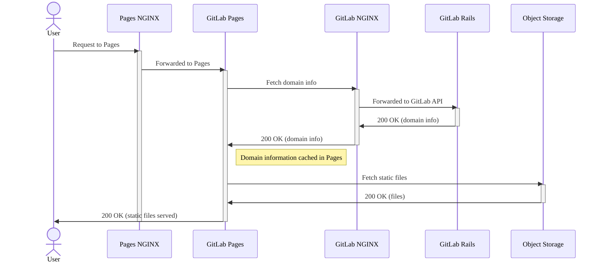
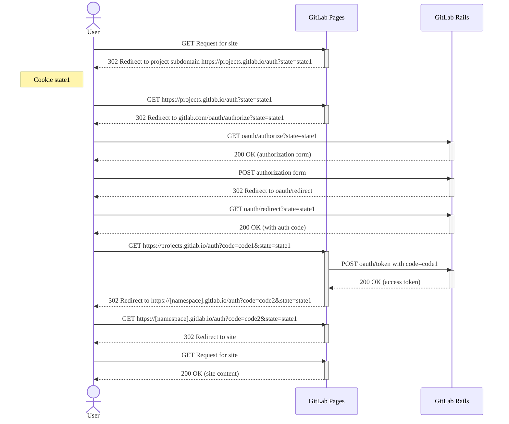



- プラン: Free、Premium、Ultimate
- 提供形態: GitLab Self-Managed



このページでは、GitLab Pagesを管理する際に発生する可能性のあるイシューの一覧を示します。

## GitLab Pagesログの確認方法 {#how-to-see-gitlab-pages-logs}

ページデーモンのログは、次のコマンドを実行することで確認できます:

```shell
sudo gitlab-ctl tail gitlab-pages
```

ログファイルは`/var/log/gitlab/gitlab-pages/current`にもあります。

詳細については、[ログから相関IDを取得する](../logs/tracing_correlation_id.md#getting-the-correlation-id-from-your-logs)を参照してください。

## GitLab Pagesをデバッグする {#debug-gitlab-pages}

次のシーケンスチャートは、GitLab Pagesリクエストがどのように処理されるかを示しています。GitLab Pagesサイトのデプロイ方法と、オブジェクトストレージから静的コンテンツを配信する方法について詳しくは、GitLab Pagesアーキテクチャのドキュメントをご覧ください。



### エラーログの特定 {#identify-error-logs}

前のシーケンスチャートに示されている順序でログを確認する必要があります。ドメインに基づいてフィルタリングすると、関連するログを特定するのにも役立ちます。

ログの追跡を開始するには、以下を実行します:

1. **GitLab Pages NGINX**ログの場合は、以下を実行します:

   ```shell
   # View GitLab Pages NGINX error logs
   sudo gitlab-ctl tail nginx/gitlab_pages_error.log

   # View GitLab Pages NGINX access logs
   sudo gitlab-ctl tail nginx/gitlab_pages_access.log
   ```

1. **GitLab Pages**ログの場合は、以下を実行します: [ログから相関IDを特定する](../logs/tracing_correlation_id.md#getting-the-correlation-id-from-your-logs)ことから始めます。

   ```shell
   sudo gitlab-ctl tail gitlab-pages
   ```

1. **GitLab NGINX**ログの場合は、以下を実行します:

   ```shell
   # View GitLab NGINX error logs
   sudo gitlab-ctl tail nginx/gitlab_error.log

   # View GitLab NGINX access logs
   sudo gitlab-ctl tail nginx/gitlab_access.log
   ```

1. **GitLab Rails**ログの場合は、以下を実行します: これらのログは、`correlation_id` [GitLab Pagesログで特定](../logs/tracing_correlation_id.md#getting-the-correlation-id-from-your-logs)に基づいてフィルターできます。

   ```shell
   sudo gitlab-ctl tail gitlab-rails
   ```

## 認証コードフロー {#authorization-code-flow}

次のシーケンスチャートは、保護されたページサイトにアクセスするための、ユーザー、GitLab Pages、GitLab Rails間のOAuth認証フローを示しています。

詳細については、[GitLab OAuth認可コードフロー](../../api/oauth2.md#authorization-code-flow)を参照してください。



## エラー: `unsupported protocol scheme \"\""` {#error-unsupported-protocol-scheme-}

次のエラーが表示された場合:

```plaintext
{"error":"failed to connect to internal Pages API: Get \"/api/v4/internal/pages/status\": unsupported protocol scheme \"\"","level":"warning","msg":"attempted to connect to the API","time":"2021-06-23T20:03:30Z"}
```

これは、ページサーバーの設定でHTTP(S)プロトコルスキームを設定していないことを意味します。解決策:

1. `/etc/gitlab/gitlab.rb`を編集します: 

   ```ruby
   gitlab_pages['gitlab_server'] = "https://<your_gitlab_server_public_host_and_port>"
   gitlab_pages['internal_gitlab_server'] = "https://<your_gitlab_server_private_host_and_port>" # optional, gitlab_pages['gitlab_server'] is used as default
   ```

1. GitLabを再設定します:

   ```shell
   sudo gitlab-ctl reconfigure
   ```

## サーバーがIPv6経由でリッスンしない場合にGitLab Pagesプロキシへの接続時に発生する502エラー {#502-error-when-connecting-to-gitlab-pages-proxy-when-server-does-not-listen-over-ipv6}

サーバーがIPv6経由でリッスンしない場合でも、NGINXがデフォルトでIPv6を使用してGitLab Pagesサービスに接続する場合があります。これが発生しているかどうかは、`gitlab_pages_error.log`に以下のログエントリと同様のものが表示されているかどうかで確認できます:

```plaintext
2020/02/24 16:32:05 [error] 112654#0: *4982804 connect() failed (111: Connection refused) while connecting to upstream, client: 123.123.123.123, server: ~^(?<group>.*)\.pages\.example\.com$, request: "GET /-/group/project/-/jobs/1234/artifacts/artifact.txt HTTP/1.1", upstream: "http://[::1]:8090//-/group/project/-/jobs/1234/artifacts/artifact.txt", host: "group.example.com"
```

これを解決するには、GitLab Pagesの`listen_proxy`設定に明示的なIPとポートを設定して、GitLab Pagesデーモンがリッスンする明示的なアドレスを定義します:

```ruby
gitlab_pages['listen_proxy'] = '127.0.0.1:8090'
```

## 断続的な502エラーまたは数日後 {#intermittent-502-errors-or-after-a-few-days}

`systemd`と[`tmpfiles.d`](https://www.freedesktop.org/software/systemd/man/tmpfiles.d.html)を使用するシステムでページを実行している場合、次のようなエラーが発生してページの配信を試みると、断続的な502エラーが発生する可能性があります:

```plaintext
dial tcp: lookup gitlab.example.com on [::1]:53: dial udp [::1]:53: connect: no route to host"
```

GitLab Pagesは、`/tmp/gitlab-pages-*`内に[バインドマウント](https://man7.org/linux/man-pages/man8/mount.8.html)を作成し、`/etc/hosts`のようなファイルを含めます。ただし、`systemd`は`/tmp/`ディレクトリを定期的にクリーンするため、DNS設定が失われる可能性があります。

`systemd`がページ関連のコンテンツをクリーンしないようにするには:

1. `tmpfiles.d`に、ページの`/tmp`ディレクトリを削除しないように指示します:

   ```shell
   echo 'x /tmp/gitlab-pages-*' >> /etc/tmpfiles.d/gitlab-pages-jail.conf
   ```

1. GitLab Pagesを再起動します:

   ```shell
   sudo gitlab-ctl restart gitlab-pages
   ```

## GitLab Pagesにアクセスできません {#unable-to-access-gitlab-pages}

GitLab Pagesにアクセスできない場合(`502 Bad Gateway`エラーを受信する、またはログインループが発生するなど)で、ページログに次のエラーが表示される場合:

```plaintext
"error":"retrieval context done: context deadline exceeded","host":"root.docs-cit.otenet.gr","level":"error","msg":"could not fetch domain information from a source"
```

1. 次の内容を`/etc/gitlab/gitlab.rb`に追加します:

   ```ruby
   gitlab_pages['internal_gitlab_server'] = 'http://localhost:8080'
   ```

1. GitLab Pagesを再起動します:

   ```shell
   sudo gitlab-ctl restart gitlab-pages
   ```

## 内部GitLab APIへの接続に失敗しました {#failed-to-connect-to-the-internal-gitlab-api}

次のエラーが表示された場合:

```plaintext
ERRO[0010] Failed to connect to the internal GitLab API after 0.50s  error="failed to connect to internal Pages API: HTTP status: 401"
```

[GitLab Pagesを別のサーバーで実行](_index.md#running-gitlab-pages-on-a-separate-server)している場合は、`/etc/gitlab/gitlab-secrets.json`ファイルを**GitLab server**（GitLabサーバー）から**Pages server**（ページサーバー）にコピーする必要があります。

その他の理由としては、ファイアウォール設定や閉じられたポートなど、**GitLab server**（GitLabサーバー）と**Pages server**（ページサーバー）間のネットワーク接続のイシューが考えられます。たとえば、接続タイムアウトが発生した場合:

```plaintext
error="failed to connect to internal Pages API: Get \"https://gitlab.example.com:3000/api/v4/internal/pages/status\": net/http: request canceled while waiting for connection (Client.Timeout exceeded while awaiting headers)"
```

## ページがGitLab APIのインスタンスと通信できません {#pages-cannot-communicate-with-an-instance-of-the-gitlab-api}

`domain_config_source=auto`のデフォルト値を使用し、GitLab Pagesの複数のインスタンスを実行している場合は、ページコンテンツの配信中に断続的な502エラー応答が表示されることがあります。また、ページログに次の警告が表示されることがあります:

```plaintext
WARN[0010] Pages cannot communicate with an instance of the GitLab API. Please sync your gitlab-secrets.json file https://gitlab.com/gitlab-org/gitlab-pages/-/issues/535#workaround. error="pages endpoint unauthorized"
```

これは、GitLab RailsとGitLab Pagesの間で`gitlab-secrets.json`ファイルが古くなっている場合に発生する可能性があります。すべてのGitLab Pagesインスタンスで、[GitLab Pagesを別のサーバーで実行](_index.md#running-gitlab-pages-on-a-separate-server)の手順8〜10に従います。

## AWSネットワークロードバランサーとGitLab Pagesを使用している場合の断続的な502エラー {#intermittent-502-errors-when-using-an-aws-network-load-balancer-and-gitlab-pages}

クライアントIP保持が有効になっているネットワークロードバランサーを使用し、[リクエストがソースサーバーにループバックされる](https://docs.aws.amazon.com/elasticloadbalancing/latest/network/load-balancer-troubleshooting.html#loopback-timeout)場合、接続タイムアウトが発生します。これは、コアGitLabアプリケーションとGitLab Pagesの両方を実行している複数のサーバーを持つGitLabインスタンスで発生する可能性があります。これは、単一のコンテナがコアGitLabアプリケーションとGitLab Pagesの両方を実行している場合にも発生する可能性があります。

AWSは、このイシューを解決するために[IPターゲットタイプを使用することを推奨しています](https://repost.aws/knowledge-center/target-connection-fails-load-balancer)。

コアGitLabアプリケーションとGitLab Pagesが同じホストまたはコンテナ上で実行されている場合、[クライアントIP保持](https://docs.aws.amazon.com/elasticloadbalancing/latest/network/load-balancer-target-groups.html#client-ip-preservation)をオフにすると、このイシューが解決される可能性があります。

## `securecookie: failed to generate random iv`と`Failed to save the session`を含む500エラー {#500-error-with-securecookie-failed-to-generate-random-iv-and-failed-to-save-the-session}

この問題は、オペレーティングシステムが古くなっていることが原因である可能性が最も高いです。[ページデーモンは`securecookie`ライブラリを使用](https://gitlab.com/search?group_id=9970&project_id=734943&repository_ref=master&scope=blobs&search=securecookie&snippets=false)して、[Goの`crypto/rand`経由でランダムな文字列を取得します](https://pkg.go.dev/crypto/rand#pkg-variables)。これには、ホストOSで`getrandom`システム呼び出しまたは`/dev/urandom`が利用可能である必要があります。[公式にサポートされているオペレーティングシステム](../../install/package/_index.md#supported-platforms)にアップグレードすることをお勧めします。

## リクエストされたスコープが無効、不正な形式、または不明です {#the-requested-scope-is-invalid-malformed-or-unknown}

この問題は、GitLab Pages OAuthアプリケーションの権限に起因します。解決策:

1. 左側のサイドバーの下部で、**管理者**を選択します。
1. **アプリケーション > GitLab Pages**を選択します。
1. アプリケーションを編集します。
1. **スコープ**で、`api`スコープが選択されていることを確認します。
1. 変更を保存します。

[別のページサーバー](_index.md#running-gitlab-pages-on-a-separate-server)を実行している場合、この設定はメインのGitLabサーバーで構成する必要があります。

## ワイルドカードDNSエントリを設定できない場合の回避策 {#workaround-in-case-no-wildcard-dns-entry-can-be-set}

ワイルドカードDNSの[前提条件](_index.md#prerequisites)を満たせない場合でも、制限された方法でGitLab Pagesを使用できます:

1. Pagesで使用する必要があるすべてのプロジェクトを、たとえば`pages`のように、単一のグループネームスペースに[移動](../../user/project/working_with_projects.md#transfer-a-project)します。
1. `*.`-ワイルドカードなしで[DNSエントリ](_index.md#dns-configuration)を構成します(例: `pages.example.io`)。
1. `pages_external_url http://example.io/`ファイルを`gitlab.rb`で構成します。グループネームスペースはGitLabによって自動的に先頭に追加されるため、ここでは省略します。

## パーミッションが拒否されたエラーでページデーモンが失敗する {#pages-daemon-fails-with-permission-denied-errors}

`/tmp`が`noexec`でマウントされている場合、ページデーモンは次のようなエラーで起動に失敗します:

```plaintext
{"error":"fork/exec /gitlab-pages: permission denied","level":"fatal","msg":"could not create pages daemon","time":"2021-02-02T21:54:34Z"}
```

この場合、`TMPDIR`を`noexec`でマウントされていない場所に変更します。次の内容を`/etc/gitlab/gitlab.rb`に追加します:

```ruby
gitlab_pages['env'] = {'TMPDIR' => '<new_tmp_path>'}
```

追加したら、`sudo gitlab-ctl reconfigure`で再構成し、`sudo gitlab-ctl restart`でGitLabを再起動します。

## ページアクセス制御の使用時に`The redirect URI included is not valid.` {#the-redirect-uri-included-is-not-valid-when-using-pages-access-control}

`pages_external_url`が途中で更新された場合、このエラーが表示されることがあります。以下を確認します:

1. [システムOAuthアプリケーション](../../integration/oauth_provider.md#create-an-instance-wide-application)を確認します:

   1. 左側のサイドバーの下部で、**管理者**を選択します。
   1. **アプリケーション**、**新しいアプリケーションを追加**の順に選択します。
   1. **Callback URL/Redirect URI**（コールバックURL/リダイレクトURI）が、`pages_external_url`を使用するように構成されているプロトコル(HTTPまたはHTTPS)を使用していることを確認します。
1. `Redirect URI`のドメインおよびパスコンポーネントが有効です。それらは`projects.<pages_external_url>/auth`のように見えるはずです。

## 500エラー`cannot serve from disk` {#500-error-cannot-serve-from-disk}

ページから500応答を受信し、次のようなエラーが発生した場合:

```plaintext
ERRO[0145] cannot serve from disk                        error="gitlab: disk access is disabled via enable-disk=false" project_id=27 source_path="file:///shared/pages/@hashed/67/06/670671cd97404156226e507973f2ab8330d3022ca96e0c93bdbdb320c41adcaf/pages_deployments/14/artifacts.zip" source_type=zip
```

これは、GitLab RailsがGitLab Pagesにディスク上の場所からコンテンツを配信するように指示しているにもかかわらず、GitLab Pagesがディスクアクセスを無効にするように構成されていることを意味します。

ディスクアクセスを有効にするには:

1. `/etc/gitlab/gitlab.rb`でGitLab Pagesのディスクアクセスを有効にします:

   ```ruby
   gitlab_pages['enable_disk'] = true
   ```

1. [GitLabを再設定します](../restart_gitlab.md#reconfigure-a-linux-package-installation)。

## `httprange: new resource 403` {#httprange-new-resource-403}

次のようなエラーが表示された場合:

```plaintext
{"error":"httprange: new resource 403: \"403 Forbidden\"","host":"root.pages.example.com","level":"error","msg":"vfs.Root","path":"/pages1/","time":"2021-06-10T08:45:19Z"}
```

また、NFS経由でファイルを同期する別のサーバーでページを実行している場合は、メインGitLabサーバーとGitLab Pagesサーバーで、共有ページディレクトリが異なるパスにマウントされていることを意味する可能性があります。

その場合は、[オブジェクトストレージを構成し、既存のページデータをそれに移行する](_index.md#object-storage-settings)ことを強くお勧めします。

または、両方のサーバーでGitLab Pages共有ディレクトリを同じパスにマウントすることもできます。

## エラー`is not a recognized provider`でGitLab Pagesデプロイジョブが失敗する {#gitlab-pages-deploy-job-fails-with-error-is-not-a-recognized-provider}

**ページ**ジョブは成功したが、**デプロイ**ジョブがエラー"認識されたプロバイダーではありません"を出す場合:


エラーメッセージ`is not a recognized provider`は、GitLabがオブジェクトストレージのクラウドプロバイダーに接続するために使用する`fog` gemから発生している可能性があります。

それを修正するには、次の手順に従ってください:

1. `gitlab.rb`ファイルを確認してください。`gitlab_rails['pages_object_store_enabled']`が有効になっているが、バケットの詳細が構成されていない場合は、次のいずれかを行います:

   - [S3互換接続設定](_index.md#s3-compatible-connection-settings)ガイドに従って、Pagesデプロイのオブジェクトストレージを構成します。
   - その行をコメントアウトして、デプロイをローカルに保存します。

1. `gitlab.rb`ファイルに加えた変更を保存し、[GitLabを再構成](../restart_gitlab.md#reconfigure-a-linux-package-installation)します。

## 404エラー`The page you're looking for could not be found` {#404-error-the-page-youre-looking-for-could-not-be-found}

GitLab Pagesから`404 Page Not Found`応答を受け取った場合:

1. `.gitlab-ci.yml`にジョブ`pages:`が含まれているか確認してください。
1. 現在のプロジェクトのパイプラインをチェックして、ジョブ`pages:deploy`が実行されていることを確認します。

`pages:deploy`ジョブがないと、GitLab Pagesサイトへの更新は公開されません。

`namespace_in_path`が有効になっている別のページサーバーを使用している場合は、[UIに誤ったURLが表示される場合の404エラー](#404-error-page-not-found-when-pages-ui-shows-incorrect-url)を参照してください。

## 404エラー: ページのUIに誤ったURLが表示される場合、ページが見つかりません {#404-error-page-not-found-when-pages-ui-shows-incorrect-url}

[別のGitLab Pagesサーバー](_index.md#running-gitlab-pages-on-a-separate-server)で`namespace_in_path`を構成して有効にした場合、`404 Page not found`エラーが発生する可能性があります。

このエラーは、GitLab PagesサーバーまたはメインGitLabサーバーで`namespace_in_path`設定が誤って構成されているか、見つからない場合に発生します。

[グローバル設定](_index.md#global-settings) `namespace_in_path`は、GitLab PagesサイトのURL構造を決定します。GitLabサーバーとGitLab Pagesサーバーの両方で、この設定に同じ値を使用する必要があります。

このエラーを解決するには:

1. `/etc/gitlab/gitlab.rb`ファイルを開きます:

   1. GitLabサーバーの設定が以下であることを確認します:

      ```ruby
      gitlab_pages['namespace_in_path'] = true
      ```

   1. GitLab Pagesサーバーの設定が同じであることを確認します:

      ```ruby
         gitlab_pages['namespace_in_path'] = true
      ```

1. ファイルを保存します。
1. 変更を有効にするには、両方のサーバーで[GitLabを再構成](../restart_gitlab.md)します。

## 503エラー`Client authentication failed due to unknown client` {#503-error-client-authentication-failed-due-to-unknown-client}

ページが登録済みのOAuthアプリケーションであり、[アクセス制御が有効になっている](../../user/project/pages/pages_access_control.md)場合、このエラーは、`/etc/gitlab/gitlab-secrets.json`に格納されている認証トークンが無効になったことを示します:

```plaintext
Client authentication failed due to unknown client, no client authentication included,
or unsupported authentication method.
```

解決するには、次のようにします:

1. シークレットファイルをバックアップします:

   ```shell
   sudo cp /etc/gitlab/gitlab-secrets.json /etc/gitlab/gitlab-secrets.json.$(date +\%Y\%m\%d)
   ```

1. `/etc/gitlab/gitlab-secrets.json`を編集し、`gitlab_pages`セクションを削除します。
1. GitLabを再構成し、OAuthトークンを再生成します:

   ```shell
   sudo gitlab-ctl reconfigure
   ```
