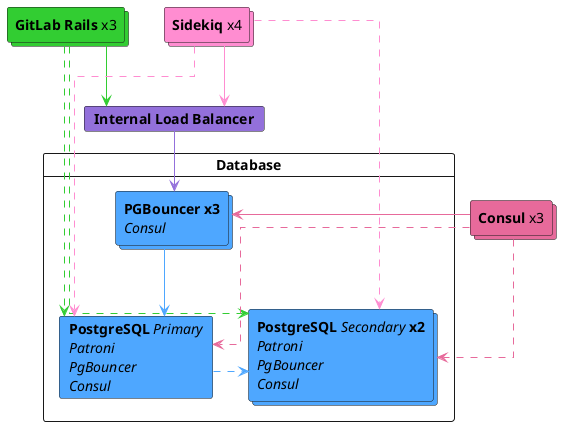



- プラン: Premium、Ultimate
- 提供形態: GitLab Self-Managed



GitLab Self-ManagedのFreeユーザーの方は、クラウドホスト型ソリューションの使用をご検討ください。このドキュメントでは、セルフコンパイルインストールについては説明していません。

レプリケーションとフェイルオーバーを伴うセットアップをお探しでない場合は、Linuxパッケージの[データベース設定ファイル](https://docs.gitlab.com/omnibus/settings/database.html)を参照してください。

GitLabのレプリケーションとフェイルオーバーでPostgreSQLを設定する前に、このドキュメントをよくお読みになることをお勧めします。

## オペレーティングシステムのアップグレード {#operating-system-upgrades}

異なるオペレーティングシステムを持つシステムにフェイルオーバーする場合は、[PostgreSQLのオペレーティングシステムのアップグレードに関するドキュメント](upgrading_os.md)をお読みください。オペレーティングシステムのアップグレードでローカルな変更を考慮しないと、データが破損する可能性があります。

## アーキテクチャ {#architecture}

レプリケーションとフェイルオーバーを備えたPostgreSQLクラスター用にLinuxパッケージの設定には、以下が必要です:

- 最小3つのPostgreSQLノード。
- 最小3つのConsulサーバーノード。
- プライマリデータベースの読み取りと書き込みを追跡および処理する、最小3つのPgBouncerノード。
  - 内部ロードバランサー（TCP）でPgBouncerノード間のリクエストのバランスを取ります。
- 有効な[データベースロードバランシング](database_load_balancing.md)。
  - 各PostgreSQLノードで設定するローカルPgBouncerサービス。これは、プライマリを追跡するメインPgBouncerクラスターとは異なります。



また、基盤となるネットワーキングトポロジを考慮し、すべてのデータベースとGitLabインスタンス間に冗長接続を確保して、ネットワークが単一障害点にならないようにする必要があります。

### データベースノード {#database-node}

各データベースノードは、4つのサービスを実行します:

- `PostgreSQL`: データベース自体。
- `Patroni`: クラスター内の他のPatroniサービスと通信し、リーダーサーバーで問題が発生した場合にフェイルオーバーを処理します。フェイルオーバーの手順は次のとおりです:
  - クラスターの新しいリーダーを選択します。
  - 新しいノードをリーダーにプロモートします。
  - 残りのサーバーに新しいリーダーノードに従うように指示します。
- `PgBouncer`: ノードのローカルプーラー。_読み取り_クエリとして、[データベースロードバランシング](database_load_balancing.md)の一部として使用されます。
- `Consul`エージェント: 現在のPatroniの状態を格納するConsulクラスターと通信します。エージェントは、データベースクラスター内の各ノードのステータスをモニタリングし、Consulクラスター上のサービス定義でそのヘルスを追跡します。

### Consulサーバーノード {#consul-server-node}

Consulサーバーノードは、Consulサーバーサービスを実行します。これらのノードは、Patroniクラスターのブートストラップの前に、定足数に達し、リーダーを選出している必要があります。そうでない場合、データベースノードはそのようなConsulリーダーが選出されるまで待機します。

### PgBouncerノード {#pgbouncer-node}

各PgBouncerノードは、2つのサービスを実行します:

- `PgBouncer`: データベース接続プーラー自体。
- `Consul`エージェント: Consulクラスター上のPostgreSQLサービス定義のステータスを監視します。そのステータスが変更されると、Consulは、新しいPostgreSQLリーダーノードを指すようにPgBouncer設定ファイルを更新し、PgBouncerサービスをリロードするスクリプトを実行します。

### 接続フロー {#connection-flow}

パッケージ内の各サービスには、一連の[デフォルトポート](../package_information/defaults.md#ports)が付属しています。以下に示す接続に対して、特定のファイアウォールルールを作成する必要がある場合があります:

このセットアップには、いくつかの接続フローがあります:

- [プライマリ](#primary)
- [データベースロードバランシング](#database-load-balancing)
- [レプリケーション](#replication)

#### プライマリ {#primary}

- アプリケーションサーバーは、PgBouncerの[デフォルトポート](../package_information/defaults.md)を介して直接、または複数のPgBouncerを提供する設定済みの内部ロードバランサー（TCP）を介してPgBouncerに接続します。
- PgBouncerは、プライマリデータベースサーバーの[PostgreSQLのデフォルトポート](../package_information/defaults.md)に接続します。

#### データベースロードバランシング {#database-load-balancing}

最近変更されておらず、すべてのデータベースノードで最新の状態になっているデータに対する読み取りクエリの場合:

- アプリケーションサーバーは、ラウンドロビンアプローチで、各データベースノードの[デフォルトポート](../package_information/defaults.md)を介してローカルPgBouncerサービスに接続します。
- ローカルPgBouncerは、ローカルデータベースサーバーの[PostgreSQLのデフォルトポート](../package_information/defaults.md)に接続します。

#### レプリケーション {#replication}

- Patroniは、実行中のPostgreSQLプロセスと設定をアクティブに管理します。
- PostgreSQLセカンダリは、プライマリデータベースサーバーの[PostgreSQLのデフォルトポート](../package_information/defaults.md)に接続します
- Consulサーバーとエージェントは、相互の[Consulのデフォルトポート](../package_information/defaults.md)に接続します

## セットアップ {#setting-it-up}

### 必要な情報 {#required-information}

設定に進む前に、必要な情報をすべて収集する必要があります。

#### ネットワーク情報 {#network-information}

PostgreSQLは、デフォルトではどのネットワークインターフェースもリッスンしません。他のサービスからアクセスできるように、リッスンするIPアドレスを知る必要があります。同様に、PostgreSQLアクセスはネットワークソースに基づいて制御されます。

これが必要な理由です:

- 各ノードのネットワークインターフェースのIPアドレス。これは、すべてのインターフェースでリッスンするために`0.0.0.0`に設定できます。これは、ループバックアドレス`127.0.0.1`に設定できません。
- ネットワークアドレス。これは、サブネット（つまり、`192.168.0.0/255.255.255.0`）またはクラスレスドメイン間ルーティング（CIDR）（`192.168.0.0/24`）形式にすることができます。

#### Consul情報 {#consul-information}

デフォルトのセットアップを使用する場合、最小限の設定には以下が必要です:

- `CONSUL_USERNAME`。Linuxパッケージインストールの場合、デフォルトユーザーは`gitlab-consul`です
- `CONSUL_DATABASE_PASSWORD`。データベースユーザーのパスワード。
- `CONSUL_PASSWORD_HASH`。これは、Consulのユーザー名/パスワードのペアから生成されたハッシュです。これは、以下で生成できます:

  ```shell
  sudo gitlab-ctl pg-password-md5 CONSUL_USERNAME
  ```

- `CONSUL_SERVER_NODES`。ConsulサーバーノードのIPアドレスまたはDNSレコード。

サービス自体に関するいくつかの注意点:

- サービスはシステムアカウントで実行されます（デフォルトでは`gitlab-consul`）。
- 別のユーザー名を使用している場合は、`CONSUL_USERNAME`変数を使用して指定する必要があります。
- パスワードは次の場所に保存されます:
  - `/etc/gitlab/gitlab.rb`: ハッシュ化
  - `/var/opt/gitlab/pgbouncer/pg_auth`: ハッシュ化
  - `/var/opt/gitlab/consul/.pgpass`: 平文

#### PostgreSQL情報 {#postgresql-information}

PostgreSQLを設定する場合、次の手順を実行します:

- `max_replication_slots`をデータベースノードの数の2倍に設定します。Patroniは、レプリケーションを開始するときに、ノードごとに1つの追加スロットを使用します。
- `max_wal_senders`を、クラスター内で割り当てられたレプリケーションスロットの数より1つ多く設定します。これにより、レプリケーションが利用可能なすべてのデータベース接続を使い果たすのを防ぎます。

このドキュメントでは、3つのデータベースノードを想定しており、これにより設定は次のようになります:

```ruby
patroni['postgresql']['max_replication_slots'] = 6
patroni['postgresql']['max_wal_senders'] = 7
```

前述のように、データベースとの認証に必要なネットワークサブネットを準備します。また、ConsulサーバーノードのIPアドレスまたはDNSレコードを手元に用意しておく必要もあります。

アプリケーションのデータベースユーザーには、次のパスワード情報が必要です:

- `POSTGRESQL_USERNAME`。Linuxパッケージインストールの場合、デフォルトユーザーは`gitlab`です
- `POSTGRESQL_USER_PASSWORD`。データベースユーザーのパスワード
- `POSTGRESQL_PASSWORD_HASH`。これは、ユーザー名/パスワードのペアから生成されたハッシュです。これは、以下で生成できます:

  ```shell
  sudo gitlab-ctl pg-password-md5 POSTGRESQL_USERNAME
  ```

#### Patroni情報 {#patroni-information}

Patroni APIには、次のパスワード情報が必要です:

- `PATRONI_API_USERNAME`。APIへの基本認証のユーザー名
- `PATRONI_API_PASSWORD`。APIへの基本認証のパスワード

#### PgBouncer情報 {#pgbouncer-information}

デフォルトのセットアップを使用する場合、最小限の設定には以下が必要です:

- `PGBOUNCER_USERNAME`。Linuxパッケージインストールの場合、デフォルトユーザーは`pgbouncer`です
- `PGBOUNCER_PASSWORD`。これは、PgBouncerサービスのパスワードです。
- `PGBOUNCER_PASSWORD_HASH`。これは、PgBouncerのユーザー名/パスワードのペアから生成されたハッシュです。これは、以下で生成できます:

  ```shell
  sudo gitlab-ctl pg-password-md5 PGBOUNCER_USERNAME
  ```

- `PGBOUNCER_NODE`は、PgBouncerを実行しているノードのIPアドレスまたはFQDNです。

サービス自体に関するいくつかの注意点:

- サービスは、データベースと同じシステムアカウントとして実行されます。パッケージでは、これはデフォルトで`gitlab-psql`です
- PgBouncerサービスにデフォルト以外のユーザーアカウント（デフォルトでは`pgbouncer`）を使用する場合は、このユーザー名を指定する必要があります。
- パスワードは次の場所に保存されます:
  - `/etc/gitlab/gitlab.rb`: ハッシュ化され、平文で記述されています
  - `/var/opt/gitlab/pgbouncer/pg_auth`: ハッシュ化

### Linuxパッケージのインストール {#installing-the-linux-package}

まず、各ノードにLinuxパッケージを[ダウンロードしてインストール](https://about.gitlab.com/install/)してください。

手順1で必要な依存関係をインストールし、手順2でGitLabパッケージリポジトリを追加してください。GitLabパッケージのインストール時に、`EXTERNAL_URL`値を指定しないでください。

### データベースノードの設定 {#configuring-the-database-nodes}

1. [Consulノードを設定](../consul.md)していることを確認してください。
1. 次の手順を実行する前に、[`CONSUL_SERVER_NODES`](#consul-information) 、[`PGBOUNCER_PASSWORD_HASH`](#pgbouncer-information) 、[`POSTGRESQL_PASSWORD_HASH`](#postgresql-information) 、[dbノードの数](#postgresql-information) 、[ネットワークアドレス](#network-information)を収集していることを確認してください。

#### Patroniクラスターの設定 {#configuring-patroni-cluster}

Patroniを明示的に有効にして、使用できるようにする必要があります（`patroni['enable'] = true`を使用）。

レプリケーションを制御するPostgreSQLの設定項目（`wal_level`、`max_wal_senders`など）は、Patroniによって厳密に制御されます。これらの設定は、`postgresql[...]`設定キーを使用して行う元の設定をオーバーライドします。したがって、これらはすべて分離され、`patroni['postgresql'][...]`の下に配置されます。この動作は、レプリケーションに限定されます。Patroniは、`postgresql[...]`設定キーを使用して行われた他のPostgreSQLの設定を尊重します。たとえば、`max_wal_senders`は、デフォルトで`5`に設定されます。これを変更する場合は、`patroni['postgresql']['max_wal_senders']`設定キーを使用して設定する必要があります。

次に例を示します:

```ruby
# Disable all components except Patroni, PgBouncer and Consul
roles(['patroni_role', 'pgbouncer_role'])

# PostgreSQL configuration
postgresql['listen_address'] = '0.0.0.0'

# Disable automatic database migrations
gitlab_rails['auto_migrate'] = false

# Configure the Consul agent
consul['services'] = %w(postgresql)

# START user configuration
#  Set the real values as explained in Required Information section
#
# Replace PGBOUNCER_PASSWORD_HASH with a generated md5 value
postgresql['pgbouncer_user_password'] = 'PGBOUNCER_PASSWORD_HASH'
# Replace POSTGRESQL_REPLICATION_PASSWORD_HASH with a generated md5 value
postgresql['sql_replication_password'] = 'POSTGRESQL_REPLICATION_PASSWORD_HASH'
# Replace POSTGRESQL_PASSWORD_HASH with a generated md5 value
postgresql['sql_user_password'] = 'POSTGRESQL_PASSWORD_HASH'

# Replace PATRONI_API_USERNAME with a username for Patroni Rest API calls (use the same username in all nodes)
patroni['username'] = 'PATRONI_API_USERNAME'
# Replace PATRONI_API_PASSWORD with a password for Patroni Rest API calls (use the same password in all nodes)
patroni['password'] = 'PATRONI_API_PASSWORD'

# Sets `max_replication_slots` to double the number of database nodes.
# Patroni uses one extra slot per node when initiating the replication.
patroni['postgresql']['max_replication_slots'] = X

# Set `max_wal_senders` to one more than the number of replication slots in the cluster.
# This is used to prevent replication from using up all of the
# available database connections.
patroni['postgresql']['max_wal_senders'] = X+1

# Replace XXX.XXX.XXX.XXX/YY with Network Addresses for your other patroni nodes
patroni['allowlist'] = %w(XXX.XXX.XXX.XXX/YY 127.0.0.1/32)

# Replace XXX.XXX.XXX.XXX/YY with Network Address
postgresql['trust_auth_cidr_addresses'] = %w(XXX.XXX.XXX.XXX/YY 127.0.0.1/32)

# Local PgBouncer service for Database Load Balancing
pgbouncer['databases'] = {
  gitlabhq_production: {
    host: "127.0.0.1",
    user: "PGBOUNCER_USERNAME",
    password: 'PGBOUNCER_PASSWORD_HASH'
  }
}

# Replace placeholders:
#
# Y.Y.Y.Y consul1.gitlab.example.com Z.Z.Z.Z
# with the addresses gathered for CONSUL_SERVER_NODES
consul['configuration'] = {
  retry_join: %w(Y.Y.Y.Y consul1.gitlab.example.com Z.Z.Z.Z)
}
#
# END user configuration
```

すべてのデータベースノードは、同じ設定を使用します。リーダーノードは設定で決定されず、リーダーノードまたはレプリカノードのいずれかに追加の設定や異なる設定はありません。

ノードの設定が完了したら、変更を有効にするには、各ノードで[GitLabを再構成する](../restart_gitlab.md#reconfigure-a-linux-package-installation)必要があります。

通常、Consulクラスターの準備ができると、[再構成する](../restart_gitlab.md#reconfigure-a-linux-package-installation)最初のノードがリーダーになります。ノードの再構成をシーケンスする必要はありません。これらは、並行して、または任意の順序で実行できます。任意の順序を選択した場合、事前に決定されたリーダーはありません。

#### モニタリングを有効にする {#enable-monitoring}

モニタリングを有効にする場合は、すべてのデータベースサーバーで有効にする必要があります。

1. `/etc/gitlab/gitlab.rb`を作成/編集し、次の設定を追加します:

   ```ruby
   # Enable service discovery for Prometheus
   consul['monitoring_service_discovery'] = true

   # Set the network addresses that the exporters must listen on
   node_exporter['listen_address'] = '0.0.0.0:9100'
   postgres_exporter['listen_address'] = '0.0.0.0:9187'
   ```

1. `sudo gitlab-ctl reconfigure`を実行して設定をコンパイルします。

#### Patroni APIのTLSサポートを有効にする {#enable-tls-support-for-the-patroni-api}

デフォルトでは、Patroni [REST API](https://patroni.readthedocs.io/en/latest/rest_api.html#rest-api)はHTTP経由で提供されます。TLSを有効にして、同じ[ポート](../package_information/defaults.md)でHTTPSを使用するオプションがあります。

TLSを有効にするには、PEM形式の証明書と秘密キーファイルが必要です。両方のファイルは、PostgreSQLユーザー（デフォルトでは`gitlab-psql`、または`postgresql['username']`で設定されたユーザー）が読み取り可能である必要があります:

```ruby
patroni['tls_certificate_file'] = '/path/to/server/certificate.pem'
patroni['tls_key_file'] = '/path/to/server/key.pem'
```

サーバーの秘密キーが暗号化された場合は、それを復号化するためのパスワードを指定します:

```ruby
patroni['tls_key_password'] = 'private-key-password' # This is the plain-text password.
```

自己署名証明書または内部認証局を使用している場合は、TLS検証を無効にするか、内部認証局の証明書を渡す必要があります。そうしないと、`gitlab-ctl patroni ....`コマンドを使用するときに予期しないエラーが発生する可能性があります。Linuxパッケージを使用すると、Patroni APIクライアントがこの設定を確実に尊重します。

TLS証明書の検証は、デフォルトで有効になっています。無効にするには、次の手順に従います: 

```ruby
patroni['tls_verify'] = false
```

または、内部認証局のPEM形式の証明書を渡すこともできます。ここでも、ファイルはPostgreSQLユーザーが読み取り可能である必要があります:

```ruby
patroni['tls_ca_file'] = '/path/to/ca.pem'
```

TLSが有効になっている場合、APIサーバーとクライアントの相互認証はすべてのエンドポイントで可能であり、その範囲は`patroni['tls_client_mode']`属性によって異なります:

- `none`（デフォルト）: APIは、クライアント証明書をチェックしません。
- `optional`: クライアント証明書は、すべての[安全でない](https://patroni.readthedocs.io/en/latest/security.html#protecting-the-rest-api)APIコールに必要です。
- `required`: クライアント証明書は、すべてのAPIコールに必要です。

クライアント証明書は、`patroni['tls_ca_file']`属性で指定されたCA証明書に対して検証されます。したがって、この属性は相互TLS認証に必要です。また、PEM形式のクライアント証明書と秘密キーファイルも指定する必要があります。両方のファイルは、PostgreSQLユーザーが読み取り可能である必要があります:

```ruby
patroni['tls_client_mode'] = 'required'
patroni['tls_ca_file'] = '/path/to/ca.pem'

patroni['tls_client_certificate_file'] = '/path/to/client/certificate.pem'
patroni['tls_client_key_file'] = '/path/to/client/key.pem'
```

検証できる限り、異なるPatroniノード上のAPIサーバーとクライアントの両方に異なる証明書とキーを使用できます。ただし、CA証明書（`patroni['tls_ca_file']`）、TLS証明書の検証（`patroni['tls_verify']`）、クライアントTLS認証モード（`patroni['tls_client_mode']`）は、それぞれすべてのノードで同じ値を持つ必要があります。

### PgBouncerノードを設定する {#configure-pgbouncer-nodes}

1. 次の手順を実行する前に、[`CONSUL_SERVER_NODES`](#consul-information) 、[`CONSUL_PASSWORD_HASH`](#consul-information) 、[`PGBOUNCER_PASSWORD_HASH`](#pgbouncer-information)を収集していることを確認してください。

1. 各ノードで、`/etc/gitlab/gitlab.rb`設定ファイルを編集し、`# START user configuration`セクションに記載されている値を以下のように置き換えます:

   ```ruby
   # Disable all components except PgBouncer and Consul agent
   roles(['pgbouncer_role'])

   # Configure PgBouncer
   pgbouncer['admin_users'] = %w(pgbouncer gitlab-consul)

   # Configure Consul agent
   consul['watchers'] = %w(postgresql)

   # START user configuration
   # Set the real values as explained in Required Information section
   # Replace CONSUL_PASSWORD_HASH with a generated md5 value
   # Replace PGBOUNCER_PASSWORD_HASH with a generated md5 value
   pgbouncer['users'] = {
     'gitlab-consul': {
       password: 'CONSUL_PASSWORD_HASH'
     },
     'pgbouncer': {
       password: 'PGBOUNCER_PASSWORD_HASH'
     }
   }
   # Replace placeholders:
   #
   # Y.Y.Y.Y consul1.gitlab.example.com Z.Z.Z.Z
   # with the addresses gathered for CONSUL_SERVER_NODES
   consul['configuration'] = {
     retry_join: %w(Y.Y.Y.Y consul1.gitlab.example.com Z.Z.Z.Z)
   }
   #
   # END user configuration
   ```

1. `gitlab-ctl reconfigure`を実行

1. `.pgpass`ファイルを作成して、ConsulがPgBouncerを再読み込みできるようにします。求められたら、`PGBOUNCER_PASSWORD`を2回入力します:

   ```shell
   gitlab-ctl write-pgpass --host 127.0.0.1 --database pgbouncer --user pgbouncer --hostuser gitlab-consul
   ```

1. [モニタリングを有効にする](pgbouncer.md#enable-monitoring)

#### PgBouncerチェックポイント {#pgbouncer-checkpoint}

1. 各ノードが現在のノードリーダーと通信していることを確認します:

   ```shell
   gitlab-ctl pgb-console # Supply PGBOUNCER_PASSWORD when prompted
   ```

   パスワードを入力した後にエラー`psql: ERROR:  Auth failed`が表示される場合は、以前に正しい形式でMD5ハッシュを生成したことを確認してください。正しい形式は、パスワードとユーザー名が連結したものです: `PASSWORDUSERNAME`。たとえば、`Sup3rS3cr3tpgbouncer`は、`pgbouncer`ユーザーのMD5パスワードハッシュを生成するために必要なテキストになります。

1. コンソールのプロンプトが使用可能になったら、次のクエリを実行します:

   ```shell
   show databases ; show clients ;
   ```

   出力は次のようになります:

   ```plaintext
           name         |  host       | port |      database       | force_user | pool_size | reserve_pool | pool_mode | max_connections | current_connections
   ---------------------+-------------+------+---------------------+------------+-----------+--------------+-----------+-----------------+---------------------
    gitlabhq_production | MASTER_HOST | 5432 | gitlabhq_production |            |        20 |            0 |           |               0 |                   0
    pgbouncer           |             | 6432 | pgbouncer           | pgbouncer  |         2 |            0 | statement |               0 |                   0
   (2 rows)

    type |   user    |      database       |  state  |   addr         | port  | local_addr | local_port |    connect_time     |    request_time     |    ptr    | link | remote_pid | tls
   ------+-----------+---------------------+---------+----------------+-------+------------+------------+---------------------+---------------------+-----------+------+------------+-----
    C    | pgbouncer | pgbouncer           | active  | 127.0.0.1      | 56846 | 127.0.0.1  |       6432 | 2017-08-21 18:09:59 | 2017-08-21 18:10:48 | 0x22b3880 |      |          0 |
   (2 rows)
   ```

#### 内部ロードバランサーを設定する {#configure-the-internal-load-balancer}

推奨されているように、複数のPgBouncerノードを実行している場合は、それぞれに正しく対応するようにTCP内部ロードバランサーをセットアップする必要があります。これは、信頼できるTCPロードバランサーで実現できます。

例として、[HAProxy](https://www.haproxy.org/)でこれを行う方法を次に示します:

```plaintext
global
    log /dev/log local0
    log localhost local1 notice
    log stdout format raw local0

defaults
    log global
    default-server inter 10s fall 3 rise 2
    balance leastconn

frontend internal-pgbouncer-tcp-in
    bind *:6432
    mode tcp
    option tcplog

    default_backend pgbouncer

backend pgbouncer
    mode tcp
    option tcp-check

    server pgbouncer1 <ip>:6432 check
    server pgbouncer2 <ip>:6432 check
    server pgbouncer3 <ip>:6432 check
```

詳細なガイダンスについては、選択したロードバランサーのドキュメントを参照してください。

### アプリケーションノードの設定 {#configuring-the-application-nodes}

アプリケーションノードは、`gitlab-rails`サービスを実行します。他の属性が設定されている可能性がありますが、次の属性を設定する必要があります。

1. `/etc/gitlab/gitlab.rb`を編集します: 

   ```ruby
   # Disable PostgreSQL on the application node
   postgresql['enable'] = false

   gitlab_rails['db_host'] = 'PGBOUNCER_NODE' or 'INTERNAL_LOAD_BALANCER'
   gitlab_rails['db_port'] = 6432
   gitlab_rails['db_password'] = 'POSTGRESQL_USER_PASSWORD'
   gitlab_rails['auto_migrate'] = false
   gitlab_rails['db_load_balancing'] = { 'hosts' => ['POSTGRESQL_NODE_1', 'POSTGRESQL_NODE_2', 'POSTGRESQL_NODE_3'] }
   ```

1. 変更を有効にするには、[GitLabを再設定します](../restart_gitlab.md#reconfigure-a-linux-package-installation)。

#### アプリケーションノードの設定後 {#application-node-post-configuration}

すべての移行が実行されたことを確認します:

```shell
gitlab-rake gitlab:db:configure
```



PgBouncerがPostgreSQLへの接続に失敗したことを示す`rake aborted!`エラーが発生した場合、PostgreSQLのデータベースノードの`gitlab.rb`の`trust_auth_cidr_addresses`にPgBouncerノードのIPアドレスがない可能性があります。続行する前に、[PgBouncerエラー`ERROR:  pgbouncer cannot connect to server`](replication_and_failover_troubleshooting.md#pgbouncer-error-error-pgbouncer-cannot-connect-to-server)を参照してください。



### バックアップ {#backups}

PgBouncer接続を介してGitLabをバックアップまたは復元しないでください。これにより、GitLab停止が発生します。

詳細とバックアップの再構成方法については、[こちらをお読みください](../backup_restore/backup_gitlab.md#back-up-and-restore-for-installations-using-pgbouncer)。

### GitLabが実行されていることを確認してください {#ensure-gitlab-is-running}

この時点で、GitLabインスタンスは起動して実行されているはずです。サインインでき、イシューとマージリクエストを作成できることを確認します。詳細については、[レプリケーションとフェイルオーバーのトラブルシューティング](replication_and_failover_troubleshooting.md)を参照してください。

## 設定例 {#example-configuration}

このセクションでは、完全に展開された設定例をいくつか説明します。

### 推奨設定例 {#example-recommended-setup}

この例では、3つのConsulサーバー、3つのPgBouncerサーバー（関連する内部ロードバランサー付き）、3つのPostgreSQLサーバー、および1つのアプリケーションノードを使用します。

この設定では、すべてのサーバーが同じ`10.6.0.0/16`プライベートネットワーク範囲を共有します。サーバーはこれらのアドレスを介して自由に通信します。

別のネットワーキング設定を使用することもできますが、クラスター全体で同期レプリケーションが発生するようにすることをお勧めします。一般的なルールとして、2ミリ秒未満のレイテンシーにより、レプリケーション操作のパフォーマンスが向上します。

GitLabの[参照アーキテクチャ](../reference_architectures/_index.md)は、アプリケーションデータベースクエリが3つすべてのノードで共有されることを前提としてサイズ設定されています。2ミリ秒を超える通信レイテンシーは、データベースロックを引き起こし、レプリカが読み取り専用のクエリをタイムリーに処理する能力に影響を与える可能性があります。

- `10.6.0.22`: PgBouncer 2
- `10.6.0.23`: PgBouncer 3
- `10.6.0.31`: PostgreSQL 1
- `10.6.0.32`: PostgreSQL 2
- `10.6.0.33`: PostgreSQL 3
- `10.6.0.41`: GitLabアプリケーション3

すべてのパスワードは`toomanysecrets`に設定されています。このパスワードまたは派生ハッシュを使用しないでください。GitLabの`external_url`は`http://gitlab.example.com`です。

初期設定後、フェイルオーバーが発生すると、PostgreSQLリーダーノードは、フェイルオーバーバックされるまで、使用可能なセカンダリのいずれかに変更されます。

#### Consulサーバーの推奨設定例 {#example-recommended-setup-for-consul-servers}

各サーバーで`/etc/gitlab/gitlab.rb`を編集します:

```ruby
# Disable all components except Consul
roles(['consul_role'])

consul['configuration'] = {
  server: true,
  retry_join: %w(10.6.0.11 10.6.0.12 10.6.0.13)
}
consul['monitoring_service_discovery'] =  true
```

変更を有効にするには、[GitLabを再設定します](../restart_gitlab.md#reconfigure-a-linux-package-installation)。

#### PgBouncerサーバーの推奨設定例 {#example-recommended-setup-for-pgbouncer-servers}

各サーバーで`/etc/gitlab/gitlab.rb`を編集します:

```ruby
# Disable all components except Pgbouncer and Consul agent
roles(['pgbouncer_role'])

# Configure PgBouncer
pgbouncer['admin_users'] = %w(pgbouncer gitlab-consul)

pgbouncer['users'] = {
  'gitlab-consul': {
    password: '5e0e3263571e3704ad655076301d6ebe'
  },
  'pgbouncer': {
    password: '771a8625958a529132abe6f1a4acb19c'
  }
}

consul['watchers'] = %w(postgresql)
consul['configuration'] = {
  retry_join: %w(10.6.0.11 10.6.0.12 10.6.0.13)
}
consul['monitoring_service_discovery'] =  true
```

変更を有効にするには、[GitLabを再設定します](../restart_gitlab.md#reconfigure-a-linux-package-installation)。

#### 内部ロードバランサーの設定 {#internal-load-balancer-setup}

次に、各PgBouncerノード（この例では`10.6.0.20`のIP上）にサービスを提供するために、内部ロードバランサー（TCP）を設定する必要があります。これを行う方法の例は、[PgBouncer内部ロードバランサーの設定](#configure-the-internal-load-balancer)セクションにあります。

#### PostgreSQLサーバーの推奨設定例 {#example-recommended-setup-for-postgresql-servers}

データベースノードで`/etc/gitlab/gitlab.rb`を編集します:

```ruby
# Disable all components except Patroni, PgBouncer and Consul
roles(['patroni_role', 'pgbouncer_role'])

# PostgreSQL configuration
postgresql['listen_address'] = '0.0.0.0'
postgresql['hot_standby'] = 'on'
postgresql['wal_level'] = 'replica'

# Disable automatic database migrations
gitlab_rails['auto_migrate'] = false

postgresql['pgbouncer_user_password'] = '771a8625958a529132abe6f1a4acb19c'
postgresql['sql_user_password'] = '450409b85a0223a214b5fb1484f34d0f'
patroni['username'] = 'PATRONI_API_USERNAME'
patroni['password'] = 'PATRONI_API_PASSWORD'
patroni['postgresql']['max_replication_slots'] = 6
patroni['postgresql']['max_wal_senders'] = 7

patroni['allowlist'] = = %w(10.6.0.0/16 127.0.0.1/32)
postgresql['trust_auth_cidr_addresses'] = %w(10.6.0.0/16 127.0.0.1/32)

# Local PgBouncer service for Database Load Balancing
pgbouncer['databases'] = {
  gitlabhq_production: {
    host: "127.0.0.1",
    user: "pgbouncer",
    password: '771a8625958a529132abe6f1a4acb19c'
  }
}

# Configure the Consul agent
consul['services'] = %w(postgresql)
consul['configuration'] = {
  retry_join: %w(10.6.0.11 10.6.0.12 10.6.0.13)
}
consul['monitoring_service_discovery'] =  true
```

変更を有効にするには、[GitLabを再設定します](../restart_gitlab.md#reconfigure-a-linux-package-installation)。

#### 推奨設定例の手順 {#example-recommended-setup-manual-steps}

デプロイメントの設定後、次の手順に従います:

1. プライマリデータベースノードを見つけます:

   ```shell
   gitlab-ctl get-postgresql-primary
   ```

1. アプリケーションサーバーである`10.6.0.41`:

   `gitlab-consul`ユーザーのPgBouncerパスワードを`toomanysecrets`に設定します:

   ```shell
   gitlab-ctl write-pgpass --host 127.0.0.1 --database pgbouncer --user pgbouncer --hostuser gitlab-consul
   ```

   データベースの移行を再実行します:

   ```shell
   gitlab-rake gitlab:db:configure
   ```

## Patroni {#patroni}

Patroniは、PostgreSQLの高可用性のための独断的なソリューションです。PostgreSQLの制御を取得し、その設定をオーバーライドし、そのライフサイクル（開始、停止、再起動）を管理します。Patroniは、PostgreSQL 12以上のクラスタリングと、Geoデプロイメントのカスケードレプリケーションのための唯一のオプションです。

基本的な[アーキテクチャ](#example-recommended-setup-manual-steps)はPatroniでは変更されません。データベースノードをプロビジョニングする際に、Patroniについて特別な考慮事項は必要ありません。Patroniは、クラスターの状態を保存し、リーダーを選出するために、Consulに大きく依存しています。Consulクラスターとそのリーダー選出の失敗は、Patroniクラスターにも伝播されます。

Patroniはクラスターを監視し、フェイルオーバーを処理します。プライマリノードに障害が発生すると、Consulと連携してPgBouncerに通知します。失敗すると、Patroniは古いプライマリをレプリカに移行させ、クラスターに自動的に再結合します。

Patroniでは、接続フローがわずかに異なります。各ノードのPatroniはConsulエージェントに接続して、クラスターに参加します。この後でのみ、ノードがプライマリかレプリカかを決定します。この決定に基づいて、Unixソケットを介して直接通信するPostgreSQLを構成して起動します。これは、Consulクラスターが機能していないか、リーダーがいない場合、Patroni、ひいてはPostgreSQLが起動しないことを意味します。Patroniは、各ノードの[デフォルトポート](../package_information/defaults.md)を介してアクセスできるREST APIも公開します。

### レプリケーションステータスを確認します {#check-replication-status}

`gitlab-ctl patroni members`を実行して、Patroniにクラスターの状態の概要をクエリします:

```plaintext
+ Cluster: postgresql-ha (6970678148837286213) ------+---------+---------+----+-----------+
| Member                              | Host         | Role    | State   | TL | Lag in MB |
+-------------------------------------+--------------+---------+---------+----+-----------+
| gitlab-database-1.example.com       | 172.18.0.111 | Replica | running |  5 |         0 |
| gitlab-database-2.example.com       | 172.18.0.112 | Replica | running |  5 |       100 |
| gitlab-database-3.example.com       | 172.18.0.113 | Leader  | running |  5 |           |
+-------------------------------------+--------------+---------+---------+----+-----------+
```

レプリケーションのステータスを確認するには:

```shell
echo -e 'select * from pg_stat_wal_receiver\x\g\x \n select * from pg_stat_replication\x\g\x' | gitlab-psql
```

同じコマンドを3台すべてのデータベースサーバーで実行できます。サーバーが実行しているロールに応じて、利用可能なレプリケーションに関する情報を返します。

リーダーはレプリカごとに1つのレコードを返す必要があります:

```sql
-[ RECORD 1 ]----+------------------------------
pid              | 371
usesysid         | 16384
usename          | gitlab_replicator
application_name | gitlab-database-1.example.com
client_addr      | 172.18.0.111
client_hostname  |
client_port      | 42900
backend_start    | 2021-06-14 08:01:59.580341+00
backend_xmin     |
state            | streaming
sent_lsn         | 0/EA13220
write_lsn        | 0/EA13220
flush_lsn        | 0/EA13220
replay_lsn       | 0/EA13220
write_lag        |
flush_lag        |
replay_lag       |
sync_priority    | 0
sync_state       | async
reply_time       | 2021-06-18 19:17:14.915419+00
```

さらに調査が必要な場合:

- レコードが不足しているか、余分なレコードがあります。
- `reply_time`が最新ではありません。

`lsn`フィールドは、どの先行書き込みログセグメントがレプリケートされたかに関連します。現在のログシーケンス番号（LSN）を確認するには、リーダーで以下を実行します:

```shell
echo 'SELECT pg_current_wal_lsn();' | gitlab-psql
```

レプリカが同期していない場合、`gitlab-ctl patroni members`は不足しているデータの量を示し、`lag`フィールドは経過時間を示します。

`state`フィールドの他の値を含め、[PostgreSQLドキュメント](https://www.postgresql.org/docs/16/monitoring-stats.html#PG-STAT-REPLICATION-VIEW)で、リーダーによって返されるデータの詳細を参照してください。

レプリカは次を返す必要があります:

```sql
-[ RECORD 1 ]---------+-------------------------------------------------------------------------------------------------
pid                   | 391
status                | streaming
receive_start_lsn     | 0/D000000
receive_start_tli     | 5
received_lsn          | 0/EA13220
received_tli          | 5
last_msg_send_time    | 2021-06-18 19:16:54.807375+00
last_msg_receipt_time | 2021-06-18 19:16:54.807512+00
latest_end_lsn        | 0/EA13220
latest_end_time       | 2021-06-18 19:07:23.844879+00
slot_name             | gitlab-database-1.example.com
sender_host           | 172.18.0.113
sender_port           | 5432
conninfo              | user=gitlab_replicator host=172.18.0.113 port=5432 application_name=gitlab-database-1.example.com
```

[PostgreSQLドキュメント](https://www.postgresql.org/docs/16/monitoring-stats.html#PG-STAT-WAL-RECEIVER-VIEW)で、レプリカによって返されるデータの詳細を参照してください。

### 適切なPatroniレプリケーション方法の選択 {#selecting-the-appropriate-patroni-replication-method}

オプションによっては、十分に理解されていない場合、潜在的なデータ損失のリスクがあるため、変更を行う前に[Patroniドキュメントを注意深く確認してください](https://patroni.readthedocs.io/en/latest/yaml_configuration.html#postgresql)。構成された[レプリケーションモード](https://patroni.readthedocs.io/en/latest/replication_modes.html)は、許容できるデータ損失の量を決定します。



レプリケーションは、バックアップ戦略ではありません！十分に検討され、テストされたバックアップソリューションの代わりはありません。



Linuxパッケージインストールでは、デフォルトで[`synchronous_commit`](https://www.postgresql.org/docs/16/runtime-config-wal.html#GUC-SYNCHRONOUS-COMMIT)が`on`に設定されています。

```ruby
postgresql['synchronous_commit'] = 'on'
gitlab['geo-postgresql']['synchronous_commit'] = 'on'
```

#### Patroniフェイルオーバー動作のカスタマイズ {#customizing-patroni-failover-behavior}

Linuxパッケージのインストールでは、[Patroni復元プロセス](#recovering-the-patroni-cluster)をより細かく制御できるいくつかのオプションが公開されています。

各オプションは、`/etc/gitlab/gitlab.rb`のデフォルト値とともに以下に示されています。

```ruby
patroni['use_pg_rewind'] = true
patroni['remove_data_directory_on_rewind_failure'] = false
patroni['remove_data_directory_on_diverged_timelines'] = false
```

[アップストリームドキュメントは常に最新の状態に保たれています](https://patroni.readthedocs.io/en/latest/patroni_configuration.html)が、以下の表は機能の最小限の概要を示すはずです。

| 設定                                       | 概要 |
|-----------------------------------------------|----------|
| `use_pg_rewind`                               | データベースクラスターに再結合する前に、以前のクラスターリーダーで`pg_rewind`の実行を試みます。 |
| `remove_data_directory_on_rewind_failure`     | `pg_rewind`に失敗した場合、ローカルPostgreSQLデータディレクトリを削除し、現在のクラスターリーダーから再度レプリケーションします。 |
| `remove_data_directory_on_diverged_timelines` | `pg_rewind`を使用できず、以前のリーダーのタイムラインが現在のものと異なる場合は、ローカルデータディレクトリを削除し、現在のクラスターリーダーから再度レプリケーションします。 |

### Patroniのデータベース認可 {#database-authorization-for-patroni}

PatroniはUnixソケットを使用してPostgreSQLインスタンスを管理します。したがって、`local`ソケットからの接続は信頼される必要があります。

レプリカは、レプリケーションユーザー（デフォルトでは`gitlab_replicator`）を使用してリーダーと通信します。このユーザーの場合、`trust`認証と`md5`認証のいずれかを選択できます。`postgresql['sql_replication_password']`を設定すると、Patroniは`md5`認証を使用し、それ以外の場合は`trust`に戻ります。

選択した認証に基づいて、`postgresql['md5_auth_cidr_addresses']`または`postgresql['trust_auth_cidr_addresses']`設定でクラスターCIDRを指定する必要があります。

### Patroniクラスターの操作 {#interacting-with-patroni-cluster}

`gitlab-ctl patroni members`を使用して、クラスターメンバーのステータスを確認できます。各ノードのステータスを確認するために、`gitlab-ctl patroni`は、ノードがプライマリかレプリカかを示す`check-leader`と`check-replica`の2つの追加サブコマンドを提供します。

Patroniが有効になっている場合、PatroniはPostgreSQLの起動、シャットダウン、および再起動を排他的に制御します。これは、特定のノードでPostgreSQLをシャットダウンするには、同じノードでPatroniをシャットダウンする必要があることを意味します:

```shell
sudo gitlab-ctl stop patroni
```

リーダーノードでPatroniサービスを停止または再起動すると、自動フェイルオーバーがトリガーされます。Patroniにフェイルオーバーをトリガーせずに設定をロードし直すか、PostgreSQLプロセスを再起動させる必要がある場合は、代わりに`gitlab-ctl patroni`の`reload`または`restart`サブコマンドを使用する必要があります。これら2つのサブコマンドは、同じ`patronictl`コマンドのラッパーです。

### Patroniの手動フェイルオーバー手順 {#manual-failover-procedure-for-patroni}



GitLab 16.5以前では、PgBouncerノードはPatroniノードとともに自動的にフェイルオーバーしません。正常な切り替えを行うには、PgBouncerサービスを[手動で再起動する必要があります](replication_and_failover_troubleshooting.md#pgbouncer-error-error-pgbouncer-cannot-connect-to-server)。



Patroniは自動フェイルオーバーをサポートしていますが、手動で実行することもできます。手動で実行する場合は、わずかに異なる2つのオプションがあります:

- フェイルオーバー: 正常なノードがない場合に、手動フェイルオーバーを実行できます。このアクションは、任意のPostgreSQLノードで実行できます:

  ```shell
  sudo gitlab-ctl patroni failover
  ```

- スイッチオーバー: クラスターが正常な場合にのみ機能し、スイッチオーバーをスケジュールできます（すぐに実行できます）。このアクションは、任意のPostgreSQLノードで実行できます:

  ```shell
  sudo gitlab-ctl patroni switchover
  ```

この件に関する詳細については、[Patroniドキュメント](https://patroni.readthedocs.io/en/latest/rest_api.html#switchover-and-failover-endpoints)を参照してください。

#### Geoセカンダリサイトの考慮事項 {#geo-secondary-site-considerations}

Geoセカンダリサイトが`Patroni`と`PgBouncer`を使用するプライマリサイトからレプリケーションする場合、PgBouncerを介したレプリケーションはサポートされていません。サポートを追加するための機能リクエストがあります。[イシュー＃8832](https://gitlab.com/gitlab-org/omnibus-gitlab/-/issues/8832)を参照してください。

（推奨）プライマリサイトにロードバランサーを導入して、`Patroni`クラスターでのフェイルオーバーを自動的に処理します。詳細については、[ステップ2を参照してください: プライマリサイトで内部ロードバランサーを設定します](../geo/setup/database.md#step-2-configure-the-internal-load-balancer-on-the-primary-site)。

##### リーダーノードから直接レプリケーションする場合のPatroniフェイルオーバーの処理 {#handling-patroni-failover-when-replicating-directly-from-the-leader-node}

セカンダリサイトが`Patroni`クラスターのリーダーノードから直接レプリケーションするように構成されている場合、`Patroni`クラスターでのフェイルオーバーにより、元のノードがフォロワーノードとして再度追加された場合でも、セカンダリサイトへのレプリケーションが停止します。

そのシナリオでは、`Patroni`クラスターでのフェイルオーバー後、セカンダリサイトが新しいリーダーからレプリケーションするように手動で指定する必要があります:

```shell
sudo gitlab-ctl replicate-geo-database --host=<new_leader_ip> --replication-slot=<slot_name>
```

これにより、セカンダリサイトのデータベースが再同期され、同期するデータの量によっては非常に時間がかかる場合があります。再同期後もレプリケーションが機能しない場合は、`gitlab-ctl reconfigure`を実行する必要があるかもしれません。

### Patroniクラスターのリカバリー {#recovering-the-patroni-cluster}

古いプライマリをリカバリーし、レプリカとしてクラスターに再結合するには、次のようにPatroniを起動します:

```shell
sudo gitlab-ctl start patroni
```

これ以上の設定や介入は必要ありません。

### Patroniのメンテナンス手順 {#maintenance-procedure-for-patroni}

Patroniが有効になっている場合は、ノードで計画メンテナンスを実行できます。Patroniなしで1つのノードでメンテナンスを実行するには、次のコマンドを使用してメンテナンスモードにすることができます:

```shell
sudo gitlab-ctl patroni pause
```

Patroniが一時停止モードで実行されている場合、PostgreSQLの状態は変更されません。完了したら、Patroniを再開できます:

```shell
sudo gitlab-ctl patroni resume
```

詳細については、[この件に関するPatroniドキュメント](https://patroni.readthedocs.io/en/latest/pause.html)を参照してください。

### PatroniクラスターでのPostgreSQLメジャーバージョンのアップグレード {#upgrading-postgresql-major-version-in-a-patroni-cluster}

バンドルされているPostgreSQLのバージョンと各リリースのデフォルトバージョンのリストについては、[LinuxパッケージのPostgreSQLバージョン](../package_information/postgresql_versions.md)を参照してください。

PostgreSQLのアップグレードを検討する前に考慮する必要があるいくつかのキーポイントを以下に示します:

- 主なポイントは、Patroniクラスターをシャットダウンする必要があることです。これは、データベースのアップグレード期間中、または少なくともリーダーノードがアップグレードされるまで、GitLabデプロイメントがダウンしていることを意味します。これは、データベースのサイズによっては、重大な停止になる可能性があります。

- PostgreSQLをアップグレードすると、新しい制御データを含む新しいデータディレクトリが作成されます。Patroniの観点からすると、これは再度ブートストラップする必要がある新しいクラスターです。したがって、アップグレード手順の一環として、クラスター状態（Consulに保存）はワイプされます。アップグレードが完了すると、Patroniは新しいクラスターをブートストラップします。これにより、クラスターIDが変更されます。

- リーダーとレプリカのアップグレード手順は同じではありません。そのため、各ノードで適切な手順を使用することが重要です。

- レプリカノードをアップグレードすると、データディレクトリが削除され、構成されたレプリケーションメソッド（`pg_basebackup`が唯一の利用可能なオプションです）を使用してリーダーから再同期されます。データベースのサイズによっては、レプリカがリーダーに追いつくまでに時間がかかる場合があります。

- アップグレード手順の概要は、[Patroniドキュメント](https://patroni.readthedocs.io/en/latest/existing_data.html#major-upgrade-of-postgresql-version)に概説されています。`gitlab-ctl pg-upgrade`引き続き使用できます。これにより、いくつかの調整を加えてこの手順が実装されます。

これらを考慮して、PostgreSQLのアップグレードを慎重に計画する必要があります:

1. どのノードがリーダーで、どのノードがレプリカであるかを確認します:

   ```shell
   gitlab-ctl patroni members
   ```

   

   Geoセカンダリサイトでは、Patroniリーダーノードは`standby leader`と呼ばれます。

   

1. レプリカでのみPatroniを停止します。

   ```shell
   sudo gitlab-ctl stop patroni
   ```

1. アプリケーションノードでメンテナンスモードを有効にします:

   ```shell
   sudo gitlab-ctl deploy-page up
   ```

1. リーダーノードでPostgreSQLをアップグレードし、アップグレードが正常に完了したことを確認します:

   ```shell
   # Default command timeout is 600s, configurable with '--timeout'
   sudo gitlab-ctl pg-upgrade
   ```

   

   `gitlab-ctl pg-upgrade`は、ノードのロールを検出しようとします。何らかの理由で自動検出が機能しない場合、またはロールが正しく検出されなかったと思われる場合は、`--leader`または`--replica`引数を使用して手動でオーバーライドできます。使用可能なオプションの詳細については、`gitlab-ctl pg-upgrade --help`を使用してください。

   

1. リーダーとクラスターの状態を確認します。正常なリーダーがいる場合にのみ続行できます:

   ```shell
   gitlab-ctl patroni check-leader

   # OR

   gitlab-ctl patroni members
   ```

1. アプリケーションノードでメンテナンスモードを無効にできるようになりました:

   ```shell
   sudo gitlab-ctl deploy-page down
   ```

1. レプリカでPostgreSQLをアップグレードします（これらはすべて並行して実行できます）:

   ```shell
   sudo gitlab-ctl pg-upgrade
   ```

1. バックアップまたは復元を実行する際のバージョンの不一致エラーを回避するために、GitLab Railsインスタンスで互換性のある`pg_dump`と`pg_restore`のバージョンが使用されていることを確認してください。これを行うには、Railsインスタンスの`/etc/gitlab/gitlab.rb`でPostgreSQLバージョンを指定します:

   ```shell
   postgresql['version'] = 16
   ```

レプリカのアップグレードでイシューが発生した場合、[ソリューションである可能性のあるトラブルシューティングセクションがあります](replication_and_failover_troubleshooting.md#postgresql-major-version-upgrade-fails-on-a-patroni-replica)。



`gitlab-ctl revert-pg-upgrade`を使用したPostgreSQLアップグレードのリバートには、`gitlab-ctl pg-upgrade`と同じ考慮事項があります。最初にレプリカを停止し、次にリーダーをリバートし、最後にレプリカをリバートすることで、同じ手順に従う必要があります。



### PatroniクラスターでのPostgreSQLのほぼゼロダウンタイムアップグレード {#near-zero-downtime-upgrade-of-postgresql-in-a-patroni-cluster}



- ステータス: 実験的機能



Patroniを使用すると、クラスターをシャットダウンせずにPostgreSQLのメジャーアップグレードを実行できます。ただし、これには、アップグレードされたPostgreSQLで新しいPatroniノードをホストするための追加リソースが必要です。実際には、この手順では次のことを行います:

- 新しいバージョンのPostgreSQLで新しいPatroniクラスターを作成する。
- 既存のクラスターからデータを移行する。

この手順は非侵入型であり、スイッチをオフにする前に、既存のクラスターに影響を与えません。ただし、時間とリソースの両方を消費する可能性があります。可用性とのトレードオフを検討してください。

手順は次のとおりです:

1. [新しいクラスターのリソースをプロビジョニングする](#provision-resources-for-the-new-cluster)。
1. [プリフライトチェック](#preflight-check)。
1. [新しいクラスターのリーダーを設定する](#configure-the-leader-of-the-new-cluster)。
1. [既存のリーダーでパブリッシャーを起動する](#start-publisher-on-the-existing-leader)。
1. [既存のクラスターからデータをコピーする](#copy-the-data-from-the-existing-cluster)。
1. [既存のクラスターからデータをレプリケートする](#replicate-data-from-the-existing-cluster)。
1. [新しいクラスターを拡張する](#grow-the-new-cluster)。
1. [新しいクラスターを使用するようにアプリケーションを切り替える](#switch-the-application-to-use-the-new-cluster)。
1. [クリーンアップ](#clean-up)。

#### 新しいクラスターのリソースをプロビジョニングする {#provision-resources-for-the-new-cluster}

Patroniノードの新しいリソースセットが必要です。新しいPatroniクラスターは、既存のクラスターとまったく同じ数のノードを必要としません。要件に基づいて、異なる数のノードを選択できます。新しいクラスターは、既存のConsulクラスター（異なる`patroni['scope']`を使用）およびPgBouncerノードを使用します。

新しいクラスターのノードから、既存のクラスターの少なくともリーダーノードにアクセスできることを確認してください。

#### プリフライトチェック {#preflight-check}

Patroniクラスターのほぼゼロダウンタイムアップグレードをサポートするために、PostgreSQL [ロジカルレプリケーション](https://www.postgresql.org/docs/16/logical-replication.html)を利用しています。[ロジカルレプリケーションの要件](https://www.postgresql.org/docs/16/logical-replication-restrictions.html)を満たす必要があります。特に、`wal_level`は`logical`である必要があります。`wal_level`を確認するには、既存のクラスターの任意のノードで`gitlab-psql`を使用して次のコマンドを実行します:

```sql
SHOW wal_level;
```

デフォルトでは、Patroniは`wal_level`を`replica`に設定します。`logical`に増やす必要があります。`wal_level`を変更するにはPostgreSQLを再起動する必要があるため、この手順により、ダウンタイムが短縮されます（したがって、ダウンタイムはほぼゼロになります）。Patroniリーダーノードでこれを行うには:

1. `gitlab.rb`を編集して、次のように設定します:

   ```ruby
   patroni['postgresql']['wal_level'] = 'logical'
   ```

1. `gitlab-ctl reconfigure`を実行します。これにより設定が書き込まれますが、PostgreSQLサービスは再起動されません。
1. `gitlab-ctl patroni restart`を実行して、フェイルオーバーをトリガーせずにPostgreSQLを再起動し、新しい`wal_level`を適用します。再起動サイクルの間、クラスターリーダーは使用できません。
1. `gitlab-psql`で`SHOW wal_level`を実行して、変更を確認します。

#### 新しいクラスターのリーダーを設定する {#configure-the-leader-of-the-new-cluster}

新しいクラスターの最初のノードを設定します。新しいクラスターのリーダーになります。新しいPostgreSQLバージョンと互換性がある場合は、既存のクラスターの設定を使用できます。[Patroniクラスターの設定](#configuring-patroni-cluster)に関するドキュメントを参照してください。

一般的な設定に加えて、`gitlab.rb`で次のことを適用する必要があります:

1. 新しいPatroniクラスターが異なるスコープを使用していることを確認してください。スコープは、ConsulのPatroni設定にネームスペースを設定するために使用され、既存のクラスターと新しいクラスターで同じConsulクラスターを使用できるようになります。

   ```ruby
   patroni['scope'] = 'postgresql_new-ha'
   ```

1. Consulエージェントが、既存のPatroniクラスターと新しいPatroniクラスターによって提供されるPostgreSQLサービスを混同しないようにしてください。このためには、内部属性を使用する必要があります:

   ```ruby
   consul['internal']['postgresql_service_name'] = 'postgresql_new'
   ```

#### 既存のリーダーでパブリッシャーを起動する {#start-publisher-on-the-existing-leader}

既存のリーダーで、`gitlab-psql`を使用してこのSQLステートメントを実行し、ロジカルレプリケーションパブリッシャーを起動します:

```sql
CREATE PUBLICATION patroni_upgrade FOR ALL TABLES;
```

#### 既存のクラスターからデータをコピーする {#copy-the-data-from-the-existing-cluster}

既存のクラスターから現在のデータベースをダンプするには、新しいクラスターのリーダーで次のコマンドを実行します:

1. オプション。グローバルデータベースオブジェクトをコピーします:

   ```shell
   pg_dumpall -h ${EXISTING_CLUSTER_LEADER} -U gitlab-psql -g | gitlab-psql
   ```

   ロールなど、既存のデータベースオブジェクトに関するエラーは無視できます。これらは、ノードが最初に設定されたときに作成されます。

1. 現在のデータベースをコピーします:

   ```shell
   pg_dump -h ${EXISTING_CLUSTER_LEADER} -U gitlab-psql -d gitlabhq_production -s | gitlab-psql
   ```

   データベースのサイズによっては、このコマンドの完了に時間がかかる場合があります。

`pg_dump`コマンドと`pg_dumpall`コマンドは`/opt/gitlab/embedded/bin`にあります。これらのコマンドでは、`EXISTING_CLUSTER_LEADER`は既存のクラスターのリーダーノードのホストアドレスです。



`gitlab-psql`ユーザーは、新しいリーダーノードから既存のリーダーを認証できる必要があります。



#### 既存のクラスターからデータをレプリケートする {#replicate-data-from-the-existing-cluster}

最初のデータダンプを取得した後、新しいリーダーを、既存のクラスターの最新の変更と同期させておく必要があります。新しいリーダーで、`gitlab-psql`を使用してこのSQLステートメントを実行し、既存のリーダーのパブリケーションをサブスクライブします:

```sql
CREATE SUBSCRIPTION patroni_upgrade
  CONNECTION 'host=EXISTING_CLUSTER_LEADER dbname=gitlabhq_production user=gitlab-psql'
  PUBLICATION patroni_upgrade;
```

このステートメントでは、`EXISTING_CLUSTER_LEADER`は既存のクラスターのリーダーノードのホストアドレスです。[他のパラメータ](https://www.postgresql.org/docs/16/libpq-connect.html#LIBPQ-PARAMKEYWORDS)を使用して、接続文字列を変更することもできます。たとえば、認証パスワードを渡すことができます。

レプリケーションのステータスを確認するには、次のクエリを実行します:

- 既存のリーダー（パブリッシャー）の`SELECT * FROM pg_replication_slots WHERE slot_name = 'patroni_upgrade'`。
- 新しいリーダー（サブスクライバー）の`SELECT * FROM pg_stat_subscription`。

#### 新しいクラスターを拡張する {#grow-the-new-cluster}

[リーダーを設定した](#configure-the-leader-of-the-new-cluster)方法で、新しいクラスターの他のノードを設定します。同じ`patroni['scope']`と`consul['internal']['postgresql_service_name']`を使用していることを確認してください。

ここでは何が起こるか:

- アプリケーションは引き続き、既存のリーダーをデータベースバックエンドとして使用します。
- ロジカルレプリケーションにより、新しいリーダーは同期された状態に保たれます。
- 他のノードが新しいクラスターに追加されると、Patroniはノードへのレプリケーションを処理します。

新しいクラスターのレプリカノードが初期化され、レプリケーションラグに追いつくまで待つことをお勧めします。

#### 新しいクラスターを使用するようにアプリケーションを切り替える {#switch-the-application-to-use-the-new-cluster}

この時点まで、既存のクラスターのデータを失うことなく、アップグレード手順を停止できます。アプリケーションのデータベースバックエンドを切り替えて新しいクラスターを指すと、古いクラスターは新しい更新を受信しません。新しいクラスターに遅れをとります。この時点以降、すべてのリカバリーは新しいクラスターのノードから行う必要があります。

すべてのPgBouncerノードでスイッチを行うには:

1. `gitlab.rb`を編集して、次のように設定します:

   ```ruby
   consul['watchers'] = %w(postgresql_new)
   consul['internal']['postgresql_service_name'] = 'postgresql_new'
   ```

1. `gitlab-ctl reconfigure`を実行します。

#### クリーンアップ {#clean-up}

これらの手順を完了すると、古いPatroniクラスターのリソースをクリーンアップできます。これらは不要になりました。ただし、リソースを削除する前に、`gitlab-psql`で`DROP SUBSCRIPTION patroni_upgrade`を実行して、新しいリーダーのロジカルレプリケーションサブスクリプションを削除します。
