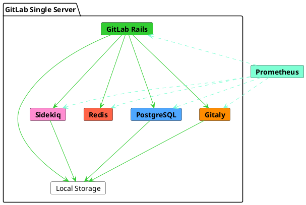



- プラン: Free、Premium、Ultimate
- 提供形態: GitLab Self-Managed



このリファレンスアーキテクチャは、1秒あたり20リクエスト（RPS）のピーク負荷をターゲットにしています。実際のデータに基づくと、この負荷は通常、手動と自動両方のインタラクションを含む最大1,000ユーザーに対応します。

リファレンスアーキテクチャの完全なリストについては、[利用可能なリファレンスアーキテクチャ](_index.md#available-reference-architectures)を参照してください。

- **目標負荷**: API: 20 RPS、Web: 2 RPS、Git（プル）: 2 RPS、Git（プッシュ）: 1 RPS
- **高可用性**: いいえ。高可用性環境については、変更された[3Kリファレンスアーキテクチャ](3k_users.md#supported-modifications-for-lower-user-counts-ha)に従ってください。
- **クラウドネイティブハイブリッド**: いいえ。クラウドネイティブハイブリッド環境の場合は、[変更されたハイブリッドリファレンスアーキテクチャ](#cloud-native-hybrid-reference-architecture-with-helm-charts)に従うことができます。
- **どのリファレンスアーキテクチャを使用すればよいかわからない場合:** 詳細については、[どのアーキテクチャで始めるかを決定する](_index.md#deciding-which-architecture-to-start-with)を参照してください。

| ユーザー        | 設定        | GCPの例1 | AWSの例1 | Azureの例1 |
|--------------|----------------------|----------------|--------------|----------|
| 最大1,000または20 RPS | 8 vCPU、16 GBメモリ | `n1-standard-8`2 | `c5.2xlarge` | `F8s v2` |

**脚注**:

<!-- Disable ordered list rule https://github.com/DavidAnson/markdownlint/blob/main/doc/Rules.md#md029---ordered-list-item-prefix -->
<!-- markdownlint-disable MD029 -->
1. マシンタイプの例は、説明目的で提供されています。これらのタイプは、[検証とテスト](_index.md#validation-and-test-results)で使用されていますが、推奨されるデフォルトとして意図されたものではありません。リストされている要件を満たす他のマシンタイプへの切り替え（利用可能な場合はARMバリアントを含む）がサポートされています。詳細については、[サポートされているマシンタイプ](_index.md#supported-machine-types)を参照してください。
2. GCPの場合、8 vCPUおよび16 GBのRAMの推奨要件に一致する、もっとも近い同等の標準マシンタイプが選択されています。必要に応じて、[カスタムマシンタイプ](https://cloud.google.com/compute/docs/instances/creating-instance-with-custom-machine-type)も使用できます。
<!-- markdownlint-enable MD029 -->

次の図では、GitLabを1台のサーバーにインストールしているものの、内部では複数のサービスで構成されていることを示しています。インスタンスがスケールすると、これらのサービスは分離され、特定の要求に応じて個別にスケールされます。

場合によっては、一部のサービスにPaaSを利用できます。たとえば、一部のファイルシステムにCloudオブジェクトストレージを使用できます。冗長性を確保するため、一部のサービスはノードのクラスターとして構成され、同じデータを保存します。

水平にスケールされたGitLab設定では、クラスターの調整やリソースの検出のために、さまざまな補助サービスが必要です。たとえば、PostgreSQL接続管理用のPgBouncerや、Prometheusエンドポイント検出用のConsulなどです。

## 要件 {#requirements}

続行する前に、リファレンスアーキテクチャの[要件](_index.md#requirements)を確認してください。



**ノードの仕様は、正常に稼働する環境での利用パターンとリポジトリサイズの上位パーセンタイルに基づいています**。**ただし、（数ギガバイトを超える）[大規模なモノレポ](_index.md#large-monorepos)または[追加のワークロード](_index.md#additional-workloads)がある場合、環境のパフォーマンスに大きな影響を与える可能性があります。**これが当てはまる場合は、[さらに調整が必要になる場合があります](_index.md#scaling-an-environment)。リンク先のドキュメントを参照し、必要に応じてお問い合わせください。



## テスト手法 {#testing-methodology}

20 RPS/1,000ユーザーのリファレンスアーキテクチャは、もっとも一般的なワークフローに対応するように設計されています。GitLabは、次のエンドポイントスループットの目標に対して、定期的にスモークテストとパフォーマンステストを実施しています。

| エンドポイントの種類 | 目標スループット |
| ------------- | ----------------- |
| API           | 20 RPS            |
| Web           | 2 RPS             |
| Git（プル）    | 2 RPS             |
| Git（プッシュ）    | 1 RPS             |

これらの目標は、CIパイプラインやその他のワークロードを含む、指定されたユーザー数に対する環境負荷の合計を反映した、実際の顧客データに基づいています。

テスト手法の詳細については、[検証とテストの結果](_index.md#validation-and-test-results)セクションを参照してください。

### パフォーマンスに関する考慮事項 {#performance-considerations}

環境に次の要素がある場合、追加の調整が必要になるかもしれません。

- リスト上の目標よりも一貫して高いスループット
- [大規模なモノレポ](_index.md#large-monorepos)
- 大幅な[追加のワークロード](_index.md#additional-workloads)

これらの場合は、詳細について[環境をスケーリングする](_index.md#scaling-an-environment)を参照してください。これらの考慮事項がお客様にあてはまると思われる場合は、必要に応じて追加のガイダンスについてお問い合わせください。

## セットアップ手順 {#setup-instructions}

このデフォルトのリファレンスアーキテクチャにGitLabをインストールするには、標準の[インストール手順](../../install/_index.md)を使用してください。

オプションで、[外部PostgreSQLサービス](../postgresql/external.md)または[外部オブジェクトストレージサービス](../object_storage.md)を使用するようにGitLabを設定することもできます。パフォーマンスと信頼性が向上しますが、複雑さが増します。

## 高度な検索を設定する {#configure-advanced-search}



- プラン: Premium、Ultimate
- 提供形態: GitLab Self-Managed



Elasticsearchを活用し、[高度な検索を有効にする](../../integration/advanced_search/elasticsearch.md)ことで、GitLabインスタンス全体でより高速で高度なコード検索を実現できます。

Elasticsearchクラスターの設計と要件は、データによって異なります。Elasticsearchクラスターをインスタンスとともにセットアップする方法に関するベストプラクティスについては、[最適なクラスター設定を選択する](../../integration/advanced_search/elasticsearch.md#guidance-on-choosing-optimal-cluster-configuration)を参照してください。

## Helm Chartを使用したクラウドネイティブハイブリッドリファレンスアーキテクチャ {#cloud-native-hybrid-reference-architecture-with-helm-charts}

クラウドネイティブハイブリッドリファレンスアーキテクチャのセットアップでは、選択したステートレスコンポーネントは、公式の[Helm Chart](https://docs.gitlab.com/charts/)を使用してKubernetesにデプロイされます。ステートフルコンポーネントは、Linuxパッケージを使用してコンピューティング仮想マシンにデプロイされます。

Kubernetesで使用できる最小のリファレンスアーキテクチャは、[2,000または40 RPS GitLabクラウドネイティブハイブリッド](2k_users.md#cloud-native-hybrid-reference-architecture-with-helm-charts-alternative)（非HA）と[3,000または60 RPS GitLabクラウドネイティブハイブリッド](3k_users.md#cloud-native-hybrid-reference-architecture-with-helm-charts-alternative)（HA）です。

ユーザー数またはRPSが少ない環境の場合は、ノードの仕様を下げることができます。ユーザー数に応じて、提案されたすべてのノード仕様を必要に応じて下げることができます。ただし、[一般要件](../../install/requirements.md)を下回ることは避けてください。

## 次のステップ {#next-steps}

これで、コア機能が設定された新しいGitLab環境ができました。要件に応じて、オプションのGitLab機能をさらに設定することもできます。詳細については、[GitLabのインストール後の手順](../../install/next_steps.md)を参照してください。



環境と要件に応じて、追加機能のセットアップに追加のハードウェア要件または調整が必要になる場合があります。詳細については、個々のページを参照してください。


