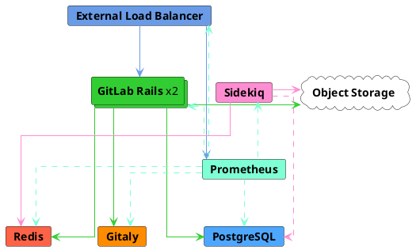
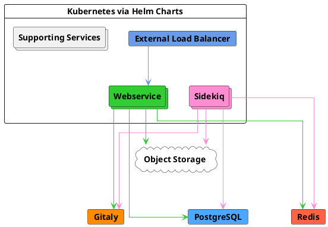



- プラン: Free、Premium、Ultimate
- 提供形態: GitLab Self-Managed



このページでは、実際のデータに基づいて、手動および自動で最大2,000ユーザーの一般的なピーク負荷である、40 RPS（1秒あたりのリクエスト数）のピーク負荷をターゲットとするように設計されたGitLabリファレンスアーキテクチャについて説明します。

リファレンスアーキテクチャの完全なリストについては、[利用可能なリファレンスアーキテクチャ](_index.md#available-reference-architectures)を参照してください。

- **目標負荷**: API: 40 RPS、Web: 4 RPS、Git（プル）: 4 RPS、Git（プッシュ）: 1 RPS
- **HA**: 不可。HA環境には、変更された[3,000または60 RPSのリファレンスアーキテクチャ](3k_users.md#supported-modifications-for-lower-user-counts-ha)を参照してください。
- **クラウドネイティブハイブリッド**: [可](#cloud-native-hybrid-reference-architecture-with-helm-charts-alternative)
- **どのリファレンスアーキテクチャを使用すればよいかわからない場合**: [詳細については、こちらのガイドをご覧ください](_index.md#deciding-which-architecture-to-start-with)。

| サービス                            | ノード | 設定          | GCPの例<sup>1</sup> | AWSの例<sup>1</sup> | Azureの例<sup>1</sup> |
|------------------------------------|-------|------------------------|-----------------|--------------|----------|
| 外部ロードバランサー<sup>4</sup> | 1     | 4 vCPU、3.6 GBメモリ  | `n1-highcpu-4`  | `c5n.xlarge` | `F4s v2` |
| PostgreSQL<sup>2</sup>             | 1     | 2 vCPU、7.5 GBメモリ  | `n1-standard-2` | `m5.large`   | `D2s v3` |
| Redis<sup>3</sup>                  | 1     | 1 vCPU、3.75 GBメモリ | `n1-standard-1` | `m5.large`   | `D2s v3` |
| Gitaly<sup>6</sup>                 | 1     | 4 vCPU、15 GBメモリ   | `n1-standard-4` | `m5.xlarge` | `D4s v3` |
| Sidekiq<sup>7</sup>                | 1     | 4 vCPU、15 GBメモリ   | `n1-standard-4` | `m5.xlarge`  | `D4s v3` |
| GitLab Rails<sup>7</sup>           | 2     | 8 vCPU、7.2 GBメモリ  | `n1-highcpu-8`  | `c5.2xlarge` | `F8s v2` |
| モニタリングノード                    | 1     | 2 vCPU、1.8 GBメモリ  | `n1-highcpu-2`  | `c5.large`   | `F2s v2` |
| オブジェクトストレージ<sup>5</sup>         | –     | –                      | –               | –            | –        |

**補足説明**:

<!-- Disable ordered list rule https://github.com/DavidAnson/markdownlint/blob/main/doc/Rules.md#md029---ordered-list-item-prefix -->
<!-- markdownlint-disable MD029 -->
1. マシンタイプの例は、説明目的で提供されています。これらのタイプは、[検証とテスト](_index.md#validation-and-test-results)で使用されていますが、推奨されるデフォルトとして意図されたものではありません。リストされている要件を満たす他のマシンタイプへの切り替え（利用可能な場合はARMバリアントを含む）がサポートされています。詳細については、[サポートされているマシンタイプ](_index.md#supported-machine-types)を参照してください。
2. 定評のあるサードパーティの外部PaaS PostgreSQLソリューションでオプションで実行できます。詳細については、[独自のPostgreSQLインスタンスを提供する](#provide-your-own-postgresql-instance)と[推奨クラウドプロバイダーとサービス](_index.md#recommended-cloud-providers-and-services)を参照してください。
3. 定評のあるサードパーティの外部PaaS Redisソリューションでオプションで実行できます。詳細については、[独自のRedisインスタンスを提供する](#provide-your-own-redis-instance)と[推奨クラウドプロバイダーとサービス](_index.md#recommended-cloud-providers-and-services)を参照してください。
4. 定評のあるサードパーティのロードバランサーまたはサービス（LB PaaS）で実行することをおすすめします。サイジングは、選択したロードバランサーと、ネットワーク帯域幅などの追加要因によって異なります。詳細については、[ロードバランサー](_index.md#load-balancers)を参照してください。
5. 定評のあるクラウドプロバイダーまたはSelf-Managedソリューションで実行する必要があります。詳細については、[オブジェクトストレージを設定する](#configure-the-object-storage)を参照してください。
6. Gitalyの仕様は、正常な状態の通常サイズのリポジトリの使用に基づいています。ただし、（数ギガバイトを超える）大規模なモノレポがある場合、GitとGitalyのパフォーマンスに**大幅に**影響を与えることがあり、仕様の引き上げが必要になる可能性があります。詳細については、[大規模なモノレポ](_index.md#large-monorepos)を参照してください。
7. コンポーネントは[ステートフルデータ](_index.md#autoscaling-of-stateful-nodes)を保存しないため、Auto Scaling Groups（ASG）に配置できます。ただし、[クラウドネイティブハイブリッドセットアップ](#cloud-native-hybrid-reference-architecture-with-helm-charts-alternative)が一般的に推奨されます。[移行](#gitlab-rails-post-configuration)や[Mailroom](../incoming_email.md)などの特定のコンポーネントは、1つのノードでしか実行できないためであり、これらのコンポーネントは、Kubernetesでより適切に処理されます。
<!-- markdownlint-enable MD029 -->



インスタンスの設定を伴うすべてのPaaSソリューションについては、必要に応じて復元性を高めるために、複数の可用性ゾーンにわたってデプロイすることをおすすめします。





## 要件 {#requirements}

続行する前に、リファレンスアーキテクチャの[要件](_index.md#requirements)を確認してください。

## テスト手法 {#testing-methodology}

40 RPS/2000ユーザーのリファレンスアーキテクチャは、最も一般的なワークフローに対応するように設計されています。GitLabは、次のエンドポイントスループットの目標に対して、定期的にスモークテストとパフォーマンステストを実施しています。

| エンドポイントの種類 | 目標スループット |
| ------------- | ----------------- |
| API           | 40 RPS            |
| Web           | 4 RPS             |
| Git（プル）    | 4 RPS             |
| Git（プッシュ）    | 1 RPS             |

これらの目標は、CIパイプラインやその他のワークロードを含む、指定されたユーザー数に対する環境負荷の合計を反映した、実際の顧客データに基づいています。

テスト手法の詳細については、[検証とテストの結果](_index.md#validation-and-test-results)セクションを参照してください。

### パフォーマンスに関する考慮事項 {#performance-considerations}

環境に次の要素がある場合、追加の調整が必要になる場合があります。

- リスト上の目標よりも一貫して高いスループット
- [大規模なモノレポ](_index.md#large-monorepos)
- 大幅に[追加されたワークロード](_index.md#additional-workloads)

これらの場合は、詳細について[環境のスケーリング](_index.md#scaling-an-environment)を参照してください。これらの考慮事項がお客様にあてはまると思われる場合は、必要に応じて追加のガイダンスについてお問い合わせください。

### ロードバランサーの設定 {#load-balancer-configuration}

当社のテスト環境では、以下を使用します。

- Linuxパッケージ環境用のHAProxy
- クラウドネイティブハイブリッド用のNGINX Ingressと同等のクラウドプロバイダー

## コンポーネントをセットアップする {#set-up-components}

GitLabとそのコンポーネントをセットアップして、最大40 RPSまたは2,000ユーザーに対応するには、次の手順に従います。

1. [外部ロードバランシングノードを設定](#configure-the-external-load-balancer)して、GitLabアプリケーションサービスノードのロードバランシングを処理します。
1. GitLabのデータベースである[PostgreSQLを設定](#configure-postgresql)します。
1. セッションデータ、一時キャッシュ情報、バックグラウンドジョブキューを保存する[Redisを設定](#configure-redis)します。
1. Gitリポジトリへのアクセスを提供する[Gitalyを設定](#configure-gitaly)します。
1. バックグラウンドジョブの処理のために[Sidekiqを設定](#configure-sidekiq)します。
1. Puma、Workhorse、GitLab Shellを実行し、すべてのフロントエンドリクエスト（UI、API、およびHTTP/SSH経由のGitを含む）を処理するように[メインのGitLab Railsアプリケーションを設定](#configure-gitlab-rails)します。
1. GitLab環境をモニタリングするために、[Prometheus](#configure-prometheus)を設定します。
1. 共有データオブジェクトに使用される[オブジェクトストレージを設定](#configure-the-object-storage)します。
1. GitLabインスタンス全体でより高速かつ高度なコード検索を行うために、[高度な検索を設定](#configure-advanced-search)します（オプション）。

## 外部ロードバランサーを設定する {#configure-the-external-load-balancer}

マルチノード設定のGitLabでは、外部ロードバランサーを使用して、トラフィックをアプリケーションサーバーにルーティングする必要があります。

どのロードバランサーを使用するか、またはその正確な設定の詳細はGitLabドキュメントのスコープ外ですが、一般的な要件に関する詳細については、[ロードバランサー](_index.md)を参照してください。このセクションでは、選択したロードバランサーに対して設定する内容の詳細について説明します。

### 準備完了チェック {#readiness-checks}

外部ロードバランサーが、組み込みのモニタリングエンドポイントを使用して、動作中のサービスにのみルーティングするようにします。すべての[準備完了チェック](../monitoring/health_check.md)には、チェックされるノードに対する[追加の設定](../monitoring/ip_allowlist.md)が必要です。そうしないと、外部ロードバランサーは接続できません。

### ポート {#ports}

使用する基本的なポートを以下の表に示します。

| LBポート | バックエンドポート | プロトコル                 |
| ------- | ------------ | ------------------------ |
| 80      | 80           | HTTP（*1*）               |
| 443     | 443          | TCPまたはHTTPS（*1*）（*2*） |
| 22      | 22           | TCP                      |

- （*1*）: [Web端末](../../ci/environments/_index.md#web-terminals-deprecated)のサポートでは、ロードバランサーがWebSocket接続を正しく処理する必要があります。HTTPまたはHTTPSプロキシを使用する場合、これは、`Connection`および`Upgrade`のホップバイホップヘッダーを通過するようにロードバランサーを設定する必要があることを意味します。詳細については、[Web端末](../integration/terminal.md)インテグレーションガイドを参照してください。
- （*2*）: ポート443にHTTPSプロトコルを使用する場合は、ロードバランサーにSSL証明書を追加する必要があります。代わりにGitLabアプリケーションサーバーでSSLを終了する場合は、TCPプロトコルを使用します。

カスタムドメインサポートでGitLab Pagesを使用している場合は、いくつかの追加ポート設定が必要になります。GitLabページには、個別の仮想IPアドレスが必要です。新しい仮想IPアドレスで、`/etc/gitlab/gitlab.rb`から`pages_external_url`を指すようにDNSを設定します。詳細については、[GitLab Pagesのドキュメント](../pages/_index.md)を参照してください。

| LBポート | バックエンドポート  | プロトコル  |
| ------- | ------------- | --------- |
| 80      | 変動（*1*）  | HTTP      |
| 443     | 変動（*1*）  | TCP（*2*） |

- （*1*）: GitLab Pagesのバックエンドポートは、`gitlab_pages['external_http']`および`gitlab_pages['external_https']`の設定によって異なります。詳細については、[GitLab Pagesのドキュメント](../pages/_index.md)を参照してください。
- （*2*）: GitLab Pagesのポート443では、常にTCPプロトコルを使用する必要があります。ユーザーはカスタムSSLでカスタムドメインを設定できますが、SSLがロードバランサーで終了した場合、この設定は不可能です。

#### 代替SSHポート {#alternate-ssh-port}

一部の組織には、SSHポート22を開くことについてポリシーがあります。この場合、ユーザーがポート443でSSHを使用できるようにする代替SSHホスト名を設定すると役立つ場合があります。前述の他のGitLab HTTP設定と比較した場合、代替SSHホスト名には、新しい仮想IPアドレスが必要になります。

`altssh.gitlab.example.com`などの代替SSHホスト名のDNSを設定します。

| LBポート | バックエンドポート | プロトコル |
| ------- | ------------ | -------- |
| 443     | 22           | TCP      |

### SSL {#ssl}

次の課題は、ご使用の環境でSSLをどのように処理するかです。次のようないくつかの選択肢があります。

- [アプリケーションノードがSSLを終了する](#application-node-terminates-ssl)。
- [ロードバランサーがバックエンドSSLなしでSSLを終了](#load-balancer-terminates-ssl-without-backend-ssl)し、ロードバランサーとアプリケーションノード間の通信が安全ではなくなる。
- [ロードバランサーがバックエンドSSLでSSLを終了](#load-balancer-terminates-ssl-with-backend-ssl)し、ロードバランサーとアプリケーションノード間の通信が安全になる。

#### アプリケーションノードがSSLを終了する {#application-node-terminates-ssl}

ポート443での接続を、`HTTP(S)`プロトコルではなく、`TCP`として渡すようにロードバランサーを設定します。これにより、接続はアプリケーションノードのNGINXサービスにそのまま渡されます。NGINXはSSL証明書を受け取り、ポート443でリッスンします。

SSL証明書の管理とNGINXの設定の詳細については、[HTTPSのドキュメント](https://docs.gitlab.com/omnibus/settings/ssl/)を参照してください。

#### ロードバランサーがバックエンドSSLなしでSSLを終了する {#load-balancer-terminates-ssl-without-backend-ssl}

`TCP`ではなく、`HTTP(S)`プロトコルを使用するようにロードバランサーを設定します。ロードバランサーはSSL証明書の管理とSSLの終了処理を担当します。

ロードバランサーとGitLab間の通信が安全ではなくなるため、追加の設定が必要となります。詳細については、[プロキシSSLのドキュメント](https://docs.gitlab.com/omnibus/settings/ssl/#configure-a-reverse-proxy-or-load-balancer-ssl-termination)を参照してください。

#### ロードバランサーがバックエンドSSLでSSLを終了する {#load-balancer-terminates-ssl-with-backend-ssl}

「TCP」ではなく「HTTP(S)」プロトコルを使用するようにロードバランサーを設定します。ロードバランサーは、エンドユーザーに表示されるSSL証明書の管理を担当します。

このシナリオでは、ロードバランサーとNGINX間のトラフィックも安全になります。接続は常に安全であるため、プロキシSSLの設定を追加するという要件はありません。ただし、SSL証明書を設定するには、GitLabに設定を追加する必要があります。SSL証明書の管理とNGINXの設定の詳細については、[HTTPSのドキュメント](https://docs.gitlab.com/omnibus/settings/ssl/)を参照してください。

<div align="right">
  <a type="button" class="btn btn-default" href="#set-up-components"> コンポーネントのセットアップに戻る<i class="fa fa-angle-double-up" aria-hidden="true"></i> </a>
</div>

## PostgreSQLを設定する {#configure-postgresql}

このセクションでは、GitLabで使用できる外部PostgreSQLデータベースを設定する方法について説明します。

### 独自のPostgreSQLインスタンスを提供する {#provide-your-own-postgresql-instance}

オプションで、[PostgreSQL用のサードパーティの外部サービス](../postgresql/external.md)を使用できます。

そのためには、信頼できるプロバイダーまたはソリューションを使用する必要があります。[Google Cloud SQL](https://cloud.google.com/sql/docs/postgres/high-availability#normal)と[Amazon RDS](https://aws.amazon.com/rds/)は動作が確認されています。ただし、Amazon Auroraは、[14.4.0](https://archives.docs.gitlab.com/17.3/ee/update/versions/gitlab_14_changes/#1440)からデフォルトで有効になっているロードバランシングと**互換性がありません**。

詳細については、[推奨されるクラウドプロバイダーとサービス](_index.md#recommended-cloud-providers-and-services)を参照してください。

サードパーティの外部サービスを使用する場合:

1. HA LinuxパッケージPostgreSQLのセットアップには、PostgreSQL、PgBouncer、およびConsulが含まれます。サードパーティの外部サービスを使用する場合、これらのコンポーネントはすべて不要になります。
1. [データベース要件に関するドキュメント](../../install/requirements.md#postgresql)に従ってPostgreSQLをセットアップします。
1. `gitlab`ユーザー名と任意のパスワードを設定します。`gitlab`ユーザーには、`gitlabhq_production`データベースを作成する権限が必要です。
1. 適切な詳細を使用してGitLabアプリケーションサーバーを設定します。この手順については、[GitLab Railsアプリケーションの設定](#configure-gitlab-rails)で説明します。

### Linuxパッケージを使用したスタンドアロンPostgreSQL {#standalone-postgresql-using-the-linux-package}

1. SSHでPostgreSQLサーバーに接続します。
1. 利用したいLinuxパッケージを[ダウンロードしてインストール](../../install/package/_index.md#supported-platforms)します。必ずGitLabパッケージリポジトリのみを追加し、選択したオペレーティングシステム用にGitLabをインストールしてください。
1. PostgreSQLのパスワードハッシュを生成します。これは、`gitlab`のデフォルトのユーザー名を使用することを前提としています（推奨）。コマンドは、パスワードと確認を要求します。次の手順で、このコマンドによって出力された値を`POSTGRESQL_PASSWORD_HASH`の値として使用します。

   ```shell
   sudo gitlab-ctl pg-password-md5 gitlab
   ```

1. `/etc/gitlab/gitlab.rb`を編集し、以下の内容を追加して、プレースホルダーの値を適切に更新します。

   - `POSTGRESQL_PASSWORD_HASH` - 前の手順からの出力値
   - `APPLICATION_SERVER_IP_BLOCKS` - データベースに接続するGitLab RailsおよびSidekiqサーバーのIPサブネットまたはIPアドレス（スペース区切り）のリスト。例: `%w(123.123.123.123/32 123.123.123.234/32)`

   ```ruby
   # Disable all components except PostgreSQL related ones
   roles(['postgres_role'])

   # Set the network addresses that the exporters used for monitoring will listen on
   node_exporter['listen_address'] = '0.0.0.0:9100'
   postgres_exporter['listen_address'] = '0.0.0.0:9187'
   postgres_exporter['dbname'] = 'gitlabhq_production'
   postgres_exporter['password'] = 'POSTGRESQL_PASSWORD_HASH'

   # Set the PostgreSQL address and port
   postgresql['listen_address'] = '0.0.0.0'
   postgresql['port'] = 5432

   # Replace POSTGRESQL_PASSWORD_HASH with a generated md5 value
   postgresql['sql_user_password'] = 'POSTGRESQL_PASSWORD_HASH'

   # Replace APPLICATION_SERVER_IP_BLOCK with the CIDR address of the application node
   postgresql['trust_auth_cidr_addresses'] = %w(127.0.0.1/32 APPLICATION_SERVER_IP_BLOCK)

   # Prevent database migrations from running on upgrade automatically
   gitlab_rails['auto_migrate'] = false
   ```

1. 最初に設定したLinuxパッケージノードから`/etc/gitlab/gitlab-secrets.json`ファイルをコピーして、このサーバーに追加するか、サーバー上の同じ名前のファイルを置換します。これが設定する最初のLinuxパッケージである場合は、この手順を省略できます。

1. 変更を有効にするには、[GitLabを再設定します](../restart_gitlab.md#reconfigure-a-linux-package-installation)。
1. PostgreSQLノードのIPアドレスまたはホスト名、ポート、およびプレーンテキストパスワードをメモしておきます。これらの詳細は、後で[GitLabアプリケーションサーバー](#configure-gitlab-rails)を設定する際に必要になります。

高度な[設定オプション](https://docs.gitlab.com/omnibus/settings/database.html)がサポートされており、必要に応じて追加できます。

<div align="right">
  <a type="button" class="btn btn-default" href="#set-up-components"> コンポーネントのセットアップに戻る<i class="fa fa-angle-double-up" aria-hidden="true"></i> </a>
</div>

## Redisを設定する {#configure-redis}

このセクションでは、GitLabで使用できる外部Redisインスタンスの設定について説明します。



Redisは主にシングルスレッドであり、CPUコアを増やしても大きなメリットは得られません。詳細については、[スケーリングに関するドキュメント](_index.md#scaling-an-environment)を参照してください。



### 独自のRedisインスタンスを提供する {#provide-your-own-redis-instance}

オプションで、次のガイダンスに従って、[サードパーティの外部サービスをRedisインスタンス](../redis/replication_and_failover_external.md#redis-as-a-managed-service-in-a-cloud-provider)に使用できます。

- そのためには、信頼できるプロバイダーまたはソリューションを使用する必要があります。[Google Memorystore](https://cloud.google.com/memorystore/docs/redis/memorystore-for-redis-overview)と[AWS ElastiCache](https://docs.aws.amazon.com/AmazonElastiCache/latest/red-ug/WhatIs.html)は動作が確認されています。
- Redisクラスターモードは特にサポートされていませんが、HAのRedisスタンドアロンはサポートされています。
- セットアップに従って、[Redis削除モード](../redis/replication_and_failover_external.md#setting-the-eviction-policy)を設定する必要があります。

詳細については、[推奨されるクラウドプロバイダーとサービス](_index.md#recommended-cloud-providers-and-services)を参照してください。

### Linuxパッケージを使用したスタンドアロンRedis {#standalone-redis-using-the-linux-package}

Linuxパッケージを使用して、スタンドアロンRedisサーバーを設定できます。LinuxパッケージでRedisサーバーを設定するには、以下の手順が最低限必要です。

1. SSHでRedisサーバーに接続します。
1. 利用したいLinuxパッケージを[ダウンロードしてインストール](../../install/package/_index.md#supported-platforms)します。必ずGitLabパッケージリポジトリのみを追加し、選択したオペレーティングシステム用にGitLabをインストールしてください。
1. `/etc/gitlab/gitlab.rb`を編集し、次の内容を追加します。

   ```ruby
   ## Enable Redis
   roles(["redis_master_role"])

   redis['bind'] = '0.0.0.0'
   redis['port'] = 6379
   redis['password'] = 'SECRET_PASSWORD_HERE'

   # Set the network addresses that the exporters used for monitoring will listen on
   node_exporter['listen_address'] = '0.0.0.0:9100'
   redis_exporter['listen_address'] = '0.0.0.0:9121'
   redis_exporter['flags'] = {
         'redis.addr' => 'redis://0.0.0.0:6379',
         'redis.password' => 'SECRET_PASSWORD_HERE',
   }

   # Prevent database migrations from running on upgrade automatically
   gitlab_rails['auto_migrate'] = false
   ```

1. 最初に設定したLinuxパッケージノードから`/etc/gitlab/gitlab-secrets.json`ファイルをコピーして、このサーバーに追加するか、サーバー上の同じ名前のファイルを置換します。これが最初に設定するLinuxパッケージノードである場合は、この手順を省略できます。

1. 変更を有効にするには、[GitLabを再設定します](../restart_gitlab.md#reconfigure-a-linux-package-installation)。

1. RedisノードのIPアドレスまたはホスト名、ポート、およびRedisパスワードをメモしておきます。これらは、後で[GitLabアプリケーションサーバーを設定する](#configure-gitlab-rails)際に必要になります。

高度な[設定オプション](https://docs.gitlab.com/omnibus/settings/redis.html)がサポートされており、必要に応じて追加できます。

<div align="right">
  <a type="button" class="btn btn-default" href="#set-up-components"> コンポーネントのセットアップに戻る<i class="fa fa-angle-double-up" aria-hidden="true"></i> </a>
</div>

## Gitalyを設定する {#configure-gitaly}

[Gitaly](../gitaly/_index.md)サーバーノードの要件は、データサイズ、特にプロジェクト数とそれらのプロジェクトのサイズによって異なります。



**Gitalyの仕様は、正常に稼働する環境での利用パターンとリポジトリサイズの上位パーセンタイルに基づいています**。**ただし、（数ギガバイトを超える）[大規模なモノレポ](_index.md#large-monorepos)または[追加のワークロード](_index.md#additional-workloads)がある場合、これらは環境のパフォーマンスに大きく影響することがあり、さらなる調整が必要になる場合があります**。これがあてはまると思われる場合は、必要に応じて追加のガイダンスについてお問い合わせください。



Gitalyには、Gitalyストレージに関する特定の[ディスク要件](../gitaly/_index.md#disk-requirements)があります。

次の項目に注意してください。

- GitLab Railsアプリケーションは、リポジトリを[リポジトリストレージパス](../repository_storage_paths.md)にシャードします。
- Gitalyサーバーは、1つ以上のストレージパスをホストできます。
- GitLabサーバーは、1つ以上のGitalyサーバーノードを使用できます。
- Gitalyアドレスは、すべてのGitalyクライアントで正しく解決できるように指定する必要があります。
- Gitalyのネットワークトラフィックはデフォルトで暗号化されていないため、Gitalyサーバーをパブリックインターネットに公開しないでください。ファイアウォールを使用してGitalyサーバーへのアクセスを制限することを強くおすすめします。別のオプションは、[TLSを使用する](#gitaly-tls-support)ことです。



Gitalyドキュメント全体で参照されているトークンは、管理者が選択した任意のパスワードです。このトークンは、GitLab APIまたはその他の同様のWeb APIトークン用に作成されたトークンとは関係ありません。



次の手順では、シークレットトークン`gitalysecret`を持つ`gitaly1.internal`という名前の単一のGitalyサーバーを設定する方法について説明します。GitLabインストールには、`default`と`storage1`の2つのリポジトリストレージがあると想定しています。

Gitalyサーバーを設定するには、Gitalyに使用するサーバーノードで、次の手順を実行します。

1. 利用したいLinuxパッケージを[ダウンロードしてインストール](../../install/package/_index.md#supported-platforms)します。必ずGitLabパッケージリポジトリのみを追加し、選択したオペレーティングシステム用にGitLabをインストールしてください。ただし、`EXTERNAL_URL`値は**指定しないでください**。
1. Gitalyサーバーノードの`/etc/gitlab/gitlab.rb`ファイルを編集して、ストレージパスを設定し、ネットワークリスナーを有効にして、トークンを設定します。

   

   [GitLabで必要になる](../gitaly/configure_gitaly.md#gitlab-requires-a-default-repository-storage)ため、`gitaly['configuration'][:storage]`から`default`エントリを削除することはできません。

   

   <!--
   Updates to example must be made at:
   - https://gitlab.com/gitlab-org/charts/gitlab/blob/master/doc/advanced/external-gitaly/external-omnibus-gitaly.md#configure-omnibus-gitlab
   - https://gitlab.com/gitlab-org/gitlab/blob/master/doc/administration/gitaly/index.md#gitaly-server-configuration
   - all reference architecture pages
   -->

   ```ruby
   # https://docs.gitlab.com/omnibus/roles/#gitaly-roles
   roles(["gitaly_role"])

   # Prevent database migrations from running on upgrade automatically
   gitlab_rails['auto_migrate'] = false

   # Configure the gitlab-shell API callback URL. Without this, `git push` will
   # fail. This can be your 'front door' GitLab URL or an internal load
   # balancer.
   gitlab_rails['internal_api_url'] = 'https://gitlab.example.com'

   # Set the network addresses that the exporters used for monitoring will listen on
   node_exporter['listen_address'] = '0.0.0.0:9100'

   gitaly['configuration'] = {
      # ...
      #
      # Make Gitaly accept connections on all network interfaces. You must use
      # firewalls to restrict access to this address/port.
      # Comment out following line if you only want to support TLS connections
      listen_addr: '0.0.0.0:8075',
      prometheus_listen_addr: '0.0.0.0:9236',
      # Gitaly Auth Token
      # Should be the same as praefect_internal_token
      auth: {
         # ...
         #
         # Gitaly's authentication token is used to authenticate gRPC requests to Gitaly. This must match
         # the respective value in GitLab Rails application setup.
         token: 'gitalysecret',
      },
      # Gitaly Pack-objects cache
      # Recommended to be enabled for improved performance but can notably increase disk I/O
      # Refer to https://docs.gitlab.com/ee/administration/gitaly/configure_gitaly.html#pack-objects-cache for more info
      pack_objects_cache: {
         # ...
         enabled: true,
      },
      storage: [
         {
            name: 'default',
            path: '/var/opt/gitlab/git-data',
         },
         {
            name: 'storage1',
            path: '/mnt/gitlab/git-data',
         },
      ],
   }
   ```

1. 最初に設定したLinuxパッケージノードから`/etc/gitlab/gitlab-secrets.json`ファイルをコピーして、このサーバーに追加するか、サーバー上の同じ名前のファイルを置換します。これが最初に設定するLinuxパッケージノードである場合は、この手順を省略できます。

1. 変更を有効にするには、[GitLabを再設定します](../restart_gitlab.md#reconfigure-a-linux-package-installation)。

1. Gitalyが内部APIにコールバックを実行できることを確認します。
   - GitLab 15.3以降の場合は、`sudo -u git -- /opt/gitlab/embedded/bin/gitaly check /var/opt/gitlab/gitaly/config.toml`を実行します。
   - GitLab 15.2以前の場合は、`sudo -u git -- /opt/gitlab/embedded/bin/gitaly-hooks check /var/opt/gitlab/gitaly/config.toml`を実行します。

### Gitaly TLSのサポート {#gitaly-tls-support}

GitalyはTLS暗号化をサポートしています。セキュアな接続をリッスンするGitalyインスタンスと通信するには、GitLab設定で、対応するストレージエントリの`gitaly_address`で`tls://` URLスキームを使用する必要があります。

これは自動的には提供されないため、独自の証明書を用意する必要があります。証明書、またはその認証局は、[GitLabカスタム証明書の設定](https://docs.gitlab.com/omnibus/settings/ssl/#install-custom-public-certificates)で説明されている手順に従って、すべてのGitalyノード（証明書を使用するGitalyノードを含む）と、それと通信するすべてのクライアントノードにインストールする必要があります。



自己署名証明書は、Gitalyサーバーへのアクセスに使用するアドレスを指定する必要があります。ホスト名でGitalyサーバーのアドレスを指定する場合は、サブジェクトの別名として追加します。IPアドレスでGitalyサーバーのアドレスを指定する場合は、証明書にサブジェクトの別名として追加する必要があります。



Gitalyサーバーは、暗号化されていないリスニングアドレス（`listen_addr`）と暗号化されたリスニングアドレス（`tls_listen_addr`）の両方で同時に設定できます。これにより、必要に応じて、暗号化されていないトラフィックから暗号化されたトラフィックへの段階的な移行を行うことができます。

TLSを使用してGitalyを設定するには、次の手順に従います。

1. `/etc/gitlab/ssl`ディレクトリを作成し、キーと証明書をそこにコピーします。

   ```shell
   sudo mkdir -p /etc/gitlab/ssl
   sudo chmod 755 /etc/gitlab/ssl
   sudo cp key.pem cert.pem /etc/gitlab/ssl/
   sudo chmod 644 key.pem cert.pem
   ```

1. Gitalyがそれ自体を呼び出すときに証明書を信頼するように、証明書を`/etc/gitlab/trusted-certs`にコピーします。

   ```shell
   sudo cp /etc/gitlab/ssl/cert.pem /etc/gitlab/trusted-certs/
   ```

1. `/etc/gitlab/gitlab.rb`を編集して、以下を追加します。

   <!-- Updates to following example must also be made at https://gitlab.com/gitlab-org/charts/gitlab/blob/master/doc/advanced/external-gitaly/external-omnibus-gitaly.md#configure-omnibus-gitlab -->

   ```ruby
   gitaly['configuration'] = {
      # ...
      tls_listen_addr: '0.0.0.0:9999',
      tls: {
         certificate_path: '/etc/gitlab/ssl/cert.pem',
         key_path: '/etc/gitlab/ssl/key.pem',
      },
   }
   ```

1. 暗号化された接続のみを許可するには、`gitaly['listen_addr']`を削除します。
1. ファイルを保存して[GitLabを再設定](../restart_gitlab.md#reconfigure-a-linux-package-installation)します。

<div align="right">
  <a type="button" class="btn btn-default" href="#set-up-components"> コンポーネントのセットアップに戻る<i class="fa fa-angle-double-up" aria-hidden="true"></i> </a>
</div>

## Sidekiqを設定する {#configure-sidekiq}

Sidekiqには、[Redis](#configure-redis)、[PostgreSQL](#configure-postgresql)、および[Gitaly](#configure-gitaly)インスタンスへの接続が必要です。また、推奨されているように、[オブジェクトストレージ](#configure-the-object-storage)への接続も必要です。



環境のSidekiqジョブの処理に時間がかかり、キューが長い場合は、それに応じてスケールできます。詳細については、[スケーリングに関するドキュメント](_index.md#scaling-an-environment)を参照してください。





コンテナレジストリ、SAML、LDAPなどの追加のGitLab機能を設定する場合は、Rails設定に加えて、Sidekiq設定も更新します。詳細については、[外部Sidekiqのドキュメント](../sidekiq/_index.md)を参照してください。

Sidekiqサーバーを設定するには、Sidekiqに使用するサーバーノードで、次の手順を実行します。

1. SidekiqサーバーにSSHで接続します。
1. PostgreSQL、Gitaly、およびRedisポートにアクセスできることを確認します。

   ```shell
   telnet <GitLab host> 5432 # PostgreSQL
   telnet <GitLab host> 8075 # Gitaly
   telnet <GitLab host> 6379 # Redis
   ```

1. 利用したいLinuxパッケージを[ダウンロードしてインストール](../../install/package/_index.md#supported-platforms)します。必ずGitLabパッケージリポジトリのみを追加し、選択したオペレーティングシステム用にGitLabをインストールしてください。
1. `/etc/gitlab/gitlab.rb`を作成または編集し、次の設定を使用します。

   ```ruby
   # https://docs.gitlab.com/omnibus/roles/#sidekiq-roles
   roles(["sidekiq_role"])

   # External URL
   external_url 'https://gitlab.example.com'

   ## Redis connection details
   gitlab_rails['redis_port'] = '6379'
   gitlab_rails['redis_host'] = '10.1.0.6' # IP/hostname of Redis server
   gitlab_rails['redis_password'] = 'Redis Password'

   # Gitaly and GitLab use two shared secrets for authentication, one to authenticate gRPC requests
   # to Gitaly, and a second stored in /etc/gitlab/gitlab-secrets.json for authentication callbacks from GitLab-Shell to the GitLab internal API.
   # The following must be the same as their respective values
   # of the Gitaly setup
   gitlab_rails['gitaly_token'] = 'gitalysecret'

   gitlab_rails['repositories_storages'] = {
     'default' => { 'gitaly_address' => 'tcp://gitaly1.internal:8075' },
     'storage1' => { 'gitaly_address' => 'tcp://gitaly1.internal:8075' },
     'storage2' => { 'gitaly_address' => 'tcp://gitaly2.internal:8075' },
   }

   ## PostgreSQL connection details
   gitlab_rails['db_adapter'] = 'postgresql'
   gitlab_rails['db_encoding'] = 'unicode'
   gitlab_rails['db_host'] = '10.1.0.5' # IP/hostname of database server
   gitlab_rails['db_password'] = 'DB password'

   ## Prevent database migrations from running on upgrade automatically
   gitlab_rails['auto_migrate'] = false

   # Sidekiq
   sidekiq['listen_address'] = "0.0.0.0"

   ## Set number of Sidekiq queue processes to the same number as available CPUs
   sidekiq['queue_groups'] = ['*'] * 4

   ## Set the network addresses that the exporters will listen on
   node_exporter['listen_address'] = '0.0.0.0:9100'

   # Object Storage
   ## This is an example for configuring Object Storage on GCP
   ## Replace this config with your chosen Object Storage provider as desired
   gitlab_rails['object_store']['enabled'] = true
   gitlab_rails['object_store']['connection'] = {
     'provider' => 'Google',
     'google_project' => '<gcp-project-name>',
     'google_json_key_location' => '<path-to-gcp-service-account-key>'
   }
   gitlab_rails['object_store']['objects']['artifacts']['bucket'] = "<gcp-artifacts-bucket-name>"
   gitlab_rails['object_store']['objects']['external_diffs']['bucket'] = "<gcp-external-diffs-bucket-name>"
   gitlab_rails['object_store']['objects']['lfs']['bucket'] = "<gcp-lfs-bucket-name>"
   gitlab_rails['object_store']['objects']['uploads']['bucket'] = "<gcp-uploads-bucket-name>"
   gitlab_rails['object_store']['objects']['packages']['bucket'] = "<gcp-packages-bucket-name>"
   gitlab_rails['object_store']['objects']['dependency_proxy']['bucket'] = "<gcp-dependency-proxy-bucket-name>"
   gitlab_rails['object_store']['objects']['terraform_state']['bucket'] = "<gcp-terraform-state-bucket-name>"

   gitlab_rails['backup_upload_connection'] = {
     'provider' => 'Google',
     'google_project' => '<gcp-project-name>',
     'google_json_key_location' => '<path-to-gcp-service-account-key>'
   }
   gitlab_rails['backup_upload_remote_directory'] = "<gcp-backups-state-bucket-name>"
   gitlab_rails['ci_secure_files_object_store_enabled'] = true
   gitlab_rails['ci_secure_files_object_store_remote_directory'] = "gcp-ci_secure_files-bucket-name"

   gitlab_rails['ci_secure_files_object_store_connection'] = {
      'provider' => 'Google',
      'google_project' => '<gcp-project-name>',
      'google_json_key_location' => '<path-to-gcp-service-account-key>'
   }
   ```

1. 最初に設定したLinuxパッケージノードから`/etc/gitlab/gitlab-secrets.json`ファイルをコピーして、このサーバーに追加するか、サーバー上の同じ名前のファイルを置換します。これが最初に設定するLinuxパッケージノードである場合は、この手順を省略できます。

1. データベースの移行が再設定中にのみ実行され、アップグレード時に自動的に実行されないようにするには、以下を実行します。

   ```shell
   sudo touch /etc/gitlab/skip-auto-reconfigure
   ```

   [GitLab Railsの設定後の手順](#gitlab-rails-post-configuration)セクションで詳しく説明されているように、単一の指定ノードのみが移行を処理する必要があります。

1. ファイルを保存して[GitLabを再設定](../restart_gitlab.md#reconfigure-a-linux-package-installation)します。

1. GitLabサービスが実行されていることを確認します。

   ```shell
   sudo gitlab-ctl status
   ```

   出力は次のようになります。

   ```plaintext
   run: logrotate: (pid 192292) 2990s; run: log: (pid 26374) 93048s
   run: node-exporter: (pid 26864) 92997s; run: log: (pid 26446) 93036s
   run: sidekiq: (pid 26870) 92996s; run: log: (pid 26391) 93042s
   ```

<div align="right">
  <a type="button" class="btn btn-default" href="#set-up-components"> コンポーネントのセットアップに戻る<i class="fa fa-angle-double-up" aria-hidden="true"></i> </a>
</div>

## GitLab Railsを設定する {#configure-gitlab-rails}

このセクションでは、GitLabアプリケーション（Rails）コンポーネントを設定する方法について説明します。

このアーキテクチャでは、各GitLab RailsノードをPuma Webサーバーを使用して実行し、ワーカーの数を利用可能なCPUの90％に設定し、スレッド数を4に設定します。他のコンポーネントとともにRailsを実行するノードの場合、ワーカーの値をそれに応じて減らす必要があります。ワーカーの値が50％でバランスが取れていることを確認しましたが、これはワークロードによって異なります。

各ノードで、次の手順を実行します。

1. 利用したいLinuxパッケージを[ダウンロードしてインストール](../../install/package/_index.md#supported-platforms)します。必ずGitLabパッケージリポジトリのみを追加し、選択したオペレーティングシステム用にGitLabをインストールしてください。
1. `/etc/gitlab/gitlab.rb`を作成または編集し、以下の設定を使用します。ノード間のリンクの一貫性を維持するため、アプリケーションサーバーの`external_url`は、ユーザーがGitLabへのアクセスに使用する外部URLを指す必要があります。これは、GitLabアプリケーションサーバーへのトラフィックをルーティングする[ロードバランサー](#configure-the-external-load-balancer)のURLになります。

   ```ruby
   external_url 'https://gitlab.example.com'

   # Gitaly and GitLab use two shared secrets for authentication, one to authenticate gRPC requests
   # to Gitaly, and a second stored in /etc/gitlab/gitlab-secrets.json for authentication callbacks from GitLab-Shell to the GitLab internal API.
   # The following must be the same as their respective values
   # of the Gitaly setup
   gitlab_rails['gitaly_token'] = 'gitalysecret'

   gitlab_rails['repositories_storages'] = {
     'default' => { 'gitaly_address' => 'tcp://gitaly1.internal:8075' },
     'storage1' => { 'gitaly_address' => 'tcp://gitaly1.internal:8075' },
     'storage2' => { 'gitaly_address' => 'tcp://gitaly2.internal:8075' },
   }

   ## Disable components that will not be on the GitLab application server
   roles(['application_role'])
   gitaly['enable'] = false
   sidekiq['enable'] = false

   ## PostgreSQL connection details
   gitlab_rails['db_adapter'] = 'postgresql'
   gitlab_rails['db_encoding'] = 'unicode'
   gitlab_rails['db_host'] = '10.1.0.5' # IP/hostname of database server
   gitlab_rails['db_password'] = 'DB password'

   ## Redis connection details
   gitlab_rails['redis_port'] = '6379'
   gitlab_rails['redis_host'] = '10.1.0.6' # IP/hostname of Redis server
   gitlab_rails['redis_password'] = 'Redis Password'

   # Set the network addresses that the exporters used for monitoring will listen on
   node_exporter['listen_address'] = '0.0.0.0:9100'
   gitlab_workhorse['prometheus_listen_addr'] = '0.0.0.0:9229'
   puma['listen'] = '0.0.0.0'

   # Add the monitoring node's IP address to the monitoring whitelist and allow it to
   # scrape the NGINX metrics. Replace placeholder `monitoring.gitlab.example.com` with
   # the address and/or subnets gathered from the monitoring node
   gitlab_rails['monitoring_whitelist'] = ['<MONITOR NODE IP>/32', '127.0.0.0/8']
   nginx['status']['options']['allow'] = ['<MONITOR NODE IP>/32', '127.0.0.0/8']

   # Object Storage
   # This is an example for configuring Object Storage on GCP
   # Replace this config with your chosen Object Storage provider as desired
   gitlab_rails['object_store']['enabled'] = true
   gitlab_rails['object_store']['connection'] = {
     'provider' => 'Google',
     'google_project' => '<gcp-project-name>',
     'google_json_key_location' => '<path-to-gcp-service-account-key>'
   }
   gitlab_rails['object_store']['objects']['artifacts']['bucket'] = "<gcp-artifacts-bucket-name>"
   gitlab_rails['object_store']['objects']['external_diffs']['bucket'] = "<gcp-external-diffs-bucket-name>"
   gitlab_rails['object_store']['objects']['lfs']['bucket'] = "<gcp-lfs-bucket-name>"
   gitlab_rails['object_store']['objects']['uploads']['bucket'] = "<gcp-uploads-bucket-name>"
   gitlab_rails['object_store']['objects']['packages']['bucket'] = "<gcp-packages-bucket-name>"
   gitlab_rails['object_store']['objects']['dependency_proxy']['bucket'] = "<gcp-dependency-proxy-bucket-name>"
   gitlab_rails['object_store']['objects']['terraform_state']['bucket'] = "<gcp-terraform-state-bucket-name>"

   gitlab_rails['backup_upload_connection'] = {
     'provider' => 'Google',
     'google_project' => '<gcp-project-name>',
     'google_json_key_location' => '<path-to-gcp-service-account-key>'
   }
   gitlab_rails['backup_upload_remote_directory'] = "<gcp-backups-state-bucket-name>"

   gitlab_rails['ci_secure_files_object_store_enabled'] = true
   gitlab_rails['ci_secure_files_object_store_remote_directory'] = "gcp-ci_secure_files-bucket-name"

   gitlab_rails['ci_secure_files_object_store_connection'] = {
      'provider' => 'Google',
      'google_project' => '<gcp-project-name>',
      'google_json_key_location' => '<path-to-gcp-service-account-key>'
   }

   ## Uncomment and edit the following options if you have set up NFS
   ##
   ## Prevent GitLab from starting if NFS data mounts are not available
   ##
   #high_availability['mountpoint'] = '/var/opt/gitlab/git-data'
   ##
   ## Ensure UIDs and GIDs match between servers for permissions via NFS
   ##
   #user['uid'] = 9000
   #user['gid'] = 9000
   #web_server['uid'] = 9001
   #web_server['gid'] = 9001
   #registry['uid'] = 9002
   #registry['gid'] = 9002
   ```

1. [TLSサポートでGitaly](#gitaly-tls-support)を使用している場合は、`gitlab_rails['repositories_storages']`エントリが、`tcp`ではなく、`tls`で設定されていることを確認してください。

   ```ruby
   gitlab_rails['repositories_storages'] = {
     'default' => { 'gitaly_address' => 'tls://gitaly1.internal:9999' },
     'storage1' => { 'gitaly_address' => 'tls://gitaly1.internal:9999' },
     'storage2' => { 'gitaly_address' => 'tls://gitaly2.internal:9999' },
   }
   ```

   1. 証明書を`/etc/gitlab/trusted-certs`にコピーします。

      ```shell
      sudo cp cert.pem /etc/gitlab/trusted-certs/
      ```

1. 最初に設定したLinuxパッケージノードから`/etc/gitlab/gitlab-secrets.json`ファイルをコピーして、このサーバーに追加するか、サーバー上の同じ名前のファイルを置換します。これが最初に設定するLinuxパッケージノードである場合は、この手順を省略できます。
1. 最初に設定したRailsノードからSSHホストキー（すべて`/etc/ssh/ssh_host_*_key*`という名前形式）をコピーして、このサーバーに追加するか、サーバー上の同じ名前のファイルを置換します。これにより、ユーザーがロードバランシングされたRailsノードにアクセスしたときに、ホストの不一致エラーが発生しなくなります。これが最初に設定するLinuxパッケージノードである場合は、この手順をスキップできます。
1. データベースの移行が再設定中にのみ実行され、アップグレード時に自動的に実行されないようにするには、以下を実行します。

   ```shell
   sudo touch /etc/gitlab/skip-auto-reconfigure
   ```

   [GitLab Railsの設定後の手順](#gitlab-rails-post-configuration)セクションで詳しく説明されているように、単一の指定ノードのみが移行を処理する必要があります。

1. 変更を有効にするには、[GitLabを再設定します](../restart_gitlab.md#reconfigure-a-linux-package-installation)。
1. [増分ログの生成を有効にします](#enable-incremental-logging)。
1. `sudo gitlab-rake gitlab:gitaly:check`を実行して、ノードがGitalyに接続できることを確認します。

1. ログを追跡してリクエストを確認します。

   ```shell
   sudo gitlab-ctl tail gitaly
   ```

前の例のように、`external_url`で`https`を指定すると、GitLabは、SSL証明書が`/etc/gitlab/ssl/`にあることを期待します。証明書が存在しない場合、NGINXは起動しません。詳細については、[HTTPSドキュメント](https://docs.gitlab.com/omnibus/settings/ssl/)を参照してください。

### GitLab Railsの設定後の手順 {#gitlab-rails-post-configuration}

1. インストールおよび更新中にデータベースの移行を実行するために、1つのアプリケーションノードを指定します。GitLabデータベースを初期化し、すべての移行が実行されたことを確認します。

   ```shell
   sudo gitlab-rake gitlab:db:configure
   ```

   この操作を行うには、Railsノードがプライマリデータベースに直接接続するように設定し、[PgBouncerをバイパス](../postgresql/pgbouncer.md#procedure-for-bypassing-pgbouncer)する必要があります。移行が完了したら、PgBouncerを再度経由するようにノードを設定する必要があります。

1. [データベースで承認されたSSHキーの高速検索を設定します](../operations/fast_ssh_key_lookup.md)。

<div align="right">
  <a type="button" class="btn btn-default" href="#set-up-components"> コンポーネントのセットアップに戻る<i class="fa fa-angle-double-up" aria-hidden="true"></i> </a>
</div>

## Prometheusを設定する {#configure-prometheus}

Linuxパッケージを使用して、[Prometheus](../monitoring/prometheus/_index.md)を実行するスタンドアロンのモニタリングノードを設定できます。

1. モニタリングノードにSSHで接続します。
1. 利用したいLinuxパッケージを[ダウンロードしてインストール](../../install/package/_index.md#supported-platforms)します。必ずGitLabパッケージリポジトリのみを追加し、選択したオペレーティングシステム用にGitLabをインストールしてください。
1. `/etc/gitlab/gitlab.rb`を編集し、次の内容を追加します。

   ```ruby
   roles(['monitoring_role'])
   nginx['enable'] = false

   external_url 'http://gitlab.example.com'

   # Prometheus
   prometheus['listen_address'] = '0.0.0.0:9090'
   prometheus['monitor_kubernetes'] = false
   ```

1. Prometheusには、exporterを設定したさまざまなノードからすべてのデータをプルするためのスクレイプ設定も必要です。ノードのIPが以下であると仮定します。

   ```plaintext
   1.1.1.1: postgres
   1.1.1.2: redis
   1.1.1.3: gitaly1
   1.1.1.4: rails1
   1.1.1.5: rails2
   1.1.1.6: sidekiq
   ```

   次の内容を`/etc/gitlab/gitlab.rb`に追加します。

   ```ruby
   prometheus['scrape_configs'] = [
     {
        'job_name': 'postgres',
        'static_configs' => [
        'targets' => ['1.1.1.1:9187'],
        ],
     },
     {
        'job_name': 'redis',
        'static_configs' => [
        'targets' => ['1.1.1.2:9121'],
        ],
     },
     {
        'job_name': 'gitaly',
        'static_configs' => [
        'targets' => ['1.1.1.3:9236'],
        ],
     },
     {
        'job_name': 'gitlab-nginx',
        'static_configs' => [
        'targets' => ['1.1.1.4:8060', '1.1.1.5:8060'],
        ],
     },
     {
        'job_name': 'gitlab-workhorse',
        'static_configs' => [
        'targets' => ['1.1.1.4:9229', '1.1.1.5:9229'],
        ],
     },
     {
        'job_name': 'gitlab-rails',
        'metrics_path': '/-/metrics',
        'static_configs' => [
        'targets' => ['1.1.1.4:8080', '1.1.1.5:8080'],
        ],
     },
     {
        'job_name': 'gitlab-sidekiq',
        'static_configs' => [
        'targets' => ['1.1.1.6:8082'],
        ],
     },
     {
        'job_name': 'static-node',
        'static_configs' => [
        'targets' => ['1.1.1.1:9100', '1.1.1.2:9100', '1.1.1.3:9100', '1.1.1.4:9100', '1.1.1.5:9100', '1.1.1.6:9100'],
        ],
     },
   ]
   ```

1. ファイルを保存して[GitLabを再設定](../restart_gitlab.md#reconfigure-a-linux-package-installation)します。

<div align="right">
  <a type="button" class="btn btn-default" href="#set-up-components"> コンポーネントのセットアップに戻る<i class="fa fa-angle-double-up" aria-hidden="true"></i> </a>
</div>

## オブジェクトストレージを設定する {#configure-the-object-storage}

GitLabは、さまざまな種類のデータを保持するために、[オブジェクトストレージ](../object_storage.md)サービスの使用をサポートしています。オブジェクトストレージは、データオブジェクトに対しては[NFS](../nfs.md)よりも推奨され、通常、パフォーマンス、信頼性、スケーラビリティがはるかに高いため、一般的に大規模なセットアップに適しています。詳細については、[推奨されるクラウドプロバイダーとサービス](_index.md#recommended-cloud-providers-and-services)を参照してください。

GitLabでオブジェクトストレージの設定を指定する方法は2つあります。

- [統合された形式](../object_storage.md#configure-a-single-storage-connection-for-all-object-types-consolidated-form): サポートされているすべてのオブジェクトタイプで1つの認証情報が共有されます。
- [ストレージ固有の形式](../object_storage.md#configure-each-object-type-to-define-its-own-storage-connection-storage-specific-form): オブジェクトごとに、個別のオブジェクトストレージの[接続と設定](../object_storage.md#configure-the-connection-settings)を定義します。

可能な場合、次の例では統合された形式を使用します。

GitLabでは、データタイプごとに個別のバケットを使用するアプローチが推奨されます。これにより、GitLabが保存するさまざまなタイプのデータ間で競合が発生しなくなります。将来的には[単一のバケットの使用を有効にする](https://gitlab.com/gitlab-org/gitlab/-/issues/292958)計画があります。

<div align="right">
  <a type="button" class="btn btn-default" href="#set-up-components"> コンポーネントのセットアップに戻る<i class="fa fa-angle-double-up" aria-hidden="true"></i> </a>
</div>

### 増分ログの生成を有効にする {#enable-incremental-logging}

GitLab Runnerは、統合オブジェクトストレージを使用している場合でも、デフォルトでは、Linuxパッケージが`/var/opt/gitlab/gitlab-ci/builds`のディスクに一時的にキャッシュしたジョブログをチャンクで返します。デフォルトの設定では、このディレクトリは、GitLab RailsノードとSidekiqノード上のNFSを介して共有する必要があります。

NFS経由でジョブログを共有することはサポートされていますが、（NFSノードがデプロイされていない場合に必須となる）[増分ログの生成](../cicd/job_logs.md#incremental-logging)を有効にして、NFSを使用する要件を回避してください。増分ログの生成では、ジョブログの一時的なキャッシュのため、ディスク容量の代わりにRedisを使用します。

## 高度な検索を設定する {#configure-advanced-search}



- プラン: Premium、Ultimate
- 提供形態: GitLab Self-Managed



Elasticsearchを活用して、[高度な検索を有効にする](../../integration/advanced_search/elasticsearch.md)ことで、GitLabインスタンス全体でより高速かつ高度なコード検索を実現できます。

Elasticsearchクラスターの設計と要件は、特定のデータによって異なります。Elasticsearchクラスターをインスタンスとともにセットアップする方法に関して推奨されるベストプラクティスについては、[最適なクラスター設定を選択する](../../integration/advanced_search/elasticsearch.md#guidance-on-choosing-optimal-cluster-configuration)方法を参照してください。

<div align="right">
  <a type="button" class="btn btn-default" href="#set-up-components"> コンポーネントのセットアップに戻る<i class="fa fa-angle-double-up" aria-hidden="true"></i> </a>
</div>

## Helmチャートを使用したクラウドネイティブハイブリッドリファレンスアーキテクチャ（代替） {#cloud-native-hybrid-reference-architecture-with-helm-charts-alternative}

別の方法として、特定のGitLabコンポーネントをKubernetesで実行できます。次のサービスがサポートされています。

- GitLab Rails
- Sidekiq
- NGINX
- Toolbox
- Migrations
- Prometheus

ハイブリッドインストールは、クラウドネイティブと従来のコンピューティングデプロイの両方の利点を活用します。これにより、ステートレスコンポーネントはクラウドネイティブワークロード管理の利点を活用でき、ステートフルコンポーネントは、より永続性の高いLinuxパッケージインストールを備えたコンピューティング仮想マシンにデプロイされます。

Kubernetesとバックエンドコンポーネント間で同期するGitLabシークレットに関するガイダンスを含む、セットアップ手順については、Helmチャートの[高度な設定](https://docs.gitlab.com/charts/advanced/)ドキュメントを参照してください。



これは**高度な**設定です。Kubernetesでサービスを実行することは、複雑であることがよく知られています。Kubernetesに関する十分な実務知識と経験がある場合にのみ、**この設定が推奨**されます。このセクションの残りの部分では、このことを前提としています。





2,000のリファレンスアーキテクチャは、高可用性設定ではありません。HAを実現するには、変更された[3000または60 RPSリファレンスアーキテクチャ](3k_users.md#cloud-native-hybrid-reference-architecture-with-helm-charts-alternative)に従うことができます。



**Gitaly Cluster (Praefect)をKubernetes上で実行することはサポートされていません**。詳細については、[エピック6127](https://gitlab.com/groups/gitlab-org/-/epics/6127)を参照してください。



### クラスタートポロジー {#cluster-topology}

以下の表と図は、前述の通常の環境と同じ形式を使用して、ハイブリッド環境の詳細を示しています。

最初はKubernetesで実行されるコンポーネントです。これらはいくつかのノードグループにわたって実行されますが、最小CPUおよびメモリ要件が満たされている限り、必要に応じて全体的な構成を変更できます。

| コンポーネントノードグループ | ターゲットノードプールの合計 | GCPの例     | AWSの例  |
|----------------------|-------------------------|-----------------|--------------|
| Webservice           | 12 vCPU<br/>15 GBメモリ（リクエスト）<br/>21 GBメモリ（制限） | 3 x `n1-standard-8` | 3 x `c5.2xlarge` |
| Sidekiq              | 3.6 vCPU<br/>8 GBメモリ（リクエスト）<br/>16 GBメモリ（制限） | 2 x `n1-standard-4` | 2 x `m5.xlarge`  |
| サポートサービス  | 4 vCPU<br/>15 GBメモリ | 2 x `n1-standard-2` | 2 x `m5.large`   |

- このセットアップでは、定期的な[テスト](_index.md#validation-and-test-results)を行うほか、[Google Kubernetes Engine（GKE）](https://cloud.google.com/kubernetes-engine)および[Amazon Elastic Kubernetes Service（EKS）](https://aws.amazon.com/eks/)を推奨しています。他のKubernetesサービスも機能する可能性がありますが、結果は異なる場合があります。
- マシンタイプの例は、説明目的で提供されています。これらのタイプは、[検証とテスト](_index.md#validation-and-test-results)で使用されていますが、推奨されるデフォルトとして意図されたものではありません。リストされている要件を満たす他のマシンタイプへの切り替えがサポートされています。詳細については、[サポートされているマシンタイプ](_index.md#supported-machine-types)を参照してください。
- [Webservice](#webservice)および[Sidekiq](#sidekiq)のターゲットノードプールの合計は、GitLabコンポーネントに対してのみ提供されます。選択したKubernetesプロバイダーのシステムプロセスには、追加のリソースが必要です。例では、これを考慮に入れています。
- [サポート用](#supporting)ターゲットノードプールの合計は、通常、GitLabデプロイのサポートに必要ないくつかのリソースに加えて、要件に応じて実施する場合がある追加デプロイに対応するために提供されています。他のノードプールと同様に、選択したKubernetesプロバイダーのシステムプロセスにもリソースが必要です。例では、これを考慮に入れています。
- 本番環境デプロイでは、ポッドを特定のノードに割り当てる必要はありません。ただし、回復力のあるクラウドアーキテクチャプラクティスに従って、異なる可用性ゾーンに分散された各プールにいくつかのノードを配置することをおすすめします。
- 効率を高めるためCluster Autoscalerなどのオートスケールを有効にすることをおすすめしますが、継続的なパフォーマンスを確保するために、WebserviceおよびSidekiqポッドの下限を75％程度にすることが推奨されています。

次は、Linuxパッケージ（または該当する場合は外部PaaSサービス）を使用して、静的コンピューティング仮想マシンで実行するバックエンドコンポーネントです。

| サービス                     | ノード | 設定          | GCPの例<sup>1</sup> | AWSの例<sup>1</sup> |
|-----------------------------|-------|------------------------|-----------------|-------------|
| PostgreSQL<sup>2</sup>      | 1     | 2 vCPU、7.5 GBメモリ  | `n1-standard-2` | `m5.large`  |
| Redis<sup>3</sup>           | 1     | 1 vCPU、3.75 GBメモリ | `n1-standard-1` | `m5.large`  |
| Gitaly<sup>5</sup>          | 1     | 4 vCPU、15 GBメモリ   | `n1-standard-4` | `m5.xlarge` |
| オブジェクトストレージ<sup>4</sup>  | –     | –                      | –               | –           |

**補足説明**:

<!-- Disable ordered list rule https://github.com/DavidAnson/markdownlint/blob/main/doc/Rules.md#md029---ordered-list-item-prefix -->
<!-- markdownlint-disable MD029 -->
1. マシンタイプの例は、説明目的で提供されています。これらのタイプは、[検証とテスト](_index.md#validation-and-test-results)で使用されていますが、推奨されるデフォルトとして意図されたものではありません。リストされている要件を満たす他のマシンタイプへの切り替え（利用可能な場合はARMバリアントを含む）がサポートされています。詳細については、[サポートされているマシンタイプ](_index.md#supported-machine-types)を参照してください。
2. 定評のあるサードパーティの外部PaaS PostgreSQLソリューションでオプションで実行できます。詳細については、[独自のPostgreSQLインスタンスを提供する](#provide-your-own-postgresql-instance)と[推奨クラウドプロバイダーとサービス](_index.md#recommended-cloud-providers-and-services)を参照してください。
3. 定評のあるサードパーティの外部PaaS Redisソリューションでオプションで実行できます。詳細については、[独自のRedisインスタンスを提供する](#provide-your-own-redis-instance)と[推奨クラウドプロバイダーとサービス](_index.md#recommended-cloud-providers-and-services)を参照してください。
4. 定評のあるクラウドプロバイダーまたはSelf-Managedソリューションで実行する必要があります。詳細については、[オブジェクトストレージを設定する](#configure-the-object-storage)を参照してください。
5. Gitalyの仕様は、正常な状態の通常サイズのリポジトリの使用に基づいています。ただし、（数ギガバイトを超える）大規模なモノレポがある場合、GitとGitalyのパフォーマンスに**大幅に**影響を与えることがあり、仕様の引き上げが必要になる可能性があります。詳細については、[大規模なモノレポ](_index.md#large-monorepos)を参照してください。
<!-- markdownlint-enable MD029 -->



インスタンスの設定を含むすべてのPaaSソリューションについては、回復力のあるクラウドアーキテクチャプラクティスに合わせて、3つの異なる可用性ゾーンに最低3つのノードを実装することをおすすめします。





### Kubernetesコンポーネントのターゲット {#kubernetes-component-targets}

次のセクションでは、KubernetesにデプロイされたGitLabコンポーネントに使用されるターゲットについて詳しく説明します。

#### Webservice {#webservice}

各Webserviceポッド（PumaおよびWorkhorse）は、次の設定で実行することをおすすめします。

- 4 Pumaワーカー
- 4 vCPU
- 5 GBメモリ（リクエスト）
- 7 GBメモリ（制限）

40 RPSまたは2,000ユーザーの場合、合計Pumaワーカー数を約12にすることをおすすめしているので、少なくとも3つのWebserviceポッドを実行することを推奨します。

Webserviceリソースの使用状況の詳細については、[Webserviceリソース](https://docs.gitlab.com/charts/charts/gitlab/webservice/#resources)に関するチャートドキュメントを参照してください。

##### NGINX {#nginx}

NGINXコントローラーポッドをWebserviceノード全体にDaemonSetとしてデプロイすることも推奨されます。これにより、コントローラーはサービスを提供するWebserviceポッドとともに動的にスケールでき、大きなマシンタイプが通常備えている、より大きなネットワーク帯域幅を利用できます。

これは厳密な要件ではありません。Webトラフィックを処理するのに十分なリソースがある限り、NGINXコントローラーポッドは必要に応じてデプロイできます。

#### Sidekiq {#sidekiq}

各Sidekiqポッドは、次の設定で実行することをおすすめします。

- 1 Sidekiqワーカー
- 900m vCPU
- 2 GBメモリ（リクエスト）
- 4 GBメモリ（制限）

前述の標準デプロイと同様に、ここでは4つのSidekiqワーカーの初期ターゲットが使用されています。特定のワークフローによっては、追加のワーカーが必要になる場合があります。

Sidekiqリソースの使用状況について詳しくは、[Sidekiqリソース](https://docs.gitlab.com/charts/charts/gitlab/sidekiq/#resources)に関するチャートドキュメントをご覧ください。

### サポート用ノードプール {#supporting}

サポート用ノードプールは、WebserviceおよびSidekiqプールに配置する必要のない、すべてのサポートデプロイを格納するように設計されています。

これには、クラウドプロバイダーの実装に関連するさまざまなデプロイや、[GitLab Shell](https://docs.gitlab.com/charts/charts/gitlab/gitlab-shell/)などのGitLabサポート用デプロイが含まれます。

コンテナレジストリ、Pages、モニタリングなどを追加でデプロイする場合、可能であればこれらをサポート用ノードプールにデプロイし、WebserviceまたはSidekiqプールにはデプロイしないでください。サポート用ノードプールは、さまざまな追加のデプロイに対応するように設計されています。ただし、デプロイが指定されたプールに適合しない場合は、必要に応じてノードプールを増やすことができます。逆に、ユースケースのプールが過剰にプロビジョニングされている場合は、それに応じて減らすことができます。

### 設定ファイルの例 {#example-config-file}

上記の40 RPSまたは2,000ユーザーリファレンスアーキテクチャ設定のGitLab Helmチャートの例は、[チャートプロジェクト](https://gitlab.com/gitlab-org/charts/gitlab/-/blob/master/examples/ref/2k.yaml)にあります。

<div align="right">
  <a type="button" class="btn btn-default" href="#set-up-components"> コンポーネントのセットアップに戻る<i class="fa fa-angle-double-up" aria-hidden="true"></i> </a>
</div>

## 次の手順 {#next-steps}

このガイドに従うことで、コア機能が適切に設定された、新しいGitLab環境が用意されたはずです。

要件に応じて、GitLabの追加のオプション機能を設定することもできます。詳細については、[GitLabのインストール後の手順](../../install/next_steps.md)を参照してください。



環境と要件によっては、必要に応じて追加機能のセットアップに必要なハードウェア要件や調整が必要になる場合があります。詳細については、個別のページを参照してください。


