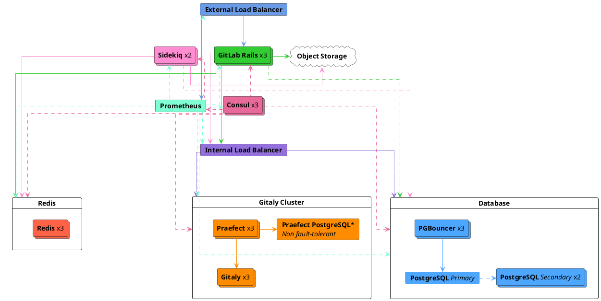
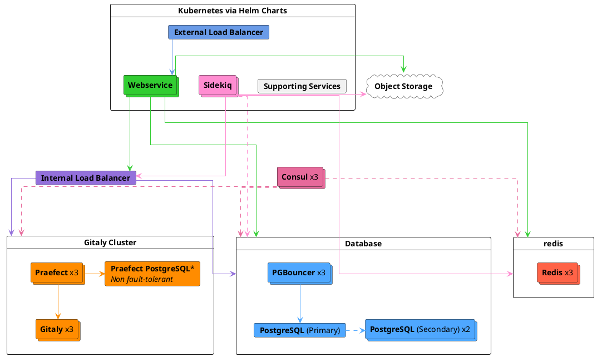



- プラン: Premium、Ultimate
- 提供形態: GitLab Self-Managed



このページでは、実際のデータに基づいて、手動および自動で最大3,000ユーザーの一般的なピーク負荷である、60 RPS（1秒あたりのリクエスト数）のピーク負荷をターゲットとするように設計されたGitLabリファレンスアーキテクチャについて説明します。

このアーキテクチャは、HAが組み込まれたアーキテクチャの中で最小のものです。HAが必要でもユーザー数または合計負荷が低い場合は、[少ないユーザー数でサポートされる変更](#supported-modifications-for-lower-user-counts-ha)セクションで、HAを維持しながらこのアーキテクチャのサイズを縮小する方法について詳しく説明します。

リファレンスアーキテクチャの完全なリストについては、[利用可能なリファレンスアーキテクチャ](_index.md#available-reference-architectures)を参照してください。

- **目標負荷**: API: 60 RPS、Web: 6 RPS、Git（プル）: 6 RPS、Git（プッシュ）: 1 RPS
- **HA**: 可、ただし、[Praefect](#configure-praefect-postgresql)にはサードパーティのPostgreSQLソリューションが必要です
- **クラウドネイティブハイブリッドの代替**: [可](#cloud-native-hybrid-reference-architecture-with-helm-charts-alternative)
- **どのリファレンスアーキテクチャを使用すればよいかわからない場合**: [詳細については、こちらのガイドをご覧ください](_index.md#deciding-which-architecture-to-start-with)。

| サービス                                   | ノード | 設定         | GCPの例<sup>1</sup> | AWSの例<sup>1</sup> | Azureの例<sup>1</sup> |
|-------------------------------------------|-------|-----------------------|-----------------|--------------|----------|
| 外部ロードバランサー<sup>4</sup>        | 1     | 4 vCPU、3.6 GBメモリ | `n1-highcpu-4`  | `c5n.xlarge` | `F4s v2` |
| Consul<sup>2</sup>                        | 3     | 2 vCPU、1.8 GBメモリ | `n1-highcpu-2`  | `c5.large`   | `F2s v2` |
| PostgreSQL<sup>2</sup>                    | 3     | 2 vCPU、7.5 GBメモリ | `n1-standard-2` | `m5.large`   | `D2s v3` |
| PgBouncer<sup>2</sup>                     | 3     | 2 vCPU、1.8 GBメモリ | `n1-highcpu-2`  | `c5.large`   | `F2s v2` |
| 内部ロードバランサー<sup>4</sup>        | 1     | 4 vCPU、3.6 GBメモリ | `n1-highcpu-4`  | `c5n.xlarge` | `F4s v2` |
| Redis/Sentinel<sup>3</sup>                | 3     | 2 vCPU、7.5 GBメモリ | `n1-standard-2` | `m5.large`   | `D2s v3` |
| Gitaly<sup>6</sup><sup>7</sup>            | 3     | 4 vCPU、15 GBメモリ  | `n1-standard-4` | `m5.xlarge`  | `D4s v3` |
| Praefect<sup>6</sup>                      | 3     | 2 vCPU、1.8 GBメモリ | `n1-highcpu-2`  | `c5.large`   | `F2s v2` |
| Praefect PostgreSQL<sup>2</sup>           | 1+    | 2 vCPU、1.8 GBメモリ | `n1-highcpu-2`  | `c5.large`   | `F2s v2` |
| Sidekiq<sup>8</sup>                       | 2     | 4 vCPU、15 GBメモリ  | `n1-standard-4` | `m5.xlarge`  | `D2s v3` |
| GitLab Rails<sup>8</sup>                  | 3     | 8 vCPU、7.2 GBメモリ | `n1-highcpu-8`  | `c5.2xlarge` | `F8s v2` |
| モニタリングノード                           | 1     | 2 vCPU、1.8 GBメモリ | `n1-highcpu-2`  | `c5.large`   | `F2s v2` |
| オブジェクトストレージ<sup>5</sup>                | –     | –                     | –               | –            | –        |

**補足説明**:

<!-- Disable ordered list rule https://github.com/DavidAnson/markdownlint/blob/main/doc/Rules.md#md029---ordered-list-item-prefix -->
<!-- markdownlint-disable MD029 -->
1. マシンタイプの例は、説明目的で提供されています。これらのタイプは、[検証とテスト](_index.md#validation-and-test-results)で使用されていますが、推奨されるデフォルトとして意図されたものではありません。リストされている要件を満たす他のマシンタイプへの切り替え（利用可能な場合はARMバリアントを含む）がサポートされています。詳細については、[サポートされているマシンタイプ](_index.md#supported-machine-types)を参照してください。
2. 定評のあるサードパーティの外部PaaS PostgreSQLソリューションでオプションで実行できます。詳細については、[独自のPostgreSQLインスタンスを提供する](#provide-your-own-postgresql-instance)を参照してください。
3. 定評のあるサードパーティの外部PaaS Redisソリューションでオプションで実行できます。詳細については、[独自のRedisインスタンスを提供する](#provide-your-own-redis-instance)を参照してください。
4. HA機能を提供できる定評のあるサードパーティのロードバランサーまたはサービス（LB PaaS）で実行することをおすすめします。サイジングは、選択したロードバランサーと、ネットワーク帯域幅などの追加要因によって異なります。詳細については、[ロードバランサー](_index.md#load-balancers)を参照してください。
5. 定評のあるクラウドプロバイダーまたはSelf-Managedソリューションで実行する必要があります。詳細については、[オブジェクトストレージを設定する](#configure-the-object-storage)を参照してください。
6. Gitalyクラスター（Praefect）は、耐障害性の利点を提供しますが、セットアップと管理がさらに複雑になります。[Gitalyクラスター（Praefect）をデプロイする前に、既存の技術的な制限事項と考慮事項](../gitaly/praefect/_index.md#before-deploying-gitaly-cluster-praefect)を確認してください。シャーディングされたGitalyが必要な場合は、上記の表にリストされている`Gitaly`と同じ仕様を使用してください。
7. Gitalyの仕様は、正常に稼働する環境での利用パターンとリポジトリサイズの上位パーセンタイルに基づいています。ただし、（数ギガバイトを超える）[大規模なモノレポ](_index.md#large-monorepos)または[追加のワークロード](_index.md#additional-workloads)がある場合、これらはGitおよびGitalyのパフォーマンスに大幅に影響を与えることがあり、さらなる調整が必要になる場合があります。
8. コンポーネントは[ステートフルデータ](_index.md#autoscaling-of-stateful-nodes)を保存しないため、Auto Scaling Groups（ASG）に配置できます。ただし、[クラウドネイティブハイブリッドセットアップ](#cloud-native-hybrid-reference-architecture-with-helm-charts-alternative)が一般的に推奨されます。[移行](#gitlab-rails-post-configuration)や[Mailroom](../incoming_email.md)などの特定のコンポーネントは、1つのノードでしか実行できないためであり、これらのコンポーネントは、Kubernetesでより適切に処理されます。
<!-- markdownlint-enable MD029 -->



インスタンスの設定を含むすべてのPaaSソリューションについては、回復力のあるクラウドアーキテクチャプラクティスに合わせて、3つの異なる可用性ゾーンに最低3つのノードを実装することをおすすめします。





## 要件 {#requirements}

続行する前に、リファレンスアーキテクチャの[要件](_index.md#requirements)を確認してください。

## テスト手法 {#testing-methodology}

60 RPS/3,000ユーザーのリファレンスアーキテクチャは、もっとも一般的なワークフローに対応するように設計されています。GitLabは、次のエンドポイントスループットの目標に対して、定期的にスモークテストとパフォーマンステストを実施しています。

| エンドポイントの種類 | 目標スループット |
| ------------- | ----------------- |
| API           | 60 RPS           |
| Web           | 6 RPS            |
| Git（プル）    | 6 RPS            |
| Git（プッシュ）    | 1 RPS             |

これらの目標は、CIパイプラインやその他のワークロードを含む、指定されたユーザー数に対する環境負荷の合計を反映した、実際の顧客データに基づいています。

テスト手法の詳細については、[検証とテストの結果](_index.md#validation-and-test-results)セクションを参照してください。

### パフォーマンスに関する考慮事項 {#performance-considerations}

環境に次の要素がある場合、追加の調整が必要になる場合があります。

- リスト上の目標よりも一貫して高いスループット
- [大規模なモノレポ](_index.md#large-monorepos)
- 大幅に[追加されたワークロード](_index.md#additional-workloads)

これらの場合は、詳細について[環境をスケールする](_index.md#scaling-an-environment)を参照してください。これらの考慮事項がお客様にあてはまると思われる場合は、必要に応じて追加のガイダンスについてお問い合わせください。

### ロードバランサーの設定 {#load-balancer-configuration}

当社のテスト環境では、以下を使用します。

- Linuxパッケージ環境用のHAProxy
- クラウドネイティブハイブリッド用のNGINX Ingressと同等のクラウドプロバイダー

## コンポーネントをセットアップする {#set-up-components}

GitLabとそのコンポーネントをセットアップして、最大60 RPSまたは3,000ユーザーに対応するには、次の手順に従います。

1. GitLabアプリケーションサービスノードのロードバランシングを処理するために、[外部ロードバランサーを設定](#configure-the-external-load-balancer)します。
1. GitLabアプリケーション内部接続のロードバランシングを処理するために、[内部ロードバランサーを設定](#configure-the-internal-load-balancer)します。
1. サービスディスカバリとヘルスチェックのために[Consulを設定](#configure-consul)します。
1. GitLabのデータベースである[PostgreSQLを設定](#configure-postgresql)します。
1. データベース接続プーリングと管理のために[PgBouncerを設定](#configure-pgbouncer)します。
1. セッションデータ、一時キャッシュ情報、バックグラウンドジョブキューを保存する[Redisを設定](#configure-redis)します。
1. Gitリポジトリへのアクセスを提供する[Gitalyクラスター（Praefec）を設定](#configure-gitaly-cluster-praefect)します。
1. バックグラウンドジョブの処理のために[Sidekiqを設定](#configure-sidekiq)します。
1. Puma、Workhorse、GitLab Shellを実行して、すべてのフロントエンドリクエスト（UI、API、およびHTTP/SSH経由のGitを含む）を処理するために、[メインのGitLab Railsアプリケーションを設定](#configure-gitlab-rails)します。
1. GitLab環境をモニタリングするために、[Prometheus](#configure-prometheus)を設定します。
1. 共有データオブジェクトに使用される[オブジェクトストレージを設定](#configure-the-object-storage)します。
1. GitLabインスタンス全体でより高速かつ高度なコード検索を行うために、[高度な検索を設定](#configure-advanced-search)します（オプション）。

サーバーは同じ10.6.0.0/24プライベートネットワーク範囲で起動し、これらのアドレスで自由に相互接続できます。

次のリストには、各サーバーとその割り当て済みIPの詳細が含まれています。

- `10.6.0.10`: 外部ロードバランサー
- `10.6.0.11`: Consul/Sentinel 1
- `10.6.0.12`: Consul/Sentinel 2
- `10.6.0.13`: Consul/Sentinel 3
- `10.6.0.21`: PostgreSQLプライマリ
- `10.6.0.22`: PostgreSQLセカンダリ1
- `10.6.0.23`: PostgreSQLセカンダリ2
- `10.6.0.31`: PgBouncer 1
- `10.6.0.32`: PgBouncer 2
- `10.6.0.33`: PgBouncer 3
- `10.6.0.20`: 内部ロードバランサー
- `10.6.0.61`: Redisプライマリ
- `10.6.0.62`: Redisレプリカ1
- `10.6.0.63`: Redisレプリカ2
- `10.6.0.51`: Gitaly 1
- `10.6.0.52`: Gitaly 2
- `10.6.0.93`: Gitaly 3
- `10.6.0.131`: Praefect 1
- `10.6.0.132`: Praefect 2
- `10.6.0.133`: Praefect 3
- `10.6.0.141`: Praefect PostgreSQL 1（非HA）
- `10.6.0.71`: Sidekiq 1
- `10.6.0.72`: Sidekiq 2
- `10.6.0.41`: GitLabアプリケーション1
- `10.6.0.42`: GitLabアプリケーション2
- `10.6.0.43`: GitLabアプリケーション3
- `10.6.0.81`: Prometheus

## 外部ロードバランサーを設定する {#configure-the-external-load-balancer}

マルチノード設定のGitLabでは、外部ロードバランサーを使用して、トラフィックをアプリケーションサーバーにルーティングする必要があります。

どのロードバランサーを使用するか、またはその正確な設定の詳細はGitLabドキュメントのスコープ外ですが、一般的な要件に関する詳細については、[ロードバランサー](_index.md)を参照してください。このセクションでは、選択したロードバランサーに対して設定する内容の詳細について説明します。

### 準備完了チェック {#readiness-checks}

外部ロードバランサーが、組み込みのモニタリングエンドポイントを使用して、動作中のサービスにのみルーティングするようにします。すべての[準備完了チェック](../monitoring/health_check.md)には、チェックされるノードに[追加の設定](../monitoring/ip_allowlist.md)が必要です。そうしないと、外部ロードバランサーは接続できません。

### ポート {#ports}

使用する基本的なポートを以下の表に示します。

| LBポート | バックエンドポート | プロトコル                 |
| ------- | ------------ | ------------------------ |
| 80      | 80           | HTTP（*1*）               |
| 443     | 443          | TCPまたはHTTPS（*1*）（*2*） |
| 22      | 22           | TCP                      |

- （*1*）: [Web端末](../../ci/environments/_index.md#web-terminals-deprecated)のサポートでは、ロードバランサーがWebSocket接続を正しく処理する必要があります。HTTPまたはHTTPSプロキシを使用する場合、これは、`Connection`および`Upgrade`のホップバイホップヘッダーを通過するようにロードバランサーを設定する必要があることを意味します。詳細については、[Web端末](../integration/terminal.md)インテグレーションガイドを参照してください。
- （*2*）: ポート443にHTTPSプロトコルを使用する場合は、ロードバランサーにSSL証明書を追加する必要があります。代わりにGitLabアプリケーションサーバーでSSLを終了する場合は、TCPプロトコルを使用します。

カスタムドメインサポートでGitLab Pagesを使用している場合は、いくつかの追加ポート設定が必要になります。GitLabページには、個別の仮想IPアドレスが必要です。新しい仮想IPアドレスで、`/etc/gitlab/gitlab.rb`から`pages_external_url`を指すようにDNSを設定します。詳細については、[GitLab Pagesのドキュメント](../pages/_index.md)を参照してください。

| LBポート | バックエンドポート  | プロトコル  |
| ------- | ------------- | --------- |
| 80      | 変動（*1*）  | HTTP      |
| 443     | 変動（*1*）  | TCP（*2*） |

- （*1*）: GitLab Pagesのバックエンドポートは、`gitlab_pages['external_http']`および`gitlab_pages['external_https']`の設定によって異なります。詳細については、[GitLab Pagesのドキュメント](../pages/_index.md)を参照してください。
- （*2*）: GitLab Pagesのポート443では、常にTCPプロトコルを使用する必要があります。ユーザーはカスタムSSLでカスタムドメインを設定できますが、SSLがロードバランサーで終了した場合、この設定は不可能です。

#### 代替SSHポート {#alternate-ssh-port}

一部の組織には、SSHポート22を開くことについてポリシーがあります。この場合、ユーザーがポート443でSSHを使用できるようにする代替SSHホスト名を設定すると役立つ場合があります。前述の他のGitLab HTTP設定と比較した場合、代替SSHホスト名には、新しい仮想IPアドレスが必要になります。

`altssh.gitlab.example.com`などの代替SSHホスト名のDNSを設定します。

| LBポート | バックエンドポート | プロトコル |
| ------- | ------------ | -------- |
| 443     | 22           | TCP      |

### SSL {#ssl}

次の課題は、ご使用の環境でSSLをどのように処理するかです。次のようないくつかの選択肢があります。

- [アプリケーションノードがSSLを終了する](#application-node-terminates-ssl)。
- [ロードバランサーがバックエンドSSLなしでSSLを終了](#load-balancer-terminates-ssl-without-backend-ssl)し、ロードバランサーとアプリケーションノード間の通信が安全ではなくなる。
- [ロードバランサーがバックエンドSSLでSSLを終了](#load-balancer-terminates-ssl-with-backend-ssl)し、ロードバランサーとアプリケーションノード間の通信が安全になる。

#### アプリケーションノードがSSLを終了する {#application-node-terminates-ssl}

ポート443での接続を、`HTTP(S)`プロトコルではなく、`TCP`として渡すようにロードバランサーを設定します。これにより、接続はアプリケーションノードのNGINXサービスにそのまま渡されます。NGINXはSSL証明書を受け取り、ポート443でリッスンします。

SSL証明書の管理とNGINXの設定の詳細については、[HTTPSのドキュメント](https://docs.gitlab.com/omnibus/settings/ssl/)を参照してください。

#### ロードバランサーがバックエンドSSLなしでSSLを終了する {#load-balancer-terminates-ssl-without-backend-ssl}

`TCP`ではなく、`HTTP(S)`プロトコルを使用するようにロードバランサーを設定します。ロードバランサーはSSL証明書の管理とSSLの終了処理を担当します。

ロードバランサーとGitLab間の通信が安全ではなくなるため、追加の設定が必要となります。詳細については、[プロキシSSLのドキュメント](https://docs.gitlab.com/omnibus/settings/ssl/#configure-a-reverse-proxy-or-load-balancer-ssl-termination)を参照してください。

#### ロードバランサーがバックエンドSSLでSSLを終了する {#load-balancer-terminates-ssl-with-backend-ssl}

「TCP」ではなく「HTTP(S)」プロトコルを使用するようにロードバランサーを設定します。ロードバランサーは、エンドユーザーに表示されるSSL証明書の管理を担当します。

このシナリオでは、ロードバランサーとNGINX間のトラフィックも安全になります。接続は常に安全であるため、プロキシSSLの設定を追加するという要件はありません。ただし、SSL証明書を設定するには、GitLabに設定を追加する必要があります。SSL証明書の管理とNGINXの設定の詳細については、[HTTPSのドキュメント](https://docs.gitlab.com/omnibus/settings/ssl/)を参照してください。

<div align="right">
  <a type="button" class="btn btn-default" href="#set-up-components"> コンポーネントのセットアップに戻る<i class="fa fa-angle-double-up" aria-hidden="true"></i> </a>
</div>

## 内部ロードバランサーを設定する {#configure-the-internal-load-balancer}

マルチノード設定のGitLabでは、[PgBouncer](#configure-pgbouncer)や[Gitalyクラスター（Praefect）](#configure-praefect)への接続など、選択した内部コンポーネントへのトラフィックをルーティングするための内部ロードバランサーが必要になります。

どのロードバランサーを使用するか、またはその正確な設定の詳細はGitLabドキュメントのスコープ外ですが、一般的な要件に関する詳細については、[ロードバランサー](_index.md)を参照してください。このセクションでは、選択したロードバランサーに対して設定する内容の詳細について説明します。

次のIPを例として使用します。

- `10.6.0.40`: 内部ロードバランサー

[HAProxy](https://www.haproxy.org/)でこれを行う方法を次に示します。

```plaintext
global
    log /dev/log local0
    log localhost local1 notice
    log stdout format raw local0

defaults
    log global
    default-server inter 10s fall 3 rise 2
    balance leastconn

frontend internal-pgbouncer-tcp-in
    bind *:6432
    mode tcp
    option tcplog

    default_backend pgbouncer

frontend internal-praefect-tcp-in
    bind *:2305
    mode tcp
    option tcplog
    option clitcpka

    default_backend praefect

backend pgbouncer
    mode tcp
    option tcp-check

    server pgbouncer1 10.6.0.31:6432 check
    server pgbouncer2 10.6.0.32:6432 check
    server pgbouncer3 10.6.0.33:6432 check

backend praefect
    mode tcp
    option tcp-check
    option srvtcpka

    server praefect1 10.6.0.131:2305 check
    server praefect2 10.6.0.132:2305 check
    server praefect3 10.6.0.133:2305 check
```

詳細なガイダンスについては、選択したロードバランサーのドキュメントを参照してください。

<div align="right">
  <a type="button" class="btn btn-default" href="#set-up-components"> コンポーネントのセットアップに戻る<i class="fa fa-angle-double-up" aria-hidden="true"></i> </a>
</div>

## Consulを設定する {#configure-consul}

次に、Consulサーバーをセットアップします。



Consulは、3つ以上の奇数のノードでデプロイする必要があります。これは、ノードがクォーラムの一部として投票できるようにするためです。



次のIPを例として使用します。

- `10.6.0.11`: Consul 1
- `10.6.0.12`: Consul 2
- `10.6.0.13`: Consul 3

Consulを設定するには、次の手順に従います。

1. ConsulをホスティングするサーバーにSSHで接続します。
1. 利用したいLinuxパッケージを[ダウンロードしてインストール](../../install/package/_index.md#supported-platforms)します。必ずGitLabパッケージリポジトリのみを追加し、選択したオペレーティングシステム用にGitLabをインストールしてください。現在のインストールと同じバージョンとタイプ（Community EditionまたはEnterprise Edition）を選択します。
1. `/etc/gitlab/gitlab.rb`を編集し、次の内容を追加します。

   ```ruby
   roles(['consul_role'])

   ## Enable service discovery for Prometheus
   consul['monitoring_service_discovery'] =  true

   ## The IPs of the Consul server nodes
   ## You can also use FQDNs and intermix them with IPs
   consul['configuration'] = {
      server: true,
      retry_join: %w(10.6.0.11 10.6.0.12 10.6.0.13),
   }

   # Set the network addresses that the exporters will listen on
   node_exporter['listen_address'] = '0.0.0.0:9100'

   # Prevent database migrations from running on upgrade automatically
   gitlab_rails['auto_migrate'] = false
   ```

1. 最初に設定したLinuxパッケージノードから`/etc/gitlab/gitlab-secrets.json`ファイルをコピーして、このサーバーに追加するか、サーバー上の同じ名前のファイルを置換します。これが最初に設定するLinuxパッケージノードである場合は、この手順を省略できます。

1. 変更を有効にするには、[GitLabを再設定します](../restart_gitlab.md#reconfigure-a-linux-package-installation)。

1. 他のすべてのConsulノードに対して手順をもう一度実行し、正しいIPを必ず設定してください。

3番目のConsulサーバーのプロビジョニングが完了すると、Consulリーダーが選出されます。Consulログ`sudo gitlab-ctl tail consul`を表示すると、`...[INFO] consul: New leader elected: ...`が表示されます。

現在のConsulメンバー（サーバー、クライアント）を一覧表示できます。

```shell
sudo /opt/gitlab/embedded/bin/consul members
```

GitLabサービスが実行されていることを確認できます。

```shell
sudo gitlab-ctl status
```

出力は次のようになります。

```plaintext
run: consul: (pid 30074) 76834s; run: log: (pid 29740) 76844s
run: logrotate: (pid 30925) 3041s; run: log: (pid 29649) 76861s
run: node-exporter: (pid 30093) 76833s; run: log: (pid 29663) 76855s
```

<div align="right">
  <a type="button" class="btn btn-default" href="#set-up-components"> コンポーネントのセットアップに戻る<i class="fa fa-angle-double-up" aria-hidden="true"></i> </a>
</div>

## PostgreSQLを設定する {#configure-postgresql}

このセクションでは、GitLabで使用するHA PostgreSQLクラスターの設定について説明します。

### 独自のPostgreSQLインスタンスを提供する {#provide-your-own-postgresql-instance}

オプションで、[PostgreSQL用のサードパーティの外部サービス](../postgresql/external.md)を使用できます。

そのためには、信頼できるプロバイダーまたはソリューションを使用する必要があります。[Google Cloud SQL](https://cloud.google.com/sql/docs/postgres/high-availability#normal)と[Amazon RDS](https://aws.amazon.com/rds/)は動作が確認されています。ただし、Amazon Auroraは、[14.4.0](https://archives.docs.gitlab.com/17.3/ee/update/versions/gitlab_14_changes/#1440)からデフォルトで有効になっているロードバランシングと**互換性がありません**。

詳細については、[推奨されるクラウドプロバイダーとサービス](_index.md#recommended-cloud-providers-and-services)を参照してください。

サードパーティの外部サービスを使用する場合:

1. HA LinuxパッケージPostgreSQLのセットアップには、PostgreSQL、PgBouncer、およびConsulが含まれます。サードパーティの外部サービスを使用する場合、これらのコンポーネントはすべて不要になります。
1. [データベース要件に関するドキュメント](../../install/requirements.md#postgresql)に従ってPostgreSQLをセットアップします。
1. `gitlab`ユーザー名と任意のパスワードを設定します。`gitlab`ユーザーには、`gitlabhq_production`データベースを作成する権限が必要です。
1. 適切な詳細を使用してGitLabアプリケーションサーバーを設定します。この手順については、[GitLab Railsアプリケーションの設定](#configure-gitlab-rails)で説明します。
1. HAを実現するために必要なノードの数はサービスによって異なり、Linuxパッケージとは異なることがあります。
1. ただし、パフォーマンスをさらに向上させるために、読み取りレプリカを介した[データベースロードバランシング](../postgresql/database_load_balancing.md)が必要になる場合は、リファレンスアーキテクチャのノード数に従うことをおすすめします。

### Linuxパッケージを使用したスタンドアロンPostgreSQL {#standalone-postgresql-using-the-linux-package}

レプリケーションとフェイルオーバーを備えたPostgreSQLクラスター用に推奨されるLinuxパッケージの設定には、以下が必要です。

- 最小3つのPostgreSQLノード。
- 最小3つのConsulサーバーノード。
- プライマリデータベースの読み取りと書き込みを追跡および処理する、最小3つのPgBouncerノード。
  - [内部ロードバランサー](#configure-the-internal-load-balancer)（TCP）でPgBouncerノード間のリクエストのバランスを取ります。
- 有効な[データベースロードバランシング](../postgresql/database_load_balancing.md)。

  各PostgreSQLノードで設定するローカルPgBouncerサービス。これは、プライマリを追跡するメインPgBouncerクラスターとは異なります。

次のIPを例として使用します。

- `10.6.0.21`: PostgreSQLプライマリ
- `10.6.0.22`: PostgreSQLセカンダリ1
- `10.6.0.23`: PostgreSQLセカンダリ2

まず、**各ノードに**Linux GitLabパッケージを[インストール](../../install/package/_index.md#supported-platforms)してください。必ずGitLabパッケージリポジトリのみを追加し、選択したオペレーティングシステム用にGitLabをインストールしてください。ただし、`EXTERNAL_URL`値は**指定しないでください**。

#### PostgreSQLノード {#postgresql-nodes}

1. いずれかのPostgreSQLノードにSSHで接続します。
1. PostgreSQLのユーザー名/パスワードのペアのパスワードハッシュを生成します。これは、`gitlab`のデフォルトユーザー名を使用することを前提としています（推奨）。コマンドは、パスワードと確認をリクエストします。次のステップで、このコマンドによって出力された値を`<postgresql_password_hash>`の値として使用します。

   ```shell
   sudo gitlab-ctl pg-password-md5 gitlab
   ```

1. PgBouncerのユーザー名/パスワードのペアのパスワードハッシュを生成します。これは、`pgbouncer`のデフォルトユーザー名を使用することを前提としています（推奨）。コマンドは、パスワードと確認を要求します。次のステップで、このコマンドによって出力された値を`<pgbouncer_password_hash>`の値として使用します。

   ```shell
   sudo gitlab-ctl pg-password-md5 pgbouncer
   ```

1. PostgreSQLレプリケーションのユーザー名/パスワードのペアのパスワードハッシュを生成します。これは、`gitlab_replicator`のデフォルトユーザー名を使用することを前提としています（推奨）。コマンドは、パスワードと確認を要求します。次のステップで、このコマンドによって出力された値を`<postgresql_replication_password_hash>`の値として使用します。

   ```shell
   sudo gitlab-ctl pg-password-md5 gitlab_replicator
   ```

1. Consulデータベースのユーザー名/パスワードのペアのパスワードハッシュを生成します。これは、`gitlab-consul`のデフォルトユーザー名を使用することを前提としています（推奨）。コマンドは、パスワードと確認を要求します。次のステップで、このコマンドによって出力された値を`<consul_password_hash>`の値として使用します。

   ```shell
   sudo gitlab-ctl pg-password-md5 gitlab-consul
   ```

1. すべてのデータベースノードで、`/etc/gitlab/gitlab.rb`を編集し、`# START user configuration`セクションに記載されている値を置き換えます。

   ```ruby
   # Disable all components except Patroni, PgBouncer and Consul
   roles(['patroni_role', 'pgbouncer_role'])

   # PostgreSQL configuration
   postgresql['listen_address'] = '0.0.0.0'

   # Sets `max_replication_slots` to double the number of database nodes.
   # Patroni uses one extra slot per node when initiating the replication.
   patroni['postgresql']['max_replication_slots'] = 6

   # Set `max_wal_senders` to one more than the number of replication slots in the cluster.
   # This is used to prevent replication from using up all of the
   # available database connections.
   patroni['postgresql']['max_wal_senders'] = 7

   # Prevent database migrations from running on upgrade automatically
   gitlab_rails['auto_migrate'] = false

   # Configure the Consul agent
   consul['services'] = %w(postgresql)
   ## Enable service discovery for Prometheus
   consul['monitoring_service_discovery'] =  true

   # START user configuration
   # Please set the real values as explained in Required Information section
   #
   # Replace PGBOUNCER_PASSWORD_HASH with a generated md5 value
   postgresql['pgbouncer_user_password'] = '<pgbouncer_password_hash>'
   # Replace POSTGRESQL_REPLICATION_PASSWORD_HASH with a generated md5 value
   postgresql['sql_replication_password'] = '<postgresql_replication_password_hash>'
   # Replace POSTGRESQL_PASSWORD_HASH with a generated md5 value
   postgresql['sql_user_password'] = '<postgresql_password_hash>'

   # Set up basic authentication for the Patroni API (use the same username/password in all nodes).
   patroni['username'] = '<patroni_api_username>'
   patroni['password'] = '<patroni_api_password>'

   # Replace 10.6.0.0/24 with Network Address
   postgresql['trust_auth_cidr_addresses'] = %w(10.6.0.0/24 127.0.0.1/32)

   # Local PgBouncer service for Database Load Balancing
   pgbouncer['databases'] = {
      gitlabhq_production: {
         host: "127.0.0.1",
         user: "pgbouncer",
         password: '<pgbouncer_password_hash>'
      }
   }

   # Set the network addresses that the exporters will listen on for monitoring
   node_exporter['listen_address'] = '0.0.0.0:9100'
   postgres_exporter['listen_address'] = '0.0.0.0:9187'

   ## The IPs of the Consul server nodes
   ## You can also use FQDNs and intermix them with IPs
   consul['configuration'] = {
      retry_join: %w(10.6.0.11 10.6.0.12 10.6.0.13),
   }
   #
   # END user configuration
   ```

PostgreSQLでは、Patroniがフェイルオーバーを管理している場合、デフォルトで`pg_rewind`を使用して競合を処理します。ほとんどのフェイルオーバー処理方法と同様に、これによりデータ損失が発生する可能性がわずかにあります。詳細については、さまざまな[Patroniレプリケーション方法](../postgresql/replication_and_failover.md#selecting-the-appropriate-patroni-replication-method)を参照してください。

1. 最初に設定したLinuxパッケージノードから`/etc/gitlab/gitlab-secrets.json`ファイルをコピーして、このサーバーに追加するか、サーバー上の同じ名前のファイルを置換します。これが最初に設定するLinuxパッケージノードである場合は、この手順を省略できます。

1. 変更を有効にするには、[GitLabを再設定します](../restart_gitlab.md#reconfigure-a-linux-package-installation)。

高度な[設定オプション](https://docs.gitlab.com/omnibus/settings/database.html)がサポートされており、必要に応じて追加できます。

<div align="right">
  <a type="button" class="btn btn-default" href="#set-up-components"> コンポーネントのセットアップに戻る<i class="fa fa-angle-double-up" aria-hidden="true"></i> </a>
</div>

#### PostgreSQLの設定後の手順 {#postgresql-post-configuration}

**プライマリサイト**のいずれかのPatroniノードにSSHで接続します。

1. リーダーとクラスターの状態を確認します。

   ```shell
   gitlab-ctl patroni members
   ```

   出力は次のようになります。

   ```plaintext
   | Cluster       | Member                            |  Host     | Role   | State   | TL  | Lag in MB | Pending restart |
   |---------------|-----------------------------------|-----------|--------|---------|-----|-----------|-----------------|
   | postgresql-ha | <PostgreSQL primary hostname>     | 10.6.0.21 | Leader | running | 175 |           | *               |
   | postgresql-ha | <PostgreSQL secondary 1 hostname> | 10.6.0.22 |        | running | 175 | 0         | *               |
   | postgresql-ha | <PostgreSQL secondary 2 hostname> | 10.6.0.23 |        | running | 175 | 0         | *               |
   ```

ノードの「状態」列に「実行中」と表示されない場合は、続行する前に[PostgreSQLレプリケーションとフェイルオーバーのトラブルシューティングセクション](../postgresql/replication_and_failover_troubleshooting.md#pgbouncer-error-error-pgbouncer-cannot-connect-to-server)を確認してください。

<div align="right">
  <a type="button" class="btn btn-default" href="#set-up-components"> コンポーネントのセットアップに戻る<i class="fa fa-angle-double-up" aria-hidden="true"></i> </a>
</div>

### PgBouncerを設定する {#configure-pgbouncer}

PostgreSQLサーバーのセットアップが完了したので、プライマリデータベースの読み取り/書き込みを追跡および処理するPgBouncerを設定しましょう。



PgBouncerはシングルスレッドであり、CPUコアを増やしても大きなメリットは得られません。詳細については、[スケーリングに関するドキュメント](_index.md#scaling-an-environment)を参照してください。



次のIPを例として使用します。

- `10.6.0.31`: PgBouncer 1
- `10.6.0.32`: PgBouncer 2
- `10.6.0.33`: PgBouncer 3

1. 各PgBouncerノードで、`/etc/gitlab/gitlab.rb`を編集し、[以前にセットアップした](#postgresql-nodes)パスワードハッシュで`<consul_password_hash>`と`<pgbouncer_password_hash>`を置き換えます。

   ```ruby
   # Disable all components except Pgbouncer and Consul agent
   roles(['pgbouncer_role'])

   # Configure PgBouncer
   pgbouncer['admin_users'] = %w(pgbouncer gitlab-consul)
   pgbouncer['users'] = {
      'gitlab-consul': {
         password: '<consul_password_hash>'
      },
      'pgbouncer': {
         password: '<pgbouncer_password_hash>'
      }
   }

   # Configure Consul agent
   consul['watchers'] = %w(postgresql)
   consul['configuration'] = {
   retry_join: %w(10.6.0.11 10.6.0.12 10.6.0.13)
   }

   # Enable service discovery for Prometheus
   consul['monitoring_service_discovery'] = true

   # Set the network addresses that the exporters will listen on
   node_exporter['listen_address'] = '0.0.0.0:9100'
   pgbouncer_exporter['listen_address'] = '0.0.0.0:9188'
   ```

1. 最初に設定したLinuxパッケージノードから`/etc/gitlab/gitlab-secrets.json`ファイルをコピーして、このサーバーに追加するか、サーバー上の同じ名前のファイルを置換します。これが最初に設定するLinuxパッケージノードである場合は、この手順を省略できます。

1. 変更を有効にするには、[GitLabを再設定します](../restart_gitlab.md#reconfigure-a-linux-package-installation)。

1. `.pgpass`ファイルを作成して、ConsulがPgBouncerを再読み込みできるようにします。求められたら、PgBouncerのパスワードを2回入力します。

   ```shell
   gitlab-ctl write-pgpass --host 127.0.0.1 --database pgbouncer --user pgbouncer --hostuser gitlab-consul
   ```

1. 各ノードが現在のmasterと通信していることを確認します。

   ```shell
   gitlab-ctl pgb-console # You will be prompted for PGBOUNCER_PASSWORD
   ```

   パスワードを入力した後にエラー`psql: ERROR:  Auth failed`が表示される場合は、以前に正しい形式でMD5パスワードハッシュを生成したことを確認してください。正しい形式は、パスワードとユーザー名が連結したものです: `PASSWORDUSERNAME`。たとえば、`Sup3rS3cr3tpgbouncer`は、`pgbouncer`ユーザーのMD5パスワードハッシュを生成するために必要なテキストになります。

1. コンソールプロンプトが利用可能になったら、次のクエリを実行します。

   ```shell
   show databases ; show clients ;
   ```

   出力は次のようになります。

   ```plaintext
           name         |  host       | port |      database       | force_user | pool_size | reserve_pool | pool_mode | max_connections | current_connections
   ---------------------+-------------+------+---------------------+------------+-----------+--------------+-----------+-----------------+---------------------
    gitlabhq_production | MASTER_HOST | 5432 | gitlabhq_production |            |        20 |            0 |           |               0 |                   0
    pgbouncer           |             | 6432 | pgbouncer           | pgbouncer  |         2 |            0 | statement |               0 |                   0
   (2 rows)

    type |   user    |      database       |  state  |   addr         | port  | local_addr | local_port |    connect_time     |    request_time     |    ptr    | link | remote_pid | tls
   ------+-----------+---------------------+---------+----------------+-------+------------+------------+---------------------+---------------------+-----------+------+------------+-----
    C    | pgbouncer | pgbouncer           | active  | 127.0.0.1      | 56846 | 127.0.0.1  |       6432 | 2017-08-21 18:09:59 | 2017-08-21 18:10:48 | 0x22b3880 |      |          0 |
   (2 rows)
   ```

1. GitLabサービスが実行されていることを確認します。

   ```shell
   sudo gitlab-ctl status
   ```

   出力は次のようになります。

   ```plaintext
   run: consul: (pid 31530) 77150s; run: log: (pid 31106) 77182s
   run: logrotate: (pid 32613) 3357s; run: log: (pid 30107) 77500s
   run: node-exporter: (pid 31550) 77149s; run: log: (pid 30138) 77493s
   run: pgbouncer: (pid 32033) 75593s; run: log: (pid 31117) 77175s
   run: pgbouncer-exporter: (pid 31558) 77148s; run: log: (pid 31498) 77156s
   ```

<div align="right">
  <a type="button" class="btn btn-default" href="#set-up-components"> コンポーネントのセットアップに戻る<i class="fa fa-angle-double-up" aria-hidden="true"></i> </a>
</div>

## Redisを設定する {#configure-redis}

[Redis](https://redis.io/)をスケーラブルな環境で使用するには、[Redis Sentinel](https://redis.io/docs/latest/operate/oss_and_stack/management/sentinel/)サービスで**プライマリ**x**レプリカ**トポロジーを使用して、フェイルオーバーを監視し、フェイルオーバー手順を自動的に開始します。



Redisクラスターは、3つ以上の奇数のノードでそれぞれデプロイする必要があります。これは、Redis Sentinelがクォーラムの一部として投票できるようにするためです。これは、クラウドプロバイダーサービスなど、Redisを外部で設定する場合には適用されません。





Redisは主にシングルスレッドであり、CPUコアを増やしても大きなメリットは得られません。詳細については、[スケーリングに関するドキュメント](_index.md#scaling-an-environment)を参照してください。

Sentinelと併用する場合、Redisは認証を必要とします。詳細については、[Redisのセキュリティ](https://redis.io/docs/latest/operate/rc/security/)ドキュメントを参照してください。Redisサービスを保護するには、Redisパスワードと厳格なファイアウォールルールの組み合わせを使用することをおすすめします。トポロジーとアーキテクチャを十分に理解するために、GitLabでRedisを設定する前に、[Redis Sentinel](https://redis.io/docs/latest/operate/oss_and_stack/management/sentinel/)のドキュメントを読むことをおすすめします。

Redisのセットアップの要件は次のとおりです。

1. すべてのRedisノードは、相互に通信でき、Redis（`6379`）およびSentinel（`26379`）ポート経由で受信接続を受け入れることができる必要があります（デフォルトを変更しない限り）。
1. GitLabアプリケーションをホストするサーバーは、Redisノードにアクセスできる必要があります。
1. ファイアウォールなどのオプションを使用して、外部ネットワーク（インターネット）からのアクセスからノードを保護します。

このセクションでは、GitLabで使用できる2つの外部Redisクラスターの設定について説明します。次のIPを例として使用します。

- `10.6.0.61`: Redisプライマリ
- `10.6.0.62`: Redisレプリカ1
- `10.6.0.63`: Redisレプリカ2

### 独自のRedisインスタンスを提供する {#provide-your-own-redis-instance}

オプションで、次のガイダンスに従って、[サードパーティの外部サービスをRedisインスタンス](../redis/replication_and_failover_external.md#redis-as-a-managed-service-in-a-cloud-provider)に使用できます。

- そのためには、信頼できるプロバイダーまたはソリューションを使用する必要があります。[Google Memorystore](https://cloud.google.com/memorystore/docs/redis/memorystore-for-redis-overview)と[AWS ElastiCache](https://docs.aws.amazon.com/AmazonElastiCache/latest/red-ug/WhatIs.html)は動作が確認されています。
- Redisクラスターモードは特にサポートされていませんが、HAのRedisスタンドアロンはサポートされています。
- セットアップに従って、[Redis削除モード](../redis/replication_and_failover_external.md#setting-the-eviction-policy)を設定する必要があります。

詳細については、[推奨されるクラウドプロバイダーとサービス](_index.md#recommended-cloud-providers-and-services)を参照してください。

### Redisクラスターを設定する {#configure-the-redis-cluster}

このセクションでは、新しいRedisインスタンスをインストールしてセットアップします。

プライマリRedisおよびレプリカRedisノードの両方には、`redis['password']`で定義した同じパスワードが必要です。フェイルオーバー中、Sentinelはノードを再設定し、その状態をプライマリからレプリカ（またはその逆）に変更できます。

#### プライマリRedisノードを設定する {#configure-the-primary-redis-node}

1. **プライマリ**RedisサーバーにSSHで接続します。
1. 利用したいLinuxパッケージを[ダウンロードしてインストール](../../install/package/_index.md#supported-platforms)します。必ずGitLabパッケージリポジトリのみを追加し、選択したオペレーティングシステム用にGitLabをインストールしてください。現在のインストールと同じバージョンとタイプ（Community EditionまたはEnterprise Edition）を選択します。
1. `/etc/gitlab/gitlab.rb`を編集し、次の内容を追加します。

   ```ruby
   # Specify server roles as 'redis_master_role' with Sentinel and the Consul agent
   roles ['redis_sentinel_role', 'redis_master_role', 'consul_role']

   # Set IP bind address and Quorum number for Redis Sentinel service
   sentinel['bind'] = '0.0.0.0'
   sentinel['quorum'] = 2

   # IP address pointing to a local IP that the other machines can reach to.
   # You can also set bind to '0.0.0.0' which listen in all interfaces.
   # If you really must bind to an external accessible IP, make
   # sure you add extra firewall rules to prevent unauthorized access.
   redis['bind'] = '10.6.0.61'

   # Define a port so Redis can listen for TCP requests which will allow other
   # machines to connect to it.
   redis['port'] = 6379

   ## Port of primary Redis server for Sentinel, uncomment to change to non default. Defaults
   ## to `6379`.
   #redis['master_port'] = 6379

   # Set up password authentication for Redis and replicas (use the same password in all nodes).
   redis['password'] = 'REDIS_PRIMARY_PASSWORD'
   redis['master_password'] = 'REDIS_PRIMARY_PASSWORD'

   ## Must be the same in every Redis node
   redis['master_name'] = 'gitlab-redis'

   ## The IP of this primary Redis node.
   redis['master_ip'] = '10.6.0.61'

   ## Enable service discovery for Prometheus
   consul['monitoring_service_discovery'] =  true

   ## The IPs of the Consul server nodes
   ## You can also use FQDNs and intermix them with IPs
   consul['configuration'] = {
      retry_join: %w(10.6.0.11 10.6.0.12 10.6.0.13),
   }

   # Set the network addresses that the exporters will listen on
   node_exporter['listen_address'] = '0.0.0.0:9100'
   redis_exporter['listen_address'] = '0.0.0.0:9121'

   # Prevent database migrations from running on upgrade automatically
   gitlab_rails['auto_migrate'] = false
   ```

1. 最初に設定したLinuxパッケージノードから`/etc/gitlab/gitlab-secrets.json`ファイルをコピーして、このサーバーに追加するか、サーバー上の同じ名前のファイルを置換します。これが最初に設定するLinuxパッケージノードである場合は、この手順を省略できます。

1. 変更を有効にするには、[GitLabを再設定します](../restart_gitlab.md#reconfigure-a-linux-package-installation)。

#### レプリカRedisノードを設定する {#configure-the-replica-redis-nodes}

1. **レプリカ**RedisサーバーにSSHで接続します。
1. 利用したいLinuxパッケージを[ダウンロードしてインストール](../../install/package/_index.md#supported-platforms)します。必ずGitLabパッケージリポジトリのみを追加し、選択したオペレーティングシステム用にGitLabをインストールしてください。現在のインストールと同じバージョンとタイプ（Community EditionまたはEnterprise Edition）を選択します。
1. `/etc/gitlab/gitlab.rb`を編集し、次の内容を追加します。

   ```ruby
   # Specify server roles as 'redis_sentinel_role' and 'redis_replica_role'
   roles ['redis_sentinel_role', 'redis_replica_role', 'consul_role']

   # Set IP bind address and Quorum number for Redis Sentinel service
   sentinel['bind'] = '0.0.0.0'
   sentinel['quorum'] = 2

   # IP address pointing to a local IP that the other machines can reach to.
   # You can also set bind to '0.0.0.0' which listen in all interfaces.
   # If you really must bind to an external accessible IP, make
   # sure you add extra firewall rules to prevent unauthorized access.
   redis['bind'] = '10.6.0.62'

   # Define a port so Redis can listen for TCP requests which will allow other
   # machines to connect to it.
   redis['port'] = 6379

   ## Port of primary Redis server for Sentinel, uncomment to change to non default. Defaults
   ## to `6379`.
   #redis['master_port'] = 6379

   # The same password for Redis authentication you set up for the primary node.
   redis['password'] = 'REDIS_PRIMARY_PASSWORD'
   redis['master_password'] = 'REDIS_PRIMARY_PASSWORD'

   ## Must be the same in every Redis node
   redis['master_name'] = 'gitlab-redis'

   # The IP of the primary Redis node.
   redis['master_ip'] = '10.6.0.61'

   ## Enable service discovery for Prometheus
   consul['monitoring_service_discovery'] =  true

   ## The IPs of the Consul server nodes
   ## You can also use FQDNs and intermix them with IPs
   consul['configuration'] = {
      retry_join: %w(10.6.0.11 10.6.0.12 10.6.0.13),
   }

   # Set the network addresses that the exporters will listen on
   node_exporter['listen_address'] = '0.0.0.0:9100'
   redis_exporter['listen_address'] = '0.0.0.0:9121'

   # Prevent database migrations from running on upgrade automatically
   gitlab_rails['auto_migrate'] = false
   ```

1. 最初に設定したLinuxパッケージノードから`/etc/gitlab/gitlab-secrets.json`ファイルをコピーして、このサーバーに追加するか、サーバー上の同じ名前のファイルを置換します。これが最初に設定するLinuxパッケージノードである場合は、この手順を省略できます。

1. 変更を有効にするには、[GitLabを再設定します](../restart_gitlab.md#reconfigure-a-linux-package-installation)。
1. 他のすべてのレプリカノードに対して手順を繰り返し、IPアドレスが正しく設定されていることを確認してください。

高度な[設定オプション](https://docs.gitlab.com/omnibus/settings/redis.html)がサポートされており、必要に応じて追加できます。

<div align="right">
  <a type="button" class="btn btn-default" href="#set-up-components"> コンポーネントのセットアップに戻る<i class="fa fa-angle-double-up" aria-hidden="true"></i> </a>
</div>

## Gitalyクラスター（Praefect）を設定する {#configure-gitaly-cluster-praefect}

[Gitalyクラスター（Praefect）](../gitaly/praefect/_index.md)は、Gitリポジトリを保存するためにGitLabが提供、推奨する耐障害性ソリューションです。この設定では、すべてのGitリポジトリはクラスター内のすべてのGitalyノードに保存され、1つがプライマリとして指定され、プライマリノードがダウンするとフェイルオーバーが自動的に行われます。



Gitalyの仕様は、正常に稼働する環境での利用パターンとリポジトリサイズの上位パーセンタイルに基づいています。ただし、（数ギガバイトを超える）[大規模なモノレポ](_index.md#large-monorepos)または[追加のワークロード](_index.md#additional-workloads)がある場合、これらは環境のパフォーマンスに大きく影響することがあり、さらなる調整が必要になる場合があります。これがあてはまると思われる場合は、必要に応じて追加のガイダンスについてお問い合わせください。



Gitalyクラスター（Praefect）は、耐障害性の利点を提供しますが、セットアップと管理がさらに複雑になります。[Gitalyクラスター（Praefect）をデプロイする前に、既存の技術的な制限事項と考慮事項](../gitaly/praefect/_index.md#before-deploying-gitaly-cluster-praefect)を確認してください。

各ガイダンス:

- シャーディングされたGitalyを実装する場合は、このセクションではなく、[個別のGitalyドキュメント](../gitaly/configure_gitaly.md)に従ってください。同じGitaly仕様を使用します。
- Gitalyクラスター（Praefect）で管理されていない既存のリポジトリを移行する場合は、[Gitalyクラスター（Praefect）に移行する](../gitaly/praefect/_index.md#migrate-to-gitaly-cluster-praefect)を参照してください。

推奨されるクラスターのセットアップには、次のコンポーネントが含まれています。

- 3つのGitalyノード: Gitリポジトリのレプリケートされるストレージ。
- 3つのPraefectノード: Gitalyクラスター（Praefect）のルーターおよびトランザクションマネージャー。
- 1つのPraefect PostgreSQLノード: Praefectのデータベースサーバー。Praefectデータベース接続をHAにするには、サードパーティ製のソリューションが必要です。
- 1つのロードバランサー: Praefectにはロードバランサーが必要です。[内部ロードバランサー](#configure-the-internal-load-balancer)が使用されます。

このセクションでは、推奨される標準セットアップを順番に設定する方法について詳しく説明します。より高度な設定については、[スタンドアロンGitalyクラスター（Praefect）のドキュメント](../gitaly/praefect/_index.md)を参照してください。

### Praefect PostgreSQLを設定する {#configure-praefect-postgresql}

Gitalyクラスター（Praefect）のルーティングおよびトランザクションマネージャーであるGitalyには、Gitalyクラスター（Praefect）の状態に関するデータを格納するための独自のデータベースサーバーが必要です。

HAセットアップが必要な場合、PraefectにはサードパーティのPostgreSQLデータベースが必要です。組み込みソリューションの[開発が進行中](https://gitlab.com/gitlab-org/omnibus-gitlab/-/issues/7292)です。

#### Linuxパッケージを使用したPraefect非HAのPostgreSQLスタンドアロン {#praefect-non-ha-postgresql-standalone-using-the-linux-package}

次のIPを例として使用します。

- `10.6.0.141`: Praefect PostgreSQL

まず、Praefect PostgreSQLノードにLinuxパッケージを[インストール](../../install/package/_index.md#supported-platforms)してください。必ずGitLabパッケージリポジトリのみを追加し、選択したオペレーティングシステム用にGitLabをインストールしてください。ただし、`EXTERNAL_URL`値は**指定しないでください**。

1. Praefect PostgreSQLノードにSSHで接続します。
1. Praefect PostgreSQLのユーザーに対して使用する強力なパスワードを作成します。このパスワードを`<praefect_postgresql_password>`として書き留めてください。
1. Praefect PostgreSQLのユーザー名/パスワードのペアのパスワードハッシュを生成します。これは、`praefect`のデフォルトのユーザー名を使用することを前提としています（推奨）。このコマンドは、パスワード`<praefect_postgresql_password>`と確認を要求します。次のステップで、このコマンドによって出力された値を`<praefect_postgresql_password_hash>`の値として使用します。

   ```shell
   sudo gitlab-ctl pg-password-md5 praefect
   ```

1. `/etc/gitlab/gitlab.rb`を編集し、`# START user configuration`セクションに記載されている値を置き換えます。

   ```ruby
   # Disable all components except PostgreSQL and Consul
   roles(['postgres_role', 'consul_role'])

   # PostgreSQL configuration
   postgresql['listen_address'] = '0.0.0.0'

   # Prevent database migrations from running on upgrade automatically
   gitlab_rails['auto_migrate'] = false

   # Configure the Consul agent
   ## Enable service discovery for Prometheus
   consul['monitoring_service_discovery'] =  true

   # START user configuration
   # Please set the real values as explained in Required Information section
   #
   # Replace PRAEFECT_POSTGRESQL_PASSWORD_HASH with a generated md5 value
   postgresql['sql_user_password'] = "<praefect_postgresql_password_hash>"

   # Replace XXX.XXX.XXX.XXX/YY with Network Address
   postgresql['trust_auth_cidr_addresses'] = %w(10.6.0.0/24 127.0.0.1/32)

   # Set the network addresses that the exporters will listen on for monitoring
   node_exporter['listen_address'] = '0.0.0.0:9100'
   postgres_exporter['listen_address'] = '0.0.0.0:9187'

   ## The IPs of the Consul server nodes
   ## You can also use FQDNs and intermix them with IPs
   consul['configuration'] = {
      retry_join: %w(10.6.0.11 10.6.0.12 10.6.0.13),
   }
   #
   # END user configuration
   ```

1. 最初に設定したLinuxパッケージノードから`/etc/gitlab/gitlab-secrets.json`ファイルをコピーして、このサーバーに追加するか、サーバー上の同じ名前のファイルを置換します。これが最初に設定するLinuxパッケージノードである場合は、この手順を省略できます。

1. 変更を有効にするには、[GitLabを再設定します](../restart_gitlab.md#reconfigure-a-linux-package-installation)。
1. [設定後の手順](#praefect-postgresql-post-configuration)に従ってください。

<div align="right">
  <a type="button" class="btn btn-default" href="#set-up-components"> コンポーネントのセットアップに戻る<i class="fa fa-angle-double-up" aria-hidden="true"></i> </a>
</div>

#### Praefect HA PostgreSQLサードパーティソリューション {#praefect-ha-postgresql-third-party-solution}

[前述のとおり](#configure-praefect-postgresql)、完全なHAを目指す場合は、PraefectのデータベースにサードパーティのPostgreSQLソリューションを使用することをおすすめします。

PostgreSQL HAには、多くのサードパーティソリューションがあります。選択したソリューションは、Praefectと連携するために以下を備えている必要があります。

- フェイルオーバー時に変更されない、すべての接続に対する静的IP。
- [`LISTEN`](https://www.postgresql.org/docs/16/sql-listen.html) SQL機能がサポートされている必要があります。



サードパーティのセットアップでは、Praefectのデータベースを[GitLab](#provide-your-own-postgresql-instance)のメインデータベースと同じサーバーに配置できます。ただしGeoを使用している場合は、レプリケーションを正しく処理するために個別のデータベースインスタンスが必要です。このセットアップでは、影響は最小限であるため、メインデータベースのセットアップの仕様を変更する必要はありません。



そのためには、信頼できるプロバイダーまたはソリューションを使用する必要があります。[Google Cloud SQL](https://cloud.google.com/sql/docs/postgres/high-availability#normal)と[Amazon RDS](https://aws.amazon.com/rds/)は動作が確認されています。ただし、Amazon Auroraは、[14.4.0](https://archives.docs.gitlab.com/17.3/ee/update/versions/gitlab_14_changes/#1440)からデフォルトで有効になっているロードバランシングと**互換性がありません**。

詳細については、[推奨されるクラウドプロバイダーとサービス](_index.md#recommended-cloud-providers-and-services)を参照してください。

データベースを設定したら、[設定後の手順](#praefect-postgresql-post-configuration)に従ってください。

#### Praefect PostgreSQLの設定後の手順 {#praefect-postgresql-post-configuration}

Praefect PostgreSQLサーバーを設定したら、Praefectが使用するユーザーとデータベースを設定する必要があります。

ユーザー名を`praefect`に、データベース名を`praefect_production`にすることをおすすめします。これらはPostgreSQLで標準として設定できます。ユーザーのパスワードは、以前に`<praefect_postgresql_password>`として設定したパスワードと同じです。

これをLinuxパッケージPostgreSQLセットアップで実行する方法は次のとおりです。

1. Praefect PostgreSQLノードにSSHで接続します。
1. 管理者アクセス権でPostgreSQLサーバーに接続します。Linuxパッケージでデフォルトで追加されるため、ここでは`gitlab-psql`ユーザーを使用する必要があります。すべてのPostgreSQLサーバーでデータベース`template1`がデフォルトで作成されるため、このデータベースが使用されます。

   ```shell
   /opt/gitlab/embedded/bin/psql -U gitlab-psql -d template1 -h POSTGRESQL_SERVER_ADDRESS
   ```

1. 新しいユーザー`praefect`を作成し、`<praefect_postgresql_password>`を置き換えます。

   ```shell
   CREATE ROLE praefect WITH LOGIN CREATEDB PASSWORD '<praefect_postgresql_password>';
   ```

1. PostgreSQLサーバーに再接続します。今回は`praefect`ユーザーとして接続します。

   ```shell
   /opt/gitlab/embedded/bin/psql -U praefect -d template1 -h POSTGRESQL_SERVER_ADDRESS
   ```

1. 新しいデータベース`praefect_production`を作成します。

   ```shell
   CREATE DATABASE praefect_production WITH ENCODING=UTF8;
   ```

<div align="right">
  <a type="button" class="btn btn-default" href="#set-up-components"> コンポーネントのセットアップに戻る<i class="fa fa-angle-double-up" aria-hidden="true"></i> </a>
</div>

### Praefectを設定する {#configure-praefect}

Praefectは、Gitalyクラスター（Praefect）のルーターおよびトランザクションマネージャーであり、Gitalyへのすべての接続はPraefectを通過します。このセクションでは、その設定方法について詳しく説明します。



Praefectは、3つ以上の奇数のノードでデプロイする必要があります。これは、ノードがクォーラムの一部として投票できるようにするためです。



Praefectでは、クラスター全体で接続を保護するために、いくつかのシークレットトークンが必要です。

- `<praefect_external_token>`: Gitalyクラスター（Praefect）でホスティングされているリポジトリに使用され、このトークンを持つGitalyクライアントのみがアクセスできます。
- `<praefect_internal_token>`: Gitalyクラスター（Praefect）内のレプリケーションのトラフィックに使用されます。GitalyクライアントがGitalyクラスター（Praefect）の内部ノードに直接アクセスできないようにする必要があるため、`praefect_external_token`とは異なるものを使用します。そうしないと、データが失われる可能性があります。
- `<praefect_postgresql_password>`: このセットアップの一部として、前のセクションで定義したPraefect PostgreSQLのパスワードも必要です。

Gitalyクラスター（Praefect）ノードは、`virtual storage`を経由してPraefectで設定されます。各ストレージには、クラスターを構成する各Gitalyノードの詳細が含まれています。各ストレージには名前も付けられ、この名前は設定のいくつかの領域で使用されます。このガイドでは、ストレージの名前は`default`になります。また、このガイドは新規インストールを対象としています。既存の環境をアップグレードしてGitalyクラスター（Praefect）を使用する場合は、別の名前を使用する必要がある場合があります。詳細については、[Gitalyクラスター（Praefect）のドキュメント](../gitaly/praefect/configure.md#praefect)を参照してください。

次のIPを例として使用します。

- `10.6.0.131`: Praefect 1
- `10.6.0.132`: Praefect 2
- `10.6.0.133`: Praefect 3

Praefectノードを設定するには、各ノードで次の手順を実行します。

1. PraefectサーバーにSSHで接続します。
1. 利用したいLinuxパッケージを[ダウンロードしてインストール](../../install/package/_index.md#supported-platforms)します。必ずGitLabパッケージリポジトリのみを追加し、選択したオペレーティングシステム用にGitLabをインストールしてください。
1. `/etc/gitlab/gitlab.rb`ファイルを編集して、Praefectを設定します。

   

   [GitLabで必要になる](../gitaly/configure_gitaly.md#gitlab-requires-a-default-repository-storage)ため、`virtual_storages`から`default`エントリを削除することはできません。

   

   <!--
   Updates to example must be made at:
   - https://gitlab.com/gitlab-org/gitlab/-/blob/master/doc/administration/gitaly/praefect/_index.md
   - all reference architecture pages
   -->

   ```ruby
   # Avoid running unnecessary services on the Praefect server
   gitaly['enable'] = false
   postgresql['enable'] = false
   redis['enable'] = false
   nginx['enable'] = false
   puma['enable'] = false
   sidekiq['enable'] = false
   gitlab_workhorse['enable'] = false
   prometheus['enable'] = false
   alertmanager['enable'] = false
   gitlab_exporter['enable'] = false
   gitlab_kas['enable'] = false

   # Praefect Configuration
   praefect['enable'] = true

   # Prevent database migrations from running on upgrade automatically
   praefect['auto_migrate'] = false
   gitlab_rails['auto_migrate'] = false

   # Configure the Consul agent
   consul['enable'] = true
   ## Enable service discovery for Prometheus
   consul['monitoring_service_discovery'] = true

   # START user configuration
   # Please set the real values as explained in Required Information section
   #

   praefect['configuration'] = {
      # ...
      listen_addr: '0.0.0.0:2305',
      auth: {
         # ...
         #
         # Praefect External Token
         # This is needed by clients outside the cluster (like GitLab Shell) to communicate with the Praefect cluster
         token: '<praefect_external_token>',
      },
      # Praefect Database Settings
      database: {
         # ...
         host: '10.6.0.141',
         port: 5432,
         dbname: 'praefect_production',
         user: 'praefect',
         password: '<praefect_postgresql_password>',
      },
      # Praefect Virtual Storage config
      # Name of storage hash must match storage name in gitlab_rails['repositories_storages'] on the GitLab
      # server ('praefect') and in gitaly['configuration'][:storage] on Gitaly nodes ('gitaly-1')
      virtual_storage: [
         {
            # ...
            name: 'default',
            node: [
               {
                  storage: 'gitaly-1',
                  address: 'tcp://10.6.0.91:8075',
                  token: '<praefect_internal_token>'
               },
               {
                  storage: 'gitaly-2',
                  address: 'tcp://10.6.0.92:8075',
                  token: '<praefect_internal_token>'
               },
               {
                  storage: 'gitaly-3',
                  address: 'tcp://10.6.0.93:8075',
                  token: '<praefect_internal_token>'
               },
            ],
         },
      ],
      # Set the network address Praefect will listen on for monitoring
      prometheus_listen_addr: '0.0.0.0:9652',
   }

   # Set the network address the node exporter will listen on for monitoring
   node_exporter['listen_address'] = '0.0.0.0:9100'

   ## The IPs of the Consul server nodes
   ## You can also use FQDNs and intermix them with IPs
   consul['configuration'] = {
      retry_join: %w(10.6.0.11 10.6.0.12 10.6.0.13),
   }
   #
   # END user configuration
   ```

1. 最初に設定したLinuxパッケージノードから`/etc/gitlab/gitlab-secrets.json`ファイルをコピーして、このサーバーに追加するか、サーバー上の同じ名前のファイルを置換します。これが最初に設定するLinuxパッケージノードである場合は、この手順を省略できます。

1. Praefectでは、メインのGitLabアプリケーションと同様に、いくつかのデータベース移行を実行する必要があります。そのためには、**移行を実行するPraefectノードを1つだけ**選択する必要があります。これは、_デプロイノード_とも呼ばれます。このノードは、次の手順に従って、他のノードよりも先に設定する必要があります。

   1. `/etc/gitlab/gitlab.rb`ファイルで、`praefect['auto_migrate']`設定の値を`false`から`true`に変更します

   1. データベースの移行が再設定中にのみ実行され、アップグレード時に自動的に実行されないようにするには、以下を実行します。

   ```shell
   sudo touch /etc/gitlab/skip-auto-reconfigure
   ```

   1. 変更を有効にし、Praefectデータベースの移行を実行するために、[GitLabを再設定](../restart_gitlab.md#reconfigure-a-linux-package-installation)します。

1. 他のすべてのPraefectノードで、変更を反映させるために、[GitLabを再設定](../restart_gitlab.md#reconfigure-a-linux-package-installation)します。

### Gitalyを設定する {#configure-gitaly}

クラスターを構成する[Gitaly](../gitaly/_index.md)サーバーノードには、データと負荷に応じた要件があります。



Gitalyの仕様は、正常に稼働する環境での利用パターンとリポジトリサイズの上位パーセンタイルに基づいています。ただし、（数ギガバイトを超える）[大規模なモノレポ](_index.md#large-monorepos)または[追加のワークロード](_index.md#additional-workloads)がある場合、これらは環境のパフォーマンスに大きく影響することがあり、さらなる調整が必要になる場合があります。これがあてはまると思われる場合は、必要に応じて追加のガイダンスについてお問い合わせください。



Gitalyには、Gitalyストレージに関する特定の[ディスク要件](../gitaly/_index.md#disk-requirements)があります。

Gitalyのネットワークトラフィックはデフォルトで暗号化されていないため、Gitalyサーバーをパブリックインターネットに公開しないでください。ファイアウォールを使用してGitalyサーバーへのアクセスを制限することを強くおすすめします。別のオプションは、[TLSを使用する](#gitaly-cluster-praefect-tls-support)ことです。

Gitalyを設定する際には、次の点に注意してください。

- 特定のGitalyノードのストレージパスを反映するように`gitaly['configuration'][:storage]`を設定する必要がある
- `auth_token`は`praefect_internal_token`と同じである必要がある

次のIPを例として使用します。

- `10.6.0.91`: Gitaly 1
- `10.6.0.92`: Gitaly 2
- `10.6.0.93`: Gitaly 3

各ノードで、次のようにします。

1. 利用したいLinuxパッケージを[ダウンロードしてインストール](../../install/package/_index.md#supported-platforms)します。必ずGitLabパッケージリポジトリのみを追加し、選択したオペレーティングシステム用にGitLabをインストールしてください。ただし、`EXTERNAL_URL`値は**指定しないでください**。
1. Gitalyサーバーノードの`/etc/gitlab/gitlab.rb`ファイルを編集して、ストレージパスを設定し、ネットワークリスナーを有効にして、トークンを設定します。

   <!--
   Updates to example must be made at:
   - https://gitlab.com/gitlab-org/charts/gitlab/blob/master/doc/advanced/external-gitaly/external-omnibus-gitaly.md#configure-omnibus-gitlab
   - https://gitlab.com/gitlab-org/gitlab/blob/master/doc/administration/gitaly/index.md#gitaly-server-configuration
   - all reference architecture pages
   -->

   ```ruby
   # https://docs.gitlab.com/omnibus/roles/#gitaly-roles
   roles(["gitaly_role"])

   # Prevent database migrations from running on upgrade automatically
   gitlab_rails['auto_migrate'] = false

   # Configure the gitlab-shell API callback URL. Without this, `git push` will
   # fail. This can be your 'front door' GitLab URL or an internal load
   # balancer.
   gitlab_rails['internal_api_url'] = 'https://gitlab.example.com'

   # Configure the Consul agent
   consul['enable'] = true
   ## Enable service discovery for Prometheus
   consul['monitoring_service_discovery'] = true

   # START user configuration
   # Please set the real values as explained in Required Information section
   #
   ## The IPs of the Consul server nodes
   ## You can also use FQDNs and intermix them with IPs
   consul['configuration'] = {
      retry_join: %w(10.6.0.11 10.6.0.12 10.6.0.13),
   }

   # Set the network address that the node exporter will listen on for monitoring
   node_exporter['listen_address'] = '0.0.0.0:9100'

   gitaly['configuration'] = {
      # ...
      #
      # Make Gitaly accept connections on all network interfaces. You must use
      # firewalls to restrict access to this address/port.
      # Comment out following line if you only want to support TLS connections
      listen_addr: '0.0.0.0:8075',
      # Set the network address that Gitaly will listen on for monitoring
      prometheus_listen_addr: '0.0.0.0:9236',
      # Gitaly Auth Token
      # Should be the same as praefect_internal_token
      auth: {
         # ...
         token: '<praefect_internal_token>',
      },
      # Gitaly Pack-objects cache
      # Recommended to be enabled for improved performance but can notably increase disk I/O
      # Refer to https://docs.gitlab.com/ee/administration/gitaly/configure_gitaly.html#pack-objects-cache for more info
      pack_objects_cache: {
         # ...
         enabled: true,
      },
   }

   #
   # END user configuration
   ```

1. それぞれのサーバーについて、次の内容を`/etc/gitlab/gitlab.rb`に追加します。
   - Gitalyノード1の場合:

     ```ruby
     gitaly['configuration'] = {
        # ...
        storage: [
           {
              name: 'gitaly-1',
              path: '/var/opt/gitlab/git-data',
           },
        ],
     }
     ```

   - Gitalyノード2の場合:

     ```ruby
     gitaly['configuration'] = {
        # ...
        storage: [
           {
              name: 'gitaly-2',
              path: '/var/opt/gitlab/git-data',
           },
        ],
     }
     ```

   - Gitalyノード3の場合:

     ```ruby
     gitaly['configuration'] = {
        # ...
        storage: [
           {
              name: 'gitaly-3',
              path: '/var/opt/gitlab/git-data',
           },
        ],
     }
     ```

1. 最初に設定したLinuxパッケージノードから`/etc/gitlab/gitlab-secrets.json`ファイルをコピーして、このサーバーに追加するか、サーバー上の同じ名前のファイルを置換します。これが最初に設定するLinuxパッケージノードである場合は、この手順を省略できます。

1. ファイルを保存し、[GitLabを再設定](../restart_gitlab.md#reconfigure-a-linux-package-installation)します。

### Gitalyクラスター（Praefect）のTLSサポート {#gitaly-cluster-praefect-tls-support}

PraefectはTLS暗号化をサポートしています。セキュアな接続をリッスンするPraefectインスタンスと通信するには、次のことを行う必要があります。

- GitLab設定の対応するストレージエントリの`gitaly_address`で`tls://` URLスキームを使用します。
- 証明書は自動的に提供されないため、独自の証明書を用意してください。各Praefectサーバーに対応する証明書を、そのPraefectサーバーにインストールする必要があります。

さらに、証明書またはその認証局は、[GitLabカスタム証明書の設定](https://docs.gitlab.com/omnibus/settings/ssl/#install-custom-public-certificates)で説明されている手順（以下にも繰り返します）に従って、すべてのGitalyサーバー、およびこのサーバーと通信するすべてのPraefectクライアントにインストールする必要があります。

次の点に注意してください。

- 証明書は、Praefectサーバーへのアクセスに使用するアドレスを指定する必要があります。ホスト名またはIPアドレスをサブジェクトの別名（SAN）として証明書に追加する必要があります。
- Praefectサーバーは、暗号化されていないリスニングアドレス`listen_addr`と暗号化されたリスニングアドレス`tls_listen_addr`の両方で同時に設定できます。これにより、必要に応じて、暗号化されていないトラフィックから暗号化されたトラフィックへの段階的な移行を行うことができます。暗号化されていないリスナーを無効にするには、`praefect['configuration'][:listen_addr] = nil`を設定します。
- 内部ロードバランサーも証明書にアクセスします。TLSパススルーを許可するように内部ロードバランサーを設定する必要があります。これを設定する方法については、ロードバランサーのドキュメントを参照してください。

TLSでPraefectを設定するには、次の手順に従います。

1. Praefectサーバーの証明書を作成します。

1. Praefectサーバーで、`/etc/gitlab/ssl`ディレクトリを作成し、キーと証明書をそこにコピーします。

   ```shell
   sudo mkdir -p /etc/gitlab/ssl
   sudo chmod 755 /etc/gitlab/ssl
   sudo cp key.pem cert.pem /etc/gitlab/ssl/
   sudo chmod 644 key.pem cert.pem
   ```

1. `/etc/gitlab/gitlab.rb`を編集して、以下を追加します。

   ```ruby
   praefect['configuration'] = {
      # ...
      tls_listen_addr: '0.0.0.0:3305',
      tls: {
         # ...
         certificate_path: '/etc/gitlab/ssl/cert.pem',
         key_path: '/etc/gitlab/ssl/key.pem',
      },
   }
   ```

1. ファイルを保存して[再設定](../restart_gitlab.md#reconfigure-a-linux-package-installation)します。

1. Praefectクライアント（各Gitalyサーバーを含む）で、証明書またはその認証局を`/etc/gitlab/trusted-certs`にコピーします。

   ```shell
   sudo cp cert.pem /etc/gitlab/trusted-certs/
   ```

1. Praefectクライアント（Gitalyサーバーを除く）で、`/etc/gitlab/gitlab.rb`の`gitlab_rails['repositories_storages']`を次のように編集します。

   ```ruby
   gitlab_rails['repositories_storages'] = {
     "default" => {
       "gitaly_address" => 'tls://LOAD_BALANCER_SERVER_ADDRESS:3305',
       "gitaly_token" => 'PRAEFECT_EXTERNAL_TOKEN'
     }
   }
   ```

1. ファイルを保存して[GitLabを再設定](../restart_gitlab.md#reconfigure-a-linux-package-installation)します。

<div align="right">
  <a type="button" class="btn btn-default" href="#set-up-components"> コンポーネントのセットアップに戻る<i class="fa fa-angle-double-up" aria-hidden="true"></i> </a>
</div>

## Sidekiqを設定する {#configure-sidekiq}

Sidekiqには、[Redis](#configure-redis)、[PostgreSQL](#configure-postgresql)、および[Gitaly](#configure-gitaly)インスタンスへの接続が必要です。また、推奨されているように、[オブジェクトストレージ](#configure-the-object-storage)への接続も必要です。



データオブジェクトに対しては、NFSの代わりに、[オブジェクトストレージを使用することが推奨される](../object_storage.md)ため、次の例にはオブジェクトストレージの設定が含まれています。





環境のSidekiqジョブの処理に時間がかかり、キューが長い場合は、それに応じてスケールできます。詳細については、[スケーリングに関するドキュメント](_index.md#scaling-an-environment)を参照してください。



コンテナレジストリ、SAML、LDAPなどの追加のGitLab機能を設定する場合は、Rails設定に加えて、Sidekiq設定も更新します。詳細については、[外部Sidekiqのドキュメント](../sidekiq/_index.md)を参照してください。

次のIPを例として使用します。

- `10.6.0.71`: Sidekiq 1
- `10.6.0.72`: Sidekiq 2

Sidekiqノードを設定するには、各ノードで次の手順を実行します。

1. SidekiqサーバーSSHでに接続します。
1. PostgreSQL、Gitaly、およびRedisポートにアクセスできることを確認します。

   ```shell
   telnet <GitLab host> 5432 # PostgreSQL
   telnet <GitLab host> 8075 # Gitaly
   telnet <GitLab host> 6379 # Redis
   ```

1. 利用したいLinuxパッケージを[ダウンロードしてインストール](../../install/package/_index.md#supported-platforms)します。必ずGitLabパッケージリポジトリのみを追加し、選択したオペレーティングシステム用にGitLabをインストールしてください。
1. `/etc/gitlab/gitlab.rb`を作成または編集し、次の設定を使用します。

   ```ruby
   # https://docs.gitlab.com/omnibus/roles/#sidekiq-roles
   roles(["sidekiq_role"])

   # External URL
   ## This should match the URL of the external load balancer
   external_url 'https://gitlab.example.com'

   # Redis
   redis['master_name'] = 'gitlab-redis'

   ## The same password for Redis authentication you set up for the master node.
   redis['master_password'] = '<redis_primary_password>'

   ## A list of sentinels with `host` and `port`
   gitlab_rails['redis_sentinels'] = [
      {'host' => '10.6.0.11', 'port' => 26379},
      {'host' => '10.6.0.12', 'port' => 26379},
      {'host' => '10.6.0.13', 'port' => 26379},
   ]

   # Gitaly Cluster
   ## repositories_storages gets configured for the Praefect virtual storage
   ## Address is the Internal Load Balancer for Praefect
   ## Token is the praefect_external_token
   gitlab_rails['repositories_storages'] = {
     "default" => {
       "gitaly_address" => "tcp://10.6.0.40:2305", # internal load balancer IP
       "gitaly_token" => '<praefect_external_token>'
     }
   }

   # PostgreSQL
   gitlab_rails['db_host'] = '10.6.0.40' # internal load balancer IP
   gitlab_rails['db_port'] = 6432
   gitlab_rails['db_password'] = '<postgresql_user_password>'
   gitlab_rails['db_load_balancing'] = { 'hosts' => ['10.6.0.21', '10.6.0.22', '10.6.0.23'] } # PostgreSQL IPs

   ## Prevent database migrations from running on upgrade automatically
   gitlab_rails['auto_migrate'] = false

   # Sidekiq
   sidekiq['listen_address'] = "0.0.0.0"

   ## Set number of Sidekiq queue processes to the same number as available CPUs
   sidekiq['queue_groups'] = ['*'] * 4

   # Monitoring
   consul['enable'] = true
   consul['monitoring_service_discovery'] =  true

   consul['configuration'] = {
      retry_join: %w(10.6.0.11 10.6.0.12 10.6.0.13)
   }

   ## Set the network addresses that the exporters will listen on
   node_exporter['listen_address'] = '0.0.0.0:9100'

   ## Add the monitoring node's IP address to the monitoring whitelist
   gitlab_rails['monitoring_whitelist'] = ['10.6.0.81/32', '127.0.0.0/8']
   gitlab_rails['prometheus_address'] = '10.6.0.81:9090'

   # Object Storage
   ## This is an example for configuring Object Storage on GCP
   ## Replace this config with your chosen Object Storage provider as desired
   gitlab_rails['object_store']['enabled'] = true
   gitlab_rails['object_store']['connection'] = {
     'provider' => 'Google',
     'google_project' => '<gcp-project-name>',
     'google_json_key_location' => '<path-to-gcp-service-account-key>'
   }
   gitlab_rails['object_store']['objects']['artifacts']['bucket'] = "<gcp-artifacts-bucket-name>"
   gitlab_rails['object_store']['objects']['external_diffs']['bucket'] = "<gcp-external-diffs-bucket-name>"
   gitlab_rails['object_store']['objects']['lfs']['bucket'] = "<gcp-lfs-bucket-name>"
   gitlab_rails['object_store']['objects']['uploads']['bucket'] = "<gcp-uploads-bucket-name>"
   gitlab_rails['object_store']['objects']['packages']['bucket'] = "<gcp-packages-bucket-name>"
   gitlab_rails['object_store']['objects']['dependency_proxy']['bucket'] = "<gcp-dependency-proxy-bucket-name>"
   gitlab_rails['object_store']['objects']['terraform_state']['bucket'] = "<gcp-terraform-state-bucket-name>"

   gitlab_rails['backup_upload_connection'] = {
     'provider' => 'Google',
     'google_project' => '<gcp-project-name>',
     'google_json_key_location' => '<path-to-gcp-service-account-key>'
   }
   gitlab_rails['backup_upload_remote_directory'] = "<gcp-backups-state-bucket-name>"

   gitlab_rails['ci_secure_files_object_store_enabled'] = true
   gitlab_rails['ci_secure_files_object_store_remote_directory'] = "gcp-ci_secure_files-bucket-name"

   gitlab_rails['ci_secure_files_object_store_connection'] = {
      'provider' => 'Google',
      'google_project' => '<gcp-project-name>',
      'google_json_key_location' => '<path-to-gcp-service-account-key>'
   }
   ```

1. 最初に設定したLinuxパッケージノードから`/etc/gitlab/gitlab-secrets.json`ファイルをコピーして、このサーバーに追加するか、サーバー上の同じ名前のファイルを置換します。これが最初に設定するLinuxパッケージノードである場合は、この手順を省略できます。

1. データベースの移行が再設定中にのみ実行され、アップグレード時に自動的に実行されないようにするには、以下を実行します。

   ```shell
   sudo touch /etc/gitlab/skip-auto-reconfigure
   ```

   [GitLab Railsの設定後の手順](#gitlab-rails-post-configuration)セクションで詳しく説明されているように、単一の指定ノードのみが移行を処理する必要があります。

1. ファイルを保存して[GitLabを再設定](../restart_gitlab.md#reconfigure-a-linux-package-installation)します。

1. GitLabサービスが実行されていることを確認します。

   ```shell
   sudo gitlab-ctl status
   ```

   出力は次のようになります。

   ```plaintext
   run: consul: (pid 30114) 77353s; run: log: (pid 29756) 77367s
   run: logrotate: (pid 9898) 3561s; run: log: (pid 29653) 77380s
   run: node-exporter: (pid 30134) 77353s; run: log: (pid 29706) 77372s
   run: sidekiq: (pid 30142) 77351s; run: log: (pid 29638) 77386s
   ```

<div align="right">
  <a type="button" class="btn btn-default" href="#set-up-components"> コンポーネントのセットアップに戻る<i class="fa fa-angle-double-up" aria-hidden="true"></i> </a>
</div>

## GitLab Railsを設定する {#configure-gitlab-rails}

このセクションでは、GitLabアプリケーション（Rails）コンポーネントを設定する方法について説明します。

Railsには、[Redis](#configure-redis)、[PostgreSQL](#configure-postgresql)、および[Gitaly](#configure-gitaly)インスタンスへの接続が必要です。また、推奨されているように、[オブジェクトストレージ](#configure-the-object-storage)への接続も必要です。



データオブジェクトに対しては、NFSの代わりに、[オブジェクトストレージを使用することが推奨される](../object_storage.md)ため、次の例にはオブジェクトストレージの設定が含まれています。



各ノードで、次の手順を実行します。

1. 利用したいLinuxパッケージを[ダウンロードしてインストール](../../install/package/_index.md#supported-platforms)します。必ずGitLabパッケージリポジトリのみを追加し、選択したオペレーティングシステム用にGitLabをインストールしてください。
1. `/etc/gitlab/gitlab.rb`を作成または編集し、次の設定を使用します。ノード間のリンクの一貫性を維持するため、アプリケーションサーバーの`external_url`は、ユーザーがGitLabへのアクセスに使用する外部URLを指す必要があります。これは、GitLabアプリケーションサーバーへのトラフィックをルーティングする[外部ロードバランサー](#configure-the-external-load-balancer)のURLになります。

   ```ruby
   external_url 'https://gitlab.example.com'

   # gitlab_rails['repositories_storages'] gets configured for the Praefect virtual storage
   # Address is the Internal Load Balancer for Praefect
   # Token is the praefect_external_token
   gitlab_rails['repositories_storages'] = {
     "default" => {
       "gitaly_address" => "tcp://10.6.0.40:2305", # internal load balancer IP
       "gitaly_token" => '<praefect_external_token>'
     }
   }

   ## Disable components that will not be on the GitLab application server
   roles(['application_role'])
   gitaly['enable'] = false
   sidekiq['enable'] = false

   ## PostgreSQL connection details
   # Disable PostgreSQL on the application node
   postgresql['enable'] = false
   gitlab_rails['db_host'] = '10.6.0.20' # internal load balancer IP
   gitlab_rails['db_port'] = 6432
   gitlab_rails['db_password'] = '<postgresql_user_password>'
   gitlab_rails['db_load_balancing'] = { 'hosts' => ['10.6.0.21', '10.6.0.22', '10.6.0.23'] } # PostgreSQL IPs

   # Prevent database migrations from running on upgrade automatically
   gitlab_rails['auto_migrate'] = false

   ## Redis connection details
   ## Must be the same in every sentinel node
   redis['master_name'] = 'gitlab-redis'

   ## The same password for Redis authentication you set up for the Redis primary node.
   redis['master_password'] = '<redis_primary_password>'

   ## A list of sentinels with `host` and `port`
   gitlab_rails['redis_sentinels'] = [
     {'host' => '10.6.0.11', 'port' => 26379},
     {'host' => '10.6.0.12', 'port' => 26379},
     {'host' => '10.6.0.13', 'port' => 26379}
   ]

   ## Enable service discovery for Prometheus
   consul['enable'] = true
   consul['monitoring_service_discovery'] =  true

   # Set the network addresses that the exporters used for monitoring will listen on
   node_exporter['listen_address'] = '0.0.0.0:9100'
   gitlab_workhorse['prometheus_listen_addr'] = '0.0.0.0:9229'
   sidekiq['listen_address'] = "0.0.0.0"
   puma['listen'] = '0.0.0.0'

   ## The IPs of the Consul server nodes
   ## You can also use FQDNs and intermix them with IPs
   consul['configuration'] = {
      retry_join: %w(10.6.0.11 10.6.0.12 10.6.0.13),
   }

   # Add the monitoring node's IP address to the monitoring whitelist and allow it to
   # scrape the NGINX metrics
   gitlab_rails['monitoring_whitelist'] = ['10.6.0.81/32', '127.0.0.0/8']
   nginx['status']['options']['allow'] = ['10.6.0.81/32', '127.0.0.0/8']
   gitlab_rails['prometheus_address'] = '10.6.0.81:9090'

   ## Uncomment and edit the following options if you have set up NFS
   ##
   ## Prevent GitLab from starting if NFS data mounts are not available
   ##
   #high_availability['mountpoint'] = '/var/opt/gitlab/git-data'
   ##
   ## Ensure UIDs and GIDs match between servers for permissions via NFS
   ##
   #user['uid'] = 9000
   #user['gid'] = 9000
   #web_server['uid'] = 9001
   #web_server['gid'] = 9001
   #registry['uid'] = 9002
   #registry['gid'] = 9002

   # Object storage
   # This is an example for configuring Object Storage on GCP
   # Replace this config with your chosen Object Storage provider as desired
   gitlab_rails['object_store']['enabled'] = true
   gitlab_rails['object_store']['connection'] = {
     'provider' => 'Google',
     'google_project' => '<gcp-project-name>',
     'google_json_key_location' => '<path-to-gcp-service-account-key>'
   }
   gitlab_rails['object_store']['objects']['artifacts']['bucket'] = "<gcp-artifacts-bucket-name>"
   gitlab_rails['object_store']['objects']['external_diffs']['bucket'] = "<gcp-external-diffs-bucket-name>"
   gitlab_rails['object_store']['objects']['lfs']['bucket'] = "<gcp-lfs-bucket-name>"
   gitlab_rails['object_store']['objects']['uploads']['bucket'] = "<gcp-uploads-bucket-name>"
   gitlab_rails['object_store']['objects']['packages']['bucket'] = "<gcp-packages-bucket-name>"
   gitlab_rails['object_store']['objects']['dependency_proxy']['bucket'] = "<gcp-dependency-proxy-bucket-name>"
   gitlab_rails['object_store']['objects']['terraform_state']['bucket'] = "<gcp-terraform-state-bucket-name>"

   gitlab_rails['backup_upload_connection'] = {
     'provider' => 'Google',
     'google_project' => '<gcp-project-name>',
     'google_json_key_location' => '<path-to-gcp-service-account-key>'
   }
   gitlab_rails['backup_upload_remote_directory'] = "<gcp-backups-state-bucket-name>"
   gitlab_rails['ci_secure_files_object_store_enabled'] = true
   gitlab_rails['ci_secure_files_object_store_remote_directory'] = "gcp-ci_secure_files-bucket-name"

   gitlab_rails['ci_secure_files_object_store_connection'] = {
      'provider' => 'Google',
      'google_project' => '<gcp-project-name>',
      'google_json_key_location' => '<path-to-gcp-service-account-key>'
   }
   ```

1. [TLSサポートでGitaly](#gitaly-cluster-praefect-tls-support)を使用している場合は、`gitlab_rails['repositories_storages']`エントリが、`tcp`ではなく、`tls`で設定されていることを確認してください。

   ```ruby
   gitlab_rails['repositories_storages'] = {
     "default" => {
       "gitaly_address" => "tls://10.6.0.40:2305", # internal load balancer IP
       "gitaly_token" => '<praefect_external_token>'
     }
   }
   ```

   1. 証明書を`/etc/gitlab/trusted-certs`にコピーします。

      ```shell
      sudo cp cert.pem /etc/gitlab/trusted-certs/
      ```

1. 最初に設定したLinuxパッケージノードから`/etc/gitlab/gitlab-secrets.json`ファイルをコピーして、このサーバーに追加するか、サーバー上の同じ名前のファイルを置換します。これが最初に設定するLinuxパッケージノードである場合は、この手順を省略できます。
1. 最初に設定したRailsノードからSSHホストキー（すべて`/etc/ssh/ssh_host_*_key*`という名前形式）をコピーして、このサーバーに追加するか、サーバー上の同じ名前のファイルを置換します。これにより、ユーザーがロードバランシングされたRailsノードにアクセスしたときに、ホストの不一致エラーが発生しなくなります。これが最初に設定するLinuxパッケージノードである場合は、この手順をスキップできます。
1. データベースの移行が再設定中にのみ実行され、アップグレード時に自動的に実行されないようにするには、以下を実行します。

   ```shell
   sudo touch /etc/gitlab/skip-auto-reconfigure
   ```

   [GitLab Railsの設定後の手順](#gitlab-rails-post-configuration)セクションで詳しく説明されているように、単一の指定ノードのみが移行を処理する必要があります。

1. 変更を有効にするには、[GitLabを再設定します](../restart_gitlab.md#reconfigure-a-linux-package-installation)。
1. [増分ログの生成を有効にします](#enable-incremental-logging)。
1. `sudo gitlab-rake gitlab:gitaly:check`を実行して、ノードがGitalyに接続できることを確認します。
1. ログを追跡してリクエストを確認します。

   ```shell
   sudo gitlab-ctl tail gitaly
   ```

1. GitLabサービスが実行されていることを確認します。

   ```shell
   sudo gitlab-ctl status
   ```

   出力は次のようになります。

   ```plaintext
   run: consul: (pid 4890) 8647s; run: log: (pid 29962) 79128s
   run: gitlab-exporter: (pid 4902) 8647s; run: log: (pid 29913) 79134s
   run: gitlab-workhorse: (pid 4904) 8646s; run: log: (pid 29713) 79155s
   run: logrotate: (pid 12425) 1446s; run: log: (pid 29798) 79146s
   run: nginx: (pid 4925) 8646s; run: log: (pid 29726) 79152s
   run: node-exporter: (pid 4931) 8645s; run: log: (pid 29855) 79140s
   run: puma: (pid 4936) 8645s; run: log: (pid 29656) 79161s
   ```

前の例のように、`external_url`で`https`を指定すると、GitLabは、SSL証明書が`/etc/gitlab/ssl/`にあることを期待します。証明書が存在しない場合、NGINXは起動に失敗します。詳細については、[HTTPSドキュメント](https://docs.gitlab.com/omnibus/settings/ssl/)を参照してください。

### GitLab Railsの設定後の手順 {#gitlab-rails-post-configuration}

1. すべての移行が実行されたことを確認します。

   ```shell
   gitlab-rake gitlab:db:configure
   ```

   この操作を行うには、Railsノードがプライマリデータベースに直接接続するように設定し、[PgBouncerをバイパス](../postgresql/pgbouncer.md#procedure-for-bypassing-pgbouncer)する必要があります。移行が完了したら、PgBouncerを再度経由するようにノードを設定する必要があります。

1. [データベースで承認されたSSHキーの高速検索を設定します](../operations/fast_ssh_key_lookup.md)。

<div align="right">
  <a type="button" class="btn btn-default" href="#set-up-components"> コンポーネントのセットアップに戻る<i class="fa fa-angle-double-up" aria-hidden="true"></i> </a>
</div>

## Prometheusを設定する {#configure-prometheus}

Linuxパッケージを使用して、[Prometheus](../monitoring/prometheus/_index.md)を実行するスタンドアロンのモニタリングノードを設定できます。

1. モニタリングノードにSSHで接続します。
1. 利用したいLinuxパッケージを[ダウンロードしてインストール](../../install/package/_index.md#supported-platforms)します。必ずGitLabパッケージリポジトリのみを追加し、選択したオペレーティングシステム用にGitLabをインストールしてください。
1. `/etc/gitlab/gitlab.rb`を編集し、次の内容を追加します。

   ```ruby
   roles(['monitoring_role', 'consul_role'])

   external_url 'http://gitlab.example.com'

   # Prometheus
   prometheus['listen_address'] = '0.0.0.0:9090'
   prometheus['monitor_kubernetes'] = false

   # Enable service discovery for Prometheus
   consul['monitoring_service_discovery'] =  true
   consul['configuration'] = {
      retry_join: %w(10.6.0.11 10.6.0.12 10.6.0.13)
   }

   # Configure Prometheus to scrape services not covered by discovery
   prometheus['scrape_configs'] = [
      {
         'job_name': 'pgbouncer',
         'static_configs' => [
            'targets' => [
            "10.6.0.31:9188",
            "10.6.0.32:9188",
            "10.6.0.33:9188",
            ],
         ],
      },
      {
         'job_name': 'praefect',
         'static_configs' => [
            'targets' => [
            "10.6.0.131:9652",
            "10.6.0.132:9652",
            "10.6.0.133:9652",
            ],
         ],
      },
   ]

   nginx['enable'] = false
   ```

1. ファイルを保存して[GitLabを再設定](../restart_gitlab.md#reconfigure-a-linux-package-installation)します。
1. GitLabサービスが実行されていることを確認します。

   ```shell
   sudo gitlab-ctl status
   ```

   出力は次のようになります。

   ```plaintext
   run: consul: (pid 31637) 17337s; run: log: (pid 29748) 78432s
   run: logrotate: (pid 31809) 2936s; run: log: (pid 29581) 78462s
   run: nginx: (pid 31665) 17335s; run: log: (pid 29556) 78468s
   run: prometheus: (pid 31672) 17335s; run: log: (pid 29633) 78456s
   ```

<div align="right">
  <a type="button" class="btn btn-default" href="#set-up-components"> コンポーネントのセットアップに戻る<i class="fa fa-angle-double-up" aria-hidden="true"></i> </a>
</div>

## オブジェクトストレージを設定する {#configure-the-object-storage}

GitLabは、さまざまな種類のデータを保持するために、[オブジェクトストレージ](../object_storage.md)サービスの使用をサポートしています。オブジェクトストレージは、データオブジェクトに対しては[NFS](../nfs.md)よりも推奨され、通常、パフォーマンス、信頼性、スケーラビリティがはるかに高いため、一般的に大規模なセットアップに適しています。詳細については、[推奨されるクラウドプロバイダーとサービス](_index.md#recommended-cloud-providers-and-services)を参照してください。

GitLabでオブジェクトストレージの設定を指定する方法は2つあります。

- [統合された形式](../object_storage.md#configure-a-single-storage-connection-for-all-object-types-consolidated-form): サポートされているすべてのオブジェクトタイプで1つの認証情報が共有されます。
- [ストレージ固有の形式](../object_storage.md#configure-each-object-type-to-define-its-own-storage-connection-storage-specific-form): オブジェクトごとに、個別のオブジェクトストレージの[接続と設定](../object_storage.md#configure-the-connection-settings)を定義します。

可能な場合、次の例では統合された形式を使用します。

GitLabでは、データタイプごとに個別のバケットを使用するアプローチが推奨されます。これにより、GitLabが保存するさまざまなタイプのデータ間で競合が発生しなくなります。将来的には[単一のバケットの使用を有効にする](https://gitlab.com/gitlab-org/gitlab/-/issues/292958)計画があります。

<div align="right">
  <a type="button" class="btn btn-default" href="#set-up-components"> コンポーネントのセットアップに戻る<i class="fa fa-angle-double-up" aria-hidden="true"></i> </a>
</div>

### 増分ログの生成を有効にする {#enable-incremental-logging}

GitLab Runnerは、統合オブジェクトストレージを使用している場合でも、デフォルトで、Linuxパッケージが`/var/opt/gitlab/gitlab-ci/builds`のディスクに一時的にキャッシュしたジョブログをチャンクで返します。デフォルトの設定では、このディレクトリは、GitLab RailsノードとSidekiqノード上のNFSを介して共有する必要があります。

NFS経由でジョブログを共有することはサポートされていますが、[増分ログの生成](../cicd/job_logs.md#incremental-logging)（NFSノードがデプロイされていない場合に必須となる）を有効にして、NFSの使用が必要となるのを避けてください。増分ログの生成では、ジョブログの一時的なキャッシュのため、ディスク容量の代わりにRedisを使用します。

## 高度な検索を設定する {#configure-advanced-search}

Elasticsearchを活用して、[高度な検索を有効にする](../../integration/advanced_search/elasticsearch.md)ことで、GitLabインスタンス全体でより高速かつ高度なコード検索を実現できます。

Elasticsearchクラスターの設計と要件は、特定のデータによって異なります。Elasticsearchクラスターをインスタンスとともにセットアップする方法に関して推奨されるベストプラクティスについては、[最適なクラスター設定を選択する](../../integration/advanced_search/elasticsearch.md#guidance-on-choosing-optimal-cluster-configuration)方法を参照してください。

<div align="right">
  <a type="button" class="btn btn-default" href="#set-up-components"> コンポーネントのセットアップに戻る<i class="fa fa-angle-double-up" aria-hidden="true"></i> </a>
</div>

## 少ないユーザー数でサポートされる変更（HA） {#supported-modifications-for-lower-user-counts-ha}

60 RPSまたは3,000ユーザーのGitLabリファレンスアーキテクチャは、HAを実現するために推奨される最小のものです。ただし、より少ないユーザーまたはRPSに対応する必要があるものの、HAを維持する必要がある環境では、このアーキテクチャに対していくつかのサポートされている変更を加えて、複雑さとコストを削減できます。

GitLabでHAを実現するには、60 RPSまたは3,000ユーザーのアーキテクチャの構成が最終的に必要になることに注意してください。各コンポーネントには、従うべきさまざまな考慮事項とルールがあり、このアーキテクチャはこれらのすべてを満たしています。このアーキテクチャのより小さいバージョンは基本的に同じですが、パフォーマンス要件が小さいため、次の変更がサポートされています。



以下に記載されていない場合、少ないユーザー数に対して他の変更はサポートされていません。



- ノード仕様を下げる: ユーザー数に応じて、提案されているすべてのノード仕様を必要に応じて下げることができます。ただし、[一般的な要件](../../install/requirements.md)を下回らないようにすることをおすすめします。
- 特定のノードを組み合わせる: 次の特定のコンポーネントは、パフォーマンスを犠牲にする代わりに、複雑さを軽減する目的で同じノード上で組み合わることがサポートされています。
  - GitLab RailsとSidekiq: Sidekiqノードを削除し、代わりにGitLab Railsノードでコンポーネントを有効にできます。
  - PostgreSQLとPgBouncer: PgBouncerノードを削除し、代わりにPostgreSQLノードで有効にして、内部ロードバランサーがそれらを指すようにすることが可能です。ただし、[データベースロードバランシング](../postgresql/database_load_balancing.md)を有効にするには、個別のPgBouncer配列が引き続き必要です。
- ノード数を減らす: 一部のノードタイプはコンセンサスを必要とせず、より少ないノードで実行できます（ただし、冗長性を確保するために複数必要です）。
  - GitLab RailsとSidekiq: ステートレスサービスには、最小ノード数がありません。冗長性を確保するには、2つで十分です。
  - PostgreSQLとPgBouncer: クォーラムは厳密には必要ありません。冗長性を確保するには、2つのPostgreSQLノードと2つのPgBouncerノードで十分です。
  - Consul、Redis Sentinel、およびPraefect: 投票クォーラムには、最小3つの奇数のノードが必要です。
- 定評のあるクラウドPaaSソリューションで選択されたコンポーネントを実行する: 次の特定のコンポーネントは、定評のあるクラウドプロバイダーのPaaSソリューションでの実行がサポートされています。これにより、追加の依存コンポーネントも削除できます。
  - PostgreSQL: Google Cloud SQLやAmazon RDSなどの定評のあるクラウドPaaSソリューションで実行できます。このセットアップでは、PgBouncerノードとConsulノードは不要になりました。
    - [Prometheus](../monitoring/prometheus/_index.md)の自動検出が要件である場合は、Consulが依然として必要になる可能性があります。それ以外の場合は、すべてのノードに対して[スクレイプ設定を手動で追加](../monitoring/prometheus/_index.md#adding-custom-scrape-configurations)する必要があります。
  - Redis: Google MemorystoreやAWS ElastiCacheなどの定評のあるクラウドPaaSソリューションで実行できます。このセットアップでは、Redis Sentinelは不要になりました。

## Helmチャートを使用したクラウドネイティブハイブリッドリファレンスアーキテクチャ（代替） {#cloud-native-hybrid-reference-architecture-with-helm-charts-alternative}

別の方法として、特定のGitLabコンポーネントをKubernetesで実行できます。次のサービスがサポートされています。

- GitLab Rails
- Sidekiq
- NGINX
- Toolbox
- Migrations
- Prometheus

ハイブリッドインストールは、クラウドネイティブと従来のコンピューティングデプロイの両方の利点を活用します。これにより、ステートレスコンポーネントはクラウドネイティブワークロード管理の利点を活用でき、ステートフルコンポーネントは、より永続性の高いLinuxパッケージインストールを備えたコンピューティング仮想マシンにデプロイされます。

Kubernetesとバックエンドコンポーネント間で同期するGitLabシークレットに関するガイダンスを含む、セットアップ手順については、Helmチャートの[高度な設定](https://docs.gitlab.com/charts/advanced/)ドキュメントを参照してください。



これは**高度な**設定です。Kubernetesでサービスを実行することは、複雑であることがよく知られています。Kubernetesに関する十分な実務知識と経験がある場合にのみ、**この設定が推奨**されます。このセクションの残りの部分では、このことを前提としています。





**Gitalyクラスター（Praefect）をKubernetes上で実行することはサポートされていません**。詳細については、[エピック6127](https://gitlab.com/groups/gitlab-org/-/epics/6127)を参照してください。



### クラスタートポロジー {#cluster-topology}

以下の表と図は、前述の通常の環境と同じ形式を使用して、ハイブリッド環境の詳細を示しています。

最初はKubernetesで実行されるコンポーネントです。これらはいくつかのノードグループにわたって実行されますが、最小CPUおよびメモリ要件が満たされている限り、必要に応じて全体的な構成を変更できます。

| コンポーネントノードグループ | ターゲットノードプールの合計 | GCPの例     | AWSの例  |
|----------------------|-------------------------|-----------------|--------------|
| Webservice           | 16 vCPU<br/>20 GBメモリ（リクエスト）<br/>28 GBメモリ（制限） | 2 x `n1-standard-16` | 2 x `c5.4xlarge` |
| Sidekiq              | 7.2 vCPU<br/>16 GBメモリ（リクエスト）<br/>32 GBメモリ（制限） | 3 x `n1-standard-4` | 3 x `m5.xlarge`  |
| サポートサービス  | 4 vCPU<br/>15 GBメモリ | 2 x `n1-standard-2` | 2 x `m5.large`   |

- このセットアップでは、定期的な[テスト](_index.md#validation-and-test-results)を行うほか、[Google Kubernetes Engine（GKE）](https://cloud.google.com/kubernetes-engine)および[Amazon Elastic Kubernetes Service（EKS）](https://aws.amazon.com/eks/)を推奨しています。他のKubernetesサービスも機能する可能性がありますが、結果は異なる場合があります。
- マシンタイプの例は、説明目的で提供されています。これらのタイプは、[検証とテスト](_index.md#validation-and-test-results)で使用されていますが、推奨されるデフォルトとして意図されたものではありません。リストされている要件を満たす他のマシンタイプへの切り替えがサポートされています。詳細については、[サポートされているマシンタイプ](_index.md#supported-machine-types)を参照してください。
- [Webservice](#webservice)および[Sidekiq](#sidekiq)のターゲットノードプールの合計は、GitLabコンポーネントに対してのみ提供されます。選択したKubernetesプロバイダーのシステムプロセスには、追加のリソースが必要です。例では、これを考慮に入れています。
- [サポート用](#supporting)ターゲットノードプールの合計は、通常、GitLabデプロイのサポートに必要ないくつかのリソースに加えて、要件に応じて実施する場合がある追加デプロイに対応するために提供されています。他のノードプールと同様に、選択したKubernetesプロバイダーのシステムプロセスにもリソースが必要です。例では、これを考慮に入れています。
- 本番環境デプロイでは、ポッドを特定のノードに割り当てる必要はありません。ただし、回復力のあるクラウドアーキテクチャプラクティスに従って、異なる可用性ゾーンに分散された各プールにいくつかのノードを配置することをおすすめします。
- 効率を高めるためにCluster Autoscalerなどのオートスケールを有効にすることをおすすめしますが、継続的なパフォーマンスを確保するために、WebserviceおよびSidekiqポッドの下限を75％程度にすることが推奨されています。

次は、Linuxパッケージ（または該当する場合は外部PaaSサービス）を使用して、静的コンピューティング仮想マシンで実行するバックエンドコンポーネントです。

| サービス                                   | ノード | 設定         | GCPの例<sup>1</sup> | AWSの例<sup>1</sup> |
|-------------------------------------------|-------|-----------------------|-----------------|-------------|
| Consul<sup>2</sup>                        | 3     | 2 vCPU、1.8 GBメモリ | `n1-highcpu-2`  | `c5.large`  |
| PostgreSQL<sup>2</sup>                    | 3     | 2 vCPU、7.5 GBメモリ | `n1-standard-2` | `m5.large`  |
| PgBouncer<sup>2</sup>                     | 3     | 2 vCPU、1.8 GBメモリ | `n1-highcpu-2`  | `c5.large`  |
| 内部ロードバランサー<sup>4</sup>        | 1     | 4 vCPU、3.6 GBメモリ | `n1-highcpu-4`  | `c5n.xlarge` |
| Redis/Sentinel<sup>3</sup>                | 3     | 2 vCPU、7.5 GBメモリ | `n1-standard-2` | `m5.large`  |
| Gitaly<sup>6</sup><sup>7</sup>            | 3     | 4 vCPU、15 GBメモリ  | `n1-standard-4` | `m5.xlarge` |
| Praefect<sup>6</sup>                      | 3     | 2 vCPU、1.8 GBメモリ | `n1-highcpu-2`  | `c5.large`  |
| Praefect PostgreSQL<sup>2</sup>           | 1+    | 2 vCPU、1.8 GBメモリ | `n1-highcpu-2`  | `c5.large`  |
| オブジェクトストレージ<sup>5</sup>                | –     | –                     | –               | –           |

**補足説明**:

<!-- Disable ordered list rule https://github.com/DavidAnson/markdownlint/blob/main/doc/Rules.md#md029---ordered-list-item-prefix -->
<!-- markdownlint-disable MD029 -->
1. マシンタイプの例は、説明目的で提供されています。これらのタイプは、[検証とテスト](_index.md#validation-and-test-results)で使用されていますが、推奨されるデフォルトとして意図されたものではありません。リストされている要件を満たす他のマシンタイプへの切り替え（利用可能な場合はARMバリアントを含む）がサポートされています。詳細については、[サポートされているマシンタイプ](_index.md#supported-machine-types)を参照してください。
2. 定評のあるサードパーティの外部PaaS PostgreSQLソリューションでオプションで実行できます。詳細については、[独自のPostgreSQLインスタンスを提供する](#provide-your-own-postgresql-instance)を参照してください。
3. 定評のあるサードパーティの外部PaaS Redisソリューションでオプションで実行できます。詳細については、[独自のRedisインスタンスを提供する](#provide-your-own-redis-instance)を参照してください。
4. HA機能を提供できる定評のあるサードパーティのロードバランサーまたはサービス（LB PaaS）で実行することをおすすめします。サイジングは、選択したロードバランサーと、ネットワーク帯域幅などの追加要因によって異なります。詳細については、[ロードバランサー](_index.md#load-balancers)を参照してください。
5. 定評のあるクラウドプロバイダーまたはSelf-Managedソリューションで実行する必要があります。詳細については、[オブジェクトストレージを設定する](#configure-the-object-storage)を参照してください。
6. Gitalyクラスター（Praefect）は、耐障害性の利点を提供しますが、セットアップと管理がさらに複雑になります。[Gitalyクラスター（Praefect）をデプロイする前に、既存の技術的な制限事項と考慮事項](../gitaly/praefect/_index.md#before-deploying-gitaly-cluster-praefect)を確認してください。シャーディングされたGitalyが必要な場合は、上記の表にリストされている`Gitaly`と同じ仕様を使用してください。
7. Gitalyの仕様は、正常に稼働する環境での利用パターンとリポジトリサイズの上位パーセンタイルに基づいています。ただし、（数ギガバイトを超える）[大規模なモノレポ](_index.md#large-monorepos)または[追加のワークロード](_index.md#additional-workloads)がある場合、これらはGitおよびGitalyのパフォーマンスに大幅に影響を与えることがあり、さらなる調整が必要になる場合があります。
<!-- markdownlint-enable MD029 -->



インスタンスの設定を含むすべてのPaaSソリューションについては、回復力のあるクラウドアーキテクチャプラクティスに合わせて、3つの異なる可用性ゾーンに最低3つのノードを実装することをおすすめします。





### Kubernetesコンポーネントのターゲット {#kubernetes-component-targets}

次のセクションでは、KubernetesにデプロイされたGitLabコンポーネントに使用されるターゲットについて詳しく説明します。

#### Webservice {#webservice}

各Webserviceポッド（PumaおよびWorkhorse）は、次の設定で実行することをおすすめします。

- 4 Pumaワーカー
- 4 vCPU
- 5 GBメモリ（リクエスト）
- 7 GBメモリ（制限）

60 RPSまたは3,000ユーザーの場合、合計Pumaワーカー数を約16にすることをおすすめしているので、少なくとも4つのWebserviceポッドを実行することを推奨します。

Webserviceリソースの使用状況の詳細については、[Webserviceリソース](https://docs.gitlab.com/charts/charts/gitlab/webservice/#resources)に関するチャートドキュメントを参照してください。

##### NGINX {#nginx}

NGINXコントローラーポッドをWebserviceノード全体にDaemonSetとしてデプロイすることも推奨されます。これにより、コントローラーはサービスを提供するWebserviceポッドとともに動的にスケールでき、大きなマシンタイプが通常備えている、より大きなネットワーク帯域幅を利用できます。

これは厳密な要件ではありません。Webトラフィックを処理するのに十分なリソースがある限り、NGINXコントローラーポッドは必要に応じてデプロイできます。

#### Sidekiq {#sidekiq}

各Sidekiqポッドは、次の設定で実行することをおすすめします。

- 1 Sidekiqワーカー
- 900m vCPU
- 2 GBメモリ（リクエスト）
- 4 GBメモリ（制限）

前述の標準デプロイと同様に、ここでは8つのSidekiqワーカーの初期ターゲットが使用されています。特定のワークフローによっては、追加のワーカーが必要になる場合があります。

Sidekiqリソースの使用状況について詳しくは、[Sidekiqリソース](https://docs.gitlab.com/charts/charts/gitlab/sidekiq/#resources)に関するチャートドキュメントをご覧ください。

### サポート用ノードプール {#supporting}

サポート用ノードプールは、WebserviceおよびSidekiqプールに配置する必要のない、すべてのサポートデプロイを格納するように設計されています。

これには、クラウドプロバイダーの実装に関連するさまざまなデプロイや、[GitLab Shell](https://docs.gitlab.com/charts/charts/gitlab/gitlab-shell/)などのGitLabサポート用デプロイが含まれます。

コンテナレジストリ、Pages、モニタリングなどを追加でデプロイする場合、可能であればこれらをサポート用ノードプールにデプロイし、WebserviceまたはSidekiqプールにはデプロイしないでください。サポート用ノードプールは、さまざまな追加のデプロイに対応するように設計されています。ただし、デプロイが指定されたプールに適合しない場合は、必要に応じてノードプールを増やすことができます。逆に、ユースケースのプールが過剰にプロビジョニングされている場合は、それに応じて減らすことができます。

### 設定ファイルの例 {#example-config-file}

上記の60 RPSまたは3,000ユーザーリファレンスアーキテクチャ設定のGitLab Helmチャートの例は、[チャートプロジェクトにあります](https://gitlab.com/gitlab-org/charts/gitlab/-/blob/master/examples/ref/3k.yaml)。

<div align="right">
  <a type="button" class="btn btn-default" href="#set-up-components"> コンポーネントのセットアップに戻る<i class="fa fa-angle-double-up" aria-hidden="true"></i> </a>
</div>

## 次の手順 {#next-steps}

このガイドに従うことで、コア機能が適切に設定された、新しいGitLab環境が用意されたはずです。

要件に応じて、GitLabの追加のオプション機能を設定することもできます。詳細については、[GitLabのインストール後の手順](../../install/next_steps.md)を参照してください。



環境と要件によっては、必要に応じて追加機能のセットアップに必要なハードウェア要件や調整が必要になる場合があります。詳細については、個別のページを参照してください。


