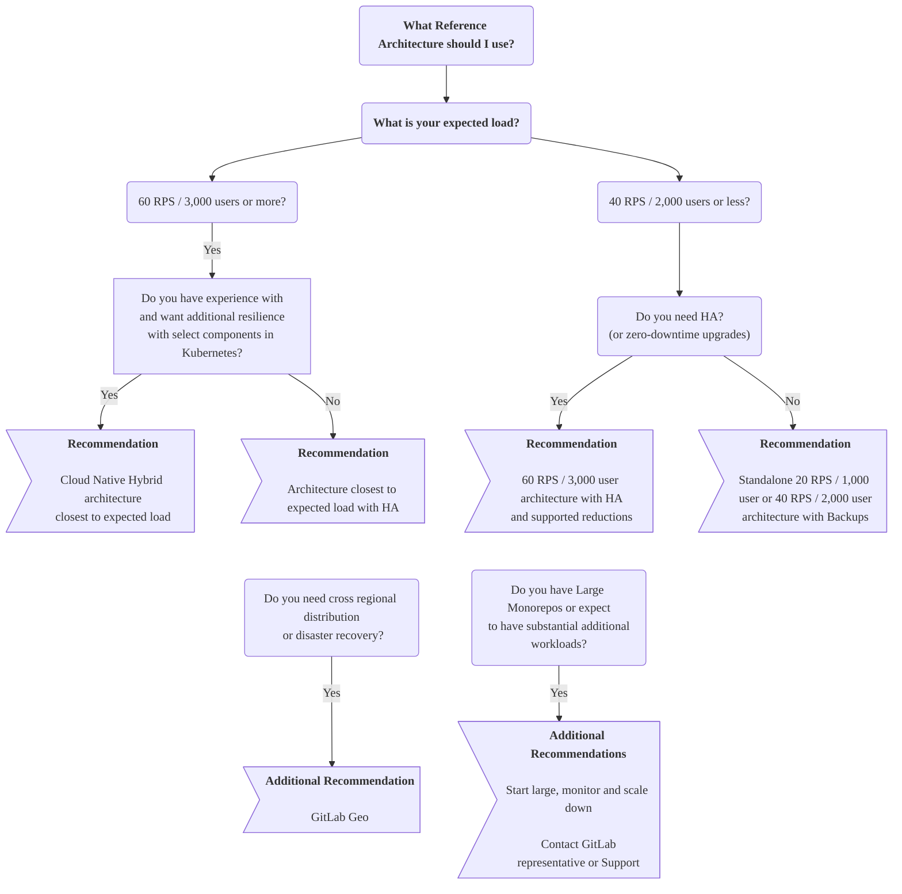



- プラン: Free、Premium、Ultimate
- 提供形態: GitLab Self-Managed



GitLabリファレンスアーキテクチャは、GitLabを大規模にデプロイするために検証済みの本番環境に対応した設計になっています。各アーキテクチャは、要件に応じて使用または調整できる詳細な仕様を提供します。

## はじめに {#before-you-start}

まず、お客様とお客様の要件にとってGitLabセルフマネージドが適切な選択肢であるかどうかを検討してください。

本番環境ではどんなアプリケーションでも実行は複雑であり、それはGitLabにおいても同様です。できる限りスムーズに実行できることを目指していますが、設計に基づく一般的な複雑さは依然として存在します。通常、ハードウェア、オペレーティングシステム、ネットワーキング、ストレージ、セキュリティ、GitLab自体など、あらゆる側面を管理する必要があります。これには、環境の初期設定だけでなく長期的なメンテナンスも含まれます。

このアプローチを採用することを決定した場合、本番環境でのアプリケーションの実行と保守に関する実務知識が必要です。実務知識がない場合、[プロフェッショナルサービス](https://about.gitlab.com/services/#implementation-services)チームが導入サービスを提供します。より長期的なマネージドソリューションを希望する方は、[GitLab SaaS](../../subscriptions/manage_users_and_seats.md#gitlabcom-billing-and-usage)や[GitLab Dedicated](../../subscriptions/gitlab_dedicated/_index.md)などの他のプランをご検討ください。

GitLab Self-Managedアプローチの使用を検討している場合は、このページ全体、特に次のセクションをよくお読みになることをおすすめします。

- [どのアーキテクチャで始めるかを決定する](#deciding-which-architecture-to-start-with)
- [大規模なモノレポ](#large-monorepos)
- [追加のワークロード](#additional-workloads)
- [環境のモニタリングと調整](#monitoring)

## どのアーキテクチャで始めるかを決定する {#deciding-which-architecture-to-start-with}

リファレンスアーキテクチャは、パフォーマンス、復元性、コストという3つの重要な要素のバランスを取るように設計されています。これらは、一般的なワークロードパターンに基づいて、GitLabを大規模にデプロイするための、検証済みの開始点を提供します。初期デプロイが容易になる一方で、ほとんどの環境は、[モニタリング](#monitoring)を通じて明らかになる実際の使用パターンに基づいて調整することでメリットが得られます。適切な開始点を選択することは重要ですが、特定のワークロード特性に基づいて調整することを想定してください。

一般的なガイドとして、環境のパフォーマンスまたは回復性を高めたいほど、複雑さが増します。

このセクションでは、リファレンスアーキテクチャを選択する際に考慮すべき事項について説明します。

### 予想される負荷 {#expected-load}

適切なアーキテクチャのサイズは、主に環境で予想されるピーク負荷によって決まります。1秒あたりのリクエスト数（RPS）は、GitLabインフラストラクチャのサイズを決定するための主要なメトリクスですが、他の要素も適用できます。

包括的なRPS分析とデータ主導のサイジングの決定については、[リファレンスアーキテクチャのサイジング](sizing.md)を参照してください。以下が提供されています:

- ピーク時および持続的なRPSメトリクスを抽出するための詳細なPromQLクエリ
- コンポーネント固有の調整を特定するためのワークロードパターン分析とRPS構成ガイダンス
- モノレポ、ネットワーキングの使用状況、および成長計画の評価開発手法

RPSを迅速に見積もるために、いくつかの潜在的なオプションがあります:

- 次のような[Prometheus](../monitoring/prometheus/_index.md#sample-prometheus-queries)クエリ:

  ```prometheus
  sum(irate(gitlab_transaction_duration_seconds_count{controller!~'HealthController|MetricsController'}[1m])) by (controller, action)
  ```

- [GitLab RPS Analyzer](https://gitlab.com/gitlab-org/professional-services-automation/tools/utilities/gitlab-rps-analyzer#gitlab-rps-analyzer)。
- その他のモニタリングソリューション。
- ロードバランサーの統計。

RPSを判断できない場合は、代替のサイズ設定開発手法として、Linuxパッケージおよびクラウドネイティブハイブリッドアーキテクチャに対して、ユーザー数相当量が提供されます。この数は、手動および自動での使用状況の両方を考慮して、一般的なRPS値にマッピングされます。

## 利用可能なリファレンスアーキテクチャ {#available-reference-architectures}

次のリファレンスアーキテクチャは、推奨される環境の開始地点として利用できます。

> [!note]
> 各アーキテクチャは[スケーラブル](#scaling-an-environment)になるように設計されています。ワークロードに応じて、上方または下方に適宜調整できます。たとえば、既知の負荷が高いシナリオには、[大規模なモノレポ](#large-monorepos)の使用や、かなりの量の[追加のワークロード](#additional-workloads)などがあります。

### Linuxパッケージ（Omnibus） {#linux-package-omnibus}

Linuxパッケージベースのリファレンスアーキテクチャは、すべてのGitLabコンポーネントをパッケージとともに仮想マシンにデプロイします。一部のコンポーネント（PostgreSQL、Redis、オブジェクトストレージ）は、オプションでクラウドプロバイダーサービスを使用できます。

次のRPSターゲットは、典型的なワークロード構成を反映しています。型破りなワークロードについては、[RPS構成の理解](sizing.md#understanding-rps-composition-and-workload-patterns)を参照してください。

| サイズ                         | API RPS | Web RPS | Git（プル）RPS | Git（プッシュ）RPS |
|------------------------------|---------|---------|----------------|----------------|
| [1,000ユーザー](1k_users.md)   | 20      | 2       | 2              | 1              |
| [2,000ユーザー](2k_users.md)   | 40      | 4       | 4              | 1              |
| [3,000ユーザー](3k_users.md)   | 60      | 6       | 6              | 1              |
| [5,000ユーザー](5k_users.md)   | 100     | 10      | 10             | 2              |
| [10,000ユーザー](10k_users.md) | 200     | 20      | 20             | 4              |
| [25,000ユーザー](25k_users.md) | 500     | 50      | 50             | 10             |
| [50,000ユーザー](50k_users.md) | 1,000    | 100     | 100            | 20             |

### クラウドネイティブハイブリッド {#cloud-native-hybrid}

クラウドネイティブハイブリッドリファレンスアーキテクチャは、一部のステートレスコンポーネント（Webservice、Sidekiq）をKubernetesのHelm Chartを使用してデプロイし、一部のコンポーネントは仮想マシン上に残るか、クラウドプロバイダーサービス（PostgreSQL、Redis、オブジェクトストレージ）を使用します。

| サイズ                                                                                                 | API RPS | Web RPS | Git（プル）RPS | Git（プッシュ）RPS |
|------------------------------------------------------------------------------------------------------|---------|---------|----------------|----------------|
| [2,000ユーザー](2k_users.md#cloud-native-hybrid-reference-architecture-with-helm-charts-alternative)   | 40      | 4       | 4              | 1              |
| [3,000ユーザー](3k_users.md#cloud-native-hybrid-reference-architecture-with-helm-charts-alternative)   | 60      | 6       | 6              | 1              |
| [5,000ユーザー](5k_users.md#cloud-native-hybrid-reference-architecture-with-helm-charts-alternative)   | 100     | 10      | 10             | 2              |
| [10,000ユーザー](10k_users.md#cloud-native-hybrid-reference-architecture-with-helm-charts-alternative) | 200     | 20      | 20             | 4              |
| [25,000ユーザー](25k_users.md#cloud-native-hybrid-reference-architecture-with-helm-charts-alternative) | 500     | 50      | 50             | 10             |
| [50,000ユーザー](50k_users.md#cloud-native-hybrid-reference-architecture-with-helm-charts-alternative) | 1,000    | 100     | 100            | 20             |

### クラウドネイティブファースト（ベータ） {#cloud-native-first-beta}



- プラン: Free、Premium、Ultimate
- 提供形態: GitLab Self-Managed
- ステータス: ベータ版



クラウドネイティブファーストアーキテクチャは、ワークロード特性に基づいて4つの標準化されたサイズ（S/M/L/XL）で最新のデプロイ手法をターゲットとする、次世代のアーキテクチャです。これらのアーキテクチャは、すべてのGitLabコンポーネントをKubernetesにデプロイし、PostgreSQL、Redis、およびオブジェクトストレージは、マネージドサービスまたはオンプレミスオプションを含む、外部のサードパーティソリューションを使用します。

これらのアーキテクチャは、運用オーバーヘッドの削減、デプロイの簡素化、およびKubernetesオーケストレーションによる回復性の強化を実現します。

| サイズ | ターゲットRPS | ワークロードの特性 |
|------|------------|--------------------------|
| 小(S) | ≤100 RPS | 全体的な負荷は小さいですが、アクティブなモノレポには適していません |
| 中(M) | ≤200 RPS | 適度な負荷、使用頻度の低いモノレポをサポート |
| 大(L) | ≤500 RPS | 重い負荷、適度に使用されるモノレポを処理 |
| 特大(XL) | ≤1000 RPS | 集中的な負荷、頻繁に使用されるモノレポ向けに設計 |

詳しくは、[Cloud Native Firstリファレンスアーキテクチャ](cloud_native_first.md)をご覧ください。

### 迷った場合は、大きめの設定で開始し、モニタリングしてからスケールダウンする {#if-in-doubt-start-large-monitor-and-then-scale-down}

必要な環境サイズが不明な場合は、大きめの設定で開始し、[モニタリング](#monitoring)してから、メトリクスが運用状況をサポートする場合は、それに応じて[スケールダウン](#scaling-an-environment)することを検討してください。

大きめの設定で開始してからスケールダウンするのが賢明なアプローチであるのは、次のような場合です。

- RPSを特定できない
- 環境負荷が予想よりも異常に高い可能性がある
- [大規模なモノレポ](#large-monorepos)またはかなりの量の[追加のワークロード](#additional-workloads)がある

たとえば、3,000のユーザーがいて、同時負荷を大幅に増加させる自動化が実行されていることもわかっている場合は、100 RPS / 5,000ユーザーのクラス環境で開始してモニタリングし、メトリクスがそれをサポートする場合は、すべてのコンポーネントを一度に、または1つずつスケールダウンします。

### スタンドアロン（非HA） {#standalone-non-ha}

2,000以下のユーザーにサービスを提供する環境では、通常、非HA、単一またはマルチノード環境をデプロイする、スタンドアロンアプローチに従うことをおすすめします。このアプローチでは、リカバリーのための[自動バックアップ](../backup_restore/backup_gitlab.md#configuring-cron-to-make-daily-backups)などの戦略を採用できます。これらの戦略は、HAに伴う複雑さを回避する一方、適切なレベルの目標リカバリー時間（RTO）または目標リカバリー時点（RPO）を提供します。

スタンドアロンセットアップ、特に単一ノード環境では、[インストール](../../install/_index.md)と管理にさまざまなオプションを利用できます。オプションには、複雑さをさらに軽減する[特定のクラウドプロバイダーマーケットプレースを使用して直接デプロイする機能](https://page.gitlab.com/cloud-partner-marketplaces.html)が含まれます。

### 高可用性（HA） {#high-availability-ha}

高可用性により、GitLabセットアップのすべてのコンポーネントが、さまざまなメカニズムを通じて障害を処理できるようになります。ただし、これを実現するのは複雑であり、必要な環境は相当な規模になる可能性があります。

3,000以上のユーザーにサービスを提供する環境では、通常、HA戦略を使用することをおすすめします。このレベルでは、環境が停止するとより多くのユーザーに大きな影響を与えます。この範囲のすべてのアーキテクチャには、この理由から、設計上HAが組み込まれています。

#### 高可用性（HA）の必要性 {#do-you-need-high-availability-ha}

前述のように、HAの実現にはコストがかかります。各コンポーネントを増やす必要があるため、環境要件は相当な規模になり、実際のコストとメンテナンスコストが追加されます。

ユーザー数が3,000未満のお客様の多くにとっては、バックアップ戦略で十分であり、その方が好ましいことがわかっています。リカバリー時間が長くなりますが、アーキテクチャがはるかに小さくなり、結果としてメンテナンスコストも削減されます。

一般的なガイドラインとして、HAは次のシナリオでのみ採用してください。

- ユーザーが3,000以上の場合。
- GitLabがダウンすると、ワークフローに重大な影響を与える場合。

#### スケールダウンした高可用性（HA）アプローチ {#scaled-down-high-availability-ha-approach}

ユーザー数が少なくてもHAが必要な場合は、[3Kアーキテクチャ](3k_users.md#supported-modifications-for-lower-user-counts-ha)を調整した形で実現できます。

#### ゼロダウンタイムアップグレード {#zero-downtime-upgrades}

[ゼロダウンタイムアップグレード](../../update/zero_downtime.md)は、HAを備えた標準環境で使用できます（クラウドネイティブハイブリッドは[サポートされていません](https://gitlab.com/groups/gitlab-org/cloud-native/-/epics/52)）。これにより、アップグレード中も環境を維持できます。ただし、このプロセスは結果としてより複雑になり、ドキュメントで詳しく説明されているように、いくつかの制限があります。

このプロセスを実行する場合、HAメカニズムが有効になるときに、ごく短時間ダウンタイムが発生する可能性があることに注意してください。

ほとんどの場合、アップグレードに必要なダウンタイムはそれほど長くはありません。これが重要な要件である場合にのみ、このアプローチを採用してください。

### GitLab Geo（地域間分散/ディザスターリカバリー） {#gitlab-geo-cross-regional-distribution--disaster-recovery}

[GitLab Geo](../geo/_index.md)を使用すると、完全なディザスターリカバリー（DR）セットアップを使って、さまざまな地域で分散環境を実現できます。GitLab Geoでは、少なくとも2つの個別の環境が必要です。

- 1つのプライマリサイト。
- レプリカとして機能する1つ以上のセカンダリサイト。

プライマリサイトが利用できなくなった場合は、いずれかのセカンダリサイトにフェイルオーバーできます。

> [!note]
> DRが環境の主要な要件である場合にのみ、この**advanced and complex**設定を使用してください。また、各サイトの設定方法について、追加の決定を行う必要もあります。たとえば、各セカンダリサイトをプライマリサイトと同じアーキテクチャにするか、各サイトをHA用に設定するかなどです。

### 大規模なモノレポ/追加ワークロード {#large-monorepos--additional-workloads}

[大規模なモノレポ](#large-monorepos)または大量の[追加ワークロード](#additional-workloads)は、環境のパフォーマンスに著しい影響を与える可能性があります。状況に応じて、何らかの調整が必要になる場合があります。

これらの要因の包括的な分析については、[リファレンスアーキテクチャのサイジング](sizing.md)を参照してください。以下が提供されています:

- インフラストラクチャに対するモノレポの影響に関する詳細な評価開発手法。
- さまざまなワークロードパターンに対するコンポーネント固有のスケーリングの推奨事項。
- 大量のデータ転送シナリオにおけるネットワーク帯域幅分析。

この状況に該当する場合は、GitLabの担当者または[サポート](https://about.gitlab.com/support/)にご連絡いただき、詳細なガイダンスをお求めください。

### クラウドプロバイダーサービス {#cloud-provider-services}

前述のすべての戦略において、PostgreSQLデータベースやRedisなどの同等のクラウドプロバイダーサービスで、いくつかのGitLabコンポーネントを実行できます。

詳細については、[推奨されるクラウドプロバイダーとサービス](#recommended-cloud-providers-and-services)を参照してください。

### 意思決定ツリー {#decision-tree}

次の意思決定ツリーを参照する前に、前述のガイダンスをすべてお読みください。



> [!note]上記の意思決定ツリーは、本番環境に対応したアーキテクチャを反映しています。Gitalyを含む完全にKubernetesネイティブなデプロイについては、現在ベータ版であり、本番環境での使用はまだ推奨されていない[Cloud Native First（ベータ）](cloud_native_first.md)を参照してください。

## 要件 {#requirements}

リファレンスアーキテクチャを実装する前に、次の要件とガイダンスを参照してください。

### サポートされているマシンタイプ {#supported-machine-types}

これらのアーキテクチャは、一貫したパフォーマンスを確保しながら、柔軟にマシンタイプを選択できるように設計されています。各リファレンスアーキテクチャで特定のマシンタイプの例を示していますが、これらは推奨されるデフォルトを意図したものではありません。

次の例のように、各コンポーネントに指定された要件を満たすか、それ以上の任意のマシンタイプを使用できます。

- 新世代のマシンタイプ（GCP `n2`シリーズやAWS `m6`シリーズなど）
- ARMベースのインスタンス（AWS Gravitonなど）のような別のアーキテクチャ
- 特定のワークロード特性（より高いネットワーク帯域幅など）により適した代替マシンタイプファミリー

このガイダンスは、AWS RDSなどのクラウドプロバイダーサービスにも適用できます。

> [!note]パフォーマンスの一貫性がないため、「バースト可能」なインスタンスタイプは推奨されません。

テストを実施したマシンタイプやその方法の詳細については、[検証およびテスト結果](#validation-and-test-results)を参照してください。

### サポートされているディスクタイプ {#supported-disk-types}

ほとんどの標準ディスクタイプは、GitLabで動作することが期待されています。ただし、次の点に注意してください。

- Gitalyには、Gitalyストレージに関する特定の[ディスク要件](../gitaly/_index.md#disk-requirements)があります。
- パフォーマンスが一貫しないため、「バースト可能」なディスクタイプの使用は推奨しません。

その他のディスクタイプは、GitLabで動作することが期待されています。耐久性やコストなどの要件に基づいて選択してください。

### サポートされているインフラストラクチャ {#supported-infrastructure}

GitLabは、信頼できるクラウドプロバイダー（AWS、GCP、Azure）やそれらのサービス、または次の両方を満たすSelf-Managed（ESXi）などのほとんどのインフラストラクチャで実行できます。

- 各アーキテクチャで詳述されている仕様。
- このセクションのすべての要件。

ただし、これにより、考えられるすべての組み合わせとの互換性が保証されるわけではありません。

詳細については、[推奨されるクラウドプロバイダーとサービス](#recommended-cloud-providers-and-services)を参照してください。

### ネットワーキング（HA） {#networking-high-availability}

以下は、高可用性構成でGitLabを実行するためのネットワーク要件です。

#### ネットワークレイテンシー {#network-latency}

データベースレプリケーションなど、GitLabアプリケーション全体で同期レプリケーションを可能にするには、ネットワークレイテンシーを可能な限り低くする必要があります。一般に、これは5ミリ秒未満である必要があります。

#### 可用性ゾーン（クラウドプロバイダー） {#availability-zones-cloud-providers}

可用性ゾーン全体へのデプロイはサポートされており、復元性を高めるために推奨されています。一部のコンポーネントはクォーラム投票に奇数のノードを使用するため、GitLabアプリケーションの要件に合わせて奇数のゾーンを使用する必要があります。

#### データセンター（セルフホスト） {#data-centers-self-hosted}

複数のセルフホストデータセンターへのデプロイは可能ですが、慎重な検討が必要です。これには、センター間の同期対応レイテンシー、スプリットブレインシナリオを防ぐための堅牢な冗長ネットワークリンク、地理的に同一リージョンにあるすべてのセンター、および適切なクォーラム投票のための奇数のセンター全体へのデプロイ（[可用性ゾーン](#availability-zones-cloud-providers)など）が必要です。

> [!warning]マルチデータセンターデプロイに起因するインフラストラクチャ関連の問題について、GitLabサポートが支援できない場合があります。センター全体へのデプロイを選択する場合、一般に自己責任となります。さらに、単一の[異なる地域にまたがるGitLab環境](#deploying-one-environment-over-multiple-regions)をデプロイすることはサポートされていません。データセンターは、同じリージョンにある必要があります。

### 大規模なモノレポ {#large-monorepos}

アーキテクチャは、ベストプラクティスに従うさまざまなサイズのリポジトリでテストされました。

ただし、[大規模なモノレポ](../../user/project/repository/monorepos/_index.md)（数ギガバイト以上）は、Gitのパフォーマンス、ひいては環境自体に大きな影響を与える可能性があります。大規模モノレポとその使用方法は、Gitalyから基盤となるインフラストラクチャまで、システム全体に大きな負担をかける可能性があります。

パフォーマンスへの影響は、主にソフトウェアの性質に起因します。ハードウェアリソースを追加しても、あまり効果はありません。

> [!warning]これに該当する場合は、リンク先のドキュメントに従い、GitLabの担当者または[サポートチーム](https://about.gitlab.com/support/)にご連絡いただくことを強くお勧めします。

大規模なモノレポには、相応のコストがかかります。そのようなリポジトリがある場合は、パフォーマンスを良好に保ち、コストを抑制するために、次のガイダンスに従ってください。

- [大規模なモノレポを最適化](../../user/project/repository/monorepos/_index.md)します。バイナリを保存しないように[LFS](../../user/project/repository/monorepos/_index.md#use-git-lfs-for-large-binary-files)などの機能を使用したり、リポジトリのサイズを縮小する別のアプローチを使用したりすると、パフォーマンスが大幅に向上し、コストを削減できる可能性があります。
- モノレポによっては、それを補うために環境仕様を引き上げることが必要になる場合があります。Gitalyでは、Praefect、GitLab Rails、およびロードバランサーとともに、追加のリソースが必要になる場合があります。これは、モノレポ自体とその使用状況によって異なります。
- モノレポが非常に大きい場合（20ギガバイト以上）、さらに仕様を強化したり、場合によってはモノレポ専用のGitalyバックエンドを別途用意するなど、さらなる対策が必要になることがあります。
- ネットワークとディスクの帯域幅は、大規模なモノレポで考慮すべきもう1つの潜在的な要素です。負荷が非常に高い状況では、（CIなどの）同時クローンが多数存在する場合、帯域幅が飽和状態になる可能性があります。このシナリオでは、[可能な限りフルクローンを削減してください](../../user/project/repository/monorepos/_index.md#reduce-concurrent-clones-in-cicd)。それ以外の場合は、帯域幅を増やすために、環境仕様を追加する必要になることがあります。これは、クラウドプロバイダーによって異なります。

### 追加のワークロード {#additional-workloads}

これらのアーキテクチャは、実際のデータに基づいた標準的なGitLabのセットアップ用に[設計およびテスト](#validation-and-test-results)されています。

ただし、追加のワークロードは、フォローアップアクションをトリガーすることにより、操作の影響を増幅させる可能性があります。以下を使用する場合は、処理能力を補うため、推奨される仕様を調整することが必要かもしれません。

- ノード上のセキュリティソフトウェア。
- [大規模リポジトリ](../../user/project/repository/monorepos/_index.md)に対する数百もの同時CIジョブ。
- [高頻度で実行される](../logs/log_parsing.md#print-top-api-user-agents)カスタムスクリプト。
- 多くの大規模プロジェクトにおける[インテグレーション](../../integration/_index.md)。
- [サーバーフック](../server_hooks.md)。
- [システムフック](../system_hooks.md)。

通常、変更が必要な場合に通知するために、追加のワークロードの影響を測定するための堅牢なモニタリングを導入する必要があります。GitLabの担当者または[サポートチーム](https://about.gitlab.com/support/)にご連絡いただき、詳細なガイダンスをお求めください。

### ロードバランサー {#load-balancers}

アーキテクチャでは、クラスに応じて最大2つのロードバランサーを使用します。

- 外部ロードバランサー - 外部に面したコンポーネント（主にRails）にトラフィックを送信します。
- 内部ロードバランサー - PraefectやPgBouncerなど、HA構成でデプロイされたいくつかの内部コンポーネントにトラフィックを送信します。

どのロードバランサーを使用するか、またはその正確な設定に関する詳細は、GitLabドキュメントの範囲外です。もっとも一般的なオプションは、マシンノードにロードバランサーを設定するか、クラウドプロバイダーが提供するサービスなどを使用することです。クラウドネイティブハイブリッド環境をデプロイする場合、チャートはKubernetes Ingressを使用して外部ロードバランサーのセットアップを処理できます。

各アーキテクチャクラスには、マシンに直接デプロイするのに推奨されるベースマシンサイズが含まれています。ただし、選択したロードバランサーや予想されるワークロードなどの要因に基づいて調整が必要になる場合があります。マシンはさまざまな[ネットワーク帯域幅](#network-bandwidth)を持つ可能性があり、それも考慮に入れる必要があります。

次のセクションでは、ロードバランサーに関する追加のガイダンスを提供します。

#### バランシングアルゴリズム {#balancing-algorithm}

ノードへの呼び出しを均等に分散させ、良好なパフォーマンスを確保するには、可能な限り最小接続ベースのロードバランシングアルゴリズムまたは同等のものを使用します。

ラウンドロビンアルゴリズムは、実際の運用では接続を均等に分散させないことが知られているため、推奨しません。

#### ネットワーク帯域幅 {#network-bandwidth}

マシンにデプロイされたときにロードバランサーが利用できる合計ネットワーク帯域幅は、クラウドプロバイダー間で著しく異なる場合があります。[AWS](https://docs.aws.amazon.com/AWSEC2/latest/UserGuide/ec2-instance-network-bandwidth.html)などの一部のクラウドプロバイダーは、クレジットを使用したバーストシステムで動作するため、任意のタイミングで利用できる帯域幅が決まる場合があります。

ロードバランサーに必要なネットワーク帯域幅は、データの形式やワークロードなどの要因によって異なります。各アーキテクチャクラスに推奨されるベースサイズは、実際のデータに基づいて選択されています。ただし、[大規模なモノレポ](#large-monorepos)の一貫性のあるクローン、[GitLab Container Registry](../../user/packages/container_registry/_index.md)の大量使用、大規模なCIアーティファクト、または大規模なファイルの頻繁な転送を伴うワークロードなどの一部のシナリオでは、サイズを適宜調整する必要がある場合があります。

### スワップなし {#no-swap}

リファレンスアーキテクチャでは、スワップは推奨されていません。スワップは、パフォーマンスに大きな影響を与えるフェイルセーフです。アーキテクチャは、ほとんどの場合、スワップの必要性を回避するのに十分なメモリを持つように設計されています。

### Praefect PostgreSQL {#praefect-postgresql}

[Praefectには独自のデータベースサーバーが必要です](../gitaly/praefect/configure.md#postgresql)。完全なHAを実現するには、サードパーティのPostgreSQLデータベースソリューションが必要です。

将来的には、これらの制限に対する組み込みソリューションを提供したいと考えています。それまでの間、仕様に反映されているようにLinuxパッケージを使用して、非HA PostgreSQLサーバーをセットアップできます。詳細については、次のイシューを参照してください。

- [`omnibus-gitlab#7292`](https://gitlab.com/gitlab-org/omnibus-gitlab/-/issues/7292)。
- [`gitaly#3398`](https://gitlab.com/gitlab-org/gitaly/-/issues/3398)。

## 推奨されるクラウドプロバイダーとサービス {#recommended-cloud-providers-and-services}

> [!note]次のリストは網羅的なものではありません。ここにリストされていない他のクラウドプロバイダーも同じ仕様で動作する可能性がありますが、検証されていません。ここにリストされていないクラウドプロバイダーサービスについては、各実装が大きく異なる可能性があるため、注意して使用してください。本番環境で使用する前に十分にテストしてください。

次のアーキテクチャは、テストと実際の使用状況に基づいて、次のクラウドプロバイダーに推奨されます。

| リファレンスアーキテクチャ | GCP         | AWS         | Azure                    | ベアメタル  |
|------------------------|-------------|-------------|--------------------------|-------------|
| [Linuxパッケージ](#linux-package-omnibus)          |  |  |  <sup>1</sup> |  |
| [クラウドネイティブハイブリッド](#cloud-native-hybrid)    |  |  |                          |             |
| [クラウドネイティブファースト](cloud_native_first.md)（ベータ） |  |  |  |  |

さらに、次のクラウドプロバイダーサービスをアーキテクチャの一部として使用することをおすすめします。

| クラウドサービス  | GCP                                                    | AWS                                                | Azure                                                                                                   | ベアメタル               |
|----------------|--------------------------------------------------------|----------------------------------------------------|---------------------------------------------------------------------------------------------------------|--------------------------|
| オブジェクトストレージ | [Cloud Storage](https://cloud.google.com/storage)      | [S3](https://aws.amazon.com/s3/)                   | [Azure blob Storage](https://azure.microsoft.com/en-gb/products/storage/blobs)                          | [MinIO](https://min.io/) |
| データベース       | [Cloud SQL](https://cloud.google.com/sql) <sup>2</sup> | [RDS](https://aws.amazon.com/rds/)                 | [Azure Database for PostgreSQL Flexible Server](https://azure.microsoft.com/en-gb/products/postgresql/) |                          |
| Redis          | [Memorystore](https://cloud.google.com/memorystore)    | [ElastiCache](https://aws.amazon.com/elasticache/) | [Azure Cache for Redis (Premium)](https://azure.microsoft.com/en-gb/products/cache)                     |                          |

<!-- Disable ordered list rule https://github.com/DavidAnson/markdownlint/blob/main/doc/Rules.md#md029---ordered-list-item-prefix -->
<!-- markdownlint-disable MD029 -->
1. 良好なパフォーマンスを確保するには、[Azure Cache for RedisのPremiumプラン](https://learn.microsoft.com/en-us/azure/azure-cache-for-redis/cache-overview#service-tiers)をデプロイします。
2. 最適なパフォーマンスを得るには、特に大規模環境（500 RPS / 25,000ユーザー以上）では、GCP Cloud SQLに[Enterprise Plus Edition](https://cloud.google.com/sql/docs/editions-intro)を使用してください。ワークロードによっては、サービスのデフォルトよりも大きな最大接続数を指定する必要がある場合があります。
<!-- markdownlint-enable MD029 -->

### データベースサービスのベストプラクティス {#best-practices-for-the-database-services}

LinuxパッケージにバンドルされているPostgreSQL、PgBouncer、およびConsulサービスディスカバリコンポーネントの代わりに、[PostgreSQLのサードパーティの外部サービス](../postgresql/external.md)を使用できます。

[サポートされているPostgreSQLバージョン](../../install/requirements.md#postgresql)を実行する信頼できるプロバイダーを使用してください。これらのサービスは、正常に機能することがわかっています:

- [Google Cloud SQL](https://cloud.google.com/sql/docs/postgres/high-availability#normal)。
- [Amazon RDS](https://aws.amazon.com/rds/)。

#### 構成に関する考慮事項 {#configuration-considerations}

外部データベースサービスを使用する場合は、以下を考慮してください:

- 最適なパフォーマンスを得るには、[データベースロードバランシング](../postgresql/database_load_balancing.md)を読み取りレプリカで有効にします。ノード数を標準のLinuxパッケージのデプロイで使用されている数に合わせます。このアプローチは、大規模環境（1秒あたり200を超えるリクエスト、または10,000を超えるユーザー）において特に重要です。
- 高可用性ノードの要件は、サービスによって異なり、Linuxパッケージのインストールとは異なる場合があります。
- [GitLab Geo](../geo/_index.md)の場合、サービスがクロスリージョンレプリケーションをサポートしていることを確認してください。

#### 接続管理 {#connection-management}

外部データベースサービスとの最適な接続処理を行うには、以下を行います:

- [データベースロードバランシング](../postgresql/database_load_balancing.md)を使用して、接続を読み取りレプリカ全体に分散します。
- 環境のサイズとワークロードに合わせてPostgreSQL接続数を構成します。パフォーマンスに基づいてモニタリングおよび調整します。
- 追加の接続プールが必要な場合は、独自のPgBouncerをデプロイします。他のサードパーティのプールソリューションも機能する可能性がありますが、検証されていません。

クラウドプロバイダーのプールサービスには、次の制限があり、互換性がないか、推奨されていません:

- [AWS RDS Proxy](https://aws.amazon.com/rds/proxy/): GitLabでの使用は検証されていません。
- [Azure Database for PostgreSQL PgBouncer](https://learn.microsoft.com/en-us/azure/postgresql/connectivity/concepts-pgbouncer): 制限された可観測性を備えたシングルスレッドアーキテクチャ。高負荷時にボトルネックが発生する可能性があります。

> [!note]GitLabバンドルのPgBouncerは、バンドルされたPostgreSQLでのみ機能し、外部データベースサービスでは使用できません。

#### データベースサービスの互換性 {#database-service-compatibility}

次のデータベースクラウドプロバイダーサービスは、互換性がないか、推奨されていません:

- [Amazon Aurora](https://aws.amazon.com/rds/aurora/)は互換性がなく、サポートされていません。詳細については、[14.4.0](https://archives.docs.gitlab.com/17.3/ee/update/versions/gitlab_14_changes/#1440)を参照してください。
- [Google AlloyDB](https://cloud.google.com/alloydb)および[Amazon RDS Multi-AZ DBクラスター](https://docs.aws.amazon.com/AmazonRDS/latest/UserGuide/multi-az-db-clusters-concepts.html)はテストされておらず、推奨されていません。どちらのソリューションもGitLab Geoでは動作しないことが予想されます。
  - [Amazon RDS Multi-AZ DBインスタンス](https://docs.aws.amazon.com/AmazonRDS/latest/UserGuide/Concepts.MultiAZSingleStandby.html)は別の製品であり、サポートされています。

### Redisサービスのベストプラクティス {#best-practices-for-redis-services}

標準的でパフォーマンスが良く、サポートされているバージョンを実行する[外部Redisサービス](../redis/replication_and_failover_external.md#redis-as-a-managed-service-in-a-cloud-provider)を使用してください。サービスは以下をサポートしている必要があります。

- Redisスタンドアロン（Primary x Replica）モード - Redis Clusterモードは特にサポートされていません
- レプリケーションによる高可用性
- [Redisエビクションポリシー](../redis/replication_and_failover_external.md#setting-the-eviction-policy)を設定する機能

Redisは基本的にシングルスレッドです。200 RPS / 10,000ユーザー以上のクラスをターゲットとする環境では、最適なパフォーマンスを実現するために、インスタンスをキャッシュと永続データに分離します。

> [!note]RedisサービスのServerlessバリアントは、現時点ではサポートされていません。

### オブジェクトストレージのベストプラクティス {#best-practices-for-object-storage}

GitLabは、動作が期待される[さまざまなオブジェクトストレージプロバイダー](../object_storage.md#supported-object-storage-providers)に対してテストされています。

完全なS3互換性を持つ信頼できるソリューションを使用してください。

## 推奨されるリファレンスアーキテクチャから逸脱する {#deviating-from-the-suggested-reference-architectures}

リファレンスアーキテクチャから離れるほど、サポートを受けるのが難しくなります。逸脱するたびに複雑さが増し、潜在的な問題のトラブルシューティングが難しくなります。

これらのアーキテクチャは、公式のLinuxパッケージまたは[Helm Chart](https://docs.gitlab.com/charts/)を使用して、さまざまなコンポーネントをインストールおよび設定します。コンポーネントは、個別のマシン（仮想化またはベアメタル）にインストールされます。特定のリファレンスアーキテクチャページの「構成」列に記載されているマシンのハードウェア要件。同等の仮想マシン標準サイズは、[利用可能な各アーキテクチャ](#available-reference-architectures)のGCP/AWS/Azure列にリストされています。

Docker Composeを含むDockerでGitLabコンポーネントを実行できます。Dockerは十分にサポートされており、環境全体で一貫した仕様を提供します。ただし、追加のレイヤーであり、サポートが複雑になる可能性があります。たとえば、コンテナで`strace`を実行できないなどです。

### サポートされていないデザイン {#unsupported-designs}

GitLab環境デザインを幅広くサポートすることを目指していますが、特定のアプローチは効果的に機能しません。次のセクションでは、これらのサポートされていないアプローチについて詳しく説明します。

#### Kubernetesのステートフルコンポーネント {#stateful-components-in-kubernetes}

[PostgresやRedisなどのKubernetesでステートフルコンポーネントを実行することはサポートされていません](https://docs.gitlab.com/charts/installation/#configure-the-helm-chart-to-use-external-stateful-data)。

特にサポートされていないと明示されていない限り、他のサポートされているクラウドプロバイダーのサービスを使用できます。

個々のGitalyノードは、[制限付き可用性](../gitaly/kubernetes.md#timeline)でKubernetesにデプロイできます。これにより、各リポジトリが単一のノードに保存される非HAソリューションが提供されます。Gitalyデプロイオプションと制限のコンテキストについては、[Kubernetes上のGitaly](../gitaly/kubernetes.md#context)を参照してください。

Gitalyを完全にクラウドネイティブなセットアップの一部としてKubernetesにデプロイするリファレンスアーキテクチャについては、[Cloud Native Firstリファレンスアーキテクチャ（ベータ）](cloud_native_first.md)を参照してください。

#### ステートフルノードのオートスケール {#autoscaling-of-stateful-nodes}

一般的なガイダンスとして、GitLabのステートレスコンポーネント（GitLab RailsやSidekiqなど）のみをオートスケールグループで実行できます。Gitalyなど、ステートを持つ他のコンポーネントは、この構成ではサポートされていません。詳細については、[イシュー2997](https://gitlab.com/gitlab-org/gitaly/-/issues/2997)を参照してください。

これは、PostgresやRedisなどのステートフルコンポーネントに適用されます。特にサポートされていないと明示されていない限り、他のサポートされているクラウドプロバイダーのサービスを使用できます。

一般に[クラウドネイティブハイブリッド構成](#cloud-native-hybrid)は、オートスケールグループよりも推奨されます。Kubernetesは、データベースの移行や[Mailroom](../incoming_email.md)など、1つのノードでのみ実行できるコンポーネントをより適切に処理します。

#### 複数のリージョンに単一の環境をデプロイする {#deploying-one-environment-over-multiple-regions}

GitLabは、複数のリージョンに単一の環境をデプロイすることをサポートしていません。このような構成では、リージョン間の接続が失敗した場合、過度のネットワークレイテンシーやスプリットブレインシナリオなど、重大な問題を引き起こす可能性があります。

Consul、Redis Sentinel、Praefectなど、一部のGitLabコンポーネントは、同期レプリケーションを実行するか、正しく機能するために奇数のノードが必要です。高いレイテンシーでこれらのコンポーネントを複数のリージョンに分散すると、その機能とシステム全体のパフォーマンスに深刻な影響を与える可能性があります。

この制限は、クラウドネイティブハイブリッドの代替構成を含む、考えられるすべてのGitLab環境構成に適用されます。

複数のデータセンターまたはリージョンにGitLabをデプロイするために、包括的なソリューションとして[GitLab Geo](../geo/_index.md)を提供しています。

## 検証およびテスト結果 {#validation-and-test-results}

GitLabは、これらのアーキテクチャの定期的なスモークテストとパフォーマンステストを実施し、準拠していることを確認しています。

### テストの実施方法 {#how-we-perform-the-tests}

テストは、サンプル顧客データから派生した特定のコード化されたワークロードを使用して実施され、TerraformおよびAnsibleを使用した環境デプロイには[GitLab Environment Toolkit（GET）](https://gitlab.com/gitlab-org/gitlab-environment-toolkit)、k6を使用したパフォーマンステストには[GitLab Performance Tool（GPT）](https://gitlab.com/gitlab-org/quality/performance)の両方を利用します。

テストは主にGCPおよびAWSで、ベースライン設定として標準のコンピューティングサービス（GCPの場合はn1シリーズ、AWSの場合はm5シリーズ）を使用して実行されます。これらのマシンタイプは、幅広い互換性を確保するために、もっとも標準的なターゲットとして選択されました。CPUとメモリの要件を満たす異なるマシンタイプまたは新しいマシンタイプの使用は完全にサポートされています。詳細については、[サポートされているマシンタイプ](#supported-machine-types)を参照してください。これらのアーキテクチャは、他のクラウドプロバイダーまたはオンプレミスであるかどうかにかかわらず、仕様を満たすハードウェア上では同様に機能することが期待されます。

### パフォーマンス目標 {#performance-targets}

各リファレンスアーキテクチャは、実際の顧客データに基づいて特定のスループット目標に対してテストされます。1,000ユーザーごとに、以下をテストします。

- API: 20 RPS
- Web: 2 RPS
- Git（プル）: 2 RPS
- Git（プッシュ）: 0.4 RPS（もっとも近い整数に四捨五入）

上記のRPS目標は、CIやその他のワークロードを含む、ユーザー数に対応する環境負荷の実際の顧客データに基づいて選択されました。

>>> [!note]

- これらのRPSの内訳は、典型的なワークロードパターンに基づいたテストターゲットを表しています。実際のワークロード構成は異なる場合があります。特定のRPS構成の評価と調整が必要な場合のガイダンスについては、[RPS構成の理解](sizing.md#understanding-rps-composition-and-workload-patterns)を参照してください。
- テスト環境のコンポーネント間のネットワークレイテンシーは5ミリ秒未満で観測されましたが、これは厳密な要件として意図されていないことに注意してください。

>>>

### テストカバレッジと結果 {#test-coverage-and-results}

テストは効果的に設計されており、すべてのリファレンスアーキテクチャの目標に対して十分なカバレッジを提供します。テストの頻度は、アーキテクチャのタイプとサイズによって異なります。

- Linuxパッケージ環境: GCPおよびAWS上のすべてのサイズで毎日または毎週。
- クラウドネイティブ環境: GCPおよびAWSでの選択された設定の毎週のテスト。

テストには、将来のサービス導入の可能性を探るために考慮されているこれらのアーキテクチャのプロトタイプも含まれています。テスト結果は、[リファレンスアーキテクチャWiki](https://gitlab.com/gitlab-org/reference-architectures/-/wikis/Benchmarks/Latest)で公開されています。

## リファレンスアーキテクチャ環境を維持する {#maintaining-a-reference-architecture-environment}

リファレンスアーキテクチャ環境の維持は、一般的に他のGitLab環境と同じです。

このセクションでは、関連分野のドキュメントおよび特定アーキテクチャのノートへのリンクを紹介します。

### 環境をスケールする {#scaling-an-environment}

リファレンスアーキテクチャは、一般的なワークロードパターンに基づく検証済みの開始点として設計されており、最終的な構成ではありません。ほとんどの本番環境デプロイは、モニタリングを通じて明らかになる実際の使用パターンに基づいて調整することでメリットが得られます。アーキテクチャは全体的にスケーラブルであり、ワークロードの特性が明確になるにつれて、反復的に調整できます。スケーリングは、メトリクスが持続的なリソース圧力を示す場合に、コンポーネントごと、または次のアーキテクチャサイズにまとめて行うことができます。

> [!note]コンポーネントが与えられたリソースを継続的に使い果たしている場合は、大規模なスケーリングを実行する前に、[サポートチーム](https://about.gitlab.com/support/)にご連絡ください。

#### スケーリングのタイミング {#when-to-scale}

ほとんどのデプロイは、実際のワークロードパターンを観察した後で調整するとメリットが得られます。スケーリングをトリガーする一般的なシナリオには、次のようなものがあります:

**Resource sizing adjustments:**

- APIヘビーなワークロード、特にAPIトラフィックが合計RPSの90%を超える場合に、Webservice/Railsの容量を増やす（[RPS構成の理解](sizing.md#understanding-rps-composition-and-workload-patterns)を参照）
- モノレポヘビーな環境の場合、またはリポジトリのサイズが2 GBを超える場合に、Gitalyをスケーリングする（[コンポーネントの調整の特定](sizing.md#identify-component-adjustments)を参照）
- 高いCI/CDスループットまたは重いバックグラウンドジョブ処理のためにSidekiqワーカーを調整する

**Configuration tuning:**

- 同時アクセスパターンに基づいてGitalyリポジトリのcgroupカウントを設定する（[Gitaly cgroup](../gitaly/cgroups.md)を参照）
- ジョブ処理の最適化のためにSidekiqキューの優先度を構成する（[特定のジョブクラスの処理](../sidekiq/processing_specific_job_classes.md)を参照）

**Architecture refinements:**

- 読み取り負荷の高いワークロードのためにPostgreSQL読み取りレプリカを追加する
- さまざまなジョブタイプのためにSidekiqを特殊化されたプールに分割する
- トラフィックが急増する環境の最小インスタンス数を調整する

これらの調整は一般的であり、予想されます。リファレンスアーキテクチャは基盤を提供しますが、特定のワークロードをモニタリングすることで、最適な構成が決定されます。環境の体系的な評価については、[リファレンスアーキテクチャのサイジング](sizing.md)を参照してください。

#### GitLab Duo Agent Platformのスケーリング {#scaling-for-gitlab-duo-agent-platform}

GitLab Duo Agent Platformを使用すると、標準のGitLabワークロードに加えて、追加のインフラストラクチャ要件が導入されます。エージェントプラットフォームのワークフローは、GitLab Rails APIを介して実行され、Sidekiqを通じて非同期的にジョブを処理し、コンテキストと分析のためにリポジトリデータにアクセスします。

主要なコンポーネントへの影響:

- **Rails (Webservice/Puma)**\- エージェントプラットフォームのAPIリクエストは、全体的なリクエスト負荷に追加され、AIレスポンスをストリーミングするためのWebSocket接続はWorkhorseによって管理されます
- **Sidekiq**\- AI完了ジョブとワークフロー状態の更新は、バックグラウンドジョブとして処理されます
- **PostgreSQL**\- エージェントのワークフローセッションと状態データは、データベースに格納されます
- **Gitaly**\- コンテキストのコードに対するリポジトリファイルアクセスと、エージェント生成された変更に対するコミット操作

エージェントプラットフォームの採用を計画している環境の場合:

- 標準のワークロードRPSに基づいて、推奨されるアーキテクチャサイズをデプロイします
- 最初のロールアウト中にRails CPU使用率をモニタリングします
- Sidekiq CPU使用率とジョブキューの深さをモニタリングします
- ワークフロー状態管理によるトランザクションレートの増加について、PostgreSQLをモニタリングします
- コード解析機能からのファイルアクセスパターンの増加について、Gitalyを監視します。

これらのコンポーネントの監視に関するPrometheusのクエリの例については、[Prometheusのクエリ例](../monitoring/prometheus/_index.md#sample-prometheus-queries)を参照してください。

リソースプレッシャーが継続的に観察される場合は、影響を受けているコンポーネントをスケールして、キャパシティを増やしてください。Kubernetesのデプロイでは、ポッドのレプリカとノードプールのキャパシティを増やしてください。Linuxパッケージのデプロイでは、ノードを追加して水平にスケールするか、ノードの仕様を増やして垂直にスケールしてください。

エージェントプラットフォームの使用強度と有効になっている特定の機能に基づいて、リソース要件は異なります。リファレンスアーキテクチャは、標準的なGitLabのワークロードに加えて、一般的なエージェントプラットフォームの使用パターンに対して十分なベースラインキャパシティを提供します。

#### スケール方法 {#how-to-scale}

ほとんどのコンポーネントでは、通常どおり、垂直スケーリングおよび水平スケーリングを適用できます。ただし、その前に、以下の注意事項を確認してください。

- PumaまたはSidekiqを垂直方向にスケールする場合、追加の仕様を使用するようにワーカーの量を調整する必要があります。Pumaワーカーの数は通常自動的に調整されますが、Sidekiqでは[手動設定](../sidekiq/extra_sidekiq_processes.md#start-multiple-processes)が必要になる場合があります。
- RedisとPgBouncerは、基本的にシングルスレッドです。これらのコンポーネントでCPUが枯渇している場合は、水平方向にスケールアウトする必要があるかもしれません。
- Linuxパッケージのデプロイでは、Consul、Redis Sentinel、およびPraefectコンポーネントは、HA形式でデプロイされる場合、Votingの定足数に奇数のノードを必要とします。
- 特定コンポーネントを大幅にスケールすると、環境のパフォーマンスに影響を与える顕著な連鎖的な影響が発生する可能性があります。詳細については、[スケーリングの連鎖的な影響](#scaling-knock-on-effects)を参照してください。

逆に、環境が過剰にプロビジョニングされていることを示す堅牢なメトリクスがある場合は、スケールダウンできます。問題がないことを確認するために、スケールダウンするときは反復的なアプローチを取る必要があります。

#### スケーリングの連鎖的な影響 {#scaling-knock-on-effects}

場合によっては、コンポーネントを大幅にスケールすると、ダウンストリームコンポーネントに連鎖的な影響が生じ、パフォーマンスに影響を与える可能性があります。アーキテクチャは、相互に依存するコンポーネントの仕様が一致するように、バランスを考慮して設計されています。特に、コンポーネントをスケールすると、依存する他のコンポーネントに追加のスループットが渡される可能性があります。その結果、これらの依存する他のコンポーネントもスケールしなければならない場合があります。これを確認するには、スケールする前に、すべての依存サービスの飽和状態メトリクスを監視します。複数の相互依存コンポーネントが飽和状態を示す場合、ボトルネックがコンポーネント間でシフトするのを防ぐために、順番ではなく、連携してスケールする必要があります。

> [!note]リファレンスアーキテクチャは、上流コンポーネントがスケールされるのを考慮して、伸縮性を持つように設計されています。ただし、念のため、環境に大幅な変更を加える前に、[サポートチーム](https://about.gitlab.com/support/)にお問い合わせください。

次のコンポーネントは、大幅にスケールされた場合に他のコンポーネントに影響を与える可能性があります。

- PumaとSidekiq - PumaまたはSidekiqワーカーを大幅にスケールアップすると、内部ロードバランサー、PostgreSQL（存在する場合はPgBouncer経由）、Gitaly（存在する場合はPraefect経由）、およびRedisへの同時接続数が増加します。
  - Redisは基本的にシングルスレッドです。スループットの増加により、結合されたクラスターでCPUが枯渇する場合は、Redisを個別のインスタンス（たとえば、キャッシュと永続）に分割する必要があるかもしれません。
  - PgBouncerもシングルスレッドですが、スケールアウトすると、新しいプールが追加され、Postgresへの合計接続数が増加する可能性があります。Postgres接続の管理経験がある場合にのみこれを行うことを強くおすすめします。自信がない場合はサポートを求めてください。
- Gitaly Cluster（Praefect）/ PostgreSQL - ノードを追加するための大幅なスケールアウトは、プライマリノードへのレプリケーション呼び出しが増加するため、HAシステムとパフォーマンスに悪影響を与える可能性があります。

#### 非HAアーキテクチャからHAアーキテクチャへのスケーリング {#scaling-from-a-non-ha-to-an-ha-architecture}

ほとんどの場合、環境のリソースを増やすには、垂直スケーリングのみが必要です。ただし、HA環境に移行する場合は、次のコンポーネントをHA形式に切り替えるために追加の手順が必要です。

詳細については、次のドキュメントを参照してください。

- [RedisからRedis Sentinelを使用したマルチノードRedisへ](../redis/replication_and_failover.md#switching-from-an-existing-single-machine-installation)
- [PostgresからConsul + PgBouncerを使用したマルチノードPostgresへ](../postgresql/moving.md)
- [GitalyからGitaly Cluster（Praefect）へ](../gitaly/praefect/_index.md#migrate-to-gitaly-cluster-praefect)

### アップグレード {#upgrades}

リファレンスアーキテクチャ環境のアップグレードは、他のGitLab環境と同じです。詳細については、[GitLabのアップグレード](../../update/_index.md)を参照してください。[ゼロダウンタイムアップグレード](#zero-downtime-upgrades)も利用できます。

> [!note]リファレンスアーキテクチャは、作成したのと同じ順序でアップグレードする必要があります。

### モニタリング {#monitoring}

インフラストラクチャと[GitLab](../monitoring/_index.md)は、さまざまなオプションを使用してモニタリングできます。詳細については、いくつかのモニタリングソリューションのドキュメントを参照してください。

> [!note] GitLabアプリケーションには、ソリューションに組み込むことができる[PrometheusおよびさまざまなPrometheus互換エクスポーター](../monitoring/prometheus/_index.md)がバンドルされています。

## 更新履歴 {#update-history}

変更の完全な履歴は、[GitLabプロジェクト](https://gitlab.com/gitlab-org/gitlab/-/merge_requests?scope=all&state=merged&label_name%5B%5D=Reference%20Architecture&label_name%5B%5D=documentation)で確認できます。
