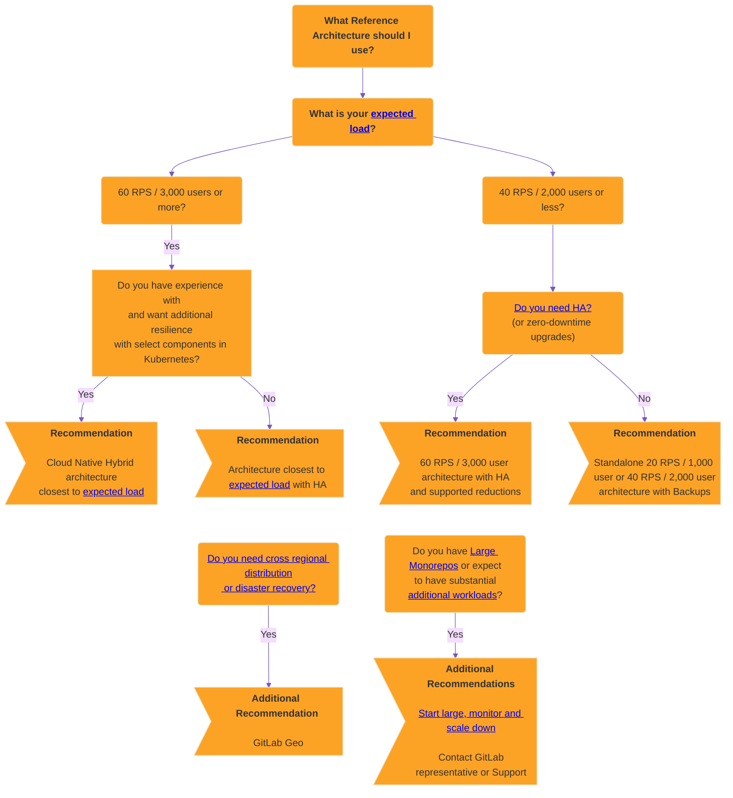



- プラン: Free、Premium、Ultimate
- 提供形態: GitLab Self-Managed



GitLabリファレンスアーキテクチャは、GitLabを大規模にデプロイするために検証済みの本番環境に対応した設計になっています。各アーキテクチャは、要件に応じて使用または調整できる詳細な仕様を提供します。

## 利用可能なリファレンスアーキテクチャ {#available-reference-architectures}

次のリファレンスアーキテクチャは、推奨される環境の開始地点として利用できます。

これらのアーキテクチャは、ユーザー数または1秒あたりのリクエスト数（RPS）に基づいた、ピーク負荷に合わせて名前が付けられています。RPSは、平均的な実際のデータに基づいて計算されます。



各アーキテクチャは、[スケーラブルかつ柔軟性](#scaling-an-environment)を持ったデザインになっています。ワークロードに応じて、上方または下方に適宜調整できます。たとえば、既知の負荷が高いシナリオには、[大規模なモノレポ](#large-monorepos)の使用や、かなりの量の[追加のワークロード](#additional-workloads)などがあります。



各リファレンスアーキテクチャのテスト対象の詳細については、各ページの**テスト手法**セクションを参照してください。

### GitLabパッケージ（Omnibus） {#gitlab-package-omnibus}

Linuxパッケージベースのリファレンスアーキテクチャのリストを次に示します。

- [最大20 RPSまたは1,000ユーザー](1k_users.md)_API: 20 RPS、Web: 2 RPS、Git（プル）: 2 RPS、Git（プッシュ）: 1 RPS_
- [最大40 RPSまたは2,000ユーザー](2k_users.md)_API: 40 RPS、Web: 4 RPS、Git（プル）: 4 RPS、Git（プッシュ）: 1 RPS_
- [最大60 RPSまたは3,000ユーザー](3k_users.md)_API: 60 RPS、Web: 6 RPS、Git（プル）: 6 RPS、Git（プッシュ）: 1 RPS_
- [最大100 RPSまたは5,000ユーザー](5k_users.md)_API: 100 RPS、Web: 10 RPS、Git（プル）: 10 RPS、Git（プッシュ）: 2 RPS_
- [最大200 RPSまたは10,000ユーザー](10k_users.md)_API: 200 RPS、Web: 20 RPS、Git（プル）: 20 RPS、Git（プッシュ）: 4 RPS_
- [最大500 RPSまたは25,000ユーザー](25k_users.md)_API: 500 RPS、Web: 50 RPS、Git（プル）: 50 RPS、Git（プッシュ）: 10 RPS_
- [最大1000 RPSまたは50,000ユーザー](50k_users.md)_API: 1000 RPS、Web: 100 RPS、Git（プル）: 100 RPS、Git（プッシュ）: 20 RPS_

### クラウドネイティブハイブリッド {#cloud-native-hybrid}

次は、選択された推奨コンポーネントをKubernetesで実行できる、クラウドネイティブハイブリッドリファレンスアーキテクチャのリストです。

- [最大40 RPSまたは2,000ユーザー](2k_users.md#cloud-native-hybrid-reference-architecture-with-helm-charts-alternative)_API: 40 RPS、Web: 4 RPS、Git（プル）: 4 RPS、Git（プッシュ）: 1 RPS_
- [最大60 RPSまたは3,000ユーザー](3k_users.md#cloud-native-hybrid-reference-architecture-with-helm-charts-alternative)_API: 60 RPS、Web: 6 RPS、Git（プル）: 6 RPS、Git（プッシュ）: 1 RPS_
- [最大100 RPSまたは5,000ユーザー](5k_users.md#cloud-native-hybrid-reference-architecture-with-helm-charts-alternative)_API: 100 RPS、Web: 10 RPS、Git（プル）: 10 RPS、Git（プッシュ）: 2 RPS_
- [最大200 RPSまたは10,000ユーザー](10k_users.md#cloud-native-hybrid-reference-architecture-with-helm-charts-alternative)_API: 200 RPS、Web: 20 RPS、Git（プル）: 20 RPS、Git（プッシュ）: 4 RPS_
- [最大500 RPSまたは25,000ユーザー](25k_users.md#cloud-native-hybrid-reference-architecture-with-helm-charts-alternative)_API: 500 RPS、Web: 50 RPS、Git（プル）: 50 RPS、Git（プッシュ）: 10 RPS_
- [最大1000 RPSまたは50,000ユーザー](50k_users.md#cloud-native-hybrid-reference-architecture-with-helm-charts-alternative)_API: 1000 RPS、Web: 100 RPS、Git（プル）: 100 RPS、Git（プッシュ）: 20 RPS_

## はじめに {#before-you-start}

まず、Self-Managedアプローチがご自身とその要件に適した選択肢であるかどうかを検討してください。

本番環境ではどんなアプリケーションでも実行は複雑であり、それはGitLabにおいても同様です。できる限りスムーズに実行できることを目指していますが、設計に基づく一般的な複雑さは依然として存在します。通常、ハードウェア、オペレーティングシステム、ネットワーク構築、ストレージ、セキュリティ、GitLab自体など、すべての側面を管理する必要があります。これには、環境の初期設定だけでなく長期的なメンテナンスも含まれます。

このアプローチを採用することを決定した場合、本番環境でのアプリケーションの実行と保守に関する実務知識が必要です。実務知識がない場合、[プロフェッショナルサービス](https://about.gitlab.com/services/#implementation-services)チームが導入サービスを提供します。より長期的なマネージドソリューションを希望する方は、[GitLab SaaS](../../subscriptions/gitlab_com/_index.md)や[GitLab Dedicated](../../subscriptions/gitlab_dedicated/_index.md)などの他のプランをご検討ください。

GitLab Self-Managedアプローチの使用を検討している場合は、このページ全体、特に次のセクションをよくお読みになることをおすすめします。

- [どのアーキテクチャを使用するかを決定する](#deciding-which-architecture-to-start-with)
- [大規模なモノレポ](#large-monorepos)
- [追加のワークロード](#additional-workloads)

## どのアーキテクチャで始めるかを決定する {#deciding-which-architecture-to-start-with}

リファレンスアーキテクチャは、パフォーマンス、復元性、コストという3つの重要な要素のバランスを取るように設計されています。これらは、GitLabを大規模にセットアップするのを容易にする目的があります。ただし、どれが要件を満たし、どこから開始すればよいかを知ることは依然として難しい場合があります。

一般的なガイドとして、**環境のパフォーマンスや復元性を高めたいほど、複雑になります**。

このセクションでは、リファレンスアーキテクチャを選択する際に考慮すべき事項について説明します。

### 予想される負荷（RPSまたはユーザー数） {#expected-load-rps-or-user-count}

適切なアーキテクチャのサイズは、主に環境で予想されるピーク負荷によって決まります。この負荷のもっとも客観的な尺度は、ピーク時に環境へ送られる1秒あたりのリクエスト数（RPS）です。

各アーキテクチャは、さまざまなタイプのリクエスト（API、Web、Git）に対して特定のRPSターゲットを処理するように設計されています。これらの詳細については、各ページの**テスト手法**セクションで説明されています。

RPSの特定は、特定の環境設定とモニタリングスタックによって大きく異なる場合があります。利用可能なオプションには、次のようなものがあります。

- [GitLab Prometheus](../monitoring/prometheus/_index.md#sample-prometheus-queries)と`sum(irate(gitlab_transaction_duration_seconds_count{controller!~'HealthController|MetricsController'}[1m])) by (controller, action)`のようなクエリ。
- GitLabサポートからの[`get-rps`スクリプト](https://gitlab.com/gitlab-com/support/toolbox/dotfiles/-/blob/main/scripts/get-rps.rb?ref_type=heads)
- その他のモニタリングソリューション。
- ロードバランサーの統計。

RPSを特定できない場合は、負荷カテゴリごとの同等のユーザー数に基づく代替サイズ設定方法を提供しています。この数は、手動および自動での使用状況の両方を考慮して、一般的なRPS値にマッピングされます。

#### 初期サイズ設定ガイド {#initial-sizing-guide}

予想される負荷に対してどのアーキテクチャを選択するかを判断するには、次の初期サイズ設定ガイドの表を参照してください。

<table class="ra-table">
  <col>
  <tr>
    <th style="text-align: center" rowspan="2"> 負荷カテゴリ</th>
    <th style="text-align: center" colspan="4" scope="colgroup">1秒あたりのリクエスト数（RPS）</th>
    <th rowspan="2" style="text-align: center"> 一般的なユーザー数</th>
    <th rowspan="2" style="text-align: center"> リファレンスアーキテクチャ</th>
  </tr>
  <tr>
    <th scope="col" style="text-align: center">API</th>
    <th scope="col" style="text-align: center">Web</th>
    <th scope="col" style="text-align: center">Gitプル</th>
    <th scope="col" style="text-align: center">Gitプッシュ</th>
  </tr>
  <tr>
    <td>XS</td>
    <td>20</td>
    <td>2</td>
    <td>2</td>
    <td>1</td>
    <td>1,000</td>
    <th scope="row"><a href="https://docs.gitlab.com/ee/administration/reference_architectures/1k_users.html">最大20 RPSまたは1,000ユーザー</a></th>
  </tr>
  <tr>
    <td>S</td>
    <td>40</td>
    <td>4</td>
    <td>4</td>
    <td>1</td>
    <td>2,000</td>
    <th scope="row"><a href="https://docs.gitlab.com/ee/administration/reference_architectures/2k_users.html">最大40 RPSまたは2,000ユーザー</a></th>
  </tr>
  <tr>
    <td>M</td>
    <td>60</td>
    <td>6</td>
    <td>6</td>
    <td>1</td>
    <td>3,000</td>
    <th scope="row"><a href="https://docs.gitlab.com/ee/administration/reference_architectures/3k_users.html">最大60 RPSまたは3,000ユーザー</a></th>
  </tr>
  <tr>
    <td>L</td>
    <td>100</td>
    <td>10</td>
    <td>10</td>
    <td>2</td>
    <td>5,000</td>
    <th scope="row"><a href="https://docs.gitlab.com/ee/administration/reference_architectures/5k_users.html">最大100 RPSまたは5,000ユーザー</a></th>
  </tr>
  <tr>
    <td>XL</td>
    <td>200</td>
    <td>20</td>
    <td>20</td>
    <td>4</td>
    <td>10,000</td>
    <th scope="row"><a href="https://docs.gitlab.com/ee/administration/reference_architectures/10k_users.html">最大200 RPSまたは10,000ユーザー</a></th>
  </tr>
  <tr>
    <td>2XL</td>
    <td>500</td>
    <td>50</td>
    <td>50</td>
    <td>10</td>
    <td>25,000</td>
    <th scope="row"><a href="https://docs.gitlab.com/ee/administration/reference_architectures/25k_users.html">最大500 RPSまたは25,000ユーザー</a></th>
  </tr>
  <tr>
    <td>3XL</td>
    <td>1,000</td>
    <td>100</td>
    <td>100</td>
    <td>20</td>
    <td>50,000</td>
    <th scope="row"><a href="https://docs.gitlab.com/ee/administration/reference_architectures/50k_users.html">最大1000 RPSまたは50,000ユーザー</a></th>
  </tr>
</table>



初期アーキテクチャを選択する前に、このセクションをよく確認してください。高可用性（HA）や大規模なモノレポの使用などの他の要因も考慮してください。これらはRPSまたはユーザー数以上に選択に影響を与える可能性があります。



#### 迷った場合は、大きめの設定で開始し、モニタリングしてからスケールダウンする {#if-in-doubt-start-large-monitor-and-then-scale-down}

必要な環境サイズが不明な場合は、大きめの設定で開始し、[モニタリング](#monitoring)してから、メトリクスが運用状況をサポートする場合は、それに応じて[スケールダウン](#scaling-an-environment)することを検討してください。

大きめの設定で開始してからスケールダウンするのが賢明なアプローチであるのは、次のような場合です。

- RPSを特定できない
- 環境負荷が予想よりも異常に高い可能性がある
- [大規模なモノレポ](#large-monorepos)またはかなりの量の[追加のワークロード](#additional-workloads)がある

たとえば、3,000のユーザーがいて、同時負荷を大幅に増加させる自動化が実行されていることもわかっている場合は、100 RPS / 5,000ユーザーのクラス環境で開始してモニタリングし、メトリクスがそれをサポートする場合は、すべてのコンポーネントを一度に、または1つずつスケールダウンします。

### スタンドアロン（非HA） {#standalone-non-ha}

2,000以下のユーザーにサービスを提供する環境では、通常、非HA、単一またはマルチノード環境をデプロイする、スタンドアロンアプローチに従うことをおすすめします。このアプローチでは、リカバリーのための[自動バックアップ](../backup_restore/backup_gitlab.md#configuring-cron-to-make-daily-backups)などの戦略を採用できます。これらの戦略は、HAに伴う複雑さを回避する一方、適切なレベルの目標リカバリー時間（RTO）または目標リカバリー時点（RPO）を提供します。

スタンドアロンセットアップ、特に単一ノード環境では、[インストール](../../install/_index.md)と管理にさまざまなオプションを利用できます。オプションには、複雑さをさらに軽減する[特定のクラウドプロバイダーマーケットプレースを使用して直接デプロイする機能](https://page.gitlab.com/cloud-partner-marketplaces.html)が含まれます。

### 高可用性（HA） {#high-availability-ha}

高可用性により、GitLabセットアップのすべてのコンポーネントが、さまざまなメカニズムを通じて障害を処理できるようになります。ただし、これを実現するのは複雑であり、必要な環境は相当な規模になる可能性があります。

3,000以上のユーザーにサービスを提供する環境では、通常、HA戦略を使用することをおすすめします。このレベルでは、環境が停止するとより多くのユーザーに大きな影響を与えます。この範囲のすべてのアーキテクチャには、この理由から、設計上HAが組み込まれています。

#### 高可用性（HA）の必要性 {#do-you-need-high-availability-ha}

前述のように、HAの実現にはコストがかかります。各コンポーネントを増やす必要があるため、環境要件は相当な規模になり、実際のコストとメンテナンスコストが追加されます。

ユーザー数が3,000未満のお客様の多くにとっては、バックアップ戦略で十分であり、その方が好ましいことがわかっています。リカバリー時間が長くなりますが、アーキテクチャがはるかに小さくなり、結果としてメンテナンスコストも削減されます。

一般的なガイドラインとして、HAは次のシナリオでのみ採用してください。

- ユーザーが3,000以上の場合。
- GitLabがダウンすると、ワークフローに重大な影響を与える場合。

#### スケールダウンした高可用性（HA）アプローチ {#scaled-down-high-availability-ha-approach}

ユーザー数が少なくてもHAが必要な場合は、[3Kアーキテクチャ](3k_users.md#supported-modifications-for-lower-user-counts-ha)を調整した形で実現できます。

#### ゼロダウンタイムアップグレード {#zero-downtime-upgrades}

[ゼロダウンタイムアップグレード](../../update/zero_downtime.md)は、HAを備えた標準環境で使用できます（クラウドネイティブハイブリッドは[サポートされていません](https://gitlab.com/groups/gitlab-org/cloud-native/-/epics/52)）。これにより、アップグレード中も環境を維持できます。ただし、このプロセスは結果としてより複雑になり、ドキュメントで詳しく説明されているように、いくつかの制限があります。

このプロセスを実行する場合、HAメカニズムが有効になるときに、ごく短時間ダウンタイムが発生する可能性があることに注意してください。

ほとんどの場合、アップグレードに必要なダウンタイムはそれほど長くはありません。これが重要な要件である場合にのみ、このアプローチを採用してください。

### クラウドネイティブハイブリッド（Kubernetes HA） {#cloud-native-hybrid-kubernetes-ha}

HAと復元性をさらに高めるために、クラウドネイティブハイブリッドリファレンスアーキテクチャとして知られるKubernetesにあるいくつかのコンポーネントをデプロイできます。安定性の理由から、Gitalyなどのステートフルコンポーネントは[Kubernetesにデプロイできません](#stateful-components-in-kubernetes)。

代わりにクラウドネイティブハイブリッドを使うことができますが、標準のリファレンスアーキテクチャと比較して**高度な**セットアップです。Kubernetesでのサービスの実行は複雑です。Kubernetesに関する十分な実務知識と経験がある場合にのみ、**このセットアップを使用**してください。

### GitLab Geo（地域間分散/ディザスタリカバリー） {#gitlab-geo-cross-regional-distribution--disaster-recovery}

[GitLab Geo](../geo/_index.md)を使用すると、完全なディザスターリカバリー（DR）セットアップを使って、さまざまな地域で分散環境を実現できます。GitLab Geoでは、少なくとも2つの個別の環境が必要です。

- 1つのプライマリサイト。
- レプリカとして機能する1つ以上のセカンダリサイト。

プライマリサイトが利用できなくなった場合は、いずれかのセカンダリサイトにフェイルオーバーできます。

DRがご自身の環境にとって重要な要件である場合にのみ、この**高度で複雑な**セットアップを使用してください。また、各サイトの設定方法について、追加の決定を行う必要もあります。たとえば、各セカンダリサイトをプライマリサイトと同じアーキテクチャにするか、各サイトをHA用に設定するかなどです。

### 大規模なモノレポ/追加ワークロード {#large-monorepos--additional-workloads}

[大規模なモノレポ](#large-monorepos)または大量の[追加ワークロード](#additional-workloads)は、環境のパフォーマンスに著しい影響を与える可能性があります。状況に応じて、何らかの調整が必要になる場合があります。

この状況に該当する場合は、GitLabの担当者または[サポート](https://about.gitlab.com/support/)にご連絡いただき、詳細なガイダンスをお求めください。

### クラウドプロバイダーサービス {#cloud-provider-services}

前述のすべての戦略において、PostgreSQLデータベースやRedisなどの同等のクラウドプロバイダーサービスで、いくつかのGitLabコンポーネントを実行できます。

詳細については、[推奨されるクラウドプロバイダーとサービス](#recommended-cloud-providers-and-services)を参照してください。

### 意思決定ツリー {#decision-tree}

次の意思決定ツリーを参照する前に、前述のガイダンスをすべてお読みください。

## 要件 {#requirements}

リファレンスアーキテクチャを実装する前に、次の要件とガイダンスを参照してください。

### サポートされているマシンタイプ {#supported-machine-types}

これらのアーキテクチャは、一貫したパフォーマンスを確保しながら、柔軟にマシンタイプを選択できるように設計されています。各リファレンスアーキテクチャで特定のマシンタイプの例を示していますが、これらは推奨されるデフォルトを意図したものではありません。

次の例のように、各コンポーネントに指定された要件を満たすか、それ以上の任意のマシンタイプを使用できます。

- 新世代のマシンタイプ（GCP `n2`シリーズやAWS `m6`シリーズなど）
- ARMベースのインスタンス（AWS Gravitonなど）のような別のアーキテクチャ
- 特定のワークロード特性（より高いネットワーク帯域幅など）により適した代替マシンタイプファミリー

このガイダンスは、AWS RDSなどのクラウドプロバイダーサービスにも適用できます。



パフォーマンスが一貫しないため、「バースト可能」なインスタンスタイプは推奨されません。





テストを実施したマシンタイプやその方法の詳細については、[検証およびテスト結果](#validation-and-test-results)を参照してください。



### サポートされているディスクタイプ {#supported-disk-types}

ほとんどの標準ディスクタイプは、GitLabで動作することが期待されています。ただし、次の点に注意してください。

- Gitalyには、Gitalyストレージに関する特定の[ディスク要件](../gitaly/_index.md#disk-requirements)があります。
- パフォーマンスが一貫しないため、「バースト可能」なディスクタイプの使用は推奨しません。

その他のディスクタイプは、GitLabで動作することが期待されています。耐久性やコストなどの要件に基づいて選択してください。

### サポートされているインフラストラクチャ {#supported-infrastructure}

GitLabは、信頼できるクラウドプロバイダー（AWS、GCP、Azure）やそれらのサービス、または次の両方を満たすSelf-Managed（ESXi）などのほとんどのインフラストラクチャで実行できます。

- 各アーキテクチャで詳述されている仕様。
- このセクションのすべての要件。

ただし、これにより、考えられるすべての組み合わせとの互換性が保証されるわけではありません。

詳細については、[推奨されるクラウドプロバイダーとサービス](#recommended-cloud-providers-and-services)を参照してください。

### ネットワーキング（HA） {#networking-high-availability}

以下は、高可用性構成でGitLabを実行するためのネットワーク要件です。

#### ネットワークレイテンシー {#network-latency}

データベースレプリケーションなど、GitLabアプリケーション全体で同期レプリケーションを可能にするには、ネットワークレイテンシーを可能な限り低くする必要があります。一般に、これは5ミリ秒未満である必要があります。

#### 可用性ゾーン（クラウドプロバイダー） {#availability-zones-cloud-providers}

可用性ゾーン全体へのデプロイはサポートされており、復元性を高めるために推奨されています。一部のコンポーネントはクォーラム投票に奇数のノードを使用するため、GitLabアプリケーションの要件に合わせて奇数のゾーンを使用する必要があります。

#### データセンター（セルフホスト） {#data-centers-self-hosted}

複数のセルフホストデータセンターへのデプロイは可能ですが、慎重な検討が必要です。これには、センター間の同期対応レイテンシー、スプリットブレインシナリオを防ぐための堅牢な冗長ネットワークリンク、地理的に同一リージョンにあるすべてのセンター、および適切なクォーラム投票のための奇数のセンター全体へのデプロイ（[可用性ゾーン](#availability-zones-cloud-providers)など）が必要です。



マルチデータセンターのデプロイに起因するインフラストラクチャ関連の問題について、GitLabサポートを利用できない場合があります。センター全体へのデプロイを選択する場合、一般に自己責任となります。





単一の[GitLab環境を異なるリージョン](#deploying-one-environment-over-multiple-regions)にデプロイすることはサポートされていません。データセンターは、同じリージョンにある必要があります。



### 大規模なモノレポ {#large-monorepos}

アーキテクチャは、ベストプラクティスに従うさまざまなサイズのリポジトリでテストされました。

**ただし、[大規模なモノレポ](../../user/project/repository/monorepos/_index.md)（数ギガバイト以上）は、Gitのパフォーマンス、ひいては環境そのものに大きな影響を与える可能性があります**。大規模モノレポとその使用方法は、Gitalyから基盤となるインフラストラクチャまで、システム全体に大きな負担をかける可能性があります。

パフォーマンスへの影響は、主にソフトウェアの性質に起因します。ハードウェアリソースを追加しても、あまり効果はありません。



この状況に該当する場合は、リンク先のドキュメントに従い、GitLabの担当者または[サポートチーム](https://about.gitlab.com/support/)にご連絡いただき、詳細なガイダンスをお求めになることを強くおすすめします。



大規模なモノレポには、相応のコストがかかります。そのようなリポジトリがある場合は、パフォーマンスを良好に保ち、コストを抑制するために、次のガイダンスに従ってください。

- [大規模なモノレポを最適化](../../user/project/repository/monorepos/_index.md)します。バイナリを保存しないように[LFS](../../user/project/repository/monorepos/_index.md#use-git-lfs-for-large-binary-files)などの機能を使用したり、リポジトリのサイズを縮小する別のアプローチを使用したりすると、パフォーマンスが大幅に向上し、コストを削減できる可能性があります。
- モノレポによっては、それを補うために環境仕様を引き上げることが必要になる場合があります。Gitalyでは、Praefect、GitLab Rails、およびロードバランサーとともに、追加のリソースが必要になる場合があります。これは、モノレポ自体とその使用状況によって異なります。
- モノレポが非常に大きい場合（20ギガバイト以上）、さらに仕様を強化したり、場合によってはモノレポ専用のGitalyバックエンドを別途用意するなど、さらなる対策が必要になることがあります。
- ネットワークとディスクの帯域幅は、大規模なモノレポで考慮すべきもう1つの潜在的な要素です。負荷が非常に高い状況では、（CIなどの）同時クローンが多数存在する場合、帯域幅が飽和状態になる可能性があります。このシナリオでは、[可能な限りフルクローンを削減してください](../../user/project/repository/monorepos/_index.md#reduce-concurrent-clones-in-cicd)。それ以外の場合は、帯域幅を増やすために、環境仕様を追加する必要になることがあります。これは、クラウドプロバイダーによって異なります。

### 追加のワークロード {#additional-workloads}

これらのアーキテクチャは、実際のデータに基づいた標準的なGitLabのセットアップ用に[設計およびテスト](#validation-and-test-results)されています。

ただし、追加のワークロードは、フォローアップアクションをトリガーすることにより、操作の影響を増幅させる可能性があります。以下を使用する場合は、処理能力を補うため、推奨される仕様を調整することが必要かもしれません。

- ノード上のセキュリティソフトウェア。
- [大規模リポジトリ](../../user/project/repository/monorepos/_index.md)に対する数百もの同時CIジョブ。
- [高頻度で実行される](../logs/log_parsing.md#print-top-api-user-agents)カスタムスクリプト。
- 多くの大規模プロジェクトにおける[インテグレーション](../../integration/_index.md)。
- [サーバーフック](../server_hooks.md)。
- [システムフック](../system_hooks.md)。

通常、変更が必要な場合に通知するために、追加のワークロードの影響を測定するための堅牢なモニタリングを導入する必要があります。GitLabの担当者または[サポートチーム](https://about.gitlab.com/support/)にご連絡いただき、詳細なガイダンスをお求めください。

### ロードバランサー {#load-balancers}

アーキテクチャでは、クラスに応じて最大2つのロードバランサーを使用します。

- 外部ロードバランサー - 外部に面したコンポーネント（主にRails）にトラフィックを送信します。
- 内部ロードバランサー - PraefectやPgBouncerなど、HA構成でデプロイされたいくつかの内部コンポーネントにトラフィックを送信します。

どのロードバランサーを使用するか、またはその正確な設定に関する詳細は、GitLabドキュメントの範囲外です。もっとも一般的なオプションは、マシンノードにロードバランサーを設定するか、クラウドプロバイダーが提供するサービスなどを使用することです。クラウドネイティブハイブリッド環境をデプロイする場合、チャートはKubernetes Ingressを使用して外部ロードバランサーのセットアップを処理できます。

各アーキテクチャクラスには、マシンに直接デプロイするのに推奨されるベースマシンサイズが含まれています。ただし、選択したロードバランサーや予想されるワークロードなどの要因に基づいて調整が必要になる場合があります。マシンはさまざまな[ネットワーク帯域幅](#network-bandwidth)を持つ可能性があり、それも考慮に入れる必要があります。

次のセクションでは、ロードバランサーに関する追加のガイダンスを提供します。

#### バランシングアルゴリズム {#balancing-algorithm}

ノードへの呼び出しを均等に分散させ、良好なパフォーマンスを確保するには、可能な限り最小接続ベースのロードバランシングアルゴリズムまたは同等のものを使用します。

ラウンドロビンアルゴリズムは、実際の運用では接続を均等に分散させないことが知られているため、推奨しません。

#### ネットワーク帯域幅 {#network-bandwidth}

マシンにデプロイされたときにロードバランサーが利用できる合計ネットワーク帯域幅は、クラウドプロバイダー間で著しく異なる場合があります。[AWS](https://docs.aws.amazon.com/AWSEC2/latest/UserGuide/ec2-instance-network-bandwidth.html)などの一部のクラウドプロバイダーは、クレジットを使用したバーストシステムで動作するため、任意のタイミングで利用できる帯域幅が決まる場合があります。

ロードバランサーに必要なネットワーク帯域幅は、データの形式やワークロードなどの要因によって異なります。各アーキテクチャクラスに推奨されるベースサイズは、実際のデータに基づいて選択されています。ただし、[大規模なモノレポ](#large-monorepos)の一貫したクローンのような一部のシナリオでは、サイズをそれに応じて調整する必要がある場合があります。

### スワップなし {#no-swap}

リファレンスアーキテクチャでは、スワップは推奨されていません。スワップは、パフォーマンスに大きな影響を与えるフェイルセーフです。アーキテクチャは、ほとんどの場合、スワップの必要性を回避するのに十分なメモリを持つように設計されています。

### Praefect PostgreSQL {#praefect-postgresql}

[Praefectには独自のデータベースサーバーが必要です](../gitaly/praefect/configure.md#postgresql)。完全なHAを実現するには、サードパーティのPostgreSQLデータベースソリューションが必要です。

将来的には、これらの制限に対する組み込みソリューションを提供したいと考えています。それまでの間、仕様に反映されているようにLinuxパッケージを使用して、非HA PostgreSQLサーバーをセットアップできます。詳細については、次のイシューを参照してください。

- [`omnibus-gitlab#7292`](https://gitlab.com/gitlab-org/omnibus-gitlab/-/issues/7292)。
- [`gitaly#3398`](https://gitlab.com/gitlab-org/gitaly/-/issues/3398)。

## 推奨されるクラウドプロバイダーとサービス {#recommended-cloud-providers-and-services}



次のリストはすべてを網羅したものではありません。ここにリストされていない他のクラウドプロバイダーも同じ仕様で動作する可能性がありますが、検証されていません。ここにリストされていないクラウドプロバイダーサービスについては、各実装が大きく異なる可能性があるため、注意して使用してください。本番環境で使用する前に十分にテストしてください。



次のアーキテクチャは、テストと実際の使用状況に基づいて、次のクラウドプロバイダーに推奨されます。

<table>
<thead>
  <tr>
    <th>リファレンスアーキテクチャ</th>
    <th>GCP</th>
    <th>AWS</th>
    <th>Azure</th>
    <th>ベアメタル</th>
  </tr>
</thead>
<tbody>
  <tr>
    <td>Linuxパッケージ</td>
    <td>🟢</td>
    <td>🟢</td>
    <td>🟢1</td>
    <td>🟢</td>
  </tr>
  <tr>
    <td>クラウドネイティブハイブリッド</td>
    <td>🟢</td>
    <td>🟢</td>
    <td></td>
    <td></td>
  </tr>
</tbody>
</table>

さらに、次のクラウドプロバイダーサービスをアーキテクチャの一部として使用することをおすすめします。

<table>
<thead>
  <tr>
    <th>クラウドサービス</th>
    <th>GCP</th>
    <th>AWS</th>
    <th>Azure</th>
    <th>ベアメタル</th>
  </tr>
</thead>
<tbody>
  <tr>
    <td>オブジェクトストレージ</td>
    <td>🟢   <a href="https://cloud.google.com/storage" target="_blank">Cloud Storage</a></td>
    <td>🟢   <a href="https://aws.amazon.com/s3/" target="_blank">S3</a></td>
    <td>🟢   <a href="https://azure.microsoft.com/en-gb/products/storage/blobs" target="_blank">Azure Blob Storage</a></td>
    <td>🟢   <a href="https://min.io/" target="_blank">MinIO</a></td>
  </tr>
  <tr>
    <td>データベース</td>
    <td>🟢   <a href="https://cloud.google.com/sql" target="_blank" rel="noopener noreferrer">Cloud SQL1</a></td>
    <td>🟢   <a href="https://aws.amazon.com/rds/" target="_blank" rel="noopener noreferrer">RDS</a></td>
    <td>🟢   <a href="https://azure.microsoft.com/en-gb/products/postgresql/" target="_blank" rel="noopener noreferrer">Azure Database for PostgreSQLフレキシブルサーバー</a></td>
    <td></td>
  </tr>
  <tr>
    <td>Redis</td>
    <td>🟢   <a href="https://cloud.google.com/memorystore" target="_blank" rel="noopener noreferrer">Memorystore</a></td>
    <td>🟢   <a href="https://aws.amazon.com/elasticache/" target="_blank" rel="noopener noreferrer">ElastiCache</a></td>
      <td>🟢   <a href="https://azure.microsoft.com/en-gb/products/cache" target="_blank" rel="noopener noreferrer">Azure Cache for Redis (Premium)</a></td>
    <td></td>
  </tr>
</tbody>
</table>

<!-- Disable ordered list rule https://github.com/DavidAnson/markdownlint/blob/main/doc/Rules.md#md029---ordered-list-item-prefix -->
<!-- markdownlint-disable MD029 -->
1. 最適なパフォーマンスを得るには、特に大規模環境（500 RPS / 25,000ユーザー以上）では、GCP Cloud SQLに[Enterprise Plus Edition](https://cloud.google.com/sql/docs/editions-intro)を使用してください。ワークロードによっては、サービスのデフォルトよりも大きな最大接続数を指定する必要がある場合があります。
2. 良好なパフォーマンスを確保するには、[Azure Cache for RedisのPremiumプラン](https://learn.microsoft.com/en-us/azure/azure-cache-for-redis/cache-overview#service-tiers)をデプロイします。
<!-- markdownlint-enable MD029 -->

### データベースサービスのベストプラクティス {#best-practices-for-the-database-services}

サードパーティの外部サービスを使用する場合は、標準的でパフォーマンスが良く、[サポートされているPostgreSQLバージョン](../../install/requirements.md#postgresql)を実行する[外部データベースサービス](../postgresql/external.md)を使用し、次の考慮事項に注意してください。

1. HA LinuxパッケージPostgreSQLのセットアップには、PostgreSQL、PgBouncer、Consulが含まれます。サードパーティの外部サービスを使用する場合、これらのコンポーネントはすべて不要になります。
1. 最適なパフォーマンスを得るには、読み取りレプリカで[データベースロードバランシング](../postgresql/database_load_balancing.md)を有効にします。ノード数を標準のLinuxパッケージのデプロイで使用されている数に合わせます。このアプローチは、大規模環境（1秒あたり200を超えるリクエスト、または10,000を超えるユーザー）において特に重要です。
1. オプションはサービスごとに異なるため、このセットアップではデータベース接続プーラーは必要ありません。その結果、環境サイズに応じて接続数の設定を調整する必要がある場合があります。プーリングが必要な場合は、GitLab LinuxパッケージにバンドルされているPgBouncerはパッケージにバンドルされているPostgresとのみ互換性があるため、サードパーティのオプションを検討する必要があります。[データベースロードバランシング](../postgresql/database_load_balancing.md)を使用して、負荷を適切に分散することもできます。
   - プーラーがクラウドプロバイダーサービスに含まれている場合は、ボトルネックなしに総負荷を処理できることを確認してください。たとえば、Azure Database for PostgreSQLフレキシブルサーバーは、オプションでデータベースの前にPgBouncerプーラーをデプロイできます。ただし、PgBouncerはシングルスレッドであるため、高負荷時にはボトルネックが発生する可能性があります。この問題を軽減するには、データベースロードバランシングを使用して、プーラーを複数のノードに分散させることができます。
1. HAに必要なノード数は、サービスによって異なる場合があります。あるデプロイの要件は、Linuxパッケージインストールとは異なる場合があります。

1. [GitLab Geo](../geo/_index.md)を使用するには、サービスがリージョン間のレプリケーションをサポートしている必要があります。

#### サポートされていないデータベースサービス {#unsupported-database-services}

次のデータベースクラウドプロバイダーサービスは、サポートの欠如または既知の問題があるため推奨されません。

- [Amazon Aurora](https://aws.amazon.com/rds/aurora/)は互換性がなく、サポートされていません。詳細については、[14.4.0](https://archives.docs.gitlab.com/17.3/ee/update/versions/gitlab_14_changes/#1440)を参照してください。
- [Azure Database for PostgreSQL単一サーバー](https://azure.microsoft.com/en-gb/products/postgresql/#overview)は、現在サービスが推奨されておらず、サポートされていないバージョンのPostgreSQLで実行されるため、サポートされていません。また、パフォーマンスと安定性の問題があります。
- [Google AlloyDB](https://cloud.google.com/alloydb)および[Amazon RDS Multi-AZ DBクラスター](https://docs.aws.amazon.com/AmazonRDS/latest/UserGuide/multi-az-db-clusters-concepts.html)はテストされておらず、推奨されていません。どちらのソリューションもGitLab Geoでは動作しないことが予想されます。
  - [Amazon RDS Multi-AZ DBインスタンス](https://docs.aws.amazon.com/AmazonRDS/latest/UserGuide/Concepts.MultiAZSingleStandby.html)は別の製品であり、サポートされています。

### Redisサービスのベストプラクティス {#best-practices-for-redis-services}

標準的でパフォーマンスが良く、サポートされているバージョンを実行する[外部Redisサービス](../redis/replication_and_failover_external.md#redis-as-a-managed-service-in-a-cloud-provider)を使用してください。サービスは以下をサポートしている必要があります。

- Redisスタンドアロン（Primary x Replica）モード - Redis Clusterモードは特にサポートされていません
- レプリケーションによる高可用性
- [Redisエビクションポリシー](../redis/replication_and_failover_external.md#setting-the-eviction-policy)を設定する機能

Redisは基本的にシングルスレッドです。200 RPS / 10,000ユーザー以上のクラスをターゲットとする環境では、最適なパフォーマンスを実現するために、インスタンスをキャッシュと永続データに分離します。



現時点では、RedisサービスのServerlessバリアントはサポートされていません。



### オブジェクトストレージのベストプラクティス {#best-practices-for-object-storage}

GitLabは、動作が期待される[さまざまなオブジェクトストレージプロバイダー](../object_storage.md#supported-object-storage-providers)に対してテストされています。

完全なS3互換性を持つ信頼できるソリューションを使用してください。

## 推奨されるリファレンスアーキテクチャから逸脱する {#deviating-from-the-suggested-reference-architectures}

リファレンスアーキテクチャから離れるほど、サポートを受けるのが難しくなります。逸脱するたびに複雑さが増し、潜在的な問題のトラブルシューティングが難しくなります。

これらのアーキテクチャは、公式のLinuxパッケージまたは[Helm Chart](https://docs.gitlab.com/charts/)を使用して、さまざまなコンポーネントをインストールおよび設定します。コンポーネントは、個別のマシン（仮想化またはベアメタル）にインストールされます。マシンのハードウェア要件は、**設定**列に記載されています。同等の仮想マシン標準サイズは、[利用可能な各アーキテクチャ](#available-reference-architectures)のGCP/AWS/Azure列にリストされています。

Docker Composeを含むDockerでGitLabコンポーネントを実行できます。Dockerは十分にサポートされており、環境全体で一貫した仕様を提供します。ただし、追加のレイヤーであり、サポートが複雑になる可能性があります。たとえば、コンテナで`strace`を実行できないなどです。

### サポートされていないデザイン {#unsupported-designs}

GitLab環境デザインを幅広くサポートすることを目指していますが、特定のアプローチは効果的に機能しません。次のセクションでは、これらのサポートされていないアプローチについて詳しく説明します。

#### Kubernetesのステートフルコンポーネント {#stateful-components-in-kubernetes}

[Gitaly Cluster（Praefect）などのステートフルコンポーネントをKubernetesで実行することはサポートされていません](https://docs.gitlab.com/charts/installation/#configure-the-helm-chart-to-use-external-stateful-data)。

Gitaly Cluster（Praefect）は、従来の仮想マシンでのみサポートされています。Kubernetesは、メモリ使用量を厳密に制限します。ただし、Gitのメモリ使用量は予測できないため、Gitalyポッドがメモリ不足（OOM）により突発的に終了する可能性があります。OOMによる終了は、大規模な混乱や潜在的なデータ損失につながります。したがって、KubernetesにおけるGitalyのテストおよびサポートはされていません。詳細については、[エピック6127](https://gitlab.com/groups/gitlab-org/-/epics/6127)を参照してください。

これは、PostgresやRedisなどのステートフルコンポーネントに適用されます。特にサポートされていないと明示されていない限り、他のサポートされているクラウドプロバイダーのサービスを使用できます。

#### ステートフルノードのオートスケール {#autoscaling-of-stateful-nodes}

一般的なガイダンスとして、GitLabのステートレスコンポーネント（GitLab RailsやSidekiqなど）のみをオートスケールグループで実行できます。Gitalyなど、ステートを持つ他のコンポーネントは、この構成ではサポートされていません。詳細については、[イシュー2997](https://gitlab.com/gitlab-org/gitaly/-/issues/2997)を参照してください。

これは、PostgresやRedisなどのステートフルコンポーネントに適用されます。特にサポートされていないと明示されていない限り、他のサポートされているクラウドプロバイダーのサービスを使用できます。

一般に[クラウドネイティブハイブリッド構成](#cloud-native-hybrid)は、オートスケールグループよりも推奨されます。Kubernetesは、データベースの移行や[Mailroom](../incoming_email.md)など、1つのノードでのみ実行できるコンポーネントをより適切に処理します。

#### 複数のリージョンに単一の環境をデプロイする {#deploying-one-environment-over-multiple-regions}

GitLabは、複数のリージョンに単一の環境をデプロイすることをサポートしていません。このような構成では、リージョン間の接続が失敗した場合、過度のネットワークレイテンシーやスプリットブレインシナリオなど、重大な問題を引き起こす可能性があります。

Consul、Redis Sentinel、Praefectなど、一部のGitLabコンポーネントは、同期レプリケーションを実行するか、正しく機能するために奇数のノードが必要です。高いレイテンシーでこれらのコンポーネントを複数のリージョンに分散すると、その機能とシステム全体のパフォーマンスに深刻な影響を与える可能性があります。

この制限は、クラウドネイティブハイブリッドの代替構成を含む、考えられるすべてのGitLab環境構成に適用されます。

複数のデータセンターまたはリージョンにGitLabをデプロイするために、包括的なソリューションとして[GitLab Geo](../geo/_index.md)を提供しています。

## 検証およびテスト結果 {#validation-and-test-results}

GitLabは、これらのアーキテクチャの定期的なスモークテストとパフォーマンステストを実施し、準拠していることを確認しています。

### テストの実施方法 {#how-we-perform-the-tests}

テストは、サンプル顧客データから派生した特定のコード化されたワークロードを使用して実施され、TerraformおよびAnsibleを使用した環境デプロイには[GitLab Environment Toolkit（GET）](https://gitlab.com/gitlab-org/gitlab-environment-toolkit)、k6を使用したパフォーマンステストには[GitLab Performance Tool（GPT）](https://gitlab.com/gitlab-org/quality/performance)の両方を利用します。

テストは主にGCPおよびAWSで、ベースライン設定として標準のコンピューティングサービス（GCPの場合はn1シリーズ、AWSの場合はm5シリーズ）を使用して実行されます。これらのマシンタイプは、幅広い互換性を確保するために、もっとも標準的なターゲットとして選択されました。CPUとメモリの要件を満たす異なるマシンタイプまたは新しいマシンタイプの使用は完全にサポートされています。詳細については、[サポートされているマシンタイプ](#supported-machine-types)を参照してください。これらのアーキテクチャは、他のクラウドプロバイダーまたはオンプレミスであるかどうかにかかわらず、仕様を満たすハードウェア上では同様に機能することが期待されます。

### パフォーマンス目標 {#performance-targets}

各リファレンスアーキテクチャは、実際の顧客データに基づいて特定のスループット目標に対してテストされます。1,000ユーザーごとに、以下をテストします。

- API: 20 RPS
- Web: 2 RPS
- Git（プル）: 2 RPS
- Git（プッシュ）: 0.4 RPS（もっとも近い整数に四捨五入）

上記のRPS目標は、CIやその他のワークロードを含む、ユーザー数に対応する環境負荷の実際の顧客データに基づいて選択されました。



テスト環境のコンポーネント間のネットワークレイテンシーは5ミリ秒未満で観測されましたが、これは厳密な要件として意図されていないことに注意してください。



### テストカバレッジと結果 {#test-coverage-and-results}

テストは効果的に設計されており、すべてのリファレンスアーキテクチャの目標に対して十分なカバレッジを提供します。テストの頻度は、アーキテクチャのタイプとサイズによって異なります。

- Linuxパッケージ環境: GCPおよびAWS上のすべてのサイズで毎日または毎週。
- クラウドネイティブ環境: GCPおよびAWSでの選択された設定の毎週のテスト。

テストには、将来のサービス導入の可能性を探るために考慮されているこれらのアーキテクチャのプロトタイプも含まれています。テスト結果は、[リファレンスアーキテクチャWiki](https://gitlab.com/gitlab-org/reference-architectures/-/wikis/Benchmarks/Latest)で公開されています。

## リファレンスアーキテクチャ環境を維持する {#maintaining-a-reference-architecture-environment}

リファレンスアーキテクチャ環境の維持は、一般的に他のGitLab環境と同じです。

このセクションでは、関連分野のドキュメントおよび特定アーキテクチャのノートへのリンクを紹介します。

### 環境をスケールする {#scaling-an-environment}

リファレンスアーキテクチャは、出発点として設計されており、全体を通して柔軟性とスケーラビリティを備えています。パフォーマンス容量の追加やコスト削減などの理由で、デプロイ後に特定のニーズに合わせて環境を調整できます。この動作は想定されています。コンポーネントが使い果たされていることをメトリクスが示唆している場合は、反復的に、または次のアーキテクチャサイズに一括してスケールできます。



コンポーネントが常に指定されたリソースを使い果たしている場合は、大規模なスケールを実行する前に、[サポートチーム](https://about.gitlab.com/support/)にお問い合わせください。



ほとんどのコンポーネントでは、通常どおり、垂直スケーリングおよび水平スケーリングを適用できます。ただし、その前に、以下の注意事項を確認してください。

- PumaまたはSidekiqを垂直方向にスケールする場合、追加の仕様を使用するようにワーカーの量を調整する必要があります。Pumaは、次回の再設定時に自動的にスケールされます。ただし、[事前にSidekiqの設定を変更](../sidekiq/extra_sidekiq_processes.md#start-multiple-processes)する必要があるかもしれません。
- RedisとPgBouncerは、基本的にシングルスレッドです。これらのコンポーネントでCPUが枯渇している場合は、水平方向にスケールアウトする必要があるかもしれません。
- Consul、Redis Sentinel、Praefectコンポーネントは、HA形式でデプロイする場合、投票クォーラムに奇数のノードが必要です。
- 特定コンポーネントを大幅にスケールすると、環境のパフォーマンスに影響を与える顕著な連鎖的な影響が発生する可能性があります。詳細については、[スケーリングの連鎖的な影響](#scaling-knock-on-effects)を参照してください。

逆に、環境が過剰にプロビジョニングされていることを示す堅牢なメトリクスがある場合は、スケールダウンできます。問題がないことを確認するために、スケールダウンするときは反復的なアプローチを取る必要があります。

#### スケーリングの連鎖的な影響 {#scaling-knock-on-effects}

場合によっては、コンポーネントを大幅にスケールすると、ダウンストリームコンポーネントに連鎖的な影響が生じ、パフォーマンスに影響を与える可能性があります。アーキテクチャは、相互に依存するコンポーネントの仕様が一致するように、バランスを考慮して設計されています。特に、コンポーネントをスケールすると、依存する他のコンポーネントに追加のスループットが渡される可能性があります。その結果、これらの依存する他のコンポーネントもスケールしなければならない場合があります。



アーキテクチャは、アップストリームコンポーネントのスケールに対応できるように、柔軟性を持つように設計されています。ただし、念のため、環境に大幅な変更を加える前に、[サポートチーム](https://about.gitlab.com/support/)にお問い合わせください。



次のコンポーネントは、大幅にスケールされた場合に他のコンポーネントに影響を与える可能性があります。

- PumaとSidekiq - PumaまたはSidekiqワーカーを大幅にスケールアップすると、内部ロードバランサー、PostgreSQL（存在する場合はPgBouncer経由）、Gitaly（存在する場合はPraefect経由）、およびRedisへの同時接続数が増加します。
  - Redisは基本的にシングルスレッドです。スループットの増加により、結合されたクラスターでCPUが枯渇する場合は、Redisを個別のインスタンス（たとえば、キャッシュと永続）に分割する必要があるかもしれません。
  - PgBouncerもシングルスレッドですが、スケールアウトすると、新しいプールが追加され、Postgresへの合計接続数が増加する可能性があります。Postgres接続の管理経験がある場合にのみこれを行うことを強くおすすめします。自信がない場合はサポートを求めてください。
- Gitaly Cluster（Praefect）/ PostgreSQL - ノードを追加するための大幅なスケールアウトは、プライマリノードへのレプリケーション呼び出しが増加するため、HAシステムとパフォーマンスに悪影響を与える可能性があります。

#### 非HAアーキテクチャからHAアーキテクチャへのスケーリング {#scaling-from-a-non-ha-to-an-ha-architecture}

ほとんどの場合、環境のリソースを増やすには、垂直スケーリングのみが必要です。ただし、HA環境に移行する場合は、次のコンポーネントをHA形式に切り替えるために追加の手順が必要です。

詳細については、次のドキュメントを参照してください。

- [RedisからRedis Sentinelを使用したマルチノードRedisへ](../redis/replication_and_failover.md#switching-from-an-existing-single-machine-installation)
- [PostgresからConsul + PgBouncerを使用したマルチノードPostgresへ](../postgresql/moving.md)
- [GitalyからGitaly Cluster（Praefect）へ](../gitaly/praefect/_index.md#migrate-to-gitaly-cluster-praefect)

### アップグレード {#upgrades}

リファレンスアーキテクチャ環境のアップグレードは、他のGitLab環境と同じです。詳細については、[GitLabのアップグレード](../../update/_index.md)を参照してください。[ゼロダウンタイムアップグレード](#zero-downtime-upgrades)も利用できます。



リファレンスアーキテクチャは、作成した順序と同じ順序でアップグレードする必要があります。



### モニタリング {#monitoring}

インフラストラクチャと[GitLab](../monitoring/_index.md)は、さまざまなオプションを使用してモニタリングできます。詳細については、いくつかのモニタリングソリューションのドキュメントを参照してください。



GitLabアプリケーションには、ソリューションに接続できる[PrometheusおよびさまざまなPrometheus互換エクスポート機能](../monitoring/prometheus/_index.md)がバンドルされています。



## 更新履歴 {#update-history}

以下は、リファレンスアーキテクチャの大幅な更新の履歴です（2021-01-01以降、昇順）。少なくとも3か月に1回は更新することを目指しています。

変更の完全な履歴は、[GitLabプロジェクト](https://gitlab.com/gitlab-org/gitlab/-/merge_requests?scope=all&state=merged&label_name%5B%5D=Reference%20Architecture&label_name%5B%5D=documentation)で確認できます。

**2025**:

- [2025-08](https://gitlab.com/gitlab-org/gitlab/-/merge_requests/199549): [Gitalyロール](https://docs.gitlab.com/omnibus/roles/#gitaly-roles)を使用するようにGitalyの構成を更新しました。
- [2025-02](https://gitlab.com/gitlab-org/gitlab/-/merge_requests/181145): サポートされているマシンタイプと、リストされている例が推奨するデフォルトとして意図されていないことについて、さらに明確にしました。

**2024**:

- [2024-12](https://gitlab.com/gitlab-org/gitlab/-/merge_requests/175854): 初期サイズを選択するためのガイダンスとして、_大きめで開始する_セクションを追加しました。
- [2024-08](https://gitlab.com/gitlab-org/gitlab/-/merge_requests/164181): RPSの計算方法に関する例をさらにいくつか追加して、予想される負荷セクションを更新しました。
- [2024-08](https://gitlab.com/gitlab-org/gitlab/-/merge_requests/163478): 正しいRedis設定になるように、40 RPSまたは2,000ユーザーページのRedis設定を更新しました。
- [2024-08](https://gitlab.com/gitlab-org/gitlab/-/merge_requests/163506): 2,000のモニタリングノードでPrometheusのSidekiq設定を更新しました。
- [2024-08](https://gitlab.com/gitlab-org/gitlab/-/merge_requests/162144): 追加機能を見つけやすくするために、次のステップのパンくずリストセクションをページに追加しました。
- [2024-05](https://gitlab.com/gitlab-org/gitlab/-/merge_requests/153716): Redis SentinelをRedis自体と併置することに関する最新のガイダンスを示すために、60 RPSまたは3,000ユーザーおよび100 RPSまたは5,000ユーザーのページを更新しました。
- [2024-05](https://gitlab.com/gitlab-org/gitlab/-/merge_requests/153579): より正確なコスト見積もりを提供するために、計算ツールが開始点にすぎず、特定の用途に合わせて調整する必要があることをより適切に反映するように、`Cost to run`セクションの名前を`Cost calculator templates`に変更しました。
- [2024-04](https://gitlab.com/gitlab-org/gitlab/-/merge_requests/149878): GCPのクラウドネイティブハイブリッドのWebserviceノードの推奨サイズを更新しました。また、NGINXポッドの推奨をDaemonSetとしてWebserviceノードプールで実行するように調整しました。
- [2024-04](https://gitlab.com/gitlab-org/gitlab/-/merge_requests/149528): 16 GBの推奨メモリターゲットに従うように、20 RPS / 1,000ユーザーアーキテクチャ仕様を更新しました。
- [2024-04](https://gitlab.com/gitlab-org/gitlab/-/merge_requests/148313): より明確にするため、また適切なサイズ設定に役立てるために、リファレンスアーキテクチャのタイトルを更新してRPSを含めました。
- [2024-02](https://gitlab.com/gitlab-org/gitlab/-/merge_requests/145436): VMにデプロイする場合、ロードバランサーノードの推奨サイズを更新しました。また、ネットワーク帯域幅の考慮事項に関するノートを追加しました。
- [2024-02](https://gitlab.com/gitlab-org/gitlab/-/merge_requests/143539): Sidekiqの最大同時実行設定は非推奨となり、明示的に設定する必要がなくなったため、例から削除しました。
- [2024-02](https://gitlab.com/gitlab-org/gitlab/-/merge_requests/143539): RailsノードでSidekiqを無効にし、アーキテクチャ図を更新するために、2,000のSidekiqの推奨事項を調整しました。
- [2024-01](https://gitlab.com/gitlab-org/gitlab/-/merge_requests/140465): すべてのリファレンスアーキテクチャサイズと最新のクラウドサービスについて、Azureの推奨事項を更新しました。

**2023**:

- [2023-12-12](https://gitlab.com/gitlab-org/gitlab/-/merge_requests/139557): 定評のある製品であれば動作すると予想されることをより反映するように、ロードバランサーに関するノートを更新しました。
- [2023-11-03](https://gitlab.com/gitlab-org/gitlab/-/merge_requests/133457): 各リファレンスアーキテクチャが設計された目的、使用されているテスト方法の詳細を拡大し、環境のスケール方法の詳細を追加しました。
- [2023-11-03](https://gitlab.com/gitlab-org/gitlab/-/merge_requests/134632): ディスクタイプ、オブジェクトストレージ、モニタリングに関する拡張ノートを追加しました。
- [2023-10-25](https://gitlab.com/gitlab-org/gitlab/-/merge_requests/134518): Linuxパッケージロールを使用するようにSidekiq設定例を調整しました。
- [2023-10-15](https://gitlab.com/gitlab-org/gitlab/-/merge_requests/133835): Sidekiqの推奨事項を調整して、2,000に個別のノードを含め、3,000と5,000のインスタンスタイプと数を微調整しました。
- [2023-10-08](https://gitlab.com/gitlab-org/gitlab/-/merge_requests/132270): 大規模なモノレポの使用とその影響に対する認識を高めるために、全体を通してより多くの拡張ノートを追加しました。
- [2023-10-04](https://gitlab.com/gitlab-org/gitlab/-/merge_requests/133258): Task Runnerポッドの名前を新しい名前Toolboxに更新しました。
- [2023-10-02](https://gitlab.com/gitlab-org/gitlab/-/merge_requests/132961): 特に10,000以上で分離されたキャッシュおよび永続サービスを使用する場合、Redisに外部サービスを使用することに関するガイダンスを拡大しました。
- [2023-09-21](https://gitlab.com/gitlab-org/gitlab/-/merge_requests/132289): KubernetesでGitalyを実行する際の課題に関する詳細についてさらに記述しました。
- [2023-09-20](https://gitlab.com/gitlab-org/gitlab/-/merge_requests/132275): 非推奨および削除後にGrafanaへの参照を削除しました。
- [2023-08-30](https://gitlab.com/gitlab-org/gitlab/-/merge_requests/130470): 意思決定ツリーの下のGeoに関するセクションを拡張しました。
- [2023-08-08](https://gitlab.com/gitlab-org/gitlab/-/merge_requests/128529): 設定例を切り替えて、LinuxパッケージのSidekiqロールを使用しました。
- [2023-08-03](https://gitlab.com/gitlab-org/gitlab/-/merge_requests/128374): 50,000アーキテクチャのAWSマシンタイプのスペルミスを修正しました。
- [2023-06-30](https://gitlab.com/gitlab-org/gitlab/-/merge_requests/125017): Linuxパッケージのデフォルトを使用する代わりに、不要になった設定を削除するようにPostgreSQL設定例を更新しました。
- [2023-06-30](https://gitlab.com/gitlab-org/gitlab/-/merge_requests/125017): Google Memorystoreが推奨されることを反映する明示的な例をメインページに追加しました。
- [2023-06-11](https://gitlab.com/gitlab-org/gitlab/-/merge_requests/122063): 3,000および5,000アーキテクチャのIP例を修正しました。
- [2023-05-25](https://gitlab.com/gitlab-org/gitlab/-/merge_requests/121545): 外部クラウドプロバイダーサービスの使用法と、10,000環境以上の分離されたRedisサーバーの推奨事項に関するノートを拡大しました。
- [2023-05-03](https://gitlab.com/gitlab-org/gitlab/-/merge_requests/119224): ドキュメントを更新して、Redis 5ではなくRedis 6の正しい要件を反映しました。
- [2023-04-28](https://gitlab.com/gitlab-org/gitlab/-/merge_requests/114877): Azure Active Directory認証メソッドは、Azure PostgreSQLフレキシブルサービスでの使用ではサポートされていないというノートを追加しました。
- [2023-03-23](https://gitlab.com/gitlab-org/gitlab/-/merge_requests/114877): 既知のサポートされていない設計に関する詳細を追加しました。
- [2023-03-16](https://gitlab.com/gitlab-org/gitlab/-/merge_requests/114872): すべてのコンポーネントが接続できるように、マルチノードのRedis設定例を正しいものに更新しました。
- [2023-03-15](https://gitlab.com/gitlab-org/gitlab/-/merge_requests/110784): Gitaly設定例を新しい形式に更新しました。
- [2023-03-14](https://gitlab.com/gitlab-org/gitlab/-/merge_requests/114495): NFS VMを含まないようにコスト見積もりを更新しました。
- [2023-02-17](https://gitlab.com/gitlab-org/gitlab/-/merge_requests/110379): 新しい形式に従うようにPraefect設定例を更新しました。
- [2023-02-14](https://gitlab.com/gitlab-org/gitlab/-/merge_requests/109798): 自動化が追加のワークロードと見なされる可能性がある例を追加しました。
- [2023-02-13](https://gitlab.com/gitlab-org/gitlab/-/merge_requests/111018): 本番環境ソフトウェアのSelf-Managedの実行に関与することについてより多くのコンテキストを提供するはじめにセクションを新たに追加しました。また、意思決定ツリーセクションにスタンドアロンセットアップとクラウドプロバイダーサービスの詳細を追加しました。
- [2023-02-01](https://gitlab.com/gitlab-org/gitlab/-/merge_requests/110641): あまり知られていない用語である**関与**の代わりに、より一般的な「複雑」という用語を使用するように切り替えました。
- [2023-01-31](https://gitlab.com/gitlab-org/gitlab/-/merge_requests/110328): メインページの要件セクションを拡張および一元化しました。
- [2023-01-26](https://gitlab.com/gitlab-org/gitlab/-/merge_requests/110183):NFSからGitデータを移行すること、オブジェクトデータがNFSで引き続きサポートされていること、および複数のRailsノード間でSSHキーを正しく処理することに関するノートを追加しました。

**2022**:

- [2022-12-14](https://gitlab.com/gitlab-org/gitlab/-/merge_requests/105451): このサポートが`15.6`以降で終了したため、GitデータにNFSを使用するためのガイダンスを削除しました。
- [2022-12-12](https://gitlab.com/gitlab-org/gitlab/-/merge_requests/106826): Amazon RDS Multi-AZ DBクラスターとインスタンスの違いを明確にするノートを追加しました。後者はサポートされています。また、PostgreSQLの最大接続設定を新しいデフォルトの`500`に増やしました。
- [2022-12-12](https://gitlab.com/gitlab-org/gitlab/-/merge_requests/106695): Sidekiqの最大同時実行設定を、新しいデフォルトの`20`と一致するように更新しました。
- [2022-11-16](https://gitlab.com/gitlab-org/gitlab/-/merge_requests/104236): 奇数クォーラムが必要であるという、削減された3,000アーキテクチャセクションのPraefectおよびGitalyのガイダンスを修正しました。
- [2022-11-15](https://gitlab.com/gitlab-org/gitlab/-/merge_requests/103623): クラウドネイティブハイブリッドでGitLabシークレットを処理する方法と、GitLabチャートドキュメントへの追加リンクに関するガイダンスを追加しました。
- [2022-11-14](https://gitlab.com/gitlab-org/gitlab/-/merge_requests/103767): 10,000アーキテクチャのSidekiq設定のスペルミスを修正しました。
- [2022-11-09](https://gitlab.com/gitlab-org/gitlab/-/merge_requests/102746): 大規模なモノレポと追加のワークロードがパフォーマンスに与える影響に関するガイダンスを追加しました。また、SSLに関するロードバランサーのガイダンスと、最小接続ベースのルーティング方法の推奨事項を拡大しました。
- [2022-10-18](https://gitlab.com/gitlab-org/gitlab/-/merge_requests/100826): オブジェクトストレージのガイダンスを調整して、NFSよりも推奨されることを明確にしました。
- [2022-10-11](https://gitlab.com/gitlab-org/gitlab/-/merge_requests/100305): パフォーマンスの問題のため、最大2,000のみを推奨するようにAzureのガイダンスを更新しました。
- [2022-09-27](https://gitlab.com/gitlab-org/gitlab/-/merge_requests/98204):ユーザーが使用するアーキテクチャをより適切に決定できるように、意思決定ツリーセクションを追加しました。
- [2022-09-22](https://gitlab.com/gitlab-org/gitlab/-/merge_requests/98263): オブジェクトストレージのみを使用している場合に、増分ログの生成を有効にするための明示的な手順を追加しました。
- [2022-09-22](https://gitlab.com/gitlab-org/gitlab/-/merge_requests/98184): 推奨されるクラウドプロバイダーとサービスに関するガイダンスを拡張しました。
- [2022-09-09](https://gitlab.com/gitlab-org/gitlab/-/merge_requests/97245): オブジェクトストレージのガイダンスを拡張し、Gitデータに対するNFSのサポートが`15.6`で終了することを更新しました。
- [2022-08-24](https://gitlab.com/gitlab-org/gitlab/-/merge_requests/96150): KubernetesでGitaly Clusterがサポートされていないことに関する明確な注記を追加しました。
- [2022-08-24](https://gitlab.com/gitlab-org/gitlab/-/merge_requests/96021): サポートされているCPUとタイプに関するセクションを追加しました。
- [2022-08-18](https://gitlab.com/gitlab-org/gitlab/-/merge_requests/95713): オブジェクトストレージのサポートをより明確にするために、アーキテクチャテーブルを更新しました。
- [2022-08-17](https://gitlab.com/gitlab-org/gitlab/-/merge_requests/95185): ポッドに十分なリソースが存在するように、2,000アーキテクチャのクラウドネイティブハイブリッドプールの仕様を増やしました。また、Sidekiqワーカーの数を増やしました。
- [2022-08-02](https://gitlab.com/gitlab-org/gitlab/-/merge_requests/93493): GitLab `15.0`以降の新しいGitalyチェックコマンドを使用するためのノートを追加しました。
- [2022-07-25](https://gitlab.com/gitlab-org/gitlab/-/merge_requests/93141): トラブルシューティングセクションをより一般的な場所に移動しました。
- [2022-07-14](https://gitlab.com/gitlab-org/gitlab/-/merge_requests/92144): Amazon Auroraは互換性がなくなり、GitLab `14.4.0`以降ではサポートされないというガイダンスを追加しました。
- [2022-07-07](https://gitlab.com/gitlab-org/gitlab/-/merge_requests/91943): Gitalyストレージ設定から`default`セクションを削除することが必須であるため、注意点を追加しました。
- [2022-06-08](https://gitlab.com/gitlab-org/gitlab/-/merge_requests/86812): 増分ログの生成に関するガイダンスを別のセクションに移動しました。
- [2022-04-29](https://gitlab.com/gitlab-org/gitlab/-/merge_requests/85856): 新しい標準パイプラインでのテスト結果のセクションを拡張しました。
- [2022-04-26](https://gitlab.com/gitlab-org/gitlab/-/merge_requests/85833): 設定名の変更を反映するようにPraefectの設定を更新しました。
- [2022-04-15](https://gitlab.com/gitlab-org/gitlab/-/merge_requests/85231): オブジェクトストレージを正常に有効にするのに不足している設定を追加しました。
- [2022-04-14](https://gitlab.com/gitlab-org/gitlab/-/merge_requests/85107): AWSマシンタイプでクラウドネイティブハイブリッドガイダンスを拡張しました。
- [2022-04-08](https://gitlab.com/gitlab-org/gitlab/-/merge_requests/84389): AWSとAzureのコスト見積もりを追加しました。
- [2022-04-06](https://gitlab.com/gitlab-org/gitlab/-/merge_requests/84483): Prometheusモニタリングの自動検出のために、ほとんどのコンポーネントの設定例を正しく含めるように更新しました。
- [2022-03-30](https://gitlab.com/gitlab-org/gitlab/-/merge_requests/81538): 検証とテスト結果のセクションを、より明確な言語とより詳細な情報で拡張しました。
- [2022-03-21](https://gitlab.com/gitlab-org/gitlab/-/merge_requests/83019): シナリオによっては、Gitalyに追加の仕様が必要になる可能性があるというノートを追加しました。
- [2022-03-04](https://gitlab.com/gitlab-org/gitlab/-/merge_requests/82087): 不要なノードでGitLab `kas`サービスが実行されないようにするためのガイダンスを追加しました。
- [2022-03-01](https://gitlab.com/gitlab-org/gitlab/-/merge_requests/81814): 設定例のPraefect TLSポートのスペルミスを修正しました。
- [2022-02-22](https://gitlab.com/gitlab-org/gitlab/-/merge_requests/81247): Gitaly Packオブジェクトキャッシュを有効にするためのガイダンスを追加しました。
- [2022-02-22](https://gitlab.com/gitlab-org/gitlab/-/merge_requests/80892): 推奨されるクラウドプロバイダーとサービスに関する一般的なセクションを追加しました。
- [2022-02-14](https://gitlab.com/gitlab-org/gitlab/-/merge_requests/80521): GPTテストの追加に関するブログ投稿へのリンクを追加しました。
- [2022-01-26](https://gitlab.com/gitlab-org/gitlab/-/merge_requests/78705): テストプロセスとコストの見積もりを1つのセクションに統合し、詳細を拡張しました。
- [2022-01-13](https://gitlab.com/gitlab-org/gitlab/-/merge_requests/77968): 推奨されるKubernetesプラットフォームに関するガイダンスを拡張しました。

**2021**:

- [2021-12-31](https://gitlab.com/gitlab-org/gitlab/-/merge_requests/77437): 25,000 Redis AWSマシンサイズのスペルミスを修正しました。
- [2021-12-28](https://gitlab.com/gitlab-org/gitlab/-/merge_requests/77243): テストプロセスと結果セクションにクラウドプロバイダーの内訳を追加しました。
- [2021-12-17](https://gitlab.com/gitlab-org/gitlab/-/merge_requests/77039): テストプロセスと結果セクションに詳細を追加しました。
- [2021-12-17](https://gitlab.com/gitlab-org/gitlab/-/merge_requests/77002): 変更された3,000アーキテクチャを使用する場合のデータベースロードバランシングの要件に関するノートを追加しました。
- [2021-12-17](https://gitlab.com/gitlab-org/gitlab/-/merge_requests/76236): 1,000アーキテクチャ（単一ノード）の図を追加しました。
- [2021-12-15](https://gitlab.com/gitlab-org/gitlab/-/merge_requests/76748): 見積もりコスト（GCP）、テストプロセスと結果、およびクラウドプロバイダーサービスのさらなる詳細に関するセクションを追加しました。
- [2021-12-14](https://gitlab.com/gitlab-org/gitlab/-/merge_requests/76226): コンポーネントと推奨されるクラウドプロバイダーサービスに関する外部データベースサービスのガイダンスを拡張しました。
- [2021-11-24](https://gitlab.com/gitlab-org/gitlab/-/merge_requests/74612): データベースロードバランシングに関する推奨事項を追加しました。
- [2021-11-04](https://gitlab.com/gitlab-org/gitlab/-/merge_requests/73634): アーキテクチャに使用されるテストターゲットに関する詳細を追加しました。
- [2021-10-13](https://gitlab.com/gitlab-org/gitlab/-/merge_requests/72052): Redisを使用して増分ログの生成をオプションで有効にするためのガイダンスを追加しました。
- [2021-10-07](https://gitlab.com/gitlab-org/gitlab/-/merge_requests/71784): 必須の`external_url`設定を含めるようにSidekiq設定を更新しました。
- [2021-10-02](https://gitlab.com/gitlab-org/gitlab/-/merge_requests/71576): Gitaly ClusterとGitaly Shardedに関するガイダンスを拡張しました。
- [2021-09-29](https://gitlab.com/gitlab-org/gitlab/-/merge_requests/70625): 小規模なユーザー数で使用するクラウドネイティブハイブリッドアーキテクチャに関する注記を追加しました。
- [2021-09-27](https://gitlab.com/gitlab-org/gitlab/-/merge_requests/70602): Redis SentinelをRedisと同じノード上の横に配置するようにガイダンスを変更しました。
- [2021-08-18](https://gitlab.com/gitlab-org/gitlab/-/merge_requests/67778): 2,000クラウドネイティブハイブリッドアーキテクチャを追加しました。
- [2021-08-04](https://gitlab.com/gitlab-org/gitlab/-/merge_requests/67463): 各アーキテクチャのパフォーマンステスト結果へのリンクを追加しました。
- [2021-07-30](https://gitlab.com/gitlab-org/gitlab/-/merge_requests/67231): 正しい値を持つように、PostgreSQL設定例のレプリケーション設定を修正しました。
- [2021-07-22](https://gitlab.com/gitlab-org/gitlab/-/merge_requests/66185): 3,000クラウドネイティブハイブリッドアーキテクチャを追加しました。
- [2021-07-16](https://gitlab.com/gitlab-org/gitlab/-/merge_requests/66278): RailsとSidekiq間の直接接続がないことを正しく反映するようにアーキテクチャ図を更新しました。
- [2021-07-15](https://gitlab.com/gitlab-org/gitlab/-/merge_requests/65373): REST API認証設定を含めるようにPatroni設定を更新しました。
- [2021-07-15](https://gitlab.com/gitlab-org/gitlab/-/merge_requests/65992): 5,000クラウドネイティブハイブリッドアーキテクチャを追加しました。
- [2021-07-08](https://gitlab.com/gitlab-org/gitlab/-/merge_requests/65154): 25,000クラウドネイティブハイブリッドアーキテクチャを追加しました。
- [2021-06-29](https://gitlab.com/gitlab-org/gitlab/-/merge_requests/64711): 50,000クラウドネイティブハイブリッドアーキテクチャを追加しました。
- [2021-06-23](https://gitlab.com/gitlab-org/gitlab/-/merge_requests/64612): クラウドネイティブハイブリッドのメインページに追加を行い、3,000アーキテクチャを削減しました。
- [2021-06-16](https://gitlab.com/gitlab-org/gitlab/-/merge_requests/63580): 最新の役割を使用し、Geoレプリケーションの準備をするために、PostgreSQLの手順と設定を更新しました。
- [2021-06-14](https://gitlab.com/gitlab-org/gitlab/-/merge_requests/63857): 最新のものに従うように、モニタリングノードの設定例を更新しました。
- [2021-06-11](https://gitlab.com/gitlab-org/gitlab/-/merge_requests/62316): 外部サービスに関するより詳細なノートを拡張しました。
- [2021-06-09](https://gitlab.com/gitlab-org/gitlab/-/merge_requests/63504): GitLabシークレットとデータベースの移行を正しく管理する方法に関する追加のガイダンスを追加および拡張しました。
- [2021-06-09](https://gitlab.com/gitlab-org/gitlab/-/merge_requests/63443): 新しいストレージ形式に従うようにPraefectの設定例を更新しました。
- [2021-06-03](https://gitlab.com/gitlab-org/gitlab/-/merge_requests/61923): Pumaに置き換えられたUnicorn Webサーバーの参照を削除しました。
- [2021-04-23](https://gitlab.com/gitlab-org/gitlab/-/merge_requests/59471): 各ノードで複数のワーカーを正しく設定する方法を示すために、Sidekiq設定例を更新しました。
- [2021-04-23](https://gitlab.com/gitlab-org/gitlab/-/merge_requests/59283): ユーザー数が少ない場合の3,000リファレンスアーキテクチャを変更する方法に関する初期ガイダンスを追加しました。
- [2021-04-13](https://gitlab.com/gitlab-org/gitlab/-/merge_requests/59259): 外部サービス（PostgreSQL、Redis）の使用に関するさらなる説明を追加しました。
- [2021-04-12](https://gitlab.com/gitlab-org/gitlab/-/merge_requests/59139): ロードバランサーとそのルーティング方法の使用に関する追加のガイダンスを追加しました。
- [2021-04-08](https://gitlab.com/gitlab-org/gitlab/-/merge_requests/58885): Praefectのデータベース移行を1つのノードのみが実行するように正しく構成する方法に関するガイダンスを追加しました。
- [2021-04-06](https://gitlab.com/gitlab-org/gitlab/-/merge_requests/57476): より詳細で明確な名前で、10,000クラウドネイティブハイブリッドドキュメントを拡張しました。
- [2021-03-04](https://gitlab.com/gitlab-org/gitlab/-/merge_requests/54454): Gitaly Clusterドキュメントを、他のすべての該当するリファレンスアーキテクチャサイズに拡張しました。
- [2021-02-19](https://gitlab.com/gitlab-org/gitlab/-/merge_requests/54244): 推奨事項に従って、異なるデータ型に分離されたバケットを使用するという追加のオブジェクトストレージガイダンスを追加しました。
- [2021-02-12](https://gitlab.com/gitlab-org/gitlab/-/merge_requests/50852): RailsとSidekiqでオブジェクトストレージを設定するためのドキュメントを追加しました。
- [2021-02-12](https://gitlab.com/gitlab-org/gitlab/-/merge_requests/51928): 10,000リファレンスアーキテクチャ用のGitaly Clusterを設定するためのドキュメントを追加しました。
- [2021-02-09](https://gitlab.com/gitlab-org/gitlab/-/merge_requests/52249): 10,000クラウドネイティブハイブリッドリファレンスアーキテクチャの最初のイテレーションを追加しました。
- [2021-01-07](https://gitlab.com/gitlab-org/gitlab/-/merge_requests/50573): PatroniをPostgreSQLレプリケーションマネージャーとして使用するためのドキュメントを追加しました。

