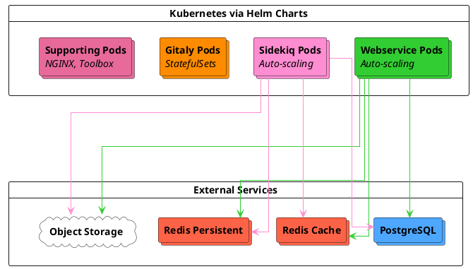



- プラン: Free、Premium、Ultimate
- 提供形態: GitLab Self-Managed
- ステータス: ベータ版



Cloud Native Firstリファレンスアーキテクチャは、ワークロードの特性に基づいた4つの標準サイズ（S/M/L/XL）で、最新のクラウドネイティブなデプロイパターン向けに設計されています。これらのアーキテクチャは、すべてのGitLabコンポーネントをKubernetesにデプロイし、PostgreSQL、Redis、オブジェクトストレージは、マネージドサービスやオンプレミスオプションなどの外部サードパーティソリューションを使用します。

> [!note]
> これらのアーキテクチャは[ベータ](../../policy/development_stages_support.md#beta)版です。フィードバックをお待ちしております。また、本番環境での使用状況データに基づいて仕様の改善を継続していきます。

## アーキテクチャの概要 {#architecture-overview}

Cloud Native Firstアーキテクチャは、Kubernetesと外部サービス全体にGitLabコンポーネントをデプロイします:

**Kubernetes components:**

- **Webservice** \- ウェブリクエストを処理します
- **Sidekiq** \- バックグラウンドジョブを処理します
- **Gitaly** \- 永続ボリュームを持つStatefulSetsを使用してGitリポジトリを管理します
- **Supporting services** \- NGINX Ingress、Toolbox、およびモニタリングコンポーネント

> [!note] 
> Kubernetes上のGitalyは、Gitaly（非クラスター）としてのみデプロイされます。各Gitalyポッドは、それが提供するリポジトリの単一障害点です。Gitaly Cluster（Praefect）は、Kubernetesではサポートされていません。
> 自動フェイルオーバーを備えたGitaly高可用性が必要な場合は、ステートレスコンポーネントをKubernetesで実行しながら、仮想マシン上にGitaly Clusterをデプロイする[Cloud Native Hybridアーキテクチャ](_index.md#cloud-native-hybrid)をご検討ください。Kubernetes上のGitalyの要件と制限については、[Kubernetes上のGitaly](../gitaly/kubernetes.md#requirements)を参照してください。

**External services:**

- **PostgreSQL** \- 高可用性のためのオプションのスタンバイレプリカ、および追加の安定性とパフォーマンスのための読み取りレプリカとともにデプロイされるマネージドデータベースサービス
- **Redis** \- 分離されたキャッシュインスタンスと永続インスタンス。それぞれオプションで高可用性のためのスタンバイレプリカとともにデプロイされます
- **Object Storage** \- アーティファクトおよびパッケージ用のS3、Google Cloud Storage、またはAzure Blob Storageなどのオブジェクトストレージサービス

推奨されるマネージドサービスプロバイダー（GCP Cloud SQL、AWS RDS、Azure Databaseなど）については、[推奨されるクラウドプロバイダーとサービス](_index.md#recommended-cloud-providers-and-services)を参照してください。

## 利用可能なアーキテクチャ {#available-architectures}

これらのアーキテクチャは、一般的な本番環境のワークロードパターンを表すターゲットRPS範囲を中心に設計されています。RPSターゲットは開始点として機能し、特定の容量ニーズはワークロードの構成と使用パターンによって異なります。RPS構成と調整が必要な場合のガイダンスについては、[RPS構成の理解](sizing.md#understanding-rps-composition-and-workload-patterns)を参照してください。

| サイズ | ターゲットRPS | 対象ワークロード |
|------|------------|-------------------|
| S | ≤100 | 開発アクティビティが軽く、自動化が最小限のチーム |
| M | ≤200 | 適度な開発ベロシティと標準的なCI/CD使用量を持つ組織 |
| L | ≤500 | 開発アクティビティが活発で、自動化が大幅に進んでいる大規模なチーム |
| XL | ≤1000 | 集中的なワークロードと広範なインテグレーションを備えたエンタープライズデプロイ |

予想される負荷の特定と適切なサイズの選択に関する詳細なガイダンスについては、[リファレンスアーキテクチャのサイジングガイド](sizing.md)を参照してください。

## 主な利点 {#key-benefits}

Cloud Native Firstアーキテクチャには、次のものがあります:

- **Self-healing infrastructure** \- Kubernetesは、失敗したポッドを自動的に再起動し、正常なノード間でワークロードを再スケジュールします
- **Dynamic resource scaling** \- Horizontal PodオートスケーラーとClusterオートスケーラーは、実際リクエストに基づいて容量を調整します
- **Simplified deployment** \- Kubernetesを介してオーケストレーションされるすべてのGitLabコンポーネントの従来のVM管理はありません
- **Reduced operational overhead** \- PostgreSQL、Redis、およびオブジェクトストレージのマネージドサービスは、データベースとキャッシュのメンテナンスを不要にします
- **Built-in high availability** \- すべてのコンポーネントの自動フェイルオーバーを備えたマルチゾーンデプロイ
- **Improved cost efficiency** \- リソースは、ピーク時の容量を維持しながら、需要の低い期間中にスケールダウンします

## 要件 {#requirements}

Cloud Native Firstアーキテクチャをデプロイする前に、以下があることを確認してください:

- サポートされている[Kubernetesクラスター](https://docs.gitlab.com/charts/installation/cloud/)とその他の[チャートの前提条件](https://docs.gitlab.com/charts/installation/tools/)が整っていること
- データベース、ユーザー、および拡張機能が構成された外部PostgreSQLインスタンス
- 外部Redisインスタンス
- オブジェクトストレージサービス（S3、Google Cloud Storage、Azure Blob Storageなど）

ネットワーキング、マシンタイプ、およびクラウドプロバイダーサービスを含む完全な要件については、[リファレンスアーキテクチャの要件](_index.md#requirements)を参照してください。

Kubernetes上のGitaly固有の要件と制限については、[Kubernetes上のGitalyの要件](../gitaly/kubernetes.md#requirements)を参照してください。

## Small（S） {#small-s}

**Target load:** ≤100 RPS | 全体的な負荷が軽い

**Workload characteristics:**

- **Total RPS range:** 1秒あたり≤100リクエスト
- **Git operations:** Gitプッシュおよびプルアクティビティが軽い
- **Repository size:** アクティブに使用されるモノレポには適していません
- **CI/CD usage:** 同時パイプラインの実行が軽い
- **API traffic:** 自動化されたワークロードの容量が軽い
- **User patterns:** 使用量の急増に対するある程度の耐性

### Kubernetesコンポーネント {#kubernetes-components}

| コンポーネント | ポッドごとのリソース | 最小ポッド/ワーカー | 最大ポッド/ワーカー | ノード構成の例 |
|-----------|------------------|------------------|------------------|---------------------------|
| Webservice | 2 vCPU、3 GB（リクエスト）、4 GB（制限） | 12個のポッド（24人のワーカー） | 18個のポッド（36人のワーカー） | GCP: 6 × n2-standard-8 AWS: 6 × c6i.2xlarge |
| Sidekiq | 900m vCPU、2 GB（リクエスト）、4 GB（制限） | 8人のワーカー | 12人のワーカー | GCP: 3 × n2-standard-4 AWS: 3 × m6i.xlarge |
| Gitaly | 7 vCPU、30 GB（リクエストと制限） | 3個のポッド | 3個のポッド | GCP: 3 × n2-standard-8 AWS: 3 × m6i.2xlarge |
| サポート用ノードプール | サービスごとに異なる | 12 vCPU、48 GB | 12 vCPU、48 GB | GCP: 3 × n2-standard-4 AWS: 3 × c6i.xlarge |

### ポッドのスケーリング構成 {#pod-scaling-configuration}

| コンポーネント | 最小 → 最大ポッド | 最小 → 最大ワーカー | ポッドごとのリソース | ポッドあたりのワーカー |
|-----------|----------------|-------------------|-------------------|-----------------|
| Webservice | 12 → 18 | 24 → 36 | 2 vCPU、3 GB（リクエスト）、4 GB（制限） | 2 |
| Sidekiq | 8 → 12 | 8 → 12 | 900m vCPU、2 GB（リクエスト）、4 GB（制限） | 1 |
| Gitaly | 3（自動スケーリングなし） | 該当なし | 7 vCPU、30 GB（リクエストと制限） | 該当なし |

**Gitaly notes:**Git cgroups: 27 GB、バッファ: 3 GB。リポジトリcgroupは1に設定されています。チューニングのガイダンスについては、[Gitaly cgroups構成](#gitaly-cgroups-configuration)を参照してください。

### 外部サービス {#external-services}

| サービス | 設定 | GCP相当 | AWS相当 |
|---------|---------------|----------------|----------------|
| PostgreSQL | 8 vCPU、32 GB | n2-standard-8 | m6i.2xlarge |
| Redis - キャッシュ | 2 vCPU、8 GB | n2-standard-2 | m6i.large |
| Redis - 永続 | 2 vCPU、8 GB | n2-standard-2 | m6i.large |
| オブジェクトストレージ | クラウドプロバイダーサービス | Google Cloud Storage | Amazon S3 |

## Medium（M） {#medium-m}

**Target load:** ≤200 RPS | 全体的な負荷は中程度

**Workload characteristics:**

- **Total RPS range:** 1秒あたり≤200リクエスト
- **Git operations:** Gitプッシュおよびプルアクティビティは中程度
- **Repository size:** 軽く使用されるモノレポがサポートされています。大規模または頻繁に使用されるモノレポには、パフォーマンス修飾子が必要になる場合があります
- **CI/CD usage:** パイプラインの同時実行は中程度
- **API traffic:** 標準的な自動化ワークロードがサポートされています
- **User patterns:** 使用量の変動に対する優れた耐性

### Kubernetesコンポーネント {#kubernetes-components-1}

| コンポーネント | ポッドごとのリソース | 最小ポッド/ワーカー | 最大ポッド/ワーカー | ノード構成の例 |
|-----------|------------------|------------------|------------------|---------------------------|
| Webservice | 2 vCPU、3 GB（リクエスト）、4 GB（制限） | 28個のポッド（56人のワーカー） | 42個のポッド（84人のワーカー） | GCP: 6 × n2-standard-16 AWS: 6 × c6i.4xlarge |
| Sidekiq | 900m vCPU、2 GB（リクエスト）、4 GB（制限） | 16人のワーカー | 24人のワーカー | GCP: 3 × n2-standard-8 AWS: 3 × m6i.2xlarge |
| Gitaly | 15 vCPU、62 GB（リクエストと制限） | 3個のポッド | 3個のポッド | GCP: 3 × n2-standard-16 AWS: 3 × m6i.4xlarge |
| サポート用ノードプール | サービスごとに異なる | 12 vCPU、48 GB | 12 vCPU、48 GB | GCP: 3 × n2-standard-4 AWS: 3 × c6i.xlarge |

### ポッドのスケーリング構成 {#pod-scaling-configuration-1}

| コンポーネント | 最小 → 最大ポッド | 最小 → 最大ワーカー | ポッドごとのリソース | ポッドあたりのワーカー |
|-----------|----------------|-------------------|-------------------|-----------------|
| Webservice | 28 → 42 | 56 → 84 | 2 vCPU、3 GB（リクエスト）、4 GB（制限） | 2 |
| Sidekiq | 16 → 24 | 16 → 24 | 900m vCPU、2 GB（リクエスト）、4 GB（制限） | 1 |
| Gitaly | 3（自動スケーリングなし） | 該当なし | 15 vCPU、62 GB（リクエストと制限） | 該当なし |

**Gitaly notes:**Git cgroups: 56 GB、バッファ: 6 GB。リポジトリcgroupは1に設定されています。チューニングのガイダンスについては、[Gitaly cgroups構成](#gitaly-cgroups-configuration)を参照してください。

### 外部サービス {#external-services-1}

| サービス | 設定 | GCP相当 | AWS相当 |
|---------|---------------|----------------|----------------|
| PostgreSQL | 16 vCPU、64 GB | n2-standard-16 | m6i.4xlarge |
| Redis - キャッシュ | 2 vCPU、8 GB | n2-standard-2 | m6i.large |
| Redis - 永続 | 2 vCPU、8 GB | n2-standard-2 | m6i.large |
| オブジェクトストレージ | クラウドプロバイダーサービス | Google Cloud Storage | Amazon S3 |

## 大規模（L） {#large-l}

**Target load:**毎秒500リクエスト以下 | 全体的に高い負荷

**Workload characteristics:**

- **Total RPS range:** 毎秒500リクエスト以下
- **Git operations:** Gitのプッシュとプルのアクティビティが大量
- **Repository size:** 適度に使用されるモノレポがサポートされています。大規模または頻繁に使用されるモノレポには、パフォーマンス修飾子が必要になる場合があります
- **CI/CD usage:** 適切なSidekiqのスケーリングによる大規模なパイプラインの使用
- **API traffic:** 重要な自動化ワークロードがサポートされています
- **User patterns:** 使用状況の変動に対する強力な耐性

### Kubernetesコンポーネント {#kubernetes-components-2}

| コンポーネント | ポッドごとのリソース | 最小ポッド/ワーカー | 最大ポッド/ワーカー | ノード構成の例 |
|-----------|------------------|------------------|------------------|---------------------------|
| Webservice | 2 vCPU、3 GB（リクエスト）、4 GB（制限） | 56個のポッド（112人のワーカー） | 84個のポッド（168人のワーカー） | GCP: 6 × n2-standard-32 AWS: 6 × c6i.8xlarge |
| Sidekiq | 900m vCPU、2 GB（リクエスト）、4 GB（制限） | 32人のワーカー | 48人のワーカー | GCP: 6 × n2-standard-8 AWS: 6 × m6i.2xlarge |
| Gitaly | 31 vCPU、126 GB（リクエストと制限） | 3個のポッド | 3個のポッド | GCP: 3 × n2-standard-32 AWS: 3 × m6i.8xlarge |
| サポート用ノードプール | サービスごとに異なる | 12 vCPU、48 GB | 12 vCPU、48 GB | GCP: 3 × n2-standard-4 AWS: 3 × c6i.xlarge |

### ポッドのスケーリング構成 {#pod-scaling-configuration-2}

| コンポーネント | 最小 → 最大ポッド | 最小 → 最大ワーカー | ポッドごとのリソース | ポッドあたりのワーカー |
|-----------|----------------|-------------------|-------------------|-----------------|
| Webservice | 56 → 84 | 112 → 168 | 2 vCPU、3 GB（リクエスト）、4 GB（制限） | 2 |
| Sidekiq | 32 → 48 | 32 → 48 | 900m vCPU、2 GB（リクエスト）、4 GB（制限） | 1 |
| Gitaly | 3（自動スケーリングなし） | 該当なし | 31 vCPU、126 GB（リクエストと制限） | 該当なし |

**Gitaly notes:**Git cgroups: 120 GB、バッファ: 6 GB。リポジトリcgroupは1に設定されています。チューニングのガイダンスについては、[Gitaly cgroups構成](#gitaly-cgroups-configuration)を参照してください。

### 外部サービス {#external-services-2}

| サービス | 設定 | GCP相当 | AWS相当 |
|---------|---------------|----------------|----------------|
| PostgreSQL | 32 vCPU、128 GB | n2-standard-32 | m6i.8xlarge |
| Redis - キャッシュ | 2 vCPU、16 GB | n2-highmem-2 | r6i.large |
| Redis - 永続 | 2 vCPU、16 GB | n2-highmem-2 | r6i.large |
| オブジェクトストレージ | クラウドプロバイダーサービス | Google Cloud Storage | Amazon S3 |

## 特大 (XL) {#extra-large-xl}

**Target load:**毎秒1000リクエスト以下 | 全体的に集中的な負荷

**Workload characteristics:**

- **Total RPS range:** 毎秒1000リクエスト以下
- **Git operations:** 集中的なGitのプッシュとプルのアクティビティ
- **Repository size:** 頻繁に使用されるモノレポがサポートされています。より大規模または集中的に使用されるモノレポには、パフォーマンス修飾子が必要になる場合があります
- **CI/CD usage:** 集中的なCI/CDワークロード
- **API traffic:** 大量の自動化とインテグレーションのトラフィック
- **User patterns:** 多様なアクセスパターン向けに設計

### Kubernetesコンポーネント {#kubernetes-components-3}

| コンポーネント | ポッドごとのリソース | 最小ポッド/ワーカー | 最大ポッド/ワーカー | ノード構成の例 |
|-----------|------------------|------------------|------------------|---------------------------|
| Webservice | 2 vCPU、3 GB（リクエスト）、4 GB（制限） | 110個のポッド（220人のワーカー） | 165個のポッド（330人のワーカー） | GCP: 6 × n2-standard-64 AWS: 6 × c6i.16xlarge |
| Sidekiq | 900m vCPU、2 GB（リクエスト）、4 GB（制限） | 64人のワーカー | 96人のワーカー | GCP: 6 × n2-standard-16 AWS: 6 × m6i.4xlarge |
| Gitaly | 63 vCPU、254 GB（リクエストと制限） | 3個のポッド | 3個のポッド | GCP: 3 × n2-standard-64 AWS: 3 × m6i.16xlarge |
| サポート用ノードプール | サービスごとに異なる | 24 vCPU、96 GB | 24 vCPU、96 GB | GCP: 3 × n2-standard-8 AWS: 3 × c6i.2xlarge |

### ポッドのスケーリング構成 {#pod-scaling-configuration-3}

| コンポーネント | 最小 → 最大ポッド | 最小 → 最大ワーカー | ポッドごとのリソース | ポッドあたりのワーカー |
|-----------|----------------|-------------------|-------------------|-----------------|
| Webservice | 110 → 165 | 220 → 330 | 2 vCPU、3 GB（リクエスト）、4 GB（制限） | 2 |
| Sidekiq | 64 → 96 | 64 → 96 | 900m vCPU、2 GB（リクエスト）、4 GB（制限） | 1 |
| Gitaly | 3（自動スケーリングなし） | 該当なし | 63 vCPU、254 GB（リクエストと制限） | 該当なし |

**Gitaly notes:**Git cgroups: 248 GB、バッファ: 6 GB。リポジトリcgroupは1に設定されています。チューニングのガイダンスについては、[Gitaly cgroups構成](#gitaly-cgroups-configuration)を参照してください。

### 外部サービス {#external-services-3}

| サービス | 設定 | GCP相当 | AWS相当 |
|---------|---------------|----------------|----------------|
| PostgreSQL | 64 vCPU、256 GB | n2-standard-64 | m6i.16xlarge |
| Redis - キャッシュ | 2 vCPU、16 GB | n2-highmem-2 | r6i.large |
| Redis - 永続 | 2 vCPU、16 GB | n2-highmem-2 | r6i.large |
| オブジェクトストレージ | クラウドプロバイダーサービス | Google Cloud Storage | Amazon S3 |

## 追加情報 {#additional-information}

このセクションでは、GCPのコンピューティングエンジンの選択、コンポーネント固有の考慮事項、スケーリング戦略など、Cloud Native Firstアーキテクチャのデプロイと運用に関する補足的なガイダンスを提供します。

### マシンタイプのガイダンス {#machine-type-guidance}

表示されているマシンタイプは、検証とテストで使用されている例です。使用できるモデルは次のとおりです:

- 新しい世代のマシンタイプ
- ARMベースのインスタンス (AWS Graviton)
- 仕様を満たすか、それを超える異なるマシンファミリ
- 特定のニーズに合わせてサイズ設定されたカスタムマシンタイプ

パフォーマンスが一貫していないため、バースタブルインスタンスタイプは使用しないでください。

詳細については、[サポートされているマシンタイプ](_index.md#supported-machine-types)を参照してください。

### Gitalyの考慮事項 {#gitaly-considerations}

Cloud Native Firstアーキテクチャを使用したKubernetesのGitalyでは、次の仕様でStatefulSetsを使用します:

- **Exclusive node placement** \- Gitalyポッドは専用ノードにデプロイされ、ノイズの多い隣接の問題を回避します。
- **Resource allocation** \- ポッドリクエストと制限は、ノード容量からオーバーヘッドを差し引いた値に設定されます（2 GBのメモリ、Kubernetesシステム処理用に予約された1つのvCPU）。
- **Git cgroups memory** \- デフォルトでは10%のバッファで割り当てられ、より大きなポッドの場合は最大6 GBに制限されます。たとえば、小規模はGit cgroupに27 GBを割り当て、3 GBのバッファを使用しますが、中規模以上のサイズでは6 GBのキャップを使用します（中規模の場合は56 GBのcgroupと6 GBのバッファ）。

**Gitaly deployment mode:**

設計上、Kubernetes上のGitaly（非クラスター）は、各ポッドに保存されているリポジトリの単一障害点サービスです。データは、ポッドごとに1つのインスタンスからソースされ、提供されます。各Gitalyポッドは独自の一連のリポジトリを管理し、リポジトリの配布を通じてGitストレージの水平方向のスケーリングを提供します。

Gitalyクラスター（Praefect）は、Cloud Native Firstアーキテクチャではサポートされていません。KubernetesでのGitalyのデプロイの制限事項については、[Kubernetes上のGitaly](../gitaly/kubernetes.md)を参照してください。

**Repository distribution:**

複数のGitalyストレージが構成されている場合（たとえば、`default`、`storage1`、`storage2`）、GitLabはデフォルトで、`default`ストレージにすべての新しいリポジトリを作成します。すべてのGitalyポッドにリポジトリを分散するには、ストレージのウェイトを設定して負荷のバランスを取ります。

リポジトリストレージのウェイトの構成に関するガイダンスについては、[新しいリポジトリが保存される場所の構成](../repository_storage_paths.md#configure-where-new-repositories-are-stored)を参照してください。

#### Gitaly cgroupの設定 {#gitaly-cgroups-configuration}

Gitalyは、個々のGit操作からのリソース枯渇から保護するために[cgroup](../gitaly/cgroups.md)を使用します。デフォルト構成では、リポジトリcgroupカウントが1に設定されます。これにより、すべての単一リポジトリがオーバーサブスクリプションを通じてポッドリソース全体を使用できるようになる出発点が提供されます。

ただし、この構成はすべてのワークロードに最適であるとは限りません。アクティブなリポジトリが多数ある環境、または特定のリソース分離要件がある環境では、観察された使用パターンに基づいてcgroup構成を調整する必要があります。これには、リポジトリcgroupカウントとメモリアロケーションの調整が含まれます。

Gitaly cgroupの測定、チューニング、構成に関する詳細なガイダンスについては、[Gitaly cgroup](../gitaly/cgroups.md)を参照してください。

大規模なモノレポ（2 GB超）または集中的なGitワークロードの場合、追加のGitaly調整が必要になる場合があります。詳細なガイダンスについては、[リファレンスアーキテクチャのサイジングガイド](sizing.md)を参照してください。

### 外部サービスの注記 {#external-service-notes}

- PostgreSQLは、高可用性のためにスタンバイレプリカでデプロイできます。安定性とパフォーマンスを向上させるために、読み取りレプリカを追加できます。大規模な環境（L、XL）では、読み取りレプリカを使用すると、データベースの負荷を分散できるため、より多くのメリットが得られます。
- Redisインスタンスは、高可用性のためにスタンバイレプリカでデプロイできます。GCPでは、Memorystoreインスタンスはメモリのみで構成されます。マシン仕様は参照用に表示されています。
- インスタンスの構成を伴うすべてのクラウドプロバイダーサービスについては、回復力のあるクラウドアーキテクチャプラクティスに合わせるために、3つの異なるアベイラビリティゾーンに最小3つのノードを実装することをお勧めします。

### オートスケーリングと最小ポッド数 {#autoscaling-and-minimum-pod-counts}

すべてのアーキテクチャは、Kubernetes Horizontal Pod Autoscaler (HPA) とクラスターオートスケーラーを使用してキャパシティを管理します:

- **Webservice** \- CPU使用率に基づいてスケールし、最小Pod数を保守的に設定します
- **Sidekiq** \- CPU使用率に基づいてスケールします
- **Cluster Autoscaler** \- Podリソースリクエストに基づいてノードを自動的にプロビジョニングおよび削除します

最小Pod数は、次の目標を達成するために、内部テストに基づいてコスト効率性とパフォーマンスの信頼性のバランスを取るために、最大値の約2/3に設定されています:

- 需要増加時の迅速なスケーリング
- ノードの障害またはアップグレード中の十分なキャパシティ
- 需要の少ない期間中のコスト最適化

十分に理解されている負荷パターンがある場合は、必要に応じて最小値を調整できます:

- **Increase minimums**：トラフィックが急増する環境や、厳格なパフォーマンスSLAがある環境の場合
- **Decrease minimums**：モニタリングにより、デフォルトを下回る負荷が継続的に示されている場合

### 高度なスケーリング {#advanced-scaling}

Cloud Native Firstアーキテクチャは、ベース仕様を超えてスケールするように設計されています。環境に次のものがある場合は、キャパシティを調整する必要がある場合があります:

- リストされているRPSターゲットよりも一貫して高いスループット
- 標準的でないワークロード構成（[RPS構成の理解](sizing.md#understanding-rps-composition-and-workload-patterns)を参照）
- 大規模なモノレポ (2 GB超)
- 大幅な追加ワークロード
- 大規模なGitLab Duo Agent Platformの使用

スケーリング戦略は、コンポーネントタイプによって異なります。

#### 水平スケーリング（WebserviceおよびSidekiq） {#horizontal-scaling-webservice-and-sidekiq}

キャパシティを増やすには、レプリカの最大数とノードプールのキャパシティを調整して、水平方向にスケールします:

- **Webservice** \- Helmの値で`maxReplicas`を増やし、対応するノードをWebserviceノードプールに追加します
- **Sidekiq** \- より高いジョブスループットを処理するために`maxReplicas`を増やし、ノードをSidekiqノードプールに追加します

水平スケーリングは、これらのステートレスコンポーネントに推奨されるアプローチです。

#### 垂直スケーリング（PostgreSQL、Redis、Gitaly） {#vertical-scaling-postgresql-redis-gitaly}

ステートフルコンポーネントの場合は、インスタンスまたはPodの仕様を増やします:

- **PostgreSQL and Redis** \- 管理サービスプロバイダーを通じて、より大きなインスタンスタイプにアップグレードします。
- **Gitaly** \- PodあたりのCPUとメモリの仕様を増やします。これには、Gitalyノードプール内のより大きなノードタイプと、Git cgroupsのメモリ割り当てに対する対応する調整が必要です。

#### Sidekiqキューの最適化 {#sidekiq-queue-optimization}

デフォルトでは、Sidekiqは単一のキュー内のすべてのジョブタイプを処理します。ワークロードパターンが多様な環境の場合は、ジョブの特性に基づいて個別のキューを設定できます:

- **High-urgency queues** \- CIパイプライン処理やWebhook配信など、時間に敏感なジョブの場合
- **CPU-bound queues** \- 並行設定が調整された、計算負荷の高いジョブの場合
- **Default queue** \- 標準のバックグラウンド処理の場合

キューの分離により、ジョブの処理の信頼性が向上し、低優先度のジョブが、特に自動化されたワークロードが重い大規模な環境（L、XL）で時間に敏感な操作をブロックするのを防ぐことができます。

Sidekiqキューの設定の詳細については、[特定のジョブクラスの処理](../sidekiq/processing_specific_job_classes.md)を参照してください。

#### GitLab Duo Agent Platformのスケーリング {#scaling-for-gitlab-duo-agent-platform}

GitLab Duo Agent Platformは、標準のGitLabワークロードを超える追加のインフラストラクチャ要件を導入します。エージェントプラットフォームの導入に関するモニタリングとスケーリングの詳細なガイダンスについては、[GitLab Duo Agent Platformのスケーリング](_index.md#scaling-for-gitlab-duo-agent-platform)を参照してください。

#### スケーリングに関する考慮事項 {#scaling-considerations}

コンポーネントを大幅にスケールする場合は、次のようにします:

- リソース飽和状態の依存コンポーネントをモニタリングします。WebserviceまたはSidekiqへの負荷の増加は、PostgreSQLとGitalyに影響を与える可能性があります。
- 最初に、本番環境以外の環境でスケーリングの変更をテストします。
- サービス間でボトルネックがシフトするのを避けるために、相互依存コンポーネントを一緒にスケールします。

包括的なスケーリングガイダンスについては、[環境のスケーリング](_index.md#scaling-an-environment)を参照してください。

## デプロイ {#deployment}

Cloud Native Firstアーキテクチャは、Helmチャートと外部サービスプロバイダーを直接使用するか、GitLab Environment Toolkitを介してデプロイできます。

### GitLab Environment Toolkit {#gitlab-environment-toolkit}

[GitLab Environment Toolkit](https://gitlab.com/gitlab-org/gitlab-environment-toolkit)は、次の自動デプロイを提供します:

- クラウドリソースのInfrastructure as Code（Terraform）
- 自動化されたHelmチャートの設定
- 各アーキテクチャサイズに合わせて事前に検証された設定
- 簡素化されたアップグレードとメンテナンス

デプロイ手順については、[GitLab Environment Toolkitのドキュメント](https://gitlab.com/gitlab-org/gitlab-environment-toolkit/-/blob/main/README.md)を参照してください。

### 手動デプロイ {#manual-deployment}

手動デプロイの前提条件:

- 必要なデータベース、ユーザー、および権限が設定された外部PostgreSQL
- 外部Redisインスタンスが構成され、アクセス可能
- オブジェクトストレージバケットが作成されました
- 必要に応じて認証のために作成されたKubernetes Secrets（PostgreSQLパスワード、Redisパスワード、オブジェクトストレージ認証情報、GitLabシークレット）

詳細な前提条件とシークレットの設定については、[GitLabチャートの前提条件](https://docs.gitlab.com/charts/installation/tools/)と[シークレットの設定](https://docs.gitlab.com/charts/installation/secrets/)を参照してください。

Helmチャートを使用した手動デプロイの場合:

1. 前提条件で説明されているように、必要な外部サービスとシークレットをセットアップします
1. 適切なノードプールとオートスケーラーでKubernetesクラスターを構成します
1. [Helmチャートの設定](#helm-chart-configurations)セクションに示されているHelm値を適用します
1. `helm install`を使用してGitLabをデプロイします

詳細な手動デプロイ手順については、[KubernetesへのGitLabのインストール](https://docs.gitlab.com/charts/installation/)を参照してください。

## Helmチャートの設定 {#helm-chart-configurations}

完全なHelmチャートの設定例と詳細なデプロイガイダンスについては、[GitLabチャートリポジトリ](https://gitlab.com/gitlab-org/charts/gitlab/-/tree/master/examples/ref)を参照してください。

Cloud Native Firstアーキテクチャの主要な設定領域:

- **Resource specifications** \- ポッドのCPUとメモリの制限は、上記の各アーキテクチャサイズの仕様と一致します
- **Autoscaling** \- HPAの設定は、CPUベースのスケーリングターゲットで最大値の2/3で最小Pod数を設定します
- **Node placement** \- ノードセレクターは、ワークロードが適切なノードプールにデプロイされるようにします（例：`webservice`、`sidekiq`、`gitaly`、`support`）
- **External services** \- PostgreSQL、Redis、およびオブジェクトストレージの接続の詳細
- **Gitaly** \- cgroups、永続性、およびストレージ分散によるStatefulSet設定

アーキテクチャ固有のレプリカ数とリソース値については、上記の各サイズのセクションの仕様を参照してください。

> [!note] 
> Cloud Native Firstアーキテクチャはベータ版です。特定のHelmチャートの設定例は、機能が一般公開に進むにつれて、チャートリポジトリに追加されます。上記の各アーキテクチャサイズのセクションの仕様を使用して、Helm値の設定を構築します。

## 次の手順 {#next-steps}

デプロイ後、環境は通常、実際のワークロードパターンに合わせてモニタリングと調整が必要です。

### モニタリングと検証 {#monitor-and-validate}

1. **Monitor resource utilization** - [Prometheus](../monitoring/prometheus/_index.md)を使用して、すべてのコンポーネント全体のCPU、メモリ、およびキューの深さを追跡する
1. **Validate RPS assumptions** \- 実際の[RPSのブレークダウン](sizing.md#extract-peak-traffic-metrics)を、想定される80/10/10の構成と比較します
1. **Identify potential adjustments** \- 70％を超えるコンポーネントを一貫して探します
1. **Review Gitaly cgroups** - [リポジトリcgroup数](../gitaly/cgroups.md)をリポジトリアクセスパターンに基づいて調整することを検討してください

### 必要に応じて調整 {#adjust-as-needed}

リファレンスアーキテクチャは出発点です。多くの環境は、次のことに基づいた調整から恩恵を受けます:

- **Actual workload composition** \- API / Web / Gitの分割が一般的なパターンと大幅に異なる場合は、[RPS構成の理解](sizing.md#understanding-rps-composition-and-workload-patterns)を参照してください
- **Repository characteristics** \- モノレポのサイズ、クローン頻度、およびアクセスパターンには、[コンポーネント固有の調整](sizing.md#identify-component-adjustments)が必要になる場合があります
- **Growth patterns** \- ユーザー数の増加、CI/CDの拡大、または自動化のスケーリング

コンポーネント固有の調整ガイダンスについては、[高度なスケーリング](#advanced-scaling)を参照してください。

### オプション機能の設定 {#configure-optional-features}

要件に応じて、GitLabの追加のオプション機能を設定することもできます。詳細については、[GitLabのインストール後の手順](../../install/next_steps.md)を参照してください。

> [!note]
> オプション機能には、追加のキャパシティが必要になる場合があります。要件については、機能固有のドキュメントを参照してください。
