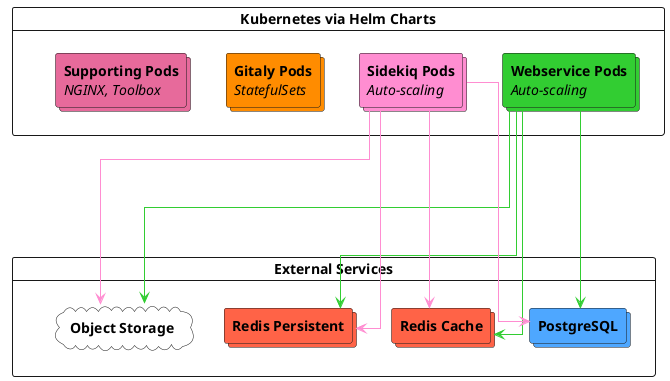



- プラン: Free、Premium、Ultimate
- 提供形態: GitLab Self-Managed
- ステータス: ベータ版



クラウドネイティブファーストリファレンスアーキテクチャは、ワークロードの特性に基づいた4つの標準サイズ（S/M/L/XL）を備えた、最新のクラウドネイティブなデプロイパターン向けに設計されています。これらのアーキテクチャは、すべてのGitLabコンポーネントをKubernetesにデプロイし、PostgreSQL、Redis、およびオブジェクトストレージには、マネージドサービスやオンプレミスオプションを含む外部のサードパーティソリューションを使用します。

> [!note]これらのアーキテクチャは[ベータ版](../../policy/development_stages_support.md#beta)です。フィードバックをお待ちしております。本番環境での使用状況データに基づき、仕様を継続的に改善していきます。

## アーキテクチャの概要 {#architecture-overview}

クラウドネイティブファーストアーキテクチャは、Kubernetesと外部サービスにまたがってGitLabコンポーネントをデプロイします:

```plantuml
@startuml kubernetes
skinparam linetype ortho

card "Kubernetes via Helm Charts" as kubernetes {
  collections "**Webservice Pods**\n//Auto-scaling//" as web #32CD32

  collections "**Sidekiq Pods**\n//Auto-scaling//" as sidekiq #ff8dd1

  collections "**Gitaly Pods**\n//StatefulSets//" as gitaly #FF8C00

  collections "**Supporting Pods**\n//NGINX, Toolbox//" as support #e76a9b
}

card "External Services" as external {
  collections "**PostgreSQL**" as database #4EA7FF

  collections "**Redis Cache**" as redis_cache #FF6347

  collections "**Redis Persistent**" as redis_persistent #FF6347

  cloud "**Object Storage**" as object_storage #white
}

kubernetes -[hidden]---> external

web -[#32CD32,norank]--> object_storage
web -[#32CD32,norank]--> redis_cache
web -[#32CD32,norank]--> redis_persistent
web -[#32CD32,norank]--> database

sidekiq -[#ff8dd1,norank]--> object_storage
sidekiq -[#ff8dd1,norank]--> redis_cache
sidekiq -[#ff8dd1,norank]--> redis_persistent
sidekiq -[#ff8dd1,norank]--> database

@enduml
```

**Kubernetesコンポーネント:**

- **Webservice** \- Webリクエストを処理します
- **Sidekiq** \- バックグラウンドジョブを処理します
- **Gitaly** \- 永続ボリュームを備えたStatefulSetsを使用してGitリポジトリを管理します
- **サポートサービス** \- NGINX Ingress、Toolbox、モニタリングコンポーネント

> [!note] Gitaly on Kubernetesは、Gitalyシャード（非クラスター）としてのみデプロイされており、[ゼロダウンタイムアップグレードをサポートしていません](https://gitlab.com/gitlab-org/gitaly/-/work_items/6934)。各Gitalyポッドは、そのポッドが提供するリポジトリにとって単一障害点となります。Gitaly Cluster (Praefect)は、Kubernetesではサポートされていません。
>
> 自動フェイルオーバーを備えたGitalyの高可用性が必要な場合は、ステートレスコンポーネントをKubernetesで実行しながら、仮想マシンにGitaly Clusterをデプロイする[クラウドネイティブハイブリッドアーキテクチャ](_index.md#cloud-native-hybrid)を検討してください。Kubernetes上のGitalyの要件と制限については、[Kubernetes上のGitaly](../gitaly/kubernetes.md#requirements)を参照してください。

**外部サービス:**

- **PostgreSQL** \- 高可用性のためのオプションのスタンバイレプリカと、安定性およびパフォーマンス向上のための読み取りレプリカとともにデプロイされるマネージドデータベースサービス
- **Redis** \- キャッシュ用インスタンスと永続化用のインスタンスを分離し、それぞれ高可用性のためのスタンバイレプリカをオプションでデプロイできます
- **オブジェクトストレージ** \- アーティファクトおよびパッケージ向けのS3、Google Cloud Storage、Azure Blob Storageなどのオブジェクトストレージサービス

おすすめのマネージドサービスプロバイダー（GCP Cloud SQL、AWS RDS、Azure Databaseなど）については、[推奨されるクラウドプロバイダーとサービス](_index.md#recommended-cloud-providers-and-services)を参照してください。

## 利用可能なアーキテクチャ {#available-architectures}

これらのアーキテクチャは、典型的な本番環境のワークロードパターンを表すRPS目標の範囲に基づいて設計されています。RPS目標は出発点であり、実際に必要なキャパシティはワークロードの構成や使用パターンによって異なります。RPSの内訳と、調整が必要となる場合のガイダンスについては、[RPSの内訳を理解する](sizing.md#understanding-rps-composition-and-workload-patterns)を参照してください。

| サイズ | RPS目標 | 想定されるワークロード |
|------|------------|-------------------|
| S | ≤100 | 開発アクティビティが少なく、自動化が最小限のチーム |
| M | ≤200 | 開発速度が中程度で、標準的なCI/CD利用がある組織 |
| L | ≤500 | 開発活動が活発で、自動化が大幅に進んでいる大規模チーム |
| XL | ≤1000 | 集中的なワークロードと広範なインテグレーションを伴うエンタープライズデプロイ |

想定される負荷の特定方法や適切なサイズの選択に関する詳細なガイダンスについては、[リファレンスアーキテクチャのサイジングガイド](sizing.md)を参照してください。

## 主なメリット {#key-benefits}

クラウドネイティブファーストアーキテクチャには次のメリットがあります:

- **自己修復型インフラストラクチャ** \- Kubernetesが失敗したポッドを自動的に再起動し、正常なノード間でワークロードを再スケジュールする
- **動的リソーススケーリング** \- Horizontal Pod AutoscalerとCluster Autoscalerが実際の需要に基づいてキャパシティを調整する
- **デプロイの簡素化** \- GitLabコンポーネントに対する従来のVM管理が不要で、すべてKubernetesを通じてオーケストレーションされる
- **運用負荷の軽減** \- PostgreSQL、Redis、オブジェクトストレージにマネージドサービスを使用することで、データベースとキャッシュのメンテナンスが不要になる
- **組み込みの高可用性** \- すべてのコンポーネントに対して自動フェイルオーバーを備えたマルチゾーンデプロイを実現する
- **コスト効率の向上** \- ピーク時のキャパシティを維持しつつ、需要の低い期間はリソースをスケールダウンする

## 要件 {#requirements}

Cloud Native Firstアーキテクチャをデプロイする前に、以下があることを確認してください:

- サポートされている[Kubernetesクラスター](https://docs.gitlab.com/charts/installation/cloud/)があり、その他の[チャートの前提条件](https://docs.gitlab.com/charts/installation/tools/)を満たしていること
- データベース、ユーザー、拡張機能が設定された外部PostgreSQLインスタンス
- 外部Redisインスタンス
- オブジェクトストレージサービス（S3、Google Cloud Storage、Azure Blob Storageなど）

ネットワーキング、マシンタイプ、クラウドプロバイダーサービスを含む完全な要件については、[リファレンスアーキテクチャの要件](_index.md#requirements)を参照してください。

Kubernetes上のGitaly固有の要件と制限については、[Kubernetes上のGitalyの要件](../gitaly/kubernetes.md#requirements)を参照してください。

## Small（S） {#small-s}

**目標負荷:** 100 RPS以下 | 全体的に軽度の負荷

**ワークロードの特性:**

- **総RPS範囲:** 1秒あたりのリクエスト数が100以下
- **Git操作:** Gitのプッシュとプルのアクティビティが少ない
- **リポジトリサイズ:** アクティブに使用されるモノレポには不向き
- **CI/CDの使用:** 同時実行パイプラインが少ない
- **APIトラフィック:** 自動化されたワークロードに対する処理能力が低い
- **ユーザーパターン:** 使用の急増に対してある程度の耐性がある

### Kubernetesコンポーネント {#kubernetes-components}

| コンポーネント | ポッドあたりのリソース | 最小ポッド数/ワーカー数 | 最大ポッド数/ワーカー数 | ノード構成例 |
|-----------|------------------|------------------|------------------|---------------------------|
| Webservice | 2 vCPU、3 GB（リクエスト）、4 GB（制限） | 12ポッド（24人のワーカー） | 18ポッド（36人のワーカー） | GCP: 6 × n2-standard-8 AWS: 6 × c6i.2xlarge |
| Sidekiq | 900m vCPU、2 GB（リクエスト）、4 GB（制限） | 8人のワーカー | 12人のワーカー | GCP: 3 × n2-standard-4 AWS: 3 × m6i.xlarge |
| Gitaly | 7 vCPU、30 GB（リクエストと制限） | 3個のポッド | 3個のポッド | GCP: 3 × n2-standard-8 AWS: 3 × m6i.2xlarge |
| サポート用ノードプール | サービスごとに異なる | 12 vCPU、48 GB | 12 vCPU、48 GB | GCP: 3 × n2-standard-4 AWS: 3 × c6i.xlarge |

### ポッドのスケーリング構成 {#pod-scaling-configuration}

| コンポーネント | 最小 → 最大ポッド数 | 最小 → 最大ワーカー数 | ポッドあたりのリソース | ポッドあたりのワーカー数 |
|-----------|----------------|-------------------|-------------------|-----------------|
| Webservice | 12 → 18 | 24 → 36 | 2 vCPU、3 GB（リクエスト）、4 GB（制限） | 2 |
| Sidekiq | 8 → 12 | 8 → 12 | 900m vCPU、2 GB（リクエスト）、4 GB（制限） | 1 |
| Gitaly | 3（オートスケールなし） | 該当なし | 7 vCPU、30 GB（リクエストと制限） | 該当なし |

**Gitalyに関する注意:** Git cgroups: 27 GB、バッファ: 3 GB。リポジトリcgroupsは1に設定されています。チューニングのガイダンスについては、[Gitaly cgroupsの設定](#gitaly-cgroups-configuration)を参照してください。

### 外部サービス {#external-services}

| サービス | 設定 | GCP相当 | AWS相当 |
|---------|---------------|----------------|----------------|
| PostgreSQL | 8 vCPU、32 GB | n2-standard-8 | m6i.2xlarge |
| Redis - キャッシュ | 2 vCPU、8 GB | n2-standard-2 | m6i.large |
| Redis - 永続化 | 2 vCPU、8 GB | n2-standard-2 | m6i.large |
| オブジェクトストレージ | クラウドプロバイダーサービス | Google Cloud Storage | Amazon S3 |

## Medium（M） {#medium-m}

**目標負荷:** 200 RPS以下 | 全体的に中程度の負荷

**ワークロードの特性:**

- **総RPS範囲:** 1秒あたりのリクエスト数が200以下
- **Git操作:** Gitのプッシュとプルのアクティビティが中程度
- **リポジトリサイズ:** 低頻度で使用されるモノレポをサポート。さらに大規模または高頻度で使用されるモノレポでは、パフォーマンス調整が必要になる場合があります
- **CI/CDの使用:** 中程度のパイプライン並行処理
- **APIトラフィック:** 標準的な自動化ワークロードをサポート
- **ユーザーパターン:** 使用状況の変動に対して十分な耐性がある

### Kubernetesコンポーネント {#kubernetes-components-1}

| コンポーネント | ポッドあたりのリソース | 最小ポッド数/ワーカー数 | 最大ポッド数/ワーカー数 | ノード構成例 |
|-----------|------------------|------------------|------------------|---------------------------|
| Webservice | 2 vCPU、3 GB（リクエスト）、4 GB（制限） | 28ポッド（56人のワーカー） | 42ポッド（84人のワーカー） | GCP: 6 × n2-standard-16 AWS: 6 × c6i.4xlarge |
| Sidekiq | 900m vCPU、2 GB（リクエスト）、4 GB（制限） | 16人のワーカー | 24人のワーカー | GCP: 3 × n2-standard-8 AWS: 3 × m6i.2xlarge |
| Gitaly | 15 vCPU、62 GB（リクエストと制限） | 3個のポッド | 3個のポッド | GCP: 3 × n2-standard-16 AWS: 3 × m6i.4xlarge |
| サポート用ノードプール | サービスごとに異なる | 12 vCPU、48 GB | 12 vCPU、48 GB | GCP: 3 × n2-standard-4 AWS: 3 × c6i.xlarge |

### ポッドのスケーリング構成 {#pod-scaling-configuration-1}

| コンポーネント | 最小 → 最大ポッド数 | 最小 → 最大ワーカー数 | ポッドあたりのリソース | ポッドあたりのワーカー数 |
|-----------|----------------|-------------------|-------------------|-----------------|
| Webservice | 28 → 42 | 56 → 84 | 2 vCPU、3 GB（リクエスト）、4 GB（制限） | 2 |
| Sidekiq | 16 → 24 | 16 → 24 | 900m vCPU、2 GB（リクエスト）、4 GB（制限） | 1 |
| Gitaly | 3（オートスケールなし） | 該当なし | 15 vCPU、62 GB（リクエストと制限） | 該当なし |

**Gitalyに関する注意:** Git cgroups: 56 GB、バッファ: 6 GB。リポジトリcgroupsは1に設定されています。チューニングのガイダンスについては、[Gitaly cgroupsの設定](#gitaly-cgroups-configuration)を参照してください。

### 外部サービス {#external-services-1}

| サービス | 設定 | GCP相当 | AWS相当 |
|---------|---------------|----------------|----------------|
| PostgreSQL | 16 vCPU、64 GB | n2-standard-16 | m6i.4xlarge |
| Redis - キャッシュ | 2 vCPU、8 GB | n2-standard-2 | m6i.large |
| Redis - 永続化 | 2 vCPU、8 GB | n2-standard-2 | m6i.large |
| オブジェクトストレージ | クラウドプロバイダーサービス | Google Cloud Storage | Amazon S3 |

## Large（L） {#large-l}

**目標負荷:** 500 RPS以下 | 全体的に高い負荷

**ワークロードの特性:**

- **総RPS範囲:** 1秒あたりのリクエスト数が500以下
- **Git操作:** Gitのプッシュとプルのアクティビティが多い
- **リポジトリサイズ:** 適度に使用されるモノレポをサポート。さらに大規模または高頻度で使用されるモノレポでは、パフォーマンス調整が必要になる場合があります
- **CI/CDの使用:** 適切なSidekiqのスケーリングを伴う、高頻度のパイプライン使用
- **APIトラフィック:** 大規模な自動化ワークロードをサポート
- **ユーザーパターン:** 使用状況の変動に対して非常に高い耐性がある

### Kubernetesコンポーネント {#kubernetes-components-2}

| コンポーネント | ポッドあたりのリソース | 最小ポッド数/ワーカー数 | 最大ポッド数/ワーカー数 | ノード構成例 |
|-----------|------------------|------------------|------------------|---------------------------|
| Webservice | 2 vCPU、3 GB（リクエスト）、4 GB（制限） | 56ポッド（112人のワーカー） | 84ポッド（168人のワーカー） | GCP: 6 × n2-standard-32 AWS: 6 × c6i.8xlarge |
| Sidekiq | 900m vCPU、2 GB（リクエスト）、4 GB（制限） | 32人のワーカー | 48人のワーカー | GCP: 6 × n2-standard-8 AWS: 6 × m6i.2xlarge |
| Gitaly | 31 vCPU、126 GB（リクエストと制限） | 3個のポッド | 3個のポッド | GCP: 3 × n2-standard-32 AWS: 3 × m6i.8xlarge |
| サポート用ノードプール | サービスごとに異なる | 12 vCPU、48 GB | 12 vCPU、48 GB | GCP: 3 × n2-standard-4 AWS: 3 × c6i.xlarge |

### ポッドのスケーリング構成 {#pod-scaling-configuration-2}

| コンポーネント | 最小 → 最大ポッド数 | 最小 → 最大ワーカー数 | ポッドあたりのリソース | ポッドあたりのワーカー数 |
|-----------|----------------|-------------------|-------------------|-----------------|
| Webservice | 56 → 84 | 112 → 168 | 2 vCPU、3 GB（リクエスト）、4 GB（制限） | 2 |
| Sidekiq | 32 → 48 | 32 → 48 | 900m vCPU、2 GB（リクエスト）、4 GB（制限） | 1 |
| Gitaly | 3（オートスケールなし） | 該当なし | 31 vCPU、126 GB（リクエストと制限） | 該当なし |

**Gitalyに関する注意:** Git cgroups: 120 GB、バッファ: 6 GB。リポジトリcgroupsは1に設定されています。チューニングのガイダンスについては、[Gitaly cgroupsの設定](#gitaly-cgroups-configuration)を参照してください。

### 外部サービス {#external-services-2}

| サービス | 設定 | GCP相当 | AWS相当 |
|---------|---------------|----------------|----------------|
| PostgreSQL | 32 vCPU、128 GB | n2-standard-32 | m6i.8xlarge |
| Redis - キャッシュ | 2 vCPU、16 GB | n2-highmem-2 | r6i.large |
| Redis - 永続化 | 2 vCPU、16 GB | n2-highmem-2 | r6i.large |
| オブジェクトストレージ | クラウドプロバイダーサービス | Google Cloud Storage | Amazon S3 |

## Extra Large（XL） {#extra-large-xl}

**目標負荷:** 1000 RPS以下 | 全体的に集中的な負荷

**ワークロードの特性:**

- **総RPS範囲:** 1秒あたりのリクエスト数が1000以下
- **Git操作:** Gitのプッシュとプルのアクティビティが非常に多い
- **リポジトリサイズ:** 頻繁に使用されるモノレポをサポート。さらに大規模または集中的に使用されるモノレポでは、パフォーマンス調整が必要になる場合があります
- **CI/CDの使用:** 集中的なCI/CDワークロード
- **APIトラフィック:** 大規模な自動化およびインテグレーションのトラフィック
- **ユーザーパターン:** 多様なアクセスパターンに対応する設計

### Kubernetesコンポーネント {#kubernetes-components-3}

| コンポーネント | ポッドあたりのリソース | 最小ポッド数/ワーカー数 | 最大ポッド数/ワーカー数 | ノード構成例 |
|-----------|------------------|------------------|------------------|---------------------------|
| Webservice | 2 vCPU、3 GB（リクエスト）、4 GB（制限） | 110ポッド（220人のワーカー） | 165ポッド（330人のワーカー） | GCP: 6 × n2-standard-64 AWS: 6 × c6i.16xlarge |
| Sidekiq | 900m vCPU、2 GB（リクエスト）、4 GB（制限） | 64人のワーカー | 96人のワーカー | GCP: 6 × n2-standard-16 AWS: 6 × m6i.4xlarge |
| Gitaly | 63 vCPU、254 GB（リクエストと制限） | 3個のポッド | 3個のポッド | GCP: 3 × n2-standard-64 AWS: 3 × m6i.16xlarge |
| サポート用ノードプール | サービスごとに異なる | 24 vCPU、96 GB | 24 vCPU、96 GB | GCP: 3 × n2-standard-8 AWS: 3 × c6i.2xlarge |

### ポッドのスケーリング構成 {#pod-scaling-configuration-3}

| コンポーネント | 最小 → 最大ポッド数 | 最小 → 最大ワーカー数 | ポッドあたりのリソース | ポッドあたりのワーカー数 |
|-----------|----------------|-------------------|-------------------|-----------------|
| Webservice | 110 → 165 | 220 → 330 | 2 vCPU、3 GB（リクエスト）、4 GB（制限） | 2 |
| Sidekiq | 64 → 96 | 64 → 96 | 900m vCPU、2 GB（リクエスト）、4 GB（制限） | 1 |
| Gitaly | 3（オートスケールなし） | 該当なし | 63 vCPU、254 GB（リクエストと制限） | 該当なし |

**Gitalyに関する注意:** Git cgroups: 248 GB、バッファ: 6 GB。リポジトリcgroupsは1に設定されています。チューニングのガイダンスについては、[Gitaly cgroupsの設定](#gitaly-cgroups-configuration)を参照してください。

### 外部サービス {#external-services-3}

| サービス | 設定 | GCP相当 | AWS相当 |
|---------|---------------|----------------|----------------|
| PostgreSQL | 64 vCPU、256 GB | n2-standard-64 | m6i.16xlarge |
| Redis - キャッシュ | 2 vCPU、16 GB | n2-highmem-2 | r6i.large |
| Redis - 永続化 | 2 vCPU、16 GB | n2-highmem-2 | r6i.large |
| オブジェクトストレージ | クラウドプロバイダーサービス | Google Cloud Storage | Amazon S3 |

## 追加情報 {#additional-information}

このセクションでは、クラウドネイティブファーストアーキテクチャのデプロイと運用に関する補足的なガイダンスを提供します。これには、マシンタイプの選択、コンポーネント固有の考慮事項、スケーリング戦略が含まれます。

### マシンタイプのガイダンス {#machine-type-guidance}

ここに記載されているマシンタイプは、検証およびテストで使用された例です。使用できるモデルは次のとおりです:

- より新しい世代のマシンタイプ
- ARMベースのインスタンス（AWS Graviton）
- 仕様を満たす、または上回る別のマシンファミリー
- 特定のニーズに合わせてサイズ調整されたカスタムマシンタイプ

パフォーマンスが不安定になるため、バースト可能なインスタンスタイプは使用しないでください。

詳細については、[サポートされているマシンタイプ](_index.md#supported-machine-types)を参照してください。

### Gitalyに関する考慮事項 {#gitaly-considerations}

クラウドネイティブファーストアーキテクチャにおけるKubernetes上のGitalyは、次の仕様でStatefulSetsを使用します:

- **専用ノード配置** \- Gitalyポッドは、ノイジーネイバー問題を回避するため専用ノードにデプロイされます。
- **リソース割り当て** \- ポッドのリクエストと制限は、ノードキャパシティからオーバーヘッド（Kubernetesシステムプロセスのために予約されたメモリ2 GB、1 vCPU）を差し引いた値に設定されます。
- **Git cgroupsメモリ** \- デフォルトでは10%のバッファを含めて割り当てられますが、大規模なポッドでは最大6 GBに制限されます。たとえば、Smallでは27 GBをGit cgroupsに割り当て、3 GBをバッファとしますが、Medium以上のサイズでは6 GBの制限が適用されます（Mediumでは56 GBのcgroupsに対して6 GBのバッファ）。

**Gitalyデプロイモード:**

設計上、Kubernetes上のGitaly（非Cluster）は、各ポッドに保存されているリポジトリにとって単一障害点となるサービスです。データは、ポッドごとに1つのインスタンスから取得され、提供されます。各Gitalyポッドはそれぞれ独自のリポジトリ群を管理し、リポジトリを分散させることでGitストレージの水平スケーリングを実現します。

Gitaly Cluster (Praefect)は、クラウドネイティブファーストアーキテクチャではサポートされていません。KubernetesにおけるGitalyデプロイの制限については、[Kubernetes上のGitaly](../gitaly/kubernetes.md)を参照してください。

**リポジトリの分散:**

複数のGitalyストレージを設定した場合（例: `default`、`storage1`、`storage2`）、GitLabはデフォルトですべての新しいリポジトリを`default`ストレージに作成します。すべてのGitalyポッドにリポジトリを分散させるには、ストレージのウェイトを設定して負荷を分散させます。

リポジトリストレージのウェイトを設定する方法については、[新しいリポジトリの保存先を設定する](../repository_storage_paths.md#configure-where-new-repositories-are-stored)を参照してください。

#### Gitaly cgroupsの設定 {#gitaly-cgroups-configuration}

Gitalyは、個々のGit操作によるリソース枯渇を防ぐために[cgroups](../gitaly/cgroups.md)を使用します。デフォルトの設定では、リポジトリのcgroup数が1に設定されています。これは、オーバーサブスクリプションを通じて、単一のリポジトリがポッドのリソース全体を最大限に利用できるようにする出発点となります。

ただし、この設定がすべてのワークロードに最適とは限りません。アクティブなリポジトリが多い環境や、特定のリソース分離要件がある環境では、観測された使用パターンに基づいてcgroups設定を調整する必要があります。これには、リポジトリのcgroups数とメモリー割り当ての調整が含まれます。

Gitaly cgroupsの測定、チューニング、設定に関する詳細なガイダンスについては、[Gitaly cgroups](../gitaly/cgroups.md)を参照してください。

大規模なモノレポ（2 GB超）や負荷の高いGitワークロードの場合は、さらにGitalyの調整が必要になる場合があります。詳細なガイダンスについては、[リファレンスアーキテクチャのサイジングガイド](sizing.md)を参照してください。

### 外部サービスに関する注記 {#external-service-notes}

- PostgreSQLは、高可用性を実現するためにスタンバイレプリカを含めてデプロイすることができます。安定性とパフォーマンスを向上させるために、読み取りレプリカを追加することも可能です。より大規模な環境（L、XL）では、データベースの負荷を分散させるために読み取りレプリカを使用するメリットがより大きくなります。
- Redisインスタンスは、高可用性のためにスタンバイレプリカを含めてデプロイすることができます。GCPでは、Memorystoreインスタンスはメモリのみで構成されます。掲載されているマシン仕様は参考値です。
- インスタンスの設定を伴うすべてのクラウドプロバイダーサービスについて、回復力のあるクラウドアーキテクチャのプラクティスに合わせて、3つの異なるアベイラビリティーゾーンに最低3つのノードを実装することをおすすめします。

### オートスケールと最小ポッド数 {#autoscaling-and-minimum-pod-counts}

すべてのアーキテクチャは、Kubernetes Horizontal Pod Autoscaler（HPA）とCluster Autoscalerを使用してキャパシティを管理します:

- **Webservice** \- CPU使用率に基づいてスケールし、最小ポッド数は控えめに設定します
- **Sidekiq** \- CPU使用率に基づいてスケールします
- **Cluster Autoscaler** \- ポッドリソースリクエストに基づいてノードを自動的にプロビジョニングおよび削除します

最小ポッド数は、内部テストに基づいて、コスト効率とパフォーマンスの信頼性のバランスを取るため、最大値の約2/3に設定されています。これは、次の目標を達成することを目的としています:

- 需要増加時に迅速にスケーリングする
- ノード障害またはアップグレード時に十分なキャパシティを確保する
- 需要の少ない期間のコストを最適化する

十分に把握できている負荷パターンがある場合は、必要に応じて最小値を調整できます:

- 急激なトラフィックスパイクがある環境や、厳格なパフォーマンスSLAがある環境では、**最小値を増やす**。
- モニタリングにより、継続的な負荷が一貫してデフォルト値を下回っていることが判明した場合は、**最小値を減らす**。

### 高度なスケーリング {#advanced-scaling}

クラウドネイティブファーストアーキテクチャは、基本仕様を超えてスケールするように設計されています。環境に次の要素がある場合、キャパシティの調整が必要になることがあります:

- 記載されているRPS目標よりも一貫して高いスループット
- 非定型的なワークロード構成（[RPSの内訳を理解する](sizing.md#understanding-rps-composition-and-workload-patterns)を参照）
- 大規模なモノレポ（2 GB超）
- 大幅な追加ワークロード
- GitLab Duo Agent Platformの広範な使用

スケーリング戦略は、コンポーネントの種類によって異なります。

#### 水平スケーリング（WebserviceとSidekiq） {#horizontal-scaling-webservice-and-sidekiq}

キャパシティを増やすには、最大レプリカ数とノードプールのキャパシティを調整して、水平にスケールします:

- **Webservice** \- Helmの値で`maxReplicas`を増やし、それに対応するノードをWebserviceノードプールに追加する
- **Sidekiq** \- より高いジョブスループットに対応できるよう`maxReplicas`を増やし、ノードをSidekiqノードプールに追加する

これらのステートレスコンポーネントでは、水平スケーリングが推奨されるアプローチです。

#### 垂直スケーリング（PostgreSQL、Redis、Gitaly） {#vertical-scaling-postgresql-redis-gitaly}

ステートフルコンポーネントでは、インスタンスまたはポッドの仕様を引き上げます:

- **PostgreSQLとRedis** \- マネージドサービスプロバイダーを通じて、より大きなインスタンスタイプにアップグレードする。
- **Gitaly** \- ポッドあたりのCPUとメモリの仕様を増やす。これには、Gitalyノードプールでより大きなノードタイプが必要になり、あわせてGit cgroupsのメモリ割り当ての調整も必要です。

#### Sidekiqキューの最適化 {#sidekiq-queue-optimization}

デフォルトでは、Sidekiqはすべてのジョブタイプを単一のキューで処理します。ワークロードパターンが多様な環境では、ジョブ特性に基づいて個別のキューを設定できます:

- **高優先度キュー** \- CIパイプライン処理やWebhook配信など、時間的制約のあるジョブに使用する
- **CPUバウンドキュー** \- 並行処理設定を調整した、計算負荷の高いジョブに使用する
- **デフォルトキュー** \- 標準的なバックグラウンド処理に使用する

キューを分離することで、ジョブ処理の信頼性が向上し、優先度の低いジョブが時間的制約のある操作をブロックするのを防ぐことができます。これは特に、自動化ワークロードの多い大規模な環境（L、XL）で効果的です。

Sidekiqキューの構成の詳細については、[特定のジョブクラスの処理](../sidekiq/processing_specific_job_classes.md)を参照してください。

#### GitLab Duo Agent Platformのスケーリング {#scaling-for-gitlab-duo-agent-platform}

GitLab Duo Agent Platformでは、標準的なGitLabワークロードに加えて、追加のインフラストラクチャ要件が発生します。Agent Platform導入時のモニタリングとスケーリングに関する詳細なガイダンスについては、[GitLab Duo Agent Platformのスケーリング](_index.md#scaling-for-gitlab-duo-agent-platform)を参照してください。

#### スケーリングに関する考慮事項 {#scaling-considerations}

いずれかのコンポーネントを大幅にスケールする場合は、次を実行してください:

- 依存コンポーネントのリソース飽和状態をモニタリングする。WebserviceまたはSidekiqへの負荷が増加すると、PostgreSQLとGitalyに影響を与える可能性があります。
- スケーリングに関する変更は、先に本番環境以外でテストする。
- サービス間でボトルネックが移動しないよう、相互に依存するコンポーネントをまとめてスケールする。

包括的なスケーリングのガイダンスについては、[環境をスケーリングする](_index.md#scaling-an-environment)を参照してください。

## デプロイ {#deployment}

クラウドネイティブファーストアーキテクチャは、Helmチャートと外部サービスプロバイダーを直接使用するか、GitLab Environment Toolkitを通じてデプロイできます。

### GitLab Environment Toolkit {#gitlab-environment-toolkit}

[GitLab Environment Toolkit](https://gitlab.com/gitlab-org/gitlab-environment-toolkit)は、以下により自動デプロイを提供します:

- クラウドリソースのInfrastructure as Code（Terraform）
- Helmチャート設定の自動化
- 各アーキテクチャサイズ向けの事前検証済みの設定
- アップグレードとメンテナンスの簡素化

デプロイの手順については、[GitLab Environment Toolkitのドキュメント](https://gitlab.com/gitlab-org/gitlab-environment-toolkit/-/blob/main/README.md)を参照してください。

### 手動デプロイ {#manual-deployment}

手動デプロイの前提条件:

- 必要なデータベース、ユーザー、権限を設定済みの外部PostgreSQL
- 設定済みでアクセス可能な外部Redisインスタンス
- 作成済みのオブジェクトストレージバケット
- 必要に応じて認証用に作成したKubernetes Secrets（PostgreSQLパスワード、Redisパスワード、オブジェクトストレージ認証情報、GitLabシークレット）

前提条件とシークレット設定の詳細については、[GitLabチャートの前提条件](https://docs.gitlab.com/charts/installation/tools/)と[シークレットを設定する](https://docs.gitlab.com/charts/installation/secrets/)を参照してください。

Helmチャートを使用した手動デプロイの場は、次の手順に従います:

1. 前提条件の説明に従って、必要な外部サービスとシークレットを設定します
1. 適切なノードプールとオートスケーラーを備えたKubernetesクラスターを設定します
1. [Helm Chart設定](#helm-chart-configurations)セクションに示されているHelm値を適用します
1. `helm install`を使用してGitLabをデプロイします

詳細な手動デプロイ手順については、[KubernetesへのGitLabのインストール](https://docs.gitlab.com/charts/installation/)を参照してください。

## Helm Chart設定 {#helm-chart-configurations}

Helm Chartの設定例と詳細なデプロイのガイダンスについては、[GitLabチャートリポジトリ](https://gitlab.com/gitlab-org/charts/gitlab/-/tree/master/examples/ref)を参照してください。

クラウドネイティブファーストアーキテクチャにおける主要な設定領域は次のとおりです:

- **リソース仕様** \- ポッドのCPUとメモリの制限は、上記の各アーキテクチャサイズに示されている仕様と一致させる
- **オートスケール** \- HPA構成により、最小ポッド数を最大数の2/3に設定し、CPUベースのスケーリング目標を指定する
- **ノード配置** \- ノードセレクターにより、ワークロードが適切なノードプール（例: `webservice`、`sidekiq`、`gitaly`、`support`）にデプロイされるようにする
- **外部サービス** \- PostgreSQL、Redis、オブジェクトストレージの接続の詳細
- **Gitaly** \- cgroups、永続性、ストレージ分散を備えたStatefulSet設定

アーキテクチャ固有のレプリカ数とリソース値については、上記の各サイズセクションの仕様を参照してください。

> [!note] クラウドネイティブファーストアーキテクチャはベータ版です。機能が一般公開に向けて進展するにつれて、具体的なHelm Chartの構成例がチャートリポジトリに追加されます。上記の各アーキテクチャサイズセクションの仕様を使用して、Helm値の設定を作成してください。

## 次の手順 {#next-steps}

デプロイ後、通常、実際のワークロードパターンに合わせて環境のモニタリングとチューニングが必要になります。

### モニタリングと検証 {#monitor-and-validate}

1. **リソース使用状況のモニタリング** - [Prometheus](../monitoring/prometheus/_index.md)を使用して、すべてのコンポーネントのCPU、メモリ、キュー深度を追跡する
1. **RPS前提条件の検証** \- 実際の[RPSの内訳](sizing.md#extract-peak-traffic-metrics)を、想定している80/10/10の構成と比較する
1. **調整が必要な箇所の特定** \- 使用率が一貫して70％を超えているコンポーネントがないか確認する
1. **Gitaly cgroupsの確認** \- リポジトリアクセスパターンに基づいて、[リポジトリのcgroups数](../gitaly/cgroups.md)のチューニングを検討する

### 必要に応じて調整する {#adjust-as-needed}

リファレンスアーキテクチャは出発点です。多くの環境では、次の要因に基づく調整が有効です:

- **実際のワークロード構成** \- API/Web/Gitの比率が一般的なパターンと大きく異なる場合は、[RPSの構成を理解する](sizing.md#understanding-rps-composition-and-workload-patterns)を参照してください
- **リポジトリの特性** \- モノレポのサイズ、クローン作成の頻度、アクセスパターンにより、[コンポーネント固有の調整](sizing.md#identify-component-adjustments)が必要になる場合があります
- **成長パターン** \- ユーザー数の増加、CI/CDの拡張、または自動化のスケーリング

コンポーネント別の調整のガイダンスについては、[高度なスケーリング](#advanced-scaling)を参照してください。

### オプション機能を設定する {#configure-optional-features}

要件に応じて、GitLabの追加のオプション機能を設定することもできます。詳細については、[GitLabのインストール後の手順](../../install/next_steps.md)を参照してください。

> [!note] オプション機能には、追加のキャパシティが必要になる場合があります。要件については、機能別のドキュメントを参照してください。
