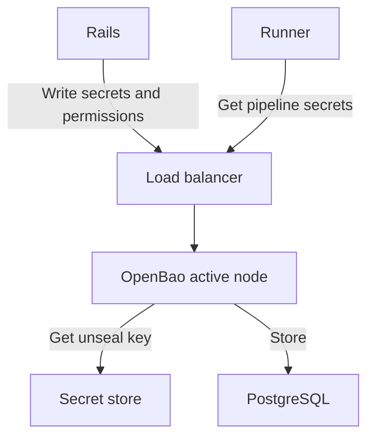



- プラン: Ultimate
- 提供形態: GitLab Self-Managed
- ステータス: 実験的機能





- GitLab 18.8で実験的機能として[導入](https://gitlab.com/groups/gitlab-org/-/work_items/16319)され、GitLab 18.8のクローズド[ベータ機能](../../policy/development_stages_support.md#beta)として一部の初期テスターが利用できるようになりました。



[GitLab Secrets Manager](../../ci/secrets/secrets_manager/_index.md)は、[OpenBao](https://openbao.org/)（オープンソースのシークレット管理ソリューション）を使用します。OpenBaoは、GitLabインスタンスで使用されるシークレットの安全なストレージ、アクセス制御、ライフサイクル管理を提供します。

## OpenBaoアーキテクチャ {#openbao-architecture}

OpenBaoは、既存のGitLabサービスと並行して実行されるオプションのコンポーネントとしてGitLabと統合されています。

- RailsバックエンドとRunnerは、ロードバランサーを介してOpenBao APIに接続します。
- OpenBaoは、データをPostgreSQLに格納します。Helmチャートは、データをメインのGitLabデータベースにデフォルトで格納するようにOpenBaoを設定します。
- OpenBaoは、シークレットストアからアンシールキーを取得します。
- OpenBaoは、HelmチャートによってマウントされたKubernetes Secretからアンシールキーを読み取ります。
- 監査ログが有効になっている場合、OpenBaoは、監査ログをRailsバックエンドに送信します。

OpenBaoは、すべてのリクエストを処理する単一のアクティブノードで実行されます。また、必要に応じて、アクティブノードが失敗した場合に引き継ぐ複数のスタンバイノードで実行されます。

## OpenBaoをインストールする {#install-openbao}

前提条件: 

- インスタンスへの管理者アクセス権が必要です。
- GitLab 18.8以降を実行している必要があります。
- Kubernetesクラスターが必要です。

OpenBaoをインストールするには、[Kubernetesデプロイ用のOpenBao Helmチャート](https://docs.gitlab.com/charts/charts/openbao/)を使用します。

インストール後、[GitLab Secrets Managerのユーザードキュメント](../../ci/secrets/secrets_manager/_index.md)に従って、シークレットの操作をテストし、OpenBaoが動作していることを確認します。

OpenBaoのリソース要件は、GitLabインスタンスのサイズとシークレットの使用パターンによって異なります。

デプロイをモニタリングし、必要に応じて、実際の使用パターンに基づいてリソースを調整します。

### CPU要件 {#cpu-requirements}

OpenBaoのCPU使用率は、主に以下によって左右されます:

- CI/CDジョブがシークレットをフェッチする頻度。
- GitLab UIを介してシークレットマネージャーにアクセスする頻度。

推奨されるCPUコア数:

| デプロイサイズ | フェッチ頻度       | CPUコア |
|-----------------|-----------------------|-----------|
| 小規模           | 100 ops/sec未満 | 1コア    |
| 中規模          | 100～200 ops/sec    | 1～2コア |
| 大規模           | 200 ops/sec超 | 2+コア  |

たとえば、100,000個のシークレットがあるデプロイのテストで、毎秒139回のフェッチ操作が発生しました。つまり、各シークレットがCI/CDジョブによって約12分ごとにフェッチされ、OpenBaoがそのメモリキャッシュを最大限に活用していると考えられます。

### メモリ要件 {#memory-requirements}

OpenBaoのメモリ使用量は、主として、GitLab Secrets Managerが有効になっているプロジェクトの数によって決まります。200個のプロジェクトあたり少なくとも1 GBのメモリと、1 GBの安全マージンを割り当てる必要があります。

推奨されるメモリ割り当て:

| デプロイサイズ | プロジェクト数 | メモリ |
|-----------------|--------------------|--------|
| 小規模           | 200個未満      | 2 GB   |
| 中規模          | 400～800個         | 5 GB   |
| 大規模           | 1,000個超    | 6+ GB  |

#### ストレージ要件 {#storage-requirements}

PostgreSQLデータベースのストレージ要件は、主として、シークレットの数によって決まります。単一のシークレットバージョンと、対応するメタデータを格納するには、約13 KBかかります。

使用例:

- 100,000個のシークレット = ~1.5 GB
- 200,000個のシークレット = ~3 GB

## バックアップと復元 {#backup-and-restore}

OpenBaoのデータはPostgreSQLに格納され、通常のGitLabバックアップ手順に含める必要があります。

OpenBao固有のバックアップと復元の詳細な手順については、[OpenBaoのバックアップドキュメント](https://docs.gitlab.com/charts/charts/openbao/#back-up-openbao)を参照してください。

## 高可用性 {#high-availability}

本番環境デプロイの場合は、以下を検討してください:

- 冗長性のために複数のOpenBaoレプリカを実行する
- 可用性の高いPostgreSQLバックエンドを使用する
- 適切なモニタリングとアラートを実装する

## ヘルスチェックとモニタリング {#health-check-and-monitoring}

OpenBaoは、モニタリング用のヘルスチェックエンドポイントを提供します:

- `openbao.example.com/v1/sys/health`: OpenBaoのヘルスステータスを返します
- `openbao.example.com/v1/sys/seal-status`: シールステータスを返します

これらのエンドポイントをモニタリングシステムと統合できます。

## パフォーマンスの問題 {#performance-issues}

シークレットの操作が遅い場合:

- OpenBaoのリソース使用量（CPU、メモリ）を確認してください
- PostgreSQLバックエンドのパフォーマンスを確認してください
- OpenBaoとそのPostgreSQLバックエンド間のネットワークレイテンシーを確認してください
