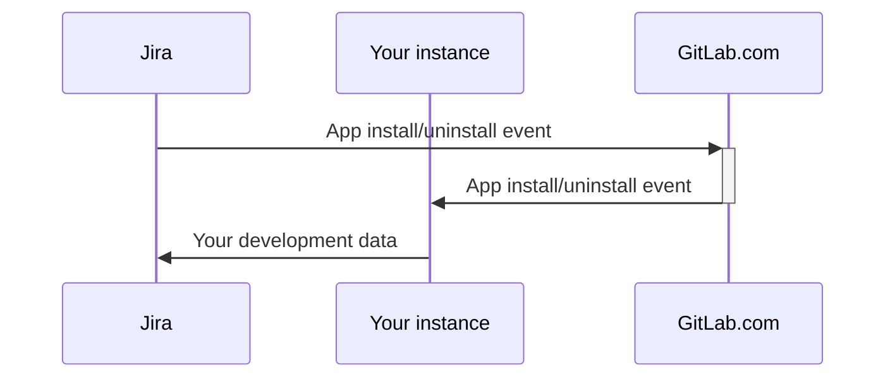



- プラン: Free、Premium、Ultimate
- 提供形態: GitLab Self-Managed





このページには、GitLab for Jira Cloudアプリの管理者向けドキュメントが掲載されています。ユーザー向けドキュメントについては、[GitLab for Jira Cloudアプリ](../../integration/jira/connect-app.md)を参照してください。



[GitLab for Jira Cloud](https://marketplace.atlassian.com/apps/1221011/gitlab-com-for-jira-cloud?tab=overview&hosting=cloud)アプリを使用すると、GitLabとJira Cloudを接続して、開発情報をリアルタイムで同期できます。この情報は、[Jira開発パネル](../../integration/jira/development_panel.md)で確認できます。

GitLab Self-ManagedインスタンスでGitLab for Jira Cloudアプリをセットアップするには、次のいずれかを実行します。

- [Atlassian MarketplaceからGitLab for Jira Cloudアプリをインストールする](#install-the-gitlab-for-jira-cloud-app-from-the-atlassian-marketplace)（GitLab 15.7以降）。
- [GitLab for Jira Cloudアプリを手動でインストールする](#install-the-gitlab-for-jira-cloud-app-manually)。

<i class="fa fa-youtube-play youtube" aria-hidden="true"></i>概要については、以下を参照してください。

- [Installing the GitLab for Jira Cloud app from the Atlassian Marketplace for a GitLab Self-Managed instance](https://youtu.be/RnDw4PzmdW8?list=PL05JrBw4t0Koazgli_PmMQCER2pVH7vUT)（GitLab Self-ManagedインスタンスにAtlassian MarketplaceからGitLab for Jira Cloudアプリをインストールする）
  <!-- Video published on 2024-10-30 -->
- [Installing the GitLab for Jira Cloud app manually for a GitLab Self-Managed instance](https://youtu.be/fs02xS8BElA?list=PL05JrBw4t0Koazgli_PmMQCER2pVH7vUT)（GitLab Self-ManagedインスタンスにGitLab for Jira Cloudアプリを手動でインストールする）
  <!-- Video published on 2024-10-30 -->

[Atlassian MarketplaceからGitLab for Jira Cloudアプリをインストール](#install-the-gitlab-for-jira-cloud-app-from-the-atlassian-marketplace)すると、Atlassianが開発および管理している[プロジェクトツールチェーン](https://support.atlassian.com/jira-software-cloud/docs/what-is-the-connections-feature/)を使用して、[GitLabリポジトリをJiraプロジェクトにリンク](https://support.atlassian.com/jira-software-cloud/docs/link-repositories-to-a-project/#Link-repositories-using-the-toolchain-feature)できます。このプロジェクトツールチェーンは、GitLabとJira Cloud間の開発情報の同期方法には影響しません。

Jira Data CenterまたはJira Serverには、Atlassianが開発および管理している[Jira DVCSコネクタ](../../integration/jira/dvcs/_index.md)を使用してください。

## OAuth認証をセットアップする {#set-up-oauth-authentication}

GitLab for Jira Cloudアプリのインストール方法が[Atlassian Marketplace経由](#install-the-gitlab-for-jira-cloud-app-from-the-atlassian-marketplace)か[手動](#install-the-gitlab-for-jira-cloud-app-manually)かにかかわらず、OAuthアプリケーションを作成する必要があります。

GitLab Self-ManagedインスタンスでOAuthアプリケーションを作成するには、次の手順に従います。

1. 左側のサイドバーの下部で、**管理者**を選択します。
1. **アプリケーション**を選択します。
1. **新しいアプリケーション**を選択します。
1. **リダイレクトURI**を次のように設定します。
   - 公式のAtlassian Marketplaceリスティングからアプリをインストールする場合: `https://gitlab.com/-/jira_connect/oauth_callbacks`。
   - アプリを手動でインストールする場合（`<instance_url>`はインスタンスのURLに置き換えます）: `<instance_url>/-/jira_connect/oauth_callbacks`。
1. **信用済み**チェックボックスと**非公開**チェックボックスをオフにします。

   

   [エラー](jira_cloud_app_troubleshooting.md#error-failed-to-sign-in-to-gitlab)を回避するため、これらのチェックボックスをオフにする必要があります。

   

1. **スコープ**で、`api`チェックボックスのみをオンにします。
1. **アプリケーションを保存**を選択します。
1. **アプリケーションID**の値をコピーします。
1. 左側のサイドバーで、**設定 > 一般**を選択します。
1. **GitLab for Jira App**を展開します。
1. **アプリケーションID**の値を**Jira接続アプリケーションID**に貼り付けます。
1. **変更を保存**を選択します。

## Jiraのユーザー要件 {#jira-user-requirements}



- `org-admins`グループのサポートは、GitLab 16.6で[導入](https://gitlab.com/gitlab-org/gitlab/-/issues/420687)されました。



[Atlassian組織](https://admin.atlassian.com)で、GitLab for Jira Cloudアプリのセットアップに使用するJiraユーザーが、次のいずれかのグループに属していることを確認する必要があります。

- 組織管理者（`org-admins`）グループ: 最近作成されたAtlassian組織は[一元化されたユーザー管理](https://support.atlassian.com/user-management/docs/give-users-admin-permissions/#Centralized-user-management-content)を使用しており、これには`org-admins`グループが含まれています。既存のAtlassian組織も、この一元化されたユーザー管理に移行中です。`org-admins`グループが利用可能な場合は、このグループを使用して、GitLab for Jira Cloudアプリを管理できるJiraユーザーを指定する必要があります。または、`site-admins`グループを使用することもできます。
- サイト管理者（`site-admins`）グループ: `site-admins`グループは、[元のユーザー管理](https://support.atlassian.com/user-management/docs/give-users-admin-permissions/#Original-user-management-content)で使用されていました。

必要に応じて、次の操作を行います。

1. [必要なグループを作成](https://support.atlassian.com/user-management/docs/create-groups/)します。
1. [グループを編集](https://support.atlassian.com/user-management/docs/edit-a-group/)して、Jiraユーザーをグループのメンバーとして追加します。
1. Jiraでグローバル権限をカスタマイズしている場合は、[`Browse users and groups`権限](https://confluence.atlassian.com/jirakb/unable-to-browse-for-users-and-groups-120521888.html)をJiraユーザーに付与する必要が生じる場合もあります。

## Atlassian MarketplaceからGitLab for Jira Cloudアプリをインストールする {#install-the-gitlab-for-jira-cloud-app-from-the-atlassian-marketplace}



- GitLab 15.7で導入されました。



Atlassian Marketplaceにある公式GitLab for Jira Cloudアプリは、GitLab Self-Managedインスタンスで使用できます。

この方法の概要は次のとおりです。

- GitLab.comが、Jira Cloudから送信される[インストールとアンインストールのライフサイクルイベントを処理](#gitlabcom-handling-of-app-lifecycle-events)し、それをGitLabインスタンスに転送します。GitLab Self-Managedインスタンスからのすべてのデータは、引き続きJira Cloudに直接送信されます。
- GitLab.comは、[ブランチ作成リンクをインスタンスにリダイレクトすることで処理](#gitlabcom-handling-of-branch-creation)します。
- GitLabのバージョンが17.2より前の場合、GitLab Self-ManagedインスタンスでJira Cloudからブランチを作成することはできません。詳細については、[イシュー391432](https://gitlab.com/gitlab-org/gitlab/-/issues/391432)を参照してください。

または、次のような場合は、[GitLab for Jira Cloudアプリを手動でインストール](#install-the-gitlab-for-jira-cloud-app-manually)することもできます。

- インスタンスが[前提要件](#prerequisites)を満たしていない。
- 公式のAtlassian Marketplaceリスティングからインストールしたくない。
- GitLab.comに[アプリのライフサイクルイベントを処理](#gitlabcom-handling-of-app-lifecycle-events)させたり、インスタンスへのアプリのインストールに関する情報をGitLab.comと共有したりすることを望まない。
- GitLab.comに[ブランチ作成リンクをインスタンスにリダイレクト](#gitlabcom-handling-of-branch-creation)させたくない。

### 前提要件 {#prerequisites}

- インスタンスを公開している必要があります。
- インスタンスは、GitLabバージョン15.7以降である必要があります。
- [OAuth認証](#set-up-oauth-authentication)をセットアップする必要があります。
- GitLabインスタンスはHTTPSを使用する必要があります。さらに、GitLabの証明書が公的に信頼されているか、完全なチェーン証明書を含んでいる必要があります。
- ネットワーク設定では、以下を許可する必要があります。
  - GitLab Self-ManagedインスタンスからJira Cloudへの送信接続（[AtlassianのIPアドレス](https://support.atlassian.com/organization-administration/docs/ip-addresses-and-domains-for-atlassian-cloud-products/#Outgoing-Connections)）
  - GitLab Self-ManagedインスタンスとGitLab.com間の受信および送信接続（[GitLab.comのIPアドレス](../../user/gitlab_com/_index.md#ip-range)）
  - ファイアウォールの内側にあるインスタンスの場合:
    1. GitLab Self-Managedインスタンスの前面に、インターネットに接続された[リバースプロキシ](#using-a-reverse-proxy)をセットアップします。
    1. GitLab.com（[GitLab.comのIPアドレス](../../user/gitlab_com/_index.md#ip-range)）からの受信接続を許可するようにリバースプロキシを設定します。
    1. GitLab Self-Managedインスタンスが上記の送信接続を依然として確立できることを確認します。
- アプリをインストールおよび設定するJiraユーザーは、特定の[要件](#jira-user-requirements)を満たしている必要があります。

### Atlassian Marketplaceインストールのためにインスタンスをセットアップする {#set-up-your-instance-for-atlassian-marketplace-installation}

[前提要件](#prerequisites)

GitLab 15.7以降でAtlassian MarketplaceインストールのためにGitLab Self-Managedインスタンスをセットアップするには、次の手順に従います。

1. 左側のサイドバーの下部で、**管理者**を選択します。
1. **設定 > 一般**を選択します。
1. **GitLab for Jira App**を展開します。
1. **Jira ConnectのプロキシURL**に`https://gitlab.com`と入力して、Atlassian Marketplaceからアプリをインストールします。
1. **変更を保存**を選択します。

### インスタンスをリンクする {#link-your-instance}

[前提要件](#prerequisites)

GitLab Self-ManagedインスタンスをGitLab for Jira Cloudアプリにリンクするには、次の手順に従います。

1. [GitLab for Jira Cloudアプリ](https://marketplace.atlassian.com/apps/1221011/gitlab-com-for-jira-cloud?tab=overview&hosting=cloud)をインストールします。
1. [GitLab for Jira Cloudアプリを設定](../../integration/jira/connect-app.md#configure-the-gitlab-for-jira-cloud-app)します。
1. （オプション）[Jira Cloudがリンクされているかを確認](#check-if-jira-cloud-is-linked)します。

#### Jira Cloudがリンクされているかを確認する {#check-if-jira-cloud-is-linked}

[Railsコンソール](../operations/rails_console.md#starting-a-rails-console-session)を使用して、Jira Cloudが以下にリンクされているかを確認できます。

- 特定のグループ:

  ```ruby
  JiraConnectSubscription.where(namespace: Namespace.by_path('group/subgroup'))
  ```

- 特定のプロジェクト:

  ```ruby
  Project.find_by_full_path('path/to/project').jira_subscription_exists?
  ```

- 任意のグループ:

  ```ruby
  installation = JiraConnectInstallation.find_by_base_url("https://customer_name.atlassian.net")
  installation.subscriptions
  ```

## GitLab for Jira Cloudアプリを手動でインストールする {#install-the-gitlab-for-jira-cloud-app-manually}



GitLab 17.5以前では、GitLab for Jira Cloudアプリを手動でインストールする際に問題が発生する可能性があります。詳細については、[イシュー505372](https://gitlab.com/gitlab-org/gitlab/-/issues/505372)を参照してください。この問題は、[Atlassian Marketplaceからのインストール](#install-the-gitlab-for-jira-cloud-app-from-the-atlassian-marketplace)には影響しません。



[公式のAtlassian Marketplaceリスティングからインストール](#install-the-gitlab-for-jira-cloud-app-from-the-atlassian-marketplace)したくない場合は、GitLab for Jira Cloudアプリを手動でインストールしてください。

各Jira Cloudアプリは、1つの場所からインストールする必要があります。Jiraは、指定された場所から[マニフェストファイル](https://developer.atlassian.com/cloud/jira/platform/connect-app-descriptor/)をフェッチします。マニフェストファイルは、アプリに関する情報をシステムに提供します。

GitLab Self-ManagedインスタンスをJira Cloudでサポートするには、次のいずれかを実行します。

- [アプリを開発モードでインストール](#install-the-app-in-development-mode)する。
- [Atlassian Marketplaceリスティングを作成](#create-an-atlassian-marketplace-listing)する。

### 前提要件 {#prerequisites-1}

- インスタンスを公開している必要があります。
- [OAuth認証](#set-up-oauth-authentication)をセットアップする必要があります。
- ネットワーク設定では、以下を許可する必要があります。
  - GitLab Self-ManagedインスタンスとJira Cloud間の受信および送信接続（[AtlassianのIPアドレス](https://support.atlassian.com/organization-administration/docs/ip-addresses-and-domains-for-atlassian-cloud-products/#Outgoing-Connections)）。
  - ファイアウォールの内側にあるインスタンスの場合:
    1. GitLab Self-Managedインスタンスの前面に、インターネットに接続された[リバースプロキシ](#using-a-reverse-proxy)をセットアップします。
    1. Jira Cloud（[AtlassianのIPアドレス](https://support.atlassian.com/organization-administration/docs/ip-addresses-and-domains-for-atlassian-cloud-products/#Outgoing-Connections)）からの受信接続を許可するようにリバースプロキシを設定します。
    1. GitLab Self-Managedインスタンスが上記の送信接続を依然として確立できることを確認します。
- アプリをインストールおよび設定するJiraユーザーは、特定の[要件](#jira-user-requirements)を満たしている必要があります。

### 手動インストールのためにインスタンスをセットアップする {#set-up-your-instance-for-manual-installation}

[前提要件](#prerequisites-1)

GitLab 15.7以降で手動インストールのためにGitLab Self-Managedインスタンスをセットアップするには、次の手順に従います。

1. 左側のサイドバーの下部で、**管理者**を選択します。
1. **設定 > 一般**を選択します。
1. **GitLab for Jira App**を展開します。
1. アプリを手動でインストールするには、**Jira ConnectのプロキシURL**を空白のままにします。
1. **変更を保存**を選択します。

### アプリを開発モードでインストールする {#install-the-app-in-development-mode}

[前提要件](#prerequisites-1)

Atlassian Marketplaceの外部からアプリをインストールできるようにJiraインスタンスを設定するには、次の手順に従います。

1. 管理者としてJiraインスタンスにサインインします。
1. Jiraインスタンスで[開発モードを有効](https://developer.atlassian.com/cloud/jira/platform/getting-started-with-connect/#step-3--enable-development-mode-in-your-site)にします。
1. 管理者としてGitLabにサインインします。
1. [JiraインスタンスからGitLabをインストール](https://developer.atlassian.com/cloud/jira/platform/getting-started-with-connect/#step-3--install-and-test-your-app)します。
   1. Jiraインスタンスで、**アプリ > アプリを管理**に移動し、**アプリをアップロード**を選択します。
   1. **アプリ記述子URL**で、インスタンス設定に基づいて、マニフェストファイルの完全なURLを指定します。

      デフォルトでは、マニフェストファイルは`/-/jira_connect/app_descriptor.json`にあります。たとえば、インスタンスドメインが`app.pet-store.cloud`の場合、マニフェストファイルは`https://app.pet-store.cloud/-/jira_connect/app_descriptor.json`にあります。

   1. **アップロード**を選択します。
   1. **開始**を選択して、インテグレーションを設定します。
1. Jiraインスタンスで[開発モードを無効](https://developer.atlassian.com/cloud/jira/platform/getting-started-with-connect/#step-3--enable-development-mode-in-your-site)にします。

これで、**アプリ > アプリの管理**で、**GitLab for Jira Cloud**が表示されるようになりました。**開始する**を選択して、[GitLab for Jira Cloudアプリを設定](../../integration/jira/connect-app.md#configure-the-gitlab-for-jira-cloud-app)することもできます。

GitLabのアップグレードによりアプリ記述子が変更された場合は、アプリを再インストールする必要があります。

### Atlassian Marketplaceリスティングを作成する {#create-an-atlassian-marketplace-listing}

[前提要件](#prerequisites-1)

[開発モードを使用](#install-the-app-in-development-mode)したくない場合は、独自のAtlassian Marketplaceリスティングを作成できます。これにより、Atlassian MarketplaceからGitLab for Jira Cloudアプリをインストールできます。

Atlassian Marketplaceリスティングを作成するには、次の手順に従います。

1. Atlassian Marketplaceのベンダーとして登録します。
1. アプリ記述子URLを使用してアプリケーションのリスティングを作成します。
   - マニフェストファイルは`https://your.domain/your-path/-/jira_connect/app_descriptor.json`にあります。
   - 公開アプリケーションはすべてのユーザーが閲覧およびインストールできるため、このリスティングではアプリケーションを`private`に設定する必要があります。
1. アプリケーションのテストライセンストークンを生成します。

GitLab.comマーケットプレースのリスティングと同様に、この方法は[自動更新](../../integration/jira/connect-app.md#update-the-gitlab-for-jira-cloud-app)を使用します。

Atlassian Marketplaceリスティングの作成の詳細については、[Atlassianのドキュメント](https://developer.atlassian.com/platform/marketplace/listing-connect-apps/#create-your-marketplace-listing)を参照してください。

## プロキシとして機能するようにGitLabインスタンスを設定する {#configure-your-gitlab-instance-to-serve-as-a-proxy}

GitLabインスタンスは、GitLab for Jira Cloudアプリを通じて他のGitLabインスタンスのプロキシとして機能できます。複数のGitLabインスタンスを管理していてもアプリの[手動インストール](#install-the-gitlab-for-jira-cloud-app-manually)を一度だけで済ませたい場合は、プロキシを使用することをおすすめします。

プロキシとして機能するようにGitLabインスタンスを設定するには、次の手順に従います。

1. 左側のサイドバーの下部で、**管理者**を選択します。
1. **設定 > 一般**を選択します。
1. **GitLab for Jira App**を展開します。
1. **公開キーのストレージを有効にする**を選択します。
1. **変更を保存**を選択します。
1. [GitLab for Jira Cloudアプリを手動でインストール](#install-the-gitlab-for-jira-cloud-app-manually)します。

プロキシを使用する他のGitLabインスタンスでは、プロキシインスタンスを指すように次の設定を変更する必要があります。

- [**Jira ConnectのプロキシURL**](#set-up-your-instance-for-atlassian-marketplace-installation)
- [**リダイレクトURI**](#set-up-oauth-authentication)

## セキュリティに関する考慮事項 {#security-considerations}

次のセキュリティに関する考慮事項は、アプリの管理に固有のものです。アプリの使用に関する考慮事項については、[セキュリティに関する考慮事項](../../integration/jira/connect-app.md#security-considerations)を参照してください。

### GitLab.comにおけるアプリのライフサイクルイベントの処理 {#gitlabcom-handling-of-app-lifecycle-events}

[Atlassian MarketplaceからGitLab for Jira Cloudアプリをインストール](#install-the-gitlab-for-jira-cloud-app-from-the-atlassian-marketplace)すると、GitLab.comはJiraから[ライフサイクルイベント](https://developer.atlassian.com/cloud/jira/platform/connect-app-descriptor/#lifecycle)を受信します。これらのイベントは、アプリがJiraプロジェクトにインストールされたとき、またはJiraプロジェクトからアプリがアンインストールされたときに限定されます。

インストールイベントでは、GitLab.comはJiraから**シークレットトークン**を受信します。GitLab.comは、後でJiraからの受信ライフサイクルイベントを検証するため、`AES256-GCM`で暗号化されたこのトークンを保存します。

GitLab.comは、インスタンスが同じトークンで[Jiraへのリクエスト](../../integration/jira/connect-app.md#data-sent-from-gitlab-to-jira)を認証できるように、このトークンをGitLab Self-Managedインスタンスに転送します。GitLab Self-Managedインスタンスにも、GitLab for Jira Cloudアプリがインストールまたはアンインストールされたことが通知されます。

GitLab Self-ManagedインスタンスからJira開発パネルに[データを送信する](../../integration/jira/connect-app.md#data-sent-from-gitlab-to-jira)場合、GitLab Self-ManagedインスタンスはJiraに直接データを送信し、GitLab.comには送信しません。GitLab.comがそのトークンを使用してJiraプロジェクトのデータにアクセスすることはありません。GitLab Self-Managedインスタンスが、そのトークンを使用して[データにアクセス](../../integration/jira/connect-app.md#gitlab-access-to-jira)します。

GitLab.comが受信するライフサイクルイベントとペイロードの詳細については、[Atlassianのドキュメント](https://developer.atlassian.com/cloud/jira/platform/connect-app-descriptor/#lifecycle)を参照してください。



### GitLab.comにおけるブランチ作成の処理 {#gitlabcom-handling-of-branch-creation}

[Atlassian MarketplaceからGitLab for Jira Cloudアプリをインストール](#install-the-gitlab-for-jira-cloud-app-from-the-atlassian-marketplace)した場合、開発パネルからブランチを作成するリンクは、最初にユーザーをGitLab.comにリダイレクトします。

Jiraは、GitLab.comにJWTトークンを送信します。GitLab.comは、トークンを検証してリクエストを処理し、その後リクエストをGitLabインスタンスにリダイレクトします。

### OAuthを使用してGitLabにアクセスする {#access-to-gitlab-through-oauth}

GitLabは、Jiraとアクセストークンを共有しません。ただし、ユーザーはアプリを設定するためにOAuthを通じて認証する必要があります。

アクセストークンは、[PKCE](https://www.rfc-editor.org/rfc/rfc7636) OAuthフローを通じて取得され、クライアント側でのみ保存されます。OAuthフローを初期化するアプリのフロントエンドはJavaScriptアプリケーションであり、Jiraのiframeを通じてGitLabから読み込まれます。

OAuthアプリケーションには、APIへの完全な読み取りおよび書き込みアクセスを許可する`api`スコープが必要です。このアクセスには、すべてのグループとプロジェクト、コンテナレジストリ、パッケージレジストリへのアクセスが含まれます。ただし、GitLab for Jira Cloudアプリは、このアクセスを次の目的にのみ使用します。

- リンク可能なグループを表示する。
- グループをリンクする。

OAuthを通じたアクセスは、ユーザーがGitLab for Jira Cloudアプリを設定する間のみ必要です。詳細については、[アクセストークンの有効期限](../../integration/oauth_provider.md#access-token-expiration)を参照してください。

## リバースプロキシを使用する {#using-a-reverse-proxy}

可能であれば、GitLab Self-Managedインスタンスの前面にリバースプロキシを配置することは避けてください。代わりに、パブリックIPアドレスを使用し、ファイアウォールでドメインを保護することをおすすめします。

インターネットから直接アクセスできないGitLab Self-Managedインスタンスで、GitLab for Jira Cloudアプリを使用するためにリバースプロキシを配置する必要がある場合は、次の点に注意してください。

- [Atlassian MarketplaceからGitLab for Jira Cloudアプリをインストール](#install-the-gitlab-for-jira-cloud-app-from-the-atlassian-marketplace)する際は、GitLabの内部FQDNとリバースプロキシのFQDNの両方にアクセスできるクライアントを使用してください。
- [GitLab for Jira Cloudアプリを手動でインストール](#install-the-gitlab-for-jira-cloud-app-manually)する場合は、[OAuth認証をセットアップ](#set-up-oauth-authentication)する際に、**リダイレクトURI**にリバースプロキシのFQDNを使用してください。
- リバースプロキシは、使用するインストール方法の前提要件を満たしている必要があります。
  - [GitLab for Jira Cloudアプリを接続するための前提要件](#prerequisites)。
  - [GitLab for Jira Cloudアプリを手動でインストールするための前提要件](#prerequisites-1)。
- [Jira開発パネル](../../integration/jira/development_panel.md)は、リバースプロキシFQDNではなく、GitLabの内部FQDNまたはGitLab.comにリンクする可能性があります。詳細については、[イシュー434085](https://gitlab.com/gitlab-org/gitlab/-/issues/434085)を参照してください。
- パブリックインターネット上でリバースプロキシを保護するには、[AtlassianのIPアドレス](https://support.atlassian.com/organization-administration/docs/ip-addresses-and-domains-for-atlassian-cloud-products/#Outgoing-Connections)からの受信トラフィックのみを許可します。
- プロキシで書き換えまたはサブフィルターを使用する場合は、プロキシが`gitlab-jira-connect-${host}`アプリキーを書き換えたり置き換えたりしないようにしてください。そうしないと、[`Failed to link group`](jira_cloud_app_troubleshooting.md#error-failed-to-link-group)エラーが発生する可能性があります。
- Jira開発パネルで[**ブランチを作成**](https://support.atlassian.com/jira-software-cloud/docs/view-development-information-for-an-issue/#Create-feature-branches)を選択すると、GitLabの内部FQDNではなく、リバースプロキシFQDNにリダイレクトされます。

### 外部NGINX {#external-nginx}

このサーバーブロックは、Jira Cloudと連携するGitLab用リバースプロキシの設定例です。

```nginx
server {
  listen *:80;
  server_name gitlab.mycompany.com;
  server_tokens off;
  location /.well-known/acme-challenge/ {
    root /var/www/;
  }
  location / {
    return 301 https://gitlab.mycompany.com:443$request_uri;
  }
}
server {
  listen *:443 ssl;
  server_tokens off;
  server_name gitlab.mycompany.com;
  ssl_certificate /etc/letsencrypt/live/gitlab.mycompany.com/fullchain.pem;
  ssl_certificate_key /etc/letsencrypt/live/gitlab.mycompany.com/privkey.pem;
  ssl_ciphers 'ECDHE-ECDSA-AES128-GCM-SHA256:ECDHE-RSA-AES128-GCM-SHA256:ECDHE-ECDSA-AES256-GCM-SHA384:ECDHE-RSA-AES256-GCM-SHA384:ECDHE-ECDSA-CHACHA20-POLY1305:ECDHE-RSA-CHACHA20-POLY1305:DHE-RSA-AES128-GCM-SHA256:DHE-RSA-AES256-GCM-SHA384';
  ssl_protocols  TLSv1.2 TLSv1.3;
  ssl_prefer_server_ciphers off;
  ssl_session_cache  shared:SSL:10m;
  ssl_session_tickets off;
  ssl_session_timeout  1d;
  access_log "/var/log/nginx/proxy_access.log";
  error_log "/var/log/nginx/proxy_error.log";
  location / {
    proxy_pass https://gitlab.internal;
    proxy_hide_header upgrade;
    proxy_set_header Host             gitlab.mycompany.com:443;
    proxy_set_header X-Real-IP        $remote_addr;
    proxy_set_header X-Forwarded-For  $proxy_add_x_forwarded_for;
  }
}
```

この例では、次のように設定します。

- `gitlab.mycompany.com`をリバースプロキシのFQDNに、`gitlab.internal`をGitLabの内部FQDNに置き換えます。
- `ssl_certificate`と`ssl_certificate_key`には有効な証明書を設定します（この例では[Certbot](https://certbot.eff.org/)を使用しています）。
- GitLabとJira Cloudが正常に接続できるように、`Host`プロキシヘッダーにはリバースプロキシのFQDNを設定します。

Jira CloudからGitLabに接続する際は、リバースプロキシのFQDNのみを使用する必要があります。GitLabへのアクセスには、引き続きGitLabの内部FQDNを使用してください。リバースプロキシのFQDNからGitLabにアクセスすると、GitLabが期待どおりに動作しない場合があります。詳細については、[イシュー21319](https://gitlab.com/gitlab-org/gitlab/-/issues/21319)を参照してください。

### 追加のJWTオーディエンスを設定する {#set-an-additional-jwt-audience}



- GitLab 17.7で[導入](https://gitlab.com/gitlab-org/gitlab/-/issues/498587)されました。



GitLabがJiraからJWTトークンを受信すると、GitLabはJWTのオーディエンスを確認してトークンを検証します。デフォルトでは、オーディエンスはGitLabの内部FQDNから派生します。

一部のリバースプロキシ設定では、リバースプロキシFQDNを追加のJWTオーディエンスとして設定する必要が生じる場合があります。追加のJWTオーディエンスを設定するには、次の手順に従います。

1. 左側のサイドバーの下部で、**管理者**を選択します。
1. **設定 > 一般**を選択します。
1. **GitLab for Jira App**を展開します。
1. **Jira Connectの追加オーディエンスURL**に、追加のオーディエンスを入力します（例: `https://gitlab.mycompany.com`）。
1. **変更を保存**を選択します。
